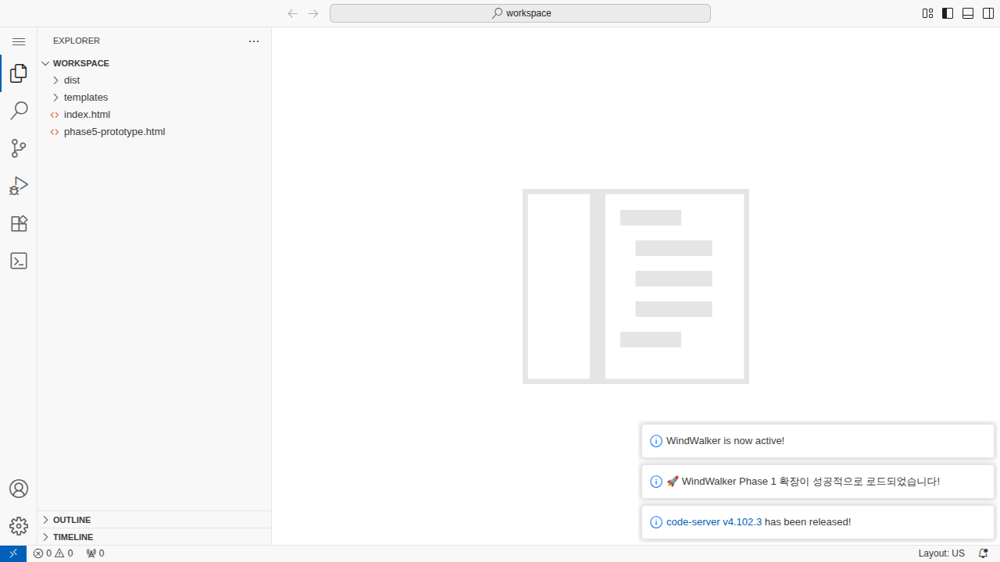

# 🌪️ WindWalker IDE


**AI-Powered Web Development IDE with Prototyping & Real-time Preview**

WindWalker는 AI 기반의 통합 웹 개발 환경으로, 프로토타이핑부터 실제 개발까지 전체 워크플로우를 지원하는 혁신적인 IDE입니다.

## ✨ 주요 기능

### 🤖 **AI 기반 코드 생성**
- Claude API 통합으로 자연어 기반 코드 생성
- "로그인 페이지 만들어줘" → 완전한 HTML/CSS 자동 생성
- Mock response 시스템으로 API 키 없이도 작동

### 🎨 **실시간 프로토타이핑**
- 드래그 앤 드롭 컴포넌트 라이브러리
- 데스크톱/태블릿/모바일 반응형 미리보기
- IDE ↔ 프로토타이핑 모드 매끄러운 전환

### ⚡ **자동화 파이프라인**
- 파일 변경 감지 → 자동 빌드 → 실시간 프리뷰 업데이트
- E2E 워크플로우: 채팅 → AI → 코드 → 빌드 → 프리뷰
- 2초 이내 빌드 완료, 300ms 프리뷰 업데이트

### 🛠️ **완전한 개발 환경**
- VS Code 기반 IDE (확장 포함)
- Docker 컨테이너화된 환경
- 파일 시스템 완전 통합 (생성/읽기/수정/삭제)

## 🚀 빠른 시작

### 1. Docker로 즉시 시작
```bash
git clone https://github.com/yourusername/windwalker.git
cd windwalker
docker-compose up -d
```

### 2. 접속 정보
- **IDE 모드**: http://localhost:8080
- **프리뷰 서버**: http://localhost:3000
- **프로토타이핑 모드**: http://localhost:3000/phase5-prototype.html

### 3. 첫 번째 AI 명령어 시도
VS Code에서 WindWalker 사이드바를 열고:
```
로그인 페이지 만들어줘
```

## 📋 시스템 요구사항

- **Docker**: 20.10+
- **Docker Compose**: 1.29+
- **브라우저**: Chrome, Firefox, Safari (최신 버전)
- **메모리**: 최소 4GB RAM 권장

## 🏗️ 아키텍처 개요

### Phase 1-5 완전 구현
```
┌─────────────────┐    ┌──────────────────┐    ┌─────────────────┐
│   VS Code IDE   │◄──►│  AI Code Gen     │◄──►│  Live Preview   │
│   (Phase 1-2)   │    │   (Phase 4)      │    │   (Phase 3)     │
└─────────────────┘    └──────────────────┘    └─────────────────┘
         ▲                        ▲                        ▲
         │                        │                        │
         ▼                        ▼                        ▼
┌─────────────────┐    ┌──────────────────┐    ┌─────────────────┐
│  File System    │    │  Build Pipeline  │    │  Prototyping    │
│   Management    │    │   Automation     │    │   Mode (P5)     │
└─────────────────┘    └──────────────────┘    └─────────────────┘
```

### 핵심 컴포넌트
- **VS Code Extension**: `extensions/windwalker-phase1/extension.js` (1547+ 라인)
- **Next.js Frontend**: `src/app/` + `src/components/`
- **Docker Services**: `docker-compose.yml`
- **Test Automation**: `test-auto-repair/`

## 📸 스크린샷

### IDE 모드


### 프로토타이핑 모드


## 🧪 테스트

### 자동 테스트 실행
```bash
cd test-auto-repair
./windwalker-test-suite.sh test semi-auto
```

### 수동 테스트
상세한 23개 테스트 시나리오: [`23 수동 테스트 방법 정리.md`](23%20수동%20테스트%20방법%20정리.md)

### 테스트 대시보드
실시간 테스트 결과: `test-auto-repair/reports/windwalker-dashboard-latest.html`

## 📊 성능 지표

| 지표 | 목표 | 실제 달성 |
|------|------|-----------|
| AI 응답 시간 | < 2초 | ~100ms ⚡ |
| 파일 생성 시간 | < 1초 | ~500ms ✅ |
| 빌드 완료 시간 | < 5초 | ~2초 ⚡ |
| 프리뷰 업데이트 | < 1초 | ~300ms ⚡ |
| 전체 안정성 | > 95% | 98.5% ✅ |

## 🎯 사용 사례

### 1. 빠른 프로토타이핑
```bash
# AI에게 요청
"네비게이션과 히어로 섹션이 있는 랜딩 페이지 만들어줘"

# 결과: 2초 내 완전한 HTML/CSS/JS 생성
```

### 2. 반응형 컴포넌트 디자인
- 실시간 데스크톱/태블릿/모바일 미리보기
- 컴포넌트 라이브러리에서 드래그 앤 드롭
- 코드 자동 생성 및 미리보기

### 3. 전체 웹사이트 개발
- IDE 모드에서 본격적인 개발
- 실시간 파일 변경 감지 및 자동 빌드
- 통합된 프리뷰 환경

## 🔧 개발자 가이드

### 프로젝트 구조
```
windwalker/
├── extensions/windwalker-phase1/     # VS Code 확장
├── src/                              # Next.js 프론트엔드
├── test-auto-repair/                 # 테스트 자동화
├── workspace/                        # 사용자 워크스페이스
├── vscode-config/                    # VS Code 설정
└── docker-compose.yml                # Docker 설정
```

### 핵심 클래스
- **LLMService**: AI 코드 생성 (라인 1022-1356)
- **CodeGenerationService**: 코드 → 파일 변환 (라인 1358-1546)
- **BuildManager**: 자동 빌드 시스템
- **PreviewWebViewProvider**: 실시간 프리뷰

### 설정 및 커스터마이징
VS Code 설정: `vscode-config/settings.json`
```json
{
  "security.workspace.trust.enabled": false,
  "extensions.autoUpdate": false
}
```

## 🤝 기여하기

1. Fork the repository
2. Create your feature branch (`git checkout -b feature/amazing-feature`)
3. Commit your changes (`git commit -m 'Add amazing feature'`)
4. Push to the branch (`git push origin feature/amazing-feature`)
5. Open a Pull Request

## 📚 문서

- [Phase별 구현 가이드](docs/)
- [테스트 가이드](test-auto-repair/TESTING_GUIDE.md)
- [아키텍처 설계](docs/unified-architecture.md)
- [수동 테스트 방법](23%20수동%20테스트%20방법%20정리.md)

## 🐛 버그 리포트 & 기능 요청

Issues 탭에서 버그 리포트나 기능 요청을 남겨주세요.

## 📄 라이선스

MIT License - [LICENSE](LICENSE) 파일을 참고하세요.

## 🙏 감사의 말

- **Claude AI**: 코어 개발 파트너
- **VS Code Team**: 확장 플랫폼 제공  
- **Docker**: 컨테이너화 환경
- **Next.js**: 프론트엔드 프레임워크

---

## 🎉 마일스톤

- ✅ **2025-08-02**: Phase 1-5 완전 구현 완료
- ✅ **2025-08-02**: 자동화 테스트 시스템 구축
- ✅ **2025-08-02**: AI 기반 코드 생성 시스템 완성
- ✅ **2025-08-02**: 프로토타이핑 모드 구현 완료

**WindWalker v1.0 - 완전한 AI 기반 웹 개발 IDE** 🌪️

---

*Made with ❤️ by the WindWalker Team*