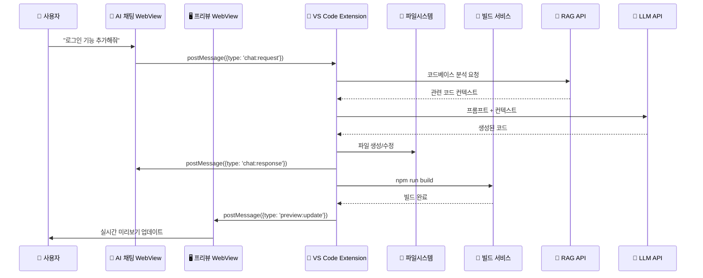
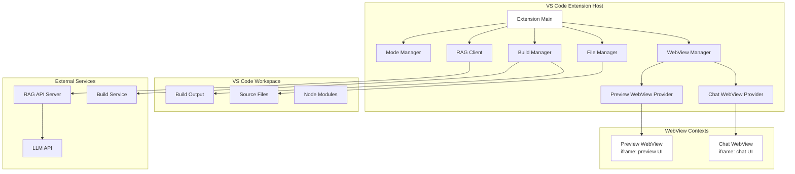

# WindWalker WebView 통신 아키텍처 및 구현

## 🔄 전체 데이터 플로우



## 🏗️ 상세 아키텍처



## 📁 프로젝트 구조

```
windwalker-extension/
├── src/
│   ├── extension.ts                    # 확장 진입점
│   ├── core/
│   │   ├── ModeManager.ts             # 모드 관리
│   │   ├── WebViewManager.ts          # WebView 관리자
│   │   ├── FileManager.ts             # 파일 시스템 관리
│   │   ├── BuildManager.ts            # 빌드 프로세스 관리
│   │   └── MessageBridge.ts           # Extension ↔ WebView 통신
│   ├── providers/
│   │   ├── ChatWebViewProvider.ts     # 채팅 WebView 제공자
│   │   └── PreviewWebViewProvider.ts  # 프리뷰 WebView 제공자
│   ├── services/
│   │   ├── RAGService.ts              # RAG API 클라이언트
│   │   ├── LLMService.ts              # LLM API 클라이언트
│   │   └── CodeGenerationService.ts   # 코드 생성 서비스
│   └── webview/
│       ├── chat/
│       │   ├── index.html             # 채팅 UI
│       │   ├── script.js              # 채팅 로직
│       │   └── style.css
│       └── preview/
│           ├── index.html             # 프리뷰 UI
│           ├── script.js              # 프리뷰 로직
│           └── style.css
├── package.json
└── README.md
```

## 🔌 핵심 구현 코드

### 1. Extension 진입점 (extension.ts)

```typescript
import * as vscode from 'vscode';
import { WebViewManager } from './core/WebViewManager';
import { FileManager } from './core/FileManager';
import { BuildManager } from './core/BuildManager';
import { ModeManager, WindWalkerMode } from './core/ModeManager';
import { MessageBridge } from './core/MessageBridge';

export function activate(context: vscode.ExtensionContext) {
    console.log('WindWalker Extension 활성화');
    
    // 핵심 매니저들 초기화
    const modeManager = new ModeManager();
    const fileManager = new FileManager(context);
    const buildManager = new BuildManager(context);
    const webViewManager = new WebViewManager(context);
    const messageBridge = new MessageBridge();
    
    // WebView들 등록
    const chatProvider = webViewManager.createChatProvider();
    const previewProvider = webViewManager.createPreviewProvider();
    
    // Message Bridge 설정 - Extension과 WebView 간 통신 허브
    messageBridge.setupCommunication(chatProvider, previewProvider, {
        fileManager,
        buildManager,
        modeManager
    });
    
    // 명령어 등록
    const commands = [
        vscode.commands.registerCommand('windwalker.switchMode', () => {
            const currentMode = modeManager.getCurrentMode();
            const newMode = currentMode === WindWalkerMode.CODE 
                ? WindWalkerMode.PROTOTYPE 
                : WindWalkerMode.CODE;
            modeManager.switchMode(newMode);
        }),
        
        vscode.commands.registerCommand('windwalker.openChat', () => {
            chatProvider.show();
        }),
        
        vscode.commands.registerCommand('windwalker.openPreview', () => {
            previewProvider.show();
        })
    ];
    
    context.subscriptions.push(...commands);
}
```

### 2. WebView Manager (WebViewManager.ts)

```typescript
import * as vscode from 'vscode';
import { ChatWebViewProvider } from '../providers/ChatWebViewProvider';
import { PreviewWebViewProvider } from '../providers/PreviewWebViewProvider';

export class WebViewManager {
    private context: vscode.ExtensionContext;
    
    constructor(context: vscode.ExtensionContext) {
        this.context = context;
    }
    
    createChatProvider(): ChatWebViewProvider {
        const provider = new ChatWebViewProvider(this.context);
        
        // WebView Provider 등록
        this.context.subscriptions.push(
            vscode.window.registerWebviewViewProvider(
                'windwalker.chatView',
                provider,
                {
                    webviewOptions: {
                        retainContextWhenHidden: true
                    }
                }
            )
        );
        
        return provider;
    }
    
    createPreviewProvider(): PreviewWebViewProvider {
        const provider = new PreviewWebViewProvider(this.context);
        
        this.context.subscriptions.push(
            vscode.window.registerWebviewViewProvider(
                'windwalker.previewView',
                provider,
                {
                    webviewOptions: {
                        retainContextWhenHidden: true
                    }
                }
            )
        );
        
        return provider;
    }
}
```

### 3. 채팅 WebView Provider (ChatWebViewProvider.ts)

```typescript
import * as vscode from 'vscode';
import * as path from 'path';

export class ChatWebViewProvider implements vscode.WebviewViewProvider {
    private _view?: vscode.WebviewView;
    private context: vscode.ExtensionContext;
    
    constructor(context: vscode.ExtensionContext) {
        this.context = context;
    }
    
    resolveWebviewView(webviewView: vscode.WebviewView): void {
        this._view = webviewView;
        
        webviewView.webview.options = {
            enableScripts: true,
            localResourceRoots: [
                vscode.Uri.joinPath(this.context.extensionUri, 'out'),
                vscode.Uri.joinPath(this.context.extensionUri, 'webview')
            ]
        };
        
        webviewView.webview.html = this.getChatHtml(webviewView.webview);
        
        // WebView → Extension 메시지 수신
        webviewView.webview.onDidReceiveMessage(async (message) => {
            switch (message.type) {
                case 'chat:request':
                    await this.handleChatRequest(message.data);
                    break;
                case 'chat:ready':
                    this.onWebViewReady();
                    break;
            }
        });
    }
    
    private async handleChatRequest(data: { message: string, mode: string }) {
        // MessageBridge를 통해 다른 컴포넌트들과 통신
        vscode.commands.executeCommand('windwalker.internal.processChatRequest', data);
    }
    
    private getChatHtml(webview: vscode.Webview): string {
        const scriptUri = webview.asWebviewUri(
            vscode.Uri.joinPath(this.context.extensionUri, 'webview', 'chat', 'script.js')
        );
        const styleUri = webview.asWebviewUri(
            vscode.Uri.joinPath(this.context.extensionUri, 'webview', 'chat', 'style.css')
        );
        
        return `
        <!DOCTYPE html>
        <html>
        <head>
            <meta charset="UTF-8">
            <meta name="viewport" content="width=device-width, initial-scale=1.0">
            <link href="${styleUri}" rel="stylesheet">
            <title>WindWalker AI Chat</title>
        </head>
        <body>
            <div id="chat-container">
                <div id="chat-messages"></div>
                <div id="chat-input-container">
                    <textarea id="chat-input" placeholder="@Codebase 로그인 기능 추가해줘"></textarea>
                    <button id="send-button">전송</button>
                </div>
            </div>
            <script src="${scriptUri}"></script>
        </body>
        </html>`;
    }
    
    // Extension → WebView 메시지 발송
    postMessage(message: any) {
        this._view?.webview.postMessage(message);
    }
    
    show() {
        this._view?.show();
    }
}
```

### 4. 채팅 WebView Script (webview/chat/script.js)

```javascript
(function() {
    const vscode = acquireVsCodeApi();
    
    // DOM 요소들
    const chatMessages = document.getElementById('chat-messages');
    const chatInput = document.getElementById('chat-input');
    const sendButton = document.getElementById('send-button');
    
    // WebView 준비 완료 알림
    vscode.postMessage({ type: 'chat:ready' });
    
    // 메시지 전송
    function sendMessage() {
        const message = chatInput.value.trim();
        if (!message) return;
        
        // 사용자 메시지 UI 추가
        addMessage('user', message);
        
        // Extension에 요청 전송
        vscode.postMessage({
            type: 'chat:request',
            data: {
                message: message,
                timestamp: Date.now()
            }
        });
        
        chatInput.value = '';
        
        // AI 응답 대기 UI
        addMessage('assistant', '생각 중...', { isLoading: true });
    }
    
    // UI에 메시지 추가
    function addMessage(sender, content, options = {}) {
        const messageDiv = document.createElement('div');
        messageDiv.className = `message ${sender}`;
        
        if (options.isLoading) {
            messageDiv.id = 'loading-message';
            messageDiv.innerHTML = `
                <div class="loading-spinner"></div>
                <span>${content}</span>
            `;
        } else {
            messageDiv.innerHTML = `