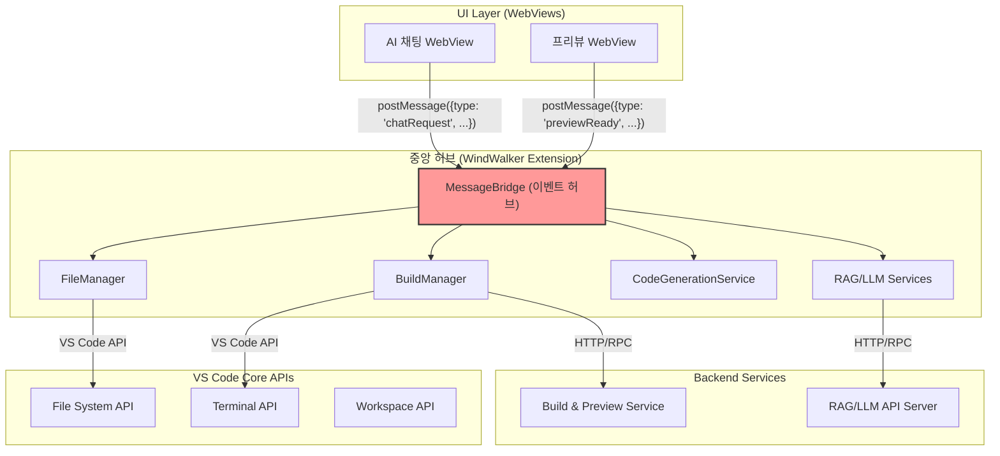
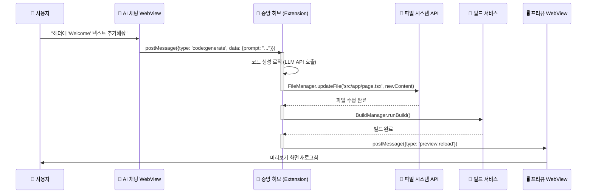

# WindWalker WebView 통신 아키텍처 및 구현 (Enhanced)

## 1. 🏗️ 아키텍처 개요: 중앙 허브(Central Hub) 모델

이 문서는 WindWalker IDE의 핵심인 **VS Code 확장(Extension)**과 사용자 인터페이스인 **웹뷰(WebView)** 간의 통신 방식을 구체적으로 정의하는 기술 설계도입니다.

우리 아키텍처의 핵심은 **VS Code 확장을 모든 기능의 '중앙 허브(Central Hub)' 또는 '오케스트레이터(Orchestrator)'로 사용하는 것**입니다. UI(웹뷰)는 사용자 요청을 받아 중앙 허브에 전달할 뿐, 실제 작업(파일 조작, 빌드, API 호출 등)은 모두 중앙 허브가 책임지고 수행합니다. 이 설계는 **관심사의 분리(SoC)** 원칙을 따르며, 시스템의 확장성과 유지보수성을 극대화합니다.



## 2. 🔄 전체 데이터 플로우 (시퀀스 다이어그램)

사용자의 간단한 요청이 어떻게 중앙 허브를 통해 처리되는지 보여줍니다.



## 3. 🔌 핵심 구현 코드 (설계)

### 3.1. `extension.ts` (메인 진입점)

```typescript
// [의도] WindWalker 확장의 시작점. 모든 관리자(Manager)와 공급자(Provider)를 초기화하고, VS Code에 등록하여 중앙 허브의 기반을 마련합니다.
// [책임] 각 모듈의 인스턴스 생성 및 생명주기 관리, 명령어 등록.

import * as vscode from 'vscode';
import { WebViewManager } from './core/WebViewManager';
import { MessageBridge } from './core/MessageBridge';

export function activate(context: vscode.ExtensionContext) {
    console.log('WindWalker is now active!');

    // 1. 핵심 매니저들 초기화
    const webViewManager = new WebViewManager(context.extensionUri);
    const messageBridge = new MessageBridge(); // 모든 통신을 관장할 허브

    // 2. WebView 공급자(Provider) 생성 및 등록
    const chatProvider = webViewManager.createChatWebViewProvider(context);
    const previewProvider = webViewManager.createPreviewWebViewProvider(context);

    // 3. 메시지 브리지 설정: 각 컴포넌트가 서로 통신할 수 있도록 연결
    messageBridge.setup({
        chatWebView: chatProvider,
        previewWebView: previewProvider,
        // 향후 FileManager, BuildManager 등을 여기에 연결
    });

    // 4. 명령어 등록 (예: 사이드바 열기)
    context.subscriptions.push(
        vscode.commands.registerCommand('windwalker.showChat', () => {
            chatProvider.show();
        })
    );
}

export function deactivate() {}
```

### 3.2. `core/MessageBridge.ts` (통신 허브)

```typescript
// [의도] 확장과 웹뷰 간의 모든 메시지를 중계하고, 올바른 담당자에게 작업을 위임하는 중앙 통제실 역할을 합니다.
// [책임] 메시지 수신, 메시지 타입에 따른 담당 모듈 호출, 결과 전달.

import { ChatWebViewProvider } from '../providers/ChatWebViewProvider';
import { PreviewWebViewProvider } from '../providers/PreviewWebViewProvider';

export class MessageBridge {
    private chatWebViewProvider?: ChatWebViewProvider;
    private previewWebViewProvider?: PreviewWebViewProvider;

    public setup(providers: {
        chatWebView: ChatWebViewProvider;
        previewWebView: PreviewWebViewProvider;
    }) {
        this.chatWebViewProvider = providers.chatWebView;
        this.previewWebViewProvider = providers.previewWebView;

        // 각 웹뷰로부터 오는 메시지를 리스닝
        this.chatWebViewProvider.onDidReceiveMessage(this.handleChatMessage.bind(this));
        this.previewWebViewProvider.onDidReceiveMessage(this.handlePreviewMessage.bind(this));
    }

    private handleChatMessage(message: any) {
        // [책임] 채팅 웹뷰에서 온 메시지를 종류에 따라 처리
        switch (message.type) {
            case 'chat:ready':
                console.log('Chat WebView is ready.');
                // 초기 상태나 데이터가 있다면 여기서 전송
                this.chatWebViewProvider?.postMessage({ type: 'system:info', data: 'Welcome to WindWalker!' });
                break;
            case 'code:generate':
                // TODO: CodeGenerationService 호출 로직
                console.log('Received code generation request:', message.data.prompt);
                break;
            // ... 다른 메시지 타입 처리
        }
    }

    private handlePreviewMessage(message: any) {
        // [책임] 프리뷰 웹뷰에서 온 메시지를 처리
        switch (message.type) {
            case 'preview:ready':
                console.log('Preview WebView is ready.');
                break;
            // ...
        }
    }
}
```

### 3.3. `providers/ChatWebViewProvider.ts` (채팅 웹뷰 공급자)

```typescript
// [의도] VS Code 사이드바에 'AI 채팅' 웹뷰를 생성하고 관리합니다.
// [책임] 웹뷰의 HTML 컨텐츠 제공, 웹뷰와의 메시지 송수신(postMessage) 처리.

import * as vscode from 'vscode';
import * as path from 'path';
import * as fs from 'fs';

export class ChatWebViewProvider implements vscode.WebviewViewProvider {
    public static readonly viewType = 'windwalker.chatView';
    private _view?: vscode.WebviewView;
    private _extensionUri: vscode.Uri;
    private _onDidReceiveMessage = new vscode.EventEmitter<any>();
    public readonly onDidReceiveMessage: vscode.Event<any> = this._onDidReceiveMessage.event;

    constructor(extensionUri: vscode.Uri) {
        this._extensionUri = extensionUri;
    }

    resolveWebviewView(webviewView: vscode.WebviewView) {
        this._view = webviewView;

        webviewView.webview.options = {
            enableScripts: true,
            localResourceRoots: [vscode.Uri.joinPath(this._extensionUri, 'webview')]
        };

        webviewView.webview.html = this._getHtmlForWebview(webviewView.webview);

        // 웹뷰로부터 메시지를 받으면 EventEmitter를 통해 외부(MessageBridge)로 전달
        webviewView.webview.onDidReceiveMessage(message => {
            this._onDidReceiveMessage.fire(message);
        });
    }

    // 외부에서 웹뷰로 메시지를 보내는 함수
    public postMessage(message: any) {
        if (this._view) {
            this._view.webview.postMessage(message);
        }
    }

    public show() {
      if (this._view) {
        this._view.show(true);
      }
    }

    private _getHtmlForWebview(webview: vscode.Webview): string {
        // [책임] 웹뷰에 삽입될 HTML 컨텐츠를 생성하고, 스크립트/스타일시트 파일의 경로를 올바르게 설정
        const scriptPath = vscode.Uri.joinPath(this._extensionUri, 'webview', 'chat', 'script.js');
        const stylePath = vscode.Uri.joinPath(this._extensionUri, 'webview', 'chat', 'style.css');

        const scriptUri = webview.asWebviewUri(scriptPath);
        const styleUri = webview.asWebviewUri(stylePath);
        
        const nonce = getNonce();

        return `
            <!DOCTYPE html>
            <html lang="en">
            <head>
                <meta charset="UTF-8">
                <meta name="viewport" content="width=device-width, initial-scale=1.0">
                <link href="${styleUri}" rel="stylesheet">
                <title>WindWalker AI Chat</title>
            </head>
            <body>
                <div id="chat-container"></div>
                <script nonce="${nonce}" src="${scriptUri}"></script>
            </body>
            </html>`;
    }
}

function getNonce() {
    let text = '';
    const possible = 'ABCDEFGHIJKLMNOPQRSTUVWXYZabcdefghijklmnopqrstuvwxyz0123456789';
    for (let i = 0; i < 32; i++) {
        text += possible.charAt(Math.floor(Math.random() * possible.length));
    }
    return text;
}
```

### 3.4. `webview/chat/script.js` (채팅 UI 클라이언트 스크립트)

```javascript
// [의도] 사용자와 상호작용하는 실제 채팅 UI의 동작을 담당합니다.
// [책임] 확장으로부터 메시지 수신, UI 렌더링, 사용자 입력 이벤트를 받아 확장으로 메시지 전송.

// 즉시 실행 함수를 사용하여 전역 스코프 오염 방지
(function() {
    // VS Code와 통신하기 위한 API 객체 획득
    const vscode = acquireVsCodeApi();

    // UI 요소 획득
    const chatContainer = document.getElementById('chat-container');
    
    // 초기 렌더링: 입력창과 전송 버튼 생성
    chatContainer.innerHTML = `
        <div id="messages" style="height: calc(100vh - 60px); overflow-y: auto; padding: 10px;"></div>
        <div id="input-area" style="position: fixed; bottom: 0; width: 100%; padding: 10px; background-color: #252526;">
            <textarea id="chat-input" placeholder="무엇을 도와드릴까요?"></textarea>
            <button id="send-button" style="width: 60px;">전송</button>
        </div>
    `;

    const messagesDiv = document.getElementById('messages');
    const chatInput = document.getElementById('chat-input');
    const sendButton = document.getElementById('send-button');

    // 확장(Extension)에 웹뷰가 준비되었음을 알림
    vscode.postMessage({ type: 'chat:ready' });

    // 전송 버튼 클릭 이벤트 핸들러
    sendButton.addEventListener('click', () => {
        const message = chatInput.value.trim();
        if (message) {
            // 사용자 메시지를 UI에 추가
            addMessage('user', message);

            // 확장에 'code:generate' 타입의 메시지 전송
            vscode.postMessage({
                type: 'code:generate',
                data: { prompt: message }
            });
            chatInput.value = '';
        }
    });

    // 확장으로부터 메시지 수신
    window.addEventListener('message', event => {
        const message = event.data;
        switch (message.type) {
            case 'system:info':
                addMessage('system', message.data);
                break;
            // ... 다른 메시지 타입 처리
        }
    });

    // 메시지를 UI에 추가하는 헬퍼 함수
    function addMessage(sender, text) {
        const messageElement = document.createElement('div');
        messageElement.className = `message ${sender}`;
        messageElement.textContent = text;
        messagesDiv.appendChild(messageElement);
        messagesDiv.scrollTop = messagesDiv.scrollHeight; // 자동 스크롤
    }
}());
```

## 4. 🎨 UI 레이아웃 전환 구현

`05`번 문서의 철학에 따라, 각 모드의 레이아웃은 다음과 같이 구현합니다.

-   **프로토타이핑 모드 (Next.js 웹):**
    -   **책임:** `src/app/page.tsx` 또는 레이아웃 컴포넌트가 담당합니다.
    -   **구현:** CSS Grid 또는 Flexbox를 사용하여 좌측에는 AI 채팅 패널(`PrototypingView`), 우측에는 프리뷰 패널을 배치하는 2단 레이아웃을 구현합니다.

-   **코드 모드 (VS Code 확장):**
    -   **책임:** 확장의 `package.json` 파일 내 `contributes` 섹션이 담당합니다.
    -   **구현:**
        1.  `"viewsContainers"`에 `activitybar` 위치를 지정하여 'WindWalker'라는 이름의 커스텀 사이드바 아이콘을 생성합니다.
        2.  `"views"`에 'WindWalker' 컨테이너 내부를 정의합니다. 여기에 `windwalker.chatView`와 `windwalker.previewView` 두 개의 웹뷰(WebView)를 등록하여 상하 분할 레이아웃을 만듭니다.

## 5. 🚀 구현 우선순위 및 일정 (제안)

이 아키텍처를 기반으로 한 구체적인 구현 로드맵입니다.

-   **Week 1-2: 기본 통신 아키텍처 확립 (가장 중요)**
    -   [ ] **Task 1:** `extension.ts`에서 `MessageBridge`와 `ChatWebViewProvider`를 초기화하고 등록합니다.
    -   [ ] **Task 2:** `ChatWebViewProvider`가 `webview/chat/index.html`과 `script.js`를 로드하도록 구현합니다.
    -   [ ] **Task 3 (핵심 검증):** 채팅 웹뷰에서 메시지를 입력하면 `postMessage`를 통해 Extension으로 전달되고, Extension이 다시 응답 메시지를 웹뷰로 보내 UI에 표시되는지 **기본 통신 루프**를 완벽하게 검증합니다.

-   **Week 3: 파일 시스템 연동**
    -   [ ] **Task 4:** `FileManager` 모듈을 구현하고 `MessageBridge`에 연결합니다.
    -   [ ] **Task 5:** 채팅 웹뷰에서 "파일 생성: a.txt, 내용: Hello" 같은 특정 형식의 메시지를 보내면, `FileManager`가 실제 워크스페이스에 `a.txt`를 생성하도록 구현합니다.

-   **Week 4: 빌드 및 프리뷰 연동**
    -   [ ] **Task 6:** `PreviewWebViewProvider`와 `BuildManager`를 구현합니다.
    -   [ ] **Task 7:** 파일 저장이 감지되면 `BuildManager`가 `npm run dev` 같은 터미널 명령을 실행하고, `PreviewWebView`가 해당 개발 서버(예: `localhost:9003`)를 로드하도록 구현합니다.

-   **Week 5-6: AI 서비스 연동**
    -   [ ] **Task 8:** 실제 `CodeGenerationService`와 RAG/LLM API 클라이언트를 구현합니다.
    -   [ ] **Task 9:** 전체 플로우를 연결합니다: **채팅 입력 → AI 코드 생성 → `FileManager`로 파일 수정 → `BuildManager`로 자동 빌드 → `PreviewWebView` 자동 새로고침.**

이 문서는 `06`번 문서의 아이디어를 계승하면서도, **`MessageBridge`를 통한 중앙 집중형 통신 구조**와 **각 모듈의 명확한 역할 분담**을 강조하여 실제 개발에 바로 적용할 수 있도록 구체화했습니다.