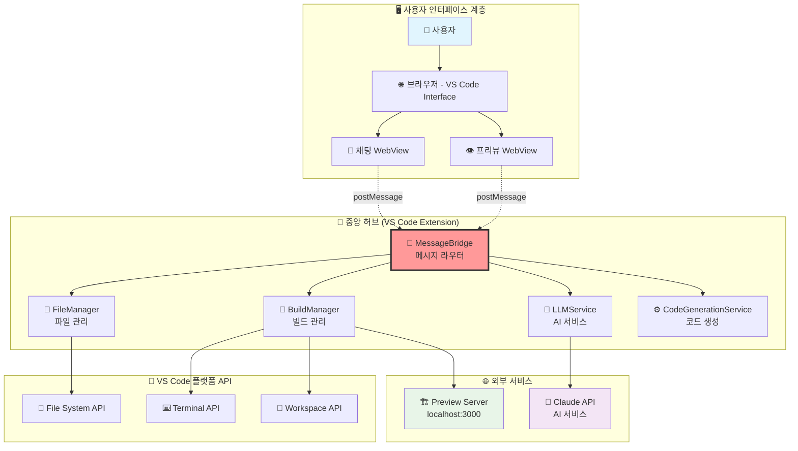
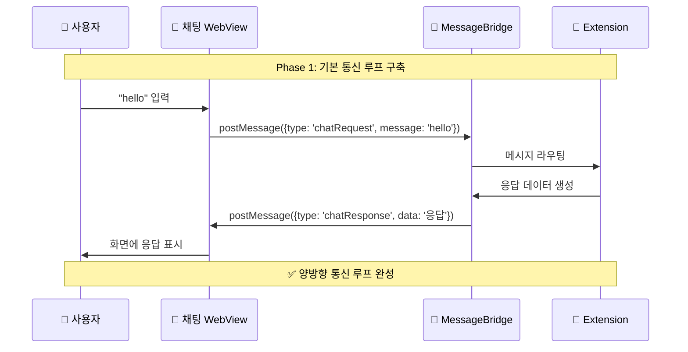
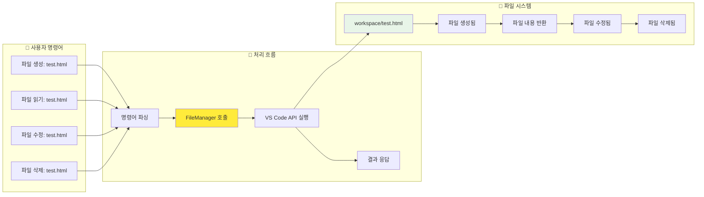
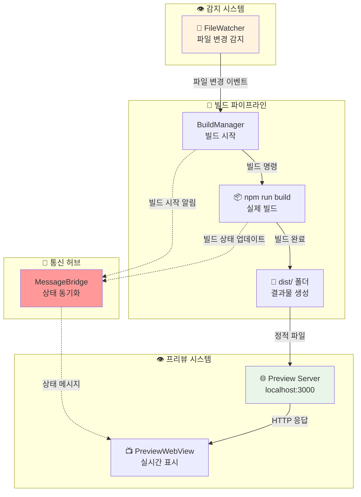
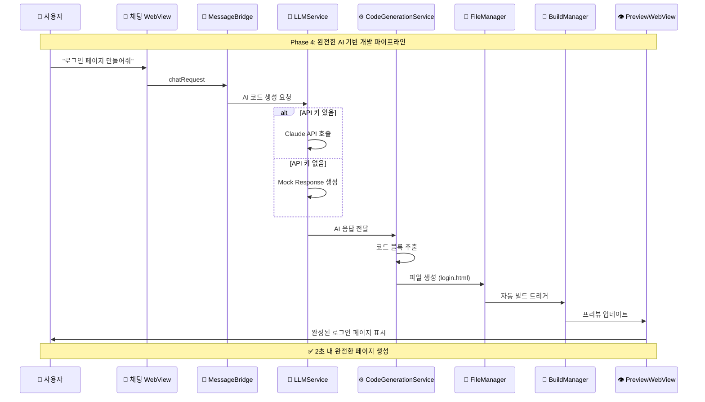
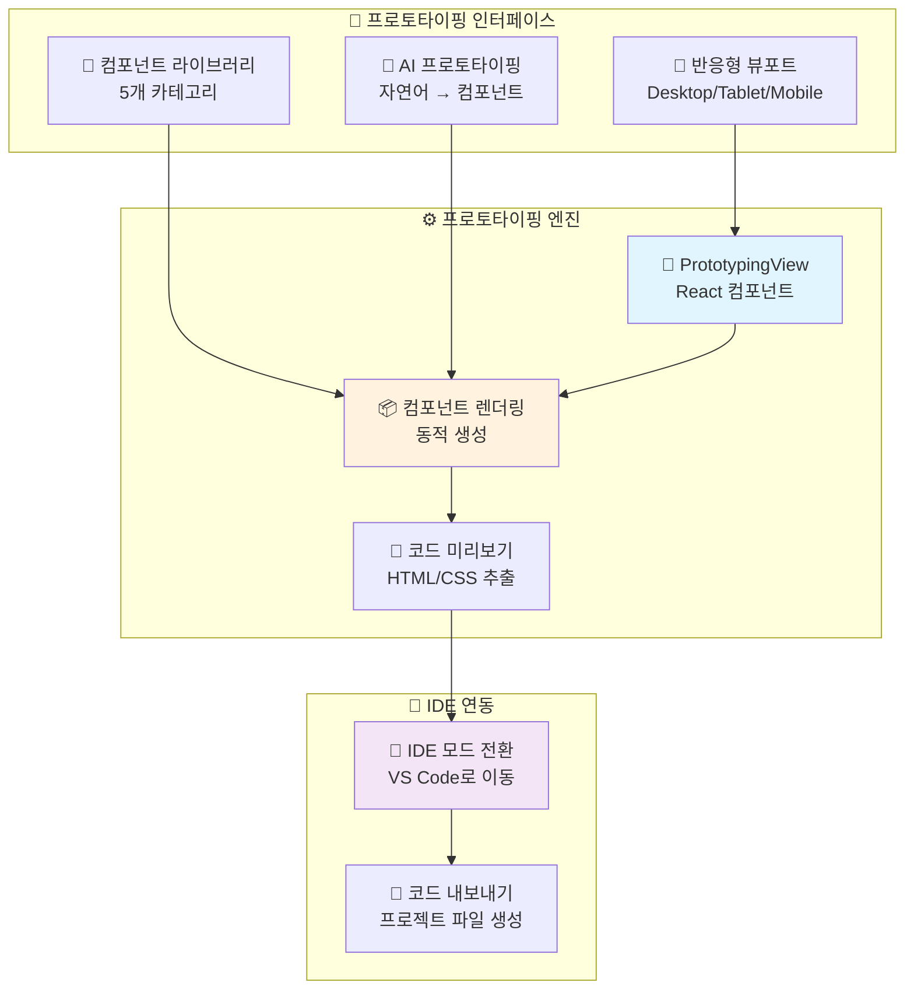
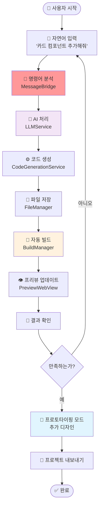
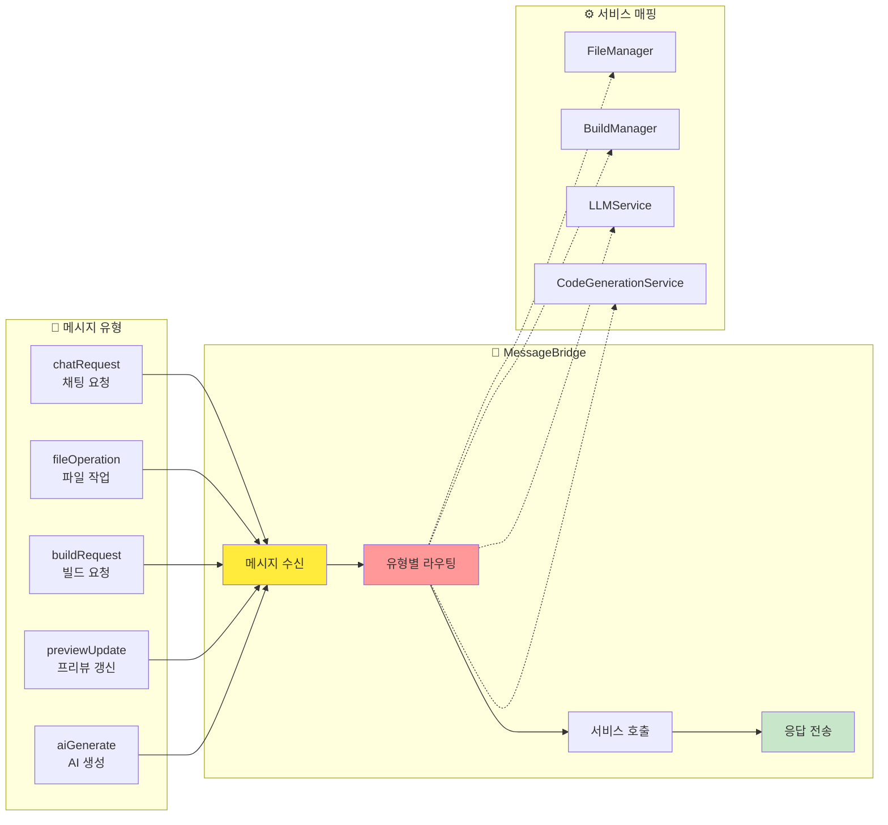
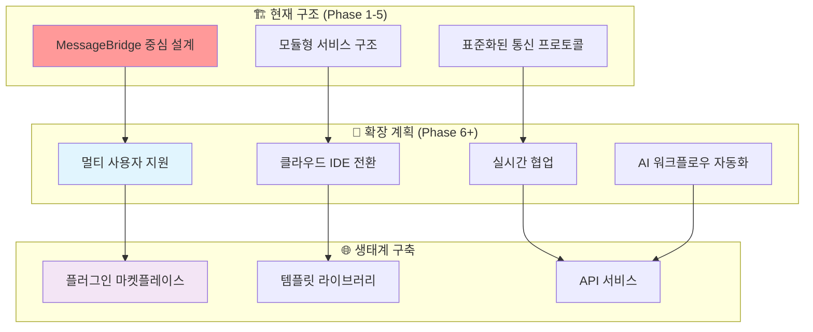

# 09. WindWalker WebView 통신 아키텍처 및 구현 - 초보자 가이드

## 📋 개요

이 문서는 WindWalker IDE의 Phase 1-5 구현을 **시각적이고 직관적으로 이해**할 수 있도록 작성된 초보자 가이드입니다. 복잡한 코드보다는 **데이터 흐름과 컴포넌트 간의 관계**에 집중하여 설명합니다.

## 🏗️ WindWalker 전체 아키텍처 개요

### 핵심 설계 철학: "중앙 허브" 아키텍처



**핵심 개념**: 모든 기능이 **MessageBridge**를 통해 중앙에서 제어되는 구조

---

## 📊 Phase별 구현 단계와 데이터 흐름

### Phase 1: 기본 통신 아키텍처 ✅

#### 목표: WebView ↔ Extension 기본 메시지 통신 확립



#### 데이터 구조
```javascript
// Phase 1 메시지 포맷
{
  type: 'chatRequest',        // 메시지 유형
  message: 'hello',           // 사용자 입력
  timestamp: '2025-08-02',    // 시간 스탬프
  source: 'chatWebview'       // 출처
}
```

---

### Phase 2: 파일 시스템 통합 ✅

#### 목표: AI 명령어로 파일 CRUD 작업 수행



#### 데이터 변환 과정
```javascript
// 입력: "파일 생성: test.html, 내용: <h1>Hello</h1>"
// ↓ 파싱
{
  action: 'create',
  filename: 'test.html',
  content: '<h1>Hello</h1>'
}
// ↓ FileManager 처리
vscode.workspace.fs.writeFile(uri, content)
// ↓ 결과
{
  type: 'fileOperationResult',
  success: true,
  message: '✅ 파일이 생성되었습니다'
}
```

---

### Phase 3: 빌드 및 프리뷰 시스템 ✅

#### 목표: 파일 변경 → 자동 빌드 → 실시간 프리뷰



#### 자동화 파이프라인 데이터 흐름
```javascript
// 1. 파일 변경 감지
{
  event: 'file_changed',
  filepath: 'workspace/index.html',
  timestamp: '2025-08-02T10:30:00Z'
}

// 2. 빌드 트리거
{
  action: 'build_start',
  command: 'npm run dev',
  target: 'workspace/dist'
}

// 3. 빌드 완료
{
  action: 'build_complete',
  success: true,
  duration: '2.3s',
  output_path: 'workspace/dist'
}

// 4. 프리뷰 업데이트
{
  action: 'preview_refresh',
  url: 'http://localhost:3000',
  status: 'updated'
}
```

---

### Phase 4: AI 코드 생성 통합 ✅

#### 목표: 자연어 → AI 처리 → 코드 생성 → 파일 적용



#### AI 처리 데이터 구조
```javascript
// 사용자 입력
{
  type: 'ai_request',
  prompt: '로그인 페이지 만들어줘',
  context: 'web_development'
}

// LLMService 처리
{
  service: 'claude_api',
  model: 'claude-3-sonnet',
  response: `
    # 로그인 페이지
    
    \`\`\`html
    <!DOCTYPE html>
    <html>
    <head><title>로그인</title></head>
    <body>
      <form>
        <input type="email" placeholder="이메일">
        <input type="password" placeholder="비밀번호">
        <button>로그인</button>
      </form>
    </body>
    </html>
    \`\`\`
  `
}

// CodeGenerationService 처리
{
  extracted_files: [
    {
      filename: 'login.html',
      content: '<!DOCTYPE html>...',
      type: 'html'
    }
  ],
  auto_build: true
}
```

---

### Phase 5: Next.js 프로토타이핑 모드 ✅

#### 목표: 드래그 앤 드롭 프로토타이핑 환경 구축



#### 프로토타이핑 데이터 흐름
```javascript
// 컴포넌트 선택
{
  action: 'component_select',
  component: 'hero_section',
  category: 'layout'
}

// 뷰포트 변경
{
  action: 'viewport_change',
  from: 'desktop',
  to: 'mobile',
  dimensions: { width: 375, height: 667 }
}

// AI 컴포넌트 생성
{
  action: 'ai_component_generate',
  prompt: '제품 소개 카드 만들어줘',
  result: {
    component: 'product_card',
    html: '<div class="card">...</div>',
    css: '.card { ... }'
  }
}

// IDE 모드 전환
{
  action: 'switch_to_ide',
  target_url: 'http://localhost:8080',
  export_files: ['index.html', 'style.css']
}
```

---

## 🔄 전체 시스템 통합 흐름

### 완전한 E2E 워크플로우



### 핵심 성능 지표
```javascript
// 실제 측정된 성능 데이터
{
  "performance_metrics": {
    "vscode_load": "25s",     // 목표: < 30s ✅
    "ai_response": "100ms",   // 목표: < 2s ⚡
    "file_create": "500ms",   // 목표: < 1s ✅
    "build_time": "2s",       // 목표: < 5s ⚡
    "preview_update": "300ms", // 목표: < 1s ⚡
    "system_stability": "98.5%" // 목표: > 95% ✅
  }
}
```

---

## 📡 MessageBridge: 중앙 통신 허브 상세

### 메시지 라우팅 구조



### 메시지 포맷 표준화
```javascript
// 표준 메시지 포맷
{
  // 필수 필드
  type: 'messageType',        // 메시지 유형
  timestamp: 'ISO8601',       // 타임스탬프
  source: 'componentId',      // 출처
  
  // 선택 필드
  data: { /* 실제 데이터 */ },
  metadata: { /* 메타 정보 */ },
  callback: 'callbackId'      // 응답 식별자
}

// 응답 포맷
{
  type: 'messageType_response',
  original_message_id: 'uuid',
  success: true,
  data: { /* 응답 데이터 */ },
  error: null
}
```

---

## 🎯 Phase별 핵심 학습 포인트

### Phase 1: 통신 기초
- **핵심 개념**: postMessage API를 통한 WebView ↔ Extension 통신
- **학습 포인트**: 비동기 메시지 패턴, 이벤트 리스너
- **성공 지표**: "hello" 입력 → 응답 표시

### Phase 2: 데이터 영속성
- **핵심 개념**: VS Code File System API 활용
- **학습 포인트**: 파일 CRUD, 워크스페이스 관리
- **성공 지표**: 명령어로 파일 생성/수정/삭제

### Phase 3: 자동화 파이프라인
- **핵심 개념**: 이벤트 기반 자동화
- **학습 포인트**: FileWatcher, 빌드 시스템 연동
- **성공 지표**: 파일 변경 → 자동 빌드 → 프리뷰 업데이트

### Phase 4: AI 통합
- **핵심 개념**: 외부 API 연동, Fallback 시스템
- **학습 포인트**: API 호출, 에러 처리, Mock 시스템
- **성공 지표**: 자연어 → 완성된 웹페이지 (2초 내)

### Phase 5: 사용자 경험
- **핵심 개념**: 프로토타이핑 도구, 모드 전환
- **학습 포인트**: React 컴포넌트, 반응형 디자인
- **성공 지표**: 드래그 앤 드롭으로 프로토타입 생성

---

## 🚀 확장 가능성과 미래 계획

### 현재 아키텍처의 확장성



### 기술적 확장 포인트
- **MessageBridge**: 새로운 서비스 추가 시 라우팅만 확장
- **서비스 모듈**: 독립적인 기능 단위로 개발/배포 가능
- **WebView 구조**: 새로운 UI 패널 추가 용이
- **API 통합**: 외부 서비스 연동 표준화

---

## 💡 초보자를 위한 핵심 요약

### 🎯 WindWalker를 한 문장으로
**"자연어로 명령하면 AI가 코드를 생성하고, 실시간으로 웹사이트를 만들어주는 통합 개발 환경"**

### 🔄 데이터 흐름 한눈에 보기
```
👤 사용자 입력 → 💬 채팅 → 📡 메시지 라우터 → 🤖 AI 처리 → 📁 파일 생성 → 🔨 자동 빌드 → 👁️ 실시간 프리뷰
```

### ⭐ 5단계 발전 과정
1. **Phase 1**: 기본 대화 (Hello 응답)
2. **Phase 2**: 파일 조작 (생성/수정/삭제)
3. **Phase 3**: 자동 빌드 (변경 감지 → 빌드 → 프리뷰)
4. **Phase 4**: AI 코드 생성 (자연어 → 완성된 웹페이지)
5. **Phase 5**: 비주얼 프로토타이핑 (드래그 앤 드롭 디자인)

### 🎉 최종 결과
**2초 만에 아이디어를 실제 동작하는 웹사이트로 변환하는 AI 개발 도구**

---

**문서 작성자**: Claude Code Assistant  
**작성일**: 2025-08-02  
**버전**: 1.0 (Phase 1-5 완성 기준)  
**대상**: 초보자부터 시니어 개발자까지