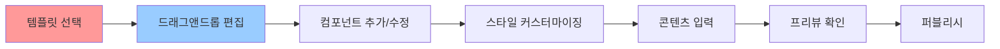
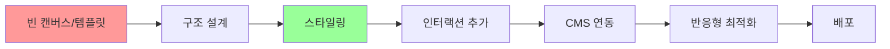
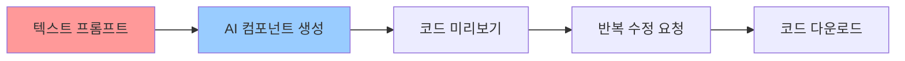
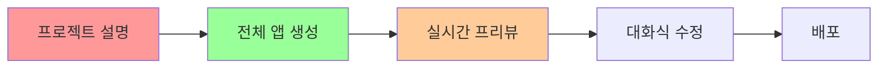
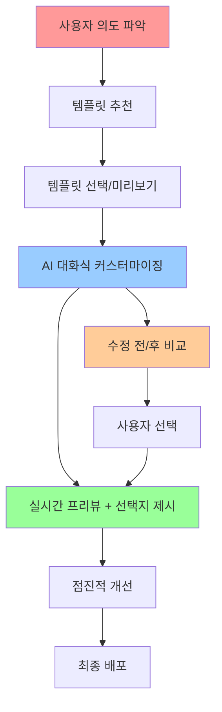

# WindWalker AI 대화식 웹사이트 빌더 워크플로우 설계

## 🎯 목표: "템플릿 가이드 + AI 자유도" 하이브리드 접근법

**핵심 컨셉**: 사용자가 템플릿 선택으로 시작하되, AI 대화를 통해 무한히 커스터마이징 가능한 워크플로우

## 📊 기존 서비스 분석 및 벤치마킹

### 🏗️ 수동 웹사이트 빌더 (Wix, Webflow)

#### Wix 워크플로우 분석


**Wix 강점:**
- 375+ 전문적으로 디자인된 템플릿과 와이어프레임
- 직관적인 드래그앤드롭 인터페이스로 요소를 정확한 위치에 배치
- 즉시 시각적 피드백

**Wix 한계:**
- 수동 작업 중심 → 시간 소모적
- 디자인 지식 필요
- 반복적인 작업

#### Webflow 워크플로우 분석


**Webflow 강점:**
- 코드 수준의 정밀한 제어
- 재사용 가능한 템플릿과 동적 콘텐츠
- 전문적인 디자인 능력

**Webflow 한계:**
- 학습 곡선 가파름
- 비개발자에게는 복잡

### 🤖 AI 대화식 빌더 (V0, Lovable)

#### Vercel V0 워크플로우


**V0 강점:**
- ChatGPT 유사한 직관적 채팅 인터페이스
- 텍스트 프롬프트에서 프로덕션 레디 코드 생성
- React + Tailwind 기반

**V0 한계:**
- 주로 React 컴포넌트 생성에 집중
- 전체 사이트보다는 개별 컴포넌트 중심
- 템플릿 가이드 부족

#### Lovable 워크플로우


**Lovable 강점:**
- 채팅 인터페이스만으로 소프트웨어 제품 구축
- 비기술 사용자도 풀스택 앱을 몇 분 만에 구축
- 전체 애플리케이션 생성

**Lovable 한계:**
- 템플릿 기반 시작점 부족
- 디자인 일관성 확보 어려움
- 복잡한 요구사항 처리 한계

## 🚀 WindWalker 차별화된 워크플로우 설계

### 핵심 혁신: "템플릿 가이드 + AI 진화" 하이브리드



## 🎨 상세 워크플로우 설계

### Phase 1: 인텐트 기반 템플릿 추천 (Smart Template Discovery)

#### 1.1 사용자 의도 파악 대화
```typescript
// AI 프롬프트 엔지니어링 예시
const intentDiscoveryPrompt = `
사용자: "온라인 쇼핑몰 만들고 싶어요"

AI 분석 결과:
{
  "intent": "ecommerce",
  "industry": "retail", 
  "complexity": "medium",
  "features": ["product_catalog", "shopping_cart", "payment"],
  "target_audience": "general_consumers",
  "design_preference": "modern_clean"
}
`;
```

#### 1.2 템플릿 매칭 시스템
```javascript
// 템플릿 메타데이터 구조
const templateMetadata = {
  "ecommerce-modern": {
    id: "ecommerce-modern",
    name: "모던 이커머스",
    category: "ecommerce",
    features: ["product_grid", "cart", "checkout", "user_auth"],
    style: "modern_minimalist",
    components: {
      header: "HeaderWithCart",  
      hero: "ProductShowcase",
      catalog: "ProductGrid",
      footer: "EcommerceFooter"
    },
    customizationPoints: [
      "brand_colors", "typography", "product_categories", "payment_methods"
    ]
  }
};
```

#### 1.3 스마트 추천 알고리즘
```typescript
interface TemplateRecommendation {
  template: Template;
  matchScore: number;
  reasons: string[];
  previewUrl: string;
}

class TemplateRecommendationEngine {
  async recommendTemplates(userIntent: UserIntent): Promise<TemplateRecommendation[]> {
    const templates = await this.getTemplatesByCategory(userIntent.intent);
    
    return templates.map(template => ({
      template,
      matchScore: this.calculateMatchScore(template, userIntent),
      reasons: this.generateReasons(template, userIntent),
      previewUrl: this.generatePreviewUrl(template, userIntent)
    })).sort((a, b) => b.matchScore - a.matchScore);
  }
}
```

### Phase 2: 대화식 커스터마이징 (Conversational Customization)

#### 2.1 컨텍스트 인식 AI 프롬프트
```typescript
const customizationPrompt = `
당신은 WindWalker의 웹사이트 커스터마이징 AI입니다.

현재 컨텍스트:
- 선택된 템플릿: ${selectedTemplate.name}
- 사용 가능한 컴포넌트: ${availableComponents.join(', ')}
- 현재 브랜드 컬러: ${currentBrandColors}
- 수정 가능한 요소: ${customizationPoints.join(', ')}

사용자 요청: "${userMessage}"

응답 규칙:
1. 템플릿 구조 내에서만 수정 제안
2. 브랜드 일관성 유지
3. 구체적인 변경사항을 JSON 형태로 제시
4. 수정 전/후 비교 이미지 포함
5. 대안 옵션 3개 제공

응답 형식:
{
  "changes": [
    {
      "component": "Header",
      "property": "backgroundColor", 
      "oldValue": "#ffffff",
      "newValue": "#1a1a1a",
      "reason": "더 모던한 느낌을 위해 다크 헤더로 변경"
    }
  ],
  "alternatives": [
    { "option": "A", "description": "...", "preview": "..." },
    { "option": "B", "description": "...", "preview": "..." },
    { "option": "C", "description": "...", "preview": "..." }
  ],
  "explanation": "요청하신 모던하고 미니멀한 느낌을 위해..."
}
`;
```

#### 2.2 점진적 개선 메커니즘
```typescript
interface ModificationHistory {
  timestamp: Date;
  userRequest: string;
  appliedChanges: Change[];
  userFeedback: 'accepted' | 'rejected' | 'modified';
  alternativeChosen?: string;
}

class ProgressiveRefinementEngine {
  private history: ModificationHistory[] = [];
  
  async processUserRequest(request: string): Promise<CustomizationResponse> {
    // 1. 이전 컨텍스트 분석
    const context = this.buildContextFromHistory();
    
    // 2. AI로 변경사항 생성
    const response = await this.generateCustomization(request, context);
    
    // 3. 수정 전/후 비교 생성
    const comparison = await this.generateComparison(response.changes);
    
    // 4. 대안 옵션 제시
    const alternatives = await this.generateAlternatives(request, context);
    
    return {
      changes: response.changes,
      comparison,
      alternatives,
      explanation: response.explanation
    };
  }
}
```

### Phase 3: 실시간 비교 및 선택 (Real-time Comparison & Selection)

#### 3.1 수정 전/후 비교 UI
```typescript
interface ComparisonView {
  before: {
    screenshot: string;
    codeSnippet: string;
    description: string;
  };
  after: {
    screenshot: string;
    codeSnippet: string;
    description: string;
  };
  changes: DetailedChange[];
}

// WebView에서 비교 UI 렌더링
const comparisonHtml = `
<div class="comparison-container">
  <div class="before-after">
    <div class="before">
      <h3>현재 (Before)</h3>
      
      <div class="code-diff">${before.codeSnippet}</div>
    </div>
    <div class="after">
      <h3>수정 후 (After)</h3>  
      
      <div class="code-diff highlighted">${after.codeSnippet}</div>
    </div>
  </div>
  
  <div class="action-buttons">
    <button onclick="applyChanges()">✅ 적용</button>
    <button onclick="rejectChanges()">❌ 거부</button>
    <button onclick="requestModification()">🔄 수정 요청</button>
  </div>
  
  <div class="alternatives">
    <h4>다른 옵션들</h4>
    ${alternatives.map(alt => `
      <div class="alternative" onclick="selectAlternative('${alt.id}')">
        
        <p>${alt.description}</p>
      </div>
    `).join('')}
  </div>
</div>
`;
```

#### 3.2 지능적 선택지 생성
```typescript
class AlternativeGenerator {
  async generateAlternatives(
    originalRequest: string, 
    currentChanges: Change[]
  ): Promise<Alternative[]> {
    
    const alternatives = [];
    
    // 1. 보수적 옵션 (최소 변경)
    alternatives.push({
      id: 'conservative',
      type: 'minimal',
      description: '기존 디자인 유지하며 미세 조정',
      changes: this.minimizeChanges(currentChanges),
      intensity: 0.3
    });
    
    // 2. 균형적 옵션 (원래 제안)
    alternatives.push({
      id: 'balanced', 
      type: 'balanced',
      description: '요청사항을 균형있게 반영',
      changes: currentChanges,
      intensity: 0.6
    });
    
    // 3. 대담한 옵션 (큰 변화)
    alternatives.push({
      id: 'bold',
      type: 'dramatic', 
      description: '과감한 디자인 변화로 임팩트 극대화',
      changes: this.amplifyChanges(currentChanges),
      intensity: 0.9
    });
    
    return alternatives;
  }
}
```

## 🔧 핵심 구현 컴포넌트

### 1. 템플릿 관리 시스템
```typescript
// src/services/TemplateService.ts
export class TemplateService {
  private templates: Map<string, Template> = new Map();
  
  async loadTemplates(): Promise<void> {
    // 템플릿 메타데이터 로드
    const templateConfigs = await this.fetchTemplateConfigs();
    
    for (const config of templateConfigs) {
      const template = await this.buildTemplate(config);
      this.templates.set(config.id, template);
    }
  }
  
  async recommendTemplates(intent: UserIntent): Promise<TemplateRecommendation[]> {
    // AI 기반 템플릿 추천 로직
  }
  
  private async buildTemplate(config: TemplateConfig): Promise<Template> {
    return {
      id: config.id,
      name: config.name,
      components: await this.loadTemplateComponents(config),
      customizationPoints: config.customizationPoints,
      metadata: config.metadata
    };
  }
}
```

### 2. 대화형 커스터마이징 엔진
```typescript
// src/services/ConversationalCustomizer.ts
export class ConversationalCustomizer {
  private llmService: LLMService;
  private templateService: TemplateService;
  private history: ConversationHistory;
  
  async processCustomizationRequest(
    request: string,
    currentTemplate: Template
  ): Promise<CustomizationResponse> {
    
    // 1. 사용자 의도 파악
    const intent = await this.parseUserIntent(request);
    
    // 2. 템플릿 컨텍스트 구성
    const context = this.buildTemplateContext(currentTemplate);
    
    // 3. 제약 조건 확인
    const constraints = this.getTemplateConstraints(currentTemplate);
    
    // 4. AI 프롬프트 구성
    const prompt = this.buildCustomizationPrompt(intent, context, constraints);
    
    // 5. LLM으로 변경사항 생성
    const aiResponse = await this.llmService.generateCustomization(prompt);
    
    // 6. 변경사항 검증 및 후처리
    const validatedChanges = await this.validateChanges(aiResponse.changes, constraints);
    
    // 7. 대안 생성
    const alternatives = await this.generateAlternatives(intent, validatedChanges);
    
    return {
      changes: validatedChanges,
      alternatives,
      explanation: aiResponse.explanation,
      previewUrl: await this.generatePreview(validatedChanges)
    };
  }
}
```

### 3. 실시간 미리보기 생성기
```typescript
// src/services/PreviewGenerator.ts
export class PreviewGenerator {
  private buildManager: BuildManager;
  private fileManager: FileManager;
  
  async generatePreview(changes: Change[]): Promise<PreviewResult> {
    // 1. 임시 브랜치 생성
    const tempBranch = await this.createTempBranch();
    
    // 2. 변경사항 적용
    await this.applyChanges(changes, tempBranch);
    
    // 3. 빌드 실행
    const buildResult = await this.buildManager.buildTemp(tempBranch);
    
    // 4. 스크린샷 생성
    const screenshot = await this.captureScreenshot(buildResult.url);
    
    // 5. 비교 데이터 구성
    return {
      url: buildResult.url,
      screenshot,
      buildTime: buildResult.duration,
      changes: changes
    };
  }
  
  async generateComparison(
    beforeState: TemplateState, 
    afterChanges: Change[]
  ): Promise<ComparisonData> {
    const [beforePreview, afterPreview] = await Promise.all([
      this.generatePreview([]), // 현재 상태
      this.generatePreview(afterChanges) // 변경 후 상태
    ]);
    
    return {
      before: beforePreview,
      after: afterPreview,
      diff: this.generateDiff(beforeState, afterChanges)
    };
  }
}
```

## 🎯 사용자 경험 플로우

### 실제 사용 시나리오
```
1. 사용자: "카페 웹사이트 만들고 싶어요"

2. AI: "어떤 스타일의 카페인가요? 
   - ☕ 모던한 스페셜티 카페
   - 🏠 아늑한 동네 카페  
   - 🌿 내추럴 카페"

3. 사용자: "아늑한 동네 카페요"

4. AI: [3개 템플릿 추천 + 미리보기]
   "이런 템플릿들이 어떠세요? 각각 클릭해서 미리 보실 수 있어요."

5. 사용자: [템플릿 A 선택] "이걸로 할게요. 근데 색깔을 더 따뜻하게 바꿔주세요"

6. AI: [수정 전/후 비교 + 3가지 옵션]
   "따뜻한 톤으로 변경해봤어요:
   A) 베이지 + 브라운 (차분한)
   B) 오렌지 + 크림 (활기찬)  
   C) 테라코타 + 아이보리 (모던한)"

7. 사용자: [B 선택] "좋아요! 메뉴 섹션에 사진도 더 크게 해주세요"

8. AI: [실시간 미리보기 업데이트]
   "메뉴 사진을 키웠어요. 이 정도 크기가 어떠세요?"
```

## 🚀 구현 로드맵

### Phase 1: 템플릿 시스템 (2주)
- [ ] 템플릿 메타데이터 구조 설계
- [ ] 기본 템플릿 5개 제작 (블로그, 쇼핑몰, 포트폴리오, 카페, 회사소개)
- [ ] 템플릿 추천 엔진 구현
- [ ] 의도 파악 AI 프롬프트 개발

### Phase 2: 대화형 커스터마이징 (3주)
- [ ] ConversationalCustomizer 구현
- [ ] 제약 조건 시스템 구축
- [ ] 변경사항 검증 로직
- [ ] 대안 생성 알고리즘

### Phase 3: 비교 및 선택 UI (2주)  
- [ ] 수정 전/후 비교 WebView
- [ ] 실시간 미리보기 생성
- [ ] 선택지 UI/UX 구현
- [ ] 사용자 피드백 시스템

### Phase 4: 최적화 및 고도화 (2주)
- [ ] 성능 최적화 (빌드 캐싱, 미리보기 최적화)
- [ ] 사용자 학습 기반 추천 개선
- [ ] A/B 테스트 기능
- [ ] 분석 및 개선사항 도출

이 워크플로우로 구현하면 **"Wix의 직관성 + V0의 AI 파워 + 고유한 템플릿 가이드"**를 결합한 차별화된 서비스가 완성됩니다!

다음으로 어떤 부분부터 구현해보시겠어요? 템플릿 시스템부터 시작하는 게 좋을 것 같습니다.