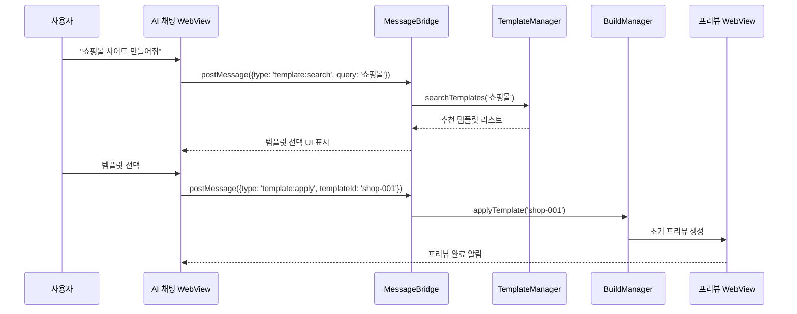
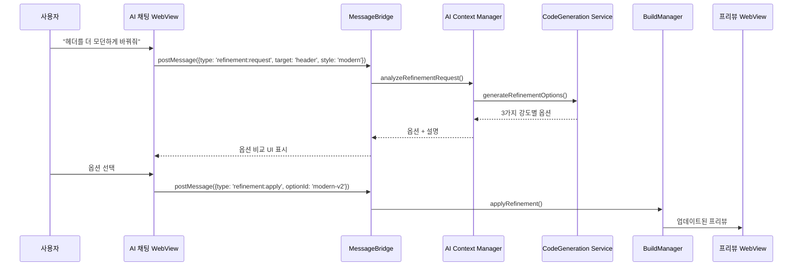

# WindWalker AI 대화식 웹사이트 빌더 통합 설계

## 🏗️ 통합 아키텍처 개요

### 기존 중앙 허브(MessageBridge) 확장 방식
기존 MessageBridge를 **AI Workflow Engine**으로 확장하여 AI 대화식 빌더 기능을 통합합니다.

```
AI 채팅 WebView → MessageBridge → AI Workflow Router → 각 서비스
```

## 📋 통합 컴포넌트 설계

### 1. AI Workflow Router (새로 추가)
```typescript
interface AIWorkflowRouter {
  // 워크플로우 타입 라우팅
  routeWorkflow(message: WorkflowMessage): Promise<WorkflowResponse>
  
  // 템플릿 기반 워크플로우
  handleTemplateWorkflow(request: TemplateWorkflowRequest): Promise<void>
  
  // 자유 생성 워크플로우  
  handleFreeformWorkflow(request: FreeformWorkflowRequest): Promise<void>
  
  // 수정/개선 워크플로우
  handleRefinementWorkflow(request: RefinementWorkflowRequest): Promise<void>
}
```

### 2. Template Manager (새로 추가)
```typescript
interface TemplateManager {
  // 템플릿 카테고리 관리
  getTemplateCategories(): TemplateCategory[]
  
  // 템플릿 검색 및 필터링
  searchTemplates(query: string, filters: TemplateFilter[]): Template[]
  
  // 템플릿 메타데이터 관리
  getTemplateMetadata(templateId: string): TemplateMetadata
  
  // 사용자 맞춤 템플릿 추천
  recommendTemplates(userProfile: UserProfile): Template[]
}
```

### 3. AI Context Manager (새로 추가)
```typescript
interface AIContextManager {
  // 대화 컨텍스트 관리
  maintainConversationContext(sessionId: string): ConversationContext
  
  // 사용자 선호도 학습
  learnUserPreferences(userId: string, feedback: UserFeedback): void
  
  // 프로젝트 히스토리 관리
  trackProjectHistory(projectId: string): ProjectHistory
  
  // 제약 조건 관리
  manageConstraints(constraints: DesignConstraints): void
}
```

## 🔄 통합된 메시지 플로우

### 기존 MessageBridge 확장
```typescript
// 기존 메시지 타입 확장
interface ExtendedMessage extends Message {
  workflowType?: 'template' | 'freeform' | 'refinement' | 'comparison'
  templateId?: string
  conversationContext?: ConversationContext
  designConstraints?: DesignConstraints
}

// MessageBridge 확장
class EnhancedMessageBridge extends MessageBridge {
  private aiWorkflowRouter: AIWorkflowRouter
  private templateManager: TemplateManager
  private aiContextManager: AIContextManager
  
  async handleMessage(message: ExtendedMessage): Promise<void> {
    // 기존 메시지 처리 로직 유지
    if (message.workflowType) {
      // AI 워크플로우 메시지 처리
      await this.aiWorkflowRouter.routeWorkflow(message)
    } else {
      // 기존 메시지 처리
      await super.handleMessage(message)
    }
  }
}
```

## 🎯 주요 워크플로우 통합 시나리오

### 1. 템플릿 기반 워크플로우


### 2. AI 개선 워크플로우


## 🔧 기존 서비스와의 연동점

### 1. FileManager 연동
- **템플릿 파일 관리**: 템플릿 HTML/CSS/JS 파일 저장 및 버전 관리
- **생성 파일 관리**: AI가 생성한 코드 파일들의 실시간 동기화
- **프로젝트 구조 관리**: 워크스페이스 내 프로젝트 폴더 구조 자동 생성

### 2. BuildManager 연동
- **실시간 빌드**: 각 AI 수정사항을 즉시 빌드하여 프리뷰 제공
- **점진적 빌드**: 변경된 부분만 선택적으로 빌드하여 성능 최적화
- **빌드 히스토리**: 각 대화 단계별 빌드 결과 저장 및 롤백 가능

### 3. CodeGenerationService 연동
- **제약 기반 생성**: 템플릿과 사용자 요구사항을 바탕으로 한 제한적 코드 생성
- **점진적 개선**: 기존 코드 기반 부분 수정 및 개선
- **다중 옵션 생성**: 하나의 요청에 대해 여러 구현 옵션 제공

## 📊 상태 관리 통합

### 1. 대화 상태 관리
```typescript
interface ConversationState {
  sessionId: string
  currentTemplate: Template | null
  projectHistory: ProjectStep[]
  userPreferences: UserPreferences
  activeConstraints: DesignConstraints
  conversationContext: string[]
}
```

### 2. 프로젝트 상태 관리
```typescript
interface ProjectState {
  projectId: string
  templateBase: Template
  currentCode: ProjectFiles
  buildStatus: BuildStatus
  previewUrl: string
  changeHistory: ChangeEvent[]
}
```

## 🚀 구현 우선순위

### Phase 1: 기본 통합 (2-3주)
1. MessageBridge에 AI 워크플로우 라우터 추가
2. 기본 템플릿 매니저 구현
3. 간단한 템플릿 적용 워크플로우 구현

### Phase 2: AI 기능 강화 (3-4주)
1. AI Context Manager 구현
2. 점진적 개선 워크플로우 구현
3. 다중 옵션 비교 시스템 구현

### Phase 3: 고급 기능 (4-5주)
1. 사용자 학습 시스템 구현
2. 제약 조건 엔진 구현
3. 성능 최적화 및 캐싱 시스템

## 🔄 확장성 고려사항

### 1. 모듈화 설계
- 각 AI 워크플로우 컴포넌트를 독립적으로 개발 및 배포 가능
- 플러그인 방식으로 새로운 워크플로우 타입 추가 가능

### 2. 스케일링 고려
- AI 서비스 호출 최적화 (배치 처리, 캐싱)
- 대화 컨텍스트 압축 및 효율적 저장
- 실시간 프리뷰 성능 최적화

### 3. 호환성 유지
- 기존 프리뷰 WebView와의 완전한 호환성 보장
- 기존 파일 관리 시스템과의 seamless 연동
- 향후 추가될 AI 모델과의 확장 가능한 인터페이스


## 🔄 주요 통합 전략
1. 비침해적 확장

기존 MessageBridge를 상속/확장하여 AI 워크플로우 기능 추가
기존 서비스들(FileManager, BuildManager, CodeGeneration)과의 호환성 100% 유지
새로운 메시지 타입 추가로 AI 기능과 기존 기능 구분

2. 점진적 통합

Phase별 구현으로 리스크 최소화
각 단계에서 기존 기능 영향 없이 새 기능 추가
사용자 피드백 기반 점진적 개선

3. 상태 관리 통합

대화 컨텍스트와 프로젝트 상태의 분리된 관리
기존 파일 시스템과 연동된 프로젝트 히스토리
실시간 동기화로 일관성 보장

이 설계로 WindWalker는 **"템플릿 기반의 안정성 + AI의 무한한 가능성"**을 제공하는 차별화된 웹사이트 빌더가 될 것입니다.