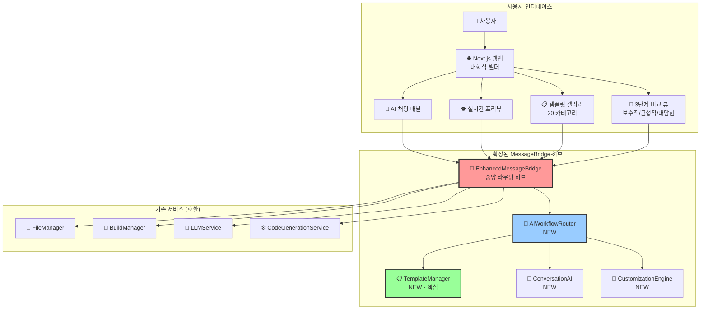
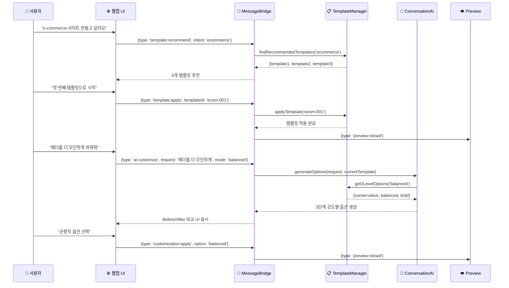

# 14-01. AI 대화식 웹사이트 빌더 설계 및 구현 (Enhanced)

## 📋 개요

이 문서는 **14번 기본 문서**를 바탕으로 WindWalker의 기존 MessageBridge 아키텍처를 확장하여 **템플릿 기반 AI 대화식 웹사이트 빌더**를 통합하는 설계 및 구현 방안을 제시합니다. **07번 문서 구조**를 따라 설계와 구현 코드를 통합했습니다.

### 🎯 핵심 설계 원칙 (14번 기반 + PRD 반영)
- **단순성 우선**: ModeManager, WebViewManager 제거로 복잡성 최소화
- **라우팅 기반 확장**: MessageBridge 라우팅으로 새 서비스 무중단 추가  
- **프로토타이핑 중심**: 웹앱이 메인, IDE는 필요시 띄우는 보조 도구
- **모듈화 설계**: 서비스 간 독립성 보장으로 안정성 확보
- **템플릿 우선**: PRD 32번에 따라 20개 카테고리 템플릿 시스템 중심

---

## 🏗️ 통합 아키텍처 설계: 중앙 허브(Central Hub) 확장 모델

### 1. 전체 시스템 구조



### 2. 핵심 워크플로우: 템플릿 → AI 커스터마이징



---

## 🔌 핵심 구현 코드 (설계)

### 1. `core/EnhancedMessageBridge.ts` (중앙 허브 확장)

```typescript
// [의도] 기존 MessageBridge를 확장하여 AI 워크플로우 메시지 처리
// [책임] 메시지 라우팅, 서비스 오케스트레이션, 기존 시스템과의 호환성 유지

import { MessageBridge } from './MessageBridge';
import { AIWorkflowRouter } from './AIWorkflowRouter';
import { TemplateManager } from '../services/TemplateManager';
import { ConversationAI } from '../services/ConversationAI';

export interface EnhancedWindWalkerMessage {
  type: 
    // 기존 메시지 타입 (100% 호환)
    | 'chatRequest' | 'fileOperation' | 'buildRequest' | 'previewUpdate'
    // 새로운 AI 워크플로우 타입
    | 'template:recommend' | 'template:apply' | 'template:compare'
    | 'ai:customize' | 'ai:compare' | 'customization:apply';
  
  // 확장 메타데이터
  workflowType?: 'template' | 'customization' | 'comparison';
  sessionId?: string;
  templateId?: string;
  customizationLevel?: 'conservative' | 'balanced' | 'bold';
  
  // 기존 필드들
  data?: any;
  source?: 'webview' | 'extension' | 'system';
}

export class EnhancedMessageBridge extends MessageBridge {
  private aiWorkflowRouter: AIWorkflowRouter;
  private templateManager: TemplateManager;
  private conversationAI: ConversationAI;
  private featureFlags: FeatureFlagManager;

  constructor(
    // 기존 의존성들 (변경 없음)
    fileManager: FileManager,
    buildManager: BuildManager,
    llmService: LLMService,
    codeGenerationService: CodeGenerationService,
    // 새로운 의존성들
    templateManager: TemplateManager,
    conversationAI: ConversationAI
  ) {
    super(fileManager, buildManager, llmService, codeGenerationService);
    
    this.templateManager = templateManager;
    this.conversationAI = conversationAI;
    this.aiWorkflowRouter = new AIWorkflowRouter(templateManager, conversationAI);
    this.featureFlags = new FeatureFlagManager();
  }

  public async processMessage(
    message: EnhancedWindWalkerMessage, 
    source: MessageSource
  ): Promise<void> {
    // Feature Flag 확인: AI 워크플로우가 비활성화된 경우 기존 로직 사용
    if (!this.featureFlags.isEnabled('ai_workflow') || this.isLegacyMessage(message)) {
      return await super.processMessage(message, source);
    }

    try {
      // AI 워크플로우 라우팅
      const result = await this.aiWorkflowRouter.route(message, source);
      
      // 결과 전달
      await this.sendResponse(result, source);
      
    } catch (error) {
      console.error('Enhanced message processing failed:', error);
      // 실패 시 기존 시스템으로 폴백
      return await super.processMessage(message, source);
    }
  }

  private isLegacyMessage(message: EnhancedWindWalkerMessage): boolean {
    return ['chatRequest', 'fileOperation', 'buildRequest', 'previewUpdate']
      .includes(message.type);
  }
}
```

### 2. `services/TemplateManager.ts` (핵심 템플릿 시스템)

```typescript
// [의도] PRD 32의 템플릿 요구사항 구현: 20개 카테고리, Wix 수준 전문 템플릿 관리
// [책임] 템플릿 추천, 적용, 3단계 커스터마이징 옵션 생성

export interface Template {
  id: string;
  name: string;
  category: TemplateCategory;
  subCategory?: string;
  description: string;
  thumbnailUrl: string;
  previewUrl: string;
  
  // 템플릿 구조 정의
  structure: {
    sections: TemplateSection[];
    layout: 'single-page' | 'multi-page';
    responsive: boolean;
    animations: boolean;
  };
  
  // 기본 스타일 설정
  defaultStyles: {
    colorScheme: ColorScheme;
    typography: Typography;
    spacing: SpacingConfig;
    components: ComponentStyleMap;
  };
  
  // 메타데이터
  popularity: number;
  industries: string[];
  targetAudience: string[];
  complexity: 'beginner' | 'intermediate' | 'advanced';
  isPremium: boolean;
  
  // 커스터마이징 가능한 영역
  customizableAreas: CustomizableArea[];
}

export type TemplateCategory = 
  | 'business' | 'portfolio' | 'ecommerce' | 'blog' | 'restaurant'
  | 'healthcare' | 'education' | 'nonprofit' | 'realestate' | 'fitness'
  | 'wedding' | 'photography' | 'music' | 'consulting' | 'startup'
  | 'fashion' | 'travel' | 'technology' | 'creative' | 'events';

export interface CustomizationLevel {
  level: 'conservative' | 'balanced' | 'bold';
  changes: {
    colors?: ColorChange[];
    layout?: LayoutChange[];
    typography?: TypographyChange[];
    components?: ComponentChange[];
    animations?: AnimationChange[];
  };
  estimatedImpact: 'low' | 'medium' | 'high';
  description: string;
}

export class TemplateManager {
  private templates: Map<string, Template>;
  private categoryIndex: Map<TemplateCategory, string[]>;
  private fileManager: FileManager;

  constructor(fileManager: FileManager) {
    this.templates = new Map();
    this.categoryIndex = new Map();
    this.fileManager = fileManager;
    
    this.initializeTemplates();
  }

  // 기본 템플릿 추천 (개인화 없는 버전)
  public async recommendTemplates(
    userIntent: string,
    count: number = 3
  ): Promise<Template[]> {
    // 1. 의도 분석으로 카테고리 추출
    const categories = await this.analyzeIntentToCategories(userIntent);
    
    // 2. 카테고리별 템플릿 후보 수집
    let candidates: Template[] = [];
    for (const category of categories) {
      const categoryTemplates = this.getTemplatesByCategory(category);
      candidates = candidates.concat(categoryTemplates);
    }
    
    // 3. 기본 스코어링 및 랭킹 (인기도 기준)
    const scoredTemplates = candidates.map(template => ({
      template,
      score: this.calculateBasicScore(template, userIntent)
    }));
    
    // 4. 상위 N개 반환
    return scoredTemplates
      .sort((a, b) => b.score - a.score)
      .slice(0, count)
      .map(item => item.template);
  }

  // 템플릿 적용: 파일 시스템에 템플릿 구조 생성
  public async applyTemplate(templateId: string, projectPath: string): Promise<ApplyResult> {
    const template = this.templates.get(templateId);
    if (!template) {
      throw new Error(`Template not found: ${templateId}`);
    }

    const appliedFiles: string[] = [];

    try {
      // 1. 기본 구조 파일 생성
      for (const section of template.structure.sections) {
        const files = await this.generateSectionFiles(section, template.defaultStyles);
        for (const file of files) {
          await this.fileManager.writeFile(
            path.join(projectPath, file.relativePath),
            file.content
          );
          appliedFiles.push(file.relativePath);
        }
      }

      // 2. 설정 파일 생성 (package.json, tailwind.config.js 등)
      const configFiles = await this.generateConfigFiles(template);
      for (const file of configFiles) {
        await this.fileManager.writeFile(
          path.join(projectPath, file.relativePath),
          file.content
        );
        appliedFiles.push(file.relativePath);
      }

      return {
        success: true,
        templateId,
        appliedFiles,
        customizableAreas: template.customizableAreas
      };

    } catch (error) {
      // 실패 시 생성된 파일들 정리
      for (const file of appliedFiles) {
        try {
          await this.fileManager.deleteFile(path.join(projectPath, file));
        } catch (cleanupError) {
          console.warn('Cleanup failed for:', file, cleanupError);
        }
      }
      
      throw new Error(`Template application failed: ${error.message}`);
    }
  }

  // PRD 핵심 요구사항: 3단계 강도별 커스터마이징 옵션 생성
  public async generate3LevelCustomizations(
    templateId: string,
    userRequest: string,
    currentState: ProjectState
  ): Promise<CustomizationLevel[]> {
    const template = this.templates.get(templateId);
    if (!template) {
      throw new Error(`Template not found: ${templateId}`);
    }

    // AI 분석으로 커스터마이징 영역 식별
    const targetAreas = await this.identifyCustomizationAreas(userRequest, template);
    
    const customizations: CustomizationLevel[] = [];

    // 보수적 옵션: 최소한의 변경
    customizations.push({
      level: 'conservative',
      changes: this.generateConservativeChanges(targetAreas, userRequest),
      estimatedImpact: 'low',
      description: '기존 디자인 패턴을 유지하며 소폭 개선'
    });

    // 균형적 옵션: 적당한 변경
    customizations.push({
      level: 'balanced',
      changes: this.generateBalancedChanges(targetAreas, userRequest),
      estimatedImpact: 'medium', 
      description: '트렌디한 요소를 추가하며 레이아웃 부분 개선'
    });

    // 대담한 옵션: 큰 변경
    customizations.push({
      level: 'bold',
      changes: this.generateBoldChanges(targetAreas, userRequest),
      estimatedImpact: 'high',
      description: '실험적 디자인과 최신 트렌드를 적극 반영'
    });

    return customizations;
  }

  private async initializeTemplates(): Promise<void> {
    // PRD 요구사항: 20개 카테고리별 템플릿 로드
    const templateCategories: TemplateCategory[] = [
      'business', 'portfolio', 'ecommerce', 'blog', 'restaurant',
      'healthcare', 'education', 'nonprofit', 'realestate', 'fitness', 
      'wedding', 'photography', 'music', 'consulting', 'startup',
      'fashion', 'travel', 'technology', 'creative', 'events'
    ];

    for (const category of templateCategories) {
      await this.loadCategoryTemplates(category);
    }
  }

  private calculateBasicScore(template: Template, userIntent: string): number {
    let score = template.popularity * 0.5; // 기본 인기도

    // 의도와 템플릿 목적의 일치도
    const intentMatch = this.calculateIntentMatch(userIntent, template);
    score += intentMatch * 50;

    return Math.min(score, 100); // 최대 100점
  }

  private async loadCategoryTemplates(category: TemplateCategory): Promise<void> {
    // 각 카테고리별로 최소 2개의 고품질 템플릿 로드
    const templateIds: string[] = [];
    
    switch (category) {
      case 'business':
        templateIds.push('business-corporate-001', 'business-modern-001');
        break;
      case 'ecommerce':
        templateIds.push('ecommerce-fashion-001', 'ecommerce-general-001');
        break;
      case 'restaurant':
        templateIds.push('restaurant-cozy-001', 'restaurant-modern-001');
        break;
      // ... 나머지 카테고리들
    }
    
    for (const templateId of templateIds) {
      const template = await this.loadTemplateById(templateId);
      this.templates.set(templateId, template);
      
      // 카테고리 인덱스 업데이트
      if (!this.categoryIndex.has(category)) {
        this.categoryIndex.set(category, []);
      }
      this.categoryIndex.get(category)!.push(templateId);
    }
  }
}
```

### 3. `services/ConversationAI.ts` (대화 처리 엔진)

```typescript
// [의도] 사용자의 자연어 요청을 템플릿 작업으로 변환
// [책임] 의도 파악, 3단계 옵션 생성 지원, 자연어 이해

export interface ConversationContext {
  sessionId: string;
  templateId?: string;
  previousRequests: string[];
  currentProjectState: ProjectState;
}

export class ConversationAI {
  private llmService: LLMService;
  private codeGenerationService: CodeGenerationService;

  constructor(
    llmService: LLMService,
    codeGenerationService: CodeGenerationService
  ) {
    this.llmService = llmService;
    this.codeGenerationService = codeGenerationService;
  }

  // 사용자 의도를 템플릿 카테고리로 분석
  public async analyzeTemplateIntent(userRequest: string): Promise<{
    categories: TemplateCategory[];
    confidence: number;
    keywords: string[];
  }> {
    const prompt = `
    사용자 요청: "${userRequest}"
    
    이 요청에서 원하는 웹사이트 유형을 분석하여 적절한 카테고리를 추천해주세요.
    
    가능한 카테고리: business, portfolio, ecommerce, blog, restaurant, healthcare, education, nonprofit, realestate, fitness, wedding, photography, music, consulting, startup, fashion, travel, technology, creative, events
    
    응답 형식:
    - categories: [최대 3개까지]
    - confidence: 0-1 사이 신뢰도
    - keywords: 추출된 핵심 키워드들
    `;

    const response = await this.llmService.generateResponse(prompt);
    return this.parseIntentAnalysis(response);
  }

  // 커스터마이징 요청 분석
  public async analyzeCustomizationIntent(
    userRequest: string,
    currentTemplate: Template
  ): Promise<{
    targetArea: string;
    intention: string;
    confidence: number;
    suggestedChanges: any;
  }> {
    const prompt = `
    현재 템플릿: ${currentTemplate.name} (${currentTemplate.category})
    사용자 커스터마이징 요청: "${userRequest}"
    
    이 요청을 분석하여 다음을 제공해주세요:
    1. 변경하려는 영역 (header, hero, menu, footer, content 등)
    2. 변경 의도 (modernize, colorize, simplify, emphasize 등)
    3. 신뢰도 (0-1)
    4. 구체적인 변경 제안
    
    현재 템플릿의 커스터마이징 가능 영역: ${currentTemplate.customizableAreas.map(area => area.name).join(', ')}
    `;

    const response = await this.llmService.generateResponse(prompt);
    return this.parseCustomizationAnalysis(response);
  }

  // 3단계 강도별 변경사항 생성 지원
  public async generateVariationOptions(
    baseChange: any,
    level: 'conservative' | 'balanced' | 'bold'
  ): Promise<any> {
    const intensityMap = {
      conservative: '최소한의 변경으로 안전하게',
      balanced: '적당한 수준의 트렌디한 변경',
      bold: '실험적이고 대담한 변경'
    };

    const prompt = `
    기본 변경사항: ${JSON.stringify(baseChange)}
    변경 강도: ${level} (${intensityMap[level]})
    
    이 강도에 맞는 구체적인 변경사항을 생성해주세요:
    - CSS 변경사항
    - HTML 구조 변경 (필요시)
    - 추가/제거할 요소들
    `;

    const response = await this.llmService.generateResponse(prompt);
    return this.parseVariationOptions(response);
  }

  private parseIntentAnalysis(response: string): any {
    // LLM 응답을 구조화된 데이터로 파싱
    try {
      return JSON.parse(response);
    } catch {
      // 파싱 실패시 기본값 반환
      return {
        categories: ['business'],
        confidence: 0.5,
        keywords: []
      };
    }
  }

  private parseCustomizationAnalysis(response: string): any {
    try {
      return JSON.parse(response);
    } catch {
      return {
        targetArea: 'unknown',
        intention: 'general',
        confidence: 0.5,
        suggestedChanges: {}
      };
    }
  }
}
```

---

## 🎯 핵심 워크플로우 시나리오

### 시나리오 1: 템플릿 추천 → 선택 → 커스터마이징

```
사용자: "음식점 사이트를 만들고 싶어요"

1. ConversationAI.analyzeTemplateIntent('음식점 사이트')
   → 분석 결과: categories: ['restaurant'], confidence: 0.9
   
2. TemplateManager.recommendTemplates('음식점 사이트')
   → 추천: [restaurant-cozy-001, restaurant-modern-001, restaurant-elegant-001]

3. 사용자: "첫 번째 템플릿으로 시작할게요"
   → TemplateManager.applyTemplate('restaurant-cozy-001')
   → 결과: 기본 음식점 사이트 생성 (HTML/CSS/JS 파일들)

4. 사용자: "메뉴 섹션을 좀 더 눈에 띄게 해주세요"
   → ConversationAI.analyzeCustomizationIntent() 
   → 분석: targetArea: 'menu', intention: 'emphasize'
   → TemplateManager.generate3LevelCustomizations()
   → 3단계 옵션 제시:
     - 보수적: 메뉴 텍스트 크기만 증가
     - 균형적: 메뉴 배경 색상 + 아이콘 추가  
     - 대담한: 전체 메뉴 섹션 레이아웃 재구성

5. 사용자: "균형적 옵션이 좋네요"
   → 변경사항 적용 → Preview 업데이트
```

### 시나리오 2: 실시간 비교 및 선택

```
사용자: "헤더를 더 모던하게 바꿔줘"

1. 3단계 옵션 생성 및 미리보기
   → 현재 상태 + 보수적 + 균형적 + 대담한 옵션 4개 동시 표시
   
2. 사용자가 시각적으로 비교하여 선택
   → "대담한 옵션이 마음에 들어요"
   
3. 선택된 옵션 적용
   → 파일 변경 → 빌드 → 미리보기 업데이트
```

---

## 📊 데이터 모델 설계

### 템플릿 구조

```typescript
interface TemplateSection {
  id: string;
  name: string; // 'header', 'hero', 'features', 'footer' etc.
  htmlTemplate: string;
  cssStyles: string;
  jsLogic?: string;
  customizableProperties: CustomizableProperty[];
}

interface CustomizableProperty {
  name: string;
  type: 'color' | 'typography' | 'spacing' | 'layout';
  currentValue: any;
  possibleValues?: any[];
  constraints?: PropertyConstraints;
}

interface ProjectState {
  templateId: string;
  appliedCustomizations: AppliedCustomization[];
  currentFiles: ProjectFile[];
  lastModified: Date;
}
```

### 커스터마이징 변경사항

```typescript
interface ColorChange {
  selector: string;
  property: 'background-color' | 'color' | 'border-color';
  from: string;
  to: string;
}

interface LayoutChange {
  selector: string;
  property: 'display' | 'flex-direction' | 'grid-template';
  from: string;
  to: string;
}

interface ComponentChange {
  action: 'add' | 'remove' | 'modify';
  selector: string;
  element?: string; // for 'add'
  content?: string; // for 'add' or 'modify'
}
```

이 설계는 **14번 기본 문서**를 기반으로 하되, **PRD 32번의 템플릿 요구사항**을 중심으로 구성하여 Git+IndexedDB 없이도 핵심 AI 워크플로우가 동작하도록 설계했습니다.