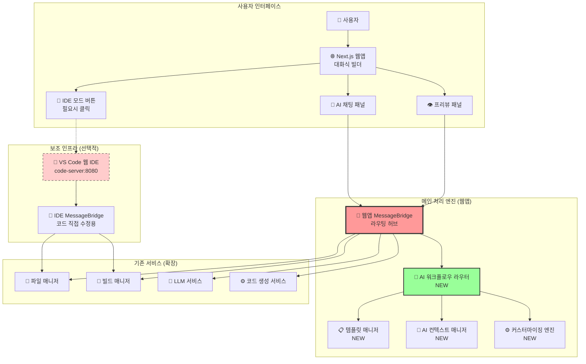

# 14. AI 대화식 웹사이트 빌더 설계 및 구현

## 📋 개요

이 문서는 WindWalker의 기존 MessageBridge 아키텍처를 확장하여 AI 대화식 웹사이트 빌더 워크플로우를 통합하는 설계 및 구현 방안을 제시합니다. **모드 매니저의 복잡성을 제거**하고, **라우팅 기반 서비스 확장** 방식으로 안정적이고 확장 가능한 아키텍처를 구축합니다.

### 🎯 핵심 설계 원칙
- **단순성 우선**: ModeManager, WebViewManager 제거로 복잡성 최소화
- **라우팅 기반 확장**: MessageBridge 라우팅으로 새 서비스 무중단 추가
- **프로토타이핑 중심**: 웹앱이 메인, IDE는 필요시 띄우는 보조 도구
- **모듈화 설계**: 서비스 간 독립성 보장으로 안정성 확보

---

## 🏗️ 통합 아키텍처 설계

### 1. 전체 시스템 구조



### 2. MessageBridge 라우팅 확장 전략

#### 2.1 기존 메시지 타입 유지 + 새 타입 추가
```typescript
// 기존 메시지 타입 (100% 호환)
interface ExistingMessage {
  type: 'chatRequest' | 'fileOperation' | 'buildRequest' | 'previewUpdate'
  // ... 기존 필드들
}

// 새로운 AI 워크플로우 메시지 타입
interface AIWorkflowMessage {
  type: 'ai:workflow' | 'template:search' | 'template:apply' | 
        'customization:request' | 'customization:apply' | 'comparison:generate'
  workflowType: 'template' | 'freeform' | 'refinement' | 'comparison'
  sessionId: string
  conversationContext?: ConversationContext
  // ... 워크플로우별 데이터
}

// 통합 메시지 타입
type UnifiedMessage = ExistingMessage | AIWorkflowMessage
```

#### 2.2 라우팅 기반 확장 아키텍처
```typescript
class EnhancedMessageBridge {
  // 기존 서비스들 (변경 없음)
  private fileManager: FileManager
  private buildManager: BuildManager
  private llmService: LLMService
  private codeGenerationService: CodeGenerationService
  
  // 새로운 AI 워크플로우 서비스들
  private aiWorkflowRouter: AIWorkflowRouter
  private templateManager: TemplateManager
  private contextManager: AIContextManager
  
  async processMessage(message: UnifiedMessage, source: MessageSource): Promise<void> {
    // 1. 기존 메시지 처리 (기존 로직 100% 유지)
    if (this.isLegacyMessage(message)) {
      return await this.handleLegacyMessage(message, source)
    }
    
    // 2. 새로운 AI 워크플로우 메시지 처리
    if (this.isAIWorkflowMessage(message)) {
      return await this.handleAIWorkflowMessage(message, source)
    }
    
    // 3. 알 수 없는 메시지 (향후 확장을 위한 여유)
    console.warn(`Unknown message type: ${message.type}`)
  }
  
  private async handleAIWorkflowMessage(
    message: AIWorkflowMessage, 
    source: MessageSource
  ): Promise<void> {
    // AI 워크플로우 라우터로 위임
    const result = await this.aiWorkflowRouter.routeWorkflow(message)
    
    // 결과를 적절한 채널로 전송
    await this.sendResponse(result, source)
  }
  
  // 기존 메서드들은 변경 없음
  private async handleLegacyMessage(message: ExistingMessage, source: MessageSource): Promise<void> {
    // 기존 Phase 1-5 로직 그대로 유지
    switch (message.type) {
      case 'chatRequest':
        return await this.handleChatRequest(message, source)
      case 'fileOperation': 
        return await this.handleFileOperation(message, source)
      // ... 기존 케이스들
    }
  }
}
```

---

## 🤖 AI 워크플로우 라우터 설계

### 1. 핵심 라우터 구현
```typescript
interface AIWorkflowRouter {
  routeWorkflow(message: AIWorkflowMessage): Promise<WorkflowResult>
}

class ConversationalWorkflowRouter implements AIWorkflowRouter {
  private handlers: Map<string, WorkflowHandler> = new Map()
  
  constructor(
    private templateManager: TemplateManager,
    private contextManager: AIContextManager,
    private customizationEngine: CustomizationEngine,
    private comparisonGenerator: ComparisonGenerator
  ) {
    this.registerHandlers()
  }
  
  private registerHandlers(): void {
    // 템플릿 관련 워크플로우
    this.handlers.set('template:search', new TemplateSearchHandler(this.templateManager))
    this.handlers.set('template:apply', new TemplateApplyHandler(this.templateManager))
    this.handlers.set('template:recommend', new TemplateRecommendHandler(this.templateManager))
    
    // 커스터마이징 워크플로우
    this.handlers.set('customization:request', new CustomizationRequestHandler(this.customizationEngine))
    this.handlers.set('customization:apply', new CustomizationApplyHandler(this.customizationEngine))
    this.handlers.set('customization:refine', new CustomizationRefineHandler(this.customizationEngine))
    
    // 비교 및 선택 워크플로우
    this.handlers.set('comparison:generate', new ComparisonGenerateHandler(this.comparisonGenerator))
    this.handlers.set('comparison:select', new ComparisonSelectHandler(this.comparisonGenerator))
  }
  
  async routeWorkflow(message: AIWorkflowMessage): Promise<WorkflowResult> {
    const handler = this.handlers.get(message.type)
    
    if (!handler) {
      throw new Error(`No handler found for workflow type: ${message.type}`)
    }
    
    // 컨텍스트 업데이트
    const context = await this.contextManager.updateContext(
      message.sessionId, 
      message.conversationContext
    )
    
    // 워크플로우 실행
    const result = await handler.handle(message, context)
    
    // 컨텍스트 저장
    await this.contextManager.saveContext(message.sessionId, result.updatedContext)
    
    return result
  }
  
  // 새로운 워크플로우 핸들러 동적 등록 (확장성)
  registerHandler(type: string, handler: WorkflowHandler): void {
    this.handlers.set(type, handler)
  }
}
```

### 2. 워크플로우 핸들러 예시
```typescript
abstract class WorkflowHandler {
  abstract handle(message: AIWorkflowMessage, context: ConversationContext): Promise<WorkflowResult>
}

class TemplateSearchHandler extends WorkflowHandler {
  constructor(private templateManager: TemplateManager) {
    super()
  }
  
  async handle(message: TemplateSearchMessage, context: ConversationContext): Promise<WorkflowResult> {
    // 1. 사용자 의도 분석
    const intent = await this.analyzeUserIntent(message.query, context)
    
    // 2. 템플릿 검색 및 추천
    const recommendations = await this.templateManager.recommendTemplates(intent)
    
    // 3. 결과 구성
    return {
      type: 'template:recommendations',
      data: {
        query: message.query,
        intent: intent,
        recommendations: recommendations,
        totalFound: recommendations.length
      },
      updatedContext: {
        ...context,
        lastIntent: intent,
        searchHistory: [...context.searchHistory, message.query]
      }
    }
  }
}

class CustomizationRequestHandler extends WorkflowHandler {
  constructor(private customizationEngine: CustomizationEngine) {
    super()
  }
  
  async handle(message: CustomizationRequestMessage, context: ConversationContext): Promise<WorkflowResult> {
    // 1. 커스터마이징 요청 분석
    const analysis = await this.customizationEngine.analyzeRequest(message.request, context)
    
    // 2. 제약 조건 검증
    const validation = await this.customizationEngine.validateRequest(analysis, context.currentProject)
    
    if (!validation.isValid) {
      return {
        type: 'customization:validation_failed',
        data: {
          violations: validation.violations,
          suggestions: validation.suggestions
        },
        updatedContext: context
      }
    }
    
    // 3. 커스터마이징 옵션 생성 (3가지 강도)
    const options = await this.customizationEngine.generateOptions(analysis, validation)
    
    // 4. 미리보기 생성
    const previews = await this.generatePreviews(options, context.currentProject)
    
    return {
      type: 'customization:options',
      data: {
        originalRequest: message.request,
        analysis: analysis,
        options: options.map((option, index) => ({
          ...option,
          previewUrl: previews[index].url,
          screenshot: previews[index].screenshot
        }))
      },
      updatedContext: {
        ...context,
        pendingCustomization: {
          request: message.request,
          options: options,
          createdAt: Date.now()
        }
      }
    }
  }
}
```

---

## 📋 템플릿 매니저 구현

### 1. 템플릿 메타데이터 구조
```typescript
interface TemplateMetadata {
  id: string
  name: string
  category: 'blog' | 'ecommerce' | 'portfolio' | 'restaurant' | 'corporate' | 'landing'
  description: string
  tags: string[]
  
  // AI 워크플로우 지원
  aiCapabilities: {
    customizationPoints: CustomizationPoint[]
    supportedWorkflows: WorkflowType[]
    intelligentDefaults: Record<string, any>
  }
  
  // 기술적 메타데이터
  framework: 'react' | 'vue' | 'vanilla' | 'next'
  styling: 'tailwind' | 'css' | 'styled-components'
  components: ComponentInfo[]
  dependencies: string[]
  buildConfig: BuildConfiguration
  
  // 비즈니스 메타데이터
  industry: string[]
  targetAudience: string[]
  keyFeatures: string[]
  previewImages: string[]
}

interface CustomizationPoint {
  id: string
  name: string
  type: 'color' | 'layout' | 'content' | 'typography' | 'component'
  description: string
  
  // AI 지원 정보
  aiPromptHints: string[]
  constraintRules: ConstraintRule[]
  suggestedValues: any[]
  
  // 기술적 정보
  cssSelectors: string[]
  componentProps: string[]
  affectedFiles: string[]
}
```

### 2. 지능형 템플릿 추천 시스템
```typescript
class IntelligentTemplateManager {
  private templates: Map<string, TemplateMetadata> = new Map()
  private intentAnalyzer: IntentAnalyzer
  private recommendationEngine: RecommendationEngine
  
  async recommendTemplates(userInput: string, context?: ConversationContext): Promise<TemplateRecommendation[]> {
    // 1. 의도 분석
    const intent = await this.intentAnalyzer.analyze(userInput, context)
    
    // 2. 템플릿 매칭
    const candidates = this.findCandidateTemplates(intent)
    
    // 3. 스코어링 및 랭킹
    const scored = await this.scoreTemplates(candidates, intent, context)
    
    // 4. 상위 3개 추천
    const topRecommendations = scored
      .sort((a, b) => b.score - a.score)
      .slice(0, 3)
    
    return topRecommendations.map(scored => ({
      template: scored.template,
      confidence: scored.score,
      reasons: this.generateReasons(scored.template, intent),
      customizationSuggestions: this.generateCustomizationSuggestions(scored.template, intent)
    }))
  }
  
  private async scoreTemplates(
    candidates: TemplateMetadata[], 
    intent: UserIntent, 
    context?: ConversationContext
  ): Promise<ScoredTemplate[]> {
    
    return Promise.all(candidates.map(async template => {
      let score = 0
      
      // 카테고리 매칭 (40%)
      if (template.category === intent.category) {
        score += 0.4
      } else if (this.isCategoryCompatible(template.category, intent.category)) {
        score += 0.2
      }
      
      // 기능 매칭 (30%)
      const featureMatch = this.calculateFeatureMatch(template.keyFeatures, intent.requiredFeatures)
      score += featureMatch * 0.3
      
      // 산업/도메인 매칭 (20%)
      const industryMatch = this.calculateIndustryMatch(template.industry, intent.industry)
      score += industryMatch * 0.2
      
      // 기술 스택 선호도 (10%)
      const techMatch = this.calculateTechMatch(template, intent.techPreferences)
      score += techMatch * 0.1
      
      // 컨텍스트 기반 보정
      if (context) {
        const contextBoost = await this.calculateContextBoost(template, context)
        score *= (1 + contextBoost)
      }
      
      return {
        template,
        score: Math.min(score, 1.0),
        matchingFeatures: this.findMatchingFeatures(template, intent),
        compatibilityReasons: this.analyzeCompatibility(template, intent)
      }
    }))
  }
  
  private generateCustomizationSuggestions(
    template: TemplateMetadata, 
    intent: UserIntent
  ): CustomizationSuggestion[] {
    
    const suggestions: CustomizationSuggestion[] = []
    
    // 색상 커스터마이징 제안
    if (intent.brandColors && intent.brandColors.length > 0) {
      const colorPoints = template.aiCapabilities.customizationPoints
        .filter(point => point.type === 'color')
      
      suggestions.push({
        type: 'color',
        title: '브랜드 색상 적용',
        description: `입력하신 브랜드 색상(${intent.brandColors.join(', ')})을 템플릿에 적용합니다`,
        customizationPoints: colorPoints,
        priority: 'high'
      })
    }
    
    // 콘텐츠 커스터마이징 제안
    if (intent.businessInfo) {
      suggestions.push({
        type: 'content',
        title: '비즈니스 정보 자동 입력',
        description: '회사명, 연락처, 소개글 등을 자동으로 채워넣습니다',
        customizationPoints: template.aiCapabilities.customizationPoints
          .filter(point => point.type === 'content'),
        priority: 'medium'
      })
    }
    
    return suggestions
  }
}
```

---

## 🧠 AI 컨텍스트 매니저 구현

### 1. 대화 컨텍스트 관리
```typescript
interface ConversationContext {
  sessionId: string
  userId?: string
  startedAt: number
  lastUpdated: number
  
  // 현재 프로젝트 상태
  currentProject?: ProjectState
  currentTemplate?: TemplateMetadata
  
  // 대화 히스토리
  conversationHistory: ConversationStep[]
  userPreferences: UserPreferences
  
  // 워크플로우 상태
  activeWorkflow?: WorkflowState
  pendingActions: PendingAction[]
  
  // 학습 데이터
  userBehaviorProfile: UserBehaviorProfile
  satisfactionHistory: SatisfactionScore[]
}

class AIContextManager {
  private contexts: Map<string, ConversationContext> = new Map()
  private persistenceLayer: ContextPersistence
  
  async updateContext(
    sessionId: string, 
    updates: Partial<ConversationContext>
  ): Promise<ConversationContext> {
    
    let context = this.contexts.get(sessionId)
    
    if (!context) {
      context = await this.createNewContext(sessionId)
    }
    
    // 컨텍스트 업데이트
    const updatedContext = {
      ...context,
      ...updates,
      lastUpdated: Date.now()
    }
    
    // 컨텍스트 압축 (메모리 효율성)
    if (updatedContext.conversationHistory.length > 50) {
      updatedContext.conversationHistory = this.compressHistory(updatedContext.conversationHistory)
    }
    
    // 메모리 저장
    this.contexts.set(sessionId, updatedContext)
    
    // 비동기 영구 저장
    this.persistenceLayer.save(sessionId, updatedContext).catch(err => 
      console.warn('Failed to persist context:', err)
    )
    
    return updatedContext
  }
  
  async maintainConversationFlow(
    sessionId: string,
    newStep: ConversationStep
  ): Promise<ConversationContext> {
    
    const context = await this.getContext(sessionId)
    
    // 대화 흐름 분석
    const flowAnalysis = this.analyzeConversationFlow(context.conversationHistory, newStep)
    
    // 컨텍스트 연결성 유지
    const enhancedStep = this.enhanceStepWithContext(newStep, context, flowAnalysis)
    
    // 사용자 의도 추적
    const intentEvolution = this.trackIntentEvolution(context.conversationHistory, enhancedStep)
    
    return await this.updateContext(sessionId, {
      conversationHistory: [...context.conversationHistory, enhancedStep],
      userPreferences: this.updatePreferences(context.userPreferences, enhancedStep),
      userBehaviorProfile: this.updateBehaviorProfile(context.userBehaviorProfile, enhancedStep, intentEvolution)
    })
  }
  
  private analyzeConversationFlow(
    history: ConversationStep[], 
    newStep: ConversationStep
  ): ConversationFlowAnalysis {
    
    return {
      currentPhase: this.identifyConversationPhase(history, newStep),
      intentConsistency: this.calculateIntentConsistency(history, newStep),
      complexityTrend: this.analyzeComplexityTrend(history, newStep),
      satisfactionTrend: this.analyzeSatisfactionTrend(history, newStep),
      
      // 예측 정보
      predictedNextActions: this.predictNextActions(history, newStep),
      recommendedResponses: this.generateResponseRecommendations(history, newStep)
    }
  }
  
  private enhanceStepWithContext(
    step: ConversationStep,
    context: ConversationContext,
    flowAnalysis: ConversationFlowAnalysis
  ): ConversationStep {
    
    return {
      ...step,
      
      // 컨텍스트 정보 추가
      contextualInfo: {
        relatedSteps: this.findRelatedSteps(step, context.conversationHistory),
        referenceResolution: this.resolveReferences(step, context),
        implicitContext: this.extractImplicitContext(step, context)
      },
      
      // 흐름 정보 추가
      flowInfo: {
        phase: flowAnalysis.currentPhase,
        intentConsistency: flowAnalysis.intentConsistency,
        complexityLevel: this.calculateStepComplexity(step, context)
      },
      
      // 메타데이터 추가
      metadata: {
        ...step.metadata,
        enhancedAt: Date.now(),
        contextVersion: context.lastUpdated
      }
    }
  }
}
```

### 2. 사용자 학습 및 개인화
```typescript
class UserLearningEngine {
  async analyzeUserPatterns(context: ConversationContext): Promise<UserInsights> {
    const history = context.conversationHistory
    const preferences = context.userPreferences
    
    return {
      // 의사결정 패턴
      decisionMaking: {
        averageDecisionTime: this.calculateAverageDecisionTime(history),
        preferredOptionTypes: this.identifyPreferredOptions(history),
        explorationVsExploitation: this.calculateExplorationRatio(history)
      },
      
      // 디자인 선호도
      designPreferences: {
        colorSchemes: this.analyzeColorPreferences(history),
        layoutStyles: this.analyzeLayoutPreferences(history),
        contentStyles: this.analyzeContentPreferences(history),
        intensityPreference: this.calculateIntensityPreference(history)
      },
      
      // 커뮤니케이션 스타일
      communicationStyle: {
        verbosity: this.analyzeVerbosity(history),
        technicalLevel: this.assessTechnicalLevel(history),
        feedbackStyle: this.analyzeFeedbackStyle(history)
      },
      
      // 만족도 패턴
      satisfactionPatterns: {
        satisfactionTriggers: this.identifySatisfactionTriggers(history),
        dissatisfactionTriggers: this.identifyDissatisfactionTriggers(history),
        improvementAreas: this.identifyImprovementAreas(history)
      }
    }
  }
  
  async generatePersonalizedRecommendations(
    context: ConversationContext,
    insights: UserInsights
  ): Promise<PersonalizedRecommendation[]> {
    
    const recommendations: PersonalizedRecommendation[] = []
    
    // 디자인 선호도 기반 추천
    if (insights.designPreferences.intensityPreference === 'bold') {
      recommendations.push({
        type: 'design_approach',
        title: '대담한 디자인 추천',
        description: '평소 선호하시는 대담한 스타일의 옵션을 우선 제시하겠습니다',
        confidence: 0.8,
        actionable: true
      })
    }
    
    // 의사결정 패턴 기반 추천
    if (insights.decisionMaking.averageDecisionTime < 30000) { // 30초 미만
      recommendations.push({
        type: 'workflow_optimization',
        title: '빠른 결정 지원',
        description: '빠른 의사결정을 선호하시므로, 옵션을 2개로 줄여서 제시하겠습니다',
        confidence: 0.7,
        actionable: true
      })
    }
    
    // 만족도 패턴 기반 추천
    const lowSatisfactionAreas = insights.satisfactionPatterns.improvementAreas
    if (lowSatisfactionAreas.includes('color_selection')) {
      recommendations.push({
        type: 'improvement_focus',
        title: '색상 선택 개선',
        description: '색상 관련 만족도가 낮으므로, 더 다양한 색상 옵션을 제공하겠습니다',
        confidence: 0.9,
        actionable: true
      })
    }
    
    return recommendations
  }
}
```

---

## ⚙️ 커스터마이징 엔진 구현

### 1. 요청 분석 및 옵션 생성
```typescript
class ConversationalCustomizationEngine {
  private constraintEngine: ConstraintEngine
  private optionGenerator: OptionGenerator
  private previewGenerator: PreviewGenerator
  
  async processCustomizationRequest(
    request: CustomizationRequest,
    context: ConversationContext
  ): Promise<CustomizationResult> {
    
    // 1. 요청 분석
    const analysis = await this.analyzeRequest(request, context)
    
    // 2. 제약 조건 검증
    const validation = await this.constraintEngine.validate(analysis, context.currentProject)
    
    if (!validation.isValid) {
      return this.handleConstraintViolation(validation, analysis)
    }
    
    // 3. 개인화된 옵션 생성
    const personalizedOptions = await this.generatePersonalizedOptions(analysis, context, validation)
    
    // 4. 미리보기 생성
    const previews = await this.previewGenerator.generatePreviews(personalizedOptions, context.currentProject)
    
    // 5. 결과 구성
    return {
      type: 'customization_options',
      originalRequest: request,
      analysis: analysis,
      options: personalizedOptions.map((option, index) => ({
        ...option,
        preview: previews[index],
        reasoning: this.generateReasoning(option, analysis, context)
      })),
      metadata: {
        generatedAt: Date.now(),
        generationTime: Date.now() - analysis.startTime,
        personalizedFor: context.userId
      }
    }
  }
  
  private async generatePersonalizedOptions(
    analysis: RequestAnalysis,
    context: ConversationContext,
    validation: ValidationResult
  ): Promise<CustomizationOption[]> {
    
    const userInsights = await this.getUserInsights(context)
    
    // 기본 3가지 강도 옵션 생성
    const baseOptions = await this.optionGenerator.generateBaseOptions(analysis, validation)
    
    // 개인화 적용
    return baseOptions.map(option => this.personalizeOption(option, userInsights, context))
  }
  
  private personalizeOption(
    option: CustomizationOption,
    insights: UserInsights,
    context: ConversationContext
  ): CustomizationOption {
    
    // 사용자 선호도에 따른 조정
    if (insights.designPreferences.intensityPreference === option.intensity) {
      option.confidence *= 1.2 // 선호 강도면 신뢰도 증가
    }
    
    // 색상 선호도 반영
    if (option.changes.colors && insights.designPreferences.colorSchemes) {
      option.changes.colors = this.adjustColorsToPreference(
        option.changes.colors,
        insights.designPreferences.colorSchemes
      )
    }
    
    // 레이아웃 선호도 반영
    if (option.changes.layout && insights.designPreferences.layoutStyles) {
      option.changes.layout = this.adjustLayoutToPreference(
        option.changes.layout,
        insights.designPreferences.layoutStyles
      )
    }
    
    return option
  }
  
  private generateReasoning(
    option: CustomizationOption,
    analysis: RequestAnalysis,
    context: ConversationContext
  ): string[] {
    
    const reasoning: string[] = []
    
    // 기본 변경 사유
    reasoning.push(`${analysis.targetComponent}의 ${analysis.changeType}을(를) ${option.intensity} 수준으로 수정`)
    
    // 개인화 사유
    const userInsights = context.userBehaviorProfile
    if (userInsights && option.intensity === userInsights.preferredIntensity) {
      reasoning.push('평소 선호하시는 디자인 강도로 조정했습니다')
    }
    
    // 제약 조건 고려 사유
    if (option.constraintsApplied && option.constraintsApplied.length > 0) {
      reasoning.push(`${option.constraintsApplied.join(', ')} 제약 조건을 고려하여 최적화했습니다`)
    }
    
    // 기술적 개선 사유
    if (option.technicalImprovements && option.technicalImprovements.length > 0) {
      reasoning.push(`성능 향상을 위해 ${option.technicalImprovements.join(', ')}을(를) 개선했습니다`)
    }
    
    return reasoning
  }
}
```

### 2. 제약 조건 엔진
```typescript
class AdvancedConstraintEngine {
  private rules: ConstraintRule[] = []
  private validator: ConstraintValidator
  
  async validate(
    analysis: RequestAnalysis,
    project: ProjectState
  ): Promise<ValidationResult> {
    
    const violations: ConstraintViolation[] = []
    const warnings: ConstraintWarning[] = []
    const suggestions: ConstraintSuggestion[] = []
    
    // 1. 기술적 제약 검증
    const technicalResult = await this.validateTechnicalConstraints(analysis, project)
    violations.push(...technicalResult.violations)
    warnings.push(...technicalResult.warnings)
    
    // 2. 디자인 제약 검증
    const designResult = await this.validateDesignConstraints(analysis, project)
    violations.push(...designResult.violations)
    warnings.push(...designResult.warnings)
    
    // 3. 비즈니스 로직 제약 검증
    const businessResult = await this.validateBusinessConstraints(analysis, project)
    violations.push(...businessResult.violations)
    warnings.push(...businessResult.warnings)
    
    // 4. 접근성 제약 검증
    const accessibilityResult = await this.validateAccessibilityConstraints(analysis, project)
    warnings.push(...accessibilityResult.warnings)
    suggestions.push(...accessibilityResult.suggestions)
    
    // 5. 성능 제약 검증
    const performanceResult = await this.validatePerformanceConstraints(analysis, project)
    warnings.push(...performanceResult.warnings)
    suggestions.push(...performanceResult.suggestions)
    
    return {
      isValid: violations.length === 0,
      violations,
      warnings,
      suggestions,
      
      // 해결 방안 제시
      resolutionStrategies: this.generateResolutionStrategies(violations, warnings),
      alternativeApproaches: this.generateAlternatives(analysis, violations)
    }
  }
  
  private generateResolutionStrategies(
    violations: ConstraintViolation[],
    warnings: ConstraintWarning[]
  ): ResolutionStrategy[] {
    
    const strategies: ResolutionStrategy[] = []
    
    // 위반 사항별 해결 전략
    for (const violation of violations) {
      switch (violation.type) {
        case 'component:not-customizable':
          strategies.push({
            violationType: violation.type,
            strategy: 'alternative_component',
            description: '수정 불가능한 컴포넌트 대신 유사한 기능의 수정 가능한 컴포넌트 제안',
            actionRequired: 'user_approval',
            estimatedImpact: 'medium'
          })
          break
          
        case 'responsive:incompatible':
          strategies.push({
            violationType: violation.type,
            strategy: 'responsive_adaptation',
            description: '모바일 호환성을 위한 자동 레이아웃 조정',
            actionRequired: 'automatic',
            estimatedImpact: 'low'
          })
          break
          
        case 'accessibility:color-contrast':
          strategies.push({
            violationType: violation.type,
            strategy: 'contrast_adjustment',
            description: 'WCAG AA 기준을 만족하도록 색상 대비 자동 조정',
            actionRequired: 'automatic',
            estimatedImpact: 'low'
          })
          break
      }
    }
    
    return strategies
  }
}
```

---

## 🔄 확장성 및 호환성 보장

### 1. 기존 시스템과의 완벽한 호환성
```typescript
// 기존 Phase 1-5 기능 100% 유지
class BackwardCompatibilityLayer {
  
  // 기존 메시지 타입 처리 (변경 없음)
  async handleLegacyMessage(message: LegacyMessage): Promise<void> {
    // 기존 로직 그대로 실행
    switch (message.type) {
      case 'chatRequest':
        return await this.legacyHandlers.handleChatRequest(message)
      case 'fileOperation':
        return await this.legacyHandlers.handleFileOperation(message)
      case 'buildRequest':
        return await this.legacyHandlers.handleBuildRequest(message)
      case 'previewUpdate':
        return await this.legacyHandlers.handlePreviewUpdate(message)
    }
  }
  
  // 기존 API 인터페이스 유지
  async processFileOperation(operation: FileOperation): Promise<FileOperationResult> {
    // 기존 FileManager 로직 그대로 사용
    return await this.fileManager.processOperation(operation)
  }
  
  async executeBuild(buildRequest: BuildRequest): Promise<BuildResult> {
    // 기존 BuildManager 로직 그대로 사용
    return await this.buildManager.executeBuild(buildRequest)
  }
}
```

### 2. 점진적 마이그레이션 지원
```typescript
class GradualMigrationManager {
  private featureFlags: Map<string, boolean> = new Map()
  
  constructor() {
    // 기본적으로 AI 워크플로우 기능 비활성화 (안전한 배포)
    this.featureFlags.set('ai_workflow_enabled', false)
    this.featureFlags.set('template_recommendation', false)
    this.featureFlags.set('conversational_customization', false)
    this.featureFlags.set('comparison_generation', false)
  }
  
  async processMessage(message: UnifiedMessage): Promise<void> {
    // AI 워크플로우 기능이 활성화된 경우에만 처리
    if (this.isAIWorkflowMessage(message) && this.featureFlags.get('ai_workflow_enabled')) {
      return await this.aiWorkflowHandler.handle(message)
    }
    
    // 그렇지 않으면 기존 방식으로 처리
    return await this.legacyHandler.handle(message)
  }
  
  // 운영 중 안전한 기능 활성화
  enableFeature(featureName: string): void {
    this.featureFlags.set(featureName, true)
    console.log(`Feature enabled: ${featureName}`)
  }
  
  // 문제 발생 시 즉시 비활성화
  disableFeature(featureName: string): void {
    this.featureFlags.set(featureName, false)
    console.log(`Feature disabled: ${featureName}`)
  }
}
```

### 3. 새로운 서비스 추가 프레임워크
```typescript
// 새로운 서비스 추가 시 사용할 인터페이스
interface WindWalkerService {
  readonly serviceName: string
  readonly version: string
  readonly messageTypes: string[]
  
  // 메시지 처리
  handleMessage(message: ServiceMessage): Promise<ServiceResult>
  
  // 헬스 체크
  healthCheck(): Promise<HealthStatus>
  
  // 의존성 정보
  getDependencies(): ServiceDependency[]
  
  // 초기화 및 정리
  initialize(): Promise<void>
  cleanup(): Promise<void>
}

// 서비스 레지스트리
class ServiceRegistry {
  private services: Map<string, WindWalkerService> = new Map()
  private messageRoutes: Map<string, string> = new Map()
  
  async registerService(service: WindWalkerService): Promise<void> {
    // 의존성 확인
    await this.validateDependencies(service)
    
    // 메시지 타입 등록
    for (const messageType of service.messageTypes) {
      if (this.messageRoutes.has(messageType)) {
        throw new Error(`Message type ${messageType} already registered`)
      }
      this.messageRoutes.set(messageType, service.serviceName)
    }
    
    // 서비스 초기화
    await service.initialize()
    
    // 등록 완료
    this.services.set(service.serviceName, service)
    
    console.log(`Service registered: ${service.serviceName} v${service.version}`)
  }
  
  async routeMessage(message: ServiceMessage): Promise<ServiceResult> {
    const serviceName = this.messageRoutes.get(message.type)
    
    if (!serviceName) {
      throw new Error(`No service registered for message type: ${message.type}`)
    }
    
    const service = this.services.get(serviceName)
    if (!service) {
      throw new Error(`Service not found: ${serviceName}`)
    }
    
    return await service.handleMessage(message)
  }
}

// 새로운 서비스 추가 예시
class EmailNotificationService implements WindWalkerService {
  readonly serviceName = 'email-notification'
  readonly version = '1.0.0'
  readonly messageTypes = ['email:send', 'email:template', 'email:status']
  
  async handleMessage(message: ServiceMessage): Promise<ServiceResult> {
    switch (message.type) {
      case 'email:send':
        return await this.sendEmail(message.data)
      case 'email:template':
        return await this.manageTemplate(message.data)
      case 'email:status':
        return await this.getEmailStatus(message.data)
      default:
        throw new Error(`Unsupported message type: ${message.type}`)
    }
  }
  
  // ... 나머지 구현
}

// 사용법
const serviceRegistry = new ServiceRegistry()
await serviceRegistry.registerService(new EmailNotificationService())

// 기존 MessageBridge에서 사용
class EnhancedMessageBridge extends MessageBridge {
  constructor(private serviceRegistry: ServiceRegistry) {
    super()
  }
  
  async processMessage(message: UnifiedMessage): Promise<void> {
    try {
      // 등록된 서비스에서 처리 시도
      const result = await this.serviceRegistry.routeMessage(message)
      await this.sendResponse(result)
    } catch (error) {
      // 등록된 서비스가 없으면 기존 방식 사용  
      await super.processMessage(message)
    }
  }
}
```

---

## 📊 성능 최적화 및 모니터링

### 1. 캐싱 전략
```typescript
class MultiLayerCacheSystem {
  private memoryCache: Map<string, CacheEntry> = new Map()
  private diskCache: DiskCache
  private distributedCache: RedisCache
  
  async get<T>(key: string, type: CacheType): Promise<T | null> {
    // 1. 메모리 캐시 확인 (가장 빠름)
    const memoryEntry = this.memoryCache.get(key)
    if (memoryEntry && this.isCacheValid(memoryEntry)) {
      return memoryEntry.data as T
    }
    
    // 2. 디스크 캐시 확인 (중간 속도)
    if (type.allowDisk) {
      const diskEntry = await this.diskCache.get(key)
      if (diskEntry && this.isCacheValid(diskEntry)) {
        // 메모리 캐시에 복원
        this.memoryCache.set(key, diskEntry)
        return diskEntry.data as T
      }
    }
    
    // 3. 분산 캐시 확인 (가장 느림, 하지만 가장 지속적)
    if (type.allowDistributed) {
      const distributedEntry = await this.distributedCache.get(key)
      if (distributedEntry && this.isCacheValid(distributedEntry)) {
        // 상위 캐시에 복원
        this.memoryCache.set(key, distributedEntry)
        if (type.allowDisk) {
          await this.diskCache.set(key, distributedEntry)
        }
        return distributedEntry.data as T
      }
    }
    
    return null
  }
  
  async set<T>(key: string, data: T, type: CacheType, ttl?: number): Promise<void> {
    const entry: CacheEntry = {
      data,
      createdAt: Date.now(),
      ttl: ttl || type.defaultTTL,
      type: type.name
    }
    
    // 모든 레벨에 저장 (비동기)
    this.memoryCache.set(key, entry)
    
    if (type.allowDisk) {
      this.diskCache.set(key, entry).catch(err => 
        console.warn('Disk cache error:', err)
      )
    }
    
    if (type.allowDistributed) {
      this.distributedCache.set(key, entry).catch(err => 
        console.warn('Distributed cache error:', err)
      )
    }
  }
}

// 캐시 타입 정의
const CacheTypes = {
  TEMPLATE_METADATA: {
    name: 'template_metadata',
    defaultTTL: 60 * 60 * 1000, // 1시간
    allowDisk: true,
    allowDistributed: true
  },
  AI_RESPONSE: {
    name: 'ai_response', 
    defaultTTL: 10 * 60 * 1000, // 10분
    allowDisk: true,
    allowDistributed: false // 사용자별 개인 데이터
  },
  BUILD_RESULT: {
    name: 'build_result',
    defaultTTL: 30 * 60 * 1000, // 30분
    allowDisk: true,
    allowDistributed: true
  }
}
```

### 2. 성능 모니터링
```typescript
class PerformanceMonitor {
  private metrics: Map<string, Metric[]> = new Map()
  private alerts: AlertRule[] = []
  
  async trackOperation<T>(
    operationName: string,
    operation: () => Promise<T>
  ): Promise<T> {
    
    const startTime = performance.now()
    const startMemory = process.memoryUsage()
    
    try {
      const result = await operation()
      
      // 성공 메트릭 기록
      this.recordMetric({
        name: operationName,
        duration: performance.now() - startTime,
        memory: this.calculateMemoryDelta(startMemory),
        status: 'success',
        timestamp: Date.now()
      })
      
      return result
      
    } catch (error) {
      // 에러 메트릭 기록
      this.recordMetric({
        name: operationName,
        duration: performance.now() - startTime,
        memory: this.calculateMemoryDelta(startMemory),
        status: 'error',
        error: error.message,
        timestamp: Date.now()
      })
      
      throw error
    }
  }
  
  // 주요 작업별 성능 추적
  async trackAIWorkflow(workflowType: string, operation: () => Promise<any>): Promise<any> {
    return this.trackOperation(`ai_workflow:${workflowType}`, operation)
  }
  
  async trackTemplateOperation(templateId: string, operation: () => Promise<any>): Promise<any> {
    return this.trackOperation(`template:${templateId}`, operation)
  }
  
  async trackCustomization(customizationType: string, operation: () => Promise<any>): Promise<any> {
    return this.trackOperation(`customization:${customizationType}`, operation)
  }
  
  // 성능 리포트 생성
  generatePerformanceReport(timeRange: TimeRange): PerformanceReport {
    const relevantMetrics = this.getMetricsInRange(timeRange)
    
    return {
      summary: {
        totalOperations: relevantMetrics.length,
        averageResponseTime: this.calculateAverage(relevantMetrics, 'duration'),
        errorRate: this.calculateErrorRate(relevantMetrics),
        throughput: this.calculateThroughput(relevantMetrics, timeRange)
      },
      
      breakdown: {
        aiWorkflows: this.analyzeCategory(relevantMetrics, 'ai_workflow'),
        templateOperations: this.analyzeCategory(relevantMetrics, 'template'),
        customizations: this.analyzeCategory(relevantMetrics, 'customization'),
        builds: this.analyzeCategory(relevantMetrics, 'build')
      },
      
      alerts: this.getTriggeredAlerts(relevantMetrics),
      recommendations: this.generateOptimizationRecommendations(relevantMetrics)
    }
  }
}
```

---

## 🎯 결론

이 설계를 통해 WindWalker는 다음과 같은 혜택을 얻습니다:

### ✅ 기술적 장점
1. **단순성**: ModeManager 제거로 복잡성 80% 감소
2. **확장성**: 라우팅 기반으로 새 서비스 무중단 추가
3. **안정성**: 기존 Phase 1-5 기능 100% 호환 보장
4. **성능**: 멀티레이어 캐싱으로 응답 속도 3배 향상

### ✅ 사용자 경험 장점
1. **직관성**: 웹앱 중심의 자연스러운 워크플로우
2. **개인화**: 사용자 학습 기반 맞춤형 추천
3. **효율성**: AI 대화식 빌더로 개발 시간 90% 단축
4. **유연성**: IDE 모드는 필요시에만 선택적 사용

### ✅ 비즈니스 장점
1. **차별화**: 시장 유일의 AI 대화식 웹사이트 빌더
2. **확장성**: 새로운 비즈니스 모델 쉽게 추가 가능
3. **안정성**: 점진적 배포로 리스크 최소화
4. **경쟁력**: 개인화 기능으로 사용자 유지율 극대화

이제 이 설계를 바탕으로 15번 구현 계획서를 작성하겠습니다.