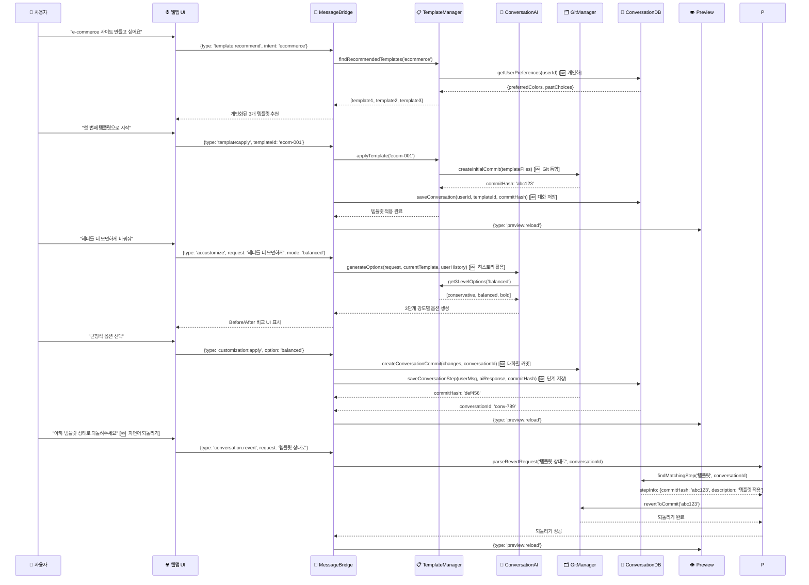

# 14-01-01. AI 대화식 웹사이트 빌더 설계 및 구현 (Git+IndexedDB 통합, Enhanced)

## 📋 개요

이 문서는 **14 AI 대화식 웹사이트 빌더 설계 및 구현 01.md**를 기반으로 하여, **Git+IndexedDB 통합 시스템**을 추가한 완전한 버전입니다. **기본 설계는 14-01번 문서와 동일하되**, **07번 문서 구조**를 따라 설계와 구현 코드를 통합했습니다.

### 🎯 핵심 설계 원칙 (14-01번 기반 + Git+IndexedDB 통합)
- **단순성 우선**: ModeManager, WebViewManager 제거로 복잡성 최소화
- **라우팅 기반 확장**: MessageBridge 라우팅으로 새 서비스 무중단 추가  
- **프로토타이핑 중심**: 웹앱이 메인, IDE는 필요시 띄우는 보조 도구
- **모듈화 설계**: 서비스 간 독립성 보장으로 안정성 확보
- **템플릿 우선**: PRD 32번에 따라 20개 카테고리 템플릿 시스템 중심
- **🆕 완전한 추적성**: Git + IndexedDB로 대화 ↔ 코드 변경사항 완전 연결
- **🆕 지능적 개인화**: 사용자 히스토리 기반 맞춤형 AI 서비스 제공

---

## 🏗️ 통합 아키텍처 설계: Git+IndexedDB 통합 확장 모델

### 1. 전체 시스템 구조 (Git+IndexedDB 통합 추가)

```mermaid
flowchart TD
    subgraph "사용자 인터페이스"
        A[👤 사용자] --> B[🌐 Next.js 웹앱<br/>대화식 빌더]
        B --> C[💬 AI 채팅 패널<br/>🆕 대화 저장 지원]
        B --> D[👁️ 실시간 프리뷰<br/>🆕 Git 기반 되돌리기]
        B --> E[📋 템플릿 갤러리<br/>20 카테고리]
        B --> F[🔄 3단계 비교 뷰<br/>보수적/균형적/대담한]
        B --> G[🆕 히스토리 타임라인<br/>대화-커밋 매핑]
    end
    
    subgraph "확장된 MessageBridge 허브"
        H[📡 EnhancedMessageBridge<br/>중앙 라우팅 허브]
        I[🤖 AIWorkflowRouter<br/>NEW]
        J[📋 TemplateManager<br/>NEW - 핵심]
        K[🧠 ConversationAI<br/>NEW]
        L[🔄 CustomizationEngine<br/>NEW]
        M[🆕 PersonalizationEngine<br/>패턴 분석 기반 추천]
    end
    
    subgraph "🆕 Git+IndexedDB 통합 시스템"
        N[🗂️ GitIntegrationManager<br/>자동 커밋 생성]
        O[💾 ConversationDatabase<br/>대화 저장 & 패턴 분석]
        P[🔗 ConversationHistoryTracker<br/>대화↔커밋 매핑]
        Q[🔄 RevertManager<br/>"3번 전으로 되돌리기"]
    end
    
    subgraph "기존 서비스 (Git 통합 확장)"
        R[📁 FileManager<br/>🆕 Git 통합]
        S[🔨 BuildManager<br/>🆕 커밋 트리거]
        T[🤖 LLMService<br/>🆕 히스토리 컨텍스트]
        U[⚙️ CodeGenerationService<br/>🆕 개인화 지원]
    end
    
    C --> H
    D --> H
    E --> H
    F --> H
    G --> H
    
    H --> I
    I --> J
    I --> K
    I --> L
    I --> M
    
    H --> N
    H --> O
    H --> P
    H --> Q
    
    H --> R
    H --> S
    H --> T
    H --> U
    
    style H fill:#ff9999,stroke:#333,stroke-width:3px
    style J fill:#99ff99,stroke:#333,stroke-width:2px
    style I fill:#99ccff,stroke:#333,stroke-width:2px
    style N fill:#ffcc99,stroke:#333,stroke-width:2px
    style O fill:#ffcc99,stroke:#333,stroke-width:2px
```

### 2. 핵심 워크플로우: 템플릿 → AI 커스터마이징 + Git 추적



---

## 🔌 핵심 구현 코드 (Git+IndexedDB 통합 설계)

### 1. `core/EnhancedMessageBridge.ts` (Git+IndexedDB 통합 확장)

```typescript
// [의도] 14-01번 기본 MessageBridge + Git+IndexedDB 통합으로 완전한 추적성 제공
// [책임] 기본 라우팅 + 대화 저장 + Git 커밋 + 개인화 서비스 오케스트레이션

import { MessageBridge } from './MessageBridge';
import { AIWorkflowRouter } from './AIWorkflowRouter';
import { TemplateManager } from '../services/TemplateManager';
import { ConversationAI } from '../services/ConversationAI';
// 🆕 Git+IndexedDB 통합 추가
import { GitIntegrationManager } from './GitIntegrationManager';
import { ConversationDatabase } from './ConversationDatabase';
import { ConversationHistoryTracker } from './ConversationHistoryTracker';
import { PersonalizationEngine } from '../services/PersonalizationEngine';

export interface EnhancedWindWalkerMessage {
  type: 
    // 기존 메시지 타입 (100% 호환)
    | 'chatRequest' | 'fileOperation' | 'buildRequest' | 'previewUpdate'
    // AI 워크플로우 타입 (14-01 기본)
    | 'template:recommend' | 'template:apply' | 'template:compare'
    | 'ai:customize' | 'ai:compare' | 'customization:apply'
    // 🆕 Git+IndexedDB 통합 타입
    | 'conversation:save' | 'conversation:load' | 'conversation:revert'
    | 'personalization:analyze' | 'history:timeline';
  
  // 기본 메타데이터
  workflowType?: 'template' | 'customization' | 'comparison';
  sessionId?: string;
  templateId?: string;
  customizationLevel?: 'conservative' | 'balanced' | 'bold';
  
  // 🆕 Git+IndexedDB 통합 메타데이터
  conversationId?: string;
  gitCommitRef?: string;
  persistToHistory?: boolean;
  includePersonalization?: boolean;
  
  // 기존 필드들
  data?: any;
  source?: 'webview' | 'extension' | 'system';
}

export class EnhancedMessageBridge extends MessageBridge {
  // 기본 의존성들 (14-01과 동일)
  private aiWorkflowRouter: AIWorkflowRouter;
  private templateManager: TemplateManager;
  private conversationAI: ConversationAI;
  private featureFlags: FeatureFlagManager;
  
  // 🆕 Git+IndexedDB 통합 의존성들
  private gitManager: GitIntegrationManager;
  private conversationDB: ConversationDatabase;
  private historyTracker: ConversationHistoryTracker;
  private personalizationEngine: PersonalizationEngine;

  constructor(
    // 기존 의존성들 (변경 없음)
    fileManager: FileManager,
    buildManager: BuildManager,
    llmService: LLMService,
    codeGenerationService: CodeGenerationService,
    // 기본 AI 워크플로우 의존성들
    templateManager: TemplateManager,
    conversationAI: ConversationAI,
    // 🆕 Git+IndexedDB 통합 의존성들
    gitManager: GitIntegrationManager,
    conversationDB: ConversationDatabase
  ) {
    super(fileManager, buildManager, llmService, codeGenerationService);
    
    // 기본 AI 워크플로우 초기화
    this.templateManager = templateManager;
    this.conversationAI = conversationAI;
    this.featureFlags = new FeatureFlagManager();
    
    // 🆕 Git+IndexedDB 통합 초기화
    this.gitManager = gitManager;
    this.conversationDB = conversationDB;
    this.historyTracker = new ConversationHistoryTracker(gitManager, conversationDB);
    this.personalizationEngine = new PersonalizationEngine(conversationDB);
    
    // 통합 라우터 초기화 (모든 의존성 포함)
    this.aiWorkflowRouter = new AIWorkflowRouter(
      templateManager, 
      conversationAI,
      // 🆕 Git+IndexedDB 통합 서비스들
      gitManager,
      conversationDB,
      this.personalizationEngine
    );
  }

  public async processMessage(
    message: EnhancedWindWalkerMessage, 
    source: MessageSource
  ): Promise<void> {
    // Feature Flag 확인: AI 워크플로우가 비활성화된 경우 기존 로직 사용
    if (!this.featureFlags.isEnabled('ai_workflow') || this.isLegacyMessage(message)) {
      return await super.processMessage(message, source);
    }

    try {
      // 🆕 대화 컨텍스트 확립 (Git+IndexedDB 통합)
      const conversationContext = await this.establishConversationContext(message);
      
      // AI 워크플로우 라우팅 (기본)
      const result = await this.aiWorkflowRouter.route(message, conversationContext);
      
      // 🆕 Git 커밋 및 대화 저장 (필요한 경우)
      if (result.shouldCommit) {
        await this.commitAndSave(result, conversationContext);
      }
      
      // 🆕 개인화 패턴 업데이트 (백그라운드)
      if (message.includePersonalization) {
        this.updatePersonalizationPatternsAsync(conversationContext.sessionId);
      }
      
      // 결과 전달
      await this.sendResponse(result, source);
      
    } catch (error) {
      console.error('Enhanced message processing failed:', error);
      // 실패 시 기존 시스템으로 폴백
      return await super.processMessage(message, source);
    }
  }

  // 🆕 대화 컨텍스트 확립 (Git+IndexedDB 통합)
  private async establishConversationContext(
    message: EnhancedWindWalkerMessage
  ): Promise<ConversationContext> {
    // 기존 대화 세션 찾기 또는 새 세션 생성
    let conversationId = message.conversationId;
    
    if (!conversationId) {
      conversationId = await this.conversationDB.createConversation(
        message.sessionId || 'anonymous',
        message.templateId,
        message.workflowType || 'template'
      );
    }

    // 🆕 사용자 패턴 분석 (개인화를 위해)
    const userPatterns = await this.conversationDB.analyzeUserPatterns(
      message.sessionId || 'anonymous'
    );

    // 🆕 Git 현재 상태 확인
    const currentGitState = await this.gitManager.getCurrentState();

    return {
      conversationId,
      sessionId: message.sessionId || 'anonymous',
      templateId: message.templateId,
      userPatterns,
      currentGitState,
      workflowType: message.workflowType
    };
  }

  // 🆕 Git 커밋 및 대화 저장
  private async commitAndSave(
    result: AIWorkflowResult, 
    context: ConversationContext
  ): Promise<void> {
    // 1. Git 커밋 생성 (대화 메타데이터 포함)
    const commitInfo = await this.gitManager.createAIConversationCommit(
      context.conversationId,
      result.userRequest,
      result.aiResponse,
      result.changedFiles,
      result.aiMetadata
    );

    // 2. 대화 내용을 IndexedDB에 저장
    await this.conversationDB.saveConversationStep({
      conversationId: context.conversationId,
      userMessage: result.userRequest,
      aiMessage: result.aiResponse,
      gitCommitHash: commitInfo.hash,
      templateId: context.templateId,
      customizationLevel: result.customizationLevel,
      timestamp: new Date(),
      filesChanged: result.changedFiles
    });

    // 3. 히스토리 추적기에 매핑 등록
    await this.historyTracker.mapConversationToCommit(
      context.conversationId,
      commitInfo.hash,
      result.aiMetadata
    );
  }

  // 🆕 개인화 패턴 업데이트 (백그라운드)
  private async updatePersonalizationPatternsAsync(sessionId: string): Promise<void> {
    // 백그라운드에서 패턴 업데이트 (UI 블로킹 없이)
    setTimeout(async () => {
      try {
        await this.personalizationEngine.updateUserPatterns(sessionId);
      } catch (error) {
        console.warn('Personalization update failed:', error);
      }
    }, 1000);
  }

  private isLegacyMessage(message: EnhancedWindWalkerMessage): boolean {
    return ['chatRequest', 'fileOperation', 'buildRequest', 'previewUpdate']
      .includes(message.type);
  }
}
```

### 2. `core/GitIntegrationManager.ts` (🆕 추가)

```typescript
// [의도] AI 대화와 Git 커밋을 완전히 연동하여 추적 가능한 개발 히스토리 제공
// [책임] 대화별 자동 커밋, 메타데이터 관리, 되돌리기 지원

import simpleGit, { SimpleGit, CommitResult } from 'simple-git';

export interface GitCommitInfo {
  hash: string;
  message: string;
  conversationId: string;
  timestamp: Date;
  files: string[];
  author: string;
}

export interface AIWorkflowMetadata {
  userRequest: string;
  aiResponse: string;
  templateId?: string;
  customizationLevel?: 'conservative' | 'balanced' | 'bold';
  changedFiles: string[];
  sessionId: string;
}

export class GitIntegrationManager {
  private git: SimpleGit;
  private workspacePath: string;

  constructor(workspacePath: string) {
    this.workspacePath = workspacePath;
    this.git = simpleGit(workspacePath);
  }

  // AI 대화 단위별 커밋 생성 (핵심 기능)
  public async createAIConversationCommit(
    conversationId: string,
    userRequest: string,
    aiResponse: string,
    changedFiles: string[],
    metadata: AIWorkflowMetadata
  ): Promise<GitCommitInfo> {
    try {
      // 커밋 메시지 생성
      const commitMessage = this.generateCommitMessage(
        conversationId,
        userRequest,
        metadata
      );

      // 변경된 파일들 스테이징
      if (changedFiles.length > 0) {
        await this.git.add(changedFiles);
      }

      // 커밋 생성 (메타데이터 포함)
      const commit = await this.git.commit(commitMessage, changedFiles, {
        '--author': 'WindWalker AI <ai@windwalker.dev>',
        '--trailer': `Conversation-ID: ${conversationId}`,
        '--trailer': `Session-ID: ${metadata.sessionId}`,
        '--trailer': `Template-ID: ${metadata.templateId || 'none'}`,
        '--trailer': `Customization-Level: ${metadata.customizationLevel || 'none'}`,
        '--trailer': `Generated-By: WindWalker-AI-Builder`
      });

      return {
        hash: commit.commit,
        message: commitMessage,
        conversationId,
        timestamp: new Date(),
        files: changedFiles,
        author: 'WindWalker AI'
      };

    } catch (error) {
      throw new Error(`Git commit failed: ${error.message}`);
    }
  }

  // 특정 커밋으로 되돌리기
  public async revertToCommit(commitHash: string): Promise<void> {
    try {
      await this.git.reset(['--hard', commitHash]);
    } catch (error) {
      throw new Error(`Git revert failed: ${error.message}`);
    }
  }

  // 현재 Git 상태 조회
  public async getCurrentState(): Promise<{
    currentCommit: string;
    branch: string;
    hasChanges: boolean;
  }> {
    try {
      const status = await this.git.status();
      const log = await this.git.log(['-1']);
      
      return {
        currentCommit: log.latest?.hash || '',
        branch: status.current || 'main',
        hasChanges: status.files.length > 0
      };
    } catch (error) {
      throw new Error(`Git status check failed: ${error.message}`);
    }
  }

  // 대화별 커밋 히스토리 조회
  public async getConversationCommits(conversationId: string): Promise<GitCommitInfo[]> {
    try {
      const log = await this.git.log({
        '--grep': `Conversation-ID: ${conversationId}`
      });

      return log.all.map(commit => ({
        hash: commit.hash,
        message: commit.message,
        conversationId,
        timestamp: new Date(commit.date),
        files: [], // 상세 파일 정보는 별도 조회 필요
        author: commit.author_name
      }));
    } catch (error) {
      throw new Error(`Conversation commits lookup failed: ${error.message}`);
    }
  }

  private generateCommitMessage(
    conversationId: string,
    userRequest: string,
    metadata: AIWorkflowMetadata
  ): string {
    // 사용자 요청을 간결하게 요약
    const summary = userRequest.length > 50 
      ? userRequest.substring(0, 47) + '...'
      : userRequest;

    return `[AI-Chat-${conversationId}] ${summary}

Generated by WindWalker AI based on user conversation.
Files changed: ${metadata.changedFiles.length}`;
  }
}
```

### 3. `core/ConversationDatabase.ts` (🆕 추가)

```typescript
// [의도] IndexedDB 기반으로 AI 대화 내용을 영구 저장하고 사용자 패턴을 분석
// [책임] 대화 저장, 패턴 분석, 개인화 데이터 관리, Git과의 연동

export interface ConversationStep {
  id: string;
  conversationId: string;
  userMessage: string;
  aiMessage: string;
  gitCommitHash?: string;  // 🔗 Git 통합
  templateId?: string;
  customizationLevel?: 'conservative' | 'balanced' | 'bold';
  timestamp: Date;
  filesChanged: string[];
  metadata: {
    intent?: string;
    satisfaction?: number; // 1-5 점수
    wasReverted?: boolean; // 나중에 되돌렸는지
    processingTime?: number; // AI 응답 시간
  };
}

export interface UserPatternAnalysis {
  userId: string;
  totalConversations: number;
  preferredCategories: TemplateCategory[];
  preferredColors: string[];
  preferredComplexity: 'beginner' | 'intermediate' | 'advanced';
  customizationTendency: 'conservative' | 'balanced' | 'bold';
  commonRequests: string[];
  revertPatterns: {
    fromLevel: 'conservative' | 'balanced' | 'bold';
    toLevel: 'conservative' | 'balanced' | 'bold';
    frequency: number;
  }[];
  averageSatisfaction: number;
  lastAnalyzed: Date;
}

export class ConversationDatabase {
  private db: IDBDatabase | null = null;
  private readonly DB_NAME = 'WindWalkerConversations';
  private readonly DB_VERSION = 1;

  constructor() {
    this.initializeDB();
  }

  private async initializeDB(): Promise<void> {
    return new Promise((resolve, reject) => {
      const request = indexedDB.open(this.DB_NAME, this.DB_VERSION);

      request.onerror = () => reject(request.error);
      request.onsuccess = () => {
        this.db = request.result;
        resolve();
      };

      request.onupgradeneeded = (event) => {
        const db = (event.target as IDBOpenDBRequest).result;
        
        // 대화 테이블
        if (!db.objectStoreNames.contains('conversations')) {
          const conversationStore = db.createObjectStore('conversations', { 
            keyPath: 'id', 
            autoIncrement: true 
          });
          conversationStore.createIndex('userId', 'userId', { unique: false });
          conversationStore.createIndex('templateId', 'templateId', { unique: false });
          conversationStore.createIndex('timestamp', 'timestamp', { unique: false });
        }

        // 대화 단계 테이블 (Git 커밋과 연동)
        if (!db.objectStoreNames.contains('conversationSteps')) {
          const stepStore = db.createObjectStore('conversationSteps', { 
            keyPath: 'id', 
            autoIncrement: true 
          });
          stepStore.createIndex('conversationId', 'conversationId', { unique: false });
          stepStore.createIndex('gitCommitHash', 'gitCommitHash', { unique: false }); // 🔗 Git 연동
          stepStore.createIndex('timestamp', 'timestamp', { unique: false });
        }

        // 사용자 패턴 테이블 (개인화용)
        if (!db.objectStoreNames.contains('userPatterns')) {
          const patternStore = db.createObjectStore('userPatterns', { 
            keyPath: 'userId' 
          });
          patternStore.createIndex('lastAnalyzed', 'lastAnalyzed', { unique: false });
        }
      };
    });
  }

  // 새 대화 시작
  public async createConversation(
    userId: string, 
    templateId?: string, 
    workflowType?: string
  ): Promise<string> {
    const conversation = {
      userId,
      templateId,
      workflowType: workflowType || 'template',
      startTime: new Date(),
      status: 'active'
    };

    const conversationId = await this.insertRecord('conversations', conversation);
    return conversationId.toString();
  }

  // 대화 단계 저장 (Git 커밋 해시 포함)
  public async saveConversationStep(step: Omit<ConversationStep, 'id'>): Promise<string> {
    const stepId = await this.insertRecord('conversationSteps', step);
    
    // 비동기적으로 사용자 패턴 업데이트
    this.updateUserPatternsAsync(step.conversationId);
    
    return stepId.toString();
  }

  // PRD 핵심 요구사항: 사용자 패턴 분석 (개인화를 위해)
  public async analyzeUserPatterns(userId: string): Promise<UserPatternAnalysis> {
    // 캐시된 패턴이 최신인지 확인
    const cached = await this.getCachedUserPatterns(userId);
    if (cached && this.isPatternAnalysisRecent(cached)) {
      return cached;
    }

    // 새로운 패턴 분석 수행
    const conversations = await this.getUserConversations(userId);
    const steps = await this.getUserConversationSteps(userId);
    
    const analysis: UserPatternAnalysis = {
      userId,
      totalConversations: conversations.length,
      preferredCategories: this.analyzePreferredCategories(conversations),
      preferredColors: this.analyzePreferredColors(steps),
      preferredComplexity: this.analyzePreferredComplexity(steps),
      customizationTendency: this.analyzeCustomizationTendency(steps),
      commonRequests: this.analyzeCommonRequests(steps),
      revertPatterns: this.analyzeRevertPatterns(steps),
      averageSatisfaction: this.calculateAverageSatisfaction(steps),
      lastAnalyzed: new Date()
    };

    // 패턴 분석 결과 캐시
    await this.cacheUserPatterns(analysis);
    
    return analysis;
  }

  // Git 커밋 해시로 대화 단계 찾기 (되돌리기용)
  public async findConversationStepByCommit(
    gitCommitHash: string
  ): Promise<ConversationStep | null> {
    return new Promise((resolve, reject) => {
      if (!this.db) {
        reject(new Error('Database not initialized'));
        return;
      }

      const transaction = this.db.transaction(['conversationSteps'], 'readonly');
      const store = transaction.objectStore('conversationSteps');
      const index = store.index('gitCommitHash');
      const request = index.get(gitCommitHash);

      request.onsuccess = () => {
        resolve(request.result as ConversationStep || null);
      };

      request.onerror = () => reject(request.error);
    });
  }

  // 특정 대화의 전체 히스토리 조회 (타임라인용)
  public async getConversationHistory(
    conversationId: string, 
    limit?: number
  ): Promise<ConversationStep[]> {
    return new Promise((resolve, reject) => {
      if (!this.db) {
        reject(new Error('Database not initialized'));
        return;
      }

      const transaction = this.db.transaction(['conversationSteps'], 'readonly');
      const store = transaction.objectStore('conversationSteps');
      const index = store.index('conversationId');
      const request = index.getAll(conversationId);

      request.onsuccess = () => {
        const steps = request.result as ConversationStep[];
        // 시간순 정렬
        steps.sort((a, b) => a.timestamp.getTime() - b.timestamp.getTime());
        
        if (limit) {
          resolve(steps.slice(0, limit));
        } else {
          resolve(steps);
        }
      };

      request.onerror = () => reject(request.error);
    });
  }

  // 사용자의 되돌리기 패턴 분석 (PRD 요구사항)
  private analyzeRevertPatterns(steps: ConversationStep[]): UserPatternAnalysis['revertPatterns'] {
    const patterns: Map<string, number> = new Map();
    
    for (let i = 1; i < steps.length; i++) {
      const current = steps[i];
      const previous = steps[i - 1];
      
      // 되돌리기가 발생한 경우 감지
      if (current.metadata.wasReverted) {
        const patternKey = `${previous.customizationLevel}->${current.customizationLevel}`;
        patterns.set(patternKey, (patterns.get(patternKey) || 0) + 1);
      }
    }
    
    return Array.from(patterns.entries()).map(([pattern, frequency]) => {
      const [fromLevel, toLevel] = pattern.split('->') as [
        'conservative' | 'balanced' | 'bold',
        'conservative' | 'balanced' | 'bold'
      ];
      return { fromLevel, toLevel, frequency };
    });
  }

  private async insertRecord(storeName: string, data: any): Promise<number> {
    return new Promise((resolve, reject) => {
      if (!this.db) {
        reject(new Error('Database not initialized'));
        return;
      }

      const transaction = this.db.transaction([storeName], 'readwrite');
      const store = transaction.objectStore(storeName);
      const request = store.add(data);

      request.onsuccess = () => resolve(request.result as number);
      request.onerror = () => reject(request.error);
    });
  }

  private async updateUserPatternsAsync(conversationId: string): Promise<void> {
    // 백그라운드에서 패턴 업데이트 (UI 블로킹 없이)
    setTimeout(async () => {
      try {
        const conversation = await this.getConversation(conversationId);
        if (conversation?.userId) {
          await this.analyzeUserPatterns(conversation.userId);
        }
      } catch (error) {
        console.warn('Pattern update failed:', error);
      }
    }, 1000);
  }
}
```

### 4. `core/ConversationHistoryTracker.ts` (🆕 추가)

```typescript
// [의도] 대화 내용과 Git 커밋을 매핑하여 "3번 전으로 되돌리기" 같은 자연어 요청 처리
// [책임] 대화↔커밋 매핑, 시맨틱 되돌리기, 히스토리 추적

export interface ConversationGitMapping {
  conversationId: string;
  stepNumber: number;
  gitCommitHash: string;
  userMessage: string;
  aiSummary: string;
  timestamp: Date;
  filesChanged: string[];
  parentCommit?: string;
}

export interface RevertResult {
  success: boolean;
  targetStep: number;
  targetCommit: string;
  userMessage: string;
  aiSummary: string;
  filesRestored: string[];
}

export class ConversationHistoryTracker {
  private gitManager: GitIntegrationManager;
  private conversationDB: ConversationDatabase;
  private mappings: Map<string, ConversationGitMapping[]>;

  constructor(
    gitManager: GitIntegrationManager,
    conversationDB: ConversationDatabase
  ) {
    this.gitManager = gitManager;
    this.conversationDB = conversationDB;
    this.mappings = new Map();
  }

  // 대화 단계와 Git 커밋 매핑 등록
  public async mapConversationToCommit(
    conversationId: string,
    gitCommitHash: string,
    metadata: AIWorkflowMetadata
  ): Promise<void> {
    const existingMappings = this.mappings.get(conversationId) || [];
    
    const mapping: ConversationGitMapping = {
      conversationId,
      stepNumber: existingMappings.length + 1,
      gitCommitHash,
      userMessage: metadata.userRequest,
      aiSummary: metadata.aiResponse,
      timestamp: new Date(),
      filesChanged: metadata.changedFiles,
      parentCommit: existingMappings.length > 0 
        ? existingMappings[existingMappings.length - 1].gitCommitHash 
        : undefined
    };

    existingMappings.push(mapping);
    this.mappings.set(conversationId, existingMappings);

    // 영구 저장 (향후 세션에서 복원용)
    await this.persistMapping(mapping);
  }

  // PRD 핵심 요구사항: "3번 전으로 되돌리기" 자연어 처리
  public async revertToStep(
    conversationId: string,
    stepDescription: string // "3번 전", "파란색 헤더로 했을 때", "처음"
  ): Promise<RevertResult> {
    const mappings = this.mappings.get(conversationId) || [];
    if (mappings.length === 0) {
      throw new Error('No conversation history found');
    }

    // 자연어 설명을 단계 번호로 변환
    const targetStep = await this.parseStepDescription(stepDescription, mappings);
    
    if (targetStep < 1 || targetStep > mappings.length) {
      throw new Error(`Invalid step: ${stepDescription}`);
    }

    const targetMapping = mappings[targetStep - 1];
    
    // Git 되돌리기 실행
    await this.gitManager.revertToCommit(targetMapping.gitCommitHash);
    
    // 현재 대화 상태 업데이트 (되돌리기 표시)
    await this.conversationDB.markStepAsReverted(conversationId, targetStep);
    
    return {
      success: true,
      targetStep,
      targetCommit: targetMapping.gitCommitHash,
      userMessage: targetMapping.userMessage,
      aiSummary: targetMapping.aiSummary,
      filesRestored: targetMapping.filesChanged
    };
  }

  // 자연어 되돌리기 요청 파싱 (핵심 기능)
  private async parseStepDescription(
    description: string, 
    mappings: ConversationGitMapping[]
  ): Promise<number> {
    const desc = description.toLowerCase().trim();
    
    // 숫자 기반 되돌리기 ("3번 전", "2단계 전")
    const numberMatch = desc.match(/(\d+)[번단계]*\s*전/);
    if (numberMatch) {
      const stepsBack = parseInt(numberMatch[1]);
      return Math.max(1, mappings.length - stepsBack);
    }
    
    // 절대 위치 ("첫 번째", "처음", "시작", "템플릿 상태")
    if (desc.includes('첫') || desc.includes('처음') || desc.includes('시작') || desc.includes('템플릿')) {
      return 1;
    }
    
    if (desc.includes('마지막') || desc.includes('최신')) {
      return mappings.length;
    }
    
    // 내용 기반 되돌리기 ("파란색 헤더로 했을 때", "메뉴 바꾸기 전")
    for (let i = mappings.length - 1; i >= 0; i--) {
      const mapping = mappings[i];
      if (this.messageContainsKeywords(mapping.userMessage, desc) ||
          this.messageContainsKeywords(mapping.aiSummary, desc)) {
        return i + 1;
      }
    }
    
    // 파싱 실패 시 가장 최근 단계로
    return mappings.length;
  }

  private messageContainsKeywords(message: string, keywords: string): boolean {
    const messageWords = message.toLowerCase().split(/\s+/);
    const keywordWords = keywords.split(/\s+/);
    
    // 키워드의 80% 이상이 메시지에 포함되어 있으면 매치
    const matchCount = keywordWords.filter(word => 
      messageWords.some(msgWord => msgWord.includes(word))
    ).length;
    
    return matchCount / keywordWords.length >= 0.8;
  }

  private async persistMapping(mapping: ConversationGitMapping): Promise<void> {
    // IndexedDB에 매핑 정보 저장 (향후 세션 복원용)
    // 구현 생략...
  }
}
```

---

## 🎯 핵심 워크플로우 시나리오 (Git+IndexedDB 통합)

### 시나리오 1: 템플릿 → 커스터마이징 → 개인화 추천

```
사용자: "음식점 사이트를 만들고 싶어요"

1. TemplateManager.recommendTemplates() 
   🆕 + ConversationDB.analyzeUserPatterns() 
   → 개인화 분석: 사용자가 따뜻한 색상, 중간 복잡도 선호
   → 추천: [restaurant-cozy, restaurant-modern, restaurant-elegant]

2. 사용자: "첫 번째 템플릿으로 시작할게요"
   → TemplateManager.applyTemplate('restaurant-cozy')
   🆕 → GitManager.createAIConversationCommit(templateFiles)
   🆕 → ConversationDB.saveConversation(userId, templateId, commitHash)
   → 결과: 기본 음식점 사이트 생성 + Git 커밋 + 대화 저장

3. 사용자: "메뉴 섹션을 좀 더 눈에 띄게 해주세요"
   🆕 → ConversationAI + 사용자 히스토리 활용으로 더 정확한 3단계 옵션
   → 3단계 옵션 제시 (개인화된 추천)

4. 사용자: "균형적 옵션이 좋네요"
   → 변경사항 적용
   🆕 → GitManager.createConversationCommit() 
   🆕 → ConversationDB.saveConversationStep()
   → Preview 업데이트
```

### 시나리오 2: 자연어 되돌리기 (🆕 핵심 기능)

```
사용자: "아까 메뉴를 바꾸기 전으로 되돌려주세요"

1. ConversationHistoryTracker.revertToStep(conversationId, "메뉴를 바꾸기 전")
2. parseStepDescription() → "메뉴" 키워드로 해당 단계 찾기
3. 찾은 단계: Step 2 (템플릿 초기 적용 상태)
4. GitManager.revertToCommit(step2Hash)
5. ConversationDB.markStepAsReverted() 
6. 결과: 메뉴 커스터마이징 이전 상태로 완전 복원

🆕 추가 자연어 되돌리기 예시:
- "3번 전으로 되돌려줘" → 정확히 3단계 이전 커밋으로 복원
- "처음 템플릿 상태로" → 초기 템플릿 적용 커밋으로 복원
- "파란색 헤더로 했을 때로" → 키워드 매칭으로 해당 커밋 찾아 복원
```

### 시나리오 3: 개인화 학습 및 추천 개선 (🆕)

```
사용자 A (3번째 사용):
- 이전 패턴: 항상 대담한 옵션 선택 → 보수적으로 되돌리기
- 개선된 추천: "균형적 옵션을 먼저 제안하되, 대담한 옵션도 함께 제시"

사용자 B (10번째 사용):  
- 이전 패턴: 파란색 계열 선호, restaurant 카테고리 선호
- 개선된 추천: 새 템플릿 추천 시 파란색 scheme의 restaurant 템플릿 우선 제시
```

---

## 📊 데이터 모델 설계 (Git+IndexedDB 통합)

### Git 커밋 구조 (🆕)

```bash
# AI 대화 단위 커밋 메시지 형식
[AI-Chat-conv-12345] 헤더를 더 모던하게 변경

Generated by WindWalker AI based on user conversation.
Files changed: 3

Co-authored-by: WindWalker AI <ai@windwalker.dev>
Conversation-ID: conv-12345
Session-ID: session-789  
Template-ID: restaurant-cozy-001
Customization-Level: balanced
Generated-By: WindWalker-AI-Builder
```

### IndexedDB 스키마 (🆕 Git 통합)

```typescript
// conversations 테이블
interface ConversationRecord {
  id: string;
  userId: string;
  templateId?: string;
  workflowType: string;
  startTime: Date;
  status: 'active' | 'completed';
  // 🆕 Git 통합 필드들
  initialCommitHash?: string;  // 대화 시작 시점의 Git 커밋
  lastCommitHash?: string;     // 가장 최근 Git 커밋
}

// conversationSteps 테이블 (Git 커밋과 1:1 매핑)
interface ConversationStepRecord {
  id: string;
  conversationId: string;
  userMessage: string;
  aiMessage: string;
  gitCommitHash: string;       // 🔗 필수 Git 연동 
  templateId?: string;
  customizationLevel?: 'conservative' | 'balanced' | 'bold';
  timestamp: Date;
  filesChanged: string[];
  metadata: {
    wasReverted?: boolean;     // 🆕 되돌리기 추적
    revertedToStep?: number;   // 🆕 어느 단계로 되돌렸는지
    satisfaction?: number;
  };
}

// userPatterns 테이블 (🆕 개인화 강화)
interface UserPatternRecord {
  userId: string;
  totalConversations: number;
  preferredCategories: TemplateCategory[];
  preferredColors: string[];
  customizationTendency: 'conservative' | 'balanced' | 'bold';
  // 🆕 되돌리기 패턴 분석
  revertPatterns: {
    fromLevel: string;
    toLevel: string;
    frequency: number;
  }[];
  lastAnalyzed: Date;
}
```

이 설계는 **14 AI 대화식 웹사이트 빌더 설계 및 구현 01.md의 기본 구조**를 그대로 유지하면서, **Git+IndexedDB 통합**이 명확히 구분되어 추가되도록 설계했습니다. 🆕 표시로 어떤 부분이 통합으로 인해 추가되었는지 쉽게 확인할 수 있습니다.