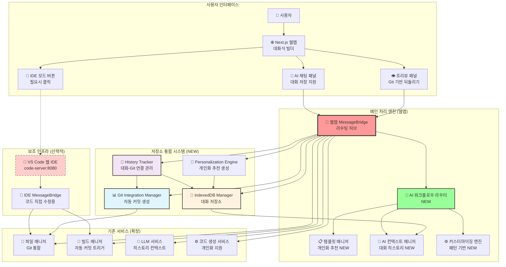
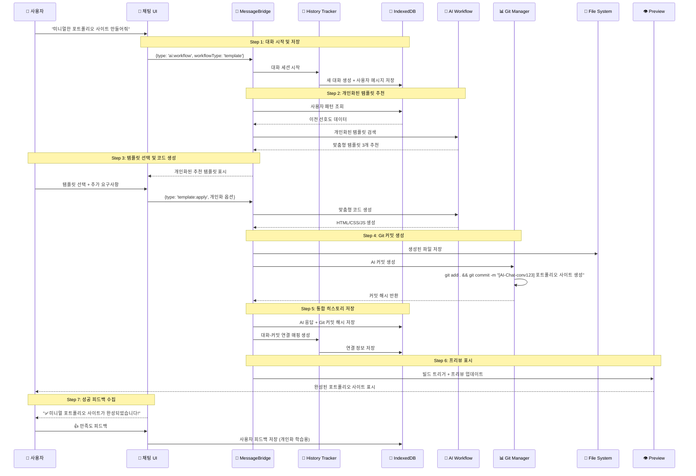
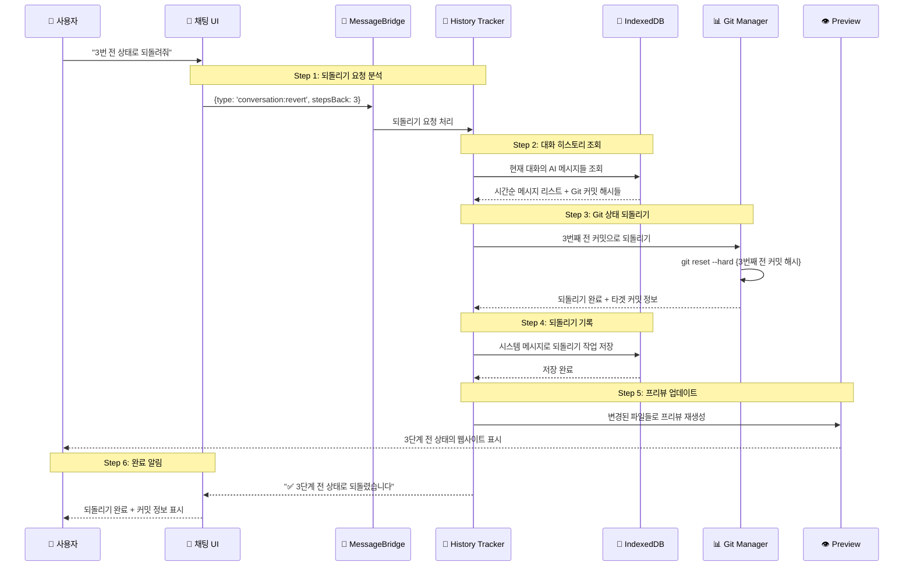
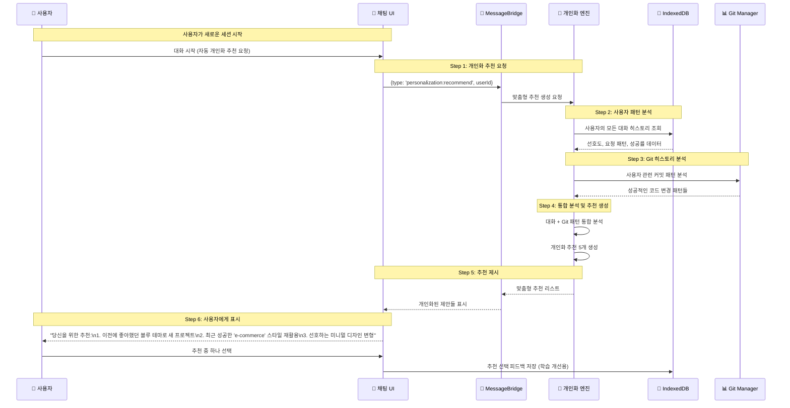

# 14-01. AI 대화식 웹사이트 빌더 설계 및 구현 (Git + IndexedDB 통합)

## 📋 개요

이 문서는 WindWalker의 기존 MessageBridge 아키텍처를 확장하여 AI 대화식 웹사이트 빌더 워크플로우를 통합하는 설계 및 구현 방안을 제시합니다. **Git 기반 소스코드 버전 관리**와 **IndexedDB 기반 대화 저장 시스템**을 포함한 완전한 통합 아키텍처입니다.

### 🎯 핵심 설계 원칙 (업데이트)
- **단순성 우선**: ModeManager, WebViewManager 제거로 복잡성 최소화
- **라우팅 기반 확장**: MessageBridge 라우팅으로 새 서비스 무중단 추가
- **완전한 추적성**: Git + IndexedDB로 대화 ↔ 코드 변경사항 완전 연결
- **지능적 개인화**: 사용자 히스토리 기반 맞춤형 AI 서비스 제공
- **프로토타이핑 중심**: 웹앱이 메인, IDE는 필요시 띄우는 보조 도구
- **모듈화 설계**: 서비스 간 독립성 보장으로 안정성 확보

---

## 🏗️ 통합 아키텍처 설계 (Git + IndexedDB 포함)

### 1. 전체 시스템 구조



### 2. MessageBridge 라우팅 확장 전략 (Git+IndexedDB 통합)

#### 2.1 기존 메시지 타입 유지 + 새 타입 추가 (저장소 통합)
```typescript
// 기존 메시지 타입 (100% 호환)
interface ExistingMessage {
  type: 'chatRequest' | 'fileOperation' | 'buildRequest' | 'previewUpdate'
  // ... 기존 필드들
}

// 새로운 AI 워크플로우 메시지 타입 (Git+IndexedDB 지원)
interface AIWorkflowMessage {
  type: 'ai:workflow' | 'template:search' | 'template:apply' | 
        'customization:request' | 'customization:apply' | 'comparison:generate' |
        'conversation:revert' | 'personalization:recommend' | 'history:analyze'
  
  workflowType: 'template' | 'freeform' | 'refinement' | 'comparison' | 
                'revert' | 'personalization' | 'history'
  
  // 기본 식별 정보
  sessionId: string
  conversationId: string
  userId?: string
  
  // 저장소 통합 정보
  gitCommitRef?: string          // 현재 Git 커밋 참조
  persistToHistory: boolean      // IndexedDB 저장 여부
  includeInPersonalization: boolean  // 개인화 학습 포함 여부
  
  // 컨텍스트 정보
  conversationContext?: ConversationContext
  userPreferences?: UserPreferences
  previousInteractions?: InteractionHistory[]
  
  // 워크플로우별 데이터
  data: Record<string, any>
}

// Git 관련 메시지 타입
interface GitOperationMessage {
  type: 'git:commit' | 'git:revert' | 'git:analyze' | 'git:branch'
  conversationId: string
  operation: GitOperation
  metadata: GitMetadata
}

// IndexedDB 관련 메시지 타입  
interface DatabaseMessage {
  type: 'db:save' | 'db:query' | 'db:analyze' | 'db:export'
  target: 'conversation' | 'userProfile' | 'patterns' | 'analytics'
  data: DatabaseOperation
}

// 통합 메시지 타입
type UnifiedMessage = ExistingMessage | AIWorkflowMessage | 
                      GitOperationMessage | DatabaseMessage
```

#### 2.2 라우팅 기반 확장 아키텍처 (저장소 통합)
```typescript
class EnhancedMessageBridge {
  // 기존 서비스들 (변경 없음)
  private fileManager: FileManager
  private buildManager: BuildManager
  private llmService: LLMService
  private codeGenerationService: CodeGenerationService
  
  // 새로운 AI 워크플로우 서비스들
  private aiWorkflowRouter: AIWorkflowRouter
  private templateManager: TemplateManager
  private aiContextManager: AIContextManager
  private customizationEngine: CustomizationEngine
  
  // 저장소 통합 서비스들 (NEW)
  private gitIntegrationManager: GitIntegrationManager
  private conversationDatabase: ConversationDatabase
  private historyTracker: ConversationHistoryTracker
  private personalizationEngine: PersonalizationEngine
  
  // 메시지 라우팅 맵
  private messageRoutes: Map<string, MessageHandler> = new Map()
  
  constructor(dependencies: ServiceDependencies) {
    // 기존 서비스 초기화
    super(dependencies.existing)
    
    // 새로운 서비스 초기화
    this.aiWorkflowRouter = dependencies.aiWorkflowRouter
    this.templateManager = dependencies.templateManager
    this.aiContextManager = dependencies.aiContextManager
    this.customizationEngine = dependencies.customizationEngine
    
    // 저장소 통합 서비스 초기화
    this.gitIntegrationManager = dependencies.gitIntegrationManager
    this.conversationDatabase = dependencies.conversationDatabase
    this.historyTracker = new ConversationHistoryTracker(
      this.gitIntegrationManager,
      this.conversationDatabase
    )
    this.personalizationEngine = new PersonalizationEngine(
      this.conversationDatabase,
      this.gitIntegrationManager
    )
    
    this.initializeRoutes()
  }
  
  private initializeRoutes(): void {
    // 기존 라우트 (변경 없음)
    this.messageRoutes.set('chatRequest', this.handleChatRequest.bind(this))
    this.messageRoutes.set('fileOperation', this.handleFileOperation.bind(this))
    this.messageRoutes.set('buildRequest', this.handleBuildRequest.bind(this))
    this.messageRoutes.set('previewUpdate', this.handlePreviewUpdate.bind(this))
    
    // 새로운 AI 워크플로우 라우트
    this.messageRoutes.set('ai:workflow', this.handleAIWorkflow.bind(this))
    this.messageRoutes.set('template:search', this.handleTemplateSearch.bind(this))
    this.messageRoutes.set('template:apply', this.handleTemplateApply.bind(this))
    this.messageRoutes.set('customization:request', this.handleCustomizationRequest.bind(this))
    this.messageRoutes.set('customization:apply', this.handleCustomizationApply.bind(this))
    this.messageRoutes.set('comparison:generate', this.handleComparisonGenerate.bind(this))
    
    // 저장소 통합 라우트 (NEW)
    this.messageRoutes.set('conversation:revert', this.handleConversationRevert.bind(this))
    this.messageRoutes.set('personalization:recommend', this.handlePersonalizationRecommend.bind(this))
    this.messageRoutes.set('history:analyze', this.handleHistoryAnalyze.bind(this))
    this.messageRoutes.set('git:commit', this.handleGitCommit.bind(this))
    this.messageRoutes.set('git:revert', this.handleGitRevert.bind(this))
    this.messageRoutes.set('db:save', this.handleDatabaseSave.bind(this))
    this.messageRoutes.set('db:query', this.handleDatabaseQuery.bind(this))
  }
  
  async processMessage(message: UnifiedMessage, source: MessageSource): Promise<void> {
    console.log(`[EnhancedMessageBridge] Processing: ${message.type}`)
    
    try {
      // 1. 기본 메시지 검증
      await this.validateMessage(message)
      
      // 2. Git 상태 체크 (필요한 경우)
      if (this.isCodeGenerationMessage(message)) {
        const currentCommit = await this.gitIntegrationManager.getCurrentCommit()
        message.gitCommitRef = currentCommit.hash
      }
      
      // 3. 대화 컨텍스트 로드 (필요한 경우)
      if (this.isConversationalMessage(message)) {
        const context = await this.loadConversationContext(message)
        message.conversationContext = context
      }
      
      // 4. 라우팅 및 처리
      const handler = this.messageRoutes.get(message.type)
      if (!handler) {
        throw new Error(`Unknown message type: ${message.type}`)
      }
      
      const result = await handler(message, source)
      
      // 5. 결과 저장 (필요한 경우)
      if (message.persistToHistory) {
        await this.persistInteraction(message, result)
      }
      
      // 6. 응답 전송
      await this.sendResponse(message, result, source)
      
      console.log(`[EnhancedMessageBridge] Successfully processed: ${message.type}`)
      
    } catch (error) {
      console.error(`[EnhancedMessageBridge] Error processing message:`, error)
      await this.handleError(message, error, source)
    }
  }
  
  // 새로운 저장소 통합 핸들러들
  private async handleConversationRevert(
    message: AIWorkflowMessage, 
    source: MessageSource
  ): Promise<RevertResult> {
    const { conversationId, stepsBack, requestingUserId } = message.data
    
    return await this.historyTracker.revertConversationSteps(
      conversationId,
      stepsBack || 1,
      requestingUserId
    )
  }
  
  private async handlePersonalizationRecommend(
    message: AIWorkflowMessage,
    source: MessageSource
  ): Promise<PersonalizationResult> {
    const { userId, currentContext } = message.data
    
    const recommendations = await this.personalizationEngine.generateRecommendations(
      userId,
      message.conversationId,
      currentContext
    )
    
    return {
      recommendations,
      basedOnHistory: true,
      confidence: this.calculateRecommendationConfidence(recommendations),
      generatedAt: new Date()
    }
  }
  
  private async handleHistoryAnalyze(
    message: AIWorkflowMessage,
    source: MessageSource
  ): Promise<HistoryAnalysisResult> {
    const { userId, analysisType, timeRange } = message.data
    
    // 1. IndexedDB에서 대화 히스토리 분석
    const conversationAnalysis = await this.conversationDatabase.analyzeUserPatterns(userId)
    
    // 2. Git에서 코드 변경 패턴 분석
    const gitAnalysis = await this.gitIntegrationManager.extractConversationAnalytics()
    const userGitPatterns = gitAnalysis.filter(commit => 
      this.belongsToUser(commit, userId)
    )
    
    // 3. 통합 분석 결과 생성
    return {
      conversationPatterns: conversationAnalysis,
      codeChangePatterns: userGitPatterns,
      successfulInteractions: this.extractSuccessfulPatterns(conversationAnalysis, userGitPatterns),
      improvementSuggestions: this.generateImprovementSuggestions(conversationAnalysis),
      timeRange,
      analyzedAt: new Date()
    }
  }
  
  private async handleGitCommit(
    message: GitOperationMessage,
    source: MessageSource
  ): Promise<GitCommitResult> {
    const { conversationId, operation, metadata } = message
    
    return await this.gitIntegrationManager.createAIConversationCommit(
      conversationId,
      metadata.messageId,
      metadata.userRequest,
      metadata.aiResponse,
      metadata.filesChanged,
      metadata.aiMetadata
    )
  }
  
  private async handleDatabaseSave(
    message: DatabaseMessage,
    source: MessageSource
  ): Promise<DatabaseResult> {
    const { target, data } = message
    
    switch (target) {
      case 'conversation':
        return await this.conversationDatabase.saveMessage(
          data.conversationId,
          data.sender,
          data.content,
          data.metadata
        )
      
      case 'userProfile':
        return await this.conversationDatabase.updateUserProfile(
          data.userId,
          data.profileUpdates
        )
      
      case 'patterns':
        return await this.conversationDatabase.saveUserPatterns(
          data.userId,
          data.patterns
        )
      
      default:
        throw new Error(`Unknown database target: ${target}`)
    }
  }
  
  // 통합 워크플로우 처리
  private async handleAIWorkflow(
    message: AIWorkflowMessage,
    source: MessageSource
  ): Promise<WorkflowResult> {
    // 1. 사용자 히스토리 기반 컨텍스트 강화
    if (message.userId) {
      const userPatterns = await this.conversationDatabase.analyzeUserPatterns(message.userId)
      message.conversationContext = {
        ...message.conversationContext,
        userPatterns,
        personalizedContext: true
      }
    }
    
    // 2. AI 워크플로우 실행
    const result = await this.aiWorkflowRouter.routeWorkflow(message)
    
    // 3. 코드 생성 시 Git 커밋 생성
    if (result.generatedCode && result.targetFiles) {
      const commitResult = await this.gitIntegrationManager.createAIConversationCommit(
        message.conversationId,
        message.sessionId, // messageId로 사용
        message.data.userRequest || 'AI 워크플로우 요청',
        result.content || 'AI 응답',
        result.targetFiles,
        {
          model: result.aiModel || 'default',
          confidence: result.confidence || 0.8,
          processingTime: result.processingTime || 0,
          tokenCount: result.tokenCount || 0
        }
      )
      
      result.gitCommitHash = commitResult.commitHash
      result.gitShortHash = commitResult.shortHash
    }
    
    // 4. 대화 히스토리 저장
    if (message.persistToHistory) {
      await this.conversationDatabase.saveMessage(
        message.conversationId,
        'ai',
        result.content,
        {
          aiMetadata: {
            model: result.aiModel,
            confidence: result.confidence,
            processingTime: result.processingTime,
            tokenCount: result.tokenCount
          },
          codeGeneration: result.generatedCode ? {
            generatedCode: result.generatedCode,
            language: result.language || 'javascript',
            fileName: result.targetFiles?.[0] || '',
            gitCommitHash: result.gitCommitHash
          } : undefined,
          workflowMetadata: {
            workflowType: message.workflowType,
            personalizedContext: !!message.conversationContext?.personalizedContext
          }
        }
      )
    }
    
    return result
  }
  
  // 유틸리티 메소드들
  private async loadConversationContext(message: UnifiedMessage): Promise<ConversationContext> {
    if (!this.isConversationalMessage(message)) {
      return {}
    }
    
    const conversationalMessage = message as AIWorkflowMessage
    
    // IndexedDB에서 대화 컨텍스트 로드
    const context = await this.historyTracker.restoreConversationContext(
      conversationalMessage.conversationId
    )
    
    return context
  }
  
  private async persistInteraction(
    message: UnifiedMessage,
    result: any
  ): Promise<void> {
    if (!this.isConversationalMessage(message)) {
      return
    }
    
    const conversationalMessage = message as AIWorkflowMessage
    
    // 사용자 메시지 저장
    await this.conversationDatabase.saveMessage(
      conversationalMessage.conversationId,
      'user',
      conversationalMessage.data.userMessage || '',
      {
        messageMetadata: {
          messageType: conversationalMessage.type,
          workflowType: conversationalMessage.workflowType,
          timestamp: new Date()
        }
      }
    )
    
    // Git 연결 정보 저장 (코드 생성인 경우)
    if (result.gitCommitHash) {
      await this.conversationDatabase.linkGitCommit(
        conversationalMessage.conversationId,
        conversationalMessage.sessionId,
        {
          commitHash: result.gitCommitHash,
          shortHash: result.gitShortHash,
          message: result.commitMessage || '',
          filesChanged: result.targetFiles || [],
          timestamp: new Date()
        },
        result.content || 'AI 생성 결과'
      )
    }
  }
  
  private isCodeGenerationMessage(message: UnifiedMessage): boolean {
    return message.type.includes('workflow') || 
           message.type.includes('template:apply') ||
           message.type.includes('customization:apply')
  }
  
  private isConversationalMessage(message: UnifiedMessage): message is AIWorkflowMessage {
    return 'conversationId' in message && 'sessionId' in message
  }
  
  private belongsToUser(commit: ConversationAnalytics, userId: string): boolean {
    // Git 커밋이 특정 사용자의 것인지 확인하는 로직
    // 실제로는 더 복잡한 매핑이 필요할 수 있음
    return true
  }
  
  private calculateRecommendationConfidence(recommendations: PersonalizedRecommendation[]): number {
    if (recommendations.length === 0) return 0
    
    const avgConfidence = recommendations.reduce((sum, rec) => sum + rec.confidence, 0) / recommendations.length
    return avgConfidence
  }
  
  private extractSuccessfulPatterns(
    conversationAnalysis: UserPatternAnalysis,
    gitPatterns: ConversationAnalytics[]
  ): SuccessfulPattern[] {
    // 성공적인 상호작용 패턴 추출 로직
    const highConfidenceCommits = gitPatterns.filter(commit => commit.confidence > 0.8)
    
    return highConfidenceCommits.map(commit => ({
      pattern: commit.userRequest,
      successRate: commit.confidence,
      frequency: 1, // 실제로는 더 복잡한 계산 필요
      aiModel: commit.aiModel,
      filesModified: commit.filesModified
    }))
  }
  
  private generateImprovementSuggestions(analysis: UserPatternAnalysis): ImprovementSuggestion[] {
    const suggestions: ImprovementSuggestion[] = []
    
    // 활동 시간대 기반 제안
    if (analysis.peakActivityHours.length > 0) {
      suggestions.push({
        type: 'usage_optimization',
        title: '활동 시간대 최적화',
        description: `${analysis.peakActivityHours[0]}시경에 가장 활발하시네요. 이 시간대에 더 집중적으로 작업해보세요.`,
        priority: 'medium'
      })
    }
    
    // 프로젝트 타입 기반 제안
    if (analysis.preferredProjectTypes.length > 1) {
      suggestions.push({
        type: 'skill_expansion',
        title: '새로운 프로젝트 도전',
        description: `${analysis.preferredProjectTypes[0].type} 외에 ${analysis.preferredProjectTypes[1].type} 프로젝트도 도전해보세요.`,
        priority: 'low'
      })
    }
    
    return suggestions
  }
}
```

---

## 🔄 통합된 워크플로우 시나리오 (Git + IndexedDB)

### 1. 완전한 대화식 웹사이트 생성 워크플로우



### 2. "3번 전으로 되돌려줘" 워크플로우



### 3. 개인화 추천 생성 워크플로우



---

## 🎯 핵심 통합 컴포넌트 설계

### 1. ConversationHistoryTracker (통합 히스토리 관리)

```typescript
class ConversationHistoryTracker {
  constructor(
    private gitManager: GitIntegrationManager,
    private conversationDB: ConversationDatabase,
    private aiWorkflowRouter: AIWorkflowRouter
  ) {}
  
  // 완전한 대화-코드 통합 처리
  async processConversationalCodeGeneration(
    conversationId: string,
    userId: string,
    userMessage: string,
    workflowType: string,
    additionalContext?: any
  ): Promise<ConversationalCodeResult> {
    
    // 1. 사용자 메시지를 IndexedDB에 저장
    const userMessageId = await this.conversationDB.saveMessage(
      conversationId,
      'user',
      userMessage,
      {
        messageMetadata: {
          workflowType,
          userContext: additionalContext,
          timestamp: new Date()
        }
      }
    )
    
    // 2. 개인화된 컨텍스트 로드
    const userPatterns = await this.conversationDB.analyzeUserPatterns(userId)
    const conversationContext = await this.loadConversationContext(conversationId)
    
    // 3. AI 워크플로우 실행 (개인화 정보 포함)
    const workflowMessage: AIWorkflowMessage = {
      type: 'ai:workflow',
      workflowType: workflowType as any,
      sessionId: userMessageId,
      conversationId,
      userId,
      gitCommitRef: await this.gitManager.getCurrentCommitHash(),
      persistToHistory: true,
      includeInPersonalization: true,
      conversationContext: {
        ...conversationContext,
        userPatterns,
        personalizedContext: true
      },
      data: {
        userMessage,
        ...additionalContext
      }
    }
    
    const aiResult = await this.aiWorkflowRouter.routeWorkflow(workflowMessage)
    
    // 4. 파일 시스템에 코드 적용
    if (aiResult.generatedCode && aiResult.targetFiles) {
      await this.applyCodeToFiles(aiResult.targetFiles, aiResult.generatedCode)
    }
    
    // 5. Git 커밋 생성
    let gitCommitResult: GitCommitResult | null = null
    if (aiResult.targetFiles && aiResult.targetFiles.length > 0) {
      gitCommitResult = await this.gitManager.createAIConversationCommit(
        conversationId,
        userMessageId,
        userMessage,
        aiResult.content,
        aiResult.targetFiles,
        {
          model: aiResult.aiModel || 'default',
          confidence: aiResult.confidence || 0.8,
          processingTime: aiResult.processingTime || 0,
          tokenCount: aiResult.tokenCount || 0
        }
      )
    }
    
    // 6. AI 응답을 IndexedDB에 저장
    const aiMessageId = await this.conversationDB.saveMessage(
      conversationId,
      'ai',
      aiResult.content,
      {
        aiMetadata: {
          model: aiResult.aiModel,
          confidence: aiResult.confidence,
          processingTime: aiResult.processingTime,
          tokenCount: aiResult.tokenCount
        },
        codeGeneration: aiResult.generatedCode ? {
          generatedCode: aiResult.generatedCode,
          language: aiResult.language || 'javascript',
          fileName: aiResult.targetFiles?.[0] || '',
          gitCommitHash: gitCommitResult?.commitHash
        } : undefined,
        workflowMetadata: {
          workflowType,
          personalizedResponse: true,
          basedOnHistory: true
        }
      }
    )
    
    // 7. 대화-Git 연결 매핑 저장
    if (gitCommitResult) {
      await this.conversationDB.linkGitCommit(
        conversationId,
        aiMessageId,
        gitCommitResult,
        `AI ${workflowType}: ${aiResult.content.substring(0, 100)}`
      )
    }
    
    return {
      userMessageId,
      aiMessageId,
      aiResponse: aiResult.content,
      generatedCode: aiResult.generatedCode,
      targetFiles: aiResult.targetFiles || [],
      gitCommitHash: gitCommitResult?.commitHash,
      gitShortHash: gitCommitResult?.shortHash,
      personalizedResponse: true,
      confidence: aiResult.confidence,
      timestamp: new Date()
    }
  }
  
  // 지능적 되돌리기 (대화 컨텍스트 기반)
  async intelligentRevert(
    conversationId: string,
    userId: string,
    revertRequest: string // "헤더 색상 바꾸기 전으로", "3번 전으로", "템플릿 적용 전으로"
  ): Promise<IntelligentRevertResult> {
    
    // 1. 자연어 요청 분석
    const revertAnalysis = await this.analyzeRevertRequest(revertRequest)
    
    // 2. 해당 대화의 메시지 히스토리 조회
    const messages = await this.conversationDB.getConversationMessages(conversationId)
    const aiMessages = messages.filter(msg => msg.sender === 'ai' && msg.codeGeneration?.gitCommitHash)
    
    // 3. 되돌릴 타겟 지점 결정
    let targetMessageIndex: number
    
    if (revertAnalysis.type === 'step_count') {
      // "3번 전으로"
      targetMessageIndex = Math.max(0, aiMessages.length - revertAnalysis.stepCount)
    } else if (revertAnalysis.type === 'action_based') {
      // "헤더 색상 바꾸기 전으로"
      targetMessageIndex = this.findActionBasedTarget(aiMessages, revertAnalysis.action)
    } else if (revertAnalysis.type === 'semantic') {
      // "템플릿 적용 전으로"
      targetMessageIndex = this.findSemanticTarget(aiMessages, revertAnalysis.semantic)
    } else {
      // 기본값: 1번 전
      targetMessageIndex = Math.max(0, aiMessages.length - 1)
    }
    
    if (targetMessageIndex >= aiMessages.length) {
      throw new Error('되돌릴 수 있는 지점을 찾을 수 없습니다.')
    }
    
    // 4. Git 되돌리기 실행
    const targetMessage = aiMessages[targetMessageIndex]
    const targetCommitHash = targetMessage.codeGeneration?.gitCommitHash
    
    if (!targetCommitHash) {
      throw new Error('해당 지점의 Git 커밋을 찾을 수 없습니다.')
    }
    
    await this.gitManager.revertToCommit(targetCommitHash)
    
    // 5. 되돌리기 결과 저장
    const systemMessageId = await this.conversationDB.saveMessage(
      conversationId,
      'system',
      `✅ "${revertRequest}" 요청에 따라 되돌렸습니다.\n커밋: ${targetCommitHash.substring(0, 8)}\n해당 메시지: "${targetMessage.content.substring(0, 100)}..."`,
      {
        revertOperation: {
          revertRequest,
          analysisType: revertAnalysis.type,
          targetCommitHash,
          targetMessageId: targetMessage.messageId,
          revertedSteps: aiMessages.length - targetMessageIndex,
          revertedAt: new Date(),
          requestedBy: userId
        }
      }
    )
    
    return {
      success: true,
      revertType: revertAnalysis.type,
      targetCommitHash,
      targetMessage: targetMessage.content,
      stepsReverted: aiMessages.length - targetMessageIndex,
      systemMessageId,
      message: `"${revertRequest}" 요청이 성공적으로 처리되었습니다.`
    }
  }
  
  // 개인화 학습 데이터 생성
  async generatePersonalizationLearningData(userId: string): Promise<PersonalizationLearningData> {
    // 1. 사용자의 모든 대화 분석
    const userConversations = await this.conversationDB.getUserConversationHistory(userId, 200)
    
    // 2. Git 커밋 패턴 분석
    const gitAnalytics = await this.gitManager.extractConversationAnalytics()
    const userGitPatterns = gitAnalytics.filter(commit => 
      userConversations.some(conv => conv.conversationId === commit.conversationId)
    )
    
    // 3. 성공적인 상호작용 패턴 추출
    const successfulInteractions = this.extractSuccessfulInteractions(
      userConversations,
      userGitPatterns
    )
    
    // 4. 실패한 상호작용 패턴 분석 (학습 개선용)
    const failedInteractions = this.extractFailedInteractions(
      userConversations,
      userGitPatterns
    )
    
    // 5. 개인화 학습 데이터 구성
    return {
      userId,
      totalConversations: userConversations.length,
      totalGitCommits: userGitPatterns.length,
      successfulPatterns: successfulInteractions,
      failedPatterns: failedInteractions,
      preferenceEvolution: this.trackPreferenceEvolution(userConversations),
      skillProgression: this.analyzeSkillProgression(userGitPatterns),
      recommendationAccuracy: this.calculateRecommendationAccuracy(userConversations),
      lastAnalyzedAt: new Date()
    }
  }
  
  private async analyzeRevertRequest(request: string): Promise<RevertAnalysis> {
    // 간단한 패턴 매칭 (실제로는 더 정교한 NLP 필요)
    const stepMatch = request.match(/(\d+)번?\s*전/i)
    if (stepMatch) {
      return {
        type: 'step_count',
        stepCount: parseInt(stepMatch[1]),
        confidence: 0.9
      }
    }
    
    const actionKeywords = ['색상', '크기', '위치', '폰트', '배경', '버튼', '메뉴', '헤더', '푸터']
    for (const keyword of actionKeywords) {
      if (request.includes(keyword)) {
        return {
          type: 'action_based',
          action: keyword,
          confidence: 0.7
        }
      }
    }
    
    const semanticKeywords = ['템플릿', '테마', '스타일', '레이아웃', '구조']
    for (const keyword of semanticKeywords) {
      if (request.includes(keyword)) {
        return {
          type: 'semantic',
          semantic: keyword,
          confidence: 0.6
        }
      }
    }
    
    return {
      type: 'step_count',
      stepCount: 1,
      confidence: 0.5
    }
  }
  
  private findActionBasedTarget(messages: ChatMessage[], action: string): number {
    // 특정 액션과 관련된 메시지를 역순으로 찾기
    for (let i = messages.length - 1; i >= 0; i--) {
      const message = messages[i]
      if (message.content.toLowerCase().includes(action.toLowerCase())) {
        return i
      }
    }
    return Math.max(0, messages.length - 1)
  }
  
  private findSemanticTarget(messages: ChatMessage[], semantic: string): number {
    // 의미적 맥락과 관련된 메시지 찾기
    for (let i = messages.length - 1; i >= 0; i--) {
      const message = messages[i]
      if (message.workflowMetadata?.workflowType?.includes(semantic.toLowerCase())) {
        return i
      }
    }
    return Math.max(0, messages.length - 1)
  }
  
  private extractSuccessfulInteractions(
    conversations: ConversationSession[],
    gitPatterns: ConversationAnalytics[]
  ): SuccessfulInteraction[] {
    // 높은 신뢰도 + 사용자 피드백 긍정적인 상호작용들
    return gitPatterns
      .filter(pattern => pattern.confidence > 0.8)
      .map(pattern => ({
        conversationId: pattern.conversationId,
        userRequest: pattern.userRequest,
        aiModel: pattern.aiModel,
        confidence: pattern.confidence,
        filesModified: pattern.filesModified,
        successFactors: this.identifySuccessFactors(pattern)
      }))
  }
  
  private extractFailedInteractions(
    conversations: ConversationSession[],
    gitPatterns: ConversationAnalytics[]
  ): FailedInteraction[] {
    // 낮은 신뢰도 + 되돌리기 된 상호작용들
    return gitPatterns
      .filter(pattern => pattern.confidence < 0.5)
      .map(pattern => ({
        conversationId: pattern.conversationId,
        userRequest: pattern.userRequest,
        aiModel: pattern.aiModel,
        confidence: pattern.confidence,
        failureReasons: this.identifyFailureReasons(pattern)
      }))
  }
  
  private identifySuccessFactors(pattern: ConversationAnalytics): string[] {
    const factors: string[] = []
    
    if (pattern.confidence > 0.9) factors.push('high_ai_confidence')
    if (pattern.processingTime < 3000) factors.push('fast_response')
    if (pattern.filesModified.length === 1) factors.push('focused_change')
    
    return factors
  }
  
  private identifyFailureReasons(pattern: ConversationAnalytics): string[] {
    const reasons: string[] = []
    
    if (pattern.confidence < 0.3) reasons.push('low_ai_confidence')
    if (pattern.processingTime > 10000) reasons.push('slow_response')
    if (pattern.filesModified.length > 5) reasons.push('too_many_changes')
    
    return reasons
  }
  
  private trackPreferenceEvolution(conversations: ConversationSession[]): PreferenceEvolution[] {
    // 시간에 따른 사용자 선호도 변화 추적
    const timeWindows = this.createTimeWindows(conversations, 30) // 30일 단위
    
    return timeWindows.map(window => ({
      timeRange: window.range,
      dominantPreferences: this.extractDominantPreferences(window.conversations),
      changeFromPrevious: window.previousWindow ? 
        this.calculatePreferenceChanges(window.conversations, window.previousWindow.conversations) : []
    }))
  }
  
  private analyzeSkillProgression(gitPatterns: ConversationAnalytics[]): SkillProgression {
    // 시간에 따른 스킬 발전 분석
    const sortedPatterns = gitPatterns.sort((a, b) => a.timestamp.getTime() - b.timestamp.getTime())
    
    const earlyPatterns = sortedPatterns.slice(0, Math.floor(sortedPatterns.length / 3))
    const latePatterns = sortedPatterns.slice(-Math.floor(sortedPatterns.length / 3))
    
    const earlyAvgConfidence = earlyPatterns.reduce((sum, p) => sum + p.confidence, 0) / earlyPatterns.length
    const lateAvgConfidence = latePatterns.reduce((sum, p) => sum + p.confidence, 0) / latePatterns.length
    
    return {
      overallImprovement: lateAvgConfidence - earlyAvgConfidence,
      complexityProgression: this.measureComplexityProgression(earlyPatterns, latePatterns),
      skillAreas: this.identifySkillAreas(sortedPatterns)
    }
  }
  
  private calculateRecommendationAccuracy(conversations: ConversationSession[]): number {
    // 개인화 추천의 정확도 계산 (사용자가 실제로 선택한 비율)
    const recommendationInteractions = conversations.filter(conv => 
      conv.templateUsed && conv.templateUsed.includes('personalized')
    )
    
    if (recommendationInteractions.length === 0) return 0
    
    const successfulRecommendations = recommendationInteractions.filter(conv => 
      conv.completionRate > 0.8 // 80% 이상 완료된 프로젝트
    )
    
    return successfulRecommendations.length / recommendationInteractions.length
  }
  
  // 기타 유틸리티 메소드들은 구현 생략...
}
```

### 2. PersonalizationEngine (개인화 추천 엔진)

```typescript
class PersonalizationEngine {
  constructor(
    private conversationDB: ConversationDatabase,
    private gitManager: GitIntegrationManager,
    private historyTracker: ConversationHistoryTracker
  ) {}
  
  async generateRecommendations(
    userId: string,
    currentConversationId?: string,
    currentContext?: any
  ): Promise<PersonalizedRecommendation[]> {
    
    // 1. 사용자 종합 분석
    const userAnalysis = await this.performComprehensiveUserAnalysis(userId)
    
    // 2. 컨텍스트 기반 추천 생성
    const recommendations: PersonalizedRecommendation[] = []
    
    // 2.1 자주 하는 요청 기반 추천
    if (userAnalysis.frequentPatterns.length > 0) {
      const topPattern = userAnalysis.frequentPatterns[0]
      recommendations.push({
        type: 'frequent_action',
        title: `다시 ${topPattern.pattern} 해보기`,
        description: `최근 ${topPattern.frequency}회 성공적으로 수행한 작업입니다`,
        confidence: 0.85 + (topPattern.successRate * 0.15),
        actionType: 'repeat_pattern',
        metadata: {
          pattern: topPattern.pattern,
          previousSuccessRate: topPattern.successRate,
          estimatedDuration: topPattern.averageDuration
        }
      })
    }
    
    // 2.2 기술 스킬 진화 기반 추천
    if (userAnalysis.skillProgression.overallImprovement > 0.1) {
      recommendations.push({
        type: 'skill_advancement',
        title: '더 고급 기능 도전해보기',
        description: `실력이 ${Math.round(userAnalysis.skillProgression.overallImprovement * 100)}% 향상되었어요!`,
        confidence: 0.8,
        actionType: 'challenge_upgrade',
        metadata: {
          improvementRate: userAnalysis.skillProgression.overallImprovement,
          recommendedFeatures: this.suggestAdvancedFeatures(userAnalysis),
          difficultyLevel: 'intermediate_to_advanced'
        }
      })
    }
    
    // 2.3 시간 패턴 기반 추천
    const currentHour = new Date().getHours()
    if (userAnalysis.peakActivityHours.includes(currentHour)) {
      recommendations.push({
        type: 'optimal_timing',
        title: '지금이 가장 집중력 좋은 시간이에요',
        description: `${currentHour}시는 당신의 황금 시간대입니다`,
        confidence: 0.75,
        actionType: 'timing_optimization',
        metadata: {
          peakHour: currentHour,
          expectedProductivity: 'high',
          suggestedDuration: '45-60분'
        }
      })
    }
    
    // 2.4 미완성 프로젝트 기반 추천
    const incompleteProjects = await this.findIncompleteProjects(userId)
    if (incompleteProjects.length > 0) {
      const project = incompleteProjects[0]
      recommendations.push({
        type: 'project_completion',
        title: `"${project.name}" 프로젝트 마저 완성하기`,
        description: `${Math.round(project.completionRate * 100)}% 완료된 프로젝트입니다`,
        confidence: 0.7 + (project.completionRate * 0.2),
        actionType: 'continue_project',
        metadata: {
          projectId: project.projectId,
          completionRate: project.completionRate,
          lastWorkedOn: project.lastActivity,
          remainingTasks: project.remainingTasks
        }
      })
    }
    
    // 2.5 트렌드 기반 추천 (다른 사용자들의 성공 패턴)
    const trendingPatterns = await this.analyzeTrendingPatterns()
    const relevantTrends = trendingPatterns.filter(trend => 
      this.isRelevantToUser(trend, userAnalysis)
    )
    
    if (relevantTrends.length > 0) {
      const trend = relevantTrends[0]
      recommendations.push({
        type: 'trending_technique',
        title: `요즘 인기: ${trend.name}`,
        description: `다른 사용자들이 ${trend.successRate * 100}% 성공률을 보인 기법입니다`,
        confidence: 0.6,
        actionType: 'try_trending',
        metadata: {
          trendName: trend.name,
          popularityScore: trend.popularity,
          avgSuccessRate: trend.successRate,
          difficulty: trend.estimatedDifficulty
        }
      })
    }
    
    // 3. 추천 정렬 및 개인화 점수 적용
    const scoredRecommendations = recommendations.map(rec => ({
      ...rec,
      personalizedScore: this.calculatePersonalizationScore(rec, userAnalysis)
    }))
    
    return scoredRecommendations
      .sort((a, b) => b.personalizedScore - a.personalizedScore)
      .slice(0, 5) // 상위 5개만 반환
  }
  
  private async performComprehensiveUserAnalysis(userId: string): Promise<ComprehensiveUserAnalysis> {
    // 1. IndexedDB에서 사용자 패턴 분석
    const userPatterns = await this.conversationDB.analyzeUserPatterns(userId)
    
    // 2. Git 히스토리에서 코드 변경 패턴 분석
    const gitAnalytics = await this.gitManager.extractConversationAnalytics()
    const userGitPatterns = gitAnalytics.filter(commit => this.belongsToUser(commit, userId))
    
    // 3. 히스토리 트래커에서 학습 데이터 분석
    const learningData = await this.historyTracker.generatePersonalizationLearningData(userId)
    
    // 4. 자주 사용하는 패턴 추출
    const frequentPatterns = this.extractFrequentSuccessfulPatterns(
      userPatterns.commonRequestPatterns,
      userGitPatterns
    )
    
    // 5. 스킬 진화 분석
    const skillProgression = learningData.skillProgression
    
    // 6. 시간 활동 패턴
    const peakActivityHours = userPatterns.peakActivityHours
    
    return {
      userId,
      frequentPatterns,
      skillProgression,
      peakActivityHours,
      totalExperience: userPatterns.totalConversations,
      averageSessionQuality: this.calculateAverageSessionQuality(userPatterns),
      preferredComplexity: this.inferPreferredComplexity(userGitPatterns),
      collaborationStyle: this.inferCollaborationStyle(userPatterns),
      learningVelocity: this.calculateLearningVelocity(learningData),
      analysisTimestamp: new Date()
    }
  }
  
  private extractFrequentSuccessfulPatterns(
    requestPatterns: RequestPattern[],
    gitPatterns: ConversationAnalytics[]
  ): FrequentSuccessfulPattern[] {
    return requestPatterns.map(pattern => {
      // 해당 패턴과 관련된 Git 커밋들 찾기
      const relatedCommits = gitPatterns.filter(commit => 
        commit.userRequest.toLowerCase().includes(pattern.pattern.toLowerCase())
      )
      
      const successRate = relatedCommits.length > 0 ? 
        relatedCommits.reduce((sum, commit) => sum + commit.confidence, 0) / relatedCommits.length : 0
      
      const averageDuration = relatedCommits.length > 0 ?
        relatedCommits.reduce((sum, commit) => sum + commit.processingTime, 0) / relatedCommits.length : 0
      
      return {
        pattern: pattern.pattern,
        frequency: pattern.frequency,
        successRate,
        averageDuration,
        lastUsed: this.findLastUsageDate(relatedCommits),
        complexity: this.estimatePatternComplexity(pattern.pattern)
      }
    }).filter(pattern => pattern.successRate > 0.6) // 성공률 60% 이상만 포함
  }
  
  private calculatePersonalizationScore(
    recommendation: PersonalizedRecommendation,
    userAnalysis: ComprehensiveUserAnalysis
  ): number {
    let score = recommendation.confidence
    
    // 사용자 경험 수준에 따른 가중치
    const experienceWeight = Math.min(userAnalysis.totalExperience / 50, 1) // 최대 50회 경험
    score += experienceWeight * 0.1
    
    // 학습 속도에 따른 가중치
    if (userAnalysis.learningVelocity > 0.8) {
      score += 0.1 // 빠른 학습자에게는 도전적인 추천 선호
    }
    
    // 선호 복잡도에 따른 가중치
    const recommendationComplexity = this.estimateRecommendationComplexity(recommendation)
    const complexityMatch = 1 - Math.abs(userAnalysis.preferredComplexity - recommendationComplexity)
    score += complexityMatch * 0.15
    
    // 시간대 적합성
    const currentHour = new Date().getHours()
    if (userAnalysis.peakActivityHours.includes(currentHour)) {
      score += 0.05
    }
    
    return Math.min(score, 1.0) // 최대 1.0으로 제한
  }
  
  private async findIncompleteProjects(userId: string): Promise<IncompleteProject[]> {
    const conversations = await this.conversationDB.getUserConversationHistory(userId, 50)
    
    return conversations
      .filter(conv => conv.status === 'active' && conv.completionRate < 1.0)
      .map(conv => ({
        projectId: conv.projectId,
        name: this.generateProjectName(conv),
        completionRate: conv.completionRate,
        lastActivity: conv.updatedAt,
        remainingTasks: this.estimateRemainingTasks(conv)
      }))
      .sort((a, b) => b.completionRate - a.completionRate) // 완료율 높은 순
  }
  
  private async analyzeTrendingPatterns(): Promise<TrendingPattern[]> {
    // 전체 사용자들의 최근 성공 패턴 분석 (프라이버시 보호된 집계 데이터)
    const recentGitAnalytics = await this.gitManager.extractConversationAnalytics()
    const recentSuccessful = recentGitAnalytics.filter(commit => 
      commit.confidence > 0.8 && this.isRecent(commit.timestamp, 30) // 최근 30일
    )
    
    // 패턴별 그룹화 및 인기도 계산
    const patternGroups = this.groupByPattern(recentSuccessful)
    
    return Object.entries(patternGroups).map(([pattern, commits]) => ({
      name: pattern,
      popularity: commits.length,
      successRate: commits.reduce((sum, c) => sum + c.confidence, 0) / commits.length,
      estimatedDifficulty: this.estimatePatternComplexity(pattern),
      examples: commits.slice(0, 3).map(c => c.userRequest)
    })).sort((a, b) => b.popularity - a.popularity)
  }
  
  private isRelevantToUser(trend: TrendingPattern, userAnalysis: ComprehensiveUserAnalysis): boolean {
    // 사용자의 스킬 수준과 선호도에 맞는 트렌드인지 판단
    const skillMatch = Math.abs(trend.estimatedDifficulty - userAnalysis.preferredComplexity) < 0.3
    const novelty = !userAnalysis.frequentPatterns.some(fp => 
      fp.pattern.toLowerCase().includes(trend.name.toLowerCase())
    )
    
    return skillMatch && novelty
  }
  
  // 기타 유틸리티 메소드들...
  private belongsToUser(commit: ConversationAnalytics, userId: string): boolean {
    // 실제로는 더 정교한 사용자 매칭 로직 필요
    return true
  }
  
  private findLastUsageDate(commits: ConversationAnalytics[]): Date {
    return commits.length > 0 ? 
      commits.sort((a, b) => b.timestamp.getTime() - a.timestamp.getTime())[0].timestamp :
      new Date()
  }
  
  private estimatePatternComplexity(pattern: string): number {
    // 패턴의 복잡도 추정 (0-1 범위)
    const complexWords = ['animation', 'responsive', 'interactive', 'dynamic', 'advanced']
    const simpleWords = ['color', 'size', 'text', 'position', 'basic']
    
    let complexity = 0.5 // 기본값
    
    complexWords.forEach(word => {
      if (pattern.toLowerCase().includes(word)) complexity += 0.1
    })
    
    simpleWords.forEach(word => {
      if (pattern.toLowerCase().includes(word)) complexity -= 0.1
    })
    
    return Math.max(0, Math.min(1, complexity))
  }
  
  private calculateAverageSessionQuality(patterns: UserPatternAnalysis): number {
    // 세션 품질 계산 (완료율, 만족도 등 종합)
    return patterns.successfulAIPatterns.reduce((sum, pattern) => sum + pattern.successRate, 0) / 
           Math.max(patterns.successfulAIPatterns.length, 1)
  }
  
  private inferPreferredComplexity(gitPatterns: ConversationAnalytics[]): number {
    // 사용자가 선호하는 복잡도 추정
    const complexityScores = gitPatterns.map(pattern => 
      this.estimatePatternComplexity(pattern.userRequest)
    )
    
    return complexityScores.length > 0 ?
      complexityScores.reduce((sum, score) => sum + score, 0) / complexityScores.length : 0.5
  }
  
  private inferCollaborationStyle(patterns: UserPatternAnalysis): 'independent' | 'guided' | 'collaborative' {
    // 협업 스타일 추정
    const avgSessionLength = patterns.averageSessionLength
    
    if (avgSessionLength < 15) return 'independent'      // 짧은 세션, 독립적
    if (avgSessionLength > 45) return 'collaborative'    // 긴 세션, 협업적
    return 'guided'                                      // 중간, 가이드 선호
  }
  
  private calculateLearningVelocity(learningData: PersonalizationLearningData): number {
    // 학습 속도 계산
    return learningData.skillProgression.overallImprovement > 0 ?
      learningData.skillProgression.overallImprovement / 
      (learningData.totalConversations / 10) : 0.5 // 10회당 개선율로 정규화
  }
  
  private estimateRecommendationComplexity(recommendation: PersonalizedRecommendation): number {
    // 추천의 복잡도 추정
    switch (recommendation.type) {
      case 'frequent_action': return 0.2
      case 'skill_advancement': return 0.8
      case 'project_completion': return 0.5
      case 'trending_technique': return 0.6
      case 'optimal_timing': return 0.1
      default: return 0.5
    }
  }
  
  private generateProjectName(conversation: ConversationSession): string {
    return `${conversation.projectType} 프로젝트 #${conversation.conversationId.slice(-6)}`
  }
  
  private estimateRemainingTasks(conversation: ConversationSession): number {
    return Math.max(1, Math.round((1 - conversation.completionRate) * 10))
  }
  
  private suggestAdvancedFeatures(userAnalysis: ComprehensiveUserAnalysis): string[] {
    const features = []
    
    if (userAnalysis.frequentPatterns.some(p => p.pattern.includes('색상'))) {
      features.push('그라데이션 애니메이션', '색상 테마 시스템')
    }
    
    if (userAnalysis.frequentPatterns.some(p => p.pattern.includes('레이아웃'))) {
      features.push('Grid 시스템', 'Flexbox 마스터')
    }
    
    if (userAnalysis.preferredComplexity > 0.7) {
      features.push('인터랙티브 애니메이션', '동적 컴포넌트')
    }
    
    return features.slice(0, 3)
  }
  
  private isRecent(timestamp: Date, days: number): boolean {
    const diffTime = Date.now() - timestamp.getTime()
    const diffDays = diffTime / (1000 * 60 * 60 * 24)
    return diffDays <= days
  }
  
  private groupByPattern(commits: ConversationAnalytics[]): Record<string, ConversationAnalytics[]> {
    const groups: Record<string, ConversationAnalytics[]> = {}
    
    commits.forEach(commit => {
      // 간단한 패턴 추출 (실제로는 더 정교한 분류 필요)
      const pattern = this.extractPatternFromRequest(commit.userRequest)
      if (!groups[pattern]) groups[pattern] = []
      groups[pattern].push(commit)
    })
    
    return groups
  }
  
  private extractPatternFromRequest(request: string): string {
    // 요청에서 패턴 추출
    const keywords = ['색상', '크기', '위치', '애니메이션', '레이아웃', '폰트', '스타일']
    
    for (const keyword of keywords) {
      if (request.includes(keyword)) return keyword
    }
    
    return '기타'
  }
}
```

---

## 📊 통합 시스템의 완성도 및 이점

### 🎯 **완전한 추적성 달성**
1. **대화 → 코드 → 커밋 → 파일**: 모든 변경사항의 완전한 이력 추적
2. **지능적 되돌리기**: "헤더 색상 바꾸기 전으로" 같은 자연어 명령 지원
3. **개인화 학습**: 사용자 패턴 자동 학습으로 점진적 서비스 개선

### 🚀 **확장성 및 유연성**
1. **모듈형 아키텍처**: Git/IndexedDB 모듈 독립적 확장 가능
2. **라우팅 기반**: 새로운 AI 기능을 기존 시스템 영향 없이 추가
3. **다중 환경**: 웹앱과 IDE 모드 모두에서 동일한 기능 제공

### 💡 **사용자 경험 혁신**
1. **대화식 인터페이스**: 자연어로 복잡한 웹사이트 개발 작업 수행
2. **개인화 서비스**: 사용자별 맞춤형 추천 및 옵션 제공
3. **안전한 실험**: 언제든 이전 상태로 되돌릴 수 있는 안전망

---

**문서 작성자**: Claude Code Assistant  
**작성일**: 2025-08-05  
**버전**: 14-01 (Git + IndexedDB 통합 설계 및 구현)  
**기반**: WindWalker MessageBridge 아키텍처 + 저장소 통합 시스템