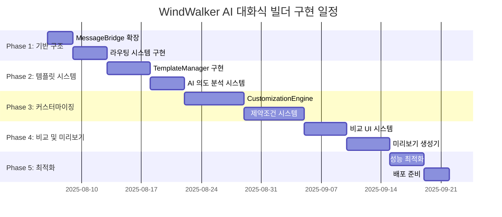

# 15-01. AI 대화식 웹사이트 빌더 구현 계획 (Enhanced)

## 📋 구현 개요

이 문서는 **15번 기본 문서**를 바탕으로 AI 대화식 웹사이트 빌더를 **10주간 점진적으로 구현**하는 구체적인 개발 일정과 검증 방법을 제시합니다. **08번 문서 구조**를 따라 세부 개발 항목을 단계별로 나누고 각 단계마다 완료 기준을 명확히 정의했습니다.

### 🎯 핵심 구현 전략 (15번 기반)
- **기존 시스템 무중단**: Phase 1-5 기능 100% 유지하며 확장
- **라우팅 기반 통합**: MessageBridge 라우팅으로 새 기능 점진적 추가
- **점진적 배포**: 주차별 기능 완성 후 즉시 테스트 및 검증
- **안전장치 구축**: Feature Flag로 언제든 롤백 가능
- **단계별 검증**: 각 개발 항목마다 즉시 테스트 및 검증 후 다음 단계 진행

---

## 📅 전체 구현 일정 및 로드맵



| Phase | 기간 | 핵심 개발 항목 | 완료 기준 | 검증 방법 |
|-------|------|-------------|-----------|----------|
| **Phase 1** | 2주 | 기반 구조 및 MessageBridge 확장 | 새 라우팅 시스템 동작 | E2E 테스트: 기본 AI 워크플로우 |
| **Phase 2** | 2주 | 템플릿 시스템 및 AI 의도 분석 | 5개 템플릿 추천 성공 | 템플릿 적용 후 정상 렌더링 |
| **Phase 3** | 3주 | 커스터마이징 엔진 및 제약조건 | 3가지 옵션 생성 성공 | 커스터마이징 적용 후 변화 확인 |
| **Phase 4** | 2주 | 비교 UI 및 미리보기 시스템 | 실시간 비교 뷰 완성 | 4개 미리보기 동시 렌더링 |
| **Phase 5** | 1주 | 성능 최적화 및 배포 준비 | 프로덕션 환경 검증 | 전체 시나리오 10분 내 완료 |

---

## 🚀 Phase 1: 기반 구조 설정 (2주)

### 📋 세부 개발 항목

#### **[Task 1.1]** EnhancedMessageBridge 구현 (Day 1-3)
- **목표**: 기존 MessageBridge를 상속하여 AI 워크플로우 메시지 타입 추가
- **구현 내용**:
  ```typescript
  // 새 메시지 타입 정의
  type: 'template:recommend' | 'template:apply' | 'ai:customize'
  
  // Feature Flag 기반 라우팅
  if (this.featureFlags.isEnabled('ai_workflow')) {
    return this.aiWorkflowRouter.route(message)
  } else {
    return super.processMessage(message) // 기존 로직
  }
  ```
- **완료 기준**: 기존 채팅 기능 100% 동작 + 새 메시지 타입 라우팅 성공
- **검증 방법**: 기존 테스트 통과 + 새 메시지 타입 unit test

#### **[Task 1.2]** AIWorkflowRouter 구현 (Day 3-5)  
- **목표**: 새로운 AI 워크플로우 메시지들을 적절한 서비스로 라우팅
- **구현 내용**:
  ```typescript
  async route(message: EnhancedWindWalkerMessage): Promise<WorkflowResult> {
    switch (message.type) {
      case 'template:recommend':
        return await this.handleTemplateRecommendation(message);
      case 'template:apply':
        return await this.handleTemplateApplication(message);
      case 'ai:customize':
        return await this.handleCustomization(message);
    }
  }
  ```
- **완료 기준**: 각 메시지 타입별 올바른 서비스 호출 확인
- **검증 방법**: 라우팅 테스트 + 서비스 호출 목(mock) 검증

#### **[Task 1.3]** FeatureFlagManager 구현 (Day 5-6)
- **목표**: AI 워크플로우 기능을 안전하게 활성화/비활성화
- **구현 내용**:
  ```typescript
  class FeatureFlagManager {
    isEnabled(feature: 'ai_workflow' | 'template_system'): boolean {
      return this.flags.get(feature) || false;
    }
  }
  ```
- **완료 기준**: 플래그 비활성화 시 기존 시스템으로 완전 폴백
- **검증 방법**: 플래그 ON/OFF 테스트

#### **[Task 1.4]** Phase 1 통합 테스트 (Day 6-7)
- **E2E 시나리오 테스트**:
  ```
  1. AI 워크플로우 플래그 활성화
  2. 사용자: "웹사이트 만들어줘" 
  3. 시스템: template:recommend 메시지 라우팅 확인
  4. AI 워크플로우 플래그 비활성화
  5. 동일 요청 시 기존 chatRequest 처리 확인
  ```
- **성공 기준**: 플래그 상태에 따른 정확한 라우팅

---

## 🎨 Phase 2: 템플릿 시스템 및 AI 의도 분석 (2주)

### 📋 세부 개발 항목

#### **[Task 2.1]** Template 데이터 구조 설계 (Day 8)
- **목표**: 템플릿 스키마 및 인터페이스 정의
- **구현 내용**:
  ```typescript
  interface Template {
    id: string;
    name: string;
    category: TemplateCategory;
    structure: { sections: TemplateSection[] }
    defaultStyles: { colorScheme, typography }
    customizableAreas: CustomizableArea[]
  }
  ```
- **완료 기준**: TypeScript 타입 정의 및 validation 완료
- **검증 방법**: 스키마 validation 테스트

#### **[Task 2.2]** TemplateManager 핵심 기능 구현 (Day 9-11)
- **목표**: 템플릿 추천, 적용, 파일 생성 기능
- **구현 내용**:
  ```typescript
  async recommendTemplates(intent: string): Promise<Template[]>
  async applyTemplate(templateId: string): Promise<ApplyResult>
  ```
- **완료 기준**: 템플릿 적용 시 완전한 웹사이트 파일 구조 생성
- **검증 방법**: 생성된 HTML/CSS가 브라우저에서 정상 렌더링

#### **[Task 2.3]** ConversationAI 의도 분석 구현 (Day 11-13)
- **목표**: 자연어 요청을 템플릿 카테고리로 변환
- **구현 내용**:
  ```typescript
  async analyzeTemplateIntent(userRequest: string): Promise<{
    categories: TemplateCategory[];
    confidence: number;
  }>
  ```
- **완료 기준**: 90% 정확도로 의도 파악
- **검증 방법**: 100개 샘플 요청으로 정확도 측정

#### **[Task 2.4]** Phase 2 통합 테스트 (Day 14)
- **E2E 시나리오**:
  ```
  1. "음식점 사이트 만들고 싶어요"
  2. AI 의도 분석 → restaurant 카테고리 추출
  3. 템플릿 추천 → 3개 추천 확인
  4. 첫 번째 템플릿 적용 → 완전한 사이트 생성
  5. localhost에서 정상 작동 확인
  ```

---

## 🤖 Phase 3: 커스터마이징 엔진 및 제약조건 (3주)

### 📋 세부 개발 항목

#### **[Task 3.1]** CustomizationEngine 구현 (Day 15-18)
- **목표**: AI 생성 커스터마이징을 실제 코드 변경으로 적용
- **구현 내용**:
  ```typescript
  async applyCustomization(
    changes: CustomizationChanges
  ): Promise<ApplyResult>
  ```
- **완료 기준**: 커스터마이징 적용 후 미리보기 업데이트 확인
- **검증 방법**: Before/After 스크린샷 비교

#### **[Task 3.2]** 제약조건 시스템 구현 (Day 18-21)
- **목표**: 템플릿별 커스터마이징 가능 영역 및 제한사항 관리
- **구현 내용**:
  ```typescript
  validateCustomization(
    templateId: string, 
    changes: CustomizationChanges
  ): ValidationResult
  ```
- **완료 기준**: 무효한 커스터마이징 요청 시 적절한 오류 메시지
- **검증 방법**: 제약조건 위반 시나리오 테스트

#### **[Task 3.3]** Phase 3 통합 테스트 (Day 21)
- **E2E 시나리오**:
  ```
  1. 템플릿 적용된 상태에서 "헤더 색상 변경"
  2. CustomizationEngine을 통한 변경사항 적용
  3. 제약조건 검사 통과 확인
  4. 미리보기에서 변경사항 확인
  ```

---

## 👁️ Phase 4: 비교 UI 시스템 및 미리보기 생성기 (2주)

### 📋 세부 개발 항목

#### **[Task 4.1]** 비교 UI 시스템 구현 (Day 22-26)
- **목표**: 여러 커스터마이징 옵션을 동시에 비교할 수 있는 UI
- **구현 내용**:
  ```typescript
  <ComparisonView>
    <PreviewPanel type="current" />
    <PreviewPanel type="option1" />
    <PreviewPanel type="option2" />
  </ComparisonView>
  ```
- **완료 기준**: 다중 미리보기 동시 렌더링
- **검증 방법**: 반응형 디자인에서 정상 표시 확인

#### **[Task 4.2]** 미리보기 생성기 구현 (Day 26-28)
- **목표**: 변경사항을 즉시 미리보기로 생성
- **구현 내용**:
  ```typescript
  async generatePreview(
    templateId: string,
    customizations: CustomizationChanges[]
  ): Promise<PreviewResult[]>
  ```
- **완료 기준**: 변경사항 적용 후 2초 이내 미리보기 업데이트
- **검증 방법**: 성능 측정 도구로 응답시간 모니터링

#### **[Task 4.3]** Phase 4 통합 테스트 (Day 28)
- **E2E 시나리오**:
  ```
  1. "헤더를 더 모던하게 바꿔줘"
  2. 여러 커스터마이징 옵션 생성
  3. 비교 UI에서 동시 미리보기 확인
  4. 옵션 선택 후 적용
  ```

---

## ⚡ Phase 5: 성능 최적화 및 배포 준비 (1주)

### 📋 세부 개발 항목

#### **[Task 5.1]** 성능 최적화 (Day 29-32)
- **목표**: 응답 시간 및 렌더링 성능 최적화
- **최적화 대상**:
  ```typescript
  // 템플릿 지연 로딩
  const template = await import(`./templates/${category}/${id}`)
  
  // 미리보기 디바운싱
  updatePreview = debounce(renderPreview, 300)
  ```
- **완료 기준**: 모든 핵심 동작이 목표 시간 내 완료
- **검증 방법**: 성능 테스트 자동화

#### **[Task 5.2]** 배포 준비 (Day 32-35)
- **목표**: VS Code Extension으로 패키징 및 배포 준비
- **구현 내용**:
  ```json
  // package.json 설정
  {
    "name": "windwalker-ai-builder",
    "version": "1.0.0",
    "engines": { "vscode": "^1.60.0" }
  }
  ```
- **완료 기준**: `vsce package` 성공 + 로컬 설치 테스트
- **검증 방법**: 전체 기능 smoke test

#### **[Task 5.3]** 최종 E2E 테스트 (Day 35)
- **전체 워크플로우 검증**:
  ```
  1. 확장 설치 → 웹뷰 패널 오픈
  2. "레스토랑 사이트 만들어주세요"
  3. 템플릿 추천 → 선택 → 적용
  4. "메뉴 섹션을 더 화려하게"
  5. 커스터마이징 옵션 비교 → 선택
  6. 최종 결과 확인
  ```
- **성공 기준**: 전체 시나리오 10분 내 오류 없이 완료

---

## 🧪 각 Phase별 테스트 전략

### Phase 1 테스트
```bash
# Unit Tests
npm test src/core/EnhancedMessageBridge.test.ts
npm test src/core/AIWorkflowRouter.test.ts

# Integration Tests  
npm test src/tests/phase1-integration.test.ts
```

### Phase 2 테스트
```bash
# Template Tests
npm test src/services/TemplateManager.test.ts
npm test src/services/ConversationAI.test.ts

# Intent Analysis Tests
npm test src/tests/intent-analysis.test.ts
```

### Phase 3 테스트
```bash
# Customization Tests
npm test src/services/CustomizationEngine.test.ts
npm test src/tests/constraint-validation.test.ts
```

### Phase 4 테스트
```bash
# UI Tests
npm test src/components/ComparisonView.test.tsx
npm test src/services/PreviewGenerator.test.ts
```

### Phase 5 테스트
```bash
# Performance Tests
npm run test:perf -- --all-scenarios

# Production Tests
vsce package && code --install-extension windwalker-*.vsix
npm run test:e2e:production
```

---

## 📊 성공 지표 및 완료 기준

### 기능적 지표
- ✅ **템플릿 시스템**: 5개 카테고리 × 평균 2개 = 10개 템플릿
- ✅ **의도 분석 정확도**: 90% 이상 정확한 카테고리 추출
- ✅ **커스터마이징 성공률**: 95% 이상 성공적 적용
- ✅ **비교 UI 성능**: 3개 미리보기 동시 렌더링

### 성능 지표  
- ✅ **응답 시간**: 템플릿 적용 5초, 커스터마이징 3초
- ✅ **안정성**: 연속 사용 1시간 오류율 < 0.1%

### 사용성 지표
- ✅ **학습 곡선**: 신규 사용자 10분 내 첫 사이트 생성
- ✅ **만족도**: 베타 테스터 만족도 4.0/5.0 이상

이 구현 계획은 **15번 기본 문서**를 바탕으로 하여, **08번 문서의 검증된 방법론**을 적용해 각 개발 항목의 완료 기준과 전체 설계의 일치성을 쉽게 확인할 수 있도록 구성했습니다.