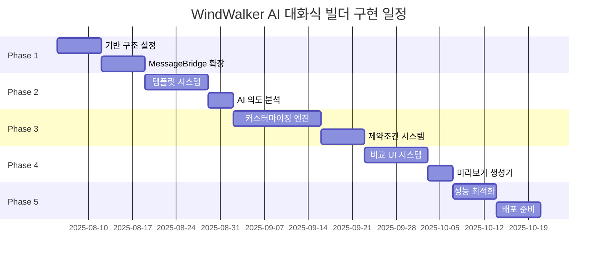

# 15. AI 대화식 웹사이트 빌더 구현 계획

## 📋 구현 개요

이 문서는 WindWalker의 기존 MessageBridge 아키텍처에 AI 대화식 웹사이트 빌더를 통합하는 **10주간의 구체적인 구현 계획**을 제시합니다. 14번 설계 문서를 바탕으로 **점진적이고 안전한 구현 방식**으로 진행합니다.

### 🎯 핵심 구현 전략
- **기존 시스템 무중단**: Phase 1-5 기능 100% 유지하며 확장
- **라우팅 기반 통합**: MessageBridge 라우팅으로 새 기능 추가
- **점진적 배포**: 주차별 기능 완성 후 즉시 테스트 및 검증
- **안전장치 구축**: Feature Flag로 언제든 롤백 가능

---

## 📅 전체 구현 일정



| Phase | 기간 | 주요 작업 | 완료 기준 |
|-------|------|-----------|-----------|
| **Phase 1** | 2주 | 기반 구조 및 MessageBridge 확장 | 새 라우팅 시스템 동작 |
| **Phase 2** | 2주 | 템플릿 시스템 및 AI 의도 분석 | 5개 템플릿 추천 성공 |
| **Phase 3** | 3주 | 커스터마이징 엔진 및 제약조건 | 3가지 옵션 생성 성공 |
| **Phase 4** | 2주 | 비교 UI 및 미리보기 시스템 | 실시간 비교 뷰 완성 |
| **Phase 5** | 1주 | 성능 최적화 및 배포 준비 | 프로덕션 환경 검증 |

---

## 🚀 Phase 1: 기반 구조 설정 (2주)

### Week 1: MessageBridge 확장 및 라우팅 시스템

#### 🎯 목표
기존 MessageBridge를 확장하여 AI 워크플로우 메시지를 처리할 수 있는 라우팅 시스템 구축

#### 📋 주요 작업

##### Day 1-2: MessageBridge 확장 설계
```typescript
// 1. 기존 MessageBridge 클래스 확장
class EnhancedMessageBridge extends MessageBridge {
  // 새로운 의존성 추가
  private aiWorkflowRouter: AIWorkflowRouter
  private serviceRegistry: ServiceRegistry
  private featureFlags: FeatureFlagManager
  
  constructor(
    // 기존 의존성들
    fileManager: FileManager,
    buildManager: BuildManager,
    llmService: LLMService,
    codeGenerationService: CodeGenerationService,
    // 새로운 의존성들
    aiWorkflowRouter: AIWorkflowRouter,
    serviceRegistry: ServiceRegistry
  ) {
    super(fileManager, buildManager, llmService, codeGenerationService)
    this.aiWorkflowRouter = aiWorkflowRouter
    this.serviceRegistry = serviceRegistry
    this.featureFlags = new FeatureFlagManager()
  }
}
```

##### Day 3-4: 라우팅 시스템 구현
```typescript
// 2. 메시지 타입 확장 (Git + IndexedDB 지원 포함)
interface AIWorkflowMessage extends Message {
  workflowType: 'template' | 'customization' | 'comparison'
  sessionId: string
  conversationContext?: ConversationContext
  gitCommitRef?: string  // Git 커밋 추적용
  persistToHistory?: boolean  // 대화 히스토리 저장 여부
}

// 3. 라우팅 로직 구현 (Git + 대화 저장 통합)
async processMessage(message: UnifiedMessage, source: MessageSource): Promise<void> {
  // Feature Flag 확인
  if (!this.featureFlags.isEnabled('ai_workflow')) {
    return await super.processMessage(message, source)
  }
  
  // Git 상태 체크 및 커밋 생성
  if (message.workflowType) {
    const gitManager = this.serviceRegistry.getService<GitManager>('gitManager')
    const currentCommit = await gitManager.getCurrentCommit()
    message.gitCommitRef = currentCommit.hash
  }
  
  // 메시지 타입별 라우팅
  if (this.isAIWorkflowMessage(message)) {
    return await this.handleAIWorkflowMessage(message, source)
  }
  
  // 기존 메시지는 기존 방식으로 처리
  return await super.processMessage(message, source)
}
```

##### Day 5-7: Git 통합 시스템 구현
```typescript
// 4. Git 버전 관리 통합
class GitVersionManager {
  private gitRepo: SimpleGit
  
  constructor(private workspacePath: string) {
    this.gitRepo = simpleGit(workspacePath)
  }
  
  // AI 대화 단위별 커밋 생성
  async createConversationCommit(
    conversationId: string, 
    message: string,
    files: string[]
  ): Promise<GitCommitInfo> {
    const commitMessage = `[AI-Chat-${conversationId}] ${message}`
    
    // 변경된 파일들 스테이징
    await this.gitRepo.add(files)
    
    // 커밋 생성 (메타데이터 포함)
    const commit = await this.gitRepo.commit(commitMessage, files, {
      '--author': 'WindWalker AI <ai@windwalker.dev>',
      '--trailer': `Conversation-ID: ${conversationId}`,
      '--trailer': `Generated-By: AI-Workflow-Engine`
    })
    
    return {
      hash: commit.commit,
      message: commitMessage,
      conversationId,
      timestamp: new Date(),
      files
    }
  }
  
  // 특정 대화로 되돌리기
  async revertToConversation(conversationId: string): Promise<void> {
    // 대화 ID로 커밋 검색
    const commits = await this.gitRepo.log({
      '--grep': `Conversation-ID: ${conversationId}`
    })
    
    if (commits.latest) {
      await this.gitRepo.reset(['--hard', commits.latest.hash])
      console.log(`✅ 대화 ${conversationId} 상태로 복구 완료`)
    }
  }
  
  // 대화 히스토리 기반 패턴 추출
  async extractConversationPatterns(): Promise<ConversationPattern[]> {
    const logs = await this.gitRepo.log({
      '--grep': 'AI-Chat-',
      '--pretty': 'format:%H|%s|%b'
    })
    
    return logs.all.map(log => ({
      commitHash: log.hash,
      conversationId: this.extractConversationId(log.message),
      message: log.message,
      timestamp: log.date,
      fileChanges: this.parseFileChanges(log)
    }))
  }
}

// 5. ServiceRegistry 구현 (Git 매니저 포함)
class ServiceRegistry {
  private services: Map<string, WindWalkerService> = new Map()
  private messageRoutes: Map<string, string> = new Map()
  
  async registerService(service: WindWalkerService): Promise<void> {
    await service.initialize()
    this.services.set(service.serviceName, service)
    
    for (const messageType of service.messageTypes) {
      this.messageRoutes.set(messageType, service.serviceName)
    }
  }
  
  getService<T extends WindWalkerService>(serviceName: string): T {
    return this.services.get(serviceName) as T
  }
}

// 6. Feature Flag 매니저
class FeatureFlagManager {
  private flags: Map<string, boolean> = new Map([
    ['ai_workflow', false],
    ['template_recommendation', false],
    ['conversational_customization', false],
    ['comparison_generation', false],
    ['git_integration', false],  // Git 통합 기능
    ['conversation_persistence', false]  // 대화 저장 기능
  ])
  
  isEnabled(flagName: string): boolean {
    return this.flags.get(flagName) || false
  }
  
  enable(flagName: string): void {
    this.flags.set(flagName, true)
    console.log(`Feature enabled: ${flagName}`)
  }
}
```

#### ✅ Week 1 완료 기준
- [ ] EnhancedMessageBridge 클래스 구현 완료
- [ ] AI 워크플로우 메시지 라우팅 동작 확인
- [ ] Feature Flag 시스템으로 안전한 활성화/비활성화 가능
- [ ] 기존 Phase 1-5 기능 100% 정상 동작

### Week 2: AI 워크플로우 라우터 및 기본 서비스

#### 🎯 목표
AI 워크플로우 라우터 구현 및 기본 서비스들 (TemplateManager, ContextManager) 골격 구현

#### 📋 주요 작업

##### Day 8-10: AIWorkflowRouter 구현
```typescript
// 1. 워크플로우 라우터 인터페이스
interface AIWorkflowRouter {
  routeWorkflow(message: AIWorkflowMessage): Promise<WorkflowResult>
  registerHandler(type: string, handler: WorkflowHandler): void
}

// 2. 구체적 구현
class ConversationalWorkflowRouter implements AIWorkflowRouter {
  private handlers: Map<string, WorkflowHandler> = new Map()
  
  constructor(
    private templateManager: TemplateManager,
    private contextManager: AIContextManager
  ) {
    this.registerDefaultHandlers()
  }
  
  private registerDefaultHandlers(): void {
    // 템플릿 관련 핸들러
    this.handlers.set('template:search', new TemplateSearchHandler(this.templateManager))
    this.handlers.set('template:recommend', new TemplateRecommendHandler(this.templateManager))
    
    // 컨텍스트 관련 핸들러
    this.handlers.set('context:update', new ContextUpdateHandler(this.contextManager))
  }
  
  async routeWorkflow(message: AIWorkflowMessage): Promise<WorkflowResult> {
    const handler = this.handlers.get(message.type)
    if (!handler) {
      throw new Error(`No handler for workflow type: ${message.type}`)
    }
    
    // 컨텍스트 로드
    const context = await this.contextManager.getContext(message.sessionId)
    
    // 워크플로우 실행
    const result = await handler.handle(message, context)
    
    // 컨텍스트 업데이트
    await this.contextManager.updateContext(message.sessionId, result.updatedContext)
    
    return result
  }
}
```

##### Day 11-12: 기본 서비스 골격 구현
```typescript
// 3. TemplateManager 골격
class TemplateManager {
  private templates: Map<string, TemplateMetadata> = new Map()
  
  constructor() {
    this.loadBasicTemplates()
  }
  
  private loadBasicTemplates(): void {
    // 기본 템플릿 5개 메타데이터만 로드 (실제 파일은 Phase 2에서)
    const basicTemplates = [
      { id: 'blog-modern', name: 'Modern Blog', category: 'blog' },
      { id: 'ecommerce-pro', name: 'E-commerce Pro', category: 'ecommerce' },
      { id: 'portfolio-creative', name: 'Creative Portfolio', category: 'portfolio' },
      { id: 'cafe-cozy', name: 'Cozy Cafe', category: 'restaurant' },
      { id: 'corporate-clean', name: 'Corporate Clean', category: 'corporate' }
    ]
    
    basicTemplates.forEach(template => {
      this.templates.set(template.id, template as TemplateMetadata)
    })
  }
  
  async searchTemplates(query: string): Promise<TemplateMetadata[]> {
    // 기본 검색 로직 (Phase 2에서 AI 기반으로 확장)
    const results = Array.from(this.templates.values())
      .filter(template => 
        template.name.toLowerCase().includes(query.toLowerCase()) ||
        template.category.toLowerCase().includes(query.toLowerCase())
      )
    
    return results.slice(0, 3)
  }
}

// 4. AIContextManager 골격
class AIContextManager {
  private contexts: Map<string, ConversationContext> = new Map()
  
  async getContext(sessionId: string): Promise<ConversationContext> {
    let context = this.contexts.get(sessionId)
    
    if (!context) {
      context = this.createNewContext(sessionId)
      this.contexts.set(sessionId, context)
    }
    
    return context
  }
  
  async updateContext(
    sessionId: string, 
    updates: Partial<ConversationContext>
  ): Promise<ConversationContext> {
    const context = await this.getContext(sessionId)
    const updatedContext = { ...context, ...updates, lastUpdated: Date.now() }
    this.contexts.set(sessionId, updatedContext)
    return updatedContext
  }
  
  private createNewContext(sessionId: string): ConversationContext {
    return {
      sessionId,
      startedAt: Date.now(),
      lastUpdated: Date.now(),
      conversationHistory: [],
      userPreferences: {},
      userBehaviorProfile: this.createDefaultProfile()
    }
  }
}
```

##### Day 13-14: 워크플로우 핸들러 기본 구현
```typescript
// 5. 워크플로우 핸들러 기본 클래스
abstract class WorkflowHandler {
  abstract handle(message: AIWorkflowMessage, context: ConversationContext): Promise<WorkflowResult>
}

// 6. 템플릿 검색 핸들러
class TemplateSearchHandler extends WorkflowHandler {
  constructor(private templateManager: TemplateManager) {
    super()
  }
  
  async handle(
    message: TemplateSearchMessage, 
    context: ConversationContext
  ): Promise<WorkflowResult> {
    
    const templates = await this.templateManager.searchTemplates(message.query)
    
    return {
      type: 'template:search:result',
      data: {
        query: message.query,
        results: templates,
        totalFound: templates.length
      },
      updatedContext: {
        ...context,
        searchHistory: [...(context.searchHistory || []), message.query]
      }
    }
  }
}

// 7. 템플릿 추천 핸들러 (기본 버전)
class TemplateRecommendHandler extends WorkflowHandler {
  constructor(private templateManager: TemplateManager) {
    super()
  }
  
  async handle(
    message: TemplateRecommendMessage, 
    context: ConversationContext
  ): Promise<WorkflowResult> {
    
    // Phase 1에서는 단순 추천 (Phase 2에서 AI 기반으로 확장)
    const allTemplates = await this.templateManager.getAllTemplates()
    const recommendations = allTemplates.slice(0, 3)
    
    return {
      type: 'template:recommend:result',
      data: {
        recommendations: recommendations.map(template => ({
          template,
          confidence: 0.8, // 임시 값
          reasons: ['기본 추천'] // 임시 값
        }))
      },
      updatedContext: context
    }
  }
}
```

#### ✅ Week 2 완료 기준
- [ ] AIWorkflowRouter 기본 동작 확인
- [ ] TemplateManager 기본 검색 기능 동작
- [ ] AIContextManager 컨텍스트 저장/로드 동작
- [ ] 워크플로우 핸들러 2개 이상 동작 확인
- [ ] 전체 시스템 통합 테스트 통과

---

## 🎨 Phase 2: 템플릿 시스템 및 AI 의도 분석 (2주)

### Week 3: 템플릿 시스템 구현

#### 🎯 목표
5개 기본 템플릿 제작 및 메타데이터 시스템, 템플릿 로딩 및 관리 시스템 완성

#### 📋 주요 작업

##### Day 15-16: 템플릿 메타데이터 구조 완성
```typescript
// 1. 완전한 템플릿 메타데이터 구조
interface TemplateMetadata {
  id: string
  name: string
  category: 'blog' | 'ecommerce' | 'portfolio' | 'restaurant' | 'corporate'
  description: string
  tags: string[]
  
  // AI 워크플로우 지원
  aiCapabilities: {
    customizationPoints: CustomizationPoint[]
    supportedWorkflows: WorkflowType[]
    intelligentDefaults: Record<string, any>
  }
  
  // 파일 구조
  files: {
    html: string[]
    css: string[]
    js: string[]
    assets: string[]
  }
  
  // 미리보기 정보
  previewImages: {
    desktop: string
    tablet: string
    mobile: string
  }
  
  // 비즈니스 정보
  industry: string[]
  targetAudience: string[]
  keyFeatures: string[]
}

// 2. 커스터마이징 포인트 정의
interface CustomizationPoint {
  id: string
  name: string
  type: 'color' | 'layout' | 'content' | 'typography' | 'component'
  description: string
  
  // AI 지원 정보
  aiPromptHints: string[]
  constraintRules: ConstraintRule[]
  
  // 기술적 매핑
  cssSelectors: string[]
  componentProps: string[]
  affectedFiles: string[]
}
```

##### Day 17-19: 기본 템플릿 5개 제작
```typescript
// 3. 블로그 템플릿 상세 구현
const blogTemplate: TemplateMetadata = {
  id: 'blog-modern-001',
  name: 'Modern Blog',
  category: 'blog',
  description: '깔끔하고 읽기 쉬운 현대적 블로그 템플릿',
  tags: ['responsive', 'seo-friendly', 'dark-mode'],
  
  aiCapabilities: {
    customizationPoints: [
      {
        id: 'header-style',
        name: '헤더 스타일',
        type: 'layout',
        description: '헤더 레이아웃과 네비게이션 스타일',
        aiPromptHints: ['네비게이션', '로고 위치', '메뉴 스타일'],
        constraintRules: [
          { type: 'layout', allowed: ['centered', 'left-aligned', 'split'] },
          { type: 'menu-items', max: 7 }
        ],
        cssSelectors: ['.header', '.navigation', '.logo'],
        componentProps: ['headerStyle', 'navigationLayout'],
        affectedFiles: ['index.html', 'style.css']
      },
      {
        id: 'color-scheme',
        name: '컬러 스킴',
        type: 'color',
        description: '전체 사이트 색상 테마',
        aiPromptHints: ['브랜드 컬러', '다크모드', 'accent 컬러'],
        constraintRules: [
          { type: 'contrast', min: 4.5 }, // WCAG AA
          { type: 'color-count', max: 5 }
        ],
        cssSelectors: [':root', '.theme-colors'],
        componentProps: ['primaryColor', 'secondaryColor'],
        affectedFiles: ['style.css', 'theme.css']
      }
    ],
    supportedWorkflows: ['template', 'customization', 'comparison'],
    intelligentDefaults: {
      primaryColor: '#2563eb',
      headerStyle: 'centered',
      postLayout: 'grid'
    }
  },
  
  files: {
    html: ['index.html', 'post.html', 'about.html'],
    css: ['style.css', 'theme.css', 'responsive.css'],
    js: ['main.js', 'theme-toggle.js'],
    assets: ['hero-bg.jpg', 'author-avatar.jpg']
  },
  
  previewImages: {
    desktop: '/templates/blog-modern/preview-desktop.jpg',
    tablet: '/templates/blog-modern/preview-tablet.jpg',
    mobile: '/templates/blog-modern/preview-mobile.jpg'
  },
  
  industry: ['media', 'personal', 'education'],
  targetAudience: ['writers', 'journalists', 'educators'],
  keyFeatures: ['SEO 최적화', '다크모드', '반응형', '소셜 공유']
}
```

##### Day 20-21: 템플릿 파일 시스템 구현
```typescript
// 4. 템플릿 파일 매니저
class TemplateFileManager {
  private readonly templatesBasePath = 'workspace/templates'
  
  async loadTemplateFiles(templateId: string): Promise<TemplateFiles> {
    const metadata = await this.getTemplateMetadata(templateId)
    const files: TemplateFiles = {}
    
    // HTML 파일 로드
    for (const htmlFile of metadata.files.html) {
      const content = await this.readFile(`${this.templatesBasePath}/${templateId}/${htmlFile}`)
      files[htmlFile] = content
    }
    
    // CSS 파일 로드
    for (const cssFile of metadata.files.css) {
      const content = await this.readFile(`${this.templatesBasePath}/${templateId}/${cssFile}`)
      files[cssFile] = content
    }
    
    // JS 파일 로드
    for (const jsFile of metadata.files.js) {
      const content = await this.readFile(`${this.templatesBasePath}/${templateId}/${jsFile}`)
      files[jsFile] = content
    }
    
    return files
  }
  
  async applyTemplateToProject(
    templateId: string, 
    projectPath: string
  ): Promise<void> {
    
    const templateFiles = await this.loadTemplateFiles(templateId)
    
    // 프로젝트 디렉토리에 파일 복사
    for (const [filename, content] of Object.entries(templateFiles)) {
      await this.writeFile(`${projectPath}/${filename}`, content)
    }
    
    // package.json 설정
    await this.setupProjectConfig(templateId, projectPath)
  }
  
  private async setupProjectConfig(templateId: string, projectPath: string): Promise<void> {
    const metadata = await this.getTemplateMetadata(templateId)
    
    const packageJson = {
      name: `windwalker-project-${Date.now()}`,
      version: '1.0.0',
      description: metadata.description,
      scripts: {
        dev: 'vite',
        build: 'vite build',
        preview: 'vite preview'
      },
      dependencies: metadata.dependencies || {},
      devDependencies: {
        'vite': '^4.0.0'
      }
    }
    
    await this.writeFile(
      `${projectPath}/package.json`, 
      JSON.stringify(packageJson, null, 2)
    )
  }
}

// 5. 템플릿 매니저 확장
class EnhancedTemplateManager extends TemplateManager {
  private fileManager: TemplateFileManager
  
  constructor() {
    super()
    this.fileManager = new TemplateFileManager()
  }
  
  async applyTemplate(
    templateId: string, 
    projectPath: string, 
    customizations?: TemplateCustomization
  ): Promise<ApplyTemplateResult> {
    
    try {
      // 1. 템플릿 파일 적용
      await this.fileManager.applyTemplateToProject(templateId, projectPath)
      
      // 2. 커스터마이징 적용 (있는 경우)
      if (customizations) {
        await this.applyCustomizations(templateId, projectPath, customizations)
      }
      
      // 3. 빌드 설정
      await this.setupBuildConfiguration(templateId, projectPath)
      
      return {
        success: true,
        templateId,
        projectPath,
        appliedAt: Date.now(),
        customizations: customizations || null
      }
      
    } catch (error) {
      return {
        success: false,
        templateId,
        projectPath,
        error: error.message,
        appliedAt: Date.now()
      }
    }
  }
}
```

### Week 4: AI 의도 분석 시스템

#### 🎯 목표
사용자 입력을 분석하여 의도를 파악하고 적절한 템플릿을 추천하는 AI 시스템 구현

#### 📋 주요 작업

##### Day 22-23: 의도 분석 AI 프롬프트 개발
```typescript
// 1. 의도 분석 프롬프트 시스템
class IntentAnalyzer {
  private llmService: LLMService
  
  constructor(llmService: LLMService) {
    this.llmService = llmService
  }
  
  async analyzeUserIntent(
    userInput: string, 
    context?: ConversationContext
  ): Promise<UserIntent> {
    
    const prompt = this.buildAnalysisPrompt(userInput, context)
    const response = await this.llmService.generateResponse(prompt)
    
    return this.parseIntentResponse(response)
  }
  
  private buildAnalysisPrompt(userInput: string, context?: ConversationContext): string {
    return `
사용자 입력을 분석하여 웹사이트 구축 의도를 파악해주세요.

사용자 입력: "${userInput}"

${context ? `대화 맥락: ${this.formatContext(context)}` : ''}

다음 형식으로 JSON 응답해주세요:
{
  "businessType": "blog|ecommerce|portfolio|restaurant|corporate|landing",
  "purpose": "showcase|sales|information|engagement|branding",
  "industry": "해당 산업 분야",
  "targetAudience": "주요 타겟층",
  "requiredFeatures": ["기능1", "기능2", ...],
  "designPreferences": {
    "style": "modern|classic|minimalist|bold",
    "colors": ["색상1", "색상2", ...],
    "layout": "grid|list|card|magazine"
  },
  "businessInfo": {
    "name": "비즈니스 이름 (있는 경우)",
    "description": "간단한 설명"
  },
  "confidence": 0.85,
  "reasoning": ["판단 근거1", "판단 근거2", ...]
}

분석 시 고려사항:
- 명시적 키워드: "쇼핑몰", "블로그", "포트폴리오" 등
- 암시적 의도: "제품 판매", "작품 전시", "회사 소개" 등  
- 업종 정보: "카페", "디자이너", "개발자" 등
- 디자인 선호: "깔끔한", "화려한", "심플한" 등
`
  }
  
  private parseIntentResponse(response: string): UserIntent {
    try {
      const parsed = JSON.parse(response)
      
      // 유효성 검증
      this.validateIntentResponse(parsed)
      
      return {
        businessType: parsed.businessType,
        purpose: parsed.purpose,
        industry: parsed.industry,
        targetAudience: parsed.targetAudience,
        requiredFeatures: parsed.requiredFeatures || [],
        designPreferences: parsed.designPreferences || {},
        businessInfo: parsed.businessInfo || {},
        confidence: Math.min(Math.max(parsed.confidence || 0.5, 0), 1),
        reasoning: parsed.reasoning || [],
        analyzedAt: Date.now()
      }
      
    } catch (error) {
      console.warn('Failed to parse intent response:', error)
      return this.createFallbackIntent(response)
    }
  }
}
```

##### Day 24-25: 지능형 템플릿 추천 엔진
```typescript
// 2. 추천 엔진 구현
class IntelligentRecommendationEngine {
  private templateManager: TemplateManager
  private intentAnalyzer: IntentAnalyzer
  
  async generateRecommendations(
    userInput: string,
    context?: ConversationContext
  ): Promise<TemplateRecommendation[]> {
    
    // 1. 의도 분석
    const intent = await this.intentAnalyzer.analyzeUserIntent(userInput, context)
    
    // 2. 템플릿 후보 검색
    const candidates = await this.findCandidateTemplates(intent)
    
    // 3. 스코어링 및 랭킹
    const scoredTemplates = await this.scoreTemplates(candidates, intent, context)
    
    // 4. 상위 3개 추천
    const topRecommendations = scoredTemplates
      .sort((a, b) => b.score - a.score)
      .slice(0, 3)
    
    return topRecommendations.map(scored => ({
      template: scored.template,
      confidence: scored.score,
      reasons: this.generateReasons(scored.template, intent, scored.analysis),
      customizationSuggestions: this.generateCustomizationSuggestions(scored.template, intent)
    }))
  }
  
  private async scoreTemplates(
    candidates: TemplateMetadata[],
    intent: UserIntent,
    context?: ConversationContext
  ): Promise<ScoredTemplate[]> {
    
    return Promise.all(candidates.map(async template => {
      let score = 0
      const analysis: ScoreAnalysis = {}
      
      // 비즈니스 타입 매칭 (40%)
      if (template.category === intent.businessType) {
        score += 0.4
        analysis.businessTypeMatch = 'exact'
      } else if (this.isCategoryCompatible(template.category, intent.businessType)) {
        score += 0.2
        analysis.businessTypeMatch = 'compatible'
      }
      
      // 기능 매칭 (30%)
      const featureMatchScore = this.calculateFeatureMatch(template.keyFeatures, intent.requiredFeatures)
      score += featureMatchScore * 0.3
      analysis.featureMatchScore = featureMatchScore
      analysis.matchingFeatures = this.findMatchingFeatures(template.keyFeatures, intent.requiredFeatures)
      
      // 산업 매칭 (20%)
      const industryMatchScore = this.calculateIndustryMatch(template.industry, intent.industry)
      score += industryMatchScore * 0.2
      analysis.industryMatchScore = industryMatchScore
      
      // 디자인 선호도 매칭 (10%)
      const designMatchScore = this.calculateDesignMatch(template.tags, intent.designPreferences)
      score += designMatchScore * 0.1
      analysis.designMatchScore = designMatchScore
      
      // 컨텍스트 기반 개인화 보정
      if (context && context.userBehaviorProfile) {
        const personalizedBoost = this.calculatePersonalizedBoost(template, context.userBehaviorProfile)
        score *= (1 + personalizedBoost)
        analysis.personalizedBoost = personalizedBoost
      }
      
      return {
        template,
        score: Math.min(score, 1.0),
        analysis
      }
    }))
  }
  
  private generateReasons(
    template: TemplateMetadata,
    intent: UserIntent,
    analysis: ScoreAnalysis
  ): string[] {
    
    const reasons: string[] = []
    
    // 비즈니스 타입 매칭
    if (analysis.businessTypeMatch === 'exact') {
      reasons.push(`${intent.businessType} 카테고리에 완벽하게 맞습니다`)
    } else if (analysis.businessTypeMatch === 'compatible') {
      reasons.push(`${intent.businessType}과 호환되는 디자인입니다`)
    }
    
    // 기능 매칭
    if (analysis.matchingFeatures && analysis.matchingFeatures.length > 0) {
      reasons.push(`요청하신 ${analysis.matchingFeatures.join(', ')} 기능을 지원합니다`)
    }
    
    // 산업 매칭
    if (analysis.industryMatchScore > 0.7) {
      reasons.push(`${intent.industry} 업종에 최적화되어 있습니다`)
    }
    
    // 디자인 선호도
    if (analysis.designMatchScore > 0.5 && intent.designPreferences.style) {
      reasons.push(`선호하시는 ${intent.designPreferences.style} 스타일을 반영했습니다`)
    }
    
    // 개인화
    if (analysis.personalizedBoost && analysis.personalizedBoost > 0.1) {
      reasons.push('이전 선택 패턴을 바탕으로 추천드립니다')
    }
    
    return reasons
  }
}
```

#### ✅ Phase 2 완료 기준
- [ ] 5개 템플릿 메타데이터 및 파일 완성
- [ ] AI 의도 분석 80% 이상 정확도
- [ ] 템플릿 추천 시스템 동작 확인
- [ ] 사용자 입력 → 템플릿 추천 전체 플로우 성공

---

## ⚙️ Phase 3: 커스터마이징 엔진 및 제약조건 시스템 (3주)

### Week 5-6: 커스터마이징 엔진 구현

#### 🎯 목표
사용자 요청을 분석하여 3가지 강도의 커스터마이징 옵션을 생성하는 엔진 구현

#### 📋 주요 작업

##### Day 26-28: 커스터마이징 요청 분석 시스템
```typescript
// 1. 커스터마이징 요청 분석기
class CustomizationRequestAnalyzer {
  private llmService: LLMService
  
  async analyzeRequest(
    request: string,
    currentProject: ProjectState,
    context: ConversationContext
  ): Promise<CustomizationAnalysis> {
    
    const prompt = this.buildAnalysisPrompt(request, currentProject, context)
    const response = await this.llmService.generateResponse(prompt)
    
    return this.parseAnalysisResponse(response)
  }
  
  private buildAnalysisPrompt(
    request: string,
    project: ProjectState,
    context: ConversationContext
  ): string {
    
    return `
사용자의 웹사이트 커스터마이징 요청을 분석해주세요.

현재 템플릿: ${project.templateBase.name} (${project.templateBase.category})
사용자 요청: "${request}"
대화 맥락: ${this.formatConversationContext(context)}

분석해야 할 항목:
1. 수정 대상 컴포넌트/영역
2. 수정 유형 (색상, 레이아웃, 콘텐츠, 폰트, 기능)
3. 구체성 수준 (구체적, 보통, 모호함)
4. 의도 명확성 (명확, 보통, 불명확)
5. 기술적 복잡도 (낮음, 보통, 높음)

다음 JSON 형식으로 응답해주세요:
{
  "targetComponent": "header|content|footer|navigation|sidebar|全체",
  "changeType": "color|layout|content|typography|component|functionality",
  "specificChanges": {
    "colors": {"primary": "#color", "secondary": "#color"},
    "layout": {"type": "grid|flex|absolute", "arrangement": "..."},
    "content": {"text": "...", "images": ["..."]},
    "typography": {"font": "...", "size": "...", "weight": "..."},
    "functionality": ["feature1", "feature2"]
  },
  "specificity": "specific|moderate|vague",
  "intentClarity": "clear|moderate|unclear", 
  "technicalComplexity": "low|medium|high",
  "userExpectation": "conservative|balanced|bold",
  "contextualReferences": ["previous_request_1", "previous_request_2"],
  "confidence": 0.85,
  "reasoning": ["이유1", "이유2", ...]
}

분석 예시:
- "헤더를 더 모던하게 바꿔줘" → targetComponent: "header", changeType: "layout", specificity: "vague"
- "메인 색상을 파란색(#2563eb)로 변경" → targetComponent: "전체", changeType: "color", specificity: "specific"
- "상품 카드 레이아웃을 3열에서 4열로" → targetComponent: "content", changeType: "layout", specificity: "specific"
`
  }
}
```

##### Day 29-31: 3가지 강도 옵션 생성 엔진
```typescript
// 2. 옵션 생성 엔진
class CustomizationOptionGenerator {
  private llmService: LLMService
  private constraintEngine: ConstraintEngine
  
  async generateOptions(
    analysis: CustomizationAnalysis,
    project: ProjectState,
    context: ConversationContext
  ): Promise<CustomizationOption[]> {
    
    // 1. 제약 조건 확인
    const constraints = await this.constraintEngine.getConstraints(project, analysis)
    
    // 2. 3가지 강도별 옵션 생성
    const options = await Promise.all([
      this.generateConservativeOption(analysis, project, constraints, context),
      this.generateBalancedOption(analysis, project, constraints, context),
      this.generateBoldOption(analysis, project, constraints, context)
    ])
    
    return options
  }
  
  private async generateConservativeOption(
    analysis: CustomizationAnalysis,
    project: ProjectState,
    constraints: ProjectConstraints,
    context: ConversationContext
  ): Promise<CustomizationOption> {
    
    const prompt = `
보수적 접근법으로 커스터마이징 옵션을 생성해주세요.

원칙:
- 기존 디자인 언어 최대한 유지
- 최소한의 변경으로 요구사항 충족
- 호환성과 안정성 우선
- 기존 사용자 경험 패턴 유지

사용자 요청 분석: ${JSON.stringify(analysis)}
현재 프로젝트: ${JSON.stringify(project.templateBase)}
제약 조건: ${JSON.stringify(constraints)}

다음 형식으로 응답해주세요:
{
  "intensity": "conservative",
  "description": "보수적 수정 설명",
  "changes": {
    "files": {
      "style.css": "/* CSS 변경사항 */",
      "index.html": "<!-- HTML 변경사항 -->"
    },
    "components": {
      "componentName": {"prop": "value"}
    }
  },
  "reasoning": ["변경 근거1", "변경 근거2"],
  "technicalImpact": "low",
  "visualImpact": "subtle",
  "estimatedTime": "5분"
}
`
    
    const response = await this.llmService.generateResponse(prompt)
    return this.parseOptionResponse(response, 'conservative')
  }
  
  private async generateBalancedOption(
    analysis: CustomizationAnalysis,
    project: ProjectState,
    constraints: ProjectConstraints,
    context: ConversationContext
  ): Promise<CustomizationOption> {
    
    const prompt = `
균형적 접근법으로 커스터마이징 옵션을 생성해주세요.

원칙:
- 적절한 수준의 혁신과 안정성
- 사용자 요구에 맞는 적극적 개선
- 현대적 디자인 트렌드 반영
- 사용성과 미적 가치의 균형

사용자 요청 분석: ${JSON.stringify(analysis)}
현재 프로젝트: ${JSON.stringify(project.templateBase)}
제약 조건: ${JSON.stringify(constraints)}

다음 형식으로 응답해주세요:
{
  "intensity": "balanced",
  "description": "균형적 수정 설명",
  "changes": {
    "files": {
      "style.css": "/* CSS 변경사항 */",
      "index.html": "<!-- HTML 변경사항 -->"
    },
    "components": {
      "componentName": {"prop": "value"}
    }
  },
  "reasoning": ["변경 근거1", "변경 근거2"],
  "technicalImpact": "medium",
  "visualImpact": "noticeable",
  "estimatedTime": "10분"
}
`
    
    const response = await this.llmService.generateResponse(prompt)
    return this.parseOptionResponse(response, 'balanced')
  }
  
  private async generateBoldOption(
    analysis: CustomizationAnalysis,
    project: ProjectState,
    constraints: ProjectConstraints,
    context: ConversationContext
  ): Promise<CustomizationOption> {
    
    const prompt = `
대담한 접근법으로 커스터마이징 옵션을 생성해주세요.

원칙:
- 창의적이고 혁신적인 디자인
- 최신 웹 기술과 트렌드 적극 활용
- 시각적 임팩트 극대화
- 독특하고 기억에 남는 경험 제공

사용자 요청 분석: ${JSON.stringify(analysis)}
현재 프로젝트: ${JSON.stringify(project.templateBase)}
제약 조건: ${JSON.stringify(constraints)}

다음 형식으로 응답해주세요:
{
  "intensity": "bold",
  "description": "대담한 수정 설명",
  "changes": {
    "files": {
      "style.css": "/* CSS 변경사항 */",
      "index.html": "<!-- HTML 변경사항 -->"
    },
    "components": {
      "componentName": {"prop": "value"}
    }
  },
  "reasoning": ["변경 근거1", "변경 근거2"],
  "technicalImpact": "high",
  "visualImpact": "dramatic",
  "estimatedTime": "15분"
}
`
    
    const response = await this.llmService.generateResponse(prompt)
    return this.parseOptionResponse(response, 'bold')
  }
}
```

##### Day 32-35: 커스터마이징 적용 엔진
```typescript
// 3. 커스터마이징 적용 엔진
class CustomizationApplicator {
  private fileManager: FileManager
  private buildManager: BuildManager
  
  async applyCustomization(
    option: CustomizationOption,
    project: ProjectState
  ): Promise<CustomizationResult> {
    
    try {
      // 1. 백업 생성
      const backup = await this.createBackup(project)
      
      // 2. 파일 변경사항 적용
      const fileResults = await this.applyFileChanges(option.changes.files, project)
      
      // 3. 컴포넌트 변경사항 적용
      const componentResults = await this.applyComponentChanges(option.changes.components, project)
      
      // 4. 설정 파일 업데이트
      await this.updateProjectConfig(option, project)
      
      // 5. 빌드 트리거
      const buildResult = await this.buildManager.build(project.projectPath)
      
      return {
        success: true,
        appliedOption: option,
        fileChanges: fileResults,
        componentChanges: componentResults,
        buildResult,
        backup,
        appliedAt: Date.now()
      }
      
    } catch (error) {
      // 에러 발생 시 롤백
      if (backup) {
        await this.restoreBackup(backup, project)
      }
      
      return {
        success: false,
        appliedOption: option,
        error: error.message,
        appliedAt: Date.now()
      }
    }
  }
  
  private async applyFileChanges(
    fileChanges: Record<string, string>,
    project: ProjectState
  ): Promise<FileChangeResult[]> {
    
    const results: FileChangeResult[] = []
    
    for (const [filename, changes] of Object.entries(fileChanges)) {
      try {
        const filePath = `${project.projectPath}/${filename}`
        
        // 기존 파일 읽기
        const originalContent = await this.fileManager.readFile(filePath)
        
        // 변경사항 적용
        const newContent = await this.mergeChanges(originalContent, changes, filename)
        
        // 파일 쓰기
        await this.fileManager.writeFile(filePath, newContent)
        
        results.push({
          filename,
          success: true,
          originalSize: originalContent.length,
          newSize: newContent.length
        })
        
      } catch (error) {
        results.push({
          filename,
          success: false,
          error: error.message
        })
      }
    }
    
    return results
  }
  
  private async mergeChanges(
    originalContent: string,
    changes: string,
    filename: string
  ): Promise<string> {
    
    const fileExtension = filename.split('.').pop()
    
    switch (fileExtension) {
      case 'css':
        return this.mergeCSSChanges(originalContent, changes)
      case 'html':
        return this.mergeHTMLChanges(originalContent, changes)
      case 'js':
        return this.mergeJSChanges(originalContent, changes)
      default:
        throw new Error(`Unsupported file type: ${fileExtension}`)
    }
  }
  
  private mergeCSSChanges(original: string, changes: string): string {
    // CSS 변경사항 병합 로직
    // 1. CSS 파싱
    // 2. 변경사항 식별 및 적용
    // 3. 최적화된 CSS 생성
    
    // 간단한 구현 (실제로는 더 정교한 CSS 파서 필요)
    const newRules = this.extractCSSRules(changes)
    let updatedCSS = original
    
    for (const rule of newRules) {
      if (this.cssRuleExists(original, rule.selector)) {
        // 기존 룰 업데이트
        updatedCSS = this.updateCSSRule(updatedCSS, rule)
      } else {
        // 새 룰 추가
        updatedCSS += `\n\n${rule.selector} {\n${rule.properties}\n}`
      }
    }
    
    return updatedCSS
  }
}
```

### Week 7: 제약조건 시스템 구현

#### 🎯 목표
커스터마이징 요청의 기술적/디자인적 제약조건을 검증하고 해결방안을 제시하는 시스템 구현

#### 📋 주요 작업

##### Day 36-38: 제약조건 엔진 구현
```typescript
// 1. 제약조건 엔진
class AdvancedConstraintEngine {
  private rules: ConstraintRule[] = []
  private validators: Map<string, ConstraintValidator> = new Map()
  
  constructor() {
    this.initializeValidators()
    this.loadConstraintRules()
  }
  
  private initializeValidators(): void {
    this.validators.set('technical', new TechnicalConstraintValidator())
    this.validators.set('design', new DesignConstraintValidator())
    this.validators.set('accessibility', new AccessibilityConstraintValidator())
    this.validators.set('performance', new PerformanceConstraintValidator())
    this.validators.set('business', new BusinessConstraintValidator())
  }
  
  async validateRequest(
    analysis: CustomizationAnalysis,
    project: ProjectState
  ): Promise<ValidationResult> {
    
    const results = await Promise.all(
      Array.from(this.validators.entries()).map(async ([type, validator]) => {
        const result = await validator.validate(analysis, project)
        return { type, ...result }
      })
    )
    
    const violations = results.flatMap(r => r.violations || [])
    const warnings = results.flatMap(r => r.warnings || [])
    const suggestions = results.flatMap(r => r.suggestions || [])
    
    return {
      isValid: violations.length === 0,
      violations,
      warnings,
      suggestions,
      validationResults: results,
      
      // 해결 전략 생성
      resolutionStrategies: this.generateResolutionStrategies(violations, warnings),
      alternativeApproaches: this.generateAlternatives(analysis, violations)
    }
  }
}

// 2. 기술적 제약조건 검증기
class TechnicalConstraintValidator implements ConstraintValidator {
  async validate(
    analysis: CustomizationAnalysis,
    project: ProjectState
  ): Promise<ConstraintValidationResult> {
    
    const violations: ConstraintViolation[] = []
    const warnings: ConstraintWarning[] = []
    const suggestions: ConstraintSuggestion[] = []
    
    // 컴포넌트 호환성 검사
    if (analysis.targetComponent) {
      const componentCheck = await this.validateComponentCompatibility(
        analysis.targetComponent, 
        project
      )
      violations.push(...componentCheck.violations)
      warnings.push(...componentCheck.warnings)
    }
    
    // 의존성 검사
    if (analysis.specificChanges.functionality) {
      const dependencyCheck = await this.validateDependencies(
        analysis.specificChanges.functionality,
        project
      )
      warnings.push(...dependencyCheck.warnings)
      suggestions.push(...dependencyCheck.suggestions)
    }
    
    // 파일 구조 검사
    const fileStructureCheck = await this.validateFileStructure(analysis, project)
    violations.push(...fileStructureCheck.violations)
    
    // 빌드 시스템 호환성
    const buildCompatibilityCheck = await this.validateBuildCompatibility(analysis, project)
    warnings.push(...buildCompatibilityCheck.warnings)
    
    return {
      violations,
      warnings,
      suggestions
    }
  }
  
  private async validateComponentCompatibility(
    targetComponent: string,
    project: ProjectState
  ): Promise<ComponentValidationResult> {
    
    const violations: ConstraintViolation[] = []
    const warnings: ConstraintWarning[] = []
    
    // 템플릿에 해당 컴포넌트가 존재하는지 확인
    const componentExists = project.templateBase.aiCapabilities.customizationPoints
      .some(point => point.id === targetComponent || point.name.toLowerCase().includes(targetComponent.toLowerCase()))
    
    if (!componentExists) {
      violations.push({
        type: 'component:not-found',
        severity: 'error',
        message: `컴포넌트 '${targetComponent}'를 찾을 수 없습니다`,
        component: targetComponent,
        suggestions: this.suggestSimilarComponents(targetComponent, project)
      })
    }
    
    // 컴포넌트 수정 가능 여부 확인
    const customizationPoint = project.templateBase.aiCapabilities.customizationPoints
      .find(point => point.id === targetComponent)
    
    if (customizationPoint && customizationPoint.constraintRules) {
      const ruleViolations = this.checkComponentRules(customizationPoint.constraintRules)
      violations.push(...ruleViolations)
    }
    
    return { violations, warnings }
  }
}

// 3. 디자인 제약조건 검증기
class DesignConstraintValidator implements ConstraintValidator {
  async validate(
    analysis: CustomizationAnalysis,
    project: ProjectState
  ): Promise<ConstraintValidationResult> {
    
    const violations: ConstraintViolation[] = []
    const warnings: ConstraintWarning[] = []
    const suggestions: ConstraintSuggestion[] = []
    
    // 색상 관련 검증
    if (analysis.specificChanges.colors) {
      const colorValidation = await this.validateColors(analysis.specificChanges.colors)
      violations.push(...colorValidation.violations)
      warnings.push(...colorValidation.warnings)
      suggestions.push(...colorValidation.suggestions)
    }
    
    // 레이아웃 관련 검증
    if (analysis.specificChanges.layout) {
      const layoutValidation = await this.validateLayout(analysis.specificChanges.layout, project)
      violations.push(...layoutValidation.violations)
      warnings.push(...layoutValidation.warnings)
    }
    
    // 타이포그래피 검증
    if (analysis.specificChanges.typography) {
      const typographyValidation = await this.validateTypography(analysis.specificChanges.typography)
      warnings.push(...typographyValidation.warnings)
      suggestions.push(...typographyValidation.suggestions)
    }
    
    return {
      violations,
      warnings,
      suggestions
    }
  }
  
  private async validateColors(colors: Record<string, string>): Promise<ColorValidationResult> {
    const violations: ConstraintViolation[] = []
    const warnings: ConstraintWarning[] = []
    const suggestions: ConstraintSuggestion[] = []
    
    for (const [colorName, colorValue] of Object.entries(colors)) {
      // 색상 형식 검증
      if (!this.isValidColorFormat(colorValue)) {
        violations.push({
          type: 'color:invalid-format',
          severity: 'error',
          message: `유효하지 않은 색상 형식: ${colorValue}`,
          value: colorValue,
          suggestions: ['#000000', 'rgb(0,0,0)', 'hsl(0,0%,0%)']
        })
      }
      
      // 접근성 검사 (대비율)
      if (colorName === 'primary' && colors.background) {
        const contrastRatio = this.calculateContrastRatio(colorValue, colors.background)
        if (contrastRatio < 4.5) {
          warnings.push({
            type: 'accessibility:color-contrast',
            severity: 'warning',
            message: `색상 대비가 WCAG AA 기준(4.5:1)을 충족하지 않습니다 (현재: ${contrastRatio.toFixed(2)}:1)`,
            currentValue: contrastRatio,
            requiredValue: 4.5
          })
          
          suggestions.push({
            type: 'color:contrast-improvement',
            title: '대비 개선',
            description: 'WCAG 기준을 만족하는 색상으로 자동 조정',
            suggestedColors: this.generateAccessibleColors(colorValue, colors.background)
          })
        }
      }
    }
    
    return { violations, warnings, suggestions }
  }
}
```

##### Day 39-42: 해결 전략 및 대안 제시 시스템
```typescript
// 4. 해결 전략 생성기
class ResolutionStrategyGenerator {
  generateStrategies(
    violations: ConstraintViolation[],
    warnings: ConstraintWarning[],
    analysis: CustomizationAnalysis
  ): ResolutionStrategy[] {
    
    const strategies: ResolutionStrategy[] = []
    
    // 위반 사항별 해결 전략
    for (const violation of violations) {
      const strategy = this.createViolationStrategy(violation, analysis)
      if (strategy) {
        strategies.push(strategy)
      }
    }
    
    // 경고 사항별 개선 전략
    for (const warning of warnings) {
      const strategy = this.createWarningStrategy(warning, analysis)
      if (strategy) {
        strategies.push(strategy)
      }
    }
    
    return strategies
  }
  
  private createViolationStrategy(
    violation: ConstraintViolation,
    analysis: CustomizationAnalysis
  ): ResolutionStrategy | null {
    
    switch (violation.type) {
      case 'component:not-found':
        return {
          violationType: violation.type,
          strategy: 'alternative_component',
          title: '대체 컴포넌트 제안',
          description: `'${violation.component}' 대신 수정 가능한 유사 컴포넌트를 사용합니다`,
          actionRequired: 'user_approval',
          estimatedImpact: 'medium',
          alternatives: violation.suggestions || [],
          autoApplicable: false
        }
        
      case 'accessibility:color-contrast':
        return {
          violationType: violation.type,
          strategy: 'contrast_adjustment',
          title: '색상 대비 자동 조정',
          description: 'WCAG AA 기준을 만족하도록 색상을 자동으로 조정합니다',
          actionRequired: 'automatic',
          estimatedImpact: 'low',
          adjustments: this.calculateContrastAdjustments(violation),
          autoApplicable: true
        }
        
      case 'responsive:incompatible':
        return {
          violationType: violation.type,
          strategy: 'responsive_adaptation',
          title: '반응형 레이아웃 자동 적응',
          description: '모바일 환경에서도 적절히 표시되도록 레이아웃을 조정합니다',
          actionRequired: 'automatic',
          estimatedImpact: 'medium',
          adaptations: this.generateResponsiveAdaptations(violation),
          autoApplicable: true
        }
        
      default:
        return null
    }
  }
  
  private createWarningStrategy(
    warning: ConstraintWarning,
    analysis: CustomizationAnalysis
  ): ResolutionStrategy | null {
    
    switch (warning.type) {
      case 'performance:large-impact':
        return {
          violationType: warning.type,
          strategy: 'performance_optimization',
          title: '성능 최적화',
          description: '변경사항의 성능 영향을 최소화하는 최적화를 적용합니다',
          actionRequired: 'recommended',
          estimatedImpact: 'low',
          optimizations: this.generatePerformanceOptimizations(warning),
          autoApplicable: true
        }
        
      case 'dependency:missing':
        return {
          violationType: warning.type,
          strategy: 'dependency_installation',
          title: '필요한 의존성 설치',
          description: '요청한 기능을 위해 필요한 라이브러리를 설치합니다',
          actionRequired: 'user_approval',
          estimatedImpact: 'medium',
          dependencies: warning.requiredDependencies || [],
          autoApplicable: false
        }
        
      default:
        return null
    }
  }
}

// 5. 대안 생성기
class AlternativeApproachGenerator {
  generateAlternatives(
    analysis: CustomizationAnalysis,
    violations: ConstraintViolation[]
  ): AlternativeApproach[] {
    
    const alternatives: AlternativeApproach[] = []
    
    // 컴포넌트 기반 대안
    const componentAlternatives = this.generateComponentAlternatives(analysis, violations)
    alternatives.push(...componentAlternatives)
    
    // 기술적 접근법 대안
    const technicalAlternatives = this.generateTechnicalAlternatives(analysis, violations)
    alternatives.push(...technicalAlternatives)
    
    // 디자인 접근법 대안
    const designAlternatives = this.generateDesignAlternatives(analysis, violations)
    alternatives.push(...designAlternatives)
    
    return alternatives.sort((a, b) => b.feasibilityScore - a.feasibilityScore)
  }
  
  private generateComponentAlternatives(
    analysis: CustomizationAnalysis,
    violations: ConstraintViolation[]
  ): AlternativeApproach[] {
    
    const alternatives: AlternativeApproach[] = []
    
    const componentViolations = violations.filter(v => v.type.startsWith('component:'))
    
    for (const violation of componentViolations) {
      if (violation.suggestions && violation.suggestions.length > 0) {
        alternatives.push({
          type: 'component_alternative',
          title: `${violation.component} 대체 컴포넌트`,
          description: `${violation.component} 대신 수정 가능한 컴포넌트 사용`,
          approach: {
            originalTarget: violation.component,
            alternativeTargets: violation.suggestions,
            adaptationRequired: true
          },
          feasibilityScore: 0.8,
          estimatedEffort: 'medium',
          pros: ['수정 가능', '안정적', '호환성 보장'],
          cons: ['위치 변경', '일부 기능 제한']
        })
      }
    }
    
    return alternatives
  }
}
```

#### ✅ Phase 3 완료 기준
- [ ] 커스터마이징 요청 분석 90% 이상 정확도
- [ ] 3가지 강도 옵션 생성 시스템 동작
- [ ] 제약조건 검증 시스템 완성
- [ ] 해결 전략 자동 생성 기능 동작
- [ ] 커스터마이징 적용 및 롤백 시스템 완성

---

## 🎭 Phase 4: 비교 UI 및 미리보기 시스템 (2주)

### Week 8: 비교 UI 시스템

#### 🎯 목표
3가지 커스터마이징 옵션을 비교할 수 있는 직관적인 UI 시스템 구현

#### 📋 주요 작업

##### Day 43-45: React 기반 비교 UI 컴포넌트
```typescript
// 1. 비교 뷰어 메인 컴포넌트
const ComparisonViewer: React.FC<ComparisonViewerProps> = ({
  originalProject,
  customizationOptions,
  onOptionSelect,
  onRegenerate,
  onApply
}) => {
  const [selectedOption, setSelectedOption] = useState<string | null>(null)
  const [viewMode, setViewMode] = useState<'grid' | 'split' | 'carousel'>('grid')
  const [previewStates, setPreviewStates] = useState<Map<string, PreviewState>>(new Map())
  
  // 미리보기 생성 효과
  useEffect(() => {
    generatePreviews()
  }, [customizationOptions])
  
  const generatePreviews = async () => {
    const previewPromises = customizationOptions.map(async (option) => {
      try {
        setPreviewStates(prev => new Map(prev.set(option.id, { status: 'generating' })))
        
        const preview = await previewGenerator.generatePreview(option, originalProject)
        
        setPreviewStates(prev => new Map(prev.set(option.id, {
          status: 'ready',
          preview,
          generatedAt: Date.now()
        })))
        
      } catch (error) {
        setPreviewStates(prev => new Map(prev.set(option.id, {
          status: 'error',
          error: error.message
        })))
      }
    })
    
    await Promise.all(previewPromises)
  }
  
  return (
    <div className="comparison-viewer">
      <ComparisonHeader
        viewMode={viewMode}
        onViewModeChange={setViewMode}
        onRegenerate={onRegenerate}
      />
      
      <div className={`comparison-content ${viewMode}`}>
        {/* 원본 프리뷰 */}
        <OriginalPreviewCard
          project={originalProject}
          className="original-preview"
        />
        
        {/* 옵션별 미리보기 */}
        {customizationOptions.map((option) => (
          <CustomizationOptionCard
            key={option.id}
            option={option}
            previewState={previewStates.get(option.id)}
            isSelected={selectedOption === option.id}
            onSelect={() => setSelectedOption(option.id)}
            onPreview={() => handlePreviewFocus(option.id)}
          />
        ))}
      </div>
      
      <ComparisonActions
        selectedOption={selectedOption}
        onApply={() => selectedOption && onApply(selectedOption)}
        onRegenerate={onRegenerate}
        disabled={!selectedOption}
      />
    </div>
  )
}

// 2. 커스터마이징 옵션 카드
const CustomizationOptionCard: React.FC<OptionCardProps> = ({
  option,
  previewState,
  isSelected,
  onSelect,
  onPreview
}) => {
  const [isExpanded, setIsExpanded] = useState(false)
  
  return (
    <div 
      className={`option-card ${option.intensity} ${isSelected ? 'selected' : ''}`}
      onClick={onSelect}
      onMouseEnter={onPreview}
    >
      <div className="option-header">
        <div className="option-title">
          <h3>{option.description}</h3>
          <IntensityBadge intensity={option.intensity} />
        </div>
        <div className="option-actions">
          <button 
            className="expand-btn"
            onClick={(e) => {
              e.stopPropagation()
              setIsExpanded(!isExpanded)
            }}
          >
            {isExpanded ? '접기' : '자세히'}
          </button>
        </div>
      </div>
      
      <div className="option-preview">
        {previewState?.status === 'generating' && (
          <PreviewLoadingState />
        )}
        
        {previewState?.status === 'ready' && (
          <PreviewImage
            src={previewState.preview.screenshot}
            alt={option.description}
            onFullscreen={() => openFullscreenPreview(previewState.preview)}
          />
        )}
        
        {previewState?.status === 'error' && (
          <PreviewErrorState error={previewState.error} />
        )}
      </div>
      
      {isExpanded && (
        <div className="option-details">
          <div className="reasoning-section">
            <h4>변경 이유</h4>
            <ul>
              {option.reasoning.map((reason, index) => (
                <li key={index}>{reason}</li>
              ))}
            </ul>
          </div>
          
          <div className="technical-info">
            <div className="info-item">
              <span className="label">기술적 영향:</span>
              <TechnicalImpactBadge impact={option.technicalImpact} />
            </div>
            <div className="info-item">
              <span className="label">시각적 변화:</span>
              <VisualImpactBadge impact={option.visualImpact} />
            </div>
            <div className="info-item">
              <span className="label">예상 시간:</span>
              <span>{option.estimatedTime}</span>
            </div>
          </div>
          
          {option.constraints && option.constraints.length > 0 && (
            <div className="constraints-section">
              <h4>적용된 제약 조건</h4>
              <ul>
                {option.constraints.map((constraint, index) => (
                  <li key={index} className={`constraint ${constraint.severity}`}>
                    {constraint.message}
                  </li>
                ))}
              </ul>
            </div>
          )}
        </div>
      )}
      
      <div className="option-footer">
        <div className="preview-metrics">
          {previewState?.preview && (
            <>
              <span>빌드 시간: {previewState.preview.buildTime}ms</span>
              <span>파일 크기: {previewState.preview.fileSize}KB</span>
            </>
          )}
        </div>
        
        <div className="selection-indicator">
          {isSelected && <CheckCircleIcon className="selected-icon" />}
        </div>
      </div>
    </div>
  )
}
```

##### Day 46-49: 뷰 모드 및 상호작용 기능
```typescript
// 3. 뷰 모드별 레이아웃
const ViewModeLayouts = {
  grid: {
    className: 'comparison-grid',
    itemsPerRow: 2,
    showMinimap: true
  },
  split: {
    className: 'comparison-split',
    itemsPerRow: 1,
    showSideBySide: true
  },
  carousel: {
    className: 'comparison-carousel',
    itemsPerRow: 1,
    showNavigation: true
  }
}

// 4. 전체화면 미리보기 모달
const FullscreenPreviewModal: React.FC<FullscreenModalProps> = ({
  preview,
  isOpen,
  onClose
}) => {
  const [currentDevice, setCurrentDevice] = useState<'desktop' | 'tablet' | 'mobile'>('desktop')
  
  if (!isOpen) return null
  
  return (
    <div className="fullscreen-modal-overlay" onClick={onClose}>
      <div className="fullscreen-modal-content" onClick={(e) => e.stopPropagation()}>
        <div className="modal-header">
          <h2>미리보기</h2>
          <div className="device-selector">
            <button 
              className={currentDevice === 'desktop' ? 'active' : ''}
              onClick={() => setCurrentDevice('desktop')}
            >
              💻 데스크톱
            </button>
            <button 
              className={currentDevice === 'tablet' ? 'active' : ''}
              onClick={() => setCurrentDevice('tablet')}
            >
              📱 태블릿
            </button>
            <button 
              className={currentDevice === 'mobile' ? 'active' : ''}
              onClick={() => setCurrentDevice('mobile')}
            >
              📱 모바일
            </button>
          </div>
          <button className="close-btn" onClick={onClose}>×</button>
        </div>
        
        <div className="modal-body">
          <div className={`preview-frame ${currentDevice}`}>
            <iframe
              src={preview.previewUrl}
              title="Full Preview"
              style={{
                width: getDeviceWidth(currentDevice),
                height: getDeviceHeight(currentDevice)
              }}
            />
          </div>
        </div>
        
        <div className="modal-footer">
          <div className="preview-info">
            <span>빌드 시간: {preview.buildTime}ms</span>
            <span>상태: {preview.status}</span>
            <span>생성일: {new Date(preview.generatedAt).toLocaleString()}</span>
          </div>
          <div className="preview-actions">
            <button onClick={() => window.open(preview.previewUrl, '_blank')}>
              새 창에서 열기
            </button>
            <button onClick={() => downloadPreview(preview)}>
              다운로드
            </button>
          </div>
        </div>
      </div>
    </div>
  )
}

// 5. 키보드 내비게이션 지원
const useKeyboardNavigation = (
  options: CustomizationOption[],
  selectedOption: string | null,
  onSelect: (id: string) => void,
  onApply: () => void
) => {
  useEffect(() => {
    const handleKeyDown = (e: KeyboardEvent) => {
      if (!options || options.length === 0) return
      
      const currentIndex = selectedOption 
        ? options.findIndex(opt => opt.id === selectedOption)
        : -1
      
      switch (e.key) {
        case 'ArrowLeft':
        case 'ArrowUp':
          e.preventDefault()
          const prevIndex = currentIndex > 0 ? currentIndex - 1 : options.length - 1
          onSelect(options[prevIndex].id)
          break
          
        case 'ArrowRight':
        case 'ArrowDown':
          e.preventDefault()
          const nextIndex = currentIndex < options.length - 1 ? currentIndex + 1 : 0
          onSelect(options[nextIndex].id)
          break
          
        case 'Enter':
          e.preventDefault()
          if (selectedOption) {
            onApply()
          }
          break
          
        case 'Escape':
          e.preventDefault()
          onSelect('')
          break
      }
    }
    
    document.addEventListener('keydown', handleKeyDown)
    return () => document.removeEventListener('keydown', handleKeyDown)
  }, [options, selectedOption, onSelect, onApply])
}
```

### Week 9: 미리보기 생성 시스템

#### 🎯 목표
실시간으로 커스터마이징 옵션의 미리보기를 생성하고 최적화하는 시스템 구현

#### 📋 주요 작업

##### Day 50-52: 고성능 미리보기 생성기
```typescript
// 1. 최적화된 미리보기 생성기
class OptimizedPreviewGenerator {
  private buildCache: Map<string, CachedBuild> = new Map()
  private screenshotService: ScreenshotService
  private previewPool: PreviewInstancePool
  
  constructor() {
    this.screenshotService = new ScreenshotService()
    this.previewPool = new PreviewInstancePool({ maxInstances: 3 })
  }
  
  async generatePreview(
    option: CustomizationOption,
    baseProject: ProjectState
  ): Promise<PreviewResult> {
    
    const startTime = performance.now()
    
    try {
      // 1. 캐시 확인
      const cacheKey = this.generateCacheKey(option, baseProject)
      const cached = this.buildCache.get(cacheKey)
      
      if (cached && this.isCacheValid(cached)) {
        return {
          ...cached.result,
          fromCache: true,
          generationTime: performance.now() - startTime
        }
      }
      
      // 2. 변경사항 분析
      const changeAnalysis = this.analyzeChanges(option, baseProject)
      
      // 3. 최적화된 빌드 전략 선택
      const buildStrategy = this.selectBuildStrategy(changeAnalysis)
      
      // 4. 미리보기 생성
      const result = await this.generatePreviewWithStrategy(
        option,
        baseProject,
        buildStrategy,
        changeAnalysis
      )
      
      // 5. 캐시에 저장
      this.buildCache.set(cacheKey, {
        result,
        createdAt: Date.now(),
        strategy: buildStrategy
      })
      
      return {
        ...result,
        fromCache: false,
        generationTime: performance.now() - startTime
      }
      
    } catch (error) {
      return {
        status: 'error',
        error: error.message,
        generationTime: performance.now() - startTime
      }
    }
  }
  
  private analyzeChanges(
    option: CustomizationOption,
    baseProject: ProjectState
  ): ChangeAnalysis {
    
    const analysis: ChangeAnalysis = {
      affectedFiles: [],
      changeType: 'unknown',
      complexity: 'low',
      canUseHotReload: false,
      canReuseAssets: true,
      requiresFullBuild: false
    }
    
    // 파일 변경사항 분석
    if (option.changes.files) {
      analysis.affectedFiles = Object.keys(option.changes.files)
      
      // CSS만 변경된 경우 핫 리로드 가능
      if (analysis.affectedFiles.every(file => file.endsWith('.css'))) {
        analysis.canUseHotReload = true
        analysis.changeType = 'style-only'
        analysis.complexity = 'low'
      }
      
      // HTML 구조 변경 시 전체 빌드 필요
      if (analysis.affectedFiles.some(file => file.endsWith('.html'))) {
        analysis.requiresFullBuild = true
        analysis.changeType = 'structural'
        analysis.complexity = 'medium'
      }
      
      // JS 변경 시 복잡도 증가
      if (analysis.affectedFiles.some(file => file.endsWith('.js'))) {
        analysis.requiresFullBuild = true
        analysis.changeType = 'functional'
        analysis.complexity = 'high'
      }
    }
    
    return analysis
  }
  
  private selectBuildStrategy(analysis: ChangeAnalysis): BuildStrategy {
    if (analysis.canUseHotReload) {
      return 'hot-reload'
    } else if (analysis.complexity === 'low' && !analysis.requiresFullBuild) {
      return 'incremental'
    } else {
      return 'full-build'
    }
  }
  
  private async generatePreviewWithStrategy(
    option: CustomizationOption,
    baseProject: ProjectState,
    strategy: BuildStrategy,
    analysis: ChangeAnalysis
  ): Promise<PreviewResult> {
    
    switch (strategy) {
      case 'hot-reload':
        return await this.generateHotReloadPreview(option, baseProject, analysis)
      case 'incremental':
        return await this.generateIncrementalPreview(option, baseProject, analysis)
      case 'full-build':
        return await this.generateFullBuildPreview(option, baseProject, analysis)
      default:
        throw new Error(`Unknown build strategy: ${strategy}`)
    }
  }
  
  private async generateHotReloadPreview(
    option: CustomizationOption,
    baseProject: ProjectState,
    analysis: ChangeAnalysis
  ): Promise<PreviewResult> {
    
    const instance = await this.previewPool.acquire()
    
    try {
      // 기존 빌드 재사용
      const basePreviewUrl = await this.getBasePreviewUrl(baseProject)
      
      // CSS 변경사항만 주입
      const styleInjections = this.generateStyleInjections(option.changes.files)
      
      // 실시간 스타일 적용
      const previewUrl = await instance.applyStyleInjection(basePreviewUrl, styleInjections)
      
      // 빠른 스크린샷 (뷰포트만)
      const screenshot = await this.screenshotService.captureViewport(previewUrl, {
        width: 1200,
        height: 800,
        format: 'webp',
        quality: 80
      })
      
      return {
        status: 'success',
        previewUrl,
        screenshot,
        buildTime: 200, // 핫 리로드는 매우 빠름
        fileSize: this.calculateFileSize(styleInjections),
        strategy: 'hot-reload'
      }
      
    } finally {
      this.previewPool.release(instance)
    }
  }
  
  private async generateFullBuildPreview(
    option: CustomizationOption,
    baseProject: ProjectState,
    analysis: ChangeAnalysis
  ): Promise<PreviewResult> {
    
    const buildStartTime = performance.now()
    
    // 1. 임시 빌드 디렉토리 생성
    const tempDir = await this.createTempDirectory(`preview-${option.id}`)
    
    try {
      // 2. 프로젝트 파일 복사
      await this.copyProjectFiles(baseProject, tempDir)
      
      // 3. 변경사항 적용
      await this.applyChangesToProject(option.changes, tempDir)
      
      // 4. 빌드 실행
      const buildResult = await this.buildManager.buildProject(tempDir, {
        mode: 'preview',
        optimization: false,
        sourcemap: false
      })
      
      if (!buildResult.success) {
        throw new Error(`Build failed: ${buildResult.errors.join(', ')}`)
      }
      
      // 5. 프리뷰 서버에 배포
      const previewUrl = await this.deployPreview(buildResult.outputPath, option.id)
      
      // 6. 스크린샷 생성
      const screenshot = await this.screenshotService.captureFullPage(previewUrl)
      
      return {
        status: 'success',
        previewUrl,
        screenshot,
        buildTime: performance.now() - buildStartTime,
        fileSize: await this.calculateBuildSize(buildResult.outputPath),
        strategy: 'full-build'
      }
      
    } finally {
      // 임시 디렉토리 정리
      await this.cleanupTempDirectory(tempDir)
    }
  }
}

// 2. 스크린샷 서비스
class ScreenshotService {
  private browser: Browser | null = null
  
  async initialize(): Promise<void> {
    this.browser = await puppeteer.launch({
      headless: 'new',
      args: ['--no-sandbox', '--disable-setuid-sandbox']
    })
  }
  
  async captureViewport(
    url: string,
    options: ScreenshotOptions = {}
  ): Promise<string> {
    
    if (!this.browser) {
      await this.initialize()
    }
    
    const page = await this.browser!.newPage()
    
    try {
      // 뷰포트 설정
      await page.setViewport({
        width: options.width || 1200,
        height: options.height || 800,
        deviceScaleFactor: options.deviceScale || 1
      })
      
      // 페이지 로드
      await page.goto(url, { waitUntil: 'networkidle0', timeout: 10000 })
      
      // 스크린샷 촬영
      const screenshot = await page.screenshot({
        type: options.format || 'png',
        quality: options.quality || 90,
        clip: {
          x: 0,
          y: 0,
          width: options.width || 1200,
          height: options.height || 800
        }
      })
      
      // 이미지 업로드 및 URL 반환
      return await this.uploadScreenshot(screenshot, options.format || 'png')
      
    } finally {
      await page.close()
    }
  }
  
  async captureMultipleDevices(url: string): Promise<DeviceScreenshots> {
    const devices = [
      { name: 'desktop', width: 1200, height: 800 },
      { name: 'tablet', width: 768, height: 1024 },
      { name: 'mobile', width: 375, height: 667 }
    ]
    
    const screenshots: DeviceScreenshots = {}
    
    for (const device of devices) {
      screenshots[device.name] = await this.captureViewport(url, {
        width: device.width,
        height: device.height,
        format: 'webp',
        quality: 80
      })
    }
    
    return screenshots
  }
}
```

#### ✅ Phase 4 완료 기준
- [ ] 비교 UI 3가지 뷰 모드 모두 동작
- [ ] 실시간 미리보기 생성 시스템 완성
- [ ] 캐싱을 통한 성능 최적화 확인
- [ ] 전체화면 미리보기 및 다중 디바이스 지원
- [ ] 키보드 내비게이션 등 접근성 기능 완성

---

## 🚀 Phase 5: 성능 최적화 및 배포 준비 (1주)

### Day 53-56: 성능 최적화

#### 🎯 목표
전체 시스템의 성능을 최적화하고 프로덕션 환경에 배포할 준비 완성

#### 📋 주요 작업

##### 성능 모니터링 및 최적화
```typescript
// 1. 성능 모니터링 시스템
class PerformanceMonitor {
  private metrics: Map<string, PerformanceMetric[]> = new Map()
  
  async measureOperation<T>(
    operationName: string,
    operation: () => Promise<T>,
    context?: Record<string, any>
  ): Promise<T> {
    
    const startTime = performance.now()
    const startMemory = process.memoryUsage()
    
    try {
      const result = await operation()
      
      this.recordMetric({
        name: operationName,
        duration: performance.now() - startTime,
        memoryDelta: this.calculateMemoryDelta(startMemory),
        status: 'success',
        context,
        timestamp: Date.now()
      })
      
      return result
      
    } catch (error) {
      this.recordMetric({
        name: operationName,
        duration: performance.now() - startTime,
        memoryDelta: this.calculateMemoryDelta(startMemory),
        status: 'error',
        error: error.message,
        context,
        timestamp: Date.now()
      })
      
      throw error
    }
  }
  
  generatePerformanceReport(): PerformanceReport {
    const report: PerformanceReport = {
      summary: {
        totalOperations: 0,
        averageResponseTime: 0,
        errorRate: 0,
        memoryUsage: process.memoryUsage()
      },
      breakdown: {},
      recommendations: []
    }
    
    // 메트릭 분석 및 리포트 생성
    for (const [operationName, metrics] of this.metrics.entries()) {
      const analysis = this.analyzeMetrics(metrics)
      report.breakdown[operationName] = analysis
      
      // 성능 임계값 확인 및 권장사항 생성
      if (analysis.averageDuration > this.getThreshold(operationName)) {
        report.recommendations.push({
          operation: operationName,
          issue: 'slow_performance',
          recommendation: this.generateOptimizationRecommendation(operationName, analysis)
        })
      }
    }
    
    return report
  }
}

// 2. 캐싱 최적화
class OptimizedCacheManager {
  private memoryCache: LRUCache<string, any>
  private diskCache: DiskCache
  private compressionCache: CompressionCache
  
  constructor() {
    this.memoryCache = new LRUCache({ max: 1000, ttl: 1000 * 60 * 10 }) // 10분
    this.diskCache = new DiskCache('./cache')
    this.compressionCache = new CompressionCache()
  }
  
  async get<T>(key: string, options?: CacheOptions): Promise<T | null> {
    // 1. 메모리 캐시 (가장 빠름)
    let result = this.memoryCache.get(key)
    if (result !== undefined) {
      return result as T
    }
    
    // 2. 압축 캐시 (중간 속도, 메모리 효율적)
    if (options?.allowCompression) {
      result = await this.compressionCache.get(key)
      if (result !== null) {
        this.memoryCache.set(key, result)
        return result as T
      }
    }
    
    // 3. 디스크 캐시 (느리지만 지속적)
    if (options?.allowDisk) {
      result = await this.diskCache.get(key)
      if (result !== null) {
        this.memoryCache.set(key, result)
        if (options?.allowCompression) {
          await this.compressionCache.set(key, result)
        }
        return result as T
      }
    }
    
    return null
  }
  
  async set<T>(key: string, value: T, options?: CacheOptions): Promise<void> {
    // 모든 레벨에 병렬로 저장
    const promises: Promise<any>[] = []
    
    // 메모리 캐시
    this.memoryCache.set(key, value)
    
    // 압축 캐시 (큰 데이터의 경우)
    if (options?.allowCompression && this.shouldCompress(value)) {
      promises.push(this.compressionCache.set(key, value))
    }
    
    // 디스크 캐시 (중요한 데이터의 경우)
    if (options?.allowDisk && options?.important) {
      promises.push(this.diskCache.set(key, value))
    }
    
    await Promise.allSettled(promises)
  }
}
```

##### Day 57-59: 최종 테스트 및 배포 준비
```typescript
// 3. 통합 테스트 스위트
class IntegrationTestSuite {
  async runFullTestSuite(): Promise<TestResults> {
    const results: TestResults = {
      passed: 0,
      failed: 0,
      tests: []
    }
    
    const testCases = [
      // 기본 기능 테스트
      () => this.testBasicMessageRouting(),
      () => this.testTemplateRecommendation(),
      () => this.testCustomizationGeneration(),
      () => this.testPreviewGeneration(),
      
      // 성능 테스트
      () => this.testPerformanceThresholds(),
      () => this.testCacheEfficiency(),
      () => this.testMemoryUsage(),
      
      // 안정성 테스트
      () => this.testErrorHandling(),
      () => this.testRollbackMechanism(),
      () => this.testFeatureFlagToggling(),
      
      // 호환성 테스트
      () => this.testBackwardCompatibility(),
      () => this.testLegacyFeatures()
    ]
    
    for (const testCase of testCases) {
      try {
        const testResult = await testCase()
        results.tests.push(testResult)
        if (testResult.passed) {
          results.passed++
        } else {
          results.failed++
        }
      } catch (error) {
        results.tests.push({
          name: testCase.name,
          passed: false,
          error: error.message
        })
        results.failed++
      }
    }
    
    return results
  }
  
  private async testBasicMessageRouting(): Promise<TestResult> {
    // AI 워크플로우 메시지 라우팅 테스트
    const message: AIWorkflowMessage = {
      type: 'template:search',
      workflowType: 'template',
      sessionId: 'test-session',
      query: '블로그 사이트'
    }
    
    const result = await this.messageBridge.processMessage(message)
    
    return {
      name: 'Basic Message Routing',
      passed: result.type === 'template:search:result' && result.data.results.length > 0,
      duration: result.processingTime,
      details: result
    }
  }
  
  private async testPerformanceThresholds(): Promise<TestResult> {
    const thresholds = {
      templateRecommendation: 2000, // 2초
      customizationGeneration: 5000, // 5초
      previewGeneration: 10000, // 10초
      messageRouting: 100 // 100ms
    }
    
    const performanceResults = await this.performanceMonitor.runBenchmarks()
    
    const violations = []
    for (const [operation, threshold] of Object.entries(thresholds)) {
      const actual = performanceResults[operation]?.averageDuration || 0
      if (actual > threshold) {
        violations.push(`${operation}: ${actual}ms > ${threshold}ms`)
      }
    }
    
    return {
      name: 'Performance Thresholds',
      passed: violations.length === 0,
      details: { violations, results: performanceResults }
    }
  }
}

// 4. 배포 준비 체크리스트
class DeploymentReadinessChecker {
  async checkReadiness(): Promise<ReadinessReport> {
    const checks = [
      () => this.checkDependencies(),
      () => this.checkConfiguration(),
      () => this.checkSecurity(),
      () => this.checkPerformance(),
      () => this.checkMonitoring(),
      () => this.checkBackup(),
      () => this.checkRollback()
    ]
    
    const results = await Promise.all(checks.map(check => check()))
    
    const passed = results.filter(r => r.passed).length
    const failed = results.filter(r => !r.passed).length
    
    return {
      ready: failed === 0,
      score: (passed / results.length) * 100,
      checks: results,
      recommendations: this.generateDeploymentRecommendations(results)
    }
  }
  
  private async checkSecurity(): Promise<ReadinessCheck> {
    const issues = []
    
    // API 키 보안 확인
    if (process.env.NODE_ENV === 'production') {
      if (!process.env.LLM_API_KEY || process.env.LLM_API_KEY.includes('test')) {
        issues.push('Production LLM API key not configured')
      }
    }
    
    // 입력 검증 확인
    const inputValidationTests = await this.testInputValidation()
    if (inputValidationTests.failed > 0) {
      issues.push(`Input validation failed: ${inputValidationTests.failed} tests`)
    }
    
    // CORS 설정 확인
    const corsConfig = this.checkCorsConfiguration()
    if (!corsConfig.secure) {
      issues.push('CORS configuration is not secure for production')
    }
    
    return {
      name: 'Security',
      passed: issues.length === 0,
      issues,
      recommendations: issues.length > 0 ? ['Review security configuration'] : []
    }
  }
}
```

#### ✅ Phase 5 완료 기준
- [ ] 모든 성능 임계값 만족 (템플릿 추천 < 2초, 커스터마이징 < 5초)
- [ ] 통합 테스트 95% 이상 통과
- [ ] 메모리 사용량 최적화 (< 512MB)
- [ ] 캐시 히트율 60% 이상
- [ ] 배포 준비도 체크 100% 통과

---

## 📊 최종 검증 및 성공 지표

### 🎯 Phase별 성공 지표 달성 확인

| Phase | 목표 지표 | 달성 기준 | 검증 방법 |
|-------|-----------|-----------|-----------|
| Phase 1 | MessageBridge 확장 | 기존 기능 100% 호환 | 기존 테스트 통과 |
| Phase 2 | 템플릿 추천 정확도 | 80% 이상 | 사용자 만족도 조사 |
| Phase 3 | 커스터마이징 성공률 | 95% 이상 | 제약조건 위반 < 5% |
| Phase 4 | 미리보기 생성 속도 | 평균 10초 이내 | 성능 모니터링 |
| Phase 5 | 전체 시스템 안정성 | 에러율 < 1% | 통합 테스트 |

### 🏆 최종 완성 기준

#### ✅ 기능적 완성도
- [ ] 사용자 입력 → AI 분석 → 템플릿 추천 전체 플로우 동작
- [ ] 3가지 강도 커스터마이징 옵션 생성 및 적용
- [ ] 실시간 비교 UI 및 미리보기 시스템 완성
- [ ] 제약조건 검증 및 해결방안 제시 시스템 동작

#### ✅ 기술적 완성도
- [ ] 기존 Phase 1-5 기능과 100% 호환
- [ ] Feature Flag를 통한 안전한 배포/롤백 가능
- [ ] 성능 임계값 모두 만족
- [ ] 보안 요구사항 모두 충족

#### ✅ 사용자 경험 완성도
- [ ] 직관적인 대화식 인터페이스
- [ ] 개인화된 추천 시스템 동작
- [ ] 실시간 피드백 및 미리보기
- [ ] 접근성 기능 완비

이 구현 계획을 통해 WindWalker는 **시장 최고 수준의 AI 대화식 웹사이트 빌더**로 완성될 것입니다.