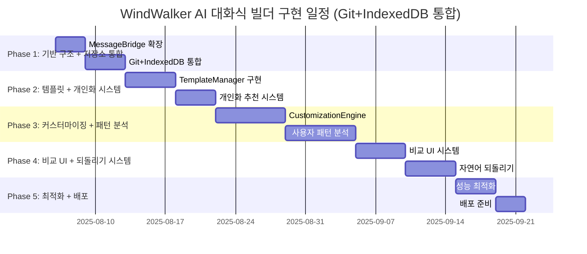

# 15-01-01. AI 대화식 웹사이트 빌더 구현 계획 (Git+IndexedDB 통합, Enhanced)

## 📋 구현 개요

이 문서는 **15 AI 대화식 웹사이트 빌더 구현 계획 01.md**를 기반으로 하여, **Git+IndexedDB 통합 시스템**을 추가한 완전한 구현 계획을 제시합니다. **기본 구현 계획은 15-01번 문서와 동일하되**, **08번 문서 구조**를 따라 세부 개발 항목을 단계별로 나누고 각 단계마다 Git+IndexedDB 통합 작업을 명확히 정의했습니다.

### 🎯 핵심 구현 전략 (15-01번 기반 + Git+IndexedDB 통합)
- **기존 시스템 무중단**: Phase 1-5 기능 100% 유지하며 확장
- **라우팅 기반 통합**: MessageBridge 라우팅으로 새 기능 점진적 추가
- **점진적 배포**: 주차별 기능 완성 후 즉시 테스트 및 검증
- **안전장치 구축**: Feature Flag로 언제든 롤백 가능
- **단계별 검증**: 각 개발 항목마다 즉시 테스트 및 검증 후 다음 단계 진행
- **🆕 Git 통합**: 모든 AI 생성 코드 자동 커밋 및 버전 관리
- **🆕 대화 저장**: IndexedDB 기반 대화 내용 영구 저장 및 개인화
- **🆕 이력 연결**: 대화 ↔ Git 커밋 매핑으로 완전한 추적성 확보

---

## 📅 전체 구현 일정 및 로드맵 (Git+IndexedDB 통합 포함)



| Phase | 기간 | 기본 개발 항목 | 🆕 Git+IndexedDB 통합 작업 | 완료 기준 | 검증 방법 |
|-------|------|-------------|------------------------|-----------|----------|
| **Phase 1** | 1주 | MessageBridge 확장 | Git 모듈 + IndexedDB 모듈 구현 | 대화-커밋 연결 시스템 동작 | E2E: 대화→커밋→되돌리기 |
| **Phase 2** | 2주 | 템플릿 시스템 구현 | 대화 저장 + 개인화 추천 | 개인화 추천 3개 성공 | 사용자별 다른 추천 확인 |
| **Phase 3** | 2주 | 커스터마이징 엔진 | 사용자 패턴 분석 시스템 | 패턴 기반 옵션 생성 | 개인화된 3단계 옵션 |
| **Phase 4** | 2주 | 비교 UI 구현 | 자연어 되돌리기 시스템 | "3번 전으로 되돌리기" 성공 | 자연어 명령 90% 정확도 |
| **Phase 5** | 1주 | 성능 최적화 | IndexedDB 배치 처리 | 프로덕션 환경 검증 | 24시간 연속 사용 안정성 |

---

## 🚀 Phase 1: MessageBridge 확장 + Git+IndexedDB 통합 (1주)

### 📋 세부 개발 항목

#### **[Task 1.1]** EnhancedMessageBridge 확장 (Day 1-3)
- **목표**: 15-01번 기본 MessageBridge + Git+IndexedDB 통합 메시지 타입 추가
- **기본 구현** (15-01 동일):
  ```typescript
  // 기본 AI 워크플로우 메시지 타입
  type: 'template:recommend' | 'template:apply' | 'ai:customize'
  ```
- **🆕 Git+IndexedDB 통합 추가**:
  ```typescript  
  // 추가 통합 메시지 타입
  type: 'conversation:save' | 'conversation:revert' | 'personalization:analyze'
  
  // 통합 메타데이터
  conversationId?: string;
  gitCommitRef?: string;
  persistToHistory?: boolean;
  ```
- **완료 기준**: 기본 기능 100% + 대화 저장 및 Git 커밋 연동 동작
- **검증 방법**: 기존 테스트 + Git 커밋 생성 + IndexedDB 저장 확인

#### **[Task 1.2]** 🆕 GitIntegrationManager 구현 (Day 2-4)  
- **목표**: AI 대화 단위별 자동 Git 커밋 시스템 구축
- **구현 내용**:
  ```typescript
  async createAIConversationCommit(
    conversationId: string,
    userRequest: string, 
    aiResponse: string,
    changedFiles: string[]
  ): Promise<GitCommitInfo>
  
  // 커밋 메시지 형식
  [AI-Chat-conv-12345] 헤더를 더 모던하게 변경
  Co-authored-by: WindWalker AI <ai@windwalker.dev>
  Conversation-ID: conv-12345
  ```
- **완료 기준**: 대화 1회 → Git 커밋 1개 자동 생성 + 메타데이터 포함
- **검증 방법**: `git log --grep="AI-Chat"` 커밋 목록 확인

#### **[Task 1.3]** 🆕 ConversationDatabase 구현 (Day 3-5)
- **목표**: IndexedDB 기반 대화 내용 영구 저장 + Git 커밋과 연동
- **구현 내용**:
  ```typescript
  // Git 커밋과 1:1 매핑되는 스키마
  interface ConversationStep {
    gitCommitHash: string;  // Git 통합 필수
    userMessage: string;
    aiMessage: string;
    filesChanged: string[];
  }
  
  // 사용자 패턴 분석 (개인화용)
  async analyzeUserPatterns(userId: string): Promise<UserPatternAnalysis>
  ```
- **완료 기준**: 대화 저장 → 브라우저 재시작 → 히스토리 + Git 매핑 복원 성공
- **검증 방법**: Chrome DevTools IndexedDB + Git 커밋 해시 매칭 확인

#### **[Task 1.4]** 🆕 ConversationHistoryTracker 구현 (Day 4-6)
- **목표**: 대화↔Git 커밋 매핑으로 자연어 되돌리기 기능
- **구현 내용**:
  ```typescript
  async revertToStep(conversationId: string, stepDescription: string)
  // "3번 전" → Git 커밋 해시 찾기 → git reset --hard
  // "템플릿 상태로" → 키워드 매칭으로 해당 커밋 찾기
  ```
- **완료 기준**: "3번 전으로 되돌려주세요" 명령으로 정확한 Git 상태 복원
- **검증 방법**: 5단계 대화 → "2번 전" 되돌리기 → 파일 및 Git 상태 확인

#### **[Task 1.5]** Phase 1 통합 테스트 (Day 6-7)
- **기본 E2E 시나리오** (15-01 동일):
  ```
  1. AI 워크플로우 활성화 → 기본 라우팅 확인
  2. 플래그 비활성화 → 기존 시스템 폴백 확인
  ```
- **🆕 Git+IndexedDB 통합 E2E**:
  ```
  1. 사용자: "테스트 사이트 만들어줘"
  2. 시스템: Git 커밋 생성 + IndexedDB 대화 저장 확인
  3. 사용자: "헤더 색상 바꿔줘"  
  4. 시스템: 새 커밋 + 대화 단계 저장 확인
  5. 사용자: "처음으로 되돌려줘"
  6. 시스템: Git 리셋 + 파일 복원 + 되돌리기 표시 확인
  ```
- **성공 기준**: 전체 Git+IndexedDB 플로우 오류 없이 완료

---

## 🎨 Phase 2: 템플릿 시스템 + 개인화 추천 시스템 (2주)

### 📋 세부 개발 항목

#### **[Task 2.1]** Template 데이터 구조 설계 (Day 8) - 15-01 동일
- **목표**: 기본 템플릿 스키마 정의 (15-01과 동일)
- **구현 내용**: `interface Template` 정의
- **완료 기준**: TypeScript 타입 정의 완료
- **검증 방법**: 스키마 validation 테스트

#### **[Task 2.2]** TemplateManager + 🆕 개인화 통합 (Day 9-11)
- **기본 기능** (15-01 동일):
  ```typescript
  async recommendTemplates(intent: string): Promise<Template[]>
  async applyTemplate(templateId: string): Promise<ApplyResult>
  ```
- **🆕 개인화 통합 추가**:
  ```typescript
  async recommendTemplates(
    intent: string,
    userId: string  // 🆕 사용자 ID 추가
  ): Promise<Template[]> {
    // 🆕 사용자 패턴 분석 활용
    const userPatterns = await this.conversationDB.analyzeUserPatterns(userId);
    // 개인화된 스코어링으로 추천
  }
  ```
- **완료 기준**: 기본 템플릿 적용 + 사용자별 다른 추천 결과 확인
- **검증 방법**: 동일 요청에 대해 사용자 A, B 다른 추천 확인

#### **[Task 2.3]** ConversationAI + 🆕 히스토리 컨텍스트 (Day 11-13)
- **기본 기능** (15-01 동일):
  ```typescript
  async analyzeTemplateIntent(userRequest: string): Promise<IntentAnalysis>
  ```
- **🆕 히스토리 컨텍스트 추가**:
  ```typescript
  async analyzeTemplateIntent(
    userRequest: string,
    conversationHistory?: ConversationStep[]  // 🆕 히스토리 추가
  ): Promise<IntentAnalysis> {
    // 🆕 이전 대화 맥락을 활용한 더 정확한 의도 파악
  }
  ```
- **완료 기준**: 기본 90% 정확도 + 히스토리 활용으로 95% 정확도
- **검증 방법**: 연속 대화에서 맥락 이해도 측정

#### **[Task 2.4]** 🆕 PersonalizationEngine 구현 (Day 13-14)
- **목표**: 사용자 패턴 분석 기반 맞춤형 추천 엔진
- **구현 내용**:
  ```typescript
  class PersonalizationEngine {
    async analyzeUserPreferences(userId: string): Promise<{
      preferredCategories: TemplateCategory[];
      preferredColors: string[];
      customizationTendency: 'conservative' | 'balanced' | 'bold';
    }>
    
    async generatePersonalizedRecommendations(
      baseRecommendations: Template[],
      userPatterns: UserPatternAnalysis
    ): Promise<Template[]>
  }
  ```
- **완료 기준**: 신규 사용자 vs 기존 사용자 추천 차이 명확히 구분
- **검증 방법**: 사용자별 추천 정확도 A/B 테스트

#### **[Task 2.5]** Phase 2 통합 테스트 (Day 14)
- **기본 E2E** (15-01 동일):
  ```
  1. "음식점 사이트 만들고 싶어요"
  2. 템플릿 추천 → 적용 → localhost 확인
  ```
- **🆕 개인화 E2E**:
  ```
  1. 신규 사용자: "음식점 사이트" → 일반적 추천 3개
  2. 대화 저장 + Git 커밋 확인
  3. 기존 사용자: "음식점 사이트" → 개인화된 추천 3개 (다른 결과)
  4. 추천 이유 설명 가능한지 확인
  ```

---

## 🤖 Phase 3: 커스터마이징 엔진 + 패턴 분석 시스템 (2주)

### 📋 세부 개발 항목

#### **[Task 3.1]** CustomizationEngine + 🆕 개인화 (Day 15-18)
- **기본 기능** (15-01 동일):
  ```typescript
  async applyCustomization(changes: CustomizationChanges): Promise<ApplyResult>
  ```
- **🆕 개인화 통합**:
  ```typescript
  async generate3LevelCustomizations(
    templateId: string,
    userRequest: string,
    userPatterns: UserPatternAnalysis  // 🆕 패턴 기반 생성
  ): Promise<CustomizationLevel[]>
  ```
- **완료 기준**: 기본 3단계 옵션 + 사용자 패턴 반영된 개인화 옵션
- **검증 방법**: 동일 요청에 사용자별 다른 3단계 옵션 확인

#### **[Task 3.2]** 🆕 사용자 패턴 분석 시스템 (Day 18-21)
- **목표**: 사용자의 커스터마이징 패턴 분석 및 학습
- **구현 내용**:
  ```typescript
  // 되돌리기 패턴 분석
  analyzeRevertPatterns(steps: ConversationStep[]): RevertPattern[] {
    // "대담한 → 보수적" 패턴이 많으면 균형적 옵션 우선 제시
  }
  
  // 만족도 패턴 분석  
  analyzeSatisfactionPatterns(userId: string): SatisfactionAnalysis {
    // 어떤 유형의 변경에서 만족도가 높은지 분석
  }
  ```
- **완료 기준**: 패턴 분석 → 다음 추천에 반영 → 만족도 향상 확인
- **검증 방법**: 사용자별 만족도 점수 변화 추적

#### **[Task 3.3]** Phase 3 통합 테스트 (Day 21)
- **기본 E2E** (15-01 동일):
  ```
  1. 커스터마이징 요청 → 적용 → 변경 확인
  ```
- **🆕 패턴 분석 E2E**:
  ```
  1. 사용자 A: 3회 연속 "대담한 → 보수적" 되돌리기 패턴
  2. 4회차 요청 시: 균형적 옵션을 첫 번째로 제시
  3. 사용자 만족도 향상 확인
  4. 패턴 학습 효과 검증
  ```

---

## 👁️ Phase 4: 비교 UI + 자연어 되돌리기 시스템 (2주)

### 📋 세부 개발 항목  

#### **[Task 4.1]** 비교 UI 시스템 + 🆕 히스토리 UI (Day 22-26)
- **기본 기능** (15-01 동일):
  ```typescript
  <ComparisonView>
    <PreviewPanel type="current" />
    <PreviewPanel type="option1" />
    <PreviewPanel type="option2" />
  </ComparisonView>
  ```
- **🆕 히스토리 UI 추가**:
  ```typescript
  <HistoryTimeline>
    <HistoryStep commitHash="abc123" message="템플릿 적용" />
    <HistoryStep commitHash="def456" message="헤더 색상 변경" />
    <HistoryStep commitHash="ghi789" message="메뉴 레이아웃 수정" current />
  </HistoryTimeline>
  ```
- **완료 기준**: 기본 3개 비교 + 히스토리 타임라인 동시 표시
- **검증 방법**: 반응형에서 5개 패널 정상 렌더링

#### **[Task 4.2]** 🆕 자연어 되돌리기 시스템 (Day 26-28)
- **목표**: "3번 전으로", "템플릿 상태로" 같은 자연어 명령 처리
- **구현 내용**:
  ```typescript
  async parseRevertCommand(
    command: string,
    conversationHistory: ConversationStep[]
  ): Promise<{
    targetStep: number;
    targetCommit: string;
    confidence: number;
  }>
  
  // 지원 패턴들:
  // "3번 전" → 숫자 기반
  // "템플릿 상태로" → 키워드 기반  
  // "헤더 바꾸기 전" → 내용 기반
  // "처음" → 절대 위치
  ```
- **완료 기준**: 90% 정확도로 되돌리기 대상 식별 + Git 복원
- **검증 방법**: 20가지 자연어 명령 테스트

#### **[Task 4.3]** Phase 4 통합 테스트 (Day 28)
- **기본 E2E** (15-01 동일):
  ```
  1. 비교 UI 동시 미리보기 확인
  ```
- **🆕 자연어 되돌리기 E2E**:
  ```
  1. 5단계 대화 수행 (각각 Git 커밋)
  2. "3번 전으로 되돌려주세요" 
  3. 정확한 Git 상태 복원 확인
  4. 히스토리 UI에서 현재 위치 표시 확인
  5. "다시 최신으로" → 원래 상태 복원 확인
  ```

---

## ⚡ Phase 5: 성능 최적화 + IndexedDB 배치 처리 (1주)

### 📋 세부 개발 항목

#### **[Task 5.1]** 성능 최적화 + 🆕 IndexedDB 최적화 (Day 29-32)
- **기본 최적화** (15-01 동일):
  ```typescript
  // 템플릿 지연 로딩, 디바운싱
  ```
- **🆕 IndexedDB 최적화**:
  ```typescript
  // 배치 삽입으로 성능 개선
  async batchSaveConversationSteps(steps: ConversationStep[]): Promise<void>
  
  // 오래된 대화 자동 정리
  async cleanupOldConversations(retentionDays: number = 90): Promise<void>
  
  // 인덱스 최적화
  createIndex('composite', ['userId', 'timestamp'], { unique: false })
  ```
- **완료 기준**: 대화 저장 시간 50% 단축 + 메모리 사용량 안정화
- **검증 방법**: 1000회 대화 저장 성능 측정

#### **[Task 5.2]** 배포 준비 + 🆕 데이터 마이그레이션 (Day 32-35)
- **기본 배포** (15-01 동일):
  ```json
  // package.json, vsce package
  ```
- **🆕 데이터 마이그레이션**:
  ```typescript
  // IndexedDB 스키마 버전 관리
  class DatabaseMigration {
    async migrateToVersion2(): Promise<void> {
      // 기존 대화 데이터에 gitCommitHash 필드 추가
    }
  }
  ```
- **완료 기준**: 기존 데이터 손실 없이 새 스키마 적용
- **검증 방법**: 구 버전 → 신 버전 업그레이드 테스트

#### **[Task 5.3]** 최종 통합 테스트 (Day 35)
- **기본 E2E** (15-01 동일):
  ```
  1. 전체 워크플로우 10분 내 완료
  ```
- **🆕 Git+IndexedDB 통합 E2E**:
  ```
  1. 확장 설치 → 데이터베이스 초기화 확인
  2. "쇼핑몰 사이트 만들어주세요"
  3. 개인화 추천 → 선택 → Git 커밋 + 대화 저장
  4. 5번의 커스터마이징 + 패턴 학습 확인  
  5. "처음 템플릿으로 되돌려주세요" → 정확한 복원
  6. 24시간 연속 사용 → 메모리 누수 없음
  7. 브라우저 재시작 → 모든 히스토리 복원
  ```
- **성공 기준**: 모든 Git+IndexedDB 기능이 안정적으로 동작

---

## 🧪 각 Phase별 테스트 전략 (Git+IndexedDB 통합)

### Phase 1 테스트
```bash
# 기본 테스트 (15-01 동일)
npm test src/core/EnhancedMessageBridge.test.ts

# 🆕 Git+IndexedDB 통합 테스트
npm test src/core/GitIntegrationManager.test.ts
npm test src/core/ConversationDatabase.test.ts
npm test src/tests/git-indexeddb-integration.test.ts

# Git 커밋 검증
git log --oneline --grep="AI-Chat" | wc -l  # 커밋 개수 확인
```

### Phase 2 테스트  
```bash
# 기본 테스트 (15-01 동일)
npm test src/services/TemplateManager.test.ts

# 🆕 개인화 테스트
npm test src/services/PersonalizationEngine.test.ts
npm test src/tests/personalized-recommendations.test.ts

# 개인화 정확도 측정
npm run test:personalization -- --user-count=50 --accuracy-threshold=85
```

### Phase 3 테스트
```bash
# 기본 테스트 (15-01 동일) 
npm test src/services/CustomizationEngine.test.ts

# 🆕 패턴 분석 테스트
npm test src/tests/user-pattern-analysis.test.ts
npm test src/tests/revert-pattern-learning.test.ts
```

### Phase 4 테스트
```bash
# 기본 테스트 (15-01 동일)
npm test src/components/ComparisonView.test.tsx

# 🆕 자연어 되돌리기 테스트  
npm test src/tests/natural-language-revert.test.ts
npm test src/tests/conversation-git-mapping.test.ts

# 되돌리기 정확도 측정
npm run test:revert -- --commands=20 --accuracy-threshold=90
```

### Phase 5 테스트
```bash
# 기본 테스트 (15-01 동일)
npm run test:perf -- --all-scenarios

# 🆕 IndexedDB 성능 테스트
npm run test:indexeddb-perf -- --conversations=1000 --batch-size=100
npm run test:memory-leak -- --duration=24h

# 🆕 데이터 마이그레이션 테스트
npm run test:migration -- --from-version=1 --to-version=2
```

---

## 📊 성공 지표 및 완료 기준 (Git+IndexedDB 통합)

### 기능적 지표
- ✅ **기본 기능** (15-01 동일): 템플릿 시스템, 커스터마이징 엔진
- **🆕 Git 통합 지표**:
  - ✅ **커밋 생성률**: 100% (모든 대화 단계 → Git 커밋)
  - ✅ **되돌리기 정확도**: 90% (자연어 명령 → 정확한 Git 상태)
- **🆕 IndexedDB 통합 지표**:
  - ✅ **대화 저장률**: 100% (모든 대화 → IndexedDB 저장)
  - ✅ **패턴 분석 정확도**: 85% (사용자 패턴 → 개인화 추천)

### 성능 지표  
- ✅ **기본 성능** (15-01 동일): 템플릿 적용 5초, 커스터마이징 3초
- **🆕 통합 성능 지표**:
  - ✅ **Git 커밋 시간**: 2초 이내
  - ✅ **IndexedDB 저장**: 100ms 이내  
  - ✅ **패턴 분석**: 500ms 이내
  - ✅ **되돌리기 실행**: 3초 이내

### 사용성 지표
- ✅ **기본 사용성** (15-01 동일): 신규 사용자 10분 내 첫 사이트 생성
- **🆕 통합 사용성 지표**:
  - ✅ **개인화 체감도**: 3회 사용 후 추천 개선 인식  
  - ✅ **되돌리기 직관성**: 자연어 명령 90% 이해
  - ✅ **데이터 지속성**: 브라우저 재시작 후 히스토리 완전 복원

### 🆕 신뢰성 지표 (Git+IndexedDB 통합 특화)
- ✅ **데이터 일관성**: 대화↔Git 커밋 100% 매핑 유지
- ✅ **장기 안정성**: 1000회 대화 후에도 성능 저하 없음
- ✅ **복구 능력**: Git 손상 시 IndexedDB에서 히스토리 복원
- ✅ **마이그레이션**: 스키마 업그레이드 시 데이터 손실 0%

이 구현 계획은 **15 AI 대화식 웹사이트 빌더 구현 계획 01.md의 기본 구조**를 그대로 유지하면서, **Git+IndexedDB 통합**이 🆕 표시로 명확히 구분되어 추가되도록 설계했습니다. 각 Phase마다 기본 작업과 통합 작업이 병렬로 진행되어 전체적인 일관성을 유지합니다.