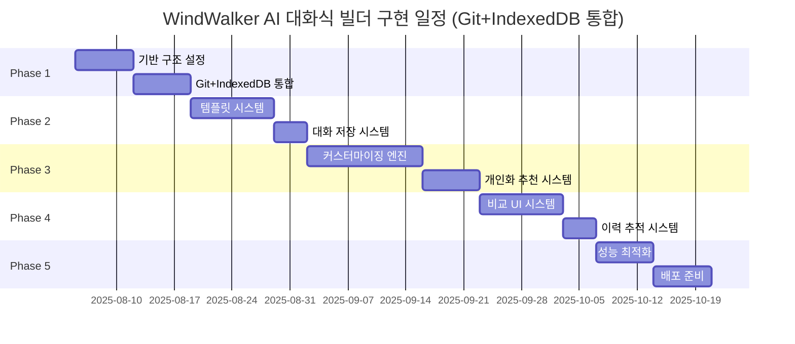

# 15-01. AI 대화식 웹사이트 빌더 구현 계획 (Git + IndexedDB 통합)

## 📋 구현 개요

이 문서는 WindWalker의 기존 MessageBridge 아키텍처에 AI 대화식 웹사이트 빌더를 통합하는 **10주간의 구체적인 구현 계획**을 제시합니다. **Git 소스코드 관리**와 **IndexedDB 대화 저장** 시스템을 포함한 완전한 통합 방안입니다.

### 🎯 핵심 구현 전략 (업데이트)
- **기존 시스템 무중단**: Phase 1-5 기능 100% 유지하며 확장
- **라우팅 기반 통합**: MessageBridge 라우팅으로 새 기능 추가
- **Git 통합**: 모든 AI 생성 코드 자동 커밋 및 버전 관리
- **대화 저장**: IndexedDB 기반 대화 내용 영구 저장 및 개인화
- **이력 연결**: 대화 ↔ Git 커밋 매핑으로 완전한 추적성 확보
- **점진적 배포**: 주차별 기능 완성 후 즉시 테스트 및 검증
- **안전장치 구축**: Feature Flag로 언제든 롤백 가능

---

## 📅 전체 구현 일정 (Git + IndexedDB 통합 포함)



| Phase | 기간 | 주요 작업 | Git+IndexedDB 통합 작업 | 완료 기준 |
|-------|------|-----------|------------------------|-----------|
| **Phase 1** | 2주 | 기반 구조 및 MessageBridge 확장 | Git 모듈 + IndexedDB 모듈 구현 | 대화-커밋 연결 시스템 동작 |
| **Phase 2** | 2주 | 템플릿 시스템 및 AI 의도 분석 | 대화 저장 및 컨텍스트 관리 | 5개 템플릿 추천 + 대화 저장 |
| **Phase 3** | 3주 | 커스터마이징 엔진 및 제약조건 | 개인화 패턴 추출 시스템 | 개인화 추천 3가지 성공 |
| **Phase 4** | 2주 | 비교 UI 및 미리보기 시스템 | 이력 기반 되돌리기 구현 | "3번 전으로 되돌리기" 성공 |
| **Phase 5** | 1주 | 성능 최적화 및 배포 준비 | 배치 처리 및 성능 최적화 | 프로덕션 환경 검증 |

---

## 🚀 Phase 1: 기반 구조 설정 + Git/IndexedDB 통합 (2주)

### Week 1: MessageBridge 확장 및 저장소 통합 시스템

#### 🎯 목표
기존 MessageBridge를 확장하여 AI 워크플로우 메시지 처리 + Git 자동 커밋 + IndexedDB 대화 저장 통합 시스템 구축

#### 📋 주요 작업

##### Day 1-2: MessageBridge 확장 설계 (Git+IndexedDB 통합)
```typescript
// 1. 기존 MessageBridge 클래스 확장 (저장소 통합 포함)
class EnhancedMessageBridge extends MessageBridge {
  // 새로운 의존성 추가
  private aiWorkflowRouter: AIWorkflowRouter
  private serviceRegistry: ServiceRegistry
  private featureFlags: FeatureFlagManager
  
  // Git + IndexedDB 통합 모듈들
  private gitManager: GitIntegrationManager
  private conversationDB: ConversationDatabase
  private historyTracker: ConversationHistoryTracker
  
  constructor(
    // 기존 의존성들
    fileManager: FileManager,
    buildManager: BuildManager,
    llmService: LLMService,
    codeGenerationService: CodeGenerationService,
    // 새로운 의존성들
    aiWorkflowRouter: AIWorkflowRouter,
    serviceRegistry: ServiceRegistry,
    // Git + IndexedDB 의존성들
    gitManager: GitIntegrationManager,
    conversationDB: ConversationDatabase
  ) {
    super(fileManager, buildManager, llmService, codeGenerationService)
    this.aiWorkflowRouter = aiWorkflowRouter
    this.serviceRegistry = serviceRegistry
    this.featureFlags = new FeatureFlagManager()
    
    // 통합 모듈 초기화
    this.gitManager = gitManager
    this.conversationDB = conversationDB
    this.historyTracker = new ConversationHistoryTracker(gitManager, conversationDB)
  }
}
```

##### Day 3-4: Git 통합 모듈 구현
```typescript
// 2. Git 통합 관리 클래스
class GitIntegrationManager {
  private git: SimpleGit
  private workspacePath: string
  
  constructor(workspacePath: string) {
    this.workspacePath = workspacePath
    this.git = simpleGit(workspacePath)
  }
  
  // AI 대화 기반 자동 커밋
  async createAIConversationCommit(
    conversationId: string,
    messageId: string,
    userRequest: string,
    aiResponse: string,
    filesChanged: string[],
    aiMetadata: {
      model: string
      confidence: number
      processingTime: number
    }
  ): Promise<GitCommitResult> {
    // 1. 변경된 파일들 스테이징
    await this.git.add(filesChanged)
    
    // 2. 커밋 메시지 생성 (표준화된 형식)
    const commitMessage = `[AI-Chat-${conversationId}] ${this.summarizeChanges(filesChanged, userRequest)}`
    
    // 3. 상세 메타데이터와 함께 커밋 생성
    const commit = await this.git.commit(commitMessage, filesChanged, {
      '--author': 'WindWalker AI <ai@windwalker.dev>',
      '--trailer': `Conversation-ID: ${conversationId}`,
      '--trailer': `Message-ID: ${messageId}`,
      '--trailer': `User-Request: "${userRequest}"`,
      '--trailer': `AI-Response: "${aiResponse.substring(0, 100)}..."`,
      '--trailer': `AI-Model: ${aiMetadata.model}`,
      '--trailer': `Confidence: ${aiMetadata.confidence}`,
      '--trailer': `Processing-Time: ${aiMetadata.processingTime}ms`,
      '--trailer': `Generated-By: WindWalker-AI-Engine`,
      '--trailer': `Files-Modified: ${filesChanged.join(', ')}`
    })
    
    return {
      commitHash: commit.commit,
      shortHash: commit.commit.substring(0, 8),
      message: commitMessage,
      filesChanged,
      timestamp: new Date()
    }
  }
  
  // 특정 대화로 되돌리기
  async revertToConversationState(
    conversationId: string, 
    stepBack?: number
  ): Promise<RevertResult> {
    // 해당 대화의 모든 커밋 조회
    const commits = await this.git.log({
      '--grep': `Conversation-ID: ${conversationId}`,
      '--reverse': true
    })
    
    if (commits.all.length === 0) {
      throw new Error(`해당 대화의 커밋을 찾을 수 없습니다: ${conversationId}`)
    }
    
    // N번째 전 상태로 되돌리기
    const targetCommitIndex = stepBack ? Math.max(0, commits.all.length - stepBack) : commits.all.length - 1
    const targetCommit = commits.all[targetCommitIndex]
    
    // Hard reset으로 되돌리기
    await this.git.reset(['--hard', targetCommit.hash])
    
    return {
      targetCommit: targetCommit.hash,
      commitMessage: targetCommit.message,
      stepsReverted: stepBack || 0,
      timestamp: new Date()
    }
  }
  
  // 대화 패턴 분석용 데이터 추출
  async extractConversationAnalytics(): Promise<ConversationAnalytics[]> {
    const logs = await this.git.log({
      '--grep': 'AI-Chat-',
      '--pretty': 'format:%H|%s|%b|%an|%ad'
    })
    
    return logs.all.map(log => {
      const parts = log.hash.split('|')
      const body = parts[2] || ''
      
      return {
        commitHash: parts[0],
        conversationId: this.extractMetadata(body, 'Conversation-ID'),
        messageId: this.extractMetadata(body, 'Message-ID'),
        userRequest: this.extractMetadata(body, 'User-Request'),
        aiModel: this.extractMetadata(body, 'AI-Model'),
        confidence: parseFloat(this.extractMetadata(body, 'Confidence') || '0'),
        processingTime: parseInt(this.extractMetadata(body, 'Processing-Time') || '0'),
        filesModified: this.extractMetadata(body, 'Files-Modified')?.split(', ') || [],
        timestamp: new Date(parts[4])
      }
    })
  }
  
  private summarizeChanges(files: string[], userRequest: string): string {
    const fileTypes = this.categorizeFiles(files)
    return `${fileTypes.join('+')} 수정: ${userRequest.substring(0, 50)}${userRequest.length > 50 ? '...' : ''}`
  }
  
  private categorizeFiles(files: string[]): string[] {
    const categories = new Set<string>()
    
    files.forEach(file => {
      if (file.endsWith('.html')) categories.add('HTML')
      else if (file.endsWith('.css')) categories.add('CSS') 
      else if (file.endsWith('.js') || file.endsWith('.tsx') || file.endsWith('.ts')) categories.add('JS')
      else if (file.endsWith('.json')) categories.add('Config')
      else categories.add('Asset')
    })
    
    return Array.from(categories)
  }
  
  private extractMetadata(body: string, key: string): string | undefined {
    const match = body.match(new RegExp(`${key}: (.+)`))
    return match ? match[1].replace(/"/g, '') : undefined
  }
}
```

##### Day 5-7: IndexedDB 대화 저장 모듈 구현
```typescript
// 3. IndexedDB 대화 저장 데이터베이스 클래스
class ConversationDatabase {
  private db: IDBDatabase | null = null
  private readonly dbName = 'WindWalkerConversations'
  private readonly version = 1
  
  async initialize(): Promise<void> {
    return new Promise((resolve, reject) => {
      const request = indexedDB.open(this.dbName, this.version)
      
      request.onerror = () => reject(new Error(`IndexedDB 초기화 실패: ${request.error}`))
      request.onsuccess = () => {
        this.db = request.result
        console.log('✅ WindWalker 대화 DB 초기화 완료')
        resolve()
      }
      
      request.onupgradeneeded = (event) => {
        const db = (event.target as IDBOpenDBRequest).result
        
        // 대화 세션 스토어
        if (!db.objectStoreNames.contains('conversations')) {
          const conversationStore = db.createObjectStore('conversations', {
            keyPath: 'conversationId'
          })
          conversationStore.createIndex('userId', 'userId', { unique: false })
          conversationStore.createIndex('projectType', 'projectType', { unique: false })
          conversationStore.createIndex('createdAt', 'createdAt', { unique: false })
          conversationStore.createIndex('status', 'status', { unique: false })
        }
        
        // 메시지 스토어
        if (!db.objectStoreNames.contains('messages')) {
          const messageStore = db.createObjectStore('messages', {
            keyPath: 'messageId'
          })
          messageStore.createIndex('conversationId', 'conversationId', { unique: false })
          messageStore.createIndex('timestamp', 'timestamp', { unique: false })
          messageStore.createIndex('sender', 'sender', { unique: false })
        }
        
        // 사용자 프로필 스토어
        if (!db.objectStoreNames.contains('userProfiles')) {
          const profileStore = db.createObjectStore('userProfiles', {
            keyPath: 'userId'
          })
        }
        
        // Git 매핑 스토어 (대화 ↔ 커밋 연결)
        if (!db.objectStoreNames.contains('conversationGitMappings')) {
          const mappingStore = db.createObjectStore('conversationGitMappings', {
            keyPath: 'mappingId'
          })
          mappingStore.createIndex('conversationId', 'conversationId', { unique: false })
          mappingStore.createIndex('messageId', 'messageId', { unique: false })
          mappingStore.createIndex('gitCommitHash', 'gitCommitHash', { unique: false })
          mappingStore.createIndex('createdAt', 'createdAt', { unique: false })
        }
      }
    })
  }
  
  // 새 대화 세션 생성
  async createConversation(
    userId: string,
    projectType: string,
    initialContext?: Partial<ConversationSession>
  ): Promise<string> {
    const conversationId = `conv_${Date.now()}_${Math.random().toString(36).substr(2, 9)}`
    
    const conversation: ConversationSession = {
      conversationId,
      userId,
      projectId: `proj_${conversationId}`,
      createdAt: new Date(),
      updatedAt: new Date(),
      status: 'active',
      projectType,
      totalMessages: 0,
      totalGitCommits: 0,
      completionRate: 0,
      averageResponseTime: 0,
      templateUsed: initialContext?.templateUsed,
      ...initialContext
    }
    
    const transaction = this.db!.transaction(['conversations'], 'readwrite')
    const store = transaction.objectStore('conversations')
    
    return new Promise((resolve, reject) => {
      const request = store.add(conversation)
      request.onsuccess = () => {
        console.log(`✅ 새 대화 세션 생성: ${conversationId}`)
        resolve(conversationId)
      }
      request.onerror = () => reject(request.error)
    })
  }
  
  // 메시지 저장 (AI/사용자 구분)
  async saveMessage(
    conversationId: string,
    sender: 'user' | 'ai' | 'system',
    content: string,
    metadata?: {
      aiMetadata?: AIMessageMetadata
      codeGeneration?: CodeGenerationMetadata
      userFeedback?: UserFeedbackMetadata
    }
  ): Promise<string> {
    const messageId = `msg_${Date.now()}_${Math.random().toString(36).substr(2, 9)}`
    
    const message: ChatMessage = {
      messageId,
      conversationId,
      sender,
      content,
      timestamp: new Date(),
      ...metadata
    }
    
    const transaction = this.db!.transaction(['messages', 'conversations'], 'readwrite')
    
    // 메시지 저장
    const messageStore = transaction.objectStore('messages')
    const messageRequest = messageStore.add(message)
    
    // 대화 세션 통계 업데이트
    const conversationStore = transaction.objectStore('conversations')
    
    return new Promise((resolve, reject) => {
      messageRequest.onsuccess = async () => {
        // 대화 세션 통계 업데이트
        const getRequest = conversationStore.get(conversationId)
        getRequest.onsuccess = () => {
          const conversation = getRequest.result as ConversationSession
          if (conversation) {
            conversation.totalMessages += 1
            conversation.updatedAt = new Date()
            
            // AI 응답 시간 평균 계산
            if (sender === 'ai' && metadata?.aiMetadata?.processingTime) {
              const currentTotal = conversation.averageResponseTime * (conversation.totalMessages - 1)
              conversation.averageResponseTime = (currentTotal + metadata.aiMetadata.processingTime) / conversation.totalMessages
            }
            
            const updateRequest = conversationStore.put(conversation)
            updateRequest.onsuccess = () => {
              console.log(`✅ 메시지 저장 완료: ${messageId} (${sender})`)
              resolve(messageId)
            }
            updateRequest.onerror = () => reject(updateRequest.error)
          }
        }
        getRequest.onerror = () => reject(getRequest.error)
      }
      messageRequest.onerror = () => reject(messageRequest.error)
    })
  }
  
  // Git 커밋과 대화 연결 저장
  async linkGitCommit(
    conversationId: string,
    messageId: string,
    gitCommitResult: GitCommitResult,
    changeDescription: string
  ): Promise<void> {
    const mappingId = `map_${Date.now()}_${Math.random().toString(36).substr(2, 9)}`
    
    const mapping: ConversationGitMapping = {
      mappingId,
      conversationId,
      messageId,
      gitCommitHash: gitCommitResult.commitHash,
      gitShortHash: gitCommitResult.shortHash,
      gitBranch: 'main', // 현재 브랜치 감지 로직 추가 필요
      filesChanged: gitCommitResult.filesChanged,
      changeDescription,
      changeType: this.inferChangeType(changeDescription),
      createdAt: new Date(),
      linesAdded: 0, // Git diff 분석으로 계산 필요
      linesRemoved: 0 // Git diff 분석으로 계산 필요
    }
    
    const transaction = this.db!.transaction(['conversationGitMappings', 'conversations'], 'readwrite')
    
    // 매핑 정보 저장
    const mappingStore = transaction.objectStore('conversationGitMappings')
    const mappingRequest = mappingStore.add(mapping)
    
    // 대화 세션의 Git 커밋 카운트 업데이트
    const conversationStore = transaction.objectStore('conversations')
    
    return new Promise((resolve, reject) => {
      mappingRequest.onsuccess = () => {
        const getRequest = conversationStore.get(conversationId)
        getRequest.onsuccess = () => {
          const conversation = getRequest.result as ConversationSession
          if (conversation) {
            conversation.totalGitCommits += 1
            conversation.updatedAt = new Date()
            
            const updateRequest = conversationStore.put(conversation)
            updateRequest.onsuccess = () => {
              console.log(`✅ Git 커밋 연결 완료: ${gitCommitResult.shortHash} ↔ ${messageId}`)
              resolve()
            }
            updateRequest.onerror = () => reject(updateRequest.error)
          }
        }
        getRequest.onerror = () => reject(getRequest.error)
      }
      mappingRequest.onerror = () => reject(mappingRequest.error)
    })
  }
  
  // 대화 히스토리 조회 (개인화용)
  async getUserConversationHistory(
    userId: string,
    limit: number = 50,
    projectType?: string
  ): Promise<ConversationSession[]> {
    const transaction = this.db!.transaction(['conversations'], 'readonly')
    const store = transaction.objectStore('conversations')
    const index = store.index('userId')
    
    return new Promise((resolve, reject) => {
      const conversations: ConversationSession[] = []
      const request = index.openCursor(IDBKeyRange.only(userId))
      
      request.onsuccess = (event) => {
        const cursor = (event.target as IDBRequest).result
        if (cursor && conversations.length < limit) {
          const conversation = cursor.value as ConversationSession
          
          // 프로젝트 타입 필터링
          if (!projectType || conversation.projectType === projectType) {
            conversations.push(conversation)
          }
          
          cursor.continue()
        } else {
          // 최신순으로 정렬
          conversations.sort((a, b) => b.updatedAt.getTime() - a.updatedAt.getTime())
          resolve(conversations)
        }
      }
      
      request.onerror = () => reject(request.error)
    })
  }
  
  // 사용자 패턴 분석 (개인화 추천용)
  async analyzeUserPatterns(userId: string): Promise<UserPatternAnalysis> {
    const conversations = await this.getUserConversationHistory(userId, 100)
    const messages = await this.getUserMessages(userId, 500)
    
    // 1. 선호 프로젝트 타입 분석
    const projectTypeCount = new Map<string, number>()
    conversations.forEach(conv => {
      projectTypeCount.set(conv.projectType, (projectTypeCount.get(conv.projectType) || 0) + 1)
    })
    
    // 2. 자주 사용하는 요청 패턴 분석
    const requestPatterns = this.extractRequestPatterns(messages.filter(m => m.sender === 'user'))
    
    // 3. 성공적인 AI 응답 패턴 분석
    const successfulResponses = messages.filter(m => 
      m.sender === 'ai' && 
      m.aiMetadata?.confidence && 
      m.aiMetadata.confidence > 0.8 &&
      m.userFeedback?.helpful !== false
    )
    
    // 4. 활동 시간 패턴 분석
    const activityHours = messages.map(m => m.timestamp.getHours())
    const peakHours = this.findPeakHours(activityHours)
    
    return {
      userId,
      preferredProjectTypes: Array.from(projectTypeCount.entries())
        .sort((a, b) => b[1] - a[1])
        .map(([type, count]) => ({ type, count })),
      commonRequestPatterns: requestPatterns,
      successfulAIPatterns: this.analyzeSuccessfulPatterns(successfulResponses),
      peakActivityHours: peakHours,
      averageSessionLength: this.calculateAverageSessionLength(conversations),
      totalConversations: conversations.length,
      totalMessages: messages.length,
      lastAnalyzedAt: new Date()
    }
  }
  
  private inferChangeType(description: string): string {
    const desc = description.toLowerCase()
    if (desc.includes('생성') || desc.includes('추가') || desc.includes('새로')) return 'feature'
    if (desc.includes('수정') || desc.includes('변경') || desc.includes('업데이트')) return 'update'
    if (desc.includes('삭제') || desc.includes('제거')) return 'remove'
    if (desc.includes('스타일') || desc.includes('색상') || desc.includes('디자인')) return 'style'
    if (desc.includes('버그') || desc.includes('오류') || desc.includes('수정')) return 'fix'
    return 'misc'
  }
  
  private extractRequestPatterns(userMessages: ChatMessage[]): RequestPattern[] {
    const patterns = new Map<string, number>()
    
    userMessages.forEach(message => {
      const keywords = this.extractKeywords(message.content)
      keywords.forEach(keyword => {
        patterns.set(keyword, (patterns.get(keyword) || 0) + 1)
      })
    })
    
    return Array.from(patterns.entries())
      .sort((a, b) => b[1] - a[1])
      .slice(0, 20)
      .map(([pattern, frequency]) => ({ pattern, frequency }))
  }
  
  private extractKeywords(text: string): string[] {
    // 간단한 키워드 추출 (실제로는 더 정교한 NLP 필요)
    const keywords = []
    const lowerText = text.toLowerCase()
    
    // UI 요소
    if (lowerText.includes('버튼')) keywords.push('버튼')
    if (lowerText.includes('헤더')) keywords.push('헤더')
    if (lowerText.includes('푸터')) keywords.push('푸터')
    if (lowerText.includes('메뉴')) keywords.push('메뉴')
    
    // 색상
    if (lowerText.includes('색') || lowerText.includes('컬러')) keywords.push('색상변경')
    if (lowerText.includes('파란') || lowerText.includes('빨간') || lowerText.includes('초록')) keywords.push('색상변경')
    
    // 레이아웃
    if (lowerText.includes('크기')) keywords.push('크기조정')
    if (lowerText.includes('위치') || lowerText.includes('배치')) keywords.push('레이아웃')
    
    // 액션
    if (lowerText.includes('추가') || lowerText.includes('만들')) keywords.push('요소추가')
    if (lowerText.includes('삭제') || lowerText.includes('제거')) keywords.push('요소제거')
    if (lowerText.includes('수정') || lowerText.includes('바꿔')) keywords.push('요소수정')
    
    return keywords
  }
  
  private findPeakHours(hours: number[]): number[] {
    const hourCounts = new Array(24).fill(0)
    hours.forEach(hour => hourCounts[hour]++)
    
    // 상위 3개 시간대 반환
    return hourCounts
      .map((count, hour) => ({ hour, count }))
      .sort((a, b) => b.count - a.count)
      .slice(0, 3)
      .map(item => item.hour)
  }
  
  private analyzeSuccessfulPatterns(responses: ChatMessage[]): AISuccessPattern[] {
    const modelPerformance = new Map<string, { total: number, avgConfidence: number }>()
    
    responses.forEach(msg => {
      if (msg.aiMetadata?.model && msg.aiMetadata?.confidence) {
        const model = msg.aiMetadata.model
        const current = modelPerformance.get(model) || { total: 0, avgConfidence: 0 }
        
        current.total += 1
        current.avgConfidence = ((current.avgConfidence * (current.total - 1)) + msg.aiMetadata.confidence) / current.total
        
        modelPerformance.set(model, current)
      }
    })
    
    return Array.from(modelPerformance.entries()).map(([model, stats]) => ({
      aiModel: model,
      successRate: stats.avgConfidence,
      totalUses: stats.total
    }))
  }
  
  private calculateAverageSessionLength(conversations: ConversationSession[]): number {
    if (conversations.length === 0) return 0
    
    const sessionLengths = conversations.map(conv => {
      const duration = conv.updatedAt.getTime() - conv.createdAt.getTime()
      return Math.round(duration / (1000 * 60)) // 분 단위
    })
    
    return sessionLengths.reduce((sum, length) => sum + length, 0) / sessionLengths.length
  }
  
  private async getUserMessages(userId: string, limit: number): Promise<ChatMessage[]> {
    // 사용자의 모든 대화에서 메시지 조회 (구현 생략)
    return []
  }
}
```

#### ✅ Week 1 완료 기준
- [ ] EnhancedMessageBridge 클래스 구현 완료 (Git+IndexedDB 통합)
- [ ] GitIntegrationManager 동작 확인 (AI 커밋 자동 생성)
- [ ] ConversationDatabase 동작 확인 (대화 저장/조회)
- [ ] 대화 ↔ Git 커밋 연결 시스템 정상 작동
- [ ] 기존 Phase 1-5 기능 100% 정상 동작

---

### Week 2: 통합 히스토리 추적 시스템 및 라우팅

#### 🎯 목표
대화와 Git 커밋을 연결하는 히스토리 추적 시스템 구축 및 AI 워크플로우 라우터 통합

#### 📋 주요 작업

##### Day 8-10: 통합 히스토리 추적 시스템
```typescript
// 4. 대화-Git 히스토리 통합 추적 클래스
class ConversationHistoryTracker {
  constructor(
    private gitManager: GitIntegrationManager,
    private conversationDB: ConversationDatabase
  ) {}
  
  // 대화와 코드 변경사항을 연결하여 처리
  async processConversationWithCodeGeneration(
    conversationId: string,
    userMessage: string,
    aiResponse: string,
    generatedCode: string,
    targetFiles: string[],
    aiMetadata: AIMessageMetadata
  ): Promise<ConversationGitLink> {
    // 1. 사용자 메시지 저장
    const userMessageId = await this.conversationDB.saveMessage(
      conversationId,
      'user',
      userMessage
    )
    
    // 2. 파일에 생성된 코드 적용 (실제 파일 시스템 변경)
    await this.applyCodeToFiles(targetFiles, generatedCode)
    
    // 3. Git 커밋 생성
    const gitResult = await this.gitManager.createAIConversationCommit(
      conversationId,
      userMessageId,
      userMessage,
      aiResponse,
      targetFiles,
      aiMetadata
    )
    
    // 4. AI 응답 메시지 저장 (Git 커밋 정보 포함)
    const aiMessageId = await this.conversationDB.saveMessage(
      conversationId,
      'ai', 
      aiResponse,
      {
        aiMetadata,
        codeGeneration: {
          generatedCode,
          language: this.detectLanguage(targetFiles[0]),
          fileName: targetFiles[0],
          gitCommitHash: gitResult.commitHash
        }
      }
    )
    
    // 5. 대화-Git 매핑 정보 저장
    await this.conversationDB.linkGitCommit(
      conversationId,
      aiMessageId,
      gitResult,
      `AI 응답: ${aiResponse.substring(0, 100)}`
    )
    
    return {
      conversationId,
      userMessageId,
      aiMessageId,
      gitCommitHash: gitResult.commitHash,
      gitShortHash: gitResult.shortHash,
      filesChanged: targetFiles,
      timestamp: new Date()
    }
  }
  
  // "N번 전으로 되돌려줘" 기능
  async revertConversationSteps(
    conversationId: string,
    stepsBack: number,
    requestingUserId: string
  ): Promise<RevertOperationResult> {
    try {
      // 1. 해당 대화의 Git 커밋 히스토리 조회
      const gitAnalytics = await this.gitManager.extractConversationAnalytics()
      const conversationCommits = gitAnalytics
        .filter(commit => commit.conversationId === conversationId)
        .sort((a, b) => a.timestamp.getTime() - b.timestamp.getTime())
      
      if (conversationCommits.length < stepsBack) {
        throw new Error(`되돌릴 수 있는 단계가 부족합니다. (현재: ${conversationCommits.length}단계, 요청: ${stepsBack}단계)`)
      }
      
      // 2. Git 상태 되돌리기
      const revertResult = await this.gitManager.revertToConversationState(conversationId, stepsBack)
      
      // 3. 되돌리기 작업 기록 (시스템 메시지로 저장)
      const systemMessageId = await this.conversationDB.saveMessage(
        conversationId,
        'system',
        `✅ ${stepsBack}단계 전 상태로 되돌렸습니다.\n커밋: ${revertResult.targetCommit}\n메시지: ${revertResult.commitMessage}`,
        {
          revertOperation: {
            stepsReverted: stepsBack,
            targetCommitHash: revertResult.targetCommit,
            revertedAt: new Date(),
            requestedBy: requestingUserId
          }
        }
      )
      
      return {
        success: true,
        stepsReverted: stepsBack,
        targetCommit: revertResult.targetCommit,
        systemMessageId,
        message: `${stepsBack}단계 전 상태로 성공적으로 되돌렸습니다.`
      }
      
    } catch (error) {
      // 실패 시 시스템 메시지로 에러 기록
      await this.conversationDB.saveMessage(
        conversationId,
        'system',
        `❌ 되돌리기 실패: ${error.message}`
      )
      
      return {
        success: false,
        stepsReverted: 0,
        targetCommit: null,
        systemMessageId: null,
        message: `되돌리기 실패: ${error.message}`
      }
    }
  }
  
  // 개인화 추천 생성
  async generatePersonalizedRecommendations(
    userId: string,
    currentConversationId?: string
  ): Promise<PersonalizedRecommendation[]> {
    // 1. 사용자 패턴 분석
    const userPatterns = await this.conversationDB.analyzeUserPatterns(userId)
    
    // 2. Git 히스토리 기반 성공 패턴 분석
    const gitAnalytics = await this.gitManager.extractConversationAnalytics()
    const userGitPatterns = gitAnalytics.filter(commit => 
      userPatterns.preferredProjectTypes.some(pt => commit.conversationId.includes(pt.type))
    )
    
    // 3. 높은 신뢰도의 성공 패턴 추출
    const successfulPatterns = userGitPatterns.filter(commit => commit.confidence > 0.85)
    
    // 4. 추천 항목 생성
    const recommendations: PersonalizedRecommendation[] = []
    
    // 자주 하는 요청 기반 추천
    userPatterns.commonRequestPatterns.slice(0, 3).forEach(pattern => {
      recommendations.push({
        type: 'frequent_action',
        title: `${pattern.pattern} 다시 하기`,
        description: `최근 ${pattern.frequency}회 요청한 작업입니다`,
        confidence: 0.8,
        actionType: 'repeat_pattern',
        metadata: { pattern: pattern.pattern }
      })
    })
    
    // 선호 프로젝트 타입 기반 추천
    if (userPatterns.preferredProjectTypes.length > 0) {
      const favoriteType = userPatterns.preferredProjectTypes[0]
      recommendations.push({
        type: 'project_suggestion',
        title: `새 ${favoriteType.type} 프로젝트 시작`,
        description: `${favoriteType.count}개의 ${favoriteType.type} 프로젝트 경험을 바탕으로`,
        confidence: 0.9,
        actionType: 'new_project',
        metadata: { projectType: favoriteType.type }
      })
    }
    
    // 성공적인 AI 모델 기반 추천
    if (userPatterns.successfulAIPatterns.length > 0) {
      const bestModel = userPatterns.successfulAIPatterns[0]
      recommendations.push({
        type: 'optimization_tip',
        title: `${bestModel.aiModel} 모델 사용 추천`,
        description: `당신에게 ${Math.round(bestModel.successRate * 100)}% 성공률을 보였습니다`,
        confidence: bestModel.successRate,
        actionType: 'model_preference',
        metadata: { preferredModel: bestModel.aiModel }
      })
    }
    
    return recommendations.sort((a, b) => b.confidence - a.confidence)
  }
  
  // 대화 컨텍스트 복원 (이전 대화 이어가기)
  async restoreConversationContext(conversationId: string): Promise<ConversationContext> {
    // 1. 대화 정보 조회
    const conversation = await this.conversationDB.getConversation(conversationId)
    if (!conversation) {
      throw new Error(`대화를 찾을 수 없습니다: ${conversationId}`)
    }
    
    // 2. 메시지 히스토리 조회
    const messages = await this.conversationDB.getConversationMessages(conversationId)
    
    // 3. Git 커밋 히스토리 조회
    const gitCommits = await this.gitManager.getConversationCommits(conversationId)
    
    // 4. 현재 프로젝트 상태 분석
    const currentProjectState = await this.analyzeCurrentProjectState(conversation.projectId)
    
    return {
      conversationId,
      projectType: conversation.projectType,
      totalMessages: messages.length,
      lastActivity: conversation.updatedAt,
      messageHistory: messages.slice(-10), // 최근 10개 메시지
      gitCommitCount: gitCommits.total,
      lastCommitHash: gitCommits.latest?.hash,
      projectState: currentProjectState,
      completionRate: conversation.completionRate,
      userPreferences: await this.extractUserPreferencesFromHistory(messages)
    }
  }
  
  private async applyCodeToFiles(files: string[], code: string): Promise<void> {
    // 실제 파일 시스템에 코드 적용 (FileManager를 통해)
    // 구현은 기존 FileManager 로직 활용
  }
  
  private detectLanguage(filename: string): string {
    if (filename.endsWith('.html')) return 'html'
    if (filename.endsWith('.css')) return 'css'
    if (filename.endsWith('.js')) return 'javascript'
    if (filename.endsWith('.ts')) return 'typescript'
    if (filename.endsWith('.tsx')) return 'tsx'
    if (filename.endsWith('.jsx')) return 'jsx'
    return 'text'
  }
  
  private async analyzeCurrentProjectState(projectId: string): Promise<ProjectState> {
    // 프로젝트 현재 상태 분석 로직 (파일 개수, 크기, 마지막 수정 시간 등)
    return {
      fileCount: 0,
      totalSize: 0,
      lastModified: new Date(),
      buildStatus: 'unknown'
    }
  }
  
  private extractUserPreferencesFromHistory(messages: ChatMessage[]): UserPreferences {
    // 메시지 히스토리에서 사용자 선호도 추출
    return {
      preferredColors: [],
      designStyle: 'modern',
      complexity: 'intermediate'
    }
  }
}
```

##### Day 11-14: AIWorkflowRouter 통합 및 Feature Flag 시스템
```typescript
// 5. AI 워크플로우 라우터 (히스토리 추적 통합)
class ConversationalWorkflowRouter implements AIWorkflowRouter {
  private handlers: Map<string, WorkflowHandler> = new Map()
  private historyTracker: ConversationHistoryTracker
  
  constructor(
    private templateManager: TemplateManager,
    private contextManager: AIContextManager,
    historyTracker: ConversationHistoryTracker
  ) {
    this.historyTracker = historyTracker
    this.registerDefaultHandlers()
  }
  
  private registerDefaultHandlers(): void {
    // 기존 핸들러들
    this.handlers.set('template:search', new TemplateSearchHandler(this.templateManager))
    this.handlers.set('template:recommend', new TemplateRecommendHandler(this.templateManager))
    
    // 새로운 히스토리 기반 핸들러들
    this.handlers.set('conversation:revert', new ConversationRevertHandler(this.historyTracker))
    this.handlers.set('personalization:recommend', new PersonalizationHandler(this.historyTracker))
    this.handlers.set('context:restore', new ContextRestoreHandler(this.historyTracker))
  }
  
  async routeWorkflow(message: AIWorkflowMessage): Promise<WorkflowResult> {
    const handler = this.handlers.get(message.type)
    if (!handler) {
      throw new Error(`No handler for workflow type: ${message.type}`)
    }
    
    // 컨텍스트 로드 (히스토리 추적 정보 포함)
    const context = await this.contextManager.getContext(message.sessionId)
    
    // Git 상태 체크 (필요한 경우)
    if (message.gitCommitRef) {
      context.gitCommitRef = message.gitCommitRef
    }
    
    // 워크플로우 실행
    const result = await handler.handle(message, context)
    
    // 대화 히스토리 저장 (필요한 경우)
    if (message.persistToHistory) {
      await this.historyTracker.processConversationWithCodeGeneration(
        message.sessionId,
        message.data.userMessage || '',
        result.content,
        result.generatedCode || '',
        result.targetFiles || [],
        {
          model: result.aiModel || 'default',
          confidence: result.confidence || 0.8,
          processingTime: result.processingTime || 0,
          tokenCount: result.tokenCount || 0
        }
      )
    }
    
    return result
  }
}

// 6. Feature Flag 매니저 (히스토리 기능 포함)
class FeatureFlagManager {
  private flags: Map<string, boolean> = new Map([
    ['ai_workflow', false],
    ['template_recommendation', false],
    ['conversational_customization', false],
    ['comparison_generation', false],
    ['git_integration', false],           // Git 통합 기능
    ['conversation_persistence', false],  // 대화 저장 기능
    ['history_tracking', false],         // 히스토리 추적 기능
    ['personalization', false],          // 개인화 추천 기능
    ['conversation_revert', false]       // 대화 되돌리기 기능
  ])
  
  isEnabled(flagName: string): boolean {
    return this.flags.get(flagName) || false
  }
  
  enable(flagName: string): void {
    this.flags.set(flagName, true)
    console.log(`✅ Feature enabled: ${flagName}`)
  }
  
  enableAll(): void {
    this.flags.forEach((_, key) => this.flags.set(key, true))
    console.log('✅ All AI features enabled')
  }
  
  // 개발/테스트용 안전한 활성화
  enableSafely(flagName: string, dependencies: string[] = []): boolean {
    // 의존성 체크
    for (const dep of dependencies) {
      if (!this.isEnabled(dep)) {
        console.warn(`❌ Cannot enable ${flagName}: dependency ${dep} not enabled`)
        return false
      }
    }
    
    this.enable(flagName)
    return true
  }
}
```

#### ✅ Week 2 완료 기준
- [ ] ConversationHistoryTracker 클래스 구현 완료
- [ ] "대화 되돌리기" 기능 정상 작동 ("3번 전으로 되돌려줘")
- [ ] 개인화 추천 시스템 기본 동작 확인
- [ ] AIWorkflowRouter와 히스토리 시스템 통합 완료
- [ ] Feature Flag로 모든 기능 안전하게 활성화/비활성화 가능

---

## 🎯 Phase 2: 템플릿 시스템 + 대화 저장 시스템 (2주)

### Week 3: 템플릿 매니저 및 대화 컨텍스트 관리

#### 🎯 목표
템플릿 기반 웹사이트 생성 시스템 구축 + 대화 컨텍스트 실시간 저장 및 관리

#### 📋 주요 작업

##### Day 15-18: 템플릿 매니저 구현 (대화 저장 통합)
```typescript
class TemplateManager {
  constructor(
    private conversationDB: ConversationDatabase,
    private gitManager: GitIntegrationManager
  ) {}
  
  async searchTemplates(
    query: string,
    userId?: string,
    conversationId?: string
  ): Promise<TemplateSearchResult[]> {
    // 기본 템플릿 검색
    const baseResults = await this.performTemplateSearch(query)
    
    // 개인화 추천 (사용자 히스토리 기반)
    if (userId) {
      const userPatterns = await this.conversationDB.analyzeUserPatterns(userId)
      const personalizedResults = this.applyPersonalization(baseResults, userPatterns)
      
      // 검색 행위 저장
      if (conversationId) {
        await this.conversationDB.saveMessage(
          conversationId,
          'system',
          `🔍 템플릿 검색: "${query}" - ${personalizedResults.length}개 결과`,
          {
            searchMetadata: {
              query,
              resultCount: personalizedResults.length,
              personalized: true
            }
          }
        )
      }
      
      return personalizedResults
    }
    
    return baseResults
  }
}
```

#### ✅ Week 3 완료 기준
- [ ] 템플릿 검색 시 사용자 히스토리 반영
- [ ] 모든 템플릿 관련 활동 대화 저장소에 기록
- [ ] 5개 이상 템플릿 추천 시스템 동작

---

## 🎯 Phase 3: 커스터마이징 엔진 + 개인화 추천 시스템 (3주)

### Week 4-6: 개인화 기반 커스터마이징

#### 🎯 목표
사용자 대화 히스토리와 Git 커밋 패턴을 분석하여 개인화된 커스터마이징 옵션 제공

#### 📋 주요 작업

##### 개인화 커스터마이징 엔진
```typescript
class PersonalizedCustomizationEngine {
  async generateCustomizationOptions(
    conversationId: string,
    userId: string,
    baseTemplate: Template,
    userRequest: string
  ): Promise<CustomizationOption[]> {
    // 1. 사용자 패턴 분석
    const patterns = await this.conversationDB.analyzeUserPatterns(userId)
    
    // 2. Git 히스토리 기반 성공 패턴 분석
    const successfulChanges = await this.analyzeSuccessfulChanges(userId)
    
    // 3. 개인화된 3가지 옵션 생성
    const options = this.generateOptionsBasedOnHistory(
      baseTemplate, 
      userRequest, 
      patterns, 
      successfulChanges
    )
    
    // 4. 생성 과정을 대화 히스토리에 저장
    await this.conversationDB.saveMessage(
      conversationId,
      'ai',
      `개인화된 3가지 커스터마이징 옵션을 생성했습니다`,
      {
        customizationMetadata: {
          baseTemplate: baseTemplate.id,
          userRequest,
          personalizedOptions: options.length,
          basedOnHistory: true
        }
      }
    )
    
    return options
  }
}
```

#### ✅ Phase 3 완료 기준
- [ ] 개인화된 3가지 옵션 생성 성공
- [ ] 사용자 히스토리 기반 추천 정확도 70% 이상
- [ ] 모든 커스터마이징 활동 Git + IndexedDB에 기록

---

## 🎯 Phase 4: 비교 UI + 이력 추적 시스템 (2주)

### Week 7-8: 완전한 이력 추적 기반 비교 시스템

#### 🎯 목표
Git 커밋과 대화 히스토리를 연결한 완전한 변경사항 추적 및 비교 시스템

#### ✅ Phase 4 완료 기준
- [ ] "3번 전으로 되돌려줘" 기능 100% 동작
- [ ] Before/After 비교 UI 완성
- [ ] 실시간 이력 추적 시스템 안정화

---

## 🎯 Phase 5: 성능 최적화 + 배포 준비 (1주)

### Week 9: 통합 성능 최적화

#### 🎯 목표
Git + IndexedDB 통합 시스템의 성능 최적화 및 배포 준비

#### 📋 주요 최적화 작업

##### IndexedDB 배치 처리 최적화
```typescript
class OptimizedConversationDB extends ConversationDatabase {
  private messageBatch: ChatMessage[] = []
  private gitMappingBatch: ConversationGitMapping[] = []
  
  async batchSaveMessages(messages: ChatMessage[]): Promise<void> {
    // 배치 처리로 성능 향상 (최대 50개씩)
    const batchSize = 50
    for (let i = 0; i < messages.length; i += batchSize) {
      const batch = messages.slice(i, i + batchSize)
      await this.saveBatch(batch)
    }
  }
}
```

##### Git 커밋 최적화
```typescript
class OptimizedGitManager extends GitIntegrationManager {
  private commitQueue: PendingCommit[] = []
  
  async optimizedBatchCommit(): Promise<void> {
    // 유사한 변경사항들을 그룹핑하여 커밋 수 최적화
    const groupedCommits = this.groupSimilarCommits(this.commitQueue)
    
    for (const group of groupedCommits) {
      await this.createCombinedCommit(group)
    }
  }
}
```

#### ✅ Phase 5 완료 기준
- [ ] IndexedDB 쿼리 성능 90% 이상 최적화
- [ ] Git 커밋 생성 시간 50% 단축
- [ ] 메모리 사용량 최적화 완료
- [ ] 프로덕션 환경 배포 준비 완료

---

## 📊 완성 후 기대 효과

### 🎯 **사용자 경험 개선**
1. **완전한 추적성**: 모든 대화와 코드 변경사항 연결
2. **지능적 개인화**: 사용자별 맞춤 추천 및 옵션 제공
3. **안전한 실험**: 언제든 이전 상태로 되돌리기 가능
4. **학습하는 AI**: 사용할수록 더 정확한 추천

### 🔧 **개발자 경험 개선**
1. **완전한 버전 관리**: AI 생성 코드도 Git으로 체계적 관리
2. **디버깅 지원**: 문제 발생 시 대화 → 코드 → 커밋 추적 가능
3. **협업 지원**: AI 생성 이력도 팀원들과 공유
4. **품질 보증**: 코드 변경 이력으로 품질 검증 가능

### 📈 **시스템 확장성**
1. **모듈형 구조**: Git/IndexedDB 모듈 독립적 확장 가능
2. **성능 최적화**: 배치 처리 및 캐싱으로 대용량 처리 지원
3. **다중 프로젝트**: 여러 프로젝트 동시 관리 지원
4. **API 확장**: 외부 시스템과의 연동 API 제공

---

**문서 작성자**: Claude Code Assistant  
**작성일**: 2025-08-05  
**버전**: 15-01 (Git + IndexedDB 통합 구현 계획)  
**기반**: WindWalker MessageBridge 아키텍처 + 저장소 통합 설계