# 16. AI 대화식 웹사이트 빌더 워크플로어가 통합된 윈드 워커의 초보자 가이드

## 🎯 이 가이드의 목표

이 문서는 **WindWalker에 AI 대화식 웹사이트 빌더 기능이 통합된 후의 완전한 사용자 워크플로우**를 초보자 관점에서 설명합니다. 복잡한 기술 용어보다는 **"사용자가 실제로 무엇을 하게 되는가?"**에 초점을 맞춰 설명하며, 각 단계별로 관련된 소스코드 파일을 참조할 수 있도록 안내합니다.

**핵심 질문 해결:**
- AI 대화식 빌더가 기존 WindWalker와 어떻게 통합되는가?
- 사용자는 어떤 순서로 웹사이트를 만들게 되는가?
- 각 단계에서 어떤 파일들이 작동하는가?

---

## 🏗️ 통합된 WindWalker 전체 워크플로우 개요

### 전체 사용자 여정 (User Journey)
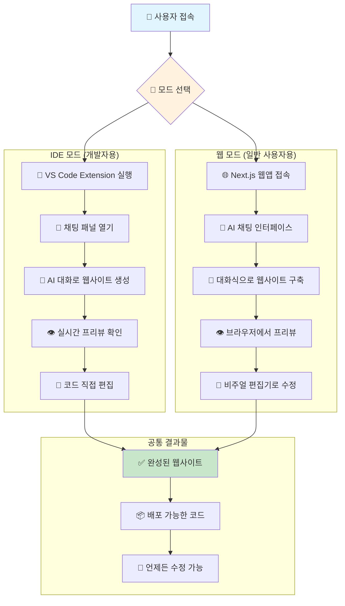

---

## 🌟 워크플로우 1: 템플릿 기반 빠른 생성

> **사용 시나리오**: "쇼핑몰 사이트를 빠르게 만들고 싶어요"

### 단계 1: AI와 대화 시작
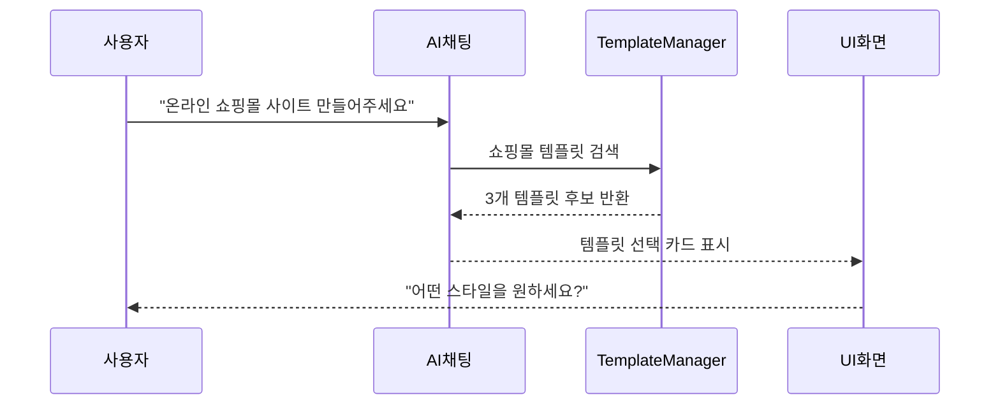

**관련 파일들:**
- 🎯 **웹 모드**: `src/components/AIChatPanel.tsx` - AI 대화 UI
- 🎯 **IDE 모드**: `extensions/windwalker/src/webview/chat/index.html` - 채팅 WebView
- ⚙️ **템플릿 관리**: `src/services/TemplateManager.ts` - 템플릿 검색 로직
- 🎨 **UI 표시**: `src/components/TemplateSelector.tsx` - 템플릿 선택 카드

### 단계 2: 템플릿 선택 및 커스터마이징
```mermaid
flowchart TD
    A[👤 사용자가 템플릿 선택] --> B[🎨 "미니멀한 스타일"]
    B --> C[🤖 AI가 질문 시작]
    
    subgraph "AI 커스터마이징 질문들"
        D["🏪 어떤 상품을 파나요?"]
        E["🎨 브랜드 색상이 있나요?"]
        F["📧 연락처 정보는?"]
        G["💳 결제 시스템은?"]
    end
    
    C --> D --> E --> F --> G
    G --> H[✨ 맞춤형 웹사이트 생성]
    
    style H fill:#c8e6c9
```

**대화 예시:**
```
🤖 AI: "미니멀 쇼핑몰 템플릿을 선택하셨네요! 몇 가지 질문드릴게요.
      어떤 상품을 주로 판매하실 예정인가요?"

👤 사용자: "핸드메이드 액세서리요"

🤖 AI: "좋네요! 브랜드만의 특별한 색상이 있으신가요?"

👤 사용자: "파스텔 핑크와 화이트 조합으로 해주세요"

🤖 AI: "완벽해요! 연락처 정보와 소셜미디어 계정도 알려주세요."
```

**관련 파일들:**
- 📝 **대화 로직**: `src/services/AIWorkflowRouter.ts` - 질문 흐름 관리
- 🎨 **커스터마이징**: `src/services/CustomizationEngine.ts` - 템플릿 수정 엔진
- 💾 **상태 관리**: `src/context/ConversationContext.tsx` - 대화 상태 저장

### 단계 3: 실시간 생성 및 프리뷰
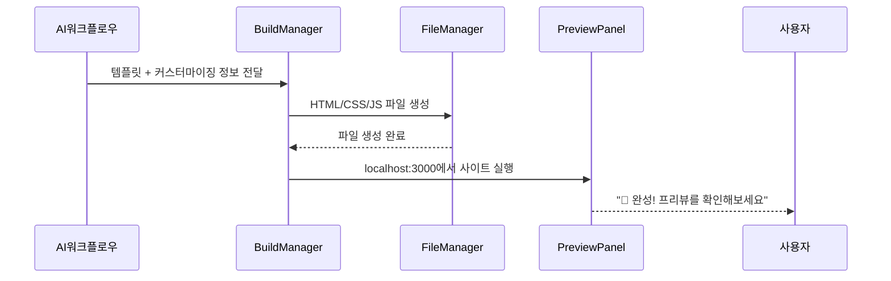

**실제 화면에서 보이는 것:**
- 왼쪽: AI 채팅창에서 "✅ 핸드메이드 액세서리 쇼핑몰이 완성되었습니다!"
- 오른쪽: iframe으로 실제 웹사이트 프리뷰 (파스텔 핑크 색상 적용됨)
- 하단: "🔄 새로고침", "📱 모바일 보기", "💾 저장" 버튼들

**관련 파일들:**
- 🔨 **빌드 처리**: `extensions/windwalker/src/core/BuildManager.ts` - 실제 빌드 실행
- 📁 **파일 관리**: `extensions/windwalker/src/core/FileManager.ts` - 생성된 파일 저장
- 👁️ **프리뷰 웹**: `src/components/PreviewPanel.tsx` - React 프리뷰 컴포넌트
- 👁️ **프리뷰 IDE**: `extensions/windwalker/src/webview/preview/index.html` - VS Code 프리뷰

---

## 🎨 워크플로우 2: 대화식 점진적 개선

> **사용 시나리오**: "만들어진 사이트를 더 예쁘게 수정하고 싶어요"

### 단계 1: 개선 요청
```mermaid
flowchart TD
    A[👤 사용자 개선 요청] --> B{🤖 AI 요청 분석}
    
    subgraph "요청 유형별 처리"
        C[🎨 디자인 개선<br/>"헤더를 더 모던하게"]
        D[📝 콘텐츠 수정<br/>"메뉴를 추가해주세요"]
        E[⚡ 기능 추가<br/>"문의 폼을 넣어주세요"]
        F[🐛 문제 해결<br/>"모바일에서 깨져요"]
    end
    
    B --> C
    B --> D
    B --> E
    B --> F
    
    subgraph "AI 분석 결과"
        G[🎯 변경 범위 파악]
        H[💡 3가지 옵션 제안]
        I[⚠️ 영향도 분석]
    end
    
    C --> G
    D --> G
    E --> G
    F --> G
    
    G --> H --> I
    
    style H fill:#fff3e0
```

**실제 대화 예시:**
```
👤 사용자: "헤더 부분이 너무 단조로워요. 더 눈에 띄게 만들어주세요"

🤖 AI: "헤더를 개선해드릴게요! 3가지 방향을 제안드려요:

     1. 🌟 그라데이션 배경 + 그림자 효과 (강렬한 느낌)
     2. 🎨 투명 배경 + 호버 애니메이션 (세련된 느낌) 
     3. 📷 브랜드 이미지 배경 + 텍스트 오버레이 (브랜드 강조)
     
     어떤 방향이 좋으실까요?"

👤 사용자: "2번으로 해주세요"

🤖 AI: "좋은 선택이에요! 투명 배경에 호버 효과를 추가할게요. 
     기존 핑크 색상과 잘 어울리도록 조정하겠습니다."
```

**관련 파일들:**
- 🧠 **요청 분석**: `src/services/AIIntentAnalyzer.ts` - 사용자 의도 파악
- 🎨 **옵션 생성**: `src/services/DesignOptionGenerator.ts` - 다양한 디자인 옵션 생성
- 🔍 **영향도 분석**: `src/services/ImpactAnalyzer.ts` - 변경사항 영향 범위 계산

### 단계 2: 실시간 적용 및 비교
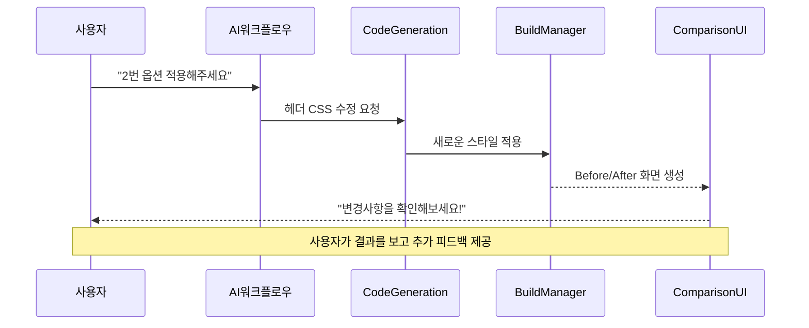

**화면에서 보이는 것:**
- **좌측 프리뷰**: 수정 전 헤더 (기본 스타일)
- **우측 프리뷰**: 수정 후 헤더 (투명 배경 + 호버 효과)
- **하단 컨트롤**: "✅ 적용하기", "🔄 다른 옵션 시도", "↩️ 되돌리기"

**관련 파일들:**
- ⚙️ **코드 생성**: `extensions/windwalker/src/services/CodeGenerationService.ts` - 실제 CSS/JS 생성
- 🔄 **비교 UI**: `src/components/BeforeAfterComparison.tsx` - 변경사항 비교 화면
- 💾 **버전 관리**: `src/services/VersionManager.ts` - 변경사항 히스토리 관리

### 단계 3: 연쇄 개선 및 최적화
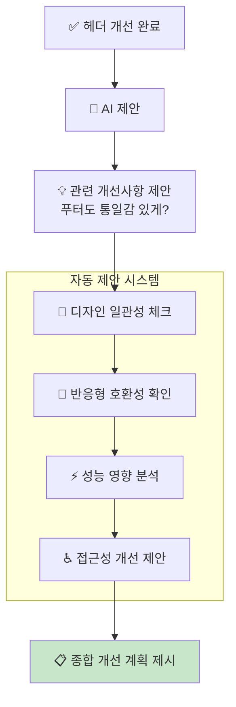

**AI 자동 제안 예시:**
```
🤖 AI: "헤더가 멋지게 바뀌었네요! 💫
     몇 가지 추가 개선사항을 제안드려요:
     
     ✨ 자동 감지된 개선점:
     1. 푸터 스타일도 헤더와 통일감 있게 업데이트
     2. 모바일에서 메뉴 버튼 크기 조정 필요
     3. 로딩 속도를 위해 이미지 최적화 권장
     
     한 번에 모두 적용할까요, 아니면 하나씩 확인하며 진행할까요?"
```

**관련 파일들:**
- 🔍 **일관성 체크**: `src/services/DesignConsistencyChecker.ts` - 디자인 통일성 검사
- 📱 **반응형 체크**: `src/services/ResponsiveValidator.ts` - 모바일 호환성 검증
- ⚡ **성능 분석**: `src/services/PerformanceAnalyzer.ts` - 웹사이트 성능 측정

---

## 🚀 워크플로우 3: 완전 자유 창작

> **사용 시나리오**: "특별한 아이디어가 있어요. 처음부터 만들어주세요"

### 단계 1: 아이디어 구체화 대화
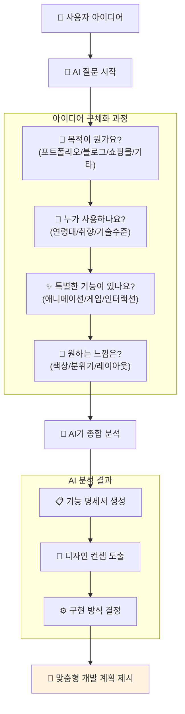

**실제 대화 예시:**
```
👤 사용자: "고양이 카페 사이트를 만들고 싶은데, 고양이들이 실제로 움직이는 애니메이션이 있었으면 좋겠어요"

🤖 AI: "고양이 카페 사이트! 정말 귀여운 아이디어네요 🐱
     몇 가지 더 자세히 알려주세요:
     
     1. 고양이 애니메이션은 어떤 느낌인가요?
        - 실제 고양이 동영상을 배경으로?
        - 귀여운 일러스트 애니메이션?
        - 인터랙티브하게 클릭하면 반응하는?
     
     2. 카페 정보로는 뭐가 필요한가요?
        - 메뉴, 가격, 위치, 예약 시스템?"

👤 사용자: "일러스트 고양이들이 화면에서 돌아다니고, 클릭하면 야옹 소리나고 했으면 좋겠어요. 그리고 예약 시스템도 있으면 좋겠어요"

🤖 AI: "완벽해요! 🎉 interactive한 고양이 애니메이션과 예약 시스템을 포함한 카페 사이트를 만들어드릴게요.
     
     구현 계획:
     ✨ 메인 페이지: 움직이는 고양이 일러스트 (CSS 애니메이션)
     🔊 사운드 효과: 클릭 시 고양이 소리
     📅 예약 시스템: 간단한 달력 인터페이스
     📱 모바일 친화적: 터치에서도 고양이 반응
     
     바로 시작할게요!"
```

**관련 파일들:**
- 🧠 **아이디어 분석**: `src/services/IdeaAnalyzer.ts` - 자유 창작 요청 구조화
- 📋 **기능 명세**: `src/services/FeatureSpecGenerator.ts` - 기능 목록 자동 생성
- 🎨 **컨셉 생성**: `src/services/ConceptGenerator.ts` - 디자인 컨셉 도출

### 단계 2: 점진적 구축 과정
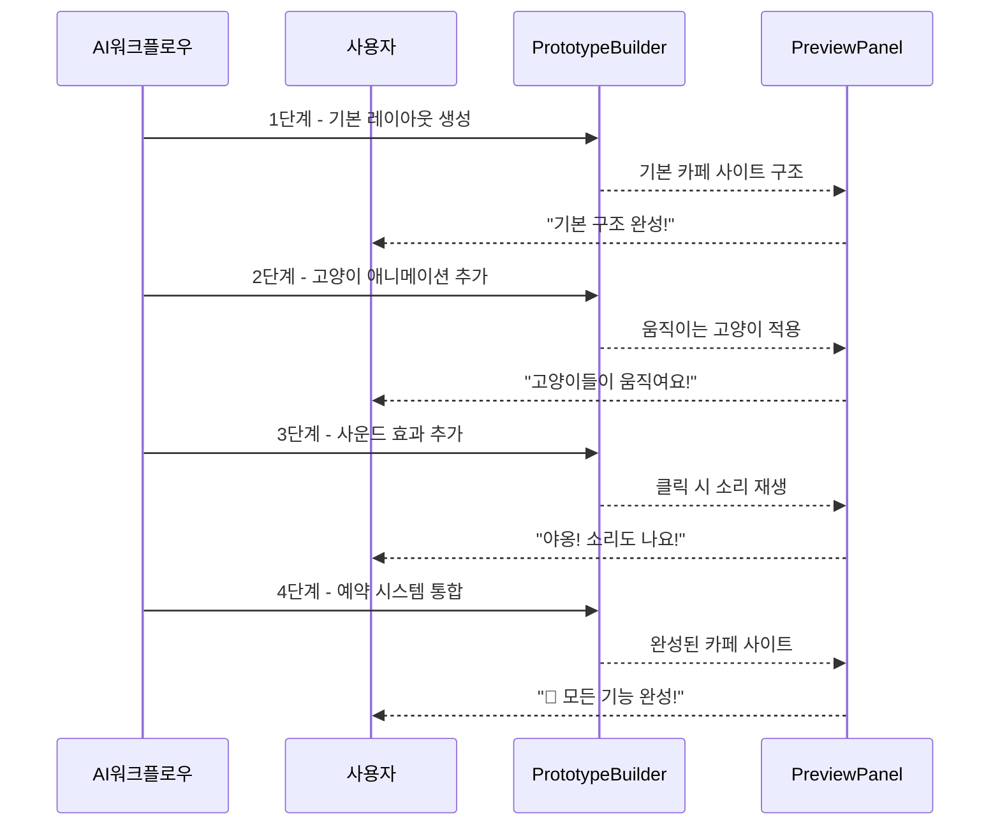

**각 단계별 화면 변화:**
1. **1단계**: 기본 카페 레이아웃 (헤더, 메뉴, 소개, 푸터)
2. **2단계**: 고양이 일러스트 추가 + CSS 애니메이션 (좌우 이동, 깜빡임)
3. **3단계**: 클릭 이벤트 + 사운드 재생 기능
4. **4단계**: 예약 폼 + 달력 위젯 + 확인 시스템

**관련 파일들:**
- 🏗️ **프로토타입 빌더**: `src/services/PrototypeBuilder.ts` - 단계별 구축 로직
- 🎬 **애니메이션**: `src/assets/animations/CatAnimations.css` - 고양이 CSS 애니메이션
- 🔊 **사운드 관리**: `src/services/SoundManager.ts` - 오디오 재생 관리
- 📅 **예약 시스템**: `src/components/ReservationSystem.tsx` - 예약 달력 컴포넌트

### 단계 3: 사용자 피드백 반영
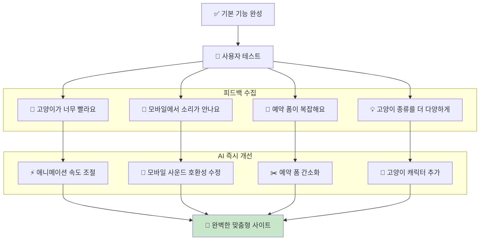

**피드백 반영 예시:**
```
👤 사용자: "고양이가 너무 빨리 움직여서 어지러워요"

🤖 AI: "바로 수정해드릴게요! 애니메이션 속도를 절반으로 줄여서 더 자연스럽게 만들겠습니다."
     [2초 후 프리뷰 업데이트]
     "어떠세요? 이제 더 편안하게 보이시나요?"

👤 사용자: "네! 훨씬 좋아요. 그런데 고양이 종류를 더 다양하게 할 수 있나요?"

🤖 AI: "물론이에요! 페르시안, 러시안 블루, 스코티시 폴드 등 5가지 고양이를 추가해드릴게요. 
     각각 다른 움직임 패턴도 적용하겠습니다."
```

**관련 파일들:**
- 🔄 **피드백 처리**: `src/services/FeedbackProcessor.ts` - 사용자 의견 분석 및 처리
- ⚙️ **실시간 수정**: `src/services/LiveEditor.ts` - 즉시 수정 및 적용
- 🎮 **A/B 테스트**: `src/services/ABTestManager.ts` - 다양한 옵션 테스트

---

## 🔄 모드별 상세 워크플로우

### IDE 모드 (개발자 친화적)
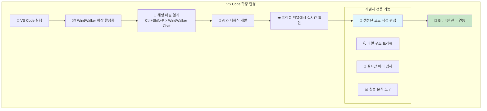

**IDE 모드 특별 기능:**
- **직접 코드 편집**: AI가 생성한 코드를 VS Code에서 바로 수정
- **디버깅 도구**: 브레이크포인트, 콘솔 로그 등 개발 도구 활용
- **확장 플러그인**: ESLint, Prettier 등 개발 도구 연동
- **Git 통합**: 변경사항 자동 커밋, 브랜치 관리

**관련 파일들:**
- 🔧 **확장 진입점**: `extensions/windwalker/src/extension.ts` - VS Code 확장 메인
- 💬 **채팅 제공자**: `extensions/windwalker/src/providers/ChatWebViewProvider.ts` - 채팅 패널 관리
- 📝 **코드 편집기**: VS Code 내장 텍스트 에디터 + Intellisense
- 🔍 **파일 탐색**: `extensions/windwalker/src/core/FileManager.ts` - 파일 시스템 관리

### 웹 모드 (일반 사용자 친화적)
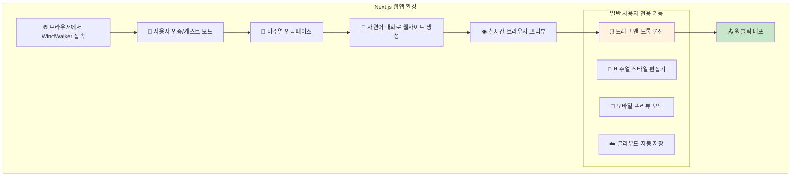

**웹 모드 특별 기능:**
- **비주얼 편집**: 마우스로 요소 클릭하여 직접 수정
- **템플릿 갤러리**: 다양한 완성된 템플릿 바로 적용
- **원클릭 배포**: Vercel, Netlify 등으로 즉시 배포
- **협업 기능**: 링크 공유로 다른 사람과 함께 편집

**관련 파일들:**
- 🌐 **웹앱 진입점**: `src/app/page.tsx` - Next.js 메인 페이지
- 💬 **채팅 컴포넌트**: `src/components/AIChatPanel.tsx` - React 채팅 UI
- 🖱️ **비주얼 편집기**: `src/components/VisualEditor.tsx` - 드래그 앤 드롭 편집
- ☁️ **클라우드 저장**: `src/services/CloudStorage.ts` - 자동 저장 시스템

---

## 🎯 통합 메시지 브리지 워크플로우

### MessageBridge가 처리하는 모든 메시지 유형
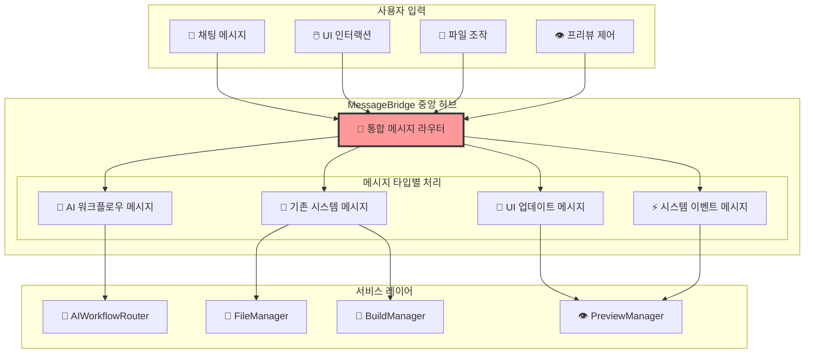

**메시지 처리 예시:**
```typescript
// MessageBridge가 처리하는 통합 메시지 예시
interface UnifiedMessage {
    // 기존 시스템 메시지
    type: 'file:save' | 'build:start' | 'preview:reload'
    
    // 새로운 AI 워크플로우 메시지  
    | 'ai:template:search' | 'ai:customize:apply' | 'ai:improve:request'
    
    // UI 인터랙션 메시지
    | 'ui:element:select' | 'ui:style:change' | 'ui:layout:modify'
    
    data: any
    source: 'chat' | 'preview' | 'editor' | 'system'
    timestamp: string
}
```

**관련 파일들:**
- 🌐 **통합 라우터**: `extensions/windwalker/src/core/MessageBridge.ts` - 모든 메시지 중앙 처리
- 🤖 **AI 라우터**: `src/services/AIWorkflowRouter.ts` - AI 특화 메시지 처리
- 📡 **메시지 타입**: `src/types/MessageTypes.ts` - 통합 메시지 인터페이스 정의

---

## 🚀 배포 및 공유 워크플로우

### 완성된 웹사이트 배포하기
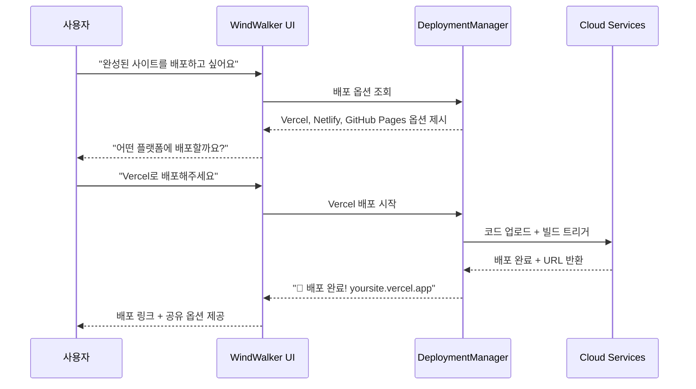

**배포 과정에서 보이는 것:**
1. **배포 옵션 선택**: Vercel, Netlify, GitHub Pages 중 선택
2. **진행 상황 표시**: "📦 코드 준비 중... ⬆️ 업로드 중... 🔨 빌드 중... ✅ 완료!"
3. **결과 화면**: 실제 배포된 URL + QR코드 + 소셜 공유 버튼

**관련 파일들:**
- 🚀 **배포 관리**: `src/services/DeploymentManager.ts` - 다양한 플랫폼 배포 통합
- ☁️ **Vercel 연동**: `src/integrations/VercelDeployment.ts` - Vercel API 연동
- 📱 **공유 기능**: `src/components/ShareModal.tsx` - 링크 공유 및 QR코드 생성

---

## 📱 반응형 및 모바일 워크플로우

### 모바일 최적화 자동 처리
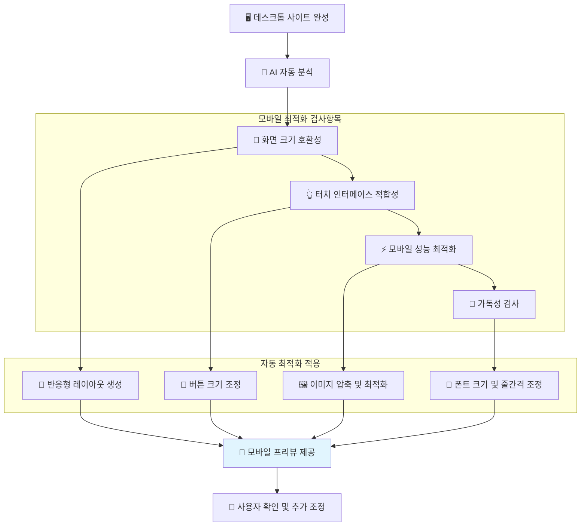

**모바일 최적화 대화 예시:**
```
🤖 AI: "데스크톱 사이트가 완성되었네요! 📱 모바일 최적화를 진행할까요?
     
     자동 분석 결과:
     ✅ 전체적인 레이아웃은 모바일 친화적
     ⚠️ 버튼이 터치하기에 조금 작음 (권장: 44px 이상)
     ⚠️ 이미지가 모바일에서 로딩이 느릴 수 있음
     
     자동으로 최적화해드릴까요?"

👤 사용자: "네, 자동으로 해주세요"

🤖 AI: "✨ 모바일 최적화 완료!
     - 버튼 크기를 48px로 확대했습니다
     - 이미지를 WebP 형식으로 압축했습니다  
     - 모바일 메뉴를 햄버거 스타일로 변경했습니다
     
     📱 모바일 프리뷰를 확인해보세요!"
```

**관련 파일들:**
- 📱 **반응형 분석기**: `src/services/ResponsiveAnalyzer.ts` - 모바일 호환성 검사
- 🔧 **자동 최적화**: `src/services/MobileOptimizer.ts` - 모바일 최적화 자동 적용
- 📱 **모바일 프리뷰**: `src/components/MobilePreview.tsx` - 모바일 시뮬레이터

---

## 🔧 문제 해결 및 디버깅 워크플로우

### AI 기반 자동 문제 해결
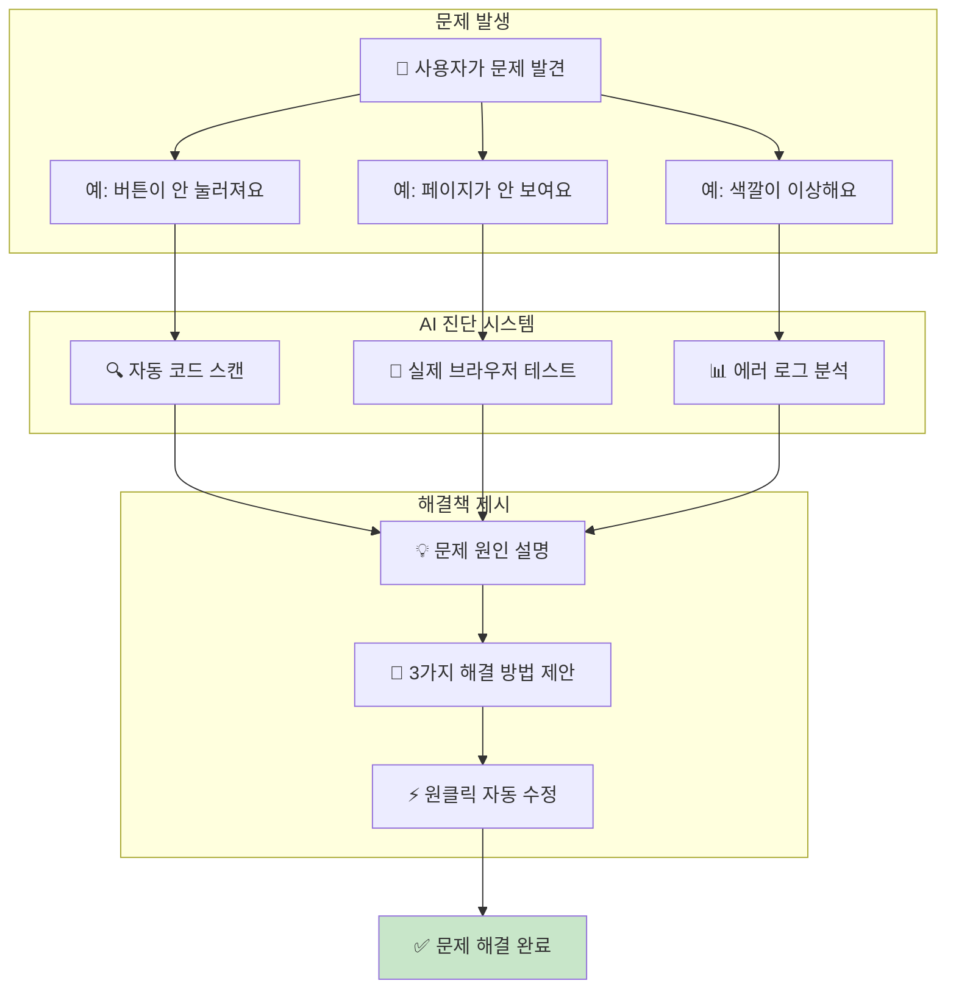

**실제 문제 해결 대화:**
```
👤 사용자: "문의하기 버튼을 눌렀는데 아무 반응이 없어요"

🤖 AI: "🔍 버튼 문제를 진단해보겠습니다...
     
     진단 결과:
     ❌ JavaScript 이벤트 리스너가 연결되지 않음
     ❌ 문의 폼 ID와 버튼 연결 오류 발견
     
     💡 해결 방법:
     1. 🔧 JavaScript 이벤트 자동 연결
     2. 📝 폼 ID 일치하도록 수정
     3. ⚡ 전체 인터랙션 시스템 재설정
     
     바로 수정해드릴까요?"

👤 사용자: "네, 빨리 고쳐주세요"

🤖 AI: "✅ 수정 완료! 이제 버튼이 정상 작동합니다.
     앞으로 이런 문제를 방지하기 위해 자동 테스트도 추가했어요."
```

**관련 파일들:**
- 🔍 **진단 시스템**: `src/services/DiagnosticEngine.ts` - 자동 문제 감지 및 분석
- 🧪 **테스트 자동화**: `src/services/AutoTester.ts` - 브라우저 자동 테스트
- 🔧 **자동 수정**: `src/services/AutoFixer.ts` - 일반적인 문제 자동 해결

---

## 📚 학습 및 도움말 시스템

### 사용자 맞춤형 가이드 제공
```mermaid
flowchart TD
    A[👤 사용자 질문] --> B{🤖 질문 유형 분석}
    
    subgraph "질문 유형별 대응"
        C[❓ 기능 사용법<br/>"어떻게 하나요?"]
        D[🐛 문제 해결<br/>"왜 안되나요?"]
        E[💡 아이디어 구현<br/>"이런 걸 만들 수 있나요?"]
        F[📖 개념 설명<br/>"이게 뭔가요?"]
    end
    
    B --> C --> G[📺 단계별 동영상 가이드]
    B --> D --> H[🔧 실시간 화면 공유 진단]
    B --> E --> I[🎨 프로토타입 즉시 생성]
    B --> F --> J[📚 쉬운 언어로 개념 설명]
    
    subgraph "학습 지원"
        K[📈 사용자 레벨 추적]
        L[🏆 학습 목표 설정]
        M[💪 실습 과제 제공]
    end
    
    G --> K
    H --> K
    I --> L
    J --> M
    
    style K fill:#fff3e0
```

**맞춤형 가이드 예시:**
```
👤 사용자: "CSS가 뭔지 모르겠어요. 색깔만 바꾸고 싶은데..."

🤖 AI: "CSS는 웹사이트의 '화장'을 담당한다고 생각하시면 돼요! 💄
     
     📚 쉽게 설명드리면:
     - HTML = 집의 구조 (방, 문, 창문)
     - CSS = 집의 인테리어 (벽지, 가구 색깔, 조명)
     
     색깔 바꾸기는 이렇게 해요:
     1. 🎨 바꾸고 싶은 부분을 클릭하세요
     2. 🌈 색상 팔레트가 나타나면 원하는 색을 선택
     3. ✅ 바로 적용되는걸 확인하세요!
     
     한번 해보실래요? 제가 실시간으로 도와드릴게요!"

👤 사용자: "네! 헤더 배경을 파란색으로 바꿔보고 싶어요"

🤖 AI: "완벽한 선택이에요! 💙 헤더 부분을 클릭해보세요.
     [사용자가 클릭하면 색상 선택 패널 자동 표시]
     이제 파란색을 골라보세요. 실시간으로 바뀌는 걸 보실 수 있어요!"
```

**관련 파일들:**
- 📚 **도움말 시스템**: `src/services/HelpSystem.ts` - 상황별 맞춤 가이드 제공
- 🎓 **학습 추적**: `src/services/LearningTracker.ts` - 사용자 학습 진도 관리
- 📺 **인터랙티브 튜토리얼**: `src/components/InteractiveTutorial.tsx` - 단계별 가이드 UI

---

## 🎉 완성 및 축하 워크플로우

### 프로젝트 완성 시 자동 축하 시스템
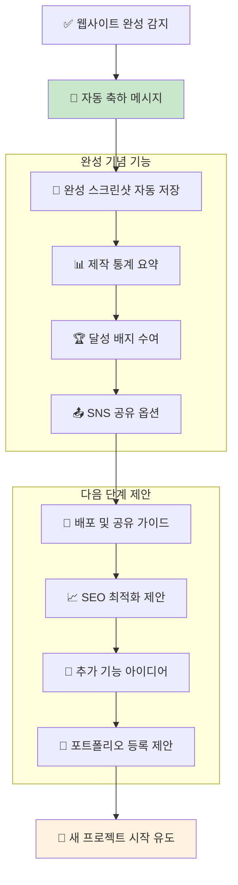

**완성 축하 메시지 예시:**
```
🎉 축하합니다! 멋진 웹사이트가 완성되었어요!

📊 제작 통계:
- ⏱️ 총 제작 시간: 45분
- 💬 AI와 대화: 23회
- 🔄 수정 횟수: 8회
- 🎨 사용한 색상: 파스텔 핑크, 화이트, 골드

🏆 획득한 배지:
- 🎨 "첫 웹사이트 완성" 배지
- 💡 "창의적 아이디어" 배지  
- 🔧 "문제 해결사" 배지

📤 지금 바로 할 수 있는 것들:
1. 🚀 Vercel에 배포하기 (1분 완료)
2. 📱 QR코드로 친구들에게 자랑하기
3. 💼 포트폴리오에 추가하기
4. 🌟 다음 프로젝트 시작하기

어떤 걸 해보시겠어요?
```

**관련 파일들:**
- 🎉 **축하 시스템**: `src/services/CelebrationManager.ts` - 완성 감지 및 축하 메시지
- 📊 **통계 수집**: `src/services/ProjectAnalytics.ts` - 제작 과정 데이터 수집
- 🏆 **배지 시스템**: `src/services/AchievementSystem.ts` - 사용자 성과 관리

---

## 📖 요약: 통합된 WindWalker 사용자 여정

### 전체 워크플로우 한눈에 보기
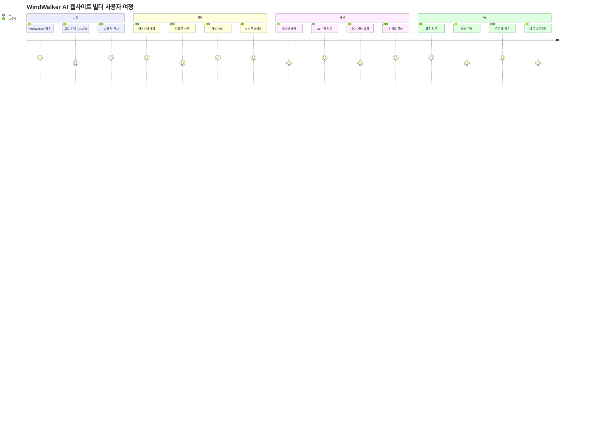

### 핵심 학습 포인트 정리

1. **🤖 AI 대화식 접근**: 복잡한 기술 지식 없이도 자연어로 웹사이트 제작
2. **⚡ 실시간 피드백**: 모든 변경사항이 즉시 프리뷰에 반영
3. **🎯 점진적 개선**: 기본 → 커스터마이징 → 최적화 단계별 발전
4. **🔄 양방향 상호작용**: 사용자 피드백 → AI 분석 → 즉시 개선
5. **📱 완전 반응형**: 데스크톱과 모바일 모두 자동 최적화
6. **🚀 원클릭 배포**: 완성 즉시 실제 웹사이트로 배포 가능

### 주요 소스코드 파일 참조 모음

**🌐 웹 모드 핵심 파일:**
- `src/app/page.tsx` - Next.js 메인 페이지
- `src/components/AIChatPanel.tsx` - AI 채팅 인터페이스
- `src/components/PreviewPanel.tsx` - 브라우저 프리뷰
- `src/services/AIWorkflowRouter.ts` - AI 워크플로우 라우팅

**🔧 IDE 모드 핵심 파일:**
- `extensions/windwalker/src/extension.ts` - VS Code 확장 진입점
- `extensions/windwalker/src/core/MessageBridge.ts` - 통합 메시지 허브
- `extensions/windwalker/src/webview/chat/` - 채팅 WebView 파일들
- `extensions/windwalker/src/webview/preview/` - 프리뷰 WebView 파일들

**🤖 AI 서비스 핵심 파일:**
- `src/services/TemplateManager.ts` - 템플릿 관리
- `src/services/CustomizationEngine.ts` - 맞춤화 엔진
- `extensions/windwalker/src/services/CodeGenerationService.ts` - 코드 생성
- `src/services/DeploymentManager.ts` - 배포 관리

---

**문서 작성자**: Claude Code Assistant  
**작성일**: 2025-08-05  
**버전**: 1.0 (AI 대화식 웹사이트 빌더 통합 후 완전 워크플로우)  
**기반 문서**: docs/09, docs/12, docs/13, docs/14, docs/15, 실제 구현 계획