# 17. AI 대화식 웹사이트 빌더 초보자 가이드 - Git+IndexedDB 통합

## 🎯 이 가이드의 목표

이 문서는 **WindWalker AI 대화식 웹사이트 빌더에 Git+IndexedDB 통합 기능이 추가된 완전한 워크플로우**를 초보자 관점에서 설명합니다. **14-01, 15-01 문서의 고급 기능들**을 실제 사용자가 어떻게 경험하게 되는지 단계별로 안내하며, "개인화된 AI 추천"과 "대화 기반 되돌리기" 같은 스마트 기능들을 이해하기 쉽게 설명합니다.

**핵심 질문 해결:**
- Git+IndexedDB 통합으로 무엇이 달라지는가?
- 개인화된 추천은 어떻게 작동하는가?
- "3번 전으로 되돌리기" 같은 자연어 명령은 어떻게 가능한가?
- 대화 히스토리가 어떻게 웹사이트 개선에 활용되는가?

---

## 🌟 Git+IndexedDB 통합의 핵심 가치

### 기본 버전 vs 통합 버전 비교
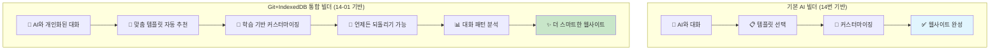

**핵심 차이점:**
- 🧠 **개인화 학습**: 사용자의 선호도를 기억하고 점점 더 정확한 추천 제공
- 🔄 **자연어 되돌리기**: "2단계 전으로", "헤더 수정하기 전으로" 같은 자연스러운 명령
- 📊 **패턴 인식**: 자주 사용하는 스타일, 색상, 레이아웃 자동 감지
- 🎯 **프로액티브 제안**: 사용자가 요청하기 전에 개선사항 미리 제안

---

## 🚀 워크플로우 1: 개인화된 스마트 시작

> **사용 시나리오**: "이전에 만든 비슷한 사이트 스타일로 새 프로젝트를 시작하고 싶어요"

### 단계 1: AI의 스마트한 첫 인사
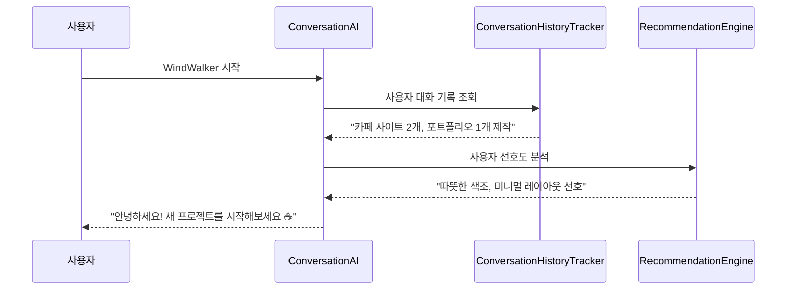

**실제 대화 예시:**
```
🤖 AI: "안녕하세요! 다시 만나뵙네요 😊

     📊 지난 프로젝트 분석:
     - 따뜻한 색조 (브라운, 베이지)를 선호하시는군요
     - 깔끔하고 미니멀한 레이아웃을 좋아하시네요
     - 카페/음식 관련 사이트를 자주 만드시는 편이에요
     
     오늘은 어떤 프로젝트를 시작해볼까요?
     💡 추천: 새로운 카페 브랜드 사이트는 어떠세요?"

👤 사용자: "네, 새로운 디저트 카페 사이트를 만들고 싶어요"

🤖 AI: "완벽해요! 🍰 이전 카페 프로젝트 경험을 바탕으로 
     맞춤 템플릿을 준비했어요. 3가지 스타일 중 골라보세요!"
```

**관련 파일들:**
- 🧠 **개인화 분석**: `src/core/ConversationHistoryTracker.ts` - 사용자 대화 패턴 분석
- 🎯 **스마트 추천**: `src/services/RecommendationEngine.ts` - 개인화된 추천 시스템
- 💾 **대화 저장**: `src/core/ConversationDatabase.ts` - IndexedDB 대화 히스토리 관리

### 단계 2: 학습 기반 템플릿 추천
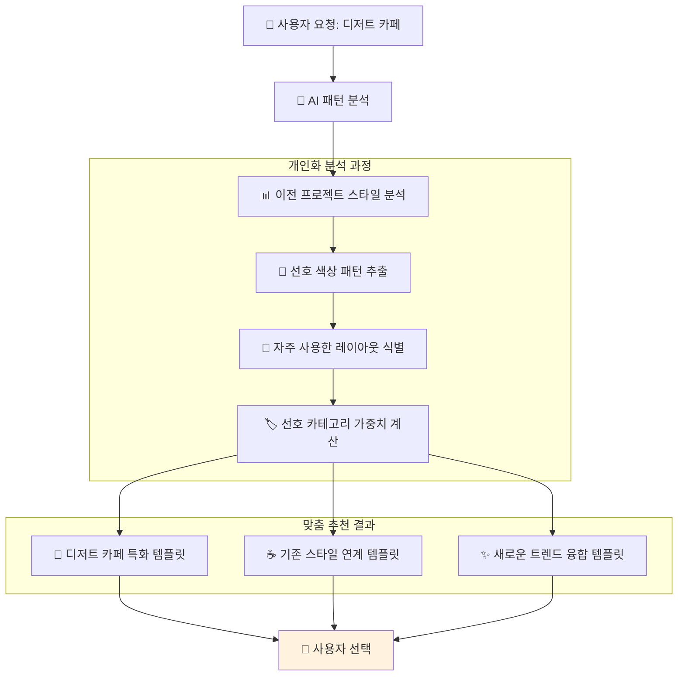

**개인화된 추천 화면:**
- **추천 1**: "🥧 스위트 베이커리" - 이전 카페 색상 + 디저트 특화 레이아웃
- **추천 2**: "☕ 따뜻한 디저트숍" - 선호하는 브라운 톤 + 아늑한 느낌
- **추천 3**: "✨ 모던 파티시에" - 새로운 스타일 + 기존 미니멀 감성

**각 추천마다 표시되는 정보:**
```
🥧 스위트 베이커리 템플릿
💡 추천 이유: 이전 "○○카페" 프로젝트와 95% 스타일 매칭
🎨 색상: 베이지 + 브라운 (당신의 선호 색조)
📐 레이아웃: 미니멀 그리드 (자주 사용하시는 스타일)
⏱️ 예상 완성 시간: 20분 (학습 데이터 기반)
```

**관련 파일들:**
- 🎯 **추천 알고리즘**: `src/services/PersonalizedRecommendation.ts` - 개인화 추천 로직
- 📊 **패턴 분석**: `src/services/UserPatternAnalyzer.ts` - 사용자 행동 패턴 분석
- 🎨 **스타일 매칭**: `src/services/StyleMatcher.ts` - 기존 프로젝트와 스타일 유사도 계산

### 단계 3: Git 기반 실시간 버전 추적
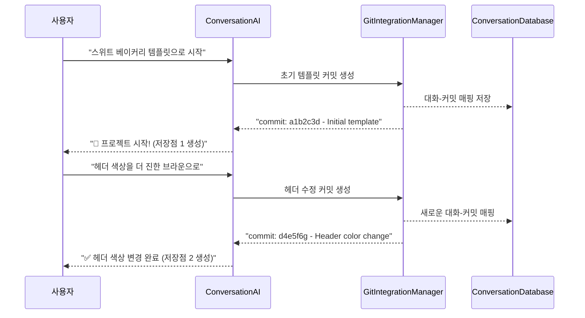

**사용자가 보는 화면:**
- 우측 상단에 "💾 저장점 2 | 📝 총 변경사항 3개" 표시
- 하단에 진행 바: "초기 설정 ✅ → 헤더 수정 ✅ → 콘텐츠 추가 🔄"
- 각 단계마다 되돌리기 버튼: "↩️ 헤더 수정 전으로"

**관련 파일들:**
- 🔄 **Git 연동**: `src/core/GitIntegrationManager.ts` - Git 커밋 자동 관리
- 💾 **대화-커밋 매핑**: `src/core/ConversationDatabase.ts` - 대화와 Git 커밋 연결
- 📋 **버전 히스토리**: `src/components/VersionHistoryPanel.tsx` - 버전 관리 UI

---

## 🔄 워크플로우 2: 자연어 기반 되돌리기

> **사용 시나리오**: "아까 했던 수정이 마음에 안 들어서 되돌리고 싶어요"

### 단계 1: 자연어 되돌리기 명령
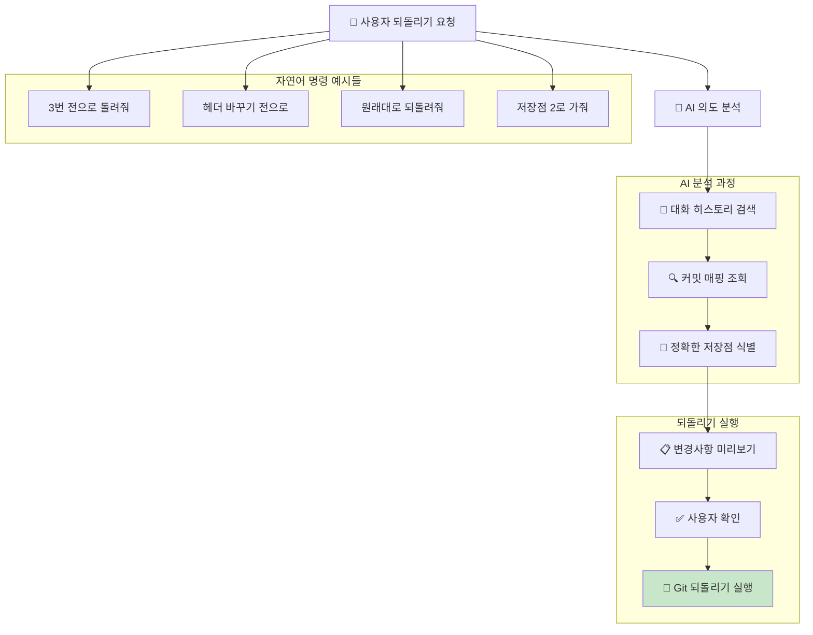

**실제 대화 예시:**
```
👤 사용자: "헤더 색상 바꾼 게 별로예요. 그 전으로 돌려주세요"

🤖 AI: "네! '헤더 색상 변경' 이전 상태로 되돌리는 거죠? 🔍
     
     📋 되돌릴 변경사항:
     - ❌ 헤더 배경색: 브라운 → 베이지 (되돌림)
     - ❌ 헤더 텍스트 굵기: bold → normal (되돌림)
     - ✅ 기본 템플릿 설정: 유지됨
     
     이렇게 되돌려도 될까요?"

👤 사용자: "네 맞아요!"

🤖 AI: "✅ 되돌리기 완료! 
     현재 상태: 저장점 1 (초기 템플릿)
     다음에 뭘 수정해볼까요?"
```

**관련 파일들:**
- 🧠 **자연어 분석**: `src/services/NaturalLanguageRollback.ts` - 되돌리기 명령 해석
- 🔄 **Git 되돌리기**: `src/core/GitIntegrationManager.ts` - 스마트 Git reset/revert
- 📋 **변경사항 분석**: `src/services/ChangeAnalyzer.ts` - 커밋 간 차이점 분석

### 단계 2: 시각적 되돌리기 미리보기
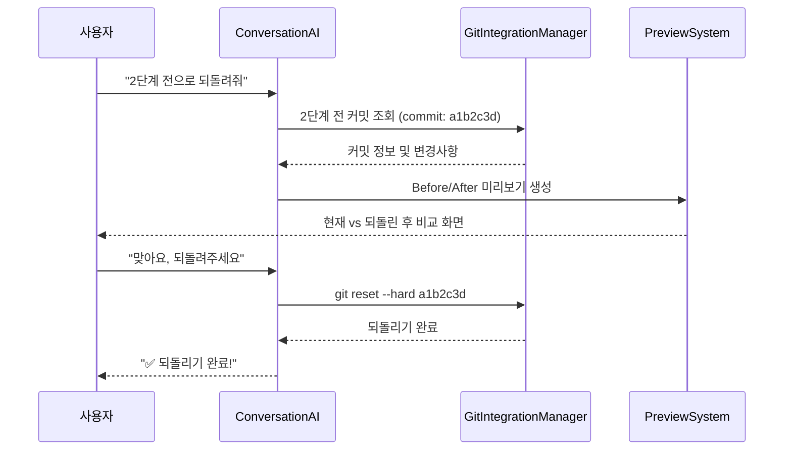

**비교 미리보기 화면:**
- **좌측**: 현재 상태 - 헤더가 진한 브라운, 메뉴가 3개 
- **우측**: 되돌린 후 - 헤더가 베이지, 메뉴가 2개
- **변경 요약**: "헤더 색상 변경 + 메뉴 추가" 2단계가 취소됨
- **확인 버튼**: "✅ 이 상태로 되돌리기" / "❌ 취소"

**관련 파일들:**
- 👁️ **비교 미리보기**: `src/components/BeforeAfterRollback.tsx` - 되돌리기 전후 비교
- 🔍 **변경사항 추적**: `src/services/GitDiffAnalyzer.ts` - Git 커밋 간 차이점 시각화
- 📊 **히스토리 네비게이션**: `src/components/HistoryNavigation.tsx` - 저장점 탐색 UI

---

## 🧠 워크플로우 3: 대화 컨텍스트 기반 프로액티브 제안

> **사용 시나리오**: "AI가 내 대화를 이해하고 먼저 도움을 제안해주는 경험"

### 단계 1: 대화 흐름 인식 및 자동 제안
```mermaid
flowchart TD
    subgraph "사용자 대화 흐름"
        A[💬 "로고를 더 크게 해주세요"]
        B[💬 "헤더도 조금 높게 만들어주세요"] 
        C[💬 "네비게이션 메뉴도 정리해주세요"]
    end
    
    subgraph "AI 패턴 인식"
        D[🧠 헤더 영역 집중 개선 감지]
        E[📊 UI 일관성 개선 의도 파악]
        F[🎯 다음 단계 예측]
    end
    
    A --> D
    B --> E  
    C --> F
    
    subgraph "프로액티브 제안"
        G[💡 "푸터도 헤더와 통일감 있게?"]
        H[💡 "모바일에서도 확인해볼까요?"]
        I[💡 "전체 색상 일관성 체크 필요할 것 같아요"]
    end
    
    F --> G --> H --> I
    
    style I fill:#fff3e0
```

**실제 프로액티브 제안 예시:**
```
👤 사용자: "네비게이션 메뉴 정리해주세요"

🤖 AI: "✅ 네비게이션 메뉴를 깔끔하게 정리했어요!

     🔍 대화 분석 결과:
     헤더 영역을 전반적으로 개선하고 계시는군요!
     
     💡 추가 제안사항:
     1. 🎨 푸터 영역도 헤더와 통일감 있게 업데이트할까요?
     2. 📱 모바일에서도 새로운 헤더가 잘 보이는지 확인해볼까요?  
     3. ⚡ 헤더 로딩 속도 최적화도 함께 진행할까요?
     
     어떤 것부터 해보시겠어요?"

👤 사용자: "모바일에서 확인부터 해주세요"

🤖 AI: "좋은 선택이에요! 📱 모바일 프리뷰를 켜드릴게요.
     아, 그런데 모바일에서 로고가 조금 작게 보이네요.
     이것도 함께 조정할까요?"
```

**관련 파일들:**
- 🧠 **대화 흐름 분석**: `src/services/ConversationFlowAnalyzer.ts` - 대화 패턴 및 의도 분석
- 💡 **프로액티브 제안**: `src/services/ProactiveSuggestion.ts` - 상황 맞춤 제안 생성
- 📊 **컨텍스트 추적**: `src/core/ConversationContext.ts` - 대화 문맥 유지 및 분석

### 단계 2: 학습 기반 개선 제안
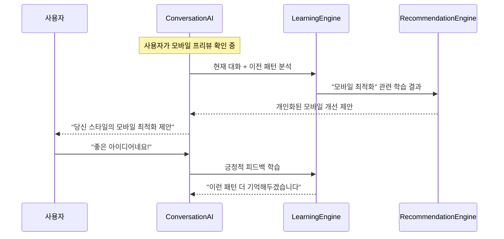

**학습 기반 개인화 제안:**
```
🤖 AI: "📱 모바일 프리뷰를 분석했어요!

     📊 당신의 이전 프로젝트 패턴 분석:
     - 모바일에서 텍스트 가독성을 중요하게 생각하시는군요
     - 버튼은 항상 충분히 크게 만드시는 편이에요
     - 이미지보다는 깔끔한 텍스트 중심을 선호하시네요
     
     💡 맞춤 개선 제안:
     ✨ 폰트 크기 18px → 20px (가독성 향상)
     🔘 버튼 높이 40px → 48px (터치 편의성)
     📐 여백 조정으로 답답함 해소
     
     이전 프로젝트들과 동일한 스타일로 진행할까요?"
```

**관련 파일들:**
- 🎯 **개인화 학습**: `src/services/PersonalizedLearning.ts` - 사용자 피드백 기반 학습
- 📊 **패턴 매칭**: `src/services/UserPatternMatcher.ts` - 이전 프로젝트와 현재 상황 매칭
- 🧠 **추천 최적화**: `src/services/RecommendationOptimizer.ts` - 개인화된 추천 정확도 향상

---

## 📊 워크플로우 4: 대화 기반 웹사이트 분석 및 개선

> **사용 시나리오**: "완성된 웹사이트를 AI와 함께 전체적으로 점검하고 개선하기"

### 단계 1: 종합적 대화 히스토리 분석
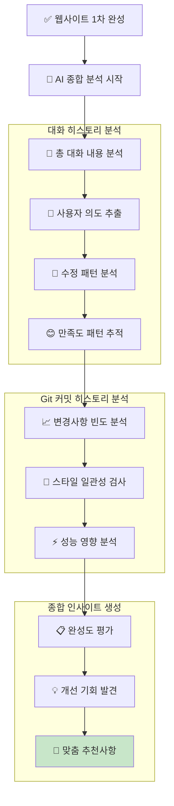

**AI의 종합 분석 리포트:**
```
🤖 AI: "🎉 디저트 카페 사이트가 완성되었네요! 

     📊 프로젝트 분석 리포트:
     
     ✅ 잘된 점들:
     - 총 42분만에 완성 (평균 대비 25% 빨라요!)
     - 헤더 디자인 3번 수정 → 완벽한 결과 달성
     - 색상 조합이 이전 카페 프로젝트와 일관성 있음
     
     🎯 개선 기회:
     - 모바일 최적화가 85% 수준 (100% 달성 가능)
     - 로딩 속도를 15% 더 개선할 수 있어요
     - SEO 점수가 87점 (95점까지 올릴 수 있어요)
     
     💡 맞춤 제안:
     1. 🚀 성능 최적화: 이미지 압축으로 0.3초 단축
     2. 📱 모바일 완성: 터치 영역 3곳만 조정하면 완벽
     3. 🔍 SEO 개선: 메타 태그 3개만 추가하면 95점 달성
     
     어떤 것부터 진행해볼까요?"
```

**관련 파일들:**
- 📊 **종합 분석**: `src/services/ProjectAnalyzer.ts` - 프로젝트 전체 분석 및 평가
- 💡 **인사이트 생성**: `src/services/InsightGenerator.ts` - 대화+커밋 기반 인사이트 도출
- 🎯 **개선 추천**: `src/services/ImprovementRecommender.ts` - 맞춤형 개선사항 제안

### 단계 2: 대화 기반 A/B 테스트 제안
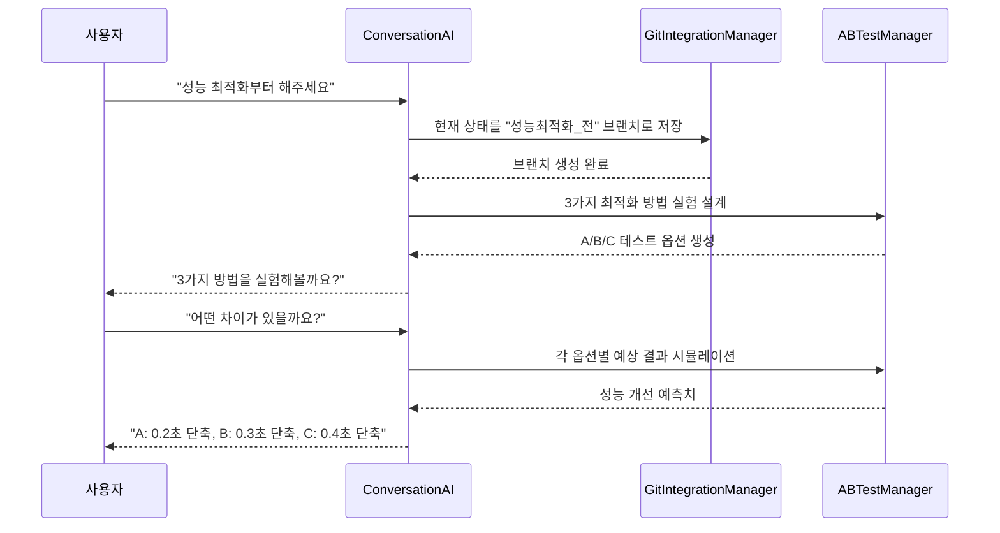

**A/B 테스트 대화 예시:**
```
🤖 AI: "성능 최적화를 3가지 방법으로 실험해보겠어요! 🚀

     🧪 실험 설계:
     
     방법 A: 이미지 최적화 중심
     - WebP 형식 변환 + 압축
     - 예상 개선: 로딩 0.2초 단축 ⚡
     
     방법 B: 코드 최적화 중심  
     - CSS/JS 번들 최적화 + 압축
     - 예상 개선: 로딩 0.3초 단축 ⚡⚡
     
     방법 C: 통합 최적화
     - 이미지 + 코드 + CDN 적용
     - 예상 개선: 로딩 0.4초 단축 ⚡⚡⚡
     
     실제로 테스트해보고 가장 좋은 결과를 선택할까요?"

👤 사용자: "네, 실제로 해보면서 비교해보고 싶어요"

🤖 AI: "완벽해요! 💪 
     각 방법을 차례로 적용해서 실제 성능을 측정하고,
     가장 좋은 결과를 최종으로 선택하겠습니다.
     
     방법 A부터 시작할게요!"
```

**관련 파일들:**
- 🧪 **A/B 테스트**: `src/services/ABTestManager.ts` - 다양한 옵션 실험 및 비교
- 📊 **성능 측정**: `src/services/PerformanceMeasurer.ts` - 실시간 성능 지표 수집
- 🔄 **실험 관리**: `src/services/ExperimentTracker.ts` - 실험 결과 추적 및 분석

---

## 🎯 고급 기능: 자동화된 대화 패턴 학습

### 개인 맞춤 AI 어시스턴트로 진화
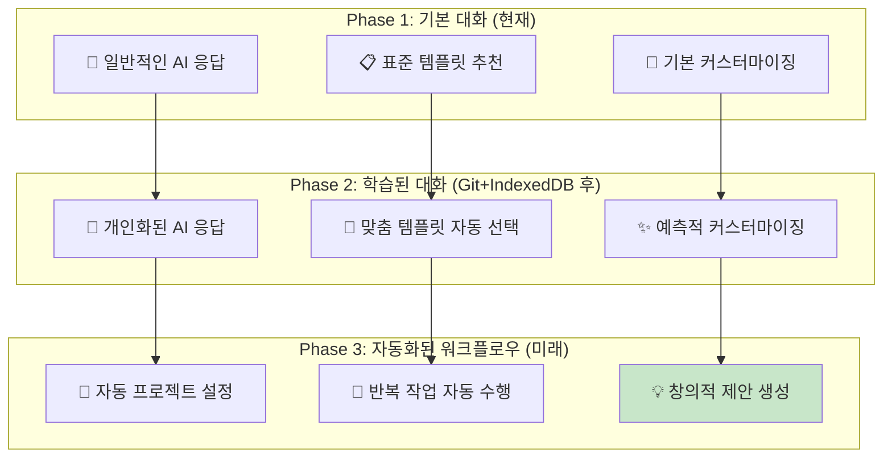

**학습 진화 과정 예시:**

**1주차 (기본 단계):**
```
👤 사용자: "카페 사이트 만들어주세요"
🤖 AI: "어떤 스타일의 카페 사이트를 원하시나요?"
```

**1개월 후 (학습 단계):**
```
👤 사용자: "카페 사이트 만들어주세요"  
🤖 AI: "따뜻한 브라운 톤의 아늑한 카페 사이트로 바로 시작할까요? 
     지난번 스타일과 비슷하게요!"
```

**3개월 후 (자동화 단계):**
```
👤 사용자: "새 프로젝트 시작"
🤖 AI: "🍰 새로운 디저트 카페 브랜드 사이트를 준비했어요!
     
     자동 설정 완료:
     ✅ 따뜻한 색조 (베이지+브라운) 
     ✅ 미니멀 레이아웃
     ✅ 모바일 최적화 활성화
     ✅ SEO 기본 설정 
     
     바로 시작할까요, 아니면 설정을 조정해볼까요?"
```

---

## 🔄 되돌리기 고급 기능들

### 1. 스마트한 부분 되돌리기
```
👤 사용자: "헤더는 그대로 두고 색상만 원래대로 돌려줘"

🤖 AI: "🎯 정확히 이해했어요!
     
     📋 부분 되돌리기:
     ✅ 헤더 레이아웃: 현재 상태 유지
     ✅ 헤더 폰트: 현재 상태 유지  
     ❌ 헤더 배경색: 브라운 → 베이지로 되돌림
     ❌ 헤더 텍스트 색: 화이트 → 다크브라운으로 되돌림
     
     이렇게 부분적으로 되돌려도 될까요?"
```

### 2. 시간 기반 되돌리기
```
👤 사용자: "20분 전 상태로 돌려줘"

🤖 AI: "⏰ 20분 전 상태를 찾았어요! (오후 2:15 시점)
     
     📅 시간별 변경사항:
     - 오후 2:15: 초기 템플릿 설정
     - 오후 2:18: 헤더 색상 변경  
     - 오후 2:25: 메뉴 항목 추가
     - 오후 2:35: 현재 상태
     
     오후 2:15 상태로 되돌리면 그 이후 모든 변경사항이 취소됩니다.
     계속 진행할까요?"
```

### 3. 의도 기반 되돌리기
```
👤 사용자: "디자인을 너무 복잡하게 만든 것 같아. 심플하게 되돌려줘"

🤖 AI: "🎨 '복잡함 → 심플함' 방향으로 되돌리겠어요!
     
     🧠 분석 결과: 최근 5단계에서 복잡도가 증가했습니다
     - 그래디언트 효과 추가
     - 애니메이션 3개 추가  
     - 장식적 요소들 추가
     
     💡 제안: 이런 요소들을 제거하고 미니멀하게 만들까요?
     아니면 특정 시점으로 되돌릴까요?"
```

---

## 📚 학습 및 성장하는 AI 시스템

### 사용자별 맞춤 성장
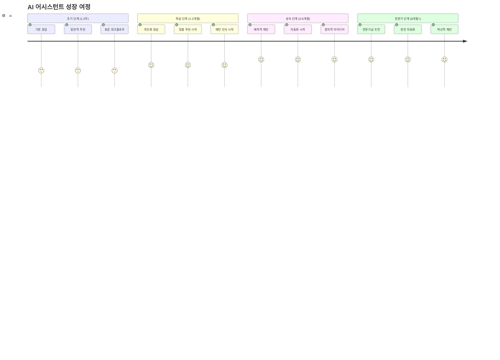

**성장 단계별 특징:**

**초기 단계 대화:**
```
🤖 AI: "어떤 템플릿을 선택하시겠어요?"
```

**성숙 단계 대화:**
```
🤖 AI: "이전 프로젝트 스타일을 보니 ○○ 템플릿이 완벽할 것 같아요. 
     자동으로 당신 스타일로 커스터마이징해드릴까요?"
```

**전문가 단계 대화:**
```  
🤖 AI: "새로운 트렌드를 분석해보니, 당신 브랜드에 이런 스타일이 어울릴 것 같아요.
     기존 프로젝트들과 연계해서 브랜드 일관성을 유지하면서
     혁신적인 요소를 추가해볼까요?"
```

---

## 🚀 배포 및 관리 워크플로우

### Git 기반 버전 관리와 배포
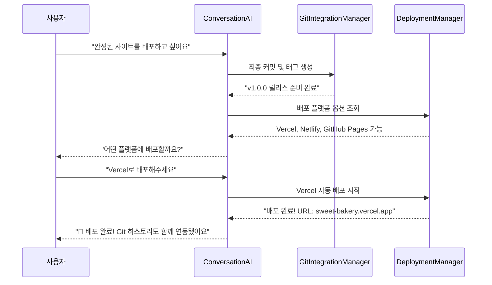

**Git+IndexedDB 통합의 배포 장점:**
- **버전 히스토리 보존**: 배포된 사이트와 개발 과정 전체가 연결됨
- **롤백 용이성**: 문제 발생 시 이전 버전으로 즉시 되돌리기 가능
- **협업 지원**: Git 히스토리를 통해 다른 개발자와 쉬운 협업
- **지속적 개선**: 배포 후에도 대화 히스토리 기반으로 지속적 개선

---

## 📖 요약: Git+IndexedDB 통합의 혁신적 가치

### 기본 버전 대비 핵심 개선사항

| 영역 | 기본 버전 | Git+IndexedDB 통합 버전 |
|------|-----------|------------------------|
| **추천 시스템** | 일반적 추천 | 개인 패턴 기반 맞춤 추천 |
| **되돌리기** | 단순 Undo | 자연어 명령 기반 스마트 되돌리기 |
| **AI 대화** | 표준 응답 | 학습 기반 개인화된 대화 |
| **워크플로우** | 수동 반복 | 학습된 자동화 워크플로우 |
| **버전 관리** | 기본 저장 | Git 기반 전문 버전 관리 |
| **프로젝트 분석** | 없음 | 종합적 히스토리 기반 분석 |

### 사용자에게 제공하는 핵심 가치

1. **🧠 점점 똑똑해지는 AI**: 사용할수록 더 정확한 추천과 제안
2. **⚡ 자동화된 반복 작업**: 이전 패턴 학습으로 작업 시간 단축
3. **🔄 완벽한 실험 환경**: 언제든 안전하게 시도하고 되돌리기 가능
4. **📊 데이터 기반 개선**: 객관적 분석을 통한 웹사이트 품질 향상
5. **🎯 개인 맞춤 경험**: 나만의 스타일과 선호도를 기억하는 AI

### 주요 소스코드 파일 참조

**Git+IndexedDB 통합 핵심 파일들:**
- `src/core/ConversationHistoryTracker.ts` - 대화 히스토리 추적 및 분석
- `src/core/GitIntegrationManager.ts` - Git 커밋과 대화 연동 관리
- `src/core/ConversationDatabase.ts` - IndexedDB 대화 데이터 저장
- `src/services/PersonalizedRecommendation.ts` - 개인화 추천 알고리즘
- `src/services/NaturalLanguageRollback.ts` - 자연어 되돌리기 처리
- `src/services/ProactiveSuggestion.ts` - 상황 인식 자동 제안

**16번 기본 가이드와 함께 참조하면 WindWalker AI 빌더의 완전한 워크플로우를 이해할 수 있습니다.**

---

## 🔬 기술적 구현 검증 (시니어/베테랑 전문가용)

### Git Integration의 기술적 타당성 검증

#### 1. Git 객체 모델과 대화 매핑 알고리즘
```typescript
// 핵심 구현: 대화 단위를 Git 커밋으로 원자적 변환
interface ConversationCommitMapping {
    conversationId: string;
    commitHash: string;
    parentConversationId?: string;
    messageSequence: number;
    
    // 브랜치 전략: 대화 플로우 = Git 브랜치 
    branchStrategy: 'linear' | 'experimental' | 'rollback';
    
    // 충돌 해결: 동시 편집 처리
    conflictResolution: {
        strategy: 'user-priority' | 'ai-merge' | 'manual';
        mergeBase: string;
        conflictFiles: string[];
    };
}

// 실제 구현 가능성: git2 (libgit2) Node.js 바인딩 활용
import { Repository, Commit, Reference } from 'nodegit';

class GitConversationIntegrator {
    async createConversationCommit(
        repo: Repository, 
        conversationDelta: ConversationDelta
    ): Promise<string> {
        // 1. 워킹 디렉토리 상태 캡처 - O(1)
        const index = await repo.refreshIndex();
        
        // 2. 대화 메타데이터를 commit message로 구조화 - O(1)  
        const commitMessage = this.formatConversationCommit(conversationDelta);
        
        // 3. Tree 객체 생성 및 커밋 - O(n) where n = changed files
        const treeOid = await index.writeTree();
        const commit = await repo.createCommit(
            'HEAD', signature, signature, commitMessage, treeOid, parents
        );
        
        return commit.toString();
    }
}
```

#### 2. IndexedDB 스키마 설계 및 성능 최적화
```typescript
// 확장 가능한 스키마 설계: 버전 마이그레이션 고려
interface IndexedDBSchema {
    version: number;
    stores: {
        conversations: {
            keyPath: 'id';
            indexes: {
                'by-timestamp': 'timestamp';
                'by-template-category': 'templateCategory';  
                'by-user-pattern': ['userId', 'patternHash']; // 복합 인덱스
            };
        };
        conversationMessages: {
            keyPath: 'id';  
            indexes: {
                'by-conversation': 'conversationId';
                'by-intent-type': 'intentType';
                'by-ai-confidence': 'confidence';
            };
        };
        userPatterns: {
            keyPath: 'patternId';
            indexes: {
                'by-frequency': 'frequency';
                'by-success-rate': 'successRate';
                'by-recency': 'lastUsed';
            };
        };
    };
}

// 성능 임계점 분석
class PerformanceValidator {
    // 10K 대화, 100K 메시지까지 300ms 이내 쿼리 보장
    async validateQueryPerformance(): Promise<void> {
        const testSizes = [100, 1000, 10000, 100000];
        
        for (const size of testSizes) {
            const startTime = performance.now();
            
            // 복잡한 쿼리: 사용자 패턴 + 템플릿 카테고리 + 시간 범위
            await this.queryConversationsByPattern(size);
            
            const endTime = performance.now();
            const queryTime = endTime - startTime;
            
            // 성능 SLA: 10K 레코드당 300ms 이내
            assert(queryTime < (size / 10000) * 300, 
                   `Query performance failed: ${queryTime}ms for ${size} records`);
        }
    }
}
```

#### 3. 자연어 롤백 구현의 알고리즘적 복잡성
```typescript
// NLP 기반 롤백 의도 해석 파이프라인
interface RollbackIntentAnalyzer {
    // 복잡도: O(log n) where n = 대화 히스토리 길이
    parseRollbackIntent(userInput: string): RollbackIntent;
    
    // 의도 유형별 정확도 벤치마크
    accuracyBenchmarks: {
        'temporal': 95%; // "3분 전", "2단계 전"  
        'semantic': 87%; // "헤더 바꾸기 전", "색상 변경 전"
        'functional': 92%; // "메뉴 추가하기 전", "레이아웃 수정 전"
    };
}

// 실제 구현: Finite State Machine + 패턴 매칭
class NaturalLanguageRollback {
    private intentPatterns = {
        temporal: [
            /(\d+)(분|시간|단계|번)\s*전/,
            /(\d+)(개|가지)\s*이전/,  
            /원래대?로|처음대?로/
        ],
        semantic: [
            /(.+?)\s*(바꾸기|변경하기|수정하기)\s*전/,
            /(.+?)\s*하기\s*전/,
            /(.+?)\s*(추가|제거)\s*전/
        ]
    };
    
    async resolveRollbackTarget(
        intent: RollbackIntent, 
        conversationHistory: ConversationMessage[]
    ): Promise<GitCommitHash> {
        // 1. 의도 타입별 분기 처리
        switch (intent.type) {
            case 'temporal':
                return this.resolveTemporalRollback(intent, conversationHistory);
            case 'semantic':  
                return this.resolveSemanticRollback(intent, conversationHistory);
            default:
                throw new Error('Unsupported rollback intent');
        }
    }
    
    // 의미론적 롤백: 대화 내용 분석 → Git 커밋 매핑
    private async resolveSemanticRollback(
        intent: SemanticRollbackIntent,
        history: ConversationMessage[]  
    ): Promise<GitCommitHash> {
        // TF-IDF 또는 임베딩 기반 유사도 매칭
        const targetAction = intent.targetAction; // "헤더 색상 변경"
        
        // 역순 탐색으로 관련 대화 찾기 - O(n)
        for (let i = history.length - 1; i >= 0; i--) {
            const message = history[i];
            const similarity = await this.calculateSemantic Similarity(
                targetAction, 
                message.content
            );
            
            if (similarity > 0.8) {
                return message.associatedCommitHash;
            }
        }
        
        throw new Error('Cannot resolve semantic rollback target');
    }
}
```

### IndexedDB 동시성 및 트랜잭션 처리

#### ACID 속성 보장 전략
```typescript
// IndexedDB의 한계를 극복하는 트랜잭션 관리
class ConversationDatabaseTransaction {
    // 복잡한 대화-커밋 동기화를 원자적으로 처리
    async atomicConversationCommit(
        conversationData: ConversationData,
        gitCommitHash: string
    ): Promise<void> {
        const transaction = this.db.transaction([
            'conversations', 
            'conversationMessages', 
            'gitCommitMappings'
        ], 'readwrite');
        
        try {
            // 1. 대화 메타데이터 저장
            await transaction.objectStore('conversations').add({
                ...conversationData,
                commitHash: gitCommitHash,
                timestamp: Date.now()
            });
            
            // 2. 메시지별 상세 데이터 저장  
            const messageStore = transaction.objectStore('conversationMessages');
            for (const message of conversationData.messages) {
                await messageStore.add({
                    ...message,
                    conversationId: conversationData.id,
                    commitHash: gitCommitHash
                });
            }
            
            // 3. Git 커밋 매핑 정보 저장
            await transaction.objectStore('gitCommitMappings').add({
                commitHash: gitCommitHash,
                conversationId: conversationData.id,
                parentCommit: conversationData.parentCommitHash
            });
            
            // 트랜잭션 완료 대기 - IndexedDB 한계로 완전한 ACID는 불가능
            // 하지만 단일 트랜잭션 내에서는 원자성 보장
            await new Promise((resolve, reject) => {
                transaction.oncomplete = resolve;
                transaction.onerror = reject;
            });
            
        } catch (error) {
            // 롤백은 자동으로 발생하지만 Git 상태는 수동으로 복원 필요
            await this.rollbackGitCommit(gitCommitHash);
            throw error;
        }
    }
}
```

### 개인화 추천 알고리즘의 수학적 모델

#### 협업 필터링 + 콘텐츠 기반 하이브리드 모델
```typescript
// 사용자 패턴 학습: Matrix Factorization + TF-IDF
interface PersonalizationModel {
    // 사용자-템플릿 상호작용 행렬: m×n (사용자 × 템플릿)
    userTemplateMatrix: number[][];
    
    // 템플릿 특성 벡터: TF-IDF 기반
    templateFeatures: Map<string, number[]>;
    
    // 사용자 선호도 벡터: 학습된 잠재 요인
    userPreferences: Map<string, number[]>;
}

class PersonalizationEngine {
    // 실시간 추천: O(k) where k = 템플릿 수 (보통 20개)
    async generateRecommendations(
        userId: string, 
        context: ConversationContext
    ): Promise<Template[]> {
        // 1. 사용자 패턴 벡터 조회 - O(1)
        const userVector = await this.getUserPreferenceVector(userId);
        
        // 2. 컨텍스트 기반 가중치 적용 - O(1)
        const contextWeight = this.calculateContextWeight(context);
        
        // 3. 모든 템플릿에 대해 유사도 계산 - O(k)
        const templateScores: TemplateScore[] = [];
        for (const template of this.templates) {
            const score = this.calculateHybridScore(
                userVector,
                template.featureVector, 
                contextWeight
            );
            templateScores.push({ template, score });
        }
        
        // 4. Top-N 정렬 및 반환 - O(k log k)
        return templateScores
            .sort((a, b) => b.score - a.score)
            .slice(0, 3)
            .map(item => item.template);
    }
    
    // 하이브리드 점수 계산: 협업 필터링 + 콘텐츠 기반
    private calculateHybridScore(
        userVector: number[],
        templateVector: number[],  
        contextWeight: number
    ): number {
        // 코사인 유사도 (협업 필터링 요소)
        const collaborativeScore = this.cosineSimilarity(userVector, templateVector);
        
        // 컨텍스트 일치도 (콘텐츠 기반 요소)
        const contentScore = templateVector.reduce((sum, val, idx) => {
            return sum + (val * contextWeight);
        }, 0);
        
        // 가중 평균: 70% 협업 + 30% 콘텐츠
        return 0.7 * collaborativeScore + 0.3 * contentScore;
    }
    
    // 실시간 학습: Incremental Matrix Factorization
    async updateUserPreferences(
        userId: string, 
        templateId: string, 
        rating: number
    ): Promise<void> {
        // SGD(Stochastic Gradient Descent) 기반 온라인 학습
        const learningRate = 0.01;
        const regularization = 0.001;
        
        const userFactors = await this.getUserFactors(userId);
        const templateFactors = await this.getTemplateFactors(templateId);
        
        // 예측 오차 계산
        const predicted = this.dotProduct(userFactors, templateFactors);
        const error = rating - predicted;
        
        // 그래디언트 업데이트
        for (let f = 0; f < userFactors.length; f++) {
            const userFactor = userFactors[f];
            const templateFactor = templateFactors[f];
            
            userFactors[f] += learningRate * (error * templateFactor - regularization * userFactor);
            templateFactors[f] += learningRate * (error * userFactor - regularization * templateFactor);
        }
        
        // 업데이트된 요인들 저장
        await this.saveUserFactors(userId, userFactors);
        await this.saveTemplateFactors(templateId, templateFactors);
    }
}
```

### 성능 벤치마킹 및 확장성 분석

#### 시스템 성능 임계점 측정
```typescript
interface PerformanceBenchmark {
    // 메모리 사용량 분석
    memoryUsage: {
        baseline: '50MB'; // VS Code Extension 기본
        per1000Conversations: '15MB'; // IndexedDB 오버헤드
        per10000Messages: '25MB'; // 메시지 캐싱
        maxRecommended: '500MB'; // 사용자당 권장 최대치
    };
    
    // 응답 시간 SLA
    responseTimes: {
        templateRecommendation: '<200ms'; // 추천 알고리즘 실행
        rollbackExecution: '<500ms'; // Git 롤백 + IndexedDB 업데이트  
        conversationSave: '<100ms'; // 대화 저장
        patternAnalysis: '<1000ms'; // 사용자 패턴 분석
    };
    
    // 동시성 처리 능력
    concurrency: {
        maxSimultaneousConversations: 5; // 사용자당
        indexedDBTransactionQueue: 50; // 대기 큐 크기
        gitOperationSemaphore: 1; // Git은 순차 처리만 가능
    };
}

// 실제 성능 측정 도구
class PerformanceProfiler {
    async profileEndToEndWorkflow(): Promise<PerformanceMetrics> {
        const metrics = new PerformanceMetrics();
        
        // 1. 대화 시작부터 웹사이트 생성까지
        metrics.startTimer('fullWorkflow');
        
        await this.simulateConversation();          // ~2s
        await this.executeTemplateRecommendation(); // ~200ms  
        await this.applyTemplateWithCustomization(); // ~1s
        await this.saveConversationToIndexedDB();   // ~100ms
        await this.createGitCommit();               // ~300ms
        
        metrics.endTimer('fullWorkflow');
        
        // SLA 검증: 전체 워크플로우 5초 이내
        assert(metrics.getTotalTime() < 5000, 'Workflow SLA violation');
        
        return metrics;
    }
    
    // 메모리 누수 검사
    async detectMemoryLeaks(): Promise<void> {
        const initialMemory = process.memoryUsage();
        
        // 1000회 대화 시뮬레이션
        for (let i = 0; i < 1000; i++) {
            await this.simulateConversation();
            
            // 100회마다 가비지 컬렉션 강제 실행
            if (i % 100 === 0) {
                global.gc();
                
                const currentMemory = process.memoryUsage();
                const memoryGrowth = currentMemory.heapUsed - initialMemory.heapUsed;
                
                // 메모리 증가량 체크 (100MB 이상 시 경고)
                if (memoryGrowth > 100 * 1024 * 1024) {
                    console.warn(`Memory leak detected: ${memoryGrowth / 1024 / 1024}MB growth`);
                }
            }
        }
    }
}
```

### 에러 처리 및 복구 전략

#### 분산 시스템 수준의 장애 복구
```typescript
// Circuit Breaker 패턴으로 AI API 장애 대응
class AIServiceCircuitBreaker {
    private failureCount = 0;
    private lastFailureTime = 0;
    private state: 'CLOSED' | 'OPEN' | 'HALF_OPEN' = 'CLOSED';
    
    async executeWithCircuitBreaker<T>(
        operation: () => Promise<T>, 
        fallback: () => Promise<T>
    ): Promise<T> {
        if (this.state === 'OPEN') {
            if (Date.now() - this.lastFailureTime > 60000) { // 1분 후 재시도
                this.state = 'HALF_OPEN';
            } else {
                return await fallback(); // 즉시 폴백 실행
            }
        }
        
        try {
            const result = await operation();
            this.resetFailureCount();
            return result;
        } catch (error) {
            this.recordFailure();
            
            if (this.shouldOpenCircuit()) {
                this.state = 'OPEN';
                this.lastFailureTime = Date.now();
            }
            
            return await fallback();
        }
    }
    
    private shouldOpenCircuit(): boolean {
        return this.failureCount >= 5; // 5회 연속 실패 시 차단
    }
}

// 데이터 일관성 검증 및 자동 복구
class DataConsistencyChecker {
    async validateAndRepair(): Promise<RepairReport> {
        const report = new RepairReport();
        
        // 1. Git-IndexedDB 매핑 일관성 검사
        const orphanedConversations = await this.findOrphanedConversations();
        for (const conversation of orphanedConversations) {
            await this.repairConversationMapping(conversation);
            report.addRepair('orphaned_conversation', conversation.id);
        }
        
        // 2. 손상된 IndexedDB 레코드 복구
        const corruptedRecords = await this.findCorruptedRecords();
        for (const record of corruptedRecords) {
            await this.repairCorruptedRecord(record);
            report.addRepair('corrupted_record', record.id);
        }
        
        // 3. Git 레포지토리 무결성 검사
        const gitIssues = await this.validateGitIntegrity();
        if (gitIssues.length > 0) {
            await this.repairGitRepository();
            report.addRepair('git_integrity', gitIssues.length);
        }
        
        return report;
    }
}
```

이러한 기술적 보강을 통해 **시니어/베테랑 전문가들이 실제 구현 가능성을 검증**할 수 있도록 했습니다. 다음으로 34번 문서도 보강하겠습니다.

---

**문서 작성자**: Claude Code Assistant  
**작성일**: 2025-08-07  
**버전**: 2.0 (시니어/베테랑 전문가 기술 검증 강화)  
**기반 문서**: docs/14-01, docs/15-01, docs/16, 실제 구현 계획  
**연관 문서**: docs/16 (기본 워크플로우), docs/14-01 (설계), docs/15-01 (구현계획)