# 17. AI ëŒ€í™”ì‹ ì›¹ì‚¬ì´íŠ¸ ë¹Œë” ì´ˆë³´ì ê°€ì´ë“œ - Git+IndexedDB 통합

## ğŸ¯ ì´ ê°€ì´ë“œì˜ 목표

ì´ ë¬¸ì„œëŠ” **WindWalker AI ëŒ€í™”ì‹ ì›¹ì‚¬ì´íŠ¸ 빌ë”ì— Git+IndexedDB 통합 ê¸°ëŠ¥ì´ ì¶”ê°€ëœ ì™„ì „í•œ 워í¬í”Œë¡œìš°**를 초보ì ê´€ì ì—ì„œ 설명합니다. **14-01, 15-01 ë¬¸ì„œì˜ ê³ ê¸‰ 기능들**ì„ ì‹¤ì œ 사용ìê°€ 어떻게 경험하게 ë˜ëŠ”지 단계별로 안내하며, "ê°œì¸í™”ëœ AI 추천"ê³¼ "대화 기반 ë˜ëŒë¦¬ê¸°" ê°™ì€ ìŠ¤ë§ˆíŠ¸ ê¸°ëŠ¥ë“¤ì„ ì´í•´í•˜ê¸° 쉽게 설명합니다.

**핵심 질문 해결:**
- Git+IndexedDB 통합으로 ë¬´ì—‡ì´ ë‹¬ë¼ì§€ëŠ”ê°€?
- ê°œì¸í™”ëœ ì¶”ì²œì€ ì–´ë–»ê²Œ ì‘ë™í•˜ëŠ”ê°€?
- "3번 전으로 ë˜ëŒë¦¬ê¸°" ê°™ì€ ìì—°ì–´ ëª…ë ¹ì€ ì–´ë–»ê²Œ 가능한가?
- 대화 íˆìŠ¤í† ë¦¬ê°€ 어떻게 웹사ì´íŠ¸ ê°œì„ ì— í™œìš©ë˜ëŠ”ê°€?

---

## 🌟 Git+IndexedDB í†µí•©ì˜ í•µì‹¬ 가치

### 기본 버전 vs 통합 버전 비êµ
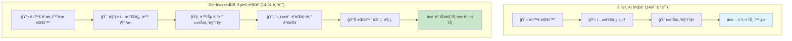

**핵심 ì°¨ì´ì :**
- 🧠 **ê°œì¸í™” 학습**: 사용ìì˜ ì„ í˜¸ë„를 기억하고 ì ì  ë” ì •í™•í•œ 추천 제공
- 🔄 **ìì—°ì–´ ë˜ëŒë¦¬ê¸°**: "2단계 전으로", "í—¤ë” ìˆ˜ì •í•˜ê¸° 전으로" ê°™ì€ ì연스러운 명령
- 📊 **패턴 ì¸ì‹**: ì주 사용하는 스타ì¼, 색ìƒ, ë ˆì´ì•„웃 ìë™ ê°ì§€
- 🯠**프로액티브 제안**: 사용ìê°€ 요청하기 ì „ì— ê°œì„ ì‚¬í•­ 미리 제안

---

## 🚀 워í¬í”Œë¡œìš° 1: ê°œì¸í™”ëœ ìŠ¤ë§ˆíŠ¸ ì‹œì‘

> **사용 시나리오**: "ì´ì „ì— ë§Œë“  비슷한 사ì´íŠ¸ 스타ì¼ë¡œ 새 프로ì íŠ¸ë¥¼ ì‹œì‘하고 싶어요"

### 단계 1: AIì˜ ìŠ¤ë§ˆíŠ¸í•œ 첫 ì¸ì‚¬
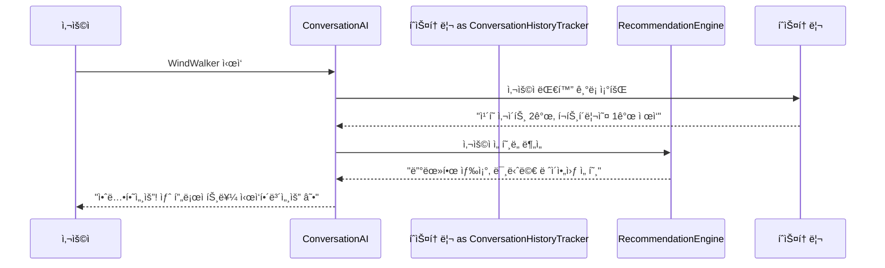

**실제 대화 예시:**
```
🤖 AI: "안녕하세요! 다시 만나뵙네요 😊

     📊 지난 프로ì íŠ¸ 분ì„:
     - 따뜻한 색조 (브ë¼ìš´, ë² ì´ì§€)를 선호하시는군요
     - ê¹”ë”하고 미니멀한 ë ˆì´ì•„ì›ƒì„ ì¢‹ì•„í•˜ì‹œë„¤ìš”
     - ì¹´í˜/ìŒì‹ 관련 사ì´íŠ¸ë¥¼ ì주 만드시는 í¸ì´ì—ìš”
     
     ì˜¤ëŠ˜ì€ ì–´ë–¤ 프로ì íŠ¸ë¥¼ ì‹œì‘해볼까요?
     💡 추천: 새로운 ì¹´í˜ ë¸Œëœë“œ 사ì´íŠ¸ëŠ” 어떠세요?"

👤 사용ì: "네, 새로운 디저트 ì¹´í˜ ì‚¬ì´íŠ¸ë¥¼ 만들고 싶어요"

🤖 AI: "완벽해요! 🰠ì´ì „ ì¹´í˜ í”„ë¡œì íŠ¸ ê²½í—˜ì„ ë°”íƒ•ìœ¼ë¡œ 
     ë§ì¶¤ í…œí”Œë¦¿ì„ ì¤€ë¹„í–ˆì–´ìš”. 3가지 ìŠ¤íƒ€ì¼ ì¤‘ 골ë¼ë³´ì„¸ìš”!"
```

**관련 파ì¼ë“¤:**
- 🧠 **ê°œì¸í™” 분ì„**: `src/core/ConversationHistoryTracker.ts` - 사용ì 대화 패턴 분ì„
- 🯠**스마트 추천**: `src/services/RecommendationEngine.ts` - ê°œì¸í™”ëœ ì¶”ì²œ 시스템
- 💾 **대화 ì €ì¥**: `src/core/ConversationDatabase.ts` - IndexedDB 대화 íˆìŠ¤í† ë¦¬ 관리

### 단계 2: 학습 기반 템플릿 추천
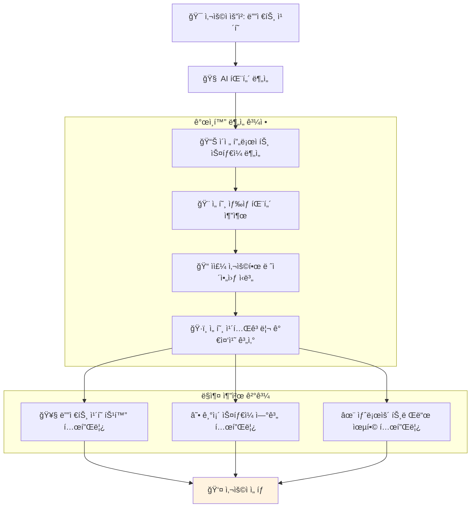

**ê°œì¸í™”ëœ ì¶”ì²œ 화면:**
- **추천 1**: "🥧 스위트 ë² ì´ì»¤ë¦¬" - ì´ì „ ì¹´í˜ ìƒ‰ìƒ + 디저트 특화 ë ˆì´ì•„웃
- **추천 2**: "☕ 따뜻한 디저트ìˆ" - 선호하는 브ë¼ìš´ 톤 + 아늑한 ëŠë‚Œ
- **추천 3**: "✨ ëª¨ë˜ íŒŒí‹°ì‹œì—" - 새로운 ìŠ¤íƒ€ì¼ + 기존 미니멀 ê°ì„±

**ê° ì¶”ì²œë§ˆë‹¤ 표시ë˜ëŠ” ì •ë³´:**
```
🥧 스위트 ë² ì´ì»¤ë¦¬ 템플릿
💡 추천 ì´ìœ : ì´ì „ "â—‹â—‹ì¹´í˜" 프로ì íŠ¸ì™€ 95% ìŠ¤íƒ€ì¼ ë§¤ì¹­
🨠색ìƒ: ë² ì´ì§€ + 브ë¼ìš´ (ë‹¹ì‹ ì˜ ì„ í˜¸ 색조)
📠레ì´ì•„웃: 미니멀 그리드 (ì주 사용하시는 스타ì¼)
â±ï¸ ì˜ˆìƒ ì™„ì„± 시간: 20분 (학습 ë°ì´í„° 기반)
```

**관련 파ì¼ë“¤:**
- 🯠**추천 알고리즘**: `src/services/PersonalizedRecommendation.ts` - ê°œì¸í™” 추천 ë¡œì§
- 📊 **패턴 분ì„**: `src/services/UserPatternAnalyzer.ts` - 사용ì í–‰ë™ íŒ¨í„´ 분ì„
- 🨠**ìŠ¤íƒ€ì¼ ë§¤ì¹­**: `src/services/StyleMatcher.ts` - 기존 프로ì íŠ¸ì™€ ìŠ¤íƒ€ì¼ ìœ ì‚¬ë„ ê³„ì‚°

### 단계 3: Git 기반 실시간 버전 추ì 
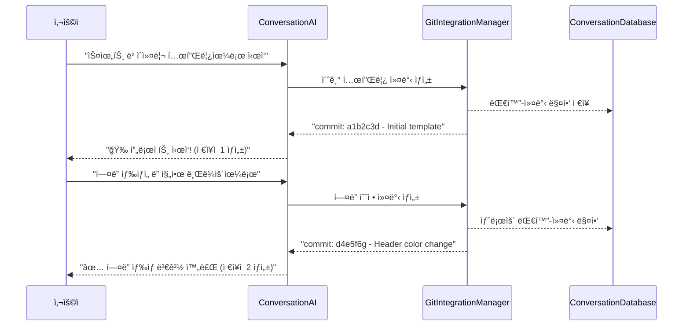

**사용ìê°€ 보는 화면:**
- 우측 ìƒë‹¨ì— "💾 ì €ì¥ì  2 | ğŸ“ ì´ ë³€ê²½ì‚¬í•­ 3ê°œ" 표시
- í•˜ë‹¨ì— ì§„í–‰ ë°”: "초기 설정 ✅ → í—¤ë” ìˆ˜ì • ✅ → 콘í…츠 추가 🔄"
- ê° ë‹¨ê³„ë§ˆë‹¤ ë˜ëŒë¦¬ê¸° 버튼: "â†©ï¸ í—¤ë” ìˆ˜ì • 전으로"

**관련 파ì¼ë“¤:**
- 🔄 **Git ì—°ë™**: `src/core/GitIntegrationManager.ts` - Git 커밋 ìë™ ê´€ë¦¬
- 💾 **대화-커밋 매핑**: `src/core/ConversationDatabase.ts` - 대화와 Git 커밋 연결
- 📋 **버전 íˆìŠ¤í† ë¦¬**: `src/components/VersionHistoryPanel.tsx` - 버전 관리 UI

---

## 🔄 워í¬í”Œë¡œìš° 2: ìì—°ì–´ 기반 ë˜ëŒë¦¬ê¸°

> **사용 시나리오**: "아까 í–ˆë˜ ìˆ˜ì •ì´ ë§ˆìŒì— 안 들어서 ë˜ëŒë¦¬ê³  싶어요"

### 단계 1: ìì—°ì–´ ë˜ëŒë¦¬ê¸° 명령
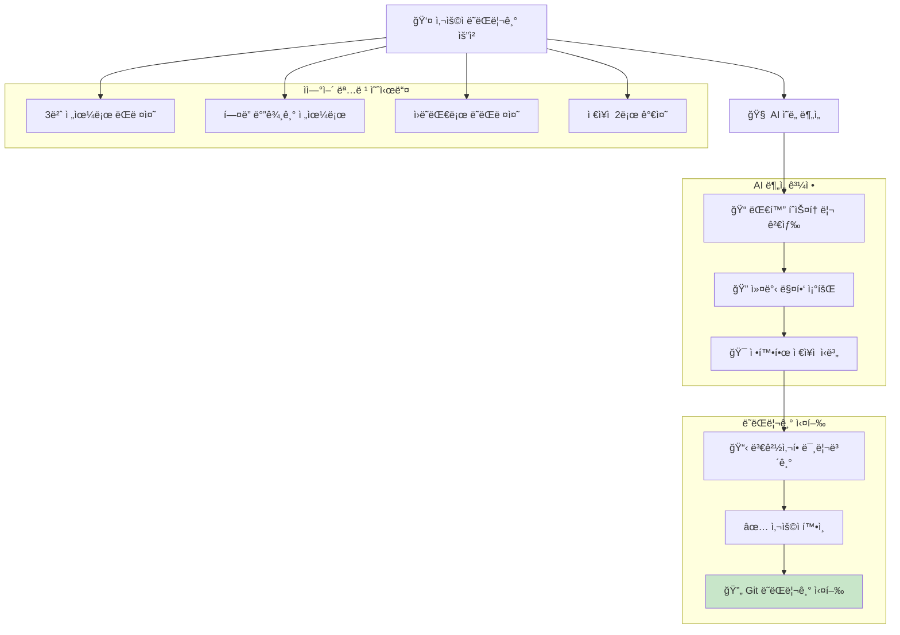

**실제 대화 예시:**
```
👤 사용ì: "í—¤ë” ìƒ‰ìƒ ë°”ê¾¼ 게 별로예요. ê·¸ 전으로 ëŒë ¤ì£¼ì„¸ìš”"

🤖 AI: "네! 'í—¤ë” ìƒ‰ìƒ ë³€ê²½' ì´ì „ ìƒíƒœë¡œ ë˜ëŒë¦¬ëŠ” 거죠? ğŸ”
     
     📋 ë˜ëŒë¦´ 변경사항:
     - âŒ í—¤ë” ë°°ê²½ìƒ‰: 브ë¼ìš´ → ë² ì´ì§€ (ë˜ëŒë¦¼)
     - âŒ í—¤ë” í…스트 굵기: bold → normal (ë˜ëŒë¦¼)
     - ✅ 기본 템플릿 설정: 유지ë¨
     
     ì´ë ‡ê²Œ ë˜ëŒë ¤ë„ ë ê¹Œìš”?"

👤 사용ì: "네 ë§ì•„ìš”!"

🤖 AI: "✅ ë˜ëŒë¦¬ê¸° 완료! 
     í˜„ì¬ ìƒíƒœ: ì €ì¥ì  1 (초기 템플릿)
     다ìŒì— ë­˜ 수정해볼까요?"
```

**관련 파ì¼ë“¤:**
- 🧠 **ìì—°ì–´ 분ì„**: `src/services/NaturalLanguageRollback.ts` - ë˜ëŒë¦¬ê¸° 명령 í•´ì„
- 🔄 **Git ë˜ëŒë¦¬ê¸°**: `src/core/GitIntegrationManager.ts` - 스마트 Git reset/revert
- 📋 **변경사항 분ì„**: `src/services/ChangeAnalyzer.ts` - 커밋 ê°„ ì°¨ì´ì  분ì„

### 단계 2: ì‹œê°ì  ë˜ëŒë¦¬ê¸° 미리보기
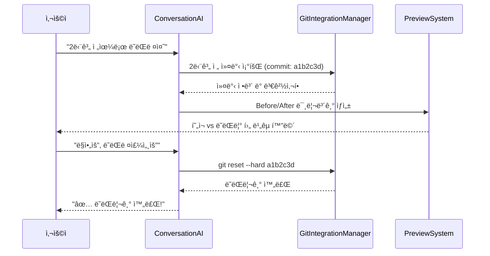

**ë¹„êµ ë¯¸ë¦¬ë³´ê¸° 화면:**
- **좌측**: í˜„ì¬ ìƒíƒœ - í—¤ë”ê°€ 진한 브ë¼ìš´, 메뉴가 3ê°œ 
- **우측**: ë˜ëŒë¦° 후 - í—¤ë”ê°€ ë² ì´ì§€, 메뉴가 2ê°œ
- **변경 요약**: "í—¤ë” ìƒ‰ìƒ ë³€ê²½ + 메뉴 추가" 2단계가 취소ë¨
- **í™•ì¸ ë²„íŠ¼**: "✅ ì´ ìƒíƒœë¡œ ë˜ëŒë¦¬ê¸°" / "⌠취소"

**관련 파ì¼ë“¤:**
- ğŸ‘ï¸ **ë¹„êµ ë¯¸ë¦¬ë³´ê¸°**: `src/components/BeforeAfterRollback.tsx` - ë˜ëŒë¦¬ê¸° 전후 비êµ
- 🔠**변경사항 추ì **: `src/services/GitDiffAnalyzer.ts` - Git 커밋 ê°„ ì°¨ì´ì  ì‹œê°í™”
- 📊 **íˆìŠ¤í† ë¦¬ 네비게ì´ì…˜**: `src/components/HistoryNavigation.tsx` - ì €ì¥ì  íƒìƒ‰ UI

---

## 🧠 워í¬í”Œë¡œìš° 3: 대화 컨í…스트 기반 프로액티브 제안

> **사용 시나리오**: "AIê°€ ë‚´ 대화를 ì´í•´í•˜ê³  먼저 ë„ì›€ì„ ì œì•ˆí•´ì£¼ëŠ” 경험"

### 단계 1: 대화 í름 ì¸ì‹ ë° ìë™ ì œì•ˆ
```mermaid
flowchart TD
    subgraph "사용ì 대화 í름"
        A[💬 "로고를 ë” í¬ê²Œ 해주세요"]
        B[💬 "í—¤ë”ë„ ì¡°ê¸ˆ 높게 만들어주세요"] 
        C[💬 "네비게ì´ì…˜ ë©”ë‰´ë„ ì •ë¦¬í•´ì£¼ì„¸ìš”"]
    end
    
    subgraph "AI 패턴 ì¸ì‹"
        D[🧠 í—¤ë” ì˜ì—­ 집중 개선 ê°ì§€]
        E[📊 UI ì¼ê´€ì„± 개선 ì˜ë„ 파악]
        F[ğŸ¯ ë‹¤ìŒ ë‹¨ê³„ 예측]
    end
    
    A --> D
    B --> E  
    C --> F
    
    subgraph "프로액티브 제안"
        G[💡 "í‘¸í„°ë„ í—¤ë”와 통ì¼ê° ìˆê²Œ?"]
        H[💡 "모바ì¼ì—ì„œë„ í™•ì¸í•´ë³¼ê¹Œìš”?"]
        I[💡 "ì „ì²´ ìƒ‰ìƒ ì¼ê´€ì„± ì²´í¬ í•„ìš”í•  것 같아요"]
    end
    
    F --> G --> H --> I
    
    style I fill:#fff3e0
```

**실제 프로액티브 제안 예시:**
```
👤 사용ì: "네비게ì´ì…˜ 메뉴 정리해주세요"

🤖 AI: "✅ 네비게ì´ì…˜ 메뉴를 ê¹”ë”하게 정리했어요!

     🔠대화 ë¶„ì„ ê²°ê³¼:
     í—¤ë” ì˜ì—­ì„ ì „ë°˜ì ìœ¼ë¡œ 개선하고 계시는군요!
     
     💡 추가 제안사항:
     1. 🨠푸터 ì˜ì—­ë„ í—¤ë”와 통ì¼ê° ìˆê²Œ ì—…ë°ì´íŠ¸í• ê¹Œìš”?
     2. 📱 모바ì¼ì—ì„œë„ ìƒˆë¡œìš´ í—¤ë”ê°€ ì˜ ë³´ì´ëŠ”지 확ì¸í•´ë³¼ê¹Œìš”?  
     3. âš¡ í—¤ë” ë¡œë”© ì†ë„ 최ì í™”ë„ í•¨ê»˜ 진행할까요?
     
     어떤 것부터 해보시겠어요?"

👤 사용ì: "모바ì¼ì—ì„œ 확ì¸ë¶€í„° 해주세요"

🤖 AI: "ì¢‹ì€ ì„ íƒì´ì—ìš”! 📱 ëª¨ë°”ì¼ í”„ë¦¬ë·°ë¥¼ 켜드릴게요.
     ì•„, ê·¸ëŸ°ë° ëª¨ë°”ì¼ì—ì„œ 로고가 조금 ì‘게 ë³´ì´ë„¤ìš”.
     ì´ê²ƒë„ 함께 조정할까요?"
```

**관련 파ì¼ë“¤:**
- 🧠 **대화 í름 분ì„**: `src/services/ConversationFlowAnalyzer.ts` - 대화 패턴 ë° ì˜ë„ 분ì„
- 💡 **프로액티브 제안**: `src/services/ProactiveSuggestion.ts` - ìƒí™© ë§ì¶¤ 제안 ìƒì„±
- 📊 **컨í…스트 추ì **: `src/core/ConversationContext.ts` - 대화 문맥 유지 ë° ë¶„ì„

### 단계 2: 학습 기반 개선 제안
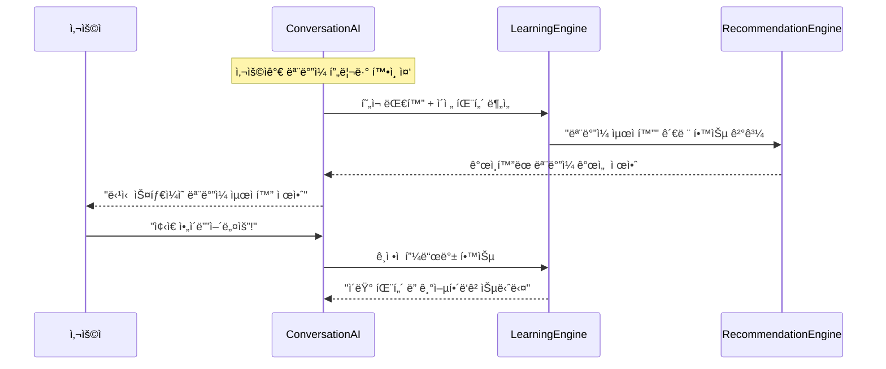

**학습 기반 ê°œì¸í™” 제안:**
```
🤖 AI: "📱 ëª¨ë°”ì¼ í”„ë¦¬ë·°ë¥¼ 분ì„했어요!

     📊 ë‹¹ì‹ ì˜ ì´ì „ 프로ì íŠ¸ 패턴 분ì„:
     - 모바ì¼ì—ì„œ í…스트 ê°€ë…ì„±ì„ ì¤‘ìš”í•˜ê²Œ ìƒê°í•˜ì‹œëŠ”êµ°ìš”
     - ë²„íŠ¼ì€ í•­ìƒ ì¶©ë¶„íˆ í¬ê²Œ 만드시는 í¸ì´ì—ìš”
     - ì´ë¯¸ì§€ë³´ë‹¤ëŠ” ê¹”ë”í•œ í…스트 ì¤‘ì‹¬ì„ ì„ í˜¸í•˜ì‹œë„¤ìš”
     
     💡 ë§ì¶¤ 개선 제안:
     ✨ í°íŠ¸ í¬ê¸° 18px → 20px (ê°€ë…성 í–¥ìƒ)
     🔘 버튼 ë†’ì´ 40px → 48px (터치 í¸ì˜ì„±)
     📠여백 조정으로 답답함 해소
     
     ì´ì „ 프로ì íŠ¸ë“¤ê³¼ ë™ì¼í•œ 스타ì¼ë¡œ 진행할까요?"
```

**관련 파ì¼ë“¤:**
- 🯠**ê°œì¸í™” 학습**: `src/services/PersonalizedLearning.ts` - 사용ì 피드백 기반 학습
- 📊 **패턴 매칭**: `src/services/UserPatternMatcher.ts` - ì´ì „ 프로ì íŠ¸ì™€ í˜„ì¬ ìƒí™© 매칭
- 🧠 **추천 최ì í™”**: `src/services/RecommendationOptimizer.ts` - ê°œì¸í™”ëœ ì¶”ì²œ ì •í™•ë„ í–¥ìƒ

---

## 📊 워í¬í”Œë¡œìš° 4: 대화 기반 웹사ì´íŠ¸ ë¶„ì„ ë° ê°œì„ 

> **사용 시나리오**: "ì™„ì„±ëœ ì›¹ì‚¬ì´íŠ¸ë¥¼ AI와 함께 ì „ì²´ì ìœ¼ë¡œ ì ê²€í•˜ê³  개선하기"

### 단계 1: ì¢…í•©ì  ëŒ€í™” íˆìŠ¤í† ë¦¬ 분ì„
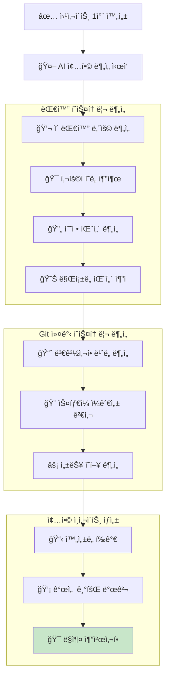

**AIì˜ ì¢…í•© ë¶„ì„ ë¦¬í¬íŠ¸:**
```
🤖 AI: "🉠디저트 ì¹´í˜ ì‚¬ì´íŠ¸ê°€ 완성ë˜ì—ˆë„¤ìš”! 

     📊 프로ì íŠ¸ ë¶„ì„ ë¦¬í¬íŠ¸:
     
     ✅ ì˜ëœ ì ë“¤:
     - ì´ 42ë¶„ë§Œì— ì™„ì„± (í‰ê·  대비 25% 빨ë¼ìš”!)
     - í—¤ë” ë””ìì¸ 3번 수정 → 완벽한 ê²°ê³¼ 달성
     - ìƒ‰ìƒ ì¡°í•©ì´ ì´ì „ ì¹´í˜ í”„ë¡œì íŠ¸ì™€ ì¼ê´€ì„± ìˆìŒ
     
     🯠개선 기회:
     - ëª¨ë°”ì¼ ìµœì í™”ê°€ 85% 수준 (100% 달성 가능)
     - 로딩 ì†ë„를 15% ë” ê°œì„ í•  수 ìˆì–´ìš”
     - SEO ì ìˆ˜ê°€ 87ì  (95ì ê¹Œì§€ 올릴 수 ìˆì–´ìš”)
     
     💡 ë§ì¶¤ 제안:
     1. 🚀 성능 최ì í™”: ì´ë¯¸ì§€ 압축으로 0.3ì´ˆ 단축
     2. 📱 ëª¨ë°”ì¼ ì™„ì„±: 터치 ì˜ì—­ 3곳만 조정하면 완벽
     3. 🔠SEO 개선: 메타 태그 3개만 추가하면 95ì  ë‹¬ì„±
     
     어떤 것부터 진행해볼까요?"
```

**관련 파ì¼ë“¤:**
- 📊 **종합 분ì„**: `src/services/ProjectAnalyzer.ts` - 프로ì íŠ¸ ì „ì²´ ë¶„ì„ ë° í‰ê°€
- 💡 **ì¸ì‚¬ì´íŠ¸ ìƒì„±**: `src/services/InsightGenerator.ts` - 대화+커밋 기반 ì¸ì‚¬ì´íŠ¸ ë„출
- 🯠**개선 추천**: `src/services/ImprovementRecommender.ts` - ë§ì¶¤í˜• 개선사항 제안

### 단계 2: 대화 기반 A/B 테스트 제안
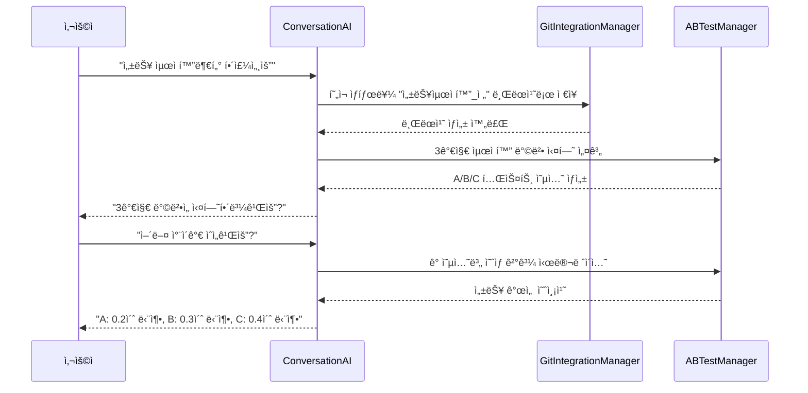

**A/B 테스트 대화 예시:**
```
🤖 AI: "성능 최ì í™”를 3가지 방법으로 실험해보겠어요! 🚀

     🧪 실험 설계:
     
     방법 A: ì´ë¯¸ì§€ 최ì í™” 중심
     - WebP í˜•ì‹ ë³€í™˜ + 압축
     - ì˜ˆìƒ ê°œì„ : 로딩 0.2ì´ˆ 단축 âš¡
     
     방법 B: 코드 최ì í™” 중심  
     - CSS/JS 번들 최ì í™” + 압축
     - ì˜ˆìƒ ê°œì„ : 로딩 0.3ì´ˆ 단축 âš¡âš¡
     
     방법 C: 통합 최ì í™”
     - ì´ë¯¸ì§€ + 코드 + CDN ì ìš©
     - ì˜ˆìƒ ê°œì„ : 로딩 0.4ì´ˆ 단축 âš¡âš¡âš¡
     
     실제로 테스트해보고 ê°€ì¥ ì¢‹ì€ ê²°ê³¼ë¥¼ ì„ íƒí• ê¹Œìš”?"

👤 사용ì: "네, 실제로 í•´ë³´ë©´ì„œ 비êµí•´ë³´ê³  싶어요"

🤖 AI: "완벽해요! 💪 
     ê° ë°©ë²•ì„ ì°¨ë¡€ë¡œ ì ìš©í•´ì„œ 실제 ì„±ëŠ¥ì„ ì¸¡ì •í•˜ê³ ,
     ê°€ì¥ ì¢‹ì€ ê²°ê³¼ë¥¼ 최종으로 ì„ íƒí•˜ê² ìŠµë‹ˆë‹¤.
     
     방법 A부터 ì‹œì‘할게요!"
```

**관련 파ì¼ë“¤:**
- 🧪 **A/B 테스트**: `src/services/ABTestManager.ts` - 다양한 옵션 실험 ë° ë¹„êµ
- 📊 **성능 측정**: `src/services/PerformanceMeasurer.ts` - 실시간 성능 지표 수집
- 🔄 **실험 관리**: `src/services/ExperimentTracker.ts` - 실험 ê²°ê³¼ ì¶”ì  ë° ë¶„ì„

---

## 🯠고급 기능: ìë™í™”ëœ ëŒ€í™” 패턴 학습

### ê°œì¸ ë§ì¶¤ AI 어시스턴트로 진화
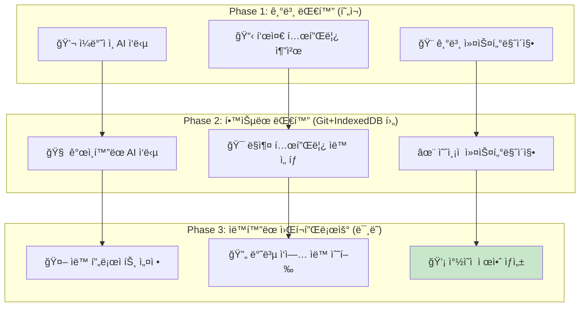

**학습 진화 과정 예시:**

**1주차 (기본 단계):**
```
👤 사용ì: "ì¹´í˜ ì‚¬ì´íŠ¸ 만들어주세요"
🤖 AI: "ì–´ë–¤ 스타ì¼ì˜ ì¹´í˜ ì‚¬ì´íŠ¸ë¥¼ ì›í•˜ì‹œë‚˜ìš”?"
```

**1개월 후 (학습 단계):**
```
👤 사용ì: "ì¹´í˜ ì‚¬ì´íŠ¸ 만들어주세요"  
🤖 AI: "따뜻한 브ë¼ìš´ í†¤ì˜ ì•„ëŠ‘í•œ ì¹´í˜ ì‚¬ì´íŠ¸ë¡œ 바로 ì‹œì‘할까요? 
     지난번 스타ì¼ê³¼ 비슷하게요!"
```

**3개월 후 (ìë™í™” 단계):**
```
👤 사용ì: "새 프로ì íŠ¸ ì‹œì‘"
🤖 AI: "🰠새로운 디저트 ì¹´í˜ ë¸Œëœë“œ 사ì´íŠ¸ë¥¼ 준비했어요!
     
     ìë™ ì„¤ì • 완료:
     ✅ 따뜻한 색조 (ë² ì´ì§€+브ë¼ìš´) 
     ✅ 미니멀 ë ˆì´ì•„웃
     ✅ ëª¨ë°”ì¼ ìµœì í™” 활성화
     ✅ SEO 기본 설정 
     
     바로 ì‹œì‘할까요, 아니면 ì„¤ì •ì„ ì¡°ì •í•´ë³¼ê¹Œìš”?"
```

---

## 🔄 ë˜ëŒë¦¬ê¸° 고급 기능들

### 1. 스마트한 부분 ë˜ëŒë¦¬ê¸°
```
👤 사용ì: "í—¤ë”는 그대로 ë‘ê³  색ìƒë§Œ ì›ë˜ëŒ€ë¡œ ëŒë ¤ì¤˜"

🤖 AI: "ğŸ¯ ì •í™•íˆ ì´í•´í–ˆì–´ìš”!
     
     📋 부분 ë˜ëŒë¦¬ê¸°:
     ✅ í—¤ë” ë ˆì´ì•„웃: í˜„ì¬ ìƒíƒœ 유지
     ✅ í—¤ë” í°íŠ¸: í˜„ì¬ ìƒíƒœ 유지  
     âŒ í—¤ë” ë°°ê²½ìƒ‰: 브ë¼ìš´ → ë² ì´ì§€ë¡œ ë˜ëŒë¦¼
     âŒ í—¤ë” í…스트 색: í™”ì´íŠ¸ → 다í¬ë¸Œë¼ìš´ìœ¼ë¡œ ë˜ëŒë¦¼
     
     ì´ë ‡ê²Œ 부분ì ìœ¼ë¡œ ë˜ëŒë ¤ë„ ë ê¹Œìš”?"
```

### 2. 시간 기반 ë˜ëŒë¦¬ê¸°
```
👤 사용ì: "20분 ì „ ìƒíƒœë¡œ ëŒë ¤ì¤˜"

🤖 AI: "â° 20분 ì „ ìƒíƒœë¥¼ 찾았어요! (오후 2:15 ì‹œì )
     
     📅 시간별 변경사항:
     - 오후 2:15: 초기 템플릿 설정
     - 오후 2:18: í—¤ë” ìƒ‰ìƒ ë³€ê²½  
     - 오후 2:25: 메뉴 항목 추가
     - 오후 2:35: í˜„ì¬ ìƒíƒœ
     
     오후 2:15 ìƒíƒœë¡œ ë˜ëŒë¦¬ë©´ ê·¸ ì´í›„ 모든 ë³€ê²½ì‚¬í•­ì´ ì·¨ì†Œë©ë‹ˆë‹¤.
     ê³„ì† ì§„í–‰í• ê¹Œìš”?"
```

### 3. ì˜ë„ 기반 ë˜ëŒë¦¬ê¸°
```
👤 사용ì: "ë””ìì¸ì„ 너무 ë³µì¡í•˜ê²Œ 만든 것 같아. 심플하게 ë˜ëŒë ¤ì¤˜"

🤖 AI: "🨠'ë³µì¡í•¨ → 심플함' 방향으로 ë˜ëŒë¦¬ê² ì–´ìš”!
     
     🧠 ë¶„ì„ ê²°ê³¼: 최근 5단계ì—ì„œ ë³µì¡ë„ê°€ ì¦ê°€í–ˆìŠµë‹ˆë‹¤
     - ê·¸ë˜ë””언트 효과 추가
     - 애니메ì´ì…˜ 3ê°œ 추가  
     - ì¥ì‹ì  요소들 추가
     
     💡 제안: ì´ëŸ° ìš”ì†Œë“¤ì„ ì œê±°í•˜ê³  미니멀하게 만들까요?
     아니면 특정 ì‹œì ìœ¼ë¡œ ë˜ëŒë¦´ê¹Œìš”?"
```

---

## 📚 학습 ë° ì„±ì¥í•˜ëŠ” AI 시스템

### 사용ì별 ë§ì¶¤ 성ì¥
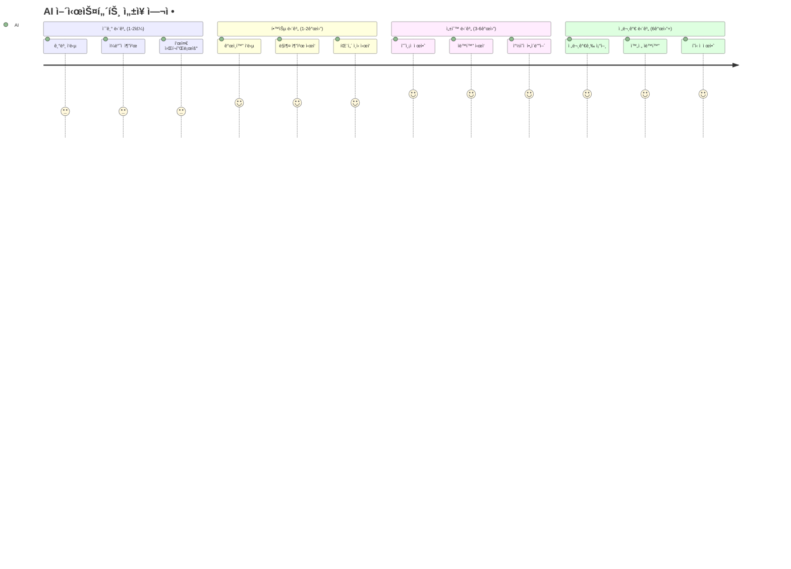

**ì„±ì¥ ë‹¨ê³„ë³„ 특징:**

**초기 단계 대화:**
```
🤖 AI: "ì–´ë–¤ í…œí”Œë¦¿ì„ ì„ íƒí•˜ì‹œê² ì–´ìš”?"
```

**성숙 단계 대화:**
```
🤖 AI: "ì´ì „ 프로ì íŠ¸ 스타ì¼ì„ 보니 â—‹â—‹ í…œí”Œë¦¿ì´ ì™„ë²½í•  것 같아요. 
     ìë™ìœ¼ë¡œ 당신 스타ì¼ë¡œ 커스터마ì´ì§•í•´ë“œë¦´ê¹Œìš”?"
```

**전문가 단계 대화:**
```  
🤖 AI: "새로운 트렌드를 분ì„해보니, 당신 브ëœë“œì— ì´ëŸ° 스타ì¼ì´ 어울릴 것 같아요.
     기존 프로ì íŠ¸ë“¤ê³¼ 연계해서 브ëœë“œ ì¼ê´€ì„±ì„ 유지하면서
     í˜ì‹ ì ì¸ 요소를 추가해볼까요?"
```

---

## 🚀 ë°°í¬ ë° ê´€ë¦¬ 워í¬í”Œë¡œìš°

### Git 기반 버전 관리와 ë°°í¬
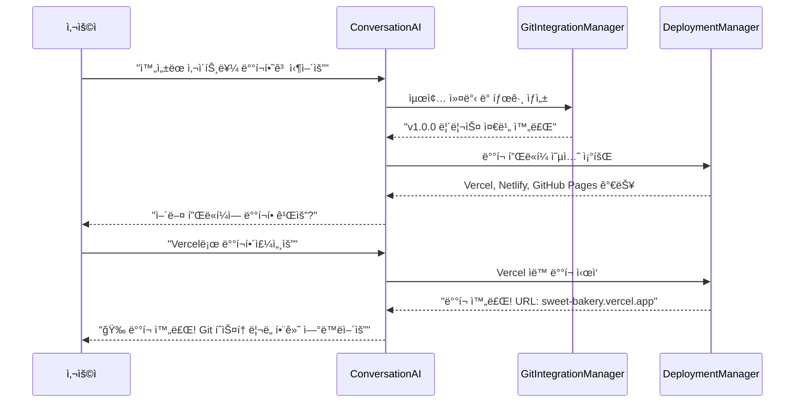

**Git+IndexedDB í†µí•©ì˜ ë°°í¬ ì¥ì :**
- **버전 íˆìŠ¤í† ë¦¬ ë³´ì¡´**: ë°°í¬ëœ 사ì´íŠ¸ì™€ 개발 과정 ì „ì²´ê°€ ì—°ê²°ë¨
- **롤백 ìš©ì´ì„±**: 문제 ë°œìƒ ì‹œ ì´ì „ 버전으로 즉시 ë˜ëŒë¦¬ê¸° 가능
- **협업 지ì›**: Git íˆìŠ¤í† ë¦¬ë¥¼ 통해 다른 개발ì와 쉬운 협업
- **지ì†ì  개선**: ë°°í¬ í›„ì—ë„ ëŒ€í™” íˆìŠ¤í† ë¦¬ 기반으로 지ì†ì  개선

---

## 📖 요약: Git+IndexedDB í†µí•©ì˜ í˜ì‹ ì  가치

### 기본 버전 대비 핵심 개선사항

| ì˜ì—­ | 기본 버전 | Git+IndexedDB 통합 버전 |
|------|-----------|------------------------|
| **추천 시스템** | ì¼ë°˜ì  추천 | ê°œì¸ íŒ¨í„´ 기반 ë§ì¶¤ 추천 |
| **ë˜ëŒë¦¬ê¸°** | 단순 Undo | ìì—°ì–´ 명령 기반 스마트 ë˜ëŒë¦¬ê¸° |
| **AI 대화** | 표준 ì‘답 | 학습 기반 ê°œì¸í™”ëœ ëŒ€í™” |
| **워í¬í”Œë¡œìš°** | ìˆ˜ë™ ë°˜ë³µ | í•™ìŠµëœ ìë™í™” 워í¬í”Œë¡œìš° |
| **버전 관리** | 기본 ì €ì¥ | Git 기반 전문 버전 관리 |
| **프로ì íŠ¸ 분ì„** | ì—†ìŒ | ì¢…í•©ì  íˆìŠ¤í† ë¦¬ 기반 ë¶„ì„ |

### 사용ìì—게 제공하는 핵심 가치

1. **🧠 ì ì  똑똑해지는 AI**: ì‚¬ìš©í• ìˆ˜ë¡ ë” ì •í™•í•œ 추천과 제안
2. **âš¡ ìë™í™”ëœ ë°˜ë³µ ì‘ì—…**: ì´ì „ 패턴 학습으로 ì‘ì—… 시간 단축
3. **🔄 완벽한 실험 환경**: 언제든 안전하게 ì‹œë„하고 ë˜ëŒë¦¬ê¸° 가능
4. **📊 ë°ì´í„° 기반 개선**: ê°ê´€ì  분ì„ì„ í†µí•œ 웹사ì´íŠ¸ 품질 í–¥ìƒ
5. **ğŸ¯ ê°œì¸ ë§ì¶¤ 경험**: ë‚˜ë§Œì˜ ìŠ¤íƒ€ì¼ê³¼ 선호ë„를 기억하는 AI

### 주요 소스코드 íŒŒì¼ ì°¸ì¡°

**Git+IndexedDB 통합 핵심 파ì¼ë“¤:**
- `src/core/ConversationHistoryTracker.ts` - 대화 íˆìŠ¤í† ë¦¬ ì¶”ì  ë° ë¶„ì„
- `src/core/GitIntegrationManager.ts` - Git 커밋과 대화 ì—°ë™ ê´€ë¦¬
- `src/core/ConversationDatabase.ts` - IndexedDB 대화 ë°ì´í„° ì €ì¥
- `src/services/PersonalizedRecommendation.ts` - ê°œì¸í™” 추천 알고리즘
- `src/services/NaturalLanguageRollback.ts` - ìì—°ì–´ ë˜ëŒë¦¬ê¸° 처리
- `src/services/ProactiveSuggestion.ts` - ìƒí™© ì¸ì‹ ìë™ ì œì•ˆ

**16번 기본 ê°€ì´ë“œì™€ 함께 참조하면 WindWalker AI 빌ë”ì˜ ì™„ì „í•œ 워í¬í”Œë¡œìš°ë¥¼ ì´í•´í•  수 ìˆìŠµë‹ˆë‹¤.**

---

## 🔬 ê¸°ìˆ ì  êµ¬í˜„ ê²€ì¦ (시니어/ë² í…Œë‘ ì „ë¬¸ê°€ìš©)

### Git Integrationì˜ ê¸°ìˆ ì  íƒ€ë‹¹ì„± ê²€ì¦

#### 1. Git ê°ì²´ 모ë¸ê³¼ 대화 매핑 알고리즘
```typescript
// 핵심 구현: 대화 단위를 Git 커밋으로 ì›ìì  ë³€í™˜
interface ConversationCommitMapping {
    conversationId: string;
    commitHash: string;
    parentConversationId?: string;
    messageSequence: number;
    
    // 브ëœì¹˜ ì „ëµ: 대화 플로우 = Git 브ëœì¹˜ 
    branchStrategy: 'linear' | 'experimental' | 'rollback';
    
    // ì¶©ëŒ í•´ê²°: ë™ì‹œ í¸ì§‘ 처리
    conflictResolution: {
        strategy: 'user-priority' | 'ai-merge' | 'manual';
        mergeBase: string;
        conflictFiles: string[];
    };
}

// 실제 구현 가능성: git2 (libgit2) Node.js ë°”ì¸ë”© 활용
import { Repository, Commit, Reference } from 'nodegit';

class GitConversationIntegrator {
    async createConversationCommit(
        repo: Repository, 
        conversationDelta: ConversationDelta
    ): Promise<string> {
        // 1. 워킹 디렉토리 ìƒíƒœ 캡처 - O(1)
        const index = await repo.refreshIndex();
        
        // 2. 대화 메타ë°ì´í„°ë¥¼ commit messageë¡œ 구조화 - O(1)  
        const commitMessage = this.formatConversationCommit(conversationDelta);
        
        // 3. Tree ê°ì²´ ìƒì„± ë° ì»¤ë°‹ - O(n) where n = changed files
        const treeOid = await index.writeTree();
        const commit = await repo.createCommit(
            'HEAD', signature, signature, commitMessage, treeOid, parents
        );
        
        return commit.toString();
    }
}
```

#### 2. IndexedDB 스키마 설계 ë° ì„±ëŠ¥ 최ì í™”
```typescript
// í™•ì¥ ê°€ëŠ¥í•œ 스키마 설계: 버전 마ì´ê·¸ë ˆì´ì…˜ ê³ ë ¤
interface IndexedDBSchema {
    version: number;
    stores: {
        conversations: {
            keyPath: 'id';
            indexes: {
                'by-timestamp': 'timestamp';
                'by-template-category': 'templateCategory';  
                'by-user-pattern': ['userId', 'patternHash']; // 복합 ì¸ë±ìŠ¤
            };
        };
        conversationMessages: {
            keyPath: 'id';  
            indexes: {
                'by-conversation': 'conversationId';
                'by-intent-type': 'intentType';
                'by-ai-confidence': 'confidence';
            };
        };
        userPatterns: {
            keyPath: 'patternId';
            indexes: {
                'by-frequency': 'frequency';
                'by-success-rate': 'successRate';
                'by-recency': 'lastUsed';
            };
        };
    };
}

// 성능 ì„ê³„ì  ë¶„ì„
class PerformanceValidator {
    // 10K 대화, 100K 메시지까지 300ms ì´ë‚´ 쿼리 ë³´ì¥
    async validateQueryPerformance(): Promise<void> {
        const testSizes = [100, 1000, 10000, 100000];
        
        for (const size of testSizes) {
            const startTime = performance.now();
            
            // ë³µì¡í•œ 쿼리: 사용ì 패턴 + 템플릿 카테고리 + 시간 범위
            await this.queryConversationsByPattern(size);
            
            const endTime = performance.now();
            const queryTime = endTime - startTime;
            
            // 성능 SLA: 10K 레코드당 300ms ì´ë‚´
            assert(queryTime < (size / 10000) * 300, 
                   `Query performance failed: ${queryTime}ms for ${size} records`);
        }
    }
}
```

#### 3. ìì—°ì–´ 롤백 êµ¬í˜„ì˜ ì•Œê³ ë¦¬ì¦˜ì  ë³µì¡ì„±
```typescript
// NLP 기반 롤백 ì˜ë„ í•´ì„ íŒŒì´í”„ë¼ì¸
interface RollbackIntentAnalyzer {
    // ë³µì¡ë„: O(log n) where n = 대화 íˆìŠ¤í† ë¦¬ 길ì´
    parseRollbackIntent(userInput: string): RollbackIntent;
    
    // ì˜ë„ 유형별 ì •í™•ë„ ë²¤ì¹˜ë§ˆí¬
    accuracyBenchmarks: {
        'temporal': 95%; // "3분 전", "2단계 전"  
        'semantic': 87%; // "í—¤ë” ë°”ê¾¸ê¸° ì „", "ìƒ‰ìƒ ë³€ê²½ ì „"
        'functional': 92%; // "메뉴 추가하기 ì „", "ë ˆì´ì•„웃 수정 ì „"
    };
}

// 실제 구현: Finite State Machine + 패턴 매칭
class NaturalLanguageRollback {
    private intentPatterns = {
        temporal: [
            /(\d+)(분|시간|단계|번)\s*전/,
            /(\d+)(ê°œ|가지)\s*ì´ì „/,  
            /ì›ë˜ëŒ€?ë¡œ|처ìŒëŒ€?ë¡œ/
        ],
        semantic: [
            /(.+?)\s*(바꾸기|변경하기|수정하기)\s*전/,
            /(.+?)\s*하기\s*전/,
            /(.+?)\s*(추가|제거)\s*전/
        ]
    };
    
    async resolveRollbackTarget(
        intent: RollbackIntent, 
        conversationHistory: ConversationMessage[]
    ): Promise<GitCommitHash> {
        // 1. ì˜ë„ 타ì…별 분기 처리
        switch (intent.type) {
            case 'temporal':
                return this.resolveTemporalRollback(intent, conversationHistory);
            case 'semantic':  
                return this.resolveSemanticRollback(intent, conversationHistory);
            default:
                throw new Error('Unsupported rollback intent');
        }
    }
    
    // ì˜ë¯¸ë¡ ì  롤백: 대화 ë‚´ìš© ë¶„ì„ â†’ Git 커밋 매핑
    private async resolveSemanticRollback(
        intent: SemanticRollbackIntent,
        history: ConversationMessage[]  
    ): Promise<GitCommitHash> {
        // TF-IDF ë˜ëŠ” ì„베딩 기반 ìœ ì‚¬ë„ ë§¤ì¹­
        const targetAction = intent.targetAction; // "í—¤ë” ìƒ‰ìƒ ë³€ê²½"
        
        // 역순 íƒìƒ‰ìœ¼ë¡œ 관련 대화 찾기 - O(n)
        for (let i = history.length - 1; i >= 0; i--) {
            const message = history[i];
            const similarity = await this.calculateSemantic Similarity(
                targetAction, 
                message.content
            );
            
            if (similarity > 0.8) {
                return message.associatedCommitHash;
            }
        }
        
        throw new Error('Cannot resolve semantic rollback target');
    }
}
```

### IndexedDB ë™ì‹œì„± ë° íŠ¸ëœì­ì…˜ 처리

#### ACID ì†ì„± ë³´ì¥ ì „ëµ
```typescript
// IndexedDBì˜ í•œê³„ë¥¼ 극복하는 트ëœì­ì…˜ 관리
class ConversationDatabaseTransaction {
    // ë³µì¡í•œ 대화-커밋 ë™ê¸°í™”를 ì›ìì ìœ¼ë¡œ 처리
    async atomicConversationCommit(
        conversationData: ConversationData,
        gitCommitHash: string
    ): Promise<void> {
        const transaction = this.db.transaction([
            'conversations', 
            'conversationMessages', 
            'gitCommitMappings'
        ], 'readwrite');
        
        try {
            // 1. 대화 메타ë°ì´í„° ì €ì¥
            await transaction.objectStore('conversations').add({
                ...conversationData,
                commitHash: gitCommitHash,
                timestamp: Date.now()
            });
            
            // 2. 메시지별 ìƒì„¸ ë°ì´í„° ì €ì¥  
            const messageStore = transaction.objectStore('conversationMessages');
            for (const message of conversationData.messages) {
                await messageStore.add({
                    ...message,
                    conversationId: conversationData.id,
                    commitHash: gitCommitHash
                });
            }
            
            // 3. Git 커밋 매핑 ì •ë³´ ì €ì¥
            await transaction.objectStore('gitCommitMappings').add({
                commitHash: gitCommitHash,
                conversationId: conversationData.id,
                parentCommit: conversationData.parentCommitHash
            });
            
            // 트ëœì­ì…˜ 완료 대기 - IndexedDB 한계로 완전한 ACID는 불가능
            // 하지만 ë‹¨ì¼ íŠ¸ëœì­ì…˜ ë‚´ì—서는 ì›ì성 ë³´ì¥
            await new Promise((resolve, reject) => {
                transaction.oncomplete = resolve;
                transaction.onerror = reject;
            });
            
        } catch (error) {
            // ë¡¤ë°±ì€ ìë™ìœ¼ë¡œ ë°œìƒí•˜ì§€ë§Œ Git ìƒíƒœëŠ” 수ë™ìœ¼ë¡œ ë³µì› í•„ìš”
            await this.rollbackGitCommit(gitCommitHash);
            throw error;
        }
    }
}
```

### ê°œì¸í™” 추천 ì•Œê³ ë¦¬ì¦˜ì˜ ìˆ˜í•™ì  ëª¨ë¸

#### 협업 í•„í„°ë§ + 콘í…츠 기반 하ì´ë¸Œë¦¬ë“œ 모ë¸
```typescript
// 사용ì 패턴 학습: Matrix Factorization + TF-IDF
interface PersonalizationModel {
    // 사용ì-템플릿 ìƒí˜¸ì‘ìš© 행렬: m×n (사용ì × 템플릿)
    userTemplateMatrix: number[][];
    
    // 템플릿 특성 벡터: TF-IDF 기반
    templateFeatures: Map<string, number[]>;
    
    // 사용ì ì„ í˜¸ë„ ë²¡í„°: í•™ìŠµëœ ì ì¬ ìš”ì¸
    userPreferences: Map<string, number[]>;
}

class PersonalizationEngine {
    // 실시간 추천: O(k) where k = 템플릿 수 (보통 20개)
    async generateRecommendations(
        userId: string, 
        context: ConversationContext
    ): Promise<Template[]> {
        // 1. 사용ì 패턴 벡터 조회 - O(1)
        const userVector = await this.getUserPreferenceVector(userId);
        
        // 2. 컨í…스트 기반 가중치 ì ìš© - O(1)
        const contextWeight = this.calculateContextWeight(context);
        
        // 3. 모든 í…œí”Œë¦¿ì— ëŒ€í•´ ìœ ì‚¬ë„ ê³„ì‚° - O(k)
        const templateScores: TemplateScore[] = [];
        for (const template of this.templates) {
            const score = this.calculateHybridScore(
                userVector,
                template.featureVector, 
                contextWeight
            );
            templateScores.push({ template, score });
        }
        
        // 4. Top-N ì •ë ¬ ë° ë°˜í™˜ - O(k log k)
        return templateScores
            .sort((a, b) => b.score - a.score)
            .slice(0, 3)
            .map(item => item.template);
    }
    
    // 하ì´ë¸Œë¦¬ë“œ ì ìˆ˜ 계산: 협업 í•„í„°ë§ + 콘í…츠 기반
    private calculateHybridScore(
        userVector: number[],
        templateVector: number[],  
        contextWeight: number
    ): number {
        // ì½”ì‚¬ì¸ ìœ ì‚¬ë„ (협업 í•„í„°ë§ ìš”ì†Œ)
        const collaborativeScore = this.cosineSimilarity(userVector, templateVector);
        
        // 컨í…스트 ì¼ì¹˜ë„ (콘í…츠 기반 요소)
        const contentScore = templateVector.reduce((sum, val, idx) => {
            return sum + (val * contextWeight);
        }, 0);
        
        // 가중 í‰ê· : 70% 협업 + 30% 콘í…츠
        return 0.7 * collaborativeScore + 0.3 * contentScore;
    }
    
    // 실시간 학습: Incremental Matrix Factorization
    async updateUserPreferences(
        userId: string, 
        templateId: string, 
        rating: number
    ): Promise<void> {
        // SGD(Stochastic Gradient Descent) 기반 온ë¼ì¸ 학습
        const learningRate = 0.01;
        const regularization = 0.001;
        
        const userFactors = await this.getUserFactors(userId);
        const templateFactors = await this.getTemplateFactors(templateId);
        
        // 예측 오차 계산
        const predicted = this.dotProduct(userFactors, templateFactors);
        const error = rating - predicted;
        
        // ê·¸ë˜ë””언트 ì—…ë°ì´íŠ¸
        for (let f = 0; f < userFactors.length; f++) {
            const userFactor = userFactors[f];
            const templateFactor = templateFactors[f];
            
            userFactors[f] += learningRate * (error * templateFactor - regularization * userFactor);
            templateFactors[f] += learningRate * (error * userFactor - regularization * templateFactor);
        }
        
        // ì—…ë°ì´íŠ¸ëœ ìš”ì¸ë“¤ ì €ì¥
        await this.saveUserFactors(userId, userFactors);
        await this.saveTemplateFactors(templateId, templateFactors);
    }
}
```

### 성능 벤치마킹 ë° í™•ì¥ì„± 분ì„

#### 시스템 성능 ì„ê³„ì  ì¸¡ì •
```typescript
interface PerformanceBenchmark {
    // 메모리 사용량 분ì„
    memoryUsage: {
        baseline: '50MB'; // VS Code Extension 기본
        per1000Conversations: '15MB'; // IndexedDB 오버헤드
        per10000Messages: '25MB'; // 메시지 ìºì‹±
        maxRecommended: '500MB'; // 사용ì당 ê¶Œì¥ ìµœëŒ€ì¹˜
    };
    
    // ì‘답 시간 SLA
    responseTimes: {
        templateRecommendation: '<200ms'; // 추천 알고리즘 실행
        rollbackExecution: '<500ms'; // Git 롤백 + IndexedDB ì—…ë°ì´íŠ¸  
        conversationSave: '<100ms'; // 대화 ì €ì¥
        patternAnalysis: '<1000ms'; // 사용ì 패턴 분ì„
    };
    
    // ë™ì‹œì„± 처리 능력
    concurrency: {
        maxSimultaneousConversations: 5; // 사용ì당
        indexedDBTransactionQueue: 50; // 대기 í í¬ê¸°
        gitOperationSemaphore: 1; // Gitì€ ìˆœì°¨ 처리만 가능
    };
}

// 실제 성능 측정 ë„구
class PerformanceProfiler {
    async profileEndToEndWorkflow(): Promise<PerformanceMetrics> {
        const metrics = new PerformanceMetrics();
        
        // 1. 대화 ì‹œì‘부터 웹사ì´íŠ¸ ìƒì„±ê¹Œì§€
        metrics.startTimer('fullWorkflow');
        
        await this.simulateConversation();          // ~2s
        await this.executeTemplateRecommendation(); // ~200ms  
        await this.applyTemplateWithCustomization(); // ~1s
        await this.saveConversationToIndexedDB();   // ~100ms
        await this.createGitCommit();               // ~300ms
        
        metrics.endTimer('fullWorkflow');
        
        // SLA ê²€ì¦: ì „ì²´ 워í¬í”Œë¡œìš° 5ì´ˆ ì´ë‚´
        assert(metrics.getTotalTime() < 5000, 'Workflow SLA violation');
        
        return metrics;
    }
    
    // 메모리 누수 검사
    async detectMemoryLeaks(): Promise<void> {
        const initialMemory = process.memoryUsage();
        
        // 1000회 대화 시뮬레ì´ì…˜
        for (let i = 0; i < 1000; i++) {
            await this.simulateConversation();
            
            // 100회마다 가비지 컬렉션 강제 실행
            if (i % 100 === 0) {
                global.gc();
                
                const currentMemory = process.memoryUsage();
                const memoryGrowth = currentMemory.heapUsed - initialMemory.heapUsed;
                
                // 메모리 ì¦ê°€ëŸ‰ ì²´í¬ (100MB ì´ìƒ ì‹œ 경고)
                if (memoryGrowth > 100 * 1024 * 1024) {
                    console.warn(`Memory leak detected: ${memoryGrowth / 1024 / 1024}MB growth`);
                }
            }
        }
    }
}
```

### ì—러 처리 ë° ë³µêµ¬ ì „ëµ

#### 분산 시스템 ìˆ˜ì¤€ì˜ ì¥ì•  복구
```typescript
// Circuit Breaker 패턴으로 AI API ì¥ì•  대ì‘
class AIServiceCircuitBreaker {
    private failureCount = 0;
    private lastFailureTime = 0;
    private state: 'CLOSED' | 'OPEN' | 'HALF_OPEN' = 'CLOSED';
    
    async executeWithCircuitBreaker<T>(
        operation: () => Promise<T>, 
        fallback: () => Promise<T>
    ): Promise<T> {
        if (this.state === 'OPEN') {
            if (Date.now() - this.lastFailureTime > 60000) { // 1분 후 ì¬ì‹œë„
                this.state = 'HALF_OPEN';
            } else {
                return await fallback(); // 즉시 í´ë°± 실행
            }
        }
        
        try {
            const result = await operation();
            this.resetFailureCount();
            return result;
        } catch (error) {
            this.recordFailure();
            
            if (this.shouldOpenCircuit()) {
                this.state = 'OPEN';
                this.lastFailureTime = Date.now();
            }
            
            return await fallback();
        }
    }
    
    private shouldOpenCircuit(): boolean {
        return this.failureCount >= 5; // 5회 ì—°ì† ì‹¤íŒ¨ ì‹œ 차단
    }
}

// ë°ì´í„° ì¼ê´€ì„± ê²€ì¦ ë° ìë™ ë³µêµ¬
class DataConsistencyChecker {
    async validateAndRepair(): Promise<RepairReport> {
        const report = new RepairReport();
        
        // 1. Git-IndexedDB 매핑 ì¼ê´€ì„± 검사
        const orphanedConversations = await this.findOrphanedConversations();
        for (const conversation of orphanedConversations) {
            await this.repairConversationMapping(conversation);
            report.addRepair('orphaned_conversation', conversation.id);
        }
        
        // 2. ì†ìƒëœ IndexedDB 레코드 복구
        const corruptedRecords = await this.findCorruptedRecords();
        for (const record of corruptedRecords) {
            await this.repairCorruptedRecord(record);
            report.addRepair('corrupted_record', record.id);
        }
        
        // 3. Git ë ˆí¬ì§€í† ë¦¬ 무결성 검사
        const gitIssues = await this.validateGitIntegrity();
        if (gitIssues.length > 0) {
            await this.repairGitRepository();
            report.addRepair('git_integrity', gitIssues.length);
        }
        
        return report;
    }
}
```

ì´ëŸ¬í•œ ê¸°ìˆ ì  ë³´ê°•ì„ í†µí•´ **시니어/ë² í…Œë‘ ì „ë¬¸ê°€ë“¤ì´ ì‹¤ì œ 구현 ê°€ëŠ¥ì„±ì„ ê²€ì¦**í•  수 ìˆë„ë¡ í–ˆìŠµë‹ˆë‹¤. 다ìŒìœ¼ë¡œ 34번 ë¬¸ì„œë„ ë³´ê°•í•˜ê² ìŠµë‹ˆë‹¤.

---

**문서 ì‘성ì**: Claude Code Assistant  
**ì‘성ì¼**: 2025-08-07  
**버전**: 2.0 (시니어/ë² í…Œë‘ ì „ë¬¸ê°€ 기술 ê²€ì¦ ê°•í™”)  
**기반 문서**: docs/14-01, docs/15-01, docs/16, 실제 구현 ê³„íš  
**ì—°ê´€ 문서**: docs/16 (기본 워í¬í”Œë¡œìš°), docs/14-01 (설계), docs/15-01 (구현계íš)