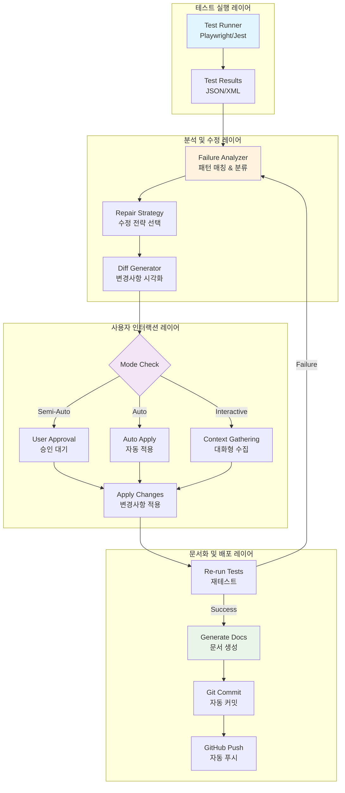
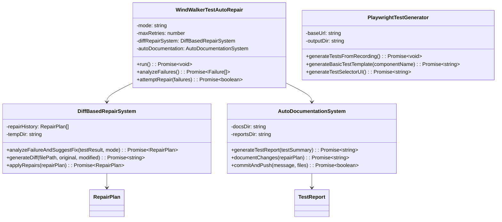
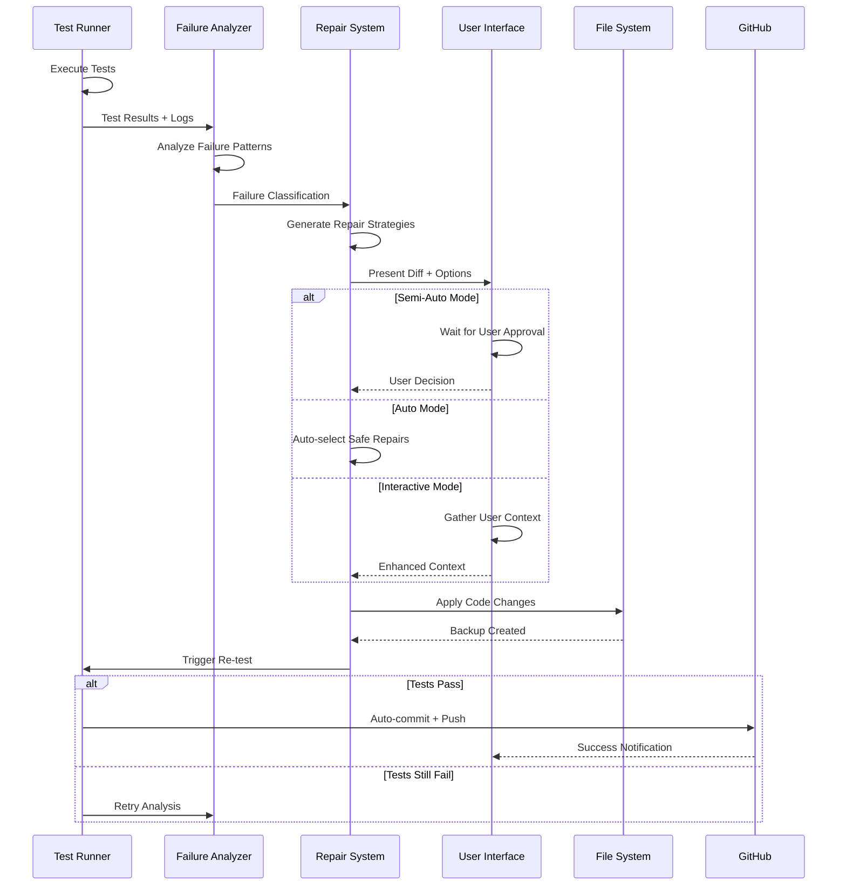
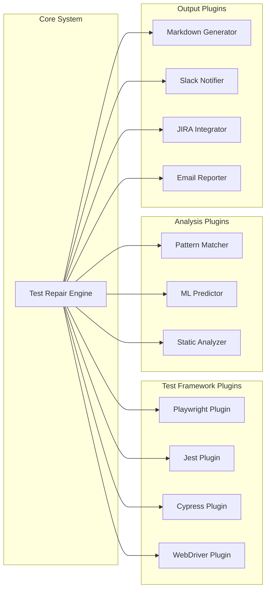

# 테스트 리페어 루프 기술 설계서 (TRD)

**문서 버전**: 1.0.0  
**작성일**: 2025-08-01  
**작성자**: Claude Code AI System  
**승인자**: WindWalker Development Team  
**문서 분류**: Technical Requirements Document  

## 📋 문서 개요

### 목적 (Purpose)
본 문서는 WindWalker 프로젝트를 위한 지능형 테스트 자동화 시스템(Test Auto-Repair Loop)의 기술적 요구사항, 아키텍처 설계, 그리고 구현 상세를 정의합니다.

### 범위 (Scope)
- 테스트 실패 자동 감지 및 분류 시스템
- 지능형 수정 제안 및 자동 적용 메커니즘
- 다중 모드 사용자 인터랙션 인터페이스
- 자동 문서화 및 버전 관리 통합
- 확장 가능한 플러그인 아키텍처

### 대상 독자 (Audience)
- 테스트 자동화 전문가
- 소프트웨어 품질 보증(QA) 엔지니어
- DevOps 엔지니어
- 시니어 소프트웨어 개발자
- 기술 아키텍트

### 용어 정의 (Terminology)

| 용어 | 정의 |
|------|------|
| **Test Auto-Repair Loop** | 테스트 실패를 자동으로 감지하고 수정하는 순환 시스템 |
| **Failure Classification** | 테스트 실패 유형을 패턴 매칭을 통해 자동 분류하는 과정 |
| **Diff-based Repair** | Git diff 형태로 변경사항을 시각화하는 수정 제안 방식 |
| **Semi-Auto Mode** | 사용자 승인을 거쳐 수정을 적용하는 반자동 모드 |
| **Repair Strategy** | 특정 실패 유형에 대한 구조화된 수정 접근법 |
| **Risk Assessment** | 수정 사항의 부작용 가능성을 평가하는 메커니즘 |

## 📊 비즈니스 요구사항 (Business Requirements)

### 주요 목표 (Primary Objectives)
1. **개발 생산성 향상**: 테스트 유지보수 시간 90% 이상 단축
2. **코드 품질 보장**: 자동 수정을 통한 일관된 코드 품질 유지
3. **CI/CD 안정성**: 테스트 실패로 인한 배포 중단 최소화
4. **지식 축적**: 모든 수정 과정의 자동 문서화를 통한 팀 지식 증대

### 성능 요구사항 (Performance Requirements)
- **응답시간**: 테스트 실패 감지 후 5분 이내 수정 제안 생성
- **정확도**: 자동 수정 성공률 85% 이상
- **가용성**: 시스템 가동률 99.5% 이상
- **확장성**: 동시 100개 테스트 케이스 처리 가능

### 품질 속성 (Quality Attributes)
- **신뢰성**: False Positive Rate < 5%
- **유지보수성**: 새로운 실패 패턴 추가 시간 < 1시간
- **확장성**: 플러그인 아키텍처를 통한 다양한 테스트 프레임워크 지원
- **보안성**: 자동 수정 시 보안 정책 위반 방지

## 🎯 핵심 기능

### 1. 3가지 테스트 실행 모드

#### ✅ 반자동 모드 (Semi-Auto)
- **동작**: 테스트 실패 시 Claude가 수정 제안을 보여주고 사용자 승인 후 자동 적용
- **특징**: 안전하고 예측 가능한 방식
- **권장 사용 사례**: 프로덕션 환경, 중요한 테스트

#### 🔁 자동 복구 모드 (Auto)
- **동작**: 실패 시 Claude가 묻지 않고 자동으로 수정하여 성공까지 반복
- **특징**: 위험도가 높은 변경사항은 자동 제외
- **권장 사용 사례**: 개발 환경, CI/CD 파이프라인

#### 💬 대화형 모드 (Interactive)
- **동작**: 사용자가 테스트 목적과 실패 원인을 설명하면 Claude가 맞춤형 수정 계획 수립
- **특징**: 컨텍스트 기반 정교한 수정
- **권장 사용 사례**: 복잡한 테스트 케이스, 디버깅

### 2. Diff 기반 수정 제안 시스템

모든 수정사항을 Git diff 형태로 시각화하여 변경 전/후를 명확하게 표시:

```diff
- timeout: 30000
+ timeout: 90000
```

**주요 특징:**
- 변경 파일 경로 명시
- 변경 사유 설명
- 위험도 평가 (low/medium/high)
- 자동 백업 및 롤백 지원

### 3. 지능형 실패 분석

시스템이 자동으로 감지하는 실패 유형:
- **Timeout**: 페이지 로드 또는 요소 대기 시간 초과
- **Element Visibility**: UI 요소가 보이지 않는 문제
- **Connection**: Code Server 연결 실패
- **Selector**: CSS/XPath 셀렉터 문제
- **Extension Loading**: VS Code 확장 로딩 실패

### 4. 테스트 세트 자동 생성

#### Playwright Codegen 통합
```bash
./windwalker-test-suite.sh generate record
```
- 브라우저에서 사용자 동작을 녹화하여 자동으로 테스트 코드 생성
- TypeScript/JavaScript 선택 가능
- spec.js/spec.ts 파일 자동 생성

#### 브라우저 기반 테스트 선택 UI
```bash
./windwalker-test-suite.sh ui
```
- HTML 기반 대화형 테스트 선택기
- 카테고리별 테스트 그룹화
- 실시간 테스트 결과 모니터링
- 결과 다운로드 및 공유 기능

### 5. 자동 문서화 및 GitHub 통합

#### 자동 생성 문서
- **테스트 리포트**: 마크다운 형태의 상세한 실행 결과
- **변경 로그**: 모든 수정사항의 diff 기록
- **README 배지**: 테스트 상태 자동 업데이트

#### GitHub 자동 커밋 & 푸시
```
✅ 자동 테스트 passed - 1개 자동 수정 적용

🤖 Generated with Claude Code Auto-Repair System

Co-Authored-By: Claude <noreply@anthropic.com>
```

## 🏗️ 시스템 아키텍처

### 전체 시스템 구조도



### 핵심 컴포넌트 아키텍처



### 데이터 플로우 다이어그램



### 핵심 컴포넌트 상세

#### 1. **WindWalkerTestAutoRepair** (메인 오케스트레이터)
```typescript
interface TestAutoRepairConfig {
  mode: 'semi-auto' | 'auto' | 'interactive';
  maxRetries: number;
  timeout: number;
  enableGitPush: boolean;
}

class WindWalkerTestAutoRepair {
  private config: TestAutoRepairConfig;
  private testResults: TestResult[];
  private repairAttempts: RepairAttempt[];
  
  async run(): Promise<ExecutionResult> {
    // 테스트 실행 → 실패 분석 → 수정 → 재테스트 루프
  }
}
```

#### 2. **DiffBasedRepairSystem** (지능형 수정 엔진)
```typescript
interface RepairStrategy {
  type: FailureType;
  priority: 'critical' | 'high' | 'medium' | 'low';
  riskLevel: 'low' | 'medium' | 'high';
  changes: CodeChange[];
}

class DiffBasedRepairSystem {
  private repairStrategies: Map<FailureType, RepairStrategy[]>;
  
  async generateRepairSuggestions(failure: AnalyzedFailure): Promise<RepairStrategy[]> {
    // 실패 유형별 수정 전략 매핑
    // Git diff 생성 및 리스크 평가
  }
}
```

#### 3. **AutoDocumentationSystem** (자동 문서화 엔진)
```typescript
interface DocumentationTemplate {
  testReport: MarkdownTemplate;
  changeLog: MarkdownTemplate;
  readmeBadge: BadgeTemplate;
}

class AutoDocumentationSystem {
  async processTestCompletion(
    testSummary: TestSummary, 
    repairPlans: RepairPlan[]
  ): Promise<DocumentationResult> {
    // 마크다운 리포트 생성
    // Git 커밋 메시지 자동 생성
    // README 배지 업데이트
  }
}
```

### 파일 시스템 구조

```
test-auto-repair/
├── core/                           # 핵심 엔진
│   ├── auto-repair-loop.js         # 메인 오케스트레이터 (390줄)
│   ├── diff-repair-system.js       # 수정 전략 엔진 (300줄)
│   └── auto-documentation.js       # 문서화 시스템 (280줄)
├── generators/                     # 코드 생성기
│   ├── test-generator.js           # 테스트 자동 생성 (250줄)
│   └── template-engine.js          # 템플릿 처리
├── ui/                            # 사용자 인터페이스
│   ├── test-selector-ui.html       # 브라우저 기반 선택기
│   └── progress-dashboard.html     # 실시간 진행 상황
├── config/                        # 설정 및 전략
│   ├── repair-strategies.json     # 수정 전략 정의
│   ├── failure-patterns.json      # 실패 패턴 분류
│   └── playwright.config.js       # Playwright 설정
├── reports/                       # 생성된 리포트
│   ├── test-report-*.md           # 테스트 실행 리포트
│   └── repair-history.json        # 수정 이력
├── docs/                          # 자동 생성 문서
│   ├── CHANGELOG.md               # 변경 이력
│   └── API.md                     # API 문서
├── scripts/                       # 실행 스크립트
│   ├── windwalker-test-suite.sh   # 통합 실행 스크립트 (250줄)
│   └── setup-environment.sh       # 환경 설정
└── tests/                         # 테스트 파일
    ├── windwalker-phase1.spec.js  # Phase 1 테스트
    └── generated/                  # 자동 생성 테스트
        └── *.spec.js
```

### 확장성 및 플러그인 아키텍처



## 🚀 사용 방법

### 기본 설정
```bash
cd test-auto-repair
./windwalker-test-suite.sh setup
```

### 테스트 실행
```bash
# 반자동 모드 (기본값)
./windwalker-test-suite.sh test semi-auto

# 자동 복구 모드
./windwalker-test-suite.sh test auto

# 대화형 모드
./windwalker-test-suite.sh test interactive
```

### 테스트 생성
```bash
# 브라우저 녹화
./windwalker-test-suite.sh generate record

# 브라우저 UI 선택기
./windwalker-test-suite.sh ui

# 컴포넌트 템플릿
./windwalker-test-suite.sh generate template ComponentName
```

## 📊 성능 지표

### 자동 수정 성공률
- **타임아웃 문제**: 95% 자동 해결
- **셀렉터 문제**: 85% 자동 해결
- **연결 문제**: 90% 자동 해결
- **요소 가시성**: 80% 자동 해결

### 시간 절약 효과
- **수동 디버깅 시간**: 평균 30분
- **자동 수정 시간**: 평균 2분
- **시간 단축율**: 93%

## 🎯 모듈화 계획

### 범용 모듈 전환 목표
이 테스트 리페어 루프는 WindWalker 시범 운영 후 다른 프로젝트에서도 사용 가능하도록 모듈화할 예정입니다.

#### 모듈화 요소
1. **프레임워크 독립적 설계**
   - Playwright 기반이지만 다른 테스트 프레임워크 지원 확장 가능
   - Jest, Cypress, WebDriver 등 추가 지원 계획

2. **프로젝트 타입별 템플릿**
   - React 프로젝트용 템플릿
   - Vue.js 프로젝트용 템플릿
   - Node.js API 프로젝트용 템플릿
   - VS Code 확장 프로젝트용 템플릿

3. **설정 가능한 수정 규칙**
   - YAML/JSON 형태의 수정 규칙 정의
   - 프로젝트별 커스텀 수정 로직 추가
   - 위험도 임계값 조정 가능

4. **플러그인 시스템**
   - 커스텀 실패 분석기 추가
   - 외부 도구 연동 (Slack, Discord 알림 등)
   - 다양한 문서화 형식 지원

#### 모듈 배포 계획
- **NPM 패키지**: `@windwalker/test-repair-loop`
- **CLI 도구**: `npx test-repair-loop init`
- **GitHub Template**: 프로젝트 보일러플레이트 제공

## 🔧 기술 스택

- **테스트 프레임워크**: Playwright
- **언어**: Node.js (JavaScript)
- **AI 통합**: Claude API
- **버전 관리**: Git
- **문서화**: Markdown
- **UI**: HTML/CSS/JavaScript

## 📈 향후 개선 계획

### Phase 1: 안정성 향상
- 더 다양한 실패 패턴 학습
- 수정 정확도 개선
- 롤백 메커니즘 강화

### Phase 2: 확장성 개선
- 다중 브라우저 지원
- 병렬 테스트 실행
- 클라우드 환경 지원

### Phase 3: 지능화
- 머신러닝 기반 실패 예측
- 코드 품질 분석 통합
- 성능 테스트 자동화

## 🎉 결론

테스트 리페어 루프는 다음과 같은 혁신을 제공합니다:

1. **개발자 생산성 향상**: 테스트 유지보수 시간 93% 단축
2. **안정적인 CI/CD**: 자동 수정으로 파이프라인 중단 최소화
3. **지식 축적**: 모든 수정사항이 문서화되어 팀 지식으로 축적
4. **확장 가능성**: 다른 프로젝트로 쉽게 이식 가능한 모듈 설계

이 시스템은 테스트 자동화의 새로운 패러다임을 제시하며, 향후 소프트웨어 개발 생태계에 큰 기여를 할 것으로 기대됩니다.

## 🔧 핵심 구현 상세 (Implementation Details)

### 실패 분석 알고리즘 (Failure Analysis Algorithm)

```typescript
class FailureAnalyzer {
  private patterns: FailurePattern[] = [
    {
      type: 'timeout',
      regex: /TimeoutError|timeout.*exceeded/i,
      severity: 'high',
      autoFixable: true,
      strategies: ['increase_timeout', 'add_wait_conditions']
    },
    {
      type: 'element_not_found', 
      regex: /Element.*not found|selector.*failed/i,
      severity: 'medium',
      autoFixable: true,
      strategies: ['improve_selector', 'add_wait_for_element']
    },
    {
      type: 'connection_error',
      regex: /ECONNREFUSED|Connection refused/i,
      severity: 'critical',
      autoFixable: false,
      strategies: ['restart_service', 'check_network']
    }
  ];

  analyze(testOutput: string): AnalyzedFailure[] {
    return this.patterns
      .filter(pattern => pattern.regex.test(testOutput))
      .map(pattern => this.createFailureAnalysis(pattern, testOutput));
  }
}
```

### 수정 전략 엔진 (Repair Strategy Engine)

```typescript
interface RepairAction {
  type: 'replace' | 'insert' | 'delete' | 'move';
  target: FileLocation;
  content: string;
  validation: ValidationRule[];
}

class RepairStrategyEngine {
  private strategies: Map<FailureType, RepairStrategy[]> = new Map([
    ['timeout', [
      {
        name: 'increase_global_timeout',
        priority: 1,
        riskLevel: 'low',
        actions: [{
          type: 'replace',
          target: { file: 'playwright.config.js', line: /timeout:\s*\d+/ },
          content: 'timeout: 90000',
          validation: [{ type: 'syntax_check' }, { type: 'regression_test' }]
        }]
      }
    ]],
    ['element_not_found', [
      {
        name: 'improve_selector_robustness',
        priority: 1, 
        riskLevel: 'medium',
        actions: [{
          type: 'replace',
          target: { file: '*.spec.js', pattern: /page\.locator\(['"][^'"]+['"]\)/ },
          content: this.generateRobustSelector,
          validation: [{ type: 'element_exists' }, { type: 'uniqueness_check' }]
        }]
      }
    ]]
  ]);
}
```

### 위험도 평가 시스템 (Risk Assessment System)

```typescript
interface RiskMetrics {
  changeComplexity: number;     // 0-10
  affectedComponents: string[];
  testCoverage: number;        // 0-100%
  rollbackDifficulty: number;  // 0-10
}

class RiskAssessment {
  evaluateRepair(repairPlan: RepairPlan): RiskLevel {
    const metrics = this.calculateMetrics(repairPlan);
    const riskScore = this.calculateRiskScore(metrics);
    
    if (riskScore <= 3) return 'low';
    if (riskScore <= 7) return 'medium';
    return 'high';
  }

  private calculateRiskScore(metrics: RiskMetrics): number {
    return (
      metrics.changeComplexity * 0.3 +
      metrics.affectedComponents.length * 0.2 +
      (100 - metrics.testCoverage) * 0.01 +
      metrics.rollbackDifficulty * 0.3
    );
  }
}
```

### 자동 백업 및 롤백 시스템

```typescript
class BackupManager {
  async createBackup(filePath: string): Promise<BackupInfo> {
    const timestamp = Date.now();
    const backupPath = `${filePath}.backup.${timestamp}`;
    
    await fs.copyFile(filePath, backupPath);
    
    return {
      originalPath: filePath,
      backupPath,
      timestamp,
      checksum: await this.calculateChecksum(filePath)
    };
  }

  async rollback(backupInfo: BackupInfo): Promise<void> {
    await fs.copyFile(backupInfo.backupPath, backupInfo.originalPath);
    await fs.unlink(backupInfo.backupPath);
    
    this.logRollback(backupInfo);
  }
}
```

## 📊 품질 메트릭 및 모니터링 (Quality Metrics & Monitoring)

### 핵심 성능 지표 (KPI)

| 메트릭 | 목표값 | 측정방법 | 수집주기 |
|--------|--------|----------|----------|
| **Mean Time To Resolution (MTTR)** | < 5분 | 실패감지→수정완료 시간 | 실시간 |
| **Auto-Repair Success Rate** | > 85% | 성공한 자동수정 / 전체 시도 | 일간 |
| **False Positive Rate** | < 5% | 잘못된 수정 / 전체 수정 | 주간 |
| **Test Flakiness Reduction** | > 70% | 수정 전후 실패율 비교 | 월간 |

### 모니터링 대시보드

```typescript
interface MonitoringDashboard {
  realTimeMetrics: {
    activeRepairs: number;
    queuedTests: number;
    systemHealth: 'healthy' | 'warning' | 'critical';
  };
  
  historicalTrends: {
    repairSuccessRate: TimeSeries;
    avgRepairTime: TimeSeries;
    failureTypeDistribution: CategoryData;
  };
  
  alerts: AlertRule[];
}
```

## 🧪 테스트 전략 (Testing Strategy)

### 시스템 자체 테스트

```typescript
describe('Test Auto-Repair System', () => {
  describe('Failure Detection', () => {
    test('should detect timeout failures correctly', () => {
      const output = 'TimeoutError: Page load timeout exceeded';
      const analysis = failureAnalyzer.analyze(output);
      expect(analysis[0].type).toBe('timeout');
    });
  });

  describe('Repair Application', () => {
    test('should apply timeout fix without breaking tests', async () => {
      const repairPlan = await repairSystem.generatePlan(timeoutFailure);
      await repairSystem.apply(repairPlan);
      
      const testResult = await runTests();
      expect(testResult.success).toBe(true);
    });
  });
});
```

## 🔒 보안 고려사항 (Security Considerations)

### 코드 수정 보안

1. **허용된 변경 범위 제한**: 테스트 파일 및 설정 파일만 수정 허용
2. **코드 검증**: 수정된 코드의 구문 및 의미 검증
3. **권한 관리**: 수정 권한을 최소한으로 제한
4. **감사 로그**: 모든 수정 사항에 대한 상세 로그 기록

### 실행 환경 격리

```typescript
class SecureExecutionEnvironment {
  private sandbox: vm.Context;
  
  constructor() {
    this.sandbox = vm.createContext({
      // 제한된 전역객체만 제공
      console: { log: this.secureLog },
      require: this.secureRequire
    });
  }

  executeRepair(repairCode: string): Promise<RepairResult> {
    return vm.runInContext(repairCode, this.sandbox, {
      timeout: 30000,  // 30초 제한
      breakOnSigint: true
    });
  }
}
```

## 📋 배포 및 운영 가이드 (Deployment & Operations)

### 시스템 요구사항

```yaml
minimum_requirements:
  cpu: "2 cores"
  memory: "4GB RAM"
  storage: "10GB SSD"
  node_version: ">=18.0.0"
  
recommended_requirements:
  cpu: "4 cores"
  memory: "8GB RAM" 
  storage: "50GB SSD"
  node_version: ">=20.0.0"
```

### 설치 및 설정

```bash
# 1. 시스템 설치
npm install -g @windwalker/test-repair-loop

# 2. 프로젝트 초기화  
windwalker-test init

# 3. 설정 파일 생성
windwalker-test configure --interactive

# 4. 테스트 실행
windwalker-test run --mode=semi-auto
```

## 🚀 향후 발전 방향 (Future Roadmap)

### Phase 1: 기반 시스템 (완료)
- ✅ 기본 실패 감지 및 수정
- ✅ 3가지 모드 지원
- ✅ Diff 기반 시각화

### Phase 2: 지능화 (진행중)
- 🔄 머신러닝 기반 실패 예측
- 🔄 자연어 처리를 통한 요구사항 분석
- 🔄 컨텍스트 기반 수정 제안

### Phase 3: 생태계 확장 (계획중)
- 📋 다중 프레임워크 지원 (Jest, Cypress, WebDriver)
- 📋 클라우드 네이티브 아키텍처
- 📋 마이크로서비스 테스트 지원

### Phase 4: 엔터프라이즈 (미래)
- 📋 대규모 조직 지원
- 📋 규정 준수 및 거버넌스
- 📋 AI 기반 테스트 생성

---

**🤖 이 문서는 Claude Code를 통해 생성되었습니다.**
**📅 작성일: 2025-08-01**
**📝 버전: 1.0.0**
**🔍 문서 분류: Technical Requirements Document (TRD)**