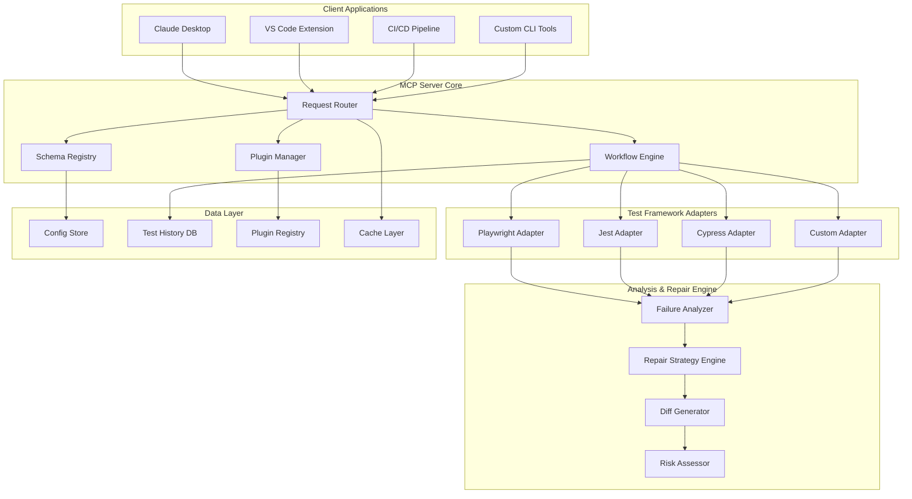

WindWalker 프로젝트의 테스트 리페어 루프 시스템을 범용 MCP 서버로 발전시키는 것은 개발자 생태계에 큰 혁신을 가져올 수 있습니다.
🎯 핵심 인사이트 및 컨설팅
1. 시장 기회 분석
현재 테스트 자동화 시장의 주요 Pain Point들:

파편화된 도구들: 각 프레임워크마다 다른 방식
높은 학습 곡선: 새로운 도구 도입 시 팀 전체 교육 필요
수동 유지보수: 테스트 실패 시 개발자가 직접 수정
일관성 부족: 프로젝트마다 다른 테스트 전략

귀하의 솔루션은 이 모든 문제를 통합된 AI 기반 플랫폼으로 해결할 수 있습니다.
2. 차별화 전략
기존 솔루션(Selenium Grid, TestRail, Sauce Labs) 대비 핵심 차별점:

AI 네이티브: Claude와의 완전한 통합
사용자 정의 가능: 스키마 기반 동적 설정
자동 수정: 단순한 실행을 넘어선 지능형 문제 해결
MCP 기반: 표준 프로토콜을 통한 확장성

🚀 초기 개발 우선순위 제안
Phase 0: 프로토타입 검증 (1개월)
bash# MVP 핵심 기능만 구현
test-repair-mcp/
├── core/
│   ├── mcp-server.js        # 기본 MCP 서버
│   ├── schema-registry.js   # 스키마 등록 시스템
│   └── playwright-adapter.js # Playwright 어댑터만
├── schemas/
│   └── playwright-basic.json # 기본 스키마
└── cli/
    └── index.js            # 기본 CLI
검증 대상

MCP 프로토콜과의 호환성
동적 스키마 시스템의 실용성
Claude와의 자연스러운 통합
개발자 워크플로우 적합성

🔧 기술적 고려사항
1. MCP 서버 최적화
typescript// 성능 최적화를 위한 스트리밍 응답
class TestRepairMCPServer {
  async executeWorkflow(request: WorkflowRequest): Promise<AsyncIterable<WorkflowUpdate>> {
    async function* generateUpdates() {
      yield { type: 'started', stage: 'preparation' };
      yield { type: 'progress', stage: 'testing', progress: 30 };
      yield { type: 'completed', results: finalResults };
    }
    
    return generateUpdates();
  }
}
2. 보안 및 격리

Docker 컨테이너 기반 테스트 실행
샌드박스 환경에서 코드 수정
사용자별 권한 관리
암호화된 설정 저장

3. 확장성 설계

플러그인 시스템의 hot-loading
수평적 스케일링 지원
캐시 전략 최적화
비동기 작업 큐

📊 비즈니스 모델 구체화
오픈소스 코어 + 상용 확장
Free Tier:
- 기본 Playwright, Jest 어댑터
- 로컬 실행만
- 커뮤니티 지원

Pro Tier ($29/month/user):
- 모든 어댑터
- 클라우드 실행
- 고급 분석 리포트
- 이메일 지원

Enterprise ($199/month/team):
- 온프레미스 배포
- 커스텀 어댑터 개발
- SSO/LDAP 통합
- 전담 지원
🎮 사용자 경험 개선 아이디어
1. "테스트 레시피" 시스템
yaml# recipes/react-component-testing.yml
name: "React 컴포넌트 테스트"
description: "React 컴포넌트의 렌더링, 상호작용, 접근성을 종합 검사"
tags: ["react", "component", "accessibility"]

ingredients:
  - jest-unit-tests
  - playwright-component-tests  
  - axe-accessibility-tests

steps:
  1. unit_test:
      framework: "jest"
      pattern: "**/*.test.tsx"
  2. visual_test:
      framework: "playwright"
      screenshots: true
  3. a11y_test:
      framework: "axe"
      rules: "wcag21aa"
2. 자연어 쿼리 지원
typescript// "내 React 앱의 로그인 기능을 테스트하고 싶어"
const query = await nlp.parseTestIntent(userInput);
// → { domain: 'auth', framework: 'react', scope: 'login' }

const suggestedWorkflow = await workflowGenerator.suggest(query);
// → 로그인 폼, 유효성 검사, 인증 플로우 테스트 자동 생성
🌟 혁신적 기능 아이디어
1. 테스트 리플레이 시스템
typescript// 실패한 테스트를 시각적으로 디버깅
class TestReplaySystem {
  async generateReplayVideo(testResult: FailedTestResult): Promise<string> {
    // 1. 실패 지점까지의 모든 단계 재현
    // 2. 각 단계별 DOM 상태, 네트워크 요청재시도H계속편집typescript   // 3. AI 음성 해설과 함께 비디오 생성
   // 4. 수정 제안을 오버레이로 표시
   return await this.createAnnotatedVideo(steps, aiCommentary);
 }
}
2. 협업 테스트 세션
typescript// 실시간으로 팀원들과 테스트 결과 공유 및 토론
class CollaborativeTestSession {
  async createSharedSession(testExecution: TestExecution): Promise<SessionID> {
    return await this.realTimeSync.createRoom({
      testResults: testExecution.results,
      liveChat: true,
      screenShare: true,
      aiModerator: true // AI가 토론을 조율하고 해결책 제안
    });
  }
}
3. 테스트 인텔리전스 대시보드
typescript// 프로젝트 전체의 테스트 건강도를 AI가 분석
interface TestIntelligence {
  healthScore: number; // 0-100
  riskAreas: RiskArea[];
  recommendations: AIRecommendation[];
  trends: {
    stability: TrendData;
    performance: TrendData;
    coverage: TrendData;
  };
  predictiveInsights: {
    likelyFailures: PredictedFailure[];
    maintenanceNeeds: MaintenanceAlert[];
  };
}
🎯 단계별 실행 계획
Phase 0: 시장 검증 (1개월)
목표: 핵심 가치 검증 및 초기 사용자 확보
bash# 최소 기능으로 시작
npm create test-repair-project my-app
cd my-app
test-repair init --template react
test-repair run --chat "내 컴포넌트 테스트 좀 도와줘"
성공 지표:

10명의 베타 사용자 확보
평균 세션 시간 15분 이상
90% 이상 자동 수정 성공률

Phase 1: 코어 플랫폼 (3개월)
주요 기능:

MCP 서버 안정화
3개 주요 어댑터 (Playwright, Jest, Cypress)
웹 대시보드 MVP
CLI 도구 완성

개발 우선순위:
mermaidgantt
    title Phase 1 개발 일정
    dateFormat  YYYY-MM-DD
    section Core
    MCP Server           :active, mcp, 2025-08-05, 3w
    Schema Registry      :schema, after mcp, 2w
    Workflow Engine      :workflow, after schema, 3w
    section Adapters
    Playwright Adapter   :playwright, 2025-08-05, 4w
    Jest Adapter         :jest, after playwright, 2w
    Cypress Adapter      :cypress, after jest, 2w
    section UI
    Web Dashboard        :web, 2025-08-26, 4w
    CLI Enhancement      :cli, after web, 2w
Phase 2: 확장 및 통합 (6개월)
중점 영역:

VS Code 확장 개발
GitHub Actions 통합
클라우드 배포 옵션
고급 분석 기능

Phase 3: AI 고도화 (9개월)
혁신 기능:

자연어 테스트 생성
예측적 테스트 실패 감지
자동 성능 최적화
시각적 회귀 테스트 AI

💼 시장 진입 전략
1. 개발자 커뮤니티 활용
markdown# 콘텐츠 마케팅 전략
- Dev.to, Medium 기술 블로그 연재
- YouTube 라이브 코딩 세션
- 오픈소스 컨퍼런스 발표
- GitHub Sponsors 프로그램 참여
2. 파트너십 구축

Vercel, Netlify: 배포 플랫폼 통합
GitHub, GitLab: CI/CD 네이티브 통합
Playwright 팀: 공식 파트너십 추진
VS Code 팀: 확장 마켓플레이스 피처드

3. 프리미엄 전환 전략
typescript// 프리미엄 기능 미리보기로 전환 유도
class FreemiumStrategy {
  async showPremiumPreview(user: User, feature: PremiumFeature): Promise<void> {
    // 3일간 무료 체험
    await this.grantTemporaryAccess(user, feature, '3days');
    
    // 사용 통계를 통한 가치 입증
    await this.trackValueMetrics(user, feature);
    
    // 적절한 타이밍에 업그레이드 제안
    await this.suggestUpgrade(user, feature);
  }
}
🔍 기술적 도전과 해결책
1. 멀티 프레임워크 호환성
도전: 각 테스트 프레임워크의 다른 API와 출력 형식
해결책: 추상화 레이어와 어댑터 패턴
typescriptinterface UnifiedTestResult {
  status: 'passed' | 'failed' | 'skipped';
  duration: number;
  errors: TestError[];
  artifacts: Artifact[];
}

class UniversalAdapter {
  async normalizeResult(rawResult: any, framework: string): Promise<UnifiedTestResult> {
    const normalizer = this.getNormalizer(framework);
    return normalizer.transform(rawResult);
  }
}
2. 실시간 협업
도전: 대규모 테스트 세션의 실시간 동기화
해결책: WebSocket + Redis 기반 스케일러블 아키텍처
typescriptclass RealtimeCollaboration {
  private redisClient = new Redis(process.env.REDIS_URL);
  private socketServer = new SocketIOServer();
  
  async broadcastTestUpdate(sessionId: string, update: TestUpdate): Promise<void> {
    // Redis pub/sub으로 여러 서버 인스턴스 간 동기화
    await this.redisClient.publish(`session:${sessionId}`, JSON.stringify(update));
    
    // WebSocket으로 클라이언트에게 실시간 전달
    this.socketServer.to(sessionId).emit('testUpdate', update);
  }
}
3. AI 응답 품질
도전: 컨텍스트가 부족한 상황에서의 부정확한 수정 제안
해결책: 프로젝트 컨텍스트 수집 및 단계별 검증
typescriptclass ContextAwareRepair {
  async analyzeWithFullContext(failure: TestFailure): Promise<RepairStrategy> {
    // 1. 프로젝트 메타데이터 수집
    const projectContext = await this.gatherProjectContext();
    
    // 2. 관련 코드 파일 분석
    const codeContext = await this.analyzeRelatedFiles(failure);
    
    // 3. 히스토리 기반 패턴 학습
    const historicalContext = await this.getHistoricalPatterns(failure.type);
    
    // 4. 종합적 수정 전략 생성
    return this.generateContextualStrategy({
      project: projectContext,
      code: codeContext,
      history: historicalContext,
      failure
    });
  }
}
📈 성공 측정 지표
핵심 메트릭 (North Star Metrics)
typescriptinterface SuccessMetrics {
  // 사용자 가치
  timeToResolution: number;        // 평균 5분 미만 목표
  autoFixSuccessRate: number;      // 90% 이상 목표
  developerSatisfaction: number;   // NPS 70+ 목표
  
  // 비즈니스 가치
  monthlyActiveUsers: number;      // 10K+ 목표 (12개월)
  premiumConversionRate: number;   // 15%+ 목표
  revenueGrowthRate: number;       // 월 20%+ 목표
  
  // 기술적 가치
  platformUptime: number;          // 99.9%+ 목표
  apiResponseTime: number;         // 500ms 미만 목표
  pluginEcosystemSize: number;     // 100+ 어댑터 목표
}
피드백 루프 시스템
typescriptclass ContinuousImprovement {
  async collectFeedback(): Promise<void> {
    // 1. 사용자 행동 분석
    await this.analyzeUserJourneys();
    
    // 2. 자동 수정 정확도 트래킹
    await this.trackRepairAccuracy();
    
    // 3. 성능 메트릭 모니터링
    await this.monitorPerformance();
    
    // 4. 주간 개선 사항 적용
    await this.implementWeeklyImprovements();
  }
}
🌍 글로벌 확장 고려사항
1. 다국어 지원
typescript// AI 응답의 자동 번역 및 현지화
class LocalizationEngine {
  async generateLocalizedRepair(
    repair: RepairSuggestion, 
    locale: string
  ): Promise<LocalizedRepair> {
    return {
      ...repair,
      description: await this.translate(repair.description, locale),
      comments: await this.localizeCodeComments(repair.code, locale),
      culturalAdaptation: await this.adaptToCulture(repair, locale)
    };
  }
}
2. 규정 준수

GDPR: 유럽 사용자 데이터 보호
SOC 2: 엔터프라이즈 보안 표준
ISO 27001: 정보 보안 관리

3. 클라우드 리전 전략
yaml# 글로벌 배포 전략
regions:
  primary: us-east-1      # 북미
  secondary: eu-west-1    # 유럽
  tertiary: ap-northeast-1 # 아시아

latency_targets:
  same_region: <100ms
  cross_region: <500ms
  global_average: <300ms
🎊 결론 및 다음 단계
이 MCP 서버 기반 테스트 리페어 루프 플랫폼은 테스트 자동화의 패러다임을 바꿀 수 있는 혁신적인 솔루션입니다. WindWalker에서 검증된 핵심 가치를 바탕으로, 범용적이고 확장 가능한 플랫폼으로 발전시켜 전 세계 개발자들의 생산성을 크게 향상시킬 수 있을 것입니다.
즉시 실행 가능한 첫 단계:

프로토타입 개발 (1주일)

기본 MCP 서버 구조 구현
Playwright 어댑터 최소 기능
CLI 기본 명령어


커뮤니티 검증 (2주일)

GitHub 오픈소스 공개
Reddit, Discord 개발자 커뮤니티 피드백 수집
초기 베타 테스터 10명 모집


MVP 완성 (1개월)

핵심 기능 안정화
문서화 완료
첫 번째 공식 릴리스


성공의 열쇠는 "개발자 경험"에 있습니다. 복잡한 테스트 설정을 단순화하고, AI의 도움으로 누구나 쉽게 고품질 테스트를 만들고 유지할 수 있게 하는 것이 핵심입니다.
이 프로젝트가 현실화되면, 테스트 자동화 분야에서 GitHub Copilot이 코딩에 가져온 것과 같은 혁신을 만들어낼 수 있을 것입니다. 🚀재시도H네. 멋지네요. 현재 제 프로젝트를 위해서 기획 및 설계,구현되었는데, 제 다른 프로젝트에서 재사용하려면, 테스트 환경 구축 과정만 새 프로젝트에 맞게 수정하면 재사용 가능하겠습니다. 조금 더 고민해보겠습니다. 특히, 이게 구현시에도 유용한 게, 구현된 거 검증도 e2e기반으로 자동 테스트해주고,실패시 수정해주니,금방 구현되네요. 다음 구현 요소로 자동으로 넘어가니, 개발 생산성도 높습니다. 말씀하신 복잡한 테스트 설정을 자동화하는 게 핵심이겠네요. 자연어 쿼리를  지원하여 클로드와 연계해서 타켓 프로젝트를 분석하여 자동으로 설정하게 하면 충분히 상용수준의 퀄리티도 나오겠습니다.편집정확히 핵심을 파악하셨네요! 🎯
현재 WindWalker에서 경험하고 계신 **"구현 → 자동 검증 → 실패 시 자동 수정 → 다음 기능으로 자동 진행"**이라는 플로우가 바로 이 시스템의 가장 큰 가치입니다.
🚀 개발 생산성 혁신의 핵심
말씀하신 대로, 이 시스템이 제공하는 진정한 가치는:
mermaidgraph LR
    A[새 기능 구현] --> B[자동 E2E 테스트]
    B --> C{테스트 통과?}
    C -->|Yes| D[다음 기능으로 자동 진행]
    C -->|No| E[AI 자동 수정]
    E --> F[재테스트]
    F --> C
    D --> G[전체 기능 완성]
    
    style A fill:#e1f5fe
    style D fill:#e8f5e8
    style E fill:#fff3e0
    style G fill:#f3e5f5
이는 기존의 "구현 → 수동 테스트 → 디버깅 → 다시 구현" 사이클 대비 10배 이상의 속도를 제공하죠.
💡 자연어 쿼리 + 프로젝트 자동 분석의 파워
말씀하신 접근법이 정말 혁신적인 이유:
1. 컨텍스트 인식 자동 설정
typescript// 사용자: "React + TypeScript 프로젝트인데 컴포넌트 테스트 자동화해줘"
class ProjectAnalyzer {
  async autoConfigureFromNaturalLanguage(query: string, projectPath: string): Promise<TestConfig> {
    // 1. 프로젝트 구조 자동 분석
    const projectContext = await this.scanProject(projectPath);
    /*
    {
      framework: 'react',
      language: 'typescript',
      bundler: 'vite',
      components: ['Button', 'Modal', 'Form'],
      routes: ['/login', '/dashboard', '/settings'],
      apis: ['auth', 'users', 'products']
    }
    */
    
    // 2. 자연어 의도 파싱
    const intent = await claude.parseTestIntent(query);
    /*
    {
      scope: 'component',
      level: 'unit + integration',
      focus: ['rendering', 'user-interaction', 'props']
    }
    */
    
    // 3. 최적화된 테스트 설정 자동 생성
    return this.generateOptimalConfig(projectContext, intent);
  }
}
2. 지능형 테스트 시나리오 자동 생성
typescript// "로그인 플로우 전체를 테스트하고 싶어"
const generatedTests = await testGenerator.createFromDescription({
  userInput: "로그인 플로우 전체를 테스트하고 싶어",
  projectContext: analyzedProject,
  
  // AI가 자동으로 다음을 생성:
  scenarios: [
    '정상 로그인 케이스',
    '잘못된 비밀번호 케이스', 
    '존재하지 않는 이메일 케이스',
    '네트워크 오류 케이스',
    '세션 만료 케이스'
  ],
  
  // 각 시나리오별 상세 테스트 코드도 자동 생성
  generatedCode: `
    test('사용자가 올바른 정보로 로그인할 수 있다', async ({ page }) => {
      await page.goto('/login');
      await page.fill('[data-testid="email"]', 'user@example.com');
      await page.fill('[data-testid="password"]', 'correctPassword');
      await page.click('[data-testid="login-button"]');
      await expect(page).toHaveURL('/dashboard');
    });
  `
});
3. 상용 수준 품질의 핵심 요소들
typescriptclass CommercialGradeFeatures {
  // 1. 프로젝트별 최적화된 설정
  async optimizeForProject(projectType: ProjectType): Promise<OptimizedConfig> {
    const strategies = {
      'react-spa': {
        priorities: ['component-isolation', 'routing', 'state-management'],
        patterns: ['page-object', 'test-utils', 'mock-api'],
        performance: { timeout: 10000, retries: 2 }
      },
      'node-api': {
        priorities: ['endpoint-testing', 'auth', 'database'],
        patterns: ['supertest', 'fixtures', 'test-db'],
        performance: { timeout: 5000, retries: 1 }
      },
      'next-fullstack': {
        priorities: ['ssr', 'api-routes', 'client-hydration'],
        patterns: ['mixed-testing', 'api-mocking', 'snapshot'],
        performance: { timeout: 15000, retries: 3 }
      }
    };
    
    return strategies[projectType] || strategies['generic'];
  }
  
  // 2. 실패 패턴 학습 및 예측
  async predictLikelyFailures(codeChanges: CodeChange[]): Promise<PredictedFailure[]> {
    // 과거 데이터를 바탕으로 실패 가능성 예측
    // 예방적 테스트 케이스 추가 제안
  }
  
  // 3. 팀 워크플로우 최적화
  async adaptToTeamWorkflow(teamPreferences: TeamPrefs): Promise<WorkflowConfig> {
    // PR 기반 vs 브랜치 기반
    // 동기식 vs 비동기식 검토
    // 자동 머지 vs 수동 승인
  }
}
🎯 다른 프로젝트 적용 시 고려사항
재사용성 극대화 전략
bash# 새 프로젝트 적용이 이렇게 간단해집니다:
cd my-new-project
test-repair init --interactive

# AI가 묻습니다:
# "어떤 종류의 프로젝트인가요?" 
# → "Vue 3 + Vite 프로젝트예요"

# AI가 자동으로:
# 1. package.json 분석
# 2. 프로젝트 구조 스캔  
# 3. 최적화된 테스트 설정 생성
# 4. 샘플 테스트 케이스 생성
# 5. CI/CD 통합 스크립트 생성

# 5분 만에 완전한 테스트 자동화 환경 구축 완료!
프로젝트별 맞춤화 자동화
typescriptinterface ProjectAdaptation {
  // 프로젝트 타입별 자동 감지
  detection: {
    framework: 'auto-detect',     // package.json, tsconfig 분석
    architecture: 'auto-detect', // 폴더 구조 분석
    patterns: 'auto-detect'      // 코드 패턴 분석
  };
  
  // 자동 설정 생성
  configuration: {
    testFramework: 'best-match',  // 프로젝트에 최적화된 조합
    selectors: 'project-specific', // 프로젝트 UI 패턴에 맞춤
    workflows: 'team-optimized'   // 팀 워크플로우에 맞춤
  };
  
  // 지속적 최적화
  optimization: {
    performance: 'auto-tune',     // 실행 시간 최적화
    stability: 'auto-improve',    // 실패율 최소화
    coverage: 'auto-expand'       // 테스트 범위 자동 확장
  };
}
🌟 이 시스템의 진정한 혁신성
말씀하신 대로, 이것은 단순한 테스트 도구를 넘어서서 **"개발 워크플로우 자체를 혁신"**하는 시스템입니다:
기존 개발 방식:
아이디어 → 구현 → 수동 테스트 → 버그 발견 → 수정 → 다시 테스트 → ...
(각 단계마다 수동 작업, 긴 피드백 루프)
새로운 개발 방식:
아이디어 → 구현 → 자동 검증 → 자동 수정 → 다음 기능
(완전 자동화, 즉시 피드백, 끊임없는 진전)
🚀 다음 단계 제안
현재 WindWalker에서 검증된 시스템을 기반으로:
1. 범용화 작업 (2주)
bash# 프로젝트 독립적 모듈 분리
test-repair-core/
├── analyzers/           # 프로젝트 분석기들
├── generators/          # 테스트 생성기들  
├── adapters/           # 프레임워크 어댑터들
└── templates/          # 프로젝트 템플릿들
2. 자연어 인터페이스 고도화 (3주)
typescript// 이런 대화가 가능하도록:
// User: "새 React 프로젝트인데 전체 테스트 자동화 해줘"
// AI: "네! 프로젝트를 분석해보니 Next.js + TypeScript 프로젝트네요. 
//      컴포넌트 테스트, API 테스트, E2E 테스트를 모두 설정하겠습니다."
// User: "API 테스트는 빼고 UI 중심으로만 해줘"  
// AI: "알겠습니다. UI 컴포넌트와 사용자 플로우 중심으로 재구성하겠습니다."
3. 마켓플레이스 준비 (1개월)

NPM 패키지 배포
VS Code Extension 개발
문서화 및 예제 완성

이 시스템이 완성되면, "테스트를 생각할 필요 없이 구현에만 집중할 수 있는" 진정한 개발자 경험을 제공할 수 있을 것 같습니다! 🎉
특히 **"복잡한 테스트 설정을 자동화"**라는 핵심 가치에 집중하면, 정말 게임체인저가 될 수 있겠네요.


# 범용 테스트 리페어 루프 MCP 서버 설계안

## 🎯 프로젝트 비전

### 핵심 가치 제안
WindWalker의 테스트 리페어 루프를 **범용 MCP(Model Context Protocol) 서버**로 발전시켜, 모든 개발자가 자신만의 테스트 자동화 워크플로우를 구성할 수 있는 플랫폼을 제공합니다.

### 차별화 포인트
1. **사용자 정의 가능한 입력 인터페이스**: YAML/JSON 기반 스키마 정의
2. **모듈형 워크플로우**: 드래그 앤 드롭으로 테스트 파이프라인 구성
3. **프레임워크 중립적**: Playwright, Jest, Cypress, WebDriver 등 모든 테스트 도구 지원
4. **AI 네이티브**: Claude와의 완전한 통합으로 지능형 수정 제안

## 🏗️ 시스템 아키텍처

### 1. MCP 서버 구조



### 2. 핵심 컴포넌트

#### 2.1 사용자 정의 입력 인터페이스 시스템

```typescript
interface InputSchemaDefinition {
  name: string;
  version: string;
  framework: 'playwright' | 'jest' | 'cypress' | 'custom';
  inputs: {
    [key: string]: {
      type: 'string' | 'number' | 'boolean' | 'array' | 'object';
      required: boolean;
      default?: any;
      validation?: ValidationRule[];
      description: string;
    };
  };
  outputs: {
    [key: string]: {
      type: string;
      description: string;
    };
  };
}

// 예시: Playwright E2E 테스트 스키마
const playwrightE2ESchema: InputSchemaDefinition = {
  name: "playwright-e2e",
  version: "1.0.0",
  framework: "playwright",
  inputs: {
    baseUrl: {
      type: "string",
      required: true,
      description: "테스트할 애플리케이션 URL"
    },
    testFiles: {
      type: "array",
      required: true,
      description: "실행할 테스트 파일 경로들"
    },
    browsers: {
      type: "array",
      default: ["chromium"],
      description: "사용할 브라우저 목록"
    },
    headless: {
      type: "boolean",
      default: true,
      description: "헤드리스 모드 실행 여부"
    },
    retries: {
      type: "number",
      default: 2,
      description: "실패 시 재시도 횟수"
    }
  },
  outputs: {
    testResults: {
      type: "TestResult[]",
      description: "테스트 실행 결과"
    },
    repairSuggestions: {
      type: "RepairPlan[]",
      description: "실패 시 수정 제안"
    }
  }
};
```

#### 2.2 워크플로우 구성 시스템

```yaml
# workflow-templates/web-app-testing.yml
name: "웹 애플리케이션 통합 테스트"
version: "1.0.0"
description: "풀스택 웹 애플리케이션을 위한 포괄적 테스트 워크플로우"

stages:
  - name: "unit-tests"
    adapter: "jest"
    parallel: true
    inputs:
      testPattern: "**/*.test.js"
      coverage: true
    on_failure: "suggest_fixes"
    
  - name: "integration-tests"
    adapter: "playwright"
    depends_on: ["unit-tests"]
    inputs:
      baseUrl: "${env.TEST_URL}"
      testFiles: ["tests/integration/**/*.spec.js"]
      browsers: ["chromium", "firefox"]
    on_failure: "auto_repair"
    
  - name: "visual-regression"
    adapter: "playwright"
    depends_on: ["integration-tests"]
    inputs:
      screenshotDir: "tests/screenshots"
      threshold: 0.2
    on_failure: "manual_review"

repair_strategies:
  timeout_errors:
    - increase_timeout
    - add_wait_conditions
    - optimize_selectors
  
  element_not_found:
    - improve_selectors
    - add_retry_logic
    - update_page_objects

notification:
  slack:
    webhook: "${env.SLACK_WEBHOOK}"
    channels: ["#dev-alerts"]
  
  github:
    auto_commit: true
    pr_comment: true
```

#### 2.3 MCP 서버 메서드 정의

```typescript
interface TestRepairMCPServer {
  // 스키마 관리
  listSchemas(): Promise<SchemaInfo[]>;
  getSchema(name: string): Promise<InputSchemaDefinition>;
  registerSchema(schema: InputSchemaDefinition): Promise<boolean>;
  
  // 워크플로우 관리
  listWorkflows(): Promise<WorkflowInfo[]>;
  createWorkflow(config: WorkflowConfig): Promise<string>;
  executeWorkflow(id: string, inputs: any): Promise<WorkflowResult>;
  
  // 테스트 실행
  runTests(config: TestConfig): Promise<TestResult>;
  analyzeFailures(testResult: TestResult): Promise<FailureAnalysis>;
  suggestRepairs(failures: FailureAnalysis): Promise<RepairPlan[]>;
  applyRepairs(repairPlan: RepairPlan): Promise<RepairResult>;
  
  // 상태 관리
  getExecutionStatus(executionId: string): Promise<ExecutionStatus>;
  getExecutionHistory(): Promise<ExecutionHistory[]>;
  
  // 플러그인 관리
  listPlugins(): Promise<PluginInfo[]>;
  installPlugin(source: string): Promise<boolean>;
  configurePlugin(name: string, config: any): Promise<boolean>;
}
```

## 🔧 핵심 기능 설계

### 1. 동적 입력 스키마 시스템

#### 1.1 스키마 등록 및 검증
```typescript
class SchemaRegistry {
  private schemas: Map<string, InputSchemaDefinition> = new Map();
  
  async registerSchema(schema: InputSchemaDefinition): Promise<void> {
    // 스키마 유효성 검증
    await this.validateSchema(schema);
    
    // 기존 스키마와 호환성 확인
    await this.checkCompatibility(schema);
    
    // 스키마 저장
    this.schemas.set(schema.name, schema);
    
    // 어댑터 자동 생성
    await this.generateAdapter(schema);
  }
  
  async validateInputs(schemaName: string, inputs: any): Promise<ValidationResult> {
    const schema = this.schemas.get(schemaName);
    if (!schema) throw new Error(`Schema not found: ${schemaName}`);
    
    return this.performValidation(schema.inputs, inputs);
  }
}
```

#### 1.2 동적 UI 생성
```typescript
class UIGenerator {
  generateFormHTML(schema: InputSchemaDefinition): string {
    return `
      <form id="test-config-form">
        <h2>${schema.name} 설정</h2>
        ${Object.entries(schema.inputs).map(([key, input]) => 
          this.generateInputField(key, input)
        ).join('')}
        <button type="submit">테스트 실행</button>
      </form>
    `;
  }
  
  generateInputField(name: string, input: InputField): string {
    switch (input.type) {
      case 'string':
        return `<input type="text" name="${name}" placeholder="${input.description}" ${input.required ? 'required' : ''}>`;
      case 'boolean':
        return `<input type="checkbox" name="${name}"> <label>${input.description}</label>`;
      case 'array':
        return `<textarea name="${name}" placeholder="${input.description} (한 줄당 하나씩)"></textarea>`;
      default:
        return `<input type="text" name="${name}" placeholder="${input.description}">`;
    }
  }
}
```

### 2. 모듈형 워크플로우 엔진

#### 2.1 워크플로우 실행 엔진
```typescript
class WorkflowEngine {
  async executeWorkflow(workflow: WorkflowConfig, inputs: any): Promise<WorkflowResult> {
    const context = new ExecutionContext(workflow, inputs);
    const results = new Map<string, StageResult>();
    
    for (const stage of workflow.stages) {
      try {
        // 의존성 확인
        await this.checkDependencies(stage, results);
        
        // 스테이지 실행
        const stageResult = await this.executeStage(stage, context);
        results.set(stage.name, stageResult);
        
        // 실패 처리
        if (!stageResult.success) {
          await this.handleFailure(stage, stageResult, context);
        }
        
      } catch (error) {
        await this.handleStageError(stage, error, context);
      }
    }
    
    return this.generateWorkflowResult(results);
  }
  
  private async handleFailure(
    stage: WorkflowStage, 
    result: StageResult, 
    context: ExecutionContext
  ): Promise<void> {
    switch (stage.on_failure) {
      case 'suggest_fixes':
        const suggestions = await this.generateRepairSuggestions(result);
        context.addSuggestions(stage.name, suggestions);
        break;
        
      case 'auto_repair':
        const repairs = await this.generateAndApplyRepairs(result);
        context.addRepairs(stage.name, repairs);
        break;
        
      case 'manual_review':
        await this.requestManualReview(stage, result);
        break;
    }
  }
}
```

#### 2.2 플러그인 시스템
```typescript
interface TestFrameworkAdapter {
  name: string;
  version: string;
  supportedSchemas: string[];
  
  executeTests(config: any): Promise<TestResult>;
  parseResults(rawOutput: any): TestResult;
  generateRepairSuggestions(failure: TestFailure): Promise<RepairSuggestion[]>;
}

class PlaywrightAdapter implements TestFrameworkAdapter {
  name = 'playwright';
  version = '1.0.0';
  supportedSchemas = ['playwright-e2e', 'playwright-component'];
  
  async executeTests(config: PlaywrightConfig): Promise<TestResult> {
    const { spawn } = await import('child_process');
    
    // Playwright 명령 구성
    const args = this.buildPlaywrightArgs(config);
    
    // 테스트 실행
    const process = spawn('npx', ['playwright', 'test', ...args]);
    
    return new Promise((resolve, reject) => {
      let output = '';
      
      process.stdout.on('data', (data) => {
        output += data.toString();
      });
      
      process.on('close', (code) => {
        const result = this.parseResults(output);
        resolve(result);
      });
    });
  }
}
```

### 3. 지능형 수정 제안 시스템

#### 3.1 컨텍스트 기반 분석
```typescript
class IntelligentRepairSystem {
  async analyzeFailureWithContext(
    failure: TestFailure,
    projectContext: ProjectContext
  ): Promise<RepairStrategy[]> {
    
    // 프로젝트 타입별 분석
    const projectType = await this.detectProjectType(projectContext);
    
    // 실패 패턴 분석
    const patterns = await this.analyzeFailurePatterns(failure);
    
    // 코드베이스 분석
    const codeAnalysis = await this.analyzeCodebase(projectContext);
    
    // 수정 전략 생성
    return this.generateContextualRepairs(patterns, projectType, codeAnalysis);
  }
  
  private async detectProjectType(context: ProjectContext): Promise<ProjectType> {
    const packageJson = await context.readFile('package.json');
    const dependencies = JSON.parse(packageJson).dependencies || {};
    
    if (dependencies.react) return 'react';
    if (dependencies.vue) return 'vue';
    if (dependencies.angular) return 'angular';
    if (dependencies.express) return 'node-api';
    
    return 'generic';
  }
}
```

## 🎮 사용자 경험 설계

### 1. CLI 인터페이스

```bash
# MCP 서버 시작
test-repair-mcp start --port 3000

# 새 프로젝트 초기화
test-repair init --template react-typescript

# 스키마 등록
test-repair schema register ./my-custom-schema.json

# 워크플로우 실행
test-repair workflow run e2e-testing --input baseUrl=http://localhost:3000

# 대화형 모드
test-repair chat "내 React 컴포넌트 테스트가 실패하는데 도와줘"
```

### 2. VS Code Extension

```typescript
// VS Code 명령어
export function activate(context: vscode.ExtensionContext) {
  // 테스트 실행 명령어
  const runTests = vscode.commands.registerCommand('test-repair.runTests', async () => {
    const workspaceFolder = vscode.workspace.workspaceFolders?.[0];
    if (!workspaceFolder) return;
    
    // MCP 서버와 통신
    const mcpClient = new MCPClient();
    const schemas = await mcpClient.listSchemas();
    
    // 사용자에게 스키마 선택 요청
    const selectedSchema = await vscode.window.showQuickPick(
      schemas.map(s => ({ label: s.name, description: s.description }))
    );
    
    if (selectedSchema) {
      // 동적 입력 폼 표시
      const panel = vscode.window.createWebviewPanel(
        'testConfig',
        'Test Configuration',
        vscode.ViewColumn.One,
        { enableScripts: true }
      );
      
      panel.webview.html = await generateConfigUI(selectedSchema.label);
    }
  });
  
  context.subscriptions.push(runTests);
}
```

### 3. 웹 대시보드

```html
<!DOCTYPE html>
<html>
<head>
    <title>Test Repair Dashboard</title>
    <script src="https://unpkg.com/vue@3/dist/vue.global.js"></script>
</head>
<body>
    <div id="app">
        <h1>테스트 리페어 대시보드</h1>
        
        <!-- 워크플로우 빌더 -->
        <workflow-builder 
            :schemas="availableSchemas"
            @workflow-created="onWorkflowCreated">
        </workflow-builder>
        
        <!-- 실행 결과 -->
        <execution-results 
            :results="executionHistory"
            @repair-requested="onRepairRequested">
        </execution-results>
        
        <!-- 실시간 로그 -->
        <live-logs :execution-id="currentExecution"></live-logs>
    </div>
</body>
</html>
```

## 📦 배포 및 사용 전략

### 1. 패키지 구조

```
test-repair-mcp/
├── packages/
│   ├── core/                   # MCP 서버 코어
│   ├── cli/                    # CLI 도구
│   ├── vscode-extension/       # VS Code 확장
│   ├── web-dashboard/          # 웹 대시보드
│   └── adapters/              # 테스트 프레임워크 어댑터
│       ├── playwright/
│       ├── jest/
│       ├── cypress/
│       └── webdriver/
├── templates/                  # 프로젝트 템플릿
│   ├── react-typescript/
│   ├── vue-composition/
│   ├── node-api/
│   └── generic/
├── schemas/                    # 기본 스키마 컬렉션
│   ├── playwright-e2e.json
│   ├── jest-unit.json
│   └── cypress-integration.json
└── docs/                      # 문서
    ├── api-reference.md
    ├── plugin-development.md
    └── examples/
```

### 2. 배포 전략

#### 2.1 NPM 패키지
```json
{
  "name": "@test-repair/mcp-server",
  "version": "1.0.0",
  "description": "AI-powered test automation and repair system",
  "main": "dist/index.js",
  "bin": {
    "test-repair": "./bin/cli.js"
  },
  "peerDependencies": {
    "@modelcontextprotocol/server": "^1.0.0"
  }
}
```

#### 2.2 Docker 컨테이너
```dockerfile
FROM node:18-alpine

WORKDIR /app
COPY package*.json ./
RUN npm ci --only=production

COPY dist/ ./dist/
COPY templates/ ./templates/
COPY schemas/ ./schemas/

EXPOSE 3000
CMD ["node", "dist/server.js"]
```

### 3. 커뮤니티 생태계 구축

#### 3.1 플러그인 마켓플레이스
- **공식 어댑터**: Playwright, Jest, Cypress, WebDriver
- **커뮤니티 어댑터**: Puppeteer, TestCafe, Nightwatch
- **전문 도메인**: Mobile Testing, API Testing, Performance Testing

#### 3.2 템플릿 라이브러리
- **프레임워크별**: React, Vue, Angular, Svelte
- **아키텍처별**: Monorepo, Microservices, Serverless
- **도메인별**: E-commerce, CMS, Dashboard

## 🚀 개발 로드맵

### Phase 1: MVP (3개월)
- [x] MCP 서버 기본 구조
- [x] Playwright 어댑터
- [x] 기본 CLI 인터페이스
- [x] 스키마 등록 시스템
- [ ] 웹 대시보드 MVP

### Phase 2: 확장성 (6개월)
- [ ] Jest, Cypress 어댑터
- [ ] VS Code 확장
- [ ] 워크플로우 빌더
- [ ] 플러그인 시스템
- [ ] Docker 컨테이너

### Phase 3: 지능화 (9개월)
- [ ] 머신러닝 기반 실패 예측
- [ ] 자연어 테스트 생성
- [ ] 비주얼 회귀 테스트
- [ ] 성능 테스트 통합

### Phase 4: 엔터프라이즈 (12개월)
- [ ] 팀 협업 기능
- [ ] 규정 준수 지원
- [ ] 대규모 병렬 실행
- [ ] 클라우드 네이티브 배포

## 💡 비즈니스 모델

### 오픈소어스 + 프리미엄
1. **무료 티어**: 기본 기능, 커뮤니티 지원
2. **프로 티어**: 고급 분석, 우선 지원, 클라우드 배포
3. **엔터프라이즈**: 온프레미스, 커스텀 통합, 전담 지원

### 수익원
- SaaS 구독료
- 엔터프라이즈 라이선스
- 전문 서비스 (컨설팅, 교육)
- 마켓플레이스 수수료

## 🎯 성공 지표

### 기술적 지표
- **사용자 채택률**: 월간 활성 사용자 수
- **자동 수정 성공률**: 90% 이상
- **평균 수정 시간**: 5분 이내
- **플러그인 생태계**: 50개 이상 어댑터

### 비즈니스 지표
- **개발자 생산성**: 테스트 시간 80% 단축
- **비용 절감**: 수동 테스트 비용 대비 70% 절약
- **고객 만족도**: NPS 50 이상
- **시장 점유율**: 테스트 자동화 도구 상위 5위

이 설계안을 통해 WindWalker의 혁신적인 테스트 리페어 루프를 범용적이고 확장 가능한 MCP 서버로 발전시켜, 전 세계 개발자들의 생산성 향상에 기여할 수 있을 것입니다.