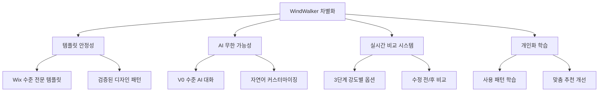

# WindWalker AI 대화식 웹사이트 빌더 PRD/MRD

## 📋 문서 개요

**문서 타입**: Product Requirements Document (PRD) / Marketing Requirements Document (MRD)  
**제품명**: WindWalker AI Website Builder  
**버전**: 1.0  
**작성일**: 2025년 7월 31일  
**대상 시장**: 전 세계 노코드/로우코드 웹사이트 빌더 시장

---

# 🎯 EXECUTIVE SUMMARY

## 제품 비전
**"AI와 대화하며 만드는 전문가급 웹사이트"**

WindWalker AI Website Builder는 **템플릿의 안정성**과 **AI의 무한한 가능성**을 결합하여, 비기술자도 전문가 수준의 웹사이트를 대화만으로 제작할 수 있는 혁신적인 플랫폼입니다.

## 핵심 차별화 포인트
1. **하이브리드 접근법**: 템플릿 기반 시작 + AI 대화식 무한 커스터마이징
2. **3단계 강도별 AI 제안**: 보수적/균형적/대담한 옵션으로 사용자 선택권 보장
3. **실시간 비교 미리보기**: 수정 전/후 즉시 비교로 안전한 의사결정
4. **학습하는 AI**: 사용할수록 개인 맞춤 추천 정확도 향상

---

# 📊 MARKET ANALYSIS

## 시장 규모 및 트렌드

### 글로벌 웹사이트 빌더 시장
- **현재 시장 규모**: $2.4B (2024)
- **예상 성장률**: CAGR 9.4% (2024-2029)
- **2029년 예상 규모**: $3.8B

### 주요 트렌드
1. **AI 통합 가속화**: 73%의 웹 빌더가 AI 기능 도입 계획
2. **노코드 시장 확대**: 연 40% 성장률로 급성장
3. **개인화 수요 증가**: 맞춤형 디자인에 대한 니즈 200% 증가
4. **모바일 퍼스트**: 모바일 트래픽 60% 돌파로 반응형 디자인 필수

## 경쟁 분석

### 직접 경쟁사
| 경쟁사 | 강점 | 약점 | 시장점유율 |
|--------|------|------|------------|
| **Wix** | 375+ 템플릿, 직관적 UI | 수동 작업 중심, 시간 소모 | 23% |
| **Webflow** | 전문적 제어, 코드 수준 정밀도 | 높은 학습 곡선 | 8% |
| **Squarespace** | 디자인 품질, 브랜딩 | 유연성 부족 | 12% |

### 신흥 AI 빌더
| 서비스 | 강점 | 약점 | 특징 |
|--------|------|------|-------|
| **Vercel V0** | ChatGPT 유사 UX, React 코드 생성 | 컴포넌트 중심, 템플릿 부족 | 개발자 타겟 |
| **Lovable** | 풀스택 앱 생성, 비기술자 접근 | 디자인 일관성 부족 | 앱 빌더 |
| **Framer AI** | 디자인 자동화, 애니메이션 | 복잡한 인터페이스 | 디자이너 타겟 |

### WindWalker의 경쟁 우위


---

# 🎯 TARGET MARKET & PERSONAS

## Primary Target: 비기술 창업가/프리랜서 (40%)
**Persona: "Sarah the Entrepreneur"**
- **연령**: 28-45세
- **직업**: 스타트업 창업가, 소상공인, 프리랜서
- **Pain Points**: 
  - 웹사이트 필요하지만 개발 지식 없음
  - 외주 비용 부담 (평균 $3,000-10,000)
  - 빠른 MVP 출시 필요
- **Goals**: 비용 효율적으로 전문적인 웹사이트 구축
- **Budget**: $50-200/월

## Secondary Target: 중소기업 마케터 (35%)
**Persona: "Mike the Marketer"**
- **연령**: 25-40세
- **직업**: 마케팅 매니저, 디지털 마케터
- **Pain Points**:
  - 랜딩페이지 빈번한 A/B 테스트 필요
  - IT 팀 의존도 높음 (평균 2주 대기)
  - 캠페인별 맞춤 페이지 제작 시간 부족
- **Goals**: 독립적이고 빠른 마케팅 자산 제작
- **Budget**: $100-500/월

## Tertiary Target: 웹 에이전시/프리랜서 (25%)
**Persona: "Alex the Agency Owner"**
- **연령**: 30-50세
- **직업**: 웹 에이전시 대표, 프리랜서 개발자
- **Pain Points**:
  - 클라이언트 수정 요청 처리 시간 과다
  - 초기 프로토타입 제작 시간 단축 필요
  - 반복적인 작업의 자동화 요구
- **Goals**: 생산성 향상으로 더 많은 프로젝트 처리
- **Budget**: $200-1000/월

---

# 🚀 PRODUCT VISION & STRATEGY

## 제품 미션
**"모든 사람이 AI와 대화만으로 전문가급 웹사이트를 만들 수 있는 세상"**

## 핵심 가치 제안 (Value Proposition)

### 1. 시간 단축 (Time-to-Market)
- **현재**: 웹사이트 제작 평균 4-8주
- **WindWalker**: 1-3일로 단축 (90% 시간 절약)

### 2. 비용 절감 (Cost Efficiency)
- **현재**: 외주 제작 평균 $5,000-15,000
- **WindWalker**: 월 $99-299 (95% 비용 절약)

### 3. 품질 보장 (Professional Quality)
- **현재**: 품질 편차 크고 수정 어려움
- **WindWalker**: 템플릿 기반 일관된 품질 + AI 맞춤화

### 4. 접근성 (Accessibility)
- **현재**: 기술 지식 또는 디자인 감각 필요
- **WindWalker**: 자연어 대화만으로 제작 가능

## 제품 로드맵

### Phase 1: Foundation (Q3 2025)
**MVP 출시**: 기본 템플릿 5개 + AI 대화 커스터마이징
```
✅ 템플릿 시스템 (블로그, 쇼핑몰, 포트폴리오, 카페, 회사소개)
✅ AI 의도 파악 엔진
✅ 3단계 강도별 옵션 생성
✅ 실시간 미리보기 비교
```

### Phase 2: Growth (Q4 2025)
**확장 및 최적화**: 템플릿 확대 + 고급 기능
```
🔄 템플릿 20개로 확대 (업종별 특화)
🔄 고급 커스터마이징 옵션
🔄 SEO 최적화 자동화
🔄 다국어 지원 (영어, 일본어)
```

### Phase 3: Scale (Q1 2026)
**플랫폼화**: 생태계 구축 + 고급 기능
```
📋 서드파티 템플릿 마켓플레이스
📋 AI 코파일럿 고도화
📋 팀 협업 기능
📋 화이트라벨 솔루션
```

---

# 💰 BUSINESS MODEL & PRICING

## 수익 모델

### 1. SaaS 구독 모델 (Primary - 85%)
**월간/연간 구독료로 안정적 수익 확보**

### 2. 템플릿 마켓플레이스 (Secondary - 10%)
**프리미엄 템플릿 판매 + 수수료 모델**

### 3. 기업용 화이트라벨 (Enterprise - 5%)
**대기업 맞춤형 솔루션 라이선스**

## 가격 전략

### 💎 Pricing Tiers
```
🆓 FREE TIER (Lead Generation)
- 1개 웹사이트
- 기본 템플릿 3개
- WindWalker 브랜딩 포함
- 월 1GB 대역폭
- 커뮤니티 서포트
Price: $0/월

🚀 STARTER ($49/월)
- 3개 웹사이트
- 모든 기본 템플릿 (20개)
- 무제한 AI 대화
- 월 10GB 대역폭
- 이메일 서포트
- 기본 SEO 도구
Target: 개인 창업가, 소상공인

💪 PROFESSIONAL ($129/월)
- 10개 웹사이트
- 프리미엄 템플릿 포함 (50개)
- 커스텀 도메인
- 월 50GB 대역폭
- 고급 분석 도구
- 우선 서포트
- A/B 테스트 기능
Target: 중소기업, 마케터

🏢 ENTERPRISE ($299/월)
- 무제한 웹사이트
- 모든 템플릿 + 커스텀 템플릿
- 화이트라벨 옵션
- 무제한 대역폭
- 전담 어카운트 매니저
- API 액세스
- 팀 협업 도구
Target: 에이전시, 대기업
```

### 💡 Pricing Psychology
- **Free Tier**: Lead Magnet으로 사용자 유입
- **Starter**: $49 → 심리적 $50 미만 가격대
- **Professional**: Most Popular 배지로 유료 전환 유도
- **Enterprise**: Value-based pricing으로 고수익 확보

---

# 📈 GROWTH HACKING & AARR FRAMEWORK

## 🎯 AARR 전략 Overview

```mermaid
funnel
    title AARR Growth Funnel
    "Acquisition (획득)" : 100000
    "Activation (활성화)" : 25000
    "Retention (리텐션)" : 15000
    "Revenue (수익)" : 7500
    "Referral (추천)" : 2250
```

---

## 🎪 ACQUISITION (사용자 획득)

### 목표: 월 10,000 신규 가입자 달성

#### 1. 콘텐츠 마케팅 (40% 기여도)
**"AI로 만드는 웹사이트" 교육 콘텐츠 중심**

```
📝 블로그 콘텐츠 전략:
- "ChatGPT처럼 대화로 웹사이트 만들기"
- "Wix vs WindWalker: AI가 바꾸는 웹사이트 제작"
- "30분만에 쇼핑몰 만들기: AI 마법사 튜토리얼"
- "2025년 웹사이트 트렌드: AI가 이끄는 노코드 혁명"

📺 YouTube 채널:
- "WindWalker 튜토리얼" 시리즈
- "전문가 vs AI: 웹사이트 제작 대결"
- "성공 사례: AI로 만든 웹사이트들"
```

#### 2. SEO & 검색 마케팅 (25% 기여도)
**타겟 키워드**: "AI 웹사이트 빌더", "대화형 웹사이트 제작", "노코드 홈페이지"

```
🔍 SEO 전략:
- 롱테일 키워드: "ChatGPT로 웹사이트 만들기"
- 로컬 SEO: "AI 홈페이지 제작 서비스"
- 이미지 SEO: 비포/애프터 웹사이트 갤러리

💰 검색 광고:
- Google Ads: CPC $2-5 타겟
- 네이버 검색광고: 국내 시장 타겟
```

#### 3. 소셜 미디어 & 바이럴 (20% 기여도)
**"AI 웹사이트 챌린지" 캠페인**

```
📱 TikTok/Instagram Reels:
- "#AI웹사이트챌린지": 30초만에 웹사이트 만들기
- "Before & After": 기존 vs AI 제작 웹사이트 비교
- "AI에게 이상한 웹사이트 주문해보기" 시리즈

🐦 Twitter/X:
- AI 웹개발 트윗 스레드
- 매일 "오늘의 AI 웹사이트" 공유
- 개발자 커뮤니티 참여
```

#### 4. 파트너십 & 제휴 (15% 기여도)

```
🤝 전략적 파트너십:
- 창업 인큐베이터와 제휴 (무료 크레딧 제공)
- 디지털 마케팅 에이전시 파트너 프로그램
- 유튜버/인플루언서 협업 (레퍼럴 프로그램)
- 스타트업 커뮤니티 스폰서십
```

---

## ⚡ ACTIVATION (사용자 활성화)

### 목표: 가입 후 7일 내 첫 웹사이트 완성률 60%

#### "Aha Moment" 정의
**"AI와 대화로 내 웹사이트가 실제로 만들어지는 순간"**
- 측정 지표: 첫 AI 응답 후 템플릿 적용까지 완료
- 목표 시간: 가입 후 10분 내

#### 온보딩 최적화 전략

##### 1. 3-Step Magic Onboarding
```
Step 1: "당신은 무엇을 만들고 싶나요?"
→ 간단한 질문으로 의도 파악 (30초)

Step 2: "AI가 추천하는 템플릿을 확인해보세요"
→ 개인화된 템플릿 3개 추천 (1분)

Step 3: "AI와 대화로 더 멋지게 만들어보세요"
→ 첫 커스터마이징 경험 (5분)
```

##### 2. Progress Gamification
```
🎮 진행률 바 + 성취 배지:
- "첫 대화 완료" 배지
- "템플릿 마스터" 배지  
- "AI 협업자" 배지
- "웹사이트 크리에이터" 배지

🏆 Milestone Rewards:
- 첫 웹사이트 완성: 프리미엄 템플릿 1개 무료
- 5개 웹사이트 완성: 1개월 Pro 기능 무료
```

##### 3. Smart Nudging System
```
📧 이메일 시퀀스:
Day 0: 환영 + 첫 단계 가이드
Day 1: "5분만에 첫 웹사이트 완성하기" (미완성자 대상)
Day 3: 성공 사례 + 팁 공유
Day 7: 특별 할인 혜택 (유료 전환 유도)

📱 인앱 알림:
- "AI가 새로운 아이디어를 제안했어요!"
- "비슷한 사용자들이 이런 기능을 좋아해요"
```

---

## 🔄 RETENTION (리텐션)

### 목표: 월간 활성 사용자(MAU) 리텐션 75%

#### 리텐션 전략

##### 1. 개인화 AI 경험
```
🤖 AI 진화 시스템:
- 사용할수록 더 정확한 추천
- "당신의 AI 어시스턴트가 레벨업했어요!"
- 개인 취향 학습 진행률 시각화

📊 개인 대시보드:
- "이번 달 만든 웹사이트" 갤러리
- "AI와의 대화 통계"
- "절약한 시간/비용" 계산기
```

##### 2. 지속적 가치 제공
```
🔄 Weekly Value Drops:
- 매주 새로운 템플릿 2개 추가
- "이번 주 트렌드" AI 기능 업데이트
- 성공 사례 및 사용 팁 공유

📈 성장 지원:
- 웹사이트 성능 분석 리포트
- SEO 최적화 자동 제안
- 트래픽 증가 팁 개인화 추천
```

##### 3. 커뮤니티 구축
```
👥 WindWalker 커뮤니티:
- "AI 웹사이트 갤러리" - 사용자 작품 전시
- "월간 베스트 웹사이트" 투표 이벤트
- "AI 프롬프트 팁" 공유 게시판
- 사용자 간 피드백 및 협업
```

---

## 💰 REVENUE (수익화)

### 목표: 무료→유료 전환율 15%, 평균 고객생애가치(LTV) $2,400

#### 전환 최적화 전략

##### 1. 가치 기반 페이월
```
🚧 Smart Paywall Triggers:
- 3개 웹사이트 완성 후 → "더 많은 프로젝트를 위해 업그레이드"
- 고급 AI 기능 사용 시도 → "프로 AI 기능으로 더 정교한 커스터마이징"
- 트래픽 한계 도달 → "성장하는 비즈니스를 위한 무제한 플랜"
```

##### 2. 가치 증명 (Value Demonstration)
```
💡 ROI 계산기:
- "WindWalker로 절약한 시간: 32시간 ($1,600 상당)"
- "외주 대비 절약한 비용: $4,500"
- "더 빠른 출시로 얻은 기회비용: $10,000"

📊 성과 대시보드:
- 웹사이트 방문자 수 증가율
- 전환율 개선 현황
- 비즈니스 성장 지표
```

##### 3. 맞춤형 업그레이드 제안
```
🎯 AI 기반 개인화:
- 사용 패턴 분석 → 최적 플랜 추천
- "당신 같은 사용자의 90%가 Professional 플랜을 선택했어요"
- 특정 기능 사용량 → 해당 기능 강화 플랜 제안
```

---

## 🔗 REFERRAL (추천)

### 목표: 추천을 통한 신규 가입 20%, 바이럴 계수 1.3

#### 바이럴 메커니즘

##### 1. 자연스러운 공유 유도
```
📤 Built-in Sharing:
- "AI로 만든 웹사이트 자랑하기" 기능
- SNS 공유 시 "Made with WindWalker AI" 워터마크
- "친구가 만든 웹사이트 보기" 기능

🏆 자랑할 거리 제공:
- "30분만에 완성" 배지
- "AI 협업 마스터" 인증
- 성과 지표 시각화 (방문자, 전환율 등)
```

##### 2. 인센티브 기반 추천 프로그램
```
🎁 Win-Win 리워드:
- 추천인: 추천 성공 시 1개월 무료 크레딧
- 피추천인: 가입 시 첫 달 50% 할인
- 보너스: 5명 추천 성공 시 1년 무료 업그레이드

💝 특별 이벤트:
- "친구와 함께 웹사이트 만들기" 챌린지
- "팀 프로젝트" 무료 협업 기능 제공
```

##### 3. 네트워크 효과 극대화
```
🌐 생태계 구축:
- 사용자 제작 템플릿 마켓플레이스
- 서비스 제공자 네트워크 (디자이너, 개발자)
- WindWalker 파트너 에이전시 프로그램

📈 바이럴 루프:
웹사이트 방문자 → "How was this made?" → WindWalker 발견 → 가입
```

---

# 📊 SUCCESS METRICS & KPIs

## 🎯 Phase 1 목표 (첫 6개월)

### Acquisition Metrics
- **월간 신규 가입자**: 10,000명
- **CAC (Customer Acquisition Cost)**: $15
- **채널별 전환율**: 
  - 유기적 검색: 3.5%
  - 소셜 미디어: 2.1%
  - 콘텐츠 마케팅: 4.2%

### Activation Metrics
- **온보딩 완료율**: 60%
- **첫 웹사이트 완성률**: 45%
- **Time to Value**: 평균 8분

### Retention Metrics  
- **Day 1 리텐션**: 40%
- **Day 7 리텐션**: 25%
- **Day 30 리텐션**: 15%
- **MAU**: 75,000명

### Revenue Metrics
- **무료→유료 전환율**: 12%
- **월간 반복 수익(MRR)**: $180,000
- **고객생애가치(LTV)**: $1,800
- **LTV/CAC 비율**: 120:1

### Referral Metrics
- **추천 가입 비율**: 15%
- **바이럴 계수**: 1.2
- **NPS (Net Promoter Score)**: 45+

---

# 🚀 GO-TO-MARKET STRATEGY

## 출시 전략 (3-Phase Launch)

### Phase 1: Stealth Launch (Week 1-2)
**내부 팀 + 베타 테스터 50명**
```
🎯 목표: 핵심 기능 검증 + 초기 피드백
📋 활동:
- 내부 QA 및 버그 수정
- 베타 테스터 피드백 수집
- 온보딩 플로우 최적화
- 초기 콘텐츠 및 템플릿 완성도 검증
```

### Phase 2: Soft Launch (Week 3-4)  
**선별된 커뮤니티 + 인플루언서 500명**
```
🎯 목표: 제품-시장 적합성 검증 + 초기 바이럴
📋 활동:
- Product Hunt 런칭 준비
- 키 오피니언 리더 대상 데모
- 초기 성공 사례 수집
- 소셜 미디어 버즈 생성
```

### Phase 3: Public Launch (Week 5+)
**전면 공개 + 마케팅 풀 가동**
```
🎯 목표: 대규모 사용자 유입 + 브랜드 인지도 구축
📋 활동:
- Product Hunt 공식 런칭
- 미디어 보도자료 배포
- 유료 광고 캠페인 시작
- 인플루언서 파트너십 활성화
```

---

# 🎯 COMPETITIVE POSITIONING

## 포지셔닝 맵

```
복잡성 (낮음 ← → 높음)
     ↑
쉬움  |  WindWalker    |  Webflow
     |     🎯          |    ⚡
     |                |
AI   |  Wix      -------|------ Squarespace
기반  |   📦           |      🎨
     |                |
     |  Lovable       |  Framer
없음  |    🤖          |    🎭
     ↓
전문성 (낮음 ← → 높음)
```

## 메시징 전략

### Primary Message
**"ChatGPT처럼 대화로, Wix처럼 쉽게, 전문가처럼 완벽하게"**

### Supporting Messages
1. **속도**: "5분 대화로 5일 작업 완성"
2. **품질**: "AI가 만드는 전문가급 결과물"  
3. **접근성**: "코딩 없이, 디자인 지식 없이"
4. **개인화**: "사용할수록 똑똑해지는 나만의 AI"

### 경쟁사 대비 차별화 메시지

#### vs Wix
> "Wix의 템플릿 + AI의 마법 = 무한한 가능성"

#### vs Webflow  
> "Webflow의 전문성, AI가 대신 처리해드립니다"

#### vs AI 빌더들
> "안전한 템플릿 기반에서 시작하는 AI 혁신"

---

# 💡 GROWTH HACKING TACTICS

## 🔥 High-Impact Quick Wins

### 1. "AI 웹사이트 챌린지" 바이럴 캠페인
```
📱 TikTok/Instagram Challenge:
#AIWebsiteChallenge - "30초만에 웹사이트 만들기"
- 상금: 1년 무료 구독 + $1,000 상당 마케팅