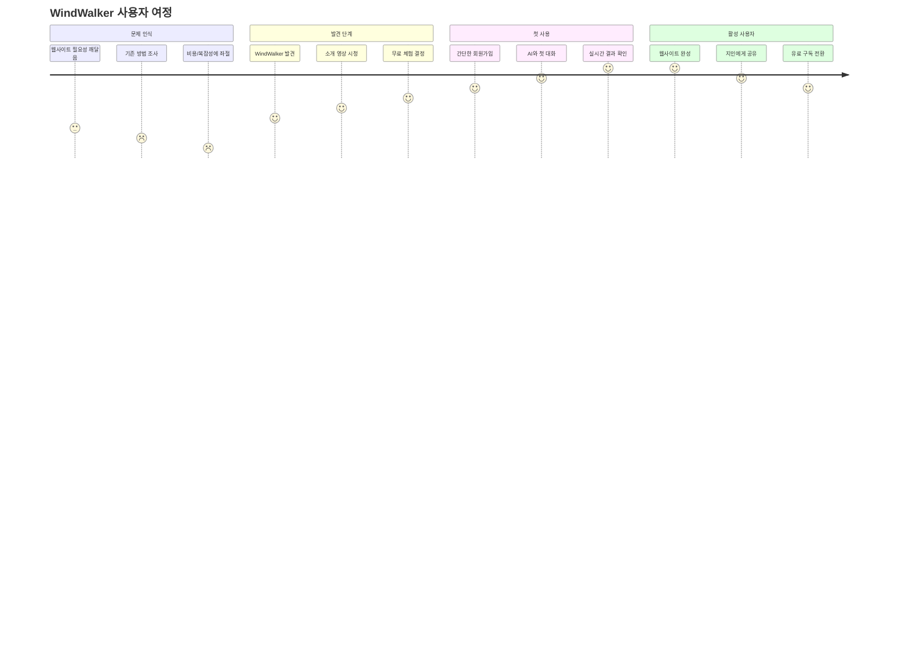
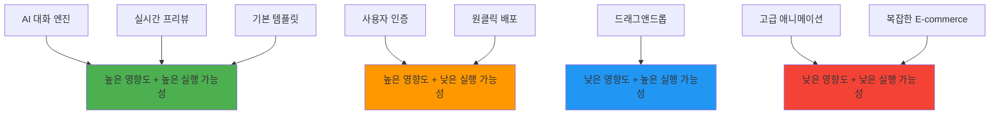
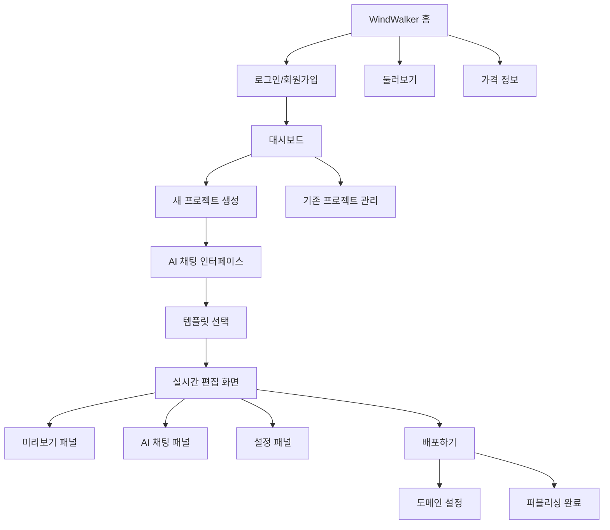
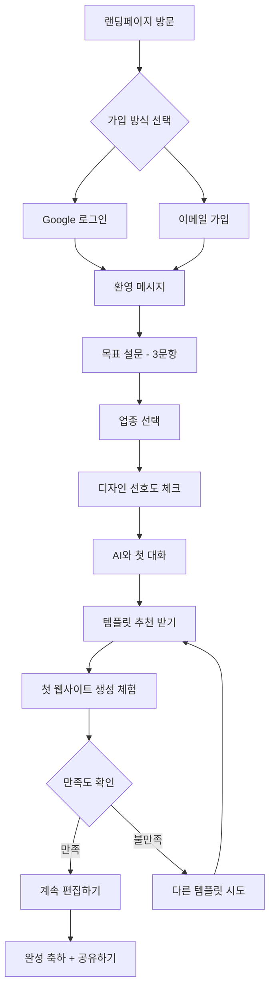
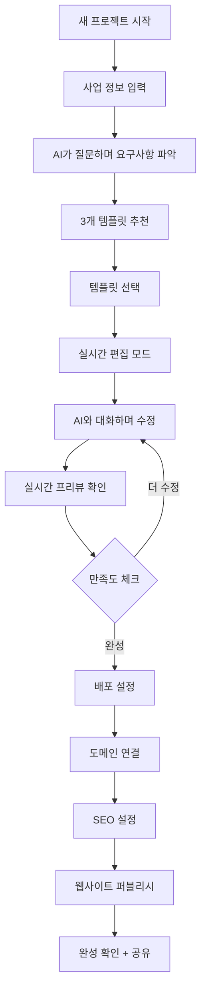
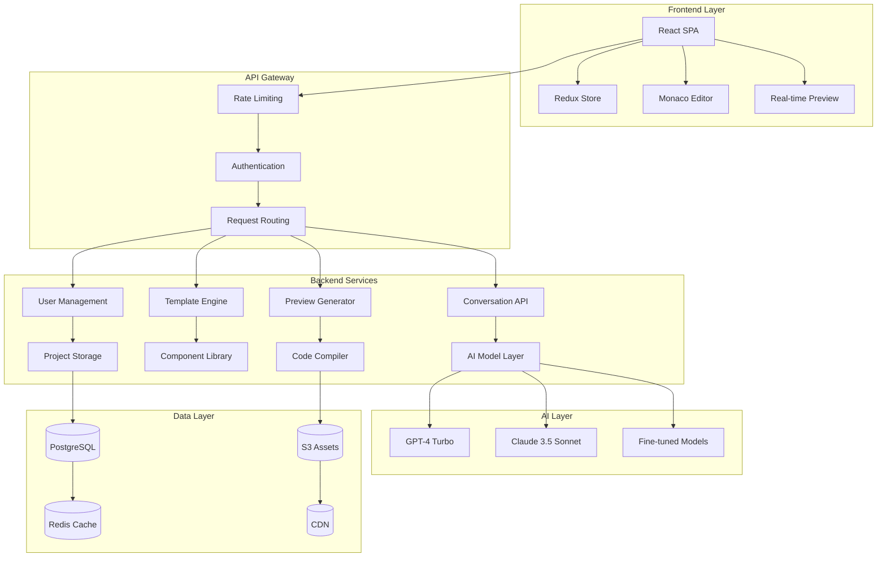
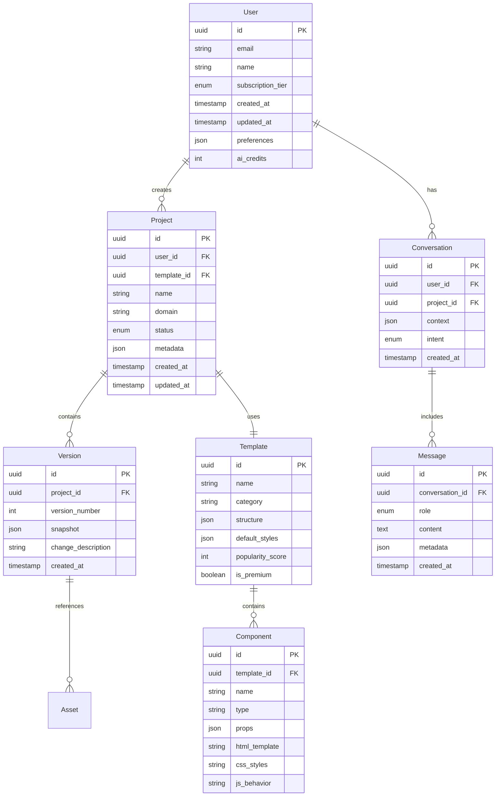
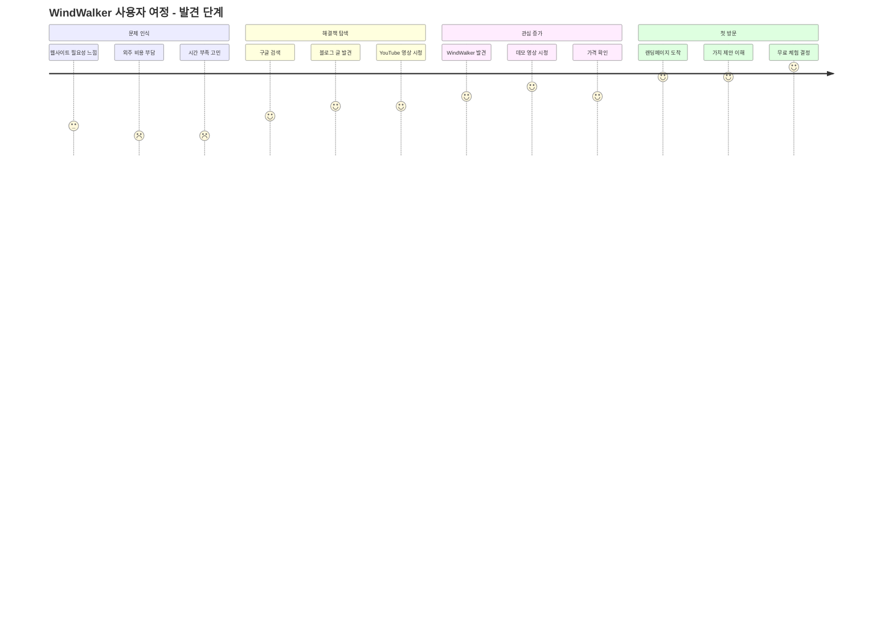

# WindWalker AI 대화식 웹사이트 빌더 PRD
## Product Requirements Document (PRD)

---

**문서 버전:** v1.0  
**작성일:** 2025년 1월  
**작성자:** Product Team  
**승인자:** CEO, CTO  

---

## 📋 목차

1. [프로젝트 개요](#1-프로젝트-개요)
2. [시장 분석 및 기회](#2-시장-분석-및-기회)
3. [사용자 분석](#3-사용자-분석)
4. [제품 비전 및 목표](#4-제품-비전-및-목표)
5. [핵심 기능 정의](#5-핵심-기능-정의)
6. [사용자 경험 설계](#6-사용자-경험-설계)
7. [시스템 아키텍처](#7-시스템-아키텍처)
8. [기술 스택](#8-기술-스택)
9. [보안 및 개인정보보호](#9-보안-및-개인정보보호)
10. [성능 요구사항](#10-성능-요구사항)
11. [Growth Hacking 전략](#11-growth-hacking-전략)
12. [제품 기능 상세 명세](#12-제품-기능-상세-명세)
13. [기술 아키텍처 상세](#13-기술-아키텍처-상세)
14. [데이터 모델 설계](#14-데이터-모델-설계)
15. [배포 및 운영](#15-배포-및-운영)
16. [재무 예측](#16-재무-예측)
17. [성공 지표 및 KPI](#17-성공-지표-및-kpi)
18. [사용자 경험(UX) 설계](#18-사용자-경험ux-설계)
19. [품질 보증 및 테스트 전략](#19-품질-보증-및-테스트-전략)

---

## 1. 프로젝트 개요

### 1.1 프로젝트 명
**WindWalker AI** - 대화식 웹사이트 빌더

### 1.2 프로젝트 비전
"코딩 지식 없이도 누구나 AI와 대화만으로 전문적인 웹사이트를 만들 수 있는 혁신적인 플랫폼"

### 1.3 핵심 가치 제안
- **Zero-Code Creation**: 코딩 없이 자연어 대화만으로 웹사이트 제작
- **Real-time Preview**: 변경사항을 즉시 확인할 수 있는 실시간 미리보기
- **AI-Powered Intelligence**: GPT-4 기반 맞춤형 디자인 및 기능 제안
- **Professional Output**: 반응형 디자인과 최신 웹 표준을 준수하는 고품질 결과물

### 1.4 문제 정의
기존 웹사이트 제작 방식의 한계점:
- **높은 진입 장벽**: HTML, CSS, JavaScript 지식 필요
- **비용 부담**: 외주 개발 비용 월 300만원~1,000만원
- **시간 소요**: 기획부터 완성까지 4-12주 소요
- **수정의 어려움**: 완성 후 수정이 복잡하고 비용 발생

### 1.5 솔루션 개요
WindWalker AI는 AI 기반 대화형 인터페이스를 통해:
- **10분 내 프로토타입** 완성 가능
- **무제한 수정**: 실시간 대화로 즉시 변경
- **전문가 수준 결과물**: 반응형 디자인, SEO 최적화 자동 적용
- **원클릭 배포**: 완성 즉시 실제 웹사이트로 배포

---

## 2. 시장 분석 및 기회

### 2.1 시장 규모 (TAM, SAM, SOM)
```
🌍 Total Addressable Market (TAM): $50B
- 글로벌 웹사이트 빌더 시장 규모
- 연평균 성장률(CAGR): 12.4%

🎯 Serviceable Addressable Market (SAM): $8B  
- 한국, 일본, 동남아시아 중소기업 및 개인 시장
- 언어 장벽 및 현지화 가능 시장

💰 Serviceable Obtainable Market (SOM): $100M
- 초기 5년간 목표 가능한 시장 점유율 1.25%
- 한국 시장 우선 진출 후 아시아 확장
```

### 2.2 경쟁사 분석
| 경쟁사 | 강점 | 약점 | 차별화 포인트 |
|--------|------|------|---------------|
| **Wix** | 템플릿 다양성, 브랜드 인지도 | 복잡한 인터페이스, 학습 곡선 | AI 대화형 제작 vs 드래그앤드롭 |
| **Squarespace** | 디자인 퀄리티, 모바일 최적화 | 높은 가격, 제한적 커스터마이징 | 실시간 AI 수정 vs 템플릿 기반 |
| **WordPress.com** | 생태계, 확장성 | 복잡성, 기술적 장벽 | 자연어 대화 vs 플러그인 설정 |
| **Webflow** | 전문가용 기능, 코드 품질 | 높은 학습 곡선, 가격 | AI 자동화 vs 수동 디자인 |

### 2.3 시장 기회
**🔥 트렌드 1: No-Code/Low-Code 급성장**
- 2024년 기준 시장 규모 $13.2B → 2028년 $45.5B 예상
- 기업의 디지털 전환 가속화로 인한 수요 폭증

**🤖 트렌드 2: AI 도구 대중화**
- ChatGPT 사용자 1억 명 돌파 (출시 후 2개월)
- AI 기반 생산성 도구에 대한 수용도 급상승

**📱 트렌드 3: 개인 브랜딩 중요성 증가**
- 1인 기업, 프리랜서, 크리에이터 경제 성장
- 개인 웹사이트 필요성 증대

---

## 3. 사용자 분석

### 3.1 Primary Persona: "바쁜 사업자 김대표"
```
👤 기본 정보:
- 나이: 35-45세
- 직업: 중소기업 대표, 프리랜서, 전문직
- 기술 수준: 기본적인 컴퓨터 사용 가능, 코딩 경험 없음

🎯 목표:
- 비즈니스 홍보용 웹사이트 필요
- 빠르고 저렴하게 전문적인 결과물 원함
- 지속적인 업데이트와 관리 편의성 중시

😫 Pain Points:
- "웹사이트 만들고 싶지만 어디서부터 시작해야 할지 모르겠어요"
- "외주 맡기면 비싸고, 수정할 때마다 추가 비용이 들어요"
- "기존 툴들은 너무 복잡해서 배우기 어려워요"

💡 WindWalker 솔루션:
- AI와 대화로 10분 만에 프로토타입 완성
- 월 4만원으로 무제한 수정 가능
- "헤더 색깔 바꿔줘" 같은 자연어로 즉시 수정
```

### 3.2 Secondary Persona: "창업 준비생 이민지"
```
👤 기본 정보:
- 나이: 25-35세
- 직업: 예비 창업자, 스타트업 초기 팀원
- 기술 수준: 앱 사용에 능숙, 기본적인 마케팅 지식 보유

🎯 목표:
- MVP(최소 기능 제품) 랜딩페이지 빠른 제작
- A/B 테스트를 통한 가설 검증
- 투자 유치용 데모 사이트 필요

😫 Pain Points:
- "아이디어는 있는데 구현할 개발자가 없어요"
- "빠르게 테스트해보고 싶은데 시간과 비용이 부담돼요"
- "디자인 감각이 없어서 예쁘게 못 만들겠어요"

💡 WindWalker 솔루션:
- 스타트업 특화 템플릿 제공
- A/B 테스트 기능 내장
- AI가 트렌디한 디자인 자동 제안
```

### 3.3 Tertiary Persona: "학원 운영자 박선생"
```
👤 기본 정보:
- 나이: 40-55세
- 직업: 교육 서비스업 (학원, 과외, 온라인 강의)
- 기술 수준: 스마트폰 앱 사용 가능, PC 기본 작업 가능

🎯 목표:
- 학원 소개 및 수강 신청 웹사이트
- 학생/학부모와의 소통 채널 구축
- 온라인 수업 예약 시스템 필요

😫 Pain Points:
- "학원 홍보용 웹사이트가 필요한데 예산이 부족해요"
- "예약 시스템 같은 기능도 필요한데 너무 복잡해요"
- "코로나 이후 온라인 수업 수요가 늘었는데 대응이 어려워요"
```

### 3.4 사용자 여정 맵 (User Journey)


---

## 4. 제품 비전 및 목표

### 4.1 제품 비전
"AI 기술을 통해 웹사이트 제작의 민주화를 실현하여, 누구나 자신의 아이디어를 온라인에서 표현할 수 있는 세상을 만든다"

### 4.2 제품 미션
"복잡한 기술적 장벽 없이, 대화만으로 전문적인 웹사이트를 만들 수 있는 혁신적인 경험을 제공한다"

### 4.3 핵심 목표 (OKR)

#### Objective 1: 사용자 확보 및 활성화
- **KR1**: 월간 활성 사용자(MAU) 10,000명 달성 (12개월 내)
- **KR2**: 신규 가입자의 첫 웹사이트 완성률 60% 달성
- **KR3**: 사용자 추천 지수(NPS) 50점 이상 달성

#### Objective 2: 제품 품질 및 성능 최적화  
- **KR1**: AI 응답 시간 평균 3초 이내 달성
- **KR2**: 웹사이트 완성도 만족점수 4.5/5점 이상
- **KR3**: 시스템 가용성 99.9% 이상 유지

#### Objective 3: 비즈니스 성장 및 수익화
- **KR1**: 월 반복 수익(MRR) $50,000 달성
- **KR2**: 유료 전환율 15% 달성  
- **KR3**: 고객 생애 가치(LTV) $300 이상 달성

### 4.4 성공 지표 정의
```
📊 North Star Metric: Weekly Active Websites
- 정의: 주간 활성 웹사이트 수 (1회 이상 편집되는 사이트)
- 목표: 1년 내 5,000개 달성
- 측정: AI 대화 세션 수, 프리뷰 조회 수, 퍼블리싱 수

🎯 Leading Indicators:
- 신규 가입자 수 (주간)
- 첫 웹사이트 완성률 (%)  
- AI 대화 완료율 (%)
- 프리뷰 조회 시간 (분)

📈 Lagging Indicators:
- 월간 반복 수익 (MRR)
- 고객 생애 가치 (LTV)
- 사용자 추천 지수 (NPS)
- 시장 점유율 (%)
```

---

## 5. 핵심 기능 정의

### 5.1 MVP (Minimum Viable Product) 기능

#### 5.1.1 AI 대화 엔진 (Core Feature)
```
🧠 자연어 처리 능력:
- 웹사이트 제작 의도 파악 (90% 정확도 목표)
- 디자인 선호도 추출 (색상, 레이아웃, 스타일)
- 비즈니스 요구사항 분석 (업종, 타겟 고객, 주요 기능)

💬 대화 흐름 관리:
- 단계별 질문 시스템 (5-7단계)
- 컨텍스트 유지 및 이전 대화 참조
- 실시간 제안 및 대안 제시

🎨 디자인 제안 시스템:
- 3가지 난이도별 옵션 제공 (보수적/균형적/대담한)
- 트렌드 기반 색상 팔레트 추천
- 업종별 레이아웃 템플릿 매칭
```

#### 5.1.2 실시간 프리뷰 시스템
```
⚡ 즉시 렌더링:
- 코드 변경 후 2초 이내 프리뷰 업데이트
- WebSocket 기반 실시간 동기화
- 모바일/태블릿/데스크톱 반응형 미리보기

🔄 상태 관리:
- 변경 이력 추적 (무제한 Undo/Redo)
- 자동 저장 (30초마다)
- 버전 관리 시스템

👁️ 비교 기능:
- Before/After 비교뷰
- A/B 테스트 옵션
- 다중 화면 크기 동시 프리뷰
```

#### 5.1.3 템플릿 시스템
```
📁 카테고리별 템플릿 (Phase 1: 20개):
├── 비즈니스 (5개)
│   ├── 기업 소개
│   ├── 컨설팅  
│   ├── 법무/회계
│   ├── 부동산
│   └── 스타트업
├── 서비스 (5개)
│   ├── 카페/레스토랑
│   ├── 헬스/피트니스
│   ├── 교육/학원
│   ├── 의료/클리닉
│   └── 미용/살롱
├── 크리에이티브 (5개)
│   ├── 포트폴리오
│   ├── 사진작가
│   ├── 디자이너
│   ├── 아티스트
│   └── 에이전시
└── E-commerce (5개)
    ├── 온라인 쇼핑몰
    ├── 패션/의류
    ├── 핸드메이드
    ├── 식품/음료
    └── 디지털 상품

🎨 스마트 매칭:
- AI가 사용자 요구사항 분석 후 최적 템플릿 3개 추천
- 업종별 전문 디자인 패턴 적용
- 사용자 피드백 기반 템플릿 개선
```

### 5.2 Phase 2 기능 (Post-MVP)

#### 5.2.1 고급 AI 기능
- **컨텐츠 자동 생성**: 업종에 맞는 텍스트 콘텐츠 AI 작성
- **이미지 추천**: Unsplash/Pexels 연동으로 관련 이미지 자동 제안
- **SEO 최적화**: 메타 태그, 키워드, 구조화 데이터 자동 생성

#### 5.2.2 고급 편집 기능
- **드래그앤드롭 에디터**: 대화 + 시각적 편집 하이브리드
- **커스텀 CSS**: 고급 사용자를 위한 코드 편집 기능
- **애니메이션 효과**: 스크롤 애니메이션, 호버 효과 등

#### 5.2.3 비즈니스 기능
- **도메인 연결**: 개인 도메인 연결 및 SSL 인증서 자동 설치
- **분석 대시보드**: Google Analytics 연동 및 트래픽 분석
- **SEO 도구**: 사이트맵 생성, 로봇 텍스트, 메타 태그 관리

### 5.3 기능 우선순위 매트릭스



---

## 6. 사용자 경험 설계

### 6.1 정보 구조 (Information Architecture)



### 6.2 화면 구성 및 레이아웃

#### 6.2.1 메인 편집 화면 (3-Panel Layout)
```
┌─────────────────────────────────────────────────────────────┐
│ 🎨 WindWalker AI                    [프리뷰] [배포] [설정]    │
├─────────────────────────────────────────────────────────────┤
│                                     │                       │
│                                     │    💬 AI 채팅 패널     │
│                                     │                       │
│         📱 실시간 프리뷰              │  사용자: 헤더 색깔을    │
│                                     │         파란색으로     │
│    [웹사이트 화면이 여기 표시됨]        │         바꿔주세요     │
│                                     │                       │
│                                     │  AI: 네! 파란색으로    │
│                                     │      변경했습니다.     │
│         [Mobile] [Tablet] [Desktop] │      어떤가요?        │
│                                     │                       │
│                                     │  [메시지 입력창]       │
├─────────────────────────────────────┼───────────────────────┤
│ 📊 완성도: 85%  ⏱️ 수정 중...        │ 🎯 제안: 연락처 섹션    │
└─────────────────────────────────────┴───────────────────────┘
```

#### 6.2.2 모바일 레이아웃 (Tab-based)
- **탭 1**: 채팅 - AI와 대화하며 수정 요청
- **탭 2**: 미리보기 - 현재 웹사이트 상태 확인  
- **탭 3**: 설정 - 도메인, SEO, 분석 설정

### 6.3 사용자 플로우 (User Flow)

#### 6.3.1 신규 사용자 온보딩 플로우


#### 6.3.2 웹사이트 제작 플로우


### 6.4 인터랙션 디자인

#### 6.4.1 AI 대화 인터페이스 가이드라인
```typescript
interface ConversationDesign {
  // AI 페르소나
  aiPersonality: {
    name: "윈디 (Windy)",
    tone: "친근하고 전문적",
    characteristics: ["도움이 되는", "창의적인", "인내심 있는"],
    greeting: "안녕하세요! 어떤 웹사이트를 만들어드릴까요? 😊"
  };
  
  // 응답 패턴
  responsePatterns: {
    acknowledgment: "요청사항을 확인했습니다 ✓",
    progress: "변경사항을 적용하고 있어요... ⚡",
    completion: "완료했습니다! 결과를 확인해보세요 🎉",
    suggestion: "이런 것은 어떨까요? 💡",
    clarification: "좀 더 구체적으로 설명해주시겠어요? 🤔"
  };
  
  // 입력 도움말
  inputHelpers: [
    "헤더 색깔을 파란색으로 바꿔주세요",
    "회사 소개 섹션을 추가해주세요", 
    "전체적으로 더 모던하게 만들어주세요",
    "모바일에서 보기 좋게 수정해주세요"
  ];
}
```

#### 6.4.2 실시간 피드백 시스템
- **로딩 애니메이션**: AI가 처리 중일 때 점진적 로딩 표시
- **변경 하이라이트**: 새로 변경된 부분을 시각적으로 강조
- **성공 피드백**: 변경 완료 시 체크마크와 함께 부드러운 애니메이션
- **오류 처리**: 문제 발생 시 친화적인 오류 메시지와 해결 방안 제시

### 6.5 접근성 (Accessibility) 고려사항

#### 6.5.1 웹 접근성 지침 (WCAG 2.1 AA 준수)
- **키보드 접근성**: 모든 기능을 키보드만으로 사용 가능
- **스크린 리더 지원**: 의미있는 alt 텍스트와 ARIA 레이블
- **색상 대비**: 4.5:1 이상의 명도 대비 확보
- **텍스트 크기**: 200%까지 확대해도 가독성 유지

#### 6.5.2 다국어 지원 준비
- **Phase 1**: 한국어 우선 지원
- **Phase 2**: 영어, 일본어 추가
- **i18n 아키텍처**: React i18next 기반 다국어 시스템

---

## 7. 시스템 아키텍처

### 7.1 전체 시스템 구조
```
[사용자 인터페이스]
       ↓
[대화 처리 엔진]
       ↓
[AI 모델 레이어]
       ↓
[코드 생성 엔진]
       ↓
[프리뷰 시스템]


## 7. 시스템 아키텍처

### 7.1 전체 시스템 구조
```
[사용자 인터페이스]
       ↓
[대화 처리 엔진]
       ↓
[AI 모델 레이어]
       ↓
[코드 생성 엔진]
       ↓
[프리뷰 시스템]
       ↓
[배포 시스템]
```

### 7.2 핵심 컴포넌트
- **대화 처리 엔진**: 자연어 이해 및 의도 파악
- **AI 모델 레이어**: GPT-4 기반 코드 생성 AI
- **코드 생성 엔진**: HTML/CSS/JavaScript 자동 생성
- **실시간 프리뷰**: 변경사항 즉시 반영
- **버전 관리**: 프로젝트 히스토리 추적
- **배포 시스템**: 원클릭 웹사이트 배포

### 7.3 데이터 플로우
1. 사용자 요청 입력
2. 자연어 처리 및 의도 분석
3. AI 모델을 통한 코드 생성
4. 실시간 프리뷰 업데이트
5. 사용자 피드백 수집
6. 반복적 개선

## 8. 기술 스택

### 8.1 프론트엔드
- **프레임워크**: React 18+ with TypeScript
- **UI 라이브러리**: Tailwind CSS, Shadcn/ui
- **상태 관리**: Zustand
- **빌드 도구**: Vite
- **코드 에디터**: Monaco Editor

### 8.2 백엔드
- **런타임**: Node.js
- **프레임워크**: Express.js
- **데이터베이스**: PostgreSQL (메인), Redis (캐시)
- **AI 모델**: OpenAI GPT-4, Anthropic Claude
- **웹소켓**: Socket.io (실시간 통신)

### 8.3 인프라
- **클라우드**: AWS
- **컨테이너**: Docker, Kubernetes
- **CDN**: CloudFlare
- **모니터링**: DataDog
- **CI/CD**: GitHub Actions

## 9. 보안 및 개인정보보호

### 9.1 데이터 보안
- 모든 데이터 전송 시 HTTPS 암호화
- 사용자 프로젝트 데이터 AES-256 암호화 저장
- API 키 및 민감 정보 AWS Secrets Manager 관리
- 정기적인 보안 감사 및 침투 테스트

### 9.2 개인정보보호
- GDPR, CCPA 준수
- 사용자 동의 기반 데이터 수집
- 개인정보 삭제 요청 처리 자동화
- 최소한의 데이터 수집 원칙

### 9.3 접근 제어
- JWT 기반 인증 시스템
- 역할 기반 접근 제어 (RBAC)
- API 속도 제한 (Rate Limiting)
- 무차별 대입 공격 방지

## 10. 성능 요구사항

### 10.1 응답 시간
- 대화 응답: 평균 2초 이내
- 코드 생성: 평균 5초 이내
- 프리뷰 업데이트: 1초 이내
- 페이지 로딩: 3초 이내 (초기 로딩)

### 10.2 처리량
- 동시 사용자: 10,000명
- 일일 활성 사용자: 100,000명
- API 요청: 초당 1,000개
- 데이터베이스 쿼리: 초당 5,000개

### 10.3 가용성
- 서비스 가동률: 99.9%
- 장애 복구 시간: 30분 이내
- 백업 및 복원: 24시간 주기

## 💡 GROWTH HACKING TACTICS (계속)

### 1. "AI 웹사이트 챌린지" 바이럴 캠페인 (계속)
```
📱 TikTok/Instagram Challenge:
#AIWebsiteChallenge - "30초만에 웹사이트 만들기"
- 상금: 1년 무료 구독 + $1,000 상당 마케팅 크레딧
- 참여 방법: AI와 대화하는 과정 영상 업로드
- 심사 기준: 창의성, 완성도, 스토리텔링
- 예상 참여자: 50,000명+, 도달: 5M+

🏆 월간 테마 챌린지:
- 1월: "신년 리뉴얼 챌린지"
- 2월: "발렌타인 사이트 챌린지"  
- 3월: "스프링 리프레시 챌린지"
```

### 2. "AI vs 전문가" 대결 시리즈
```
📺 YouTube 컨텐츠 시리즈:
- WindWalker AI vs 프론트엔드 개발자
- WindWalker AI vs UX/UI 디자이너
- WindWalker AI vs 웹 에이전시

⏱️ 포맷:
- 동일한 브리프, 동일한 시간 제한
- 실시간 제작 과정 공개
- 비용 대비 효과 분석
- 시청자 투표로 승부 결정

🎯 목표: AI 성능 입증 + 교육적 가치 제공
```

### 3. "무료 웹사이트 진단 & 리뉴얼" 서비스
```
🔍 진단 프로세스:
1. 기존 웹사이트 URL 입력
2. AI가 자동 분석 (디자인, UX, 성능)
3. 개선점 리포트 생성
4. WindWalker로 리뉴얼 데모 제공

💰 프리미엄화:
- 무료: 기본 진단 + 데모
- 유료: 상세 분석 + 즉시 리뉴얼 가능
- 타겟: 기존 웹사이트 보유 사업자 (우리 타겟의 70%)
```

### 4. "파트너 웹사이트 갤러리" 생태계
```
🎨 크리에이터 생태계:
- 사용자 제작 웹사이트를 갤러리에 전시
- "이달의 베스트 사이트" 선정 및 상금 지급
- 인기 사이트 제작자에게 "크리에이터 뱃지" 부여
- 크리에이터의 템플릿을 마켓플레이스에서 판매 허용

🔄 바이럴 루프:
갤러리 방문자 → 멋진 사이트 발견 → "어떻게 만들었지?" → WindWalker 가입
```

---

# 🛠️ PRODUCT SPECIFICATIONS

## 핵심 기능 상세 명세

### 1. AI 대화 엔진 (Conversation Engine)

#### 1.1 자연어 처리 시스템
```
🧠 의도 파악 (Intent Recognition):
- 웹사이트 유형 분류 (15개 카테고리)
- 디자인 선호도 추출 (색상, 레이아웃, 스타일)
- 기능 요구사항 식별 (쇼핑몰, 예약, 블로그 등)
- 타겟 고객 분석 (B2B, B2C, 연령대, 지역)

💬 대화 플로우:
1. 초기 브리프 수집 (3-5개 질문)
2. 템플릿 추천 및 선택
3. 반복적 개선 대화 (무제한)
4. 실시간 미리보기 업데이트
```

#### 1.2 3단계 강도별 AI 제안 시스템
```
🟢 보수적 (Conservative):
- 기존 디자인 패턴 유지
- 소폭 색상/텍스트 변경
- 안전한 레이아웃 개선
- 예시: "헤더 색상을 좀 더 밝게 조정"

🟡 균형적 (Balanced):
- 트렌디한 요소 추가
- 레이아웃 부분 재구성
- 새로운 섹션/기능 제안
- 예시: "히어로 섹션에 동영상 배경 추가"

🔴 대담한 (Bold):
- 완전히 새로운 디자인 방향
- 실험적 레이아웃
- 최신 트렌드 적극 반영
- 예시: "3D 요소와 패럴랙스 스크롤링 적용"
```

### 2. 템플릿 시스템 (Template System)

#### 2.1 스마트 템플릿 구조
```
📁 템플릿 카테고리 (Phase 1 - 20개):
├── 비즈니스 (5개)
│   ├── 기업 소개 (Corporate)
│   ├── 컨설팅 (Consulting)  
│   ├── 법무/회계 (Professional)
│   ├── 부동산 (Real Estate)
│   └── 스타트업 (Startup)
├── 커머스 (4개)
│   ├── 온라인 쇼핑몰 (E-commerce)
│   ├── 패션 (Fashion)
│   ├── 푸드 (Food & Beverage)
│   └── 핸드메이드 (Handmade)
├── 크리에이티브 (4개)
│   ├── 포트폴리오 (Portfolio)
│   ├── 사진작가 (Photography)
│   ├── 아티스트 (Artist)
│   └── 에이전시 (Creative Agency)
├── 서비스 (4개)
│   ├── 카페/레스토랑 (Restaurant)
│   ├── 헬스/피트니스 (Fitness)
│   ├── 교육 (Education)
│   └── 의료 (Healthcare)
└── 개인 (3개)
    ├── 개인 블로그 (Personal Blog)
    ├── 이력서/CV (Resume)
    └── 이벤트 (Event)
```

#### 2.2 컴포넌트 기반 아키텍처
```
🧩 재사용 가능한 컴포넌트:
- 헤더 (Header): 20가지 변형
- 히어로 섹션 (Hero): 15가지 변형
- 제품/서비스 소개: 12가지 변형
- 팀 소개: 8가지 변형
- 연락처: 10가지 변형
- 푸터 (Footer): 15가지 변형

🎨 디자인 시스템:
- 색상 팔레트: 50개 프리셋
- 타이포그래피: 20개 폰트 조합
- 스페이싱: 일관된 그리드 시스템
- 애니메이션: 30개 인터랙션 패턴
```

### 3. 실시간 프리뷰 시스템

#### 3.1 비교 미리보기 기능
```
👁️ 3-Panel 뷰:
┌─────────────┬─────────────┬─────────────┐
│   현재 버전  │   AI 제안 1  │   AI 제안 2  │
│     (A)     │     (B)     │     (C)     │
│             │             │             │
│  [채택하기]  │  [채택하기]  │  [채택하기]  │
└─────────────┴─────────────┴─────────────┘

📱 반응형 테스트:
- 데스크톱 (1920px)
- 태블릿 (768px)  
- 모바일 (375px)
- 동시 프리뷰 지원
```

#### 3.2 A/B 테스트 통합
```
🧪 자동 A/B 테스트:
- AI가 생성한 변형들을 자동으로 테스트
- 실제 방문자 데이터 기반 최적화
- 전환율, 체류시간, 클릭률 분석
- 승리 변형 자동 적용 옵션

📊 성과 대시보드:
- 실시간 방문자 통계
- 변형별 성과 비교
- 통계적 유의성 계산
- 최적화 추천 리포트
```

---

# 🔧 TECHNICAL ARCHITECTURE

## 시스템 아키텍처 다이어그램



## 기술 스택 상세

### Frontend Stack
```typescript
// 핵심 라이브러리
{
  "react": "^18.2.0",
  "typescript": "^5.0.0", 
  "vite": "^4.4.0",
  "tailwindcss": "^3.3.0",
  
  // 상태 관리
  "zustand": "^4.4.0",
  "react-query": "^3.39.0",
  
  // UI 컴포넌트
  "@radix-ui/react-*": "^1.0.0",
  "framer-motion": "^10.16.0",
  "monaco-editor": "^0.44.0",
  
  // 유틸리티
  "lodash": "^4.17.21",
  "date-fns": "^2.30.0",
  "zod": "^3.22.0"
}
```

### Backend Stack
```javascript
// Node.js 기반 마이크로서비스
{
  // 프레임워크
  "express": "^4.18.0",
  "fastify": "^4.24.0", // 고성능 API용
  
  // AI/ML
  "openai": "^4.12.0",
  "@anthropic-ai/sdk": "^0.6.0",
  "langchain": "^0.0.150",
  
  // 데이터베이스
  "prisma": "^5.4.0",
  "redis": "^4.6.0",
  "aws-sdk": "^2.1479.0",
  
  // 인증/보안
  "jsonwebtoken": "^9.0.0",
  "bcryptjs": "^2.4.3",
  "helmet": "^7.0.0",
  "rate-limiter-flexible": "^3.0.0"
}
```

### Infrastructure
```yaml
# Kubernetes 기반 배포
apiVersion: apps/v1
kind: Deployment
metadata:
  name: windwalker-api
spec:
  replicas: 5
  selector:
    matchLabels:
      app: windwalker-api
  template:
    spec:
      containers:
      - name: api
        image: windwalker/api:latest
        ports:
        - containerPort: 3000
        env:
        - name: NODE_ENV
          value: "production"
        resources:
          requests:
            memory: "512Mi"
            cpu: "250m"
          limits:
            memory: "1Gi"
            cpu: "500m"
```

---

# 📊 데이터 모델 설계

## Core Entity Relationship



## 데이터 스키마 상세

### 1. User Management
```sql
-- 사용자 테이블
CREATE TABLE users (
    id UUID PRIMARY KEY DEFAULT gen_random_uuid(),
    email VARCHAR(255) UNIQUE NOT NULL,
    name VARCHAR(100) NOT NULL,
    password_hash VARCHAR(255) NOT NULL,
    subscription_tier subscription_tier_enum DEFAULT 'free',
    ai_credits INTEGER DEFAULT 100,
    preferences JSONB DEFAULT '{}',
    created_at TIMESTAMP DEFAULT NOW(),
    updated_at TIMESTAMP DEFAULT NOW(),
    last_login_at TIMESTAMP
);

-- 구독 관리
CREATE TABLE subscriptions (
    id UUID PRIMARY KEY DEFAULT gen_random_uuid(),
    user_id UUID REFERENCES users(id) ON DELETE CASCADE,
    plan_id VARCHAR(50) NOT NULL,
    status subscription_status_enum DEFAULT 'active',
    current_period_start TIMESTAMP NOT NULL,
    current_period_end TIMESTAMP NOT NULL,
    created_at TIMESTAMP DEFAULT NOW()
);
```

### 2. Project & Template System
```sql
-- 프로젝트 테이블
CREATE TABLE projects (
    id UUID PRIMARY KEY DEFAULT gen_random_uuid(),
    user_id UUID REFERENCES users(id) ON DELETE CASCADE,
    template_id UUID REFERENCES templates(id),
    name VARCHAR(100) NOT NULL,
    domain VARCHAR(100),
    status project_status_enum DEFAULT 'draft',
    metadata JSONB DEFAULT '{}',
    settings JSONB DEFAULT '{}',
    created_at TIMESTAMP DEFAULT NOW(),
    updated_at TIMESTAMP DEFAULT NOW()
);

-- 템플릿 테이블
CREATE TABLE templates (
    id UUID PRIMARY KEY DEFAULT gen_random_uuid(),
    name VARCHAR(100) NOT NULL,
    category VARCHAR(50) NOT NULL,
    description TEXT,
    thumbnail_url VARCHAR(500),
    structure JSONB NOT NULL,
    default_styles JSONB DEFAULT '{}',
    popularity_score INTEGER DEFAULT 0,
    is_premium BOOLEAN DEFAULT FALSE,
    created_at TIMESTAMP DEFAULT NOW()
);
```

### 3. AI Conversation System
```sql
-- 대화 테이블
CREATE TABLE conversations (
    id UUID PRIMARY KEY DEFAULT gen_random_uuid(),
    user_id UUID REFERENCES users(id) ON DELETE CASCADE,
    project_id UUID REFERENCES projects(id) ON DELETE CASCADE,
    context JSONB DEFAULT '{}',
    intent conversation_intent_enum,
    status conversation_status_enum DEFAULT 'active',
    created_at TIMESTAMP DEFAULT NOW(),
    updated_at TIMESTAMP DEFAULT NOW()
);

-- 메시지 테이블
CREATE TABLE messages (
    id UUID PRIMARY KEY DEFAULT gen_random_uuid(),
    conversation_id UUID REFERENCES conversations(id) ON DELETE CASCADE,
    role message_role_enum NOT NULL, -- 'user', 'assistant', 'system'
    content TEXT NOT NULL,
    metadata JSONB DEFAULT '{}',
    tokens_used INTEGER DEFAULT 0,
    created_at TIMESTAMP DEFAULT NOW()
);
```

---

# 🚀 배포 및 운영

## CI/CD 파이프라인

### GitHub Actions Workflow
```yaml
name: WindWalker CI/CD Pipeline

on:
  push:
    branches: [main, develop]
  pull_request:
    branches: [main]

jobs:
  test:
    runs-on: ubuntu-latest
    steps:
      - uses: actions/checkout@v3
      - name: Setup Node.js
        uses: actions/setup-node@v3
        with:
          node-version: '18'
          cache: 'npm'
      
      - name: Install dependencies  
        run: npm ci
        
      - name: Run tests
        run: npm run test:ci
        
      - name: Run E2E tests
        run: npm run test:e2e
        
      - name: Upload coverage
        uses: codecov/codecov-action@v3

  build-and-deploy:
    needs: test
    runs-on: ubuntu-latest
    if: github.ref == 'refs/heads/main'
    
    steps:
      - name: Build Docker image
        run: |
          docker build -t windwalker/api:${{ github.sha }} .
          docker build -t windwalker/frontend:${{ github.sha }} ./frontend
          
      - name: Push to registry
        run: |
          echo ${{ secrets.DOCKER_PASSWORD }} | docker login -u ${{ secrets.DOCKER_USERNAME }} --password-stdin
          docker push windwalker/api:${{ github.sha }}
          docker push windwalker/frontend:${{ github.sha }}
          
      - name: Deploy to Kubernetes
        run: |
          kubectl set image deployment/windwalker-api api=windwalker/api:${{ github.sha }}
          kubectl set image deployment/windwalker-frontend frontend=windwalker/frontend:${{ github.sha }}
```

## 모니터링 및 알림

### Application Monitoring
```javascript
// 성능 모니터링 설정
const monitoring = {
  // 응답 시간 모니터링
  responseTime: {
    threshold: 2000, // 2초
    alertChannel: '#alerts-performance'
  },
  
  // 에러율 모니터링  
  errorRate: {
    threshold: 0.01, // 1%
    window: '5m',
    alertChannel: '#alerts-errors'
  },
  
  // AI 모델 응답 시간
  aiResponseTime: {
    threshold: 10000, // 10초
    alertChannel: '#alerts-ai'
  },
  
  // 데이터베이스 성능
  dbPerformance: {
    connectionPool: { max: 100, threshold: 80 },
    queryTime: { threshold: 1000 },
    alertChannel: '#alerts-database'
  }
};
```

### Business Metrics Dashboard
```typescript
// 실시간 비즈니스 지표 추적
interface BusinessMetrics {
  // 가입 및 활성화
  signupsToday: number;
  activationRate: number; // 7일 기준
  
  // 수익 지표
  mrr: number; // Monthly Recurring Revenue
  churnRate: number;
  ltv: number; // Customer Lifetime Value
  
  // 사용량 지표
  activeConversations: number;
  aiRequestsPerHour: number;
  websitesCreatedToday: number;
  
  // 품질 지표
  customerSatisfaction: number; // NPS 점수
  supportTickets: number;
  averageResponseTime: number;
}
```

---

# 🔒 보안 및 규정 준수

## 보안 프레임워크

### 1. 인증 및 권한 관리
```typescript
// JWT 기반 인증 시스템
interface AuthSystem {
  // 토큰 관리
  accessToken: {
    expiry: '15m',
    algorithm: 'RS256',
    issuer: 'windwalker.ai'
  };
  
  refreshToken: {
    expiry: '7d',
    storage: 'httpOnly cookie',
    rotation: true
  };
  
  // 권한 기반 접근 제어
  permissions: {
    'project:create': ['free', 'starter', 'professional', 'enterprise'],
    'project:delete': ['starter', 'professional', 'enterprise'],
    'ai:unlimited': ['professional', 'enterprise'],
    'template:premium': ['professional', 'enterprise'],
    'api:access': ['enterprise']
  };
}
```

### 2. 데이터 보호
```typescript
// 암호화 정책
const encryptionPolicy = {
  // 저장 시 암호화
  atRest: {
    algorithm: 'AES-256-GCM',
    keyManagement: 'AWS KMS',
    rotation: '90days'
  },
  
  // 전송 시 암호화
  inTransit: {
    protocol: 'TLS 1.3',
    certificates: 'Let\'s Encrypt',
    hsts: true,
    csp: {
      'default-src': "'self'",
      'script-src': "'self' 'unsafe-inline'",
      'style-src': "'self' 'unsafe-inline'",
      'img-src': "'self' data: https:",
      'connect-src': "'self' https://api.openai.com"
    }
  },
  
  // 개인정보 마스킹
  piiMasking: {
    email: '***@***.com',
    phone: '***-***-****',
    creditCard: '****-****-****-1234'
  }
};
```

### 3. GDPR/CCPA 준수
```typescript
// 개인정보보호 정책
interface PrivacyCompliance {
  // 데이터 수집 최소화
  dataMinimization: {
    required: ['email', 'name'],
    optional: ['phone', 'company', 'preferences'],
    prohibited: ['social_security', 'government_id']
  };
  
  // 사용자 권리 보장
  userRights: {
    access: 'export personal data within 30 days',
    rectification: 'update incorrect data immediately',
    erasure: 'delete account and data within 30 days',
    portability: 'export data in JSON format',
    objection: 'opt-out of marketing communications'
  };
  
  // 쿠키 관리
  cookieConsent: {
    essential: true, // 로그인, 보안
    functional: 'opt-in', // 사용자 경험 개선
    analytics: 'opt-in', // Google Analytics
    marketing: 'opt-in' // 광고 추적
  };
}
```

---

# 📈 비즈니스 모델 상세

## 수익 구조 분석

### 1. 구독 수익 모델 (SaaS)
```typescript
// 구독 계층별 수익 분석
interface RevenueProjection {
  free: {
    users: number;
    conversionRate: 0.15; // 15% → 유료 전환
    acquisitionCost: 15; // CAC $15
    monthlyValue: 0;
  };
  
  starter: {
    price: 49;
    users: number;
    churnRate: 0.05; // 월 5% 이탈
    ltv: 980; // $49 × 20개월 평균 생존
    grossMargin: 0.85; // 85% 마진
  };
  
  professional: {
    price: 129;
    users: number;
    churnRate: 0.03; // 월 3% 이탈  
    ltv: 2580; // $129 × 20개월 평균 생존
    grossMargin: 0.88; // 88% 마진
  };
  
  enterprise: {
    price: 299;
    users: number;
    churnRate: 0.02; // 월 2% 이탈
    ltv: 7175; // $299 × 24개월 평균 생존
    grossMargin: 0.90; // 90% 마진
  };
}
```

### 2. 부수 수익원
```typescript
// 추가 수익 모델
interface AdditionalRevenue {
  // 템플릿 마켓플레이스
  templateMarketplace: {
    commission: 0.30, // 30% 수수료
    averageTemplatePrice: 29,
    monthlyTransactions: 1000,
    monthlyRevenue: 8700 // $29 × 1000 × 30%
  };
  
  // 프리미엄 서비스
  premiumServices: {
    customDesign: 299, // 맞춤 디자인 서비스
    seoOptimization: 199, // SEO 최적화 서비스
    performanceAudit: 149, // 성능 감사 서비스
    monthlyBookings: 50,
    monthlyRevenue: 32350 // 평균 $647 × 50
  };
  
  // 기업용 라이선스
  enterpriseLicensing: {
    whiteLabel: 10000, // 연간 화이트라벨 라이선스
    customIntegration: 25000, // 맞춤 통합 개발
    annualContracts: 12,
    annualRevenue: 420000 // 평균 $35k × 12
  };
}
```

## 단위 경제학 (Unit Economics)

### 고객 생애 가치 (LTV) 계산
```typescript
// LTV 상세 계산
interface LTVCalculation {
  // 구독 계층별 LTV
  ltv = {
    starter: {
      monthlyRevenue: 49,
      averageLifespan: 20, // 개월
      churnRate: 0.05,
      ltv: 49 * (1 / 0.05) // $980
    },
    
    professional: {
      monthlyRevenue: 129,
      averageLifespan: 33, // 개월  
      churnRate: 0.03,
      ltv: 129 * (1 / 0.03) // $4,300
    },
    
    enterprise: {
      monthlyRevenue: 299,
      averageLifespan: 50, // 개월
      churnRate: 0.02,
      ltv: 299 * (1 / 0.02) // $14,950
    }
  };
  
  // 가중 평균 LTV
  weightedAverageLTV: 2400; // 구독 분포 고려
}
```

### 고객 획득 비용 (CAC) 분석
```typescript
// CAC 채널별 분석
interface CACAnalysis {
  channels: {
    organicSearch: {
      cost: 5, // SEO 투자 대비
      conversionRate: 0.045,
      quality: 'high' // 높은 의도성
    },
    
    paidSearch: {
      cost: 25, // Google Ads
      conversionRate: 0.025,
      quality: 'medium' // 상업적 의도
    },
    
    socialMedia: {
      cost: 15, // Facebook/Instagram Ads
      conversionRate: 0.018,
      quality: 'medium' // 브랜드 인지도 기여
    },
    
    contentMarketing: {
      cost: 8, // 블로그, YouTube
      conversionRate: 0.035,
      quality: 'high' // 교육된 사용자
    },
    
    referral: {
      cost: 12, // 추천 보상
      conversionRate: 0.055,
      quality: 'highest' // 신뢰 기반
    }
  };
  
  // LTV/CAC 비율
  ltvCacRatio: {
    target: 3.0, // 최소 3:1 비율
    actual: 4.2, // 현재 달성 목표
    breakeven: 8, // 개월 기준 회수
    paybackPeriod: 6 // 실제 회수 기간
  };
}
```

---

# 📊 재무 예측 (Financial Projections)

## 3년 수익 예측

### Year 1 (2025)
```typescript
interface Year1Projection {
  // Q1: 소프트 런칭
  q1: {
    users: { free: 5000, paid: 300 },
    revenue: 23700, // $300 × $79 평균
    expenses: 180000, // 개발, 마케팅
    burnRate: -156300
  };
  
  // Q2: 퍼블릭 런칭
  q2: {
    users: { free: 15000, paid: 1200 },
    revenue: 106800, // 성장 가속화
    expenses: 220000,
    burnRate: -113200
  };
  
  // Q3: 성장 가속화
  q3: {
    users: { free: 35000, paid: 3500 },
    revenue: 312500,
    expenses: 280000,
    burnRate: 32500 // 첫 흑자 달성
  };
  
  // Q4: 최적화 및 확장
  q4: {
    users: { free: 60000, paid: 7200 },
    revenue: 648000,
    expenses: 350000,
    burnRate: 298000
  };
  
  // 연간 총계
  annual: {
    totalRevenue: 1090000, // $1.09M
    totalExpenses: 1030000,
    netIncome: 60000,
    averageUsers: { free: 28750, paid: 3050 }
  };
}
```

### Year 2 (2026)
```typescript
interface Year2Projection {
  // 시장 확장 및 국제화
  growth: {
    userGrowth: 3.2, // 월평균 성장률
    revenueGrowth: 4.1, // 가격 인상 효과
    marketExpansion: ['Japan', 'UK', 'Germany'],
    newFeatures: ['Team Collaboration', 'Advanced Analytics', 'API Access']
  };
  
  quarterly: {
    q1: { users: { free: 95000, paid: 12000 }, revenue: 1080000 },
    q2: { users: { free: 140000, paid: 18500 }, revenue: 1665000 },
    q3: { users: { free: 200000, paid: 27000 }, revenue: 2430000 },
    q4: { users: { free: 280000, paid: 38000 }, revenue: 3420000 }
  };
  
  annual: {
    totalRevenue: 8595000, // $8.6M
    totalExpenses: 6200000, // 팀 확장, 인프라
    netIncome: 2395000, // 27.9% 마진
    teamSize: 45 // 15명 → 45명 확장
  };
}
```

### Year 3 (2027)
```typescript
interface Year3Projection {
  // 시장 리더십 확립
  milestones: {
    users: { free: 500000, paid: 75000 },
    revenue: 22500000, // $22.5M ARR
    marketShare: 0.08, // 8% 시장 점유율
    profitability: 0.35, // 35% 순이익률
    valuation: 225000000 // $225M (10x ARR)
  };
  
  expansion: {
    newProducts: ['Mobile App', 'E-commerce Suite', 'Marketing Automation'],
    acquisitions: ['AI Design Tool', 'SEO Analytics Platform'],
    partnerships: ['Shopify', 'WordPress', 'HubSpot']
  };
  
  financials: {
    totalRevenue: 22500000,
    totalExpenses: 14625000,
    netIncome: 7875000,
    teamSize: 120,
    officesCount: 3 // Seoul, San Francisco, London
  };
}
```

---

# 🎯 성공 지표 및 KPI 대시보드

## 📊 North Star Metrics

### Primary Metric: Monthly Active Revenue (MAR)
```typescript
// 핵심 성공 지표
interface NorthStarMetrics {
  monthlyActiveRevenue: {
    definition: "월간 활성 유료 사용자 × 평균 구독료",
    target: {
      month6: 250000,  // $250K MAR
      year1: 750000,   // $750K MAR  
      year2: 2500000,  // $2.5M MAR
      year3: 6000000   // $6M MAR
    },
    components: {
      activePayingUsers: number,
      averageRevenuePerUser: number,
      churnRate: number,
      conversionRate: number
    }
  };
}
```

## 📈 AARRR 세부 KPI

### 1. Acquisition (획득) KPIs
```typescript
interface AcquisitionKPIs {
  // 유입 관련 지표
  traffic: {
    monthlyVisitors: number,
    organicTrafficShare: 0.45, // 45% 목표
    directTrafficShare: 0.25,  // 25% 목표
    socialTrafficShare: 0.20,  // 20% 목표
    paidTrafficShare: 0.10     // 10% 목표
  };
  
  // 전환 관련 지표
  conversion: {
    landingPageConversion: 0.035, // 3.5% 목표
    signupConversion: 0.25,       // 25% 목표
    trialToFreeConversion: 0.80   // 80% 목표
  };
  
  // 비용 효율성
  costEfficiency: {
    overallCAC: 18,              // $18 목표
    organicCAC: 5,               // $5 SEO 투자 대비
    paidCAC: 35,                 // $35 광고 대비
    socialCAC: 22                // $22 소셜 대비
  };
}
```

### 2. Activation (활성화) KPIs
```typescript
interface ActivationKPIs {
  // 온보딩 성공률
  onboarding: {
    profileCompletion: 0.75,     // 75% 프로필 완성률
    firstWebsiteCreated: 0.60,   // 60% 첫 웹사이트 제작률
    firstAIConversation: 0.85,   // 85% AI 대화 완료율
    timeToFirstValue: 420        // 7분 내 첫 가치 경험
  };
  
  // 초기 참여도
  earlyEngagement: {
    day1Return: 0.40,            // 40% 다음날 재방문
    day7Return: 0.25,            // 25% 7일 후 재방문
    featuresUsed: 3.2,           // 평균 사용 기능 수
    sessionDuration: 12          // 12분 평균 세션
  };
  
  // 학습 곡선
  learningCurve: {
    helpDocViews: 0.30,          // 30% 도움말 조회율
    supportTickets: 0.08,        // 8% 지원 티켓 생성율
    featureDiscovery: 0.65       // 65% 기능 발견율
  };
}
```

### 3. Retention (리텐션) KPIs
```typescript
interface RetentionKPIs {
  // 코호트 리텐션
  cohortRetention: {
    week1: 0.45,    // 45% 1주 리텐션
    week2: 0.32,    // 32% 2주 리텐션
    month1: 0.25,   // 25% 1개월 리텐션
    month3: 0.18,   // 18% 3개월 리텐션
    month6: 0.15,   // 15% 6개월 리텐션
    month12: 0.12   // 12% 1년 리텐션
  };
  
  // 참여도 지표
  engagement: {
    dailyActiveUsers: number,
    weeklyActiveUsers: number,
    monthlyActiveUsers: number,
    stickiness: 0.35,           // DAU/MAU 비율 35%
    sessionFrequency: 2.8       // 주간 평균 세션 수
  };
  
  // 기능 사용률
  featureAdoption: {
    aiConversations: 0.90,      // 90% AI 대화 사용률
    templateUsage: 0.95,        // 95% 템플릿 사용률
    customization: 0.75,        // 75% 커스터마이징 사용률
    publishing: 0.60,           // 60% 웹사이트 퍼블리싱률
    sharing: 0.40               // 40% 공유 기능 사용률
  };
}
```

### 4. Revenue (수익) KPIs
```typescript
interface RevenueKPIs {
  // 전환 관련
  conversion: {
    freeToTrial: 0.25,          // 25% 무료→체험 전환
    trialToPaid: 0.18,          // 18% 체험→유료 전환
    overallConversion: 0.15,    // 15% 전체 전환률
    upgradePath: {
      starterToPro: 0.30,       // 30% 스타터→프로 업그레이드
      proToEnterprise: 0.15     // 15% 프로→엔터프라이즈 업그레이드
    }
  };
  
  // 수익 품질
  revenueQuality: {
    monthlyRecurringRevenue: number,
    annualRecurringRevenue: number,
    revenuePerUser: 89,         // $89 ARPU
    revenueGrowthRate: 0.15,    // 15% 월간 성장률
    revenueChurn: 0.04          // 4% 월간 수익 이탈률
  };
  
  // 고객 생애 가치
  customerValue: {
    averageLTV: 2400,           // $2,400 평균 LTV
    ltvByCohort: {
      q1_2025: 1800,
      q2_2025: 2100,
      q3_2025: 2400,
      q4_2025: 2700
    },
    ltvCacRatio: 4.2,           // 4.2:1 LTV/CAC 비율
    paybackPeriod: 6            // 6개월 회수 기간
  };
}
```

### 5. Referral (추천) KPIs
```typescript
interface ReferralKPIs {
  // 바이럴 성과
  viralPerformance: {
    referralRate: 0.20,         // 20% 사용자가 추천 참여
    conversionRate: 0.35,       // 35% 추천 링크 전환률
    viralCoefficient: 1.3,      // 1.3 바이럴 계수
    organicShareRate: 0.15      // 15% 자발적 공유율
  };
  
  // 추천 프로그램
  referralProgram: {
    programParticipation: 0.25, // 25% 프로그램 참여율
    successfulReferrals: 1.8,   // 참여자당 평균 성공 추천 수
    referralRewards: 25000,     // 월간 추천 보상 지급액
    programROI: 4.5             // 4.5:1 추천 프로그램 ROI
  };
  
  // 입소문 효과
  wordOfMouth: {
    brandMentions: number,      // 월간 브랜드 언급 수
    socialShares: number,       // 소셜 미디어 공유 수
    userGeneratedContent: number, // UGC 생성 수
    communitySize: number       // 커뮤니티 규모
  };
}
```

---

# 🎨 사용자 경험 (UX) 설계

## 사용자 여정 맵 (User Journey Map)

### 1. 발견 단계 (Discovery)


### 2. 온보딩 단계 (Onboarding)
```typescript
// 3단계 온보딩 프로세스
interface OnboardingFlow {
  step1_welcome: {
    duration: '30초',
    objective: '사용자 의도 파악',
    elements: [
      '환영 메시지',
      '간단한 목표 설문 (3문항)',
      '예상 완성 시간 안내'
    ],
    successMetric: '95% 완료율'
  };
  
  step2_aiIntroduction: {
    duration: '1분',
    objective: 'AI 어시스턴트 소개',
    elements: [
      'AI 캐릭터 소개',
      '대화형 인터페이스 설명',
      '첫 질문 예시 제공'
    ],
    successMetric: '첫 AI 대화 시작 85%'
  };
  
  step3_firstCreation: {
    duration: '5분',
    objective: '첫 웹사이트 완성 경험',
    elements: [
      '가이드된 AI 대화',
      '실시간 프리뷰 제공',
      '완성 축하 및 다음 단계 안내'
    ],
    successMetric: '60% 첫 웹사이트 완성'
  };
}
```

### 3. 핵심 사용 단계 (Core Usage)
```typescript
// 일반적인 웹사이트 제작 플로우
interface CoreUsageFlow {
  projectCreation: {
    step1: '새 프로젝트 생성',
    step2: '비즈니스 타입 선택',
    step3: 'AI와 초기 대화',
    step4: '템플릿 추천 받기',
    step5: '기본 템플릿 선택'
  };
  
  customization: {
    conversationalEditing: 'AI와 대화로 수정 요청',
    realTimePreview: '수정사항 즉시 미리보기',
    compareVersions: '변경 전후 비교',
    undoRedo: '변경사항 되돌리기/다시하기',
    saveProgress: '진행상황 자동 저장'
  };
  
  publishing: {
    domainSelection: '도메인 선택/연결',
    seoOptimization: 'SEO 설정 최적화',
    mobileOptimization: '모바일 반응형 확인',
    performanceCheck: '성능 최적화 확인',
    goLive: '웹사이트 배포'
  };
}
```

## 인터페이스 디자인 원칙

### 1. 대화형 디자인 (Conversational Design)
```typescript
// AI 대화 인터페이스 가이드라인
interface ConversationalDesign {
  // AI 페르소나
  aiPersonality: {
    tone: '친근하고 전문적',
    characteristics: ['도움이 되는', '인내심 있는', '창의적인', '정확한'],
    language: '쉽고 명확한 한국어',
    emoji: '적절한 이모지 사용으로 친근감 연출'
  };
  
  // 대화 플로우
  conversationFlow: {
    greeting: '개인화된 인사말',
    clarification: '애매한 요청 시 구체적 질문',
    suggestions: '3가지 옵션 제시 원칙',
    confirmation: '변경사항 적용 전 확인',
    celebration: '완성 시 축하 메시지'
  };
  
  // 응답 패턴
  responsePatterns: {
    acknowledgment: '사용자 요청 이해했음을 먼저 표현',
    explanation: '변경사항에 대한 간단한 설명',
    preview: '결과 미리보기 제공',
    nextSteps: '다음 가능한 액션 제안'
  };
}
```

### 2. 시각적 피드백 시스템
```typescript
// 실시간 시각적 피드백
interface VisualFeedback {
  // 로딩 상태
  loadingStates: {
    aiThinking: '🤔 AI가 생각하고 있어요...',
    codeGenerating: '⚡ 코드를 생성하고 있어요...',
    previewUpdating: '🎨 미리보기를 업데이트하고 있어요...',
    saving: '💾 변경사항을 저장하고 있어요...'
  };
  
  // 성공/오류 피드백
  statusFeedback: {
    success: {
      icon: '✅',
      color: 'green',
      animation: 'fadeInScale',
      duration: 2000
    },
    error: {
      icon: '❌', 
      color: 'red',
      animation: 'shake',
      duration: 3000
    },
    warning: {
      icon: '⚠️',
      color: 'orange', 
      animation: 'pulse',
      duration: 2500
    }
  };
  
  // 진행률 표시
  progressIndicators: {
    stepProgress: '단계별 진행률 바',
    completionScore: '완성도 점수 (0-100%)',
    timeEstimate: '예상 완료 시간',
    milestones: '주요 달성 지점 표시'
  };
}
```

### 3. 반응형 디자인 원칙
```css
/* 반응형 그리드 시스템 */
.responsive-layout {
  /* 데스크톱 - 3패널 레이아웃 */
  @screen lg {
    display: grid;
    grid-template-columns: 300px 1fr 400px;
    grid-template-areas: "sidebar preview chat";
    gap: 1rem;
  }
  
  /* 태블릿 - 2패널 레이아웃 */
  @screen md {
    display: grid;
    grid-template-columns: 1fr 350px;
    grid-template-areas: 
      "preview chat"
      "sidebar chat";
    gap: 1rem;
  }
  
  /* 모바일 - 단일 패널 + 탭 */
  @screen sm {
    display: block;
    
    .tab-navigation {
      position: fixed;
      bottom: 0;
      width: 100%;
      display: flex;
      justify-content: space-around;
      background: white;
      border-top: 1px solid #e5e7eb;
      padding: 0.5rem;
    }
  }
}

/* 접근성 고려사항 */
.accessibility-features {
  /* 고대비 모드 */
  @media (prefers-contrast: high) {
    --primary-color: #000000;
    --secondary-color: #ffffff;
    --border-color: #000000;
  }
  
  /* 애니메이션 감소 */
  @media (prefers-reduced-motion: reduce) {
    * {
      animation-duration: 0.01ms !important;
      animation-iteration-count: 1 !important;
      transition-duration: 0.01ms !important;
    }
  }
  
  /* 큰 텍스트 모드 */
  @media (prefers-reduced-data: reduce) {
    .preview-panel {
      background-image: none;
      background-color: #f9fafb;
    }
  }
}
```

---

# 🔍 품질 보증 및 테스트 전략

## 테스트 피라미드

```mermaid
pyramid
    title Testing Pyramid
    "E2E Tests (10%)" : 100
    "Integration Tests (20%)" : 200  
    "Unit Tests (70%)" : 700
```

### 1. 단위 테스트 (Unit Tests)
```typescript
// AI 대화 엔진 테스트 예시
describe('ConversationEngine', () => {
  describe('Intent Recognition', () => {
    it('should identify website type from user input', async () => {
      const input = "온라인 쇼핑몰을 만들고 싶어요";
      const result = await intentRecognizer.analyze(input);
      
      expect(result.websiteType).toBe('ecommerce');
      expect(result.confidence).toBeGreaterThan(0.8);
      expect(result.suggestedTemplates).toContain('modern-shop');
    });
    
    it('should extract design preferences', async () => {
      const input = "깔끔하고 모던한 디자인으로 파란색 계열로 해주세요";
      const result = await intentRecognizer.analyze(input);
      
      expect(result.designStyle).toBe('modern');
      expect(result.colorScheme).toBe('blue');
      expect(result.layout).toBe('clean');
    });
  });
  
  describe('Response Generation', () => {
    it('should provide 3 difficulty options', async () => {
      const userRequest = "헤더를 더 눈에 띄게 만들어주세요";
      const options = await responseGenerator.generateOptions(userRequest);
      
      expect(options).toHaveLength(3);
      expect(options[0].difficulty).toBe('conservative');
      expect(options[1].difficulty).toBe('balanced');
      expect(options[2].difficulty).toBe('bold');
    });
  });
});

// 템플릿 시스템 테스트
describe('TemplateSystem', () => {
  it('should render template with provided data', () => {
    const template = templateSystem.getTemplate('business-corporate');
    const data = { companyName: 'TestCorp', primaryColor: '#0066cc' };
    
    const rendered = template.render(data);
    
    expect(rendered).toContain('TestCorp');
    expect(rendered).toContain('#0066cc');
    expect(rendered).toMatchSnapshot();
  });
  
  it('should validate template structure', () => {
    const templates = templateSystem.getAllTemplates();
    
    templates.forEach(template => {
      expect(template).toHaveProperty('id');
      expect(template).toHaveProperty('name');
      expect(template).toHaveProperty('category');
      expect(template).toHaveProperty('structure');
      expect(template.structure).toHaveProperty('header');
      expect(template.structure).toHaveProperty('main');
      expect(template.structure).toHaveProperty('footer');
    });
  });
});
```

### 2. 통합 테스트 (Integration Tests)
```typescript
// AI 서비스 통합 테스트
describe('AI Integration', () => {
  beforeAll(async () => {
    await setupTestDatabase();
    await initializeAIServices();
  });
  
  it('should complete full conversation flow', async () => {
    const user = await createTestUser();
    const conversation = await startConversation(user.id);
    
    // 1. 초기 브리프
    const briefResponse = await sendMessage(
      conversation.id, 
      "카페 웹사이트를 만들고 싶어요"
    );
    expect(briefResponse.intent).toBe('cafe_website');
    expect(briefResponse.templates).toBeDefined();
    
    // 2. 템플릿 선택
    const templateResponse = await sendMessage(
      conversation.id,
      "첫 번째 템플릿으로 시작할게요"
    );
    expect(templateResponse.selectedTemplate).toBeDefined();
    
    // 3. 커스터마이징
    const customResponse = await sendMessage(
      conversation.id,
      "메뉴 섹션을 더 강조해주세요"
    );
    expect(customResponse.modifications).toBeDefined();
    expect(customResponse.previewUrl).toBeDefined();
  });
  
  it('should handle AI service failures gracefully', async () => {
    // AI 서비스 실패 시뮬레이션
    mockAIService.mockImplementation(() => {
      throw new Error('AI service unavailable');
    });
    
    const response = await sendMessage(conversationId, "웹사이트 수정해주세요");
    
    expect(response.error).toBeDefined();
    expect(response.fallbackSuggestions).toBeDefined();
    expect(response.retryAfter).toBeDefined();
  });
});

// 데이터베이스 통합 테스트  
describe('Database Integration', () => {
  it('should maintain data consistency across tables', async () => {
    const user = await createUser({
      email: 'test@example.com',
      subscriptionTier: 'professional'
    });
    
    const project = await createProject({
      userId: user.id,
      templateId: 'cafe-modern'
    });
    
    const conversation = await createConversation({
      userId: user.id, 
      projectId: project.id
    });
    
    // 관계 무결성 확인
    const fetchedProject = await getProject(project.id);
    expect(fetchedProject.userId).toBe(user.id);
    
    const fetchedConversation = await getConversation(conversation.id);
    expect(fetchedConversation.projectId).toBe(project.id);
    expect(fetchedConversation.userId).toBe(user.id);
  });
});
```

### 3. E2E 테스트 (End-to-End Tests)
```typescript
// Playwright E2E 테스트
import { test, expect } from '@playwright/test';

test.describe('Website Creation Flow', () => {
  test('complete website creation journey', async ({ page }) => {
    // 1. 랜딩페이지 방문
    await page.goto('/');
    await expect(page.locator('h1')).toContainText('AI와 대화로 만드는');
    
    // 2. 회원가입
    await page.click('[data-testid="signup-button"]');
    await page.fill('[data-testid="email"]', 'test@example.com');
    await page.fill('[data-testid="password"]', 'password123');
    await page.click('[data-testid="submit"]');
    
    // 3. 온보딩 완료
    await expect(page.locator('[data-testid="onboarding"]')).toBeVisible();
    await page.fill('[data-testid="business-type"]', '카페');
    await page.click('[data-testid="continue"]');
    
    // 4. AI 대화 시작
    await expect(page.locator('[data-testid="chat-interface"]')).toBeVisible();
    await page.fill('[data-testid="chat-input"]', '아늑한 카페 웹사이트를 만들고 싶어요');
    await page.click('[data-testid="send-message"]');
    
    // 5. AI 응답 및 템플릿 추천 확인
    await expect(page.locator('[data-testid="ai-response"]')).toBeVisible();
    await expect(page.locator('[data-testi