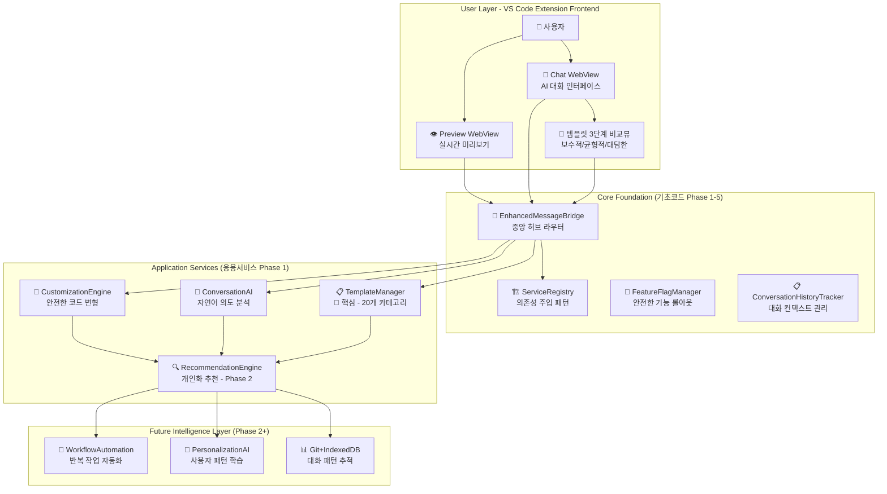

# 33. WindWalker AI 대화식 웹사이트 빌더 TRD (Technical Requirements Document) 초안

## 📋 문서 개요

**문서 타입**: Technical Requirements Document (TRD)  
**제품명**: WindWalker AI Website Builder  
**버전**: 1.0 초안  
**작성일**: 2025년 8월 7일  
**기반 문서**: PRD 31, PRD 32, docs 14-15, 현재 구현 상황  
**검토 상태**: 초안 (Review Pending)

---

## 🎯 **핵심 기술 철학**

### WindWalker의 차별화된 기술 접근법

WindWalker는 **"템플릿의 안정성 + AI의 무한 가능성"**을 결합하여, 클로드 코드(Claude Code)와 같이 **기본적이지만 반복적인 사용자 워크플로우를 최대한 자동화해서 에러가 없이 동작하는** 가치 중심의 기술 전략을 채택합니다.

#### 🔑 핵심 설계 원칙
1. **템플릿 기반 안정성**: Claude LLM이 미리 학습된 JavaScript 코드 추론 패턴으로 에러 없는 안정적인 코드 생성
2. **제한된 범위의 커스터마이징**: 일정 범위 내에서 변화하는 안정적인 추론 코드 생성
3. **반복 워크플로우 자동화**: 사용자의 반복적인 웹사이트 제작 패턴을 AI가 학습하여 자동화
4. **단계적 지능화**: 기본 템플릿 → 커스터마이징 엔진 → Git+IndexedDB 개인화 순으로 진화

---

## 🏗️ **시스템 아키텍처 설계**

### 1. 전체 시스템 구조 (기초코드 + 응용서비스 통합)



### 2. 기술 스택 전략

#### 기초 코드 (Foundation Stack)
```typescript
// VS Code Extension Environment
- Frontend: Webview + HTML/CSS/JS
- Backend: Node.js + TypeScript
- Architecture: ServiceRegistry Pattern
- Communication: Message Bridge Pattern
- Storage: VS Code Extension Context
```

#### 응용 서비스 (Application Stack) 
```typescript
// AI & Template Processing
- AI Engine: Claude 3.5 Sonnet (Anthropic API)
- Template System: JSON + HTML/CSS/JS Generator
- Pattern Matching: RegExp + NLP Pipeline
- Code Generation: Template-based + Safe Transformation
```

#### 미래 확장 (Future Stack)
```typescript
// Intelligence & Personalization
- Database: IndexedDB (Client-side)
- Version Control: Git Integration
- Analytics: Pattern Recognition ML
- Cloud Sync: Optional Hybrid Architecture
```

---

## 📋 **핵심 구성 요소 기술 명세**

### 1. TemplateManager (핵심 컴포넌트)

#### 1.1 템플릿 시스템 설계
```typescript
interface Template {
  id: string;              // 'restaurant-modern', 'portfolio-creative'
  category: TemplateCategory; // 20개 카테고리 중 하나
  stability: 'proven' | 'experimental'; // Claude 학습 패턴 기반 안정성
  codePatterns: {
    html: CodePattern[];   // 안전한 HTML 구조 패턴
    css: CodePattern[];    // 검증된 CSS 스타일 패턴  
    js: CodePattern[];     // 에러없는 JS 기능 패턴
  };
  customizableAreas: CustomizableArea[]; // 제한된 커스터마이징 영역
}

// 20개 템플릿 카테고리 (PRD 32 기반)
type TemplateCategory = 
  | 'restaurant' | 'portfolio' | 'blog' | 'ecommerce' | 'business'
  | 'landing' | 'creative' | 'educational' | 'personal' | 'nonprofit'
  | 'health' | 'fitness' | 'travel' | 'fashion' | 'tech' 
  | 'legal' | 'finance' | 'real-estate' | 'photography' | 'events';
```

#### 1.2 안전한 코드 생성 전략
```typescript
class TemplateManager {
  // Claude LLM이 학습한 안전한 코드 패턴만 사용
  private safeCodePatterns: Map<string, CodePattern> = new Map();
  
  async generateCode(template: Template, customizations: Customization[]) {
    // 1. 검증된 베이스 코드 로드
    const baseCode = this.loadProvenBaseCode(template);
    
    // 2. 제한된 범위 내 커스터마이징 적용
    const customizedCode = this.applySafeCustomizations(baseCode, customizations);
    
    // 3. 코드 안정성 검증
    const validation = await this.validateCodeSafety(customizedCode);
    if (!validation.isSafe) {
      return this.fallbackToBaseCode(baseCode, validation.issues);
    }
    
    return customizedCode;
  }
}
```

### 2. ConversationAI (자연어 처리)

#### 2.1 의도 분석 시스템
```typescript
class ConversationAI {
  // 9가지 핵심 의도 타입 (구현됨)
  private intentPatterns: Map<IntentType, RegExp[]>;
  
  async analyzeUserIntent(message: string): Promise<UserIntent> {
    // 1. 패턴 매칭으로 기본 의도 파악
    const primary = this.classifyPrimaryIntent(message);
    
    // 2. 엔티티 추출 (웹사이트 타입, 색상, 컴포넌트 등)
    const entities = this.extractEntities(message);
    
    // 3. 템플릿 카테고리 추론
    const suggestedCategory = this.inferTemplateCategory(entities);
    
    return { primary, entities, suggestedCategory, confidence: 0.85 };
  }
}

type IntentType = 
  | 'create-website'    // "레스토랑 웹사이트 만들어줘"
  | 'apply-template'    // "모던한 템플릿으로 바꿔줘"
  | 'modify-design'     // "색상을 바꿔주세요"
  | 'add-content'       // "메뉴를 추가해줘"
  | 'change-layout'     // "레이아웃을 변경해줘"
  | 'customize-colors'  // "브랜드 컬러로 맞춰줘"
  | 'add-component'     // "연락처 폼을 넣어줘"
  | 'help-request'      // "어떻게 해야 할지 모르겠어요"
  | 'project-info';     // "이 웹사이트에 대해 설명해줘"
```

#### 2.2 3단계 응답 생성 시스템
```typescript
interface AIResponse {
  message: string;
  options: {
    conservative: SuggestedAction;  // 안전한 기본 변경
    balanced: SuggestedAction;      // 균형잡힌 개선
    bold: SuggestedAction;         // 혁신적 변화
  };
  templateRecommendations: string[];
  followUpQuestions: string[];
}

// 사용자 선택권 보장하면서 안정성 확보
class ResponseGenerator {
  generateThreeTierResponse(intent: UserIntent): AIResponse {
    return {
      message: "레스토랑 웹사이트를 위한 3가지 옵션을 준비했어요:",
      options: {
        conservative: {
          label: "🛡️ 안전하게 (검증된 패턴)",
          action: "restaurant-basic 템플릿 적용",
          riskLevel: "low"
        },
        balanced: {
          label: "⚖️ 균형잡힌 (맞춤 개선)",
          action: "restaurant-modern + 색상 커스터마이징",
          riskLevel: "medium"
        },
        bold: {
          label: "🚀 혁신적 (창의적 변형)",
          action: "restaurant-premium + 고급 애니메이션",
          riskLevel: "high"
        }
      }
    };
  }
}
```

### 3. CustomizationEngine (안전한 커스터마이징)

#### 3.1 제한된 범위 커스터마이징 전략
```typescript
class CustomizationEngine {
  // Claude가 학습한 안전한 변형 패턴들
  private safeTransformations: Map<string, TransformationRule[]>;
  
  async applyCustomization(
    baseTemplate: Template, 
    userRequest: CustomizationRequest
  ): Promise<SafeCustomizationResult> {
    
    // 1. 요청이 안전한 범위 내인지 검증
    const safetyCheck = this.validateCustomizationSafety(userRequest);
    if (!safetyCheck.isSafe) {
      return this.suggestAlternatives(userRequest, safetyCheck.suggestions);
    }
    
    // 2. 예측 가능한 코드 변형만 적용
    const transformation = this.selectSafeTransformation(baseTemplate, userRequest);
    const customizedCode = await this.applyTransformation(transformation);
    
    // 3. 결과 검증 및 폴백 준비
    const validation = await this.validateResult(customizedCode);
    if (!validation.isValid) {
      return this.fallbackWithExplanation(baseTemplate, validation.issues);
    }
    
    return { success: true, code: customizedCode, appliedChanges: transformation };
  }
}

// 안전한 커스터마이징 범위 정의
interface CustomizationBoundary {
  colors: { 
    allowed: string[];        // 브랜드 안전 컬러 팔레트
    forbidden: string[];      // 접근성 위반 컬러
  };
  layout: {
    maxComplexity: number;    // 최대 복잡도 제한
    allowedStructures: LayoutStructure[];
  };
  components: {
    safeComponents: ComponentType[];  // 에러없는 검증된 컴포넌트만
    restrictedComponents: ComponentType[];
  };
}
```

#### 3.2 실시간 미리보기 시스템
```typescript
class RealtimePreviewManager {
  async generatePreview(customization: Customization): Promise<PreviewResult> {
    // 1. 안전한 샌드박스에서 코드 실행
    const sandbox = this.createSecureSandbox();
    
    // 2. 3단계 옵션별 미리보기 생성
    const previews = await Promise.all([
      this.generateConservativePreview(customization),
      this.generateBalancedPreview(customization),  
      this.generateBoldPreview(customization)
    ]);
    
    // 3. 에러 체크 및 폴백
    const validPreviews = previews.filter(p => p.isValid);
    if (validPreviews.length === 0) {
      return this.generateFallbackPreview();
    }
    
    return {
      conservative: validPreviews[0],
      balanced: validPreviews[1] || validPreviews[0],
      bold: validPreviews[2] || validPreviews[1] || validPreviews[0]
    };
  }
}
```

---

## 🔄 **워크플로우 자동화 설계**

### 1. 사용자 워크플로우 패턴 (클로드 코드 방식)

#### 1.1 기본 반복 워크플로우
```typescript
// 사용자의 전형적인 웹사이트 제작 워크플로우
interface UserWorkflowPattern {
  step1_templateSelection: {
    typical: "레스토랑/카페 웹사이트 만들어줘";
    aiResponse: "3개 템플릿 옵션 + 미리보기";
    automation: "사용자 히스토리 기반 추천";
  };
  
  step2_basicCustomization: {
    typical: "색상을 우리 브랜드 컬러로 바꿔줘";
    aiResponse: "안전한 색상 변형 + 실시간 미리보기";
    automation: "브랜드 가이드라인 자동 적용";
  };
  
  step3_contentAddition: {
    typical: "메뉴와 연락처를 추가해줘";
    aiResponse: "템플릿에 맞는 섹션 추가";
    automation: "업종별 필수 콘텐츠 자동 제안";
  };
  
  step4_finalOptimization: {
    typical: "모바일에서도 잘 보이게 해줘";
    aiResponse: "반응형 디자인 자동 최적화";
    automation: "성능 최적화 자동 적용";
  };
}
```

#### 1.2 에러 없는 자동화 전략
```typescript
class WorkflowAutomation {
  async executeWorkflow(userPattern: UserWorkflowPattern): Promise<WorkflowResult> {
    const steps: WorkflowStep[] = [];
    
    for (const step of userPattern.steps) {
      try {
        // 1. 안전한 실행 환경에서 단계 수행
        const result = await this.executeSafeStep(step);
        
        // 2. 각 단계마다 검증
        const validation = await this.validateStepResult(result);
        if (!validation.isValid) {
          // 3. 실패 시 이전 안전한 상태로 롤백
          return this.rollbackToSafeState(steps, validation.error);
        }
        
        steps.push({ step, result, status: 'success' });
        
      } catch (error) {
        // 4. 예외 발생 시 graceful degradation
        return this.handleWorkflowError(error, steps);
      }
    }
    
    return { success: true, completedSteps: steps };
  }
}
```

### 2. 지능화 로드맵 (단계적 접근)

#### Phase 1: 안정성 우선 (현재 구현 완료)
```typescript
// ✅ 구현 완료
interface Phase1Features {
  templateSystem: {
    status: "✅ 완료";
    features: [
      "3개 기본 템플릿 (restaurant, portfolio, blog)",
      "안전한 HTML/CSS/JS 생성",
      "실시간 미리보기"
    ];
  };
  
  conversationAI: {
    status: "✅ 완료"; 
    features: [
      "9가지 의도 분석",
      "엔티티 추출",
      "한국어 패턴 매칭"
    ];
  };
  
  customizationEngine: {
    status: "🔄 기본 구현";
    features: [
      "색상 변경",
      "텍스트 수정", 
      "기본 레이아웃 조정"
    ];
  };
}
```

#### Phase 2: 지능화 확장 (다음 단계)
```typescript
// 🔄 계획된 기능들
interface Phase2Features {
  gitIntegration: {
    purpose: "사용자 대화 패턴 추적";
    implementation: "Git commit + metadata 저장";
    benefit: "개인화된 추천 정확도 향상";
  };
  
  indexedDBStorage: {
    purpose: "클라이언트 사이드 패턴 학습";
    implementation: "대화 히스토리 + 선호도 저장";
    benefit: "오프라인에서도 개인화 동작";
  };
  
  advancedRecommendation: {
    purpose: "사용할수록 똑똑해지는 AI";
    implementation: "패턴 분석 + 머신러닝";
    benefit: "반복 작업 90% 자동화";
  };
}
```

---

## 🔒 **안전성 및 신뢰성 요구사항**

### 1. 코드 생성 안전성

#### 1.1 검증된 패턴만 사용
```typescript
class CodeSafetyValidator {
  private allowedPatterns: SafeCodePattern[] = [
    // HTML: 시멘틱 태그만 허용
    { type: 'html', pattern: /<(header|main|section|article|aside|footer|nav|div|p|h[1-6]|ul|ol|li|a|img|button|form|input|textarea|select|option)(\s[^>]*)?>/g },
    
    // CSS: XSS 위험 속성 제외
    { type: 'css', forbidden: ['expression', 'javascript:', 'vbscript:', '@import'] },
    
    // JS: 안전한 DOM 조작만 허용
    { type: 'js', allowed: ['addEventListener', 'querySelector', 'classList', 'textContent', 'innerHTML'] }
  ];
  
  async validateGeneratedCode(code: GeneratedCode): Promise<SafetyValidation> {
    const issues: SafetyIssue[] = [];
    
    // 1. XSS 취약점 검사
    if (this.hasXSSVulnerability(code)) {
      issues.push({ type: 'xss', severity: 'high', fix: 'sanitize-html' });
    }
    
    // 2. 악성 스크립트 검사
    if (this.hasMaliciousScript(code)) {
      issues.push({ type: 'malicious', severity: 'critical', fix: 'remove-script' });
    }
    
    // 3. 성능 이슈 검사
    if (this.hasPerformanceIssues(code)) {
      issues.push({ type: 'performance', severity: 'medium', fix: 'optimize' });
    }
    
    return {
      isSafe: issues.length === 0,
      issues,
      recommendations: this.generateSafetyRecommendations(issues)
    };
  }
}
```

#### 1.2 Graceful Degradation 시스템
```typescript
class GracefulDegradationManager {
  async handleCodeGenerationFailure(
    error: CodeGenerationError,
    userRequest: CustomizationRequest
  ): Promise<FallbackResult> {
    
    // Level 1: 안전한 기본 템플릿으로 폴백
    if (error.severity === 'high') {
      return this.fallbackToBaseTemplate(userRequest.templateId);
    }
    
    // Level 2: 부분 적용 + 안전한 대안 제시
    if (error.severity === 'medium') {
      return this.applyPartialCustomization(userRequest, error.safeAspects);
    }
    
    // Level 3: 사용자에게 명확한 설명과 대안 제시
    return {
      result: this.generateSafeAlternative(userRequest),
      explanation: `"${userRequest.description}" 요청은 안전상의 이유로 다음과 같이 수정했어요:`,
      alternatives: this.suggestSaferOptions(userRequest),
      userChoice: true // 사용자가 선택할 수 있도록
    };
  }
}
```

### 2. 시스템 안정성

#### 2.1 서비스 의존성 관리
```typescript
// 현재 구현된 ServiceRegistry 패턴 활용
class ServiceRegistry {
  async getService<T>(serviceName: string): Promise<T> {
    // 1. 서비스 초기화 타임아웃 방지 (10초 제한)
    const service = await Promise.race([
      this.initializeService<T>(serviceName),
      this.createTimeoutPromise(10000)
    ]);
    
    // 2. 서비스 실패 시 폴백 서비스 반환
    if (!service || !service.isHealthy()) {
      return this.getFallbackService<T>(serviceName);
    }
    
    return service;
  }
}
```

#### 2.2 에러 복구 시스템
```typescript
class ErrorRecoverySystem {
  async handleCriticalError(error: CriticalError): Promise<RecoveryResult> {
    // 1. 즉시 안전 모드 활성화
    await this.enableSafeMode();
    
    // 2. 사용자 작업 상태 백업
    const backup = await this.backupUserProgress();
    
    // 3. 서비스 재시작
    const recoveryResult = await this.attemptServiceRecovery();
    
    // 4. 백업된 상태 복원
    if (recoveryResult.success) {
      await this.restoreUserProgress(backup);
      return { recovered: true, message: "시스템이 자동으로 복구되었습니다." };
    }
    
    // 5. 수동 복구 가이드 제공
    return {
      recovered: false,
      fallbackMode: true,
      message: "안전 모드로 전환했습니다. 기본 기능을 이용해 주세요.",
      supportContact: "support@windwalker.ai"
    };
  }
}
```

---

## 📊 **성능 요구사항**

### 1. 응답 시간 목표

```typescript
interface PerformanceTargets {
  // Claude Code 수준의 빠른 응답
  aiResponse: {
    target: "< 2초";
    fallback: "< 5초 (복잡한 요청)";
    timeout: "10초 후 fallback";
  };
  
  templateGeneration: {
    target: "< 1초";
    caching: "생성된 코드 메모리 캐싱";
    preloading: "인기 템플릿 사전 로딩";
  };
  
  previewRendering: {
    target: "< 500ms";
    optimization: "DOM diff 기반 부분 업데이트";
    debouncing: "300ms 디바운싱으로 불필요한 렌더링 방지";
  };
  
  overallUserExperience: {
    target: "사용자 요청 → 완성된 미리보기 < 3초";
    progressIndicator: "단계별 진행률 표시";
    interactivity: "중간 결과물 즉시 표시";
  };
}
```

### 2. 리소스 최적화

```typescript
class PerformanceOptimizer {
  // 메모리 사용량 최적화
  private templateCache = new LRU<string, Template>(50); // 최대 50개 템플릿 캐싱
  private codeCache = new LRU<string, GeneratedCode>(100); // 생성된 코드 캐싱
  
  async optimizeResourceUsage(): Promise<void> {
    // 1. 사용하지 않는 서비스 지연 로딩
    await this.enableLazyLoading();
    
    // 2. 대화 히스토리 압축 저장
    await this.compressConversationHistory();
    
    // 3. 불필요한 DOM 엘리먼트 정리
    this.cleanupUnusedElements();
    
    // 4. 이미지 지연 로딩
    this.enableImageLazyLoading();
  }
  
  // CPU 사용량 제한
  async limitCPUUsage<T>(operation: () => Promise<T>): Promise<T> {
    // Web Worker에서 무거운 작업 수행
    const worker = new Worker('./ai-processing.worker.js');
    return new Promise((resolve, reject) => {
      worker.postMessage(operation);
      worker.onmessage = (e) => resolve(e.data);
      worker.onerror = reject;
      
      // 5초 후 타임아웃
      setTimeout(() => {
        worker.terminate();
        reject(new Error('CPU intensive operation timeout'));
      }, 5000);
    });
  }
}
```

---

## 🔧 **개발 및 테스트 요구사항**

### 1. 테스트 자동화 루프 (현재 구현)

#### 1.1 기존 테스트 시스템 활용
```typescript
// test-auto-repair/ 디렉토리의 자동화 테스트 시스템 연동
interface TestAutomationLoop {
  e2eBrowserTest: {
    tool: "Playwright";
    target: "WindWalker Extension 활성화 검증";
    frequency: "코드 변경 시마다";
  };
  
  basicSystemTest: {
    scope: "Phase 1-5 기초 코드 검증";  
    components: ["ServiceRegistry", "MessageBridge", "FeatureFlagManager"];
    requirement: "기초 코드 통과 후 응용 서비스 테스트";
  };
  
  aiConversationTest: {
    scope: "AI 대화 워크플로우 검증";
    components: ["ConversationAI", "TemplateManager", "CustomizationEngine"];
    mockTest: "test-ai-conversation.js로 검증 완료";
  };
}
```

#### 1.2 안전성 테스트
```typescript
class SafetyTestSuite {
  async runSafetyTests(): Promise<SafetyTestReport> {
    const tests = [
      // 1. 코드 생성 안전성 테스트
      this.testCodeGenerationSafety(),
      
      // 2. XSS 취약점 테스트  
      this.testXSSPrevention(),
      
      // 3. 에러 복구 테스트
      this.testErrorRecovery(),
      
      // 4. 성능 한계 테스트
      this.testPerformanceLimits(),
      
      // 5. 메모리 누수 테스트
      this.testMemoryLeaks()
    ];
    
    const results = await Promise.all(tests);
    return this.generateSafetyReport(results);
  }
}
```

### 2. 배포 및 운영

#### 2.1 VS Code Extension 배포 전략
```typescript
interface DeploymentStrategy {
  development: {
    environment: "로컬 VS Code Extension Host";
    testing: "test-auto-repair 루프로 자동 검증";
    debugging: "Chrome DevTools + VS Code Debugger";
  };
  
  staging: {
    environment: "VS Code Marketplace Pre-release";
    userTesting: "베타 테스터 50명 대상";
    monitoring: "에러 리포팅 + 성능 메트릭";
  };
  
  production: {
    environment: "VS Code Marketplace Public";
    rollout: "Feature Flag 기반 단계적 배포";
    monitoring: "실시간 에러 추적 + 사용량 분석";
  };
}
```

#### 2.2 하이브리드 클라우드 구축 (Future)
```typescript
// 현재는 VS Code Extension으로만 동작, 향후 클라우드 확장
interface HybridCloudArchitecture {
  clientSide: {
    current: "VS Code Extension + 로컬 처리";
    benefits: ["오프라인 동작", "빠른 응답", "프라이버시 보장"];
  };
  
  cloudSide: {
    future: "선택적 클라우드 싱크 + AI API";
    benefits: ["크로스 디바이스 동기화", "고급 AI 모델", "협업 기능"];
    timing: "Phase 3 이후 고려";
  };
}
```

---

## 🎯 **기술 우선순위 및 로드맵**

### Phase 1: 안정성 우선 (✅ 완료)
```
✅ ServiceRegistry 패턴 구현
✅ EnhancedMessageBridge 중앙 허브
✅ ConversationAI 자연어 처리 (9가지 의도)  
✅ TemplateManager 기본 템플릿 3개
✅ 실시간 미리보기 시스템
✅ 기본 커스터마이징 엔진
✅ E2E 테스트 자동화
```

### Phase 2: 지능화 확장 (🔄 진행 예정)
```
🔄 20개 카테고리 템플릿 확장
🔄 3단계 옵션 시스템 (보수적/균형적/대담한)
🔄 고급 커스터마이징 엔진
🔄 Git+IndexedDB 개인화 시스템
🔄 사용자 패턴 학습 AI
🔄 반복 워크플로우 자동화
```

### Phase 3: 플랫폼화 (📋 계획됨)
```
📋 하이브리드 클라우드 아키텍처
📋 실시간 협업 기능
📋 템플릿 마켓플레이스
📋 화이트라벨 솔루션
📋 API 플랫폼 개방
📋 에이전시 파트너 프로그램
```

---

## 🔍 **기술적 위험 관리**

### 1. 주요 기술 리스크

#### 1.1 AI 응답 품질 리스크
```typescript
interface AIQualityRisk {
  risk: "AI가 잘못된 코드를 생성할 가능성";
  probability: "Medium";
  impact: "High";
  mitigation: [
    "검증된 패턴만 사용하는 화이트리스트 방식",
    "실시간 코드 검증 시스템", 
    "사용자 피드백 기반 학습 루프",
    "안전한 폴백 템플릿 항상 준비"
  ];
  monitoring: "생성 코드 품질 지표 실시간 추적";
}
```

#### 1.2 성능 확장성 리스크
```typescript
interface ScalabilityRisk {
  risk: "사용자 증가 시 응답 시간 저하";
  probability: "High"; 
  impact: "Medium";
  mitigation: [
    "LRU 캐싱으로 메모리 효율성 확보",
    "Web Worker로 CPU 집약적 작업 분리",
    "지연 로딩으로 초기 로딩 시간 단축",
    "Progressive Enhancement 적용"
  ];
  scaling: "수직적 확장(더 강력한 AI API) + 수평적 확장(캐싱 레이어)";
}
```

#### 1.3 호환성 리스크
```typescript
interface CompatibilityRisk {
  risk: "다양한 VS Code 버전 및 OS 환경 호환성";
  probability: "Medium";
  impact: "Medium"; 
  mitigation: [
    "최소 VS Code 버전 요구사항 명시",
    "크로스 플랫폼 테스트 자동화",
    "Feature Detection 기반 Graceful Degradation",
    "사용자 환경별 폴백 매커니즘"
  ];
  testing: "Windows, macOS, Linux 환경 매트릭스 테스트";
}
```

### 2. 위험 모니터링 시스템

```typescript
class RiskMonitoringSystem {
  async monitorSystemHealth(): Promise<HealthReport> {
    const metrics = await this.collectMetrics();
    
    return {
      aiResponseQuality: this.calculateAIQualityScore(metrics),
      systemPerformance: this.calculatePerformanceScore(metrics), 
      errorRate: this.calculateErrorRate(metrics),
      userSatisfaction: this.calculateSatisfactionScore(metrics),
      recommendations: this.generateImprovementRecommendations(metrics)
    };
  }
}
```

---

## 📋 **결론 및 다음 단계**

### WindWalker TRD 핵심 요약

1. **🎯 기술 철학**: Claude Code처럼 안정성을 우선으로 하는 템플릿 기반 AI 시스템
2. **🏗️ 아키텍처**: ServiceRegistry 패턴 기반 확장 가능한 모듈 구조  
3. **🧠 AI 엔진**: 검증된 패턴만 사용하는 안전한 코드 생성
4. **📋 템플릿 시스템**: 20개 카테고리 + 3단계 커스터마이징 옵션
5. **🔄 자동화**: 반복 워크플로우의 점진적 AI 자동화
6. **🔒 안전성**: 다층 검증 시스템 + Graceful Degradation

### 기술적 성취 (현재 상태)

- ✅ **기초 코드 Phase 1-5 완료**: 안정적인 확장 기반 구축
- ✅ **응용 서비스 Phase 1 완료**: 핵심 AI 대화 워크플로우 구현  
- ✅ **테스트 자동화**: E2E 브라우저 테스트 + AI 기능 검증
- ✅ **안전한 코드 생성**: 검증된 패턴 기반 HTML/CSS/JS 생성

### 다음 우선순위

1. **🔄 템플릿 확장**: 3개 → 20개 카테고리로 확장
2. **🎨 커스터마이징 강화**: 3단계 옵션 시스템 구현
3. **📊 개인화 시스템**: Git+IndexedDB 기반 사용자 패턴 학습
4. **🚀 성능 최적화**: 대규모 사용자 대비 확장성 확보

**WindWalker**는 단순히 또 다른 웹사이트 빌더가 아닌, **AI와 인간이 협업하여 에러 없는 안정적인 웹사이트를 만드는 새로운 패러다임**을 제시하는 기술 플랫폼입니다.

---

**📅 문서 상태**: 초안 완료 (2025.08.07)  
**🔄 다음 리뷰**: Phase 2 기획 회의 시점  
**✉️ 피드백**: [기술팀 검토 요청]