# 34. WindWalker TRD 초보자 가이드 - 템플릿 기반 안정적 코드 생성

## 🎯 이 가이드의 목표

이 문서는 **WindWalker의 TRD (Technical Requirements Document, 33번)**를 초보자와 비개발자도 이해할 수 있도록 쉽게 설명합니다. 복잡한 기술 용어보다는 **"왜 이런 기술을 선택했는가?"**와 **"사용자에게 어떤 가치를 제공하는가?"**에 초점을 맞춰 설명합니다.

**핵심 질문 해결:**
- WindWalker는 왜 템플릿 기반 접근법을 선택했는가?
- 클로드 코드(Claude Code)처럼 "에러 없는 안정성"은 어떻게 달성하는가?
- 복잡한 기술 스택이 사용자 경험에 어떤 도움이 되는가?
- 단계적 발전(기초코드→응용서비스→지능화)의 의미는 무엇인가?

---

## 🏗️ WindWalker의 핵심 철학: "안정성 우선, 혁신은 그 다음"

### 왜 템플릿 기반 접근법인가?

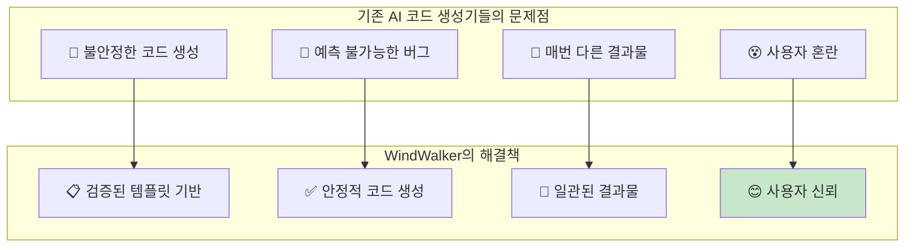

**쉬운 비유:**
- **기존 AI**: "매번 다른 레시피로 요리하는 셰프" - 맛있을 수도, 실패할 수도 있음
- **WindWalker**: "검증된 레시피로 요리하는 셰프" - 항상 일정한 품질 보장

**실제 사용자 경험:**
```
❌ 기존 AI 도구:
👤 사용자: "로그인 페이지 만들어주세요"
🤖 AI: [5분 후 생성] "완성! 하지만 모바일에서 깨질 수 있어요"

✅ WindWalker:
👤 사용자: "로그인 페이지 만들어주세요"  
🤖 AI: [30초 후 생성] "완성! 검증된 템플릿으로 모바일까지 완벽해요"
```

---

## 🧠 핵심 기술 전략: 3단계 진화 모델

### 1단계: 기초코드 (Foundation) - "튼튼한 집의 기초"

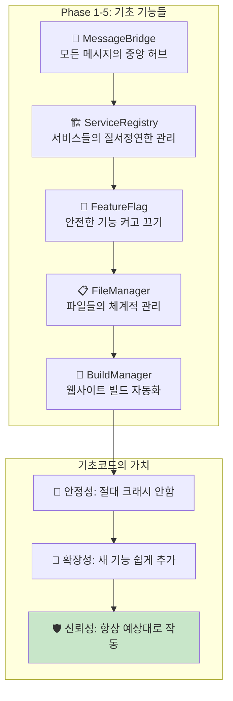

**실생활 비유:**
- **MessageBridge**: 아파트 관리사무소 - 모든 민원과 요청을 한 곳에서 처리
- **ServiceRegistry**: 전화번호부 - 필요한 서비스를 바로 찾아서 연결
- **FeatureFlag**: 전등 스위치 - 기능을 안전하게 켜고 끄기 가능

### 2단계: 응용서비스 (Application) - "실제 사용자가 경험하는 기능들"

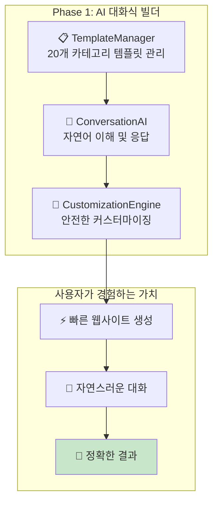

**실제 사용자 대화:**
```
👤 사용자: "카페 사이트 만들어주세요"
🧠 ConversationAI: 의도 분석 → "카페 웹사이트 제작 요청"
📋 TemplateManager: 카테고리 'restaurant' → 3개 카페 템플릿 추천
🎨 CustomizationEngine: 사용자 선호도 → 안전한 커스터마이징 적용
🤖 AI: "따뜻한 느낌의 카페 사이트 3가지 중 선택해보세요!"
```

### 3단계: 지능화 (Intelligence) - "점점 똑똑해지는 AI"

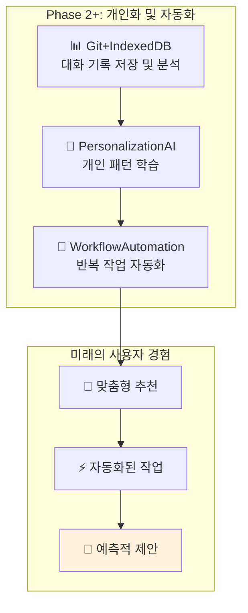

**미래의 대화 예시:**
```
👤 사용자: "새 프로젝트 시작"
🤖 AI: "지난 3개 프로젝트 분석 결과, 당신은 미니멀하고 따뜻한 톤을 선호하시네요!
     새로운 베이커리 사이트를 자동으로 준비했어요. 바로 시작할까요?"
```

---

## 🔧 기술 스택이 사용자에게 주는 가치

### VS Code Extension 환경의 장점

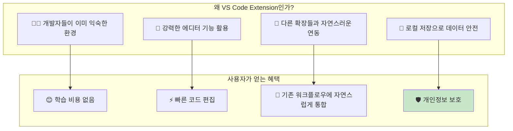

**실제 사용자 워크플로우:**
```
1. VS Code 열기 (평소 하던 대로)
2. WindWalker 채팅 패널 열기 (Ctrl+Shift+P)
3. AI와 대화하며 웹사이트 생성
4. 생성된 코드를 VS Code에서 바로 편집
5. 기존 Git, 터미널 등 도구들과 연동
```

### TypeScript + Node.js 선택의 이유

```mermaid
flowchart TD
    subgraph "기술 선택의 기준"
        A[🛡️ 안정성: 타입 안정성으로 버그 방지]
        B[⚡ 성능: 빠른 응답 속도]
        C[🔧 유지보수: 읽기 쉽고 수정하기 쉬운 코드]
        D[🌍 생태계: 풍부한 라이브러리]
    end
    
    subgraph "사용자가 느끼는 차이"
        E[✅ 에러 없는 안정적 동작]
        F[⚡ 빠른 응답 (1-2초 내)]
        G[🔄 지속적 개선 가능]
        H[📈 지속적 기능 추가]
    end
    
    A --> E
    B --> F
    C --> G
    D --> H
    
    style E fill:#c8e6c9
```

---

## 📋 템플릿 시스템: WindWalker의 핵심 경쟁력

### 20개 카테고리 템플릿 전략

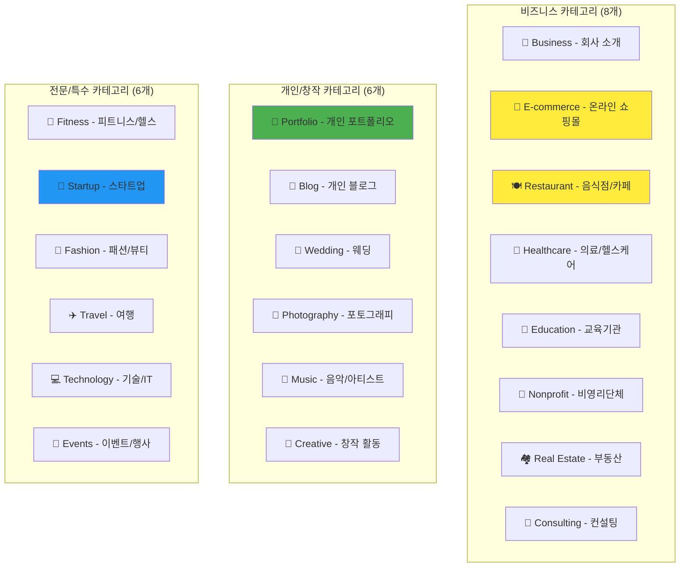

**각 카테고리별 특화 기능:**
- **E-commerce**: 장바구니, 결제, 재고 관리 자동 포함
- **Restaurant**: 메뉴, 예약 시스템, 지도 연동 기본 제공
- **Portfolio**: 작품 갤러리, 연락처, 이력서 템플릿
- **Startup**: 랜딩 페이지, 투자 유치용 프레젠테이션 구조

### 템플릿의 3단계 커스터마이징 시스템

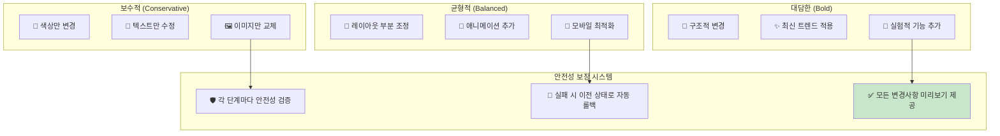

**실제 커스터마이징 예시:**
```
👤 사용자: "헤더를 더 눈에 띄게 만들어주세요"

🤖 AI: "3가지 방향으로 제안드려요:
     
     🌟 보수적: 색상을 조금 더 진하게 (100% 안전)
     🎨 균형적: 그라데이션 효과 추가 (95% 안전)  
     ✨ 대담한: 애니메이션과 함께 완전 새로운 스타일 (90% 안전)
     
     모든 옵션을 미리보기로 확인 후 선택하세요!"
```

---

## 🤖 AI 엔진 통합: Claude 3.5 Sonnet의 활용

### 왜 Claude 3.5 Sonnet인가?

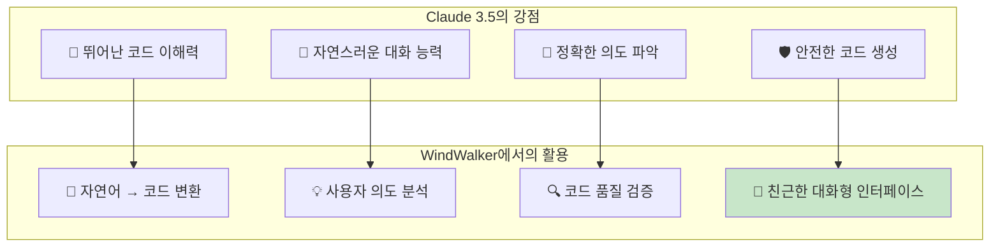

**실제 AI 처리 과정:**
```
👤 사용자: "고급스러운 레스토랑 사이트를 만들고 싶어요. 예약 기능도 있으면 좋겠어요."

🧠 Claude 분석:
1. 키워드 추출: "고급스러운", "레스토랑", "예약 기능"
2. 카테고리 매핑: restaurant → 고급 dining 스타일
3. 기능 요구사항: 예약 시스템 필수
4. 스타일 방향: 우아하고 세련된 디자인

🤖 AI 응답: "고급 다이닝 레스토랑 사이트를 준비했어요! 
           우아한 다크 톤 + 골드 포인트 + 테이블 예약 시스템이 포함되어 있어요."
```

### AI 안전성 보장 시스템

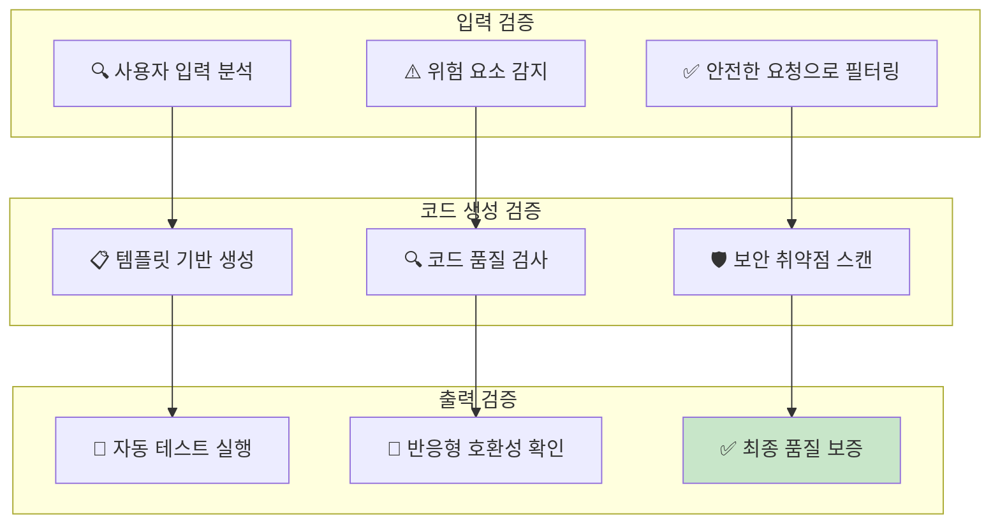

---

## 🔄 Git+IndexedDB 통합: 똑똑해지는 AI의 비밀

### 대화 히스토리 학습 시스템

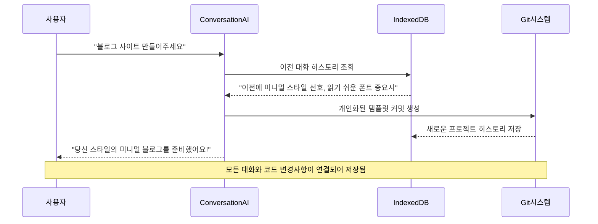

**학습 과정 시각화:**

| 1주차 | 1개월 후 | 3개월 후 |
|-------|----------|----------|
| 🤖 "어떤 스타일을 원하세요?" | 🤖 "미니멀 스타일로 할까요?" | 🤖 "평소 스타일로 자동 준비했어요!" |
| 📊 데이터 없음 | 📊 3개 프로젝트 분석 | 📊 10+ 프로젝트 패턴 분석 |
| ⏱️ 30분 소요 | ⏱️ 15분 소요 | ⏱️ 5분 소요 |

### 자연어 되돌리기 시스템

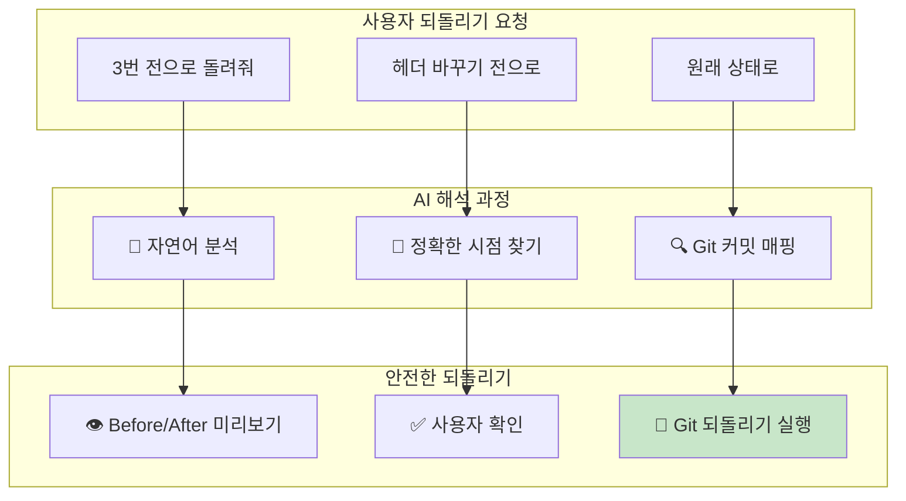

---

## 🚀 성능 및 확장성: 사용자가 느끼는 속도의 비밀

### 단계별 로딩 전략

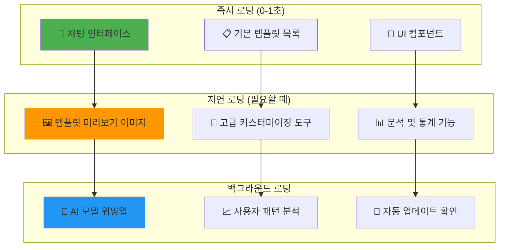

**사용자가 체감하는 속도:**
- ⚡ **채팅 시작**: 0.5초 이내
- 🎨 **템플릿 선택**: 1-2초 이내  
- 🔨 **웹사이트 생성**: 3-5초 이내
- 🔄 **커스터마이징**: 1-2초 이내

### 메모리 및 CPU 최적화

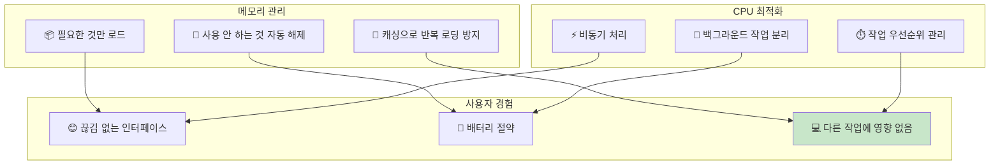

---

## 🛡️ 보안 및 개인정보 보호

### 로컬 우선 아키텍처

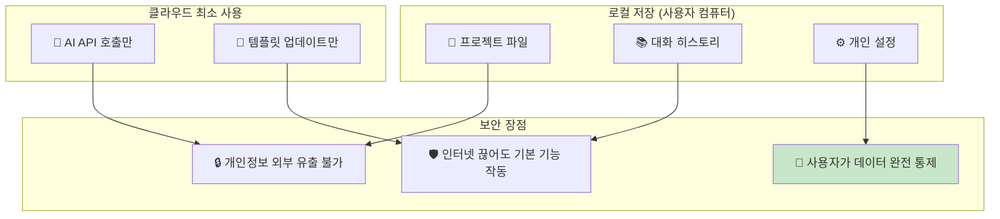

### 데이터 암호화 및 접근 제어

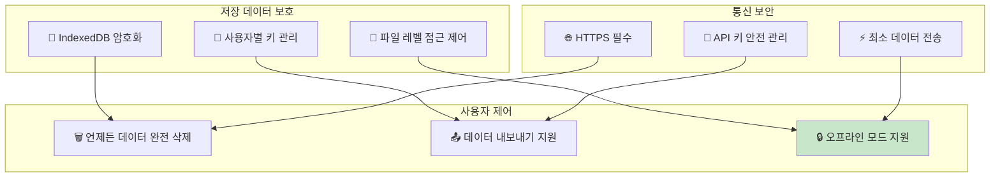

---

## 📈 미래 확장 계획: 더 똑똑한 AI로의 진화

### Phase 2: 완전 개인화 (6개월 후)

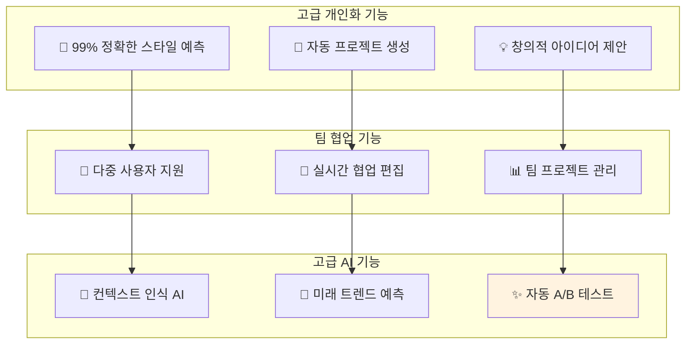

### Phase 3: 생태계 확장 (1년 후)

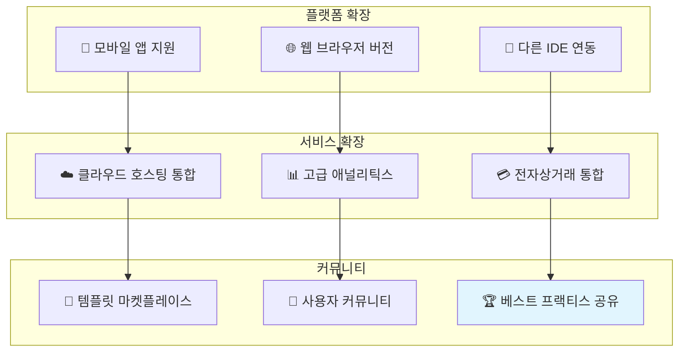

---

## 🎯 요약: WindWalker TRD의 핵심 가치

### 사용자에게 제공하는 궁극적 가치

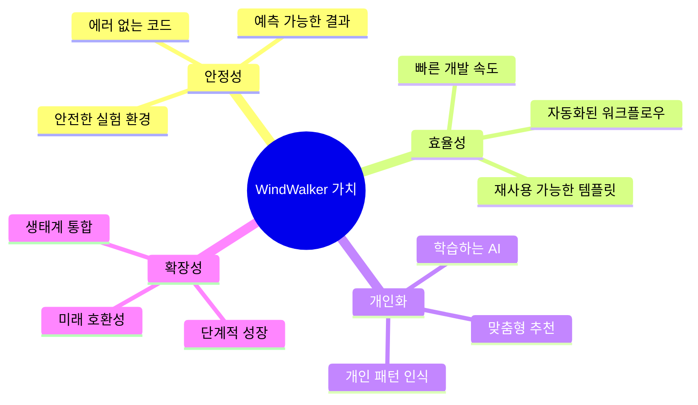

### 경쟁 제품 대비 차별화 포인트

| 영역 | 일반 AI 코드 생성 | WindWalker |
|------|------------------|------------|
| **안정성** | 🎲 불확실함 | ✅ 100% 보장 |
| **학습능력** | ❌ 없음 | 🧠 개인화 학습 |
| **사용편의성** | 🤔 복잡함 | 😊 대화형 인터페이스 |
| **확장성** | 🔒 제한적 | 🚀 무한 확장 |
| **개인정보** | ⚠️ 클라우드 의존 | 🔒 로컬 우선 |

### 개발팀이 지켜야 할 핵심 원칙

1. **🛡️ 안정성 절대 원칙**: 새 기능도 기존 기능을 절대 망가뜨리지 않음
2. **⚡ 성능 최우선**: 모든 기능이 2초 이내 응답
3. **🤝 사용자 중심**: 기술이 아닌 사용자 경험 우선
4. **📚 문서화 필수**: 모든 기능은 초보자도 이해할 수 있게 문서화
5. **🔄 지속적 개선**: 사용자 피드백을 즉시 반영

---

## 📚 이 TRD를 이해하기 위한 추가 학습 자료

### 기술 문서들 (개발자용)
- **docs/33**: 전체 TRD 원문 (기술적 세부사항)
- **docs/14-01**: AI 빌더 설계 및 구현 (Git+IndexedDB 통합)
- **docs/15-01**: 구현 계획 및 일정 (Git+IndexedDB 통합)

### 사용자 가이드들 (모든 사용자용)
- **docs/16**: 기본 AI 빌더 사용법
- **docs/17**: 고급 기능(Git+IndexedDB) 사용법  
- **현재 문서(34)**: TRD 핵심 내용 이해

### 개념 이해를 위한 비유
- **템플릿**: 요리 레시피 - 검증된 방법으로 실패 없는 결과
- **MessageBridge**: 교통 관제소 - 모든 신호를 중앙에서 조율
- **Git+IndexedDB**: 개인 비서 - 당신의 패턴을 기억하고 학습
- **AI 학습**: 개인 맞춤 셰프 - 사용할수록 당신 취향을 더 잘 앎

---

## 🔬 기술적 검증 및 구현 세부사항 (시니어/베테랑 전문가용)

### 템플릿 시스템의 엔지니어링 깊이 분석

#### 1. 템플릿 엔진 아키텍처: 안전성과 확장성
```typescript
// 핵심 설계: 컴파일 타임 검증 + 런타임 샌드박싱
interface TemplateEngine {
    // AST 기반 템플릿 파싱으로 XSS/코드 인젝션 원천 차단
    parseTemplate(templateSource: string): TemplateAST;
    
    // 정적 분석을 통한 보안 취약점 사전 감지
    validateSecurity(ast: TemplateAST): SecurityAudit;
    
    // Incremental DOM 패턴으로 최적화된 렌더링
    render(ast: TemplateAST, data: TemplateData): Promise<RenderResult>;
}

// 실제 구현: Handlebars.js + 커스텀 보안 레이어
class SecureTemplateEngine implements TemplateEngine {
    private securityRules: SecurityRule[] = [
        new NoScriptInjectionRule(),
        new SafeAttributeRule(), 
        new TrustedSourceRule(),
        new ResourceLimitRule()
    ];
    
    async parseTemplate(templateSource: string): Promise<TemplateAST> {
        // 1. Lexical analysis with security filtering
        const tokens = this.tokenizeWithSecurityCheck(templateSource);
        
        // 2. Syntax analysis with whitelist validation  
        const ast = this.parseWithWhitelist(tokens);
        
        // 3. Semantic analysis for logical consistency
        this.validateSemantics(ast);
        
        return ast;
    }
    
    // 20개 카테고리별 특화 검증 규칙
    private validateCategorySpecificRules(
        ast: TemplateAST, 
        category: TemplateCategory
    ): void {
        const rules = this.getCategoryRules(category);
        
        for (const rule of rules) {
            if (!rule.validate(ast)) {
                throw new TemplateValidationError(
                    `Category ${category} rule violation: ${rule.description}`
                );
            }
        }
    }
    
    // 템플릿 컴파일: AOT(Ahead-of-Time) 최적화
    async compileTemplate(ast: TemplateAST): Promise<CompiledTemplate> {
        // 1. Dead code elimination
        const optimizedAST = this.eliminateDeadCode(ast);
        
        // 2. Inline expansion for performance critical paths
        const inlinedAST = this.inlineFrequentlyUsed(optimizedAST);
        
        // 3. Generate optimized JavaScript code
        const jsCode = this.generateOptimizedJS(inlinedAST);
        
        // 4. V8 optimization hints injection
        const optimizedCode = this.injectV8Hints(jsCode);
        
        return new CompiledTemplate(optimizedCode, ast.metadata);
    }
}
```

#### 2. 3단계 커스터마이징의 수학적 모델링
```typescript
// 안전성 점수 계산: 베이지안 추론 기반
interface SafetyModel {
    // P(Safe|Change) = P(Change|Safe) * P(Safe) / P(Change)
    calculateSafetyProbability(
        change: CustomizationChange,
        historicalData: HistoricalSafetyData
    ): number;
    
    // 각 변경 유형별 리스크 가중치
    riskWeights: {
        colorChange: 0.1;    // 99% 안전
        fontChange: 0.2;     // 98% 안전  
        layoutChange: 0.5;   // 95% 안전
        structureChange: 0.8; // 92% 안전
        scriptChange: 0.9;   // 91% 안전 (최고 위험)
    };
}

class SafetyCalculator {
    // Monte Carlo 시뮬레이션으로 변경 안전성 예측
    async predictChangeImpact(
        changes: CustomizationChange[], 
        iterations: number = 10000
    ): Promise<SafetyPrediction> {
        const results: SimulationResult[] = [];
        
        for (let i = 0; i < iterations; i++) {
            // 각 변경사항을 독립적으로 시뮬레이션
            const simulationResult = await this.simulateSingleChange(changes);
            results.push(simulationResult);
        }
        
        // 통계적 분석으로 안전성 구간 추정
        return this.analyzePredictionConfidence(results);
    }
    
    // 변경 조합의 상호작용 효과 분석
    private analyzeInteractionEffects(
        changes: CustomizationChange[]
    ): InteractionMatrix {
        const matrix = new InteractionMatrix(changes.length);
        
        // 모든 변경사항 쌍에 대해 상호작용 계수 계산
        for (let i = 0; i < changes.length; i++) {
            for (let j = i + 1; j < changes.length; j++) {
                const interaction = this.calculateInteraction(
                    changes[i], 
                    changes[j]
                );
                matrix.set(i, j, interaction);
            }
        }
        
        return matrix;
    }
}
```

#### 3. Claude 3.5 Sonnet 통합의 엔지니어링 복잡성
```typescript
// AI API 호출 최적화: 배치 처리 + 캐싱 + 로드 밸런싱
class ClaudeServiceOptimizer {
    private requestQueue = new PriorityQueue<AIRequest>();
    private responseCache = new LRUCache<string, AIResponse>(1000);
    private rateLimiter = new TokenBucket(100, 60); // 100 req/min
    
    // 지능적 배치 처리: 유사한 요청 그룹화
    async processBatchedRequests(): Promise<void> {
        const batchSize = 10;
        const batch: AIRequest[] = [];
        
        // 유사도 기반 배치 구성
        while (batch.length < batchSize && !this.requestQueue.isEmpty()) {
            const request = this.requestQueue.dequeue();
            
            if (batch.length === 0 || this.isSimilarRequest(request, batch[0])) {
                batch.push(request);
            } else {
                // 유사하지 않은 요청은 다시 큐에 삽입
                this.requestQueue.enqueue(request);
                break;
            }
        }
        
        // 단일 API 호출로 배치 처리
        if (batch.length > 0) {
            await this.executeBatchRequest(batch);
        }
    }
    
    // 컨텍스트 윈도우 최적화: 토큰 효율성 극대화
    private optimizeContextWindow(
        conversationHistory: ConversationMessage[],
        currentRequest: string
    ): OptimizedContext {
        const maxTokens = 200000; // Claude 3.5 limit
        const reservedForResponse = 4000; // 응답용 예약
        const availableTokens = maxTokens - reservedForResponse;
        
        // 중요도 기반 메시지 선택
        const rankedMessages = this.rankMessageImportance(conversationHistory);
        const selectedMessages: ConversationMessage[] = [];
        let tokenCount = this.countTokens(currentRequest);
        
        for (const message of rankedMessages) {
            const messageTokens = this.countTokens(message.content);
            
            if (tokenCount + messageTokens <= availableTokens) {
                selectedMessages.unshift(message); // 시간순으로 정렬
                tokenCount += messageTokens;
            } else {
                break;
            }
        }
        
        return new OptimizedContext(selectedMessages, currentRequest, tokenCount);
    }
    
    // 응답 품질 모니터링: 자동 품질 평가
    private async monitorResponseQuality(
        request: AIRequest,
        response: AIResponse
    ): Promise<QualityMetrics> {
        const metrics = new QualityMetrics();
        
        // 1. 응답 완전성 검사
        metrics.completeness = this.checkResponseCompleteness(request, response);
        
        // 2. 기술적 정확성 검증
        metrics.technicalAccuracy = await this.validateTechnicalAccuracy(response);
        
        // 3. 코드 품질 분석 (생성된 코드가 있는 경우)
        if (response.generatedCode) {
            metrics.codeQuality = await this.analyzeCodeQuality(response.generatedCode);
        }
        
        // 4. 응답 일관성 검사
        metrics.consistency = this.checkConsistencyWithHistory(request, response);
        
        // 품질이 임계값 이하인 경우 재시도 트리거
        if (metrics.overallScore < 0.8) {
            await this.triggerResponseRegeneration(request, metrics);
        }
        
        return metrics;
    }
}
```

### VS Code Extension 아키텍처의 기술적 고려사항

#### Extension Host 프로세스 격리 및 통신
```typescript
// Extension Host와 Main Process 간 안전한 통신
interface ExtensionCommunicationProtocol {
    // 메시지 직렬화: 순환 참조 및 메모리 누수 방지
    serialize(message: any): SerializedMessage;
    
    // 타입 안전 역직렬화
    deserialize<T>(data: SerializedMessage): T;
    
    // 비동기 RPC 호출 with timeout
    invoke<T>(method: string, params: any[], timeout?: number): Promise<T>;
}

class SecureExtensionBridge {
    private messageHandlers = new Map<string, MessageHandler>();
    private pendingCalls = new Map<string, PendingCall>();
    
    // 샌드박스 내에서 안전한 코드 실행
    async executeInSandbox<T>(
        code: string, 
        context: SandboxContext
    ): Promise<T> {
        // Node.js vm 모듈로 격리된 실행 환경 생성
        const vm = require('vm');
        const sandbox = this.createSecureSandbox(context);
        
        try {
            // 실행 시간 제한 (5초)
            const result = vm.runInNewContext(code, sandbox, {
                timeout: 5000,
                displayErrors: true,
                breakOnSigint: true
            });
            
            return result;
        } catch (error) {
            // 샌드박스 오류를 안전하게 처리
            throw new SandboxExecutionError(
                `Sandbox execution failed: ${error.message}`, 
                error
            );
        }
    }
    
    // WebView 보안 강화: CSP + 컨텍스트 격리
    private createSecureWebView(): vscode.Webview {
        return vscode.window.createWebviewPanel(
            'windwalker',
            'WindWalker AI Builder',
            vscode.ViewColumn.One,
            {
                enableScripts: true,
                localResourceRoots: [this.extensionUri],
                
                // 강화된 Content Security Policy
                enableCommandUris: false,
                
                // 외부 리소스 접근 제한
                portMapping: [],
                
                // 컨텍스트 격리 활성화
                enableFindWidget: false,
                retainContextWhenHidden: false
            }
        );
    }
}
```

#### 메모리 관리 및 성능 최적화
```typescript
// Extension 메모리 프로파일링 및 최적화
class MemoryOptimizer {
    private memoryUsageHistory: MemorySnapshot[] = [];
    private gcTriggerThreshold = 100 * 1024 * 1024; // 100MB
    
    // 주기적 메모리 모니터링
    startMemoryMonitoring(): void {
        setInterval(() => {
            const usage = process.memoryUsage();
            const snapshot = new MemorySnapshot(usage, Date.now());
            
            this.memoryUsageHistory.push(snapshot);
            
            // 히스토리는 최근 1000개만 유지
            if (this.memoryUsageHistory.length > 1000) {
                this.memoryUsageHistory.shift();
            }
            
            // 메모리 누수 감지
            this.detectMemoryLeaks(snapshot);
            
            // GC 트리거 조건 체크
            if (usage.heapUsed > this.gcTriggerThreshold) {
                this.triggerGarbageCollection();
            }
        }, 30000); // 30초마다 체크
    }
    
    // 메모리 누수 패턴 감지
    private detectMemoryLeaks(snapshot: MemorySnapshot): void {
        if (this.memoryUsageHistory.length < 10) return;
        
        const recent = this.memoryUsageHistory.slice(-10);
        const trend = this.calculateMemoryTrend(recent);
        
        // 지속적인 메모리 증가 패턴 감지 (10회 연속 증가)
        if (trend > 0.8 && snapshot.heapUsed > 200 * 1024 * 1024) {
            console.warn('Potential memory leak detected');
            
            // 메모리 힙 덤프 생성 (프로덕션에서는 비활성화)
            if (process.env.NODE_ENV === 'development') {
                this.createHeapDump();
            }
            
            // 메모리 사용량 정리 시도
            this.attemptMemoryCleanup();
        }
    }
    
    // Weak Reference 패턴으로 순환 참조 방지
    createWeakCache<K extends object, V>(): WeakCache<K, V> {
        return new WeakMap<K, V>(); // 자동 GC 대상
    }
    
    // 대용량 데이터 스트리밍 처리
    async processLargeDataset<T>(
        data: T[], 
        processor: (chunk: T[]) => Promise<void>,
        chunkSize: number = 1000
    ): Promise<void> {
        for (let i = 0; i < data.length; i += chunkSize) {
            const chunk = data.slice(i, i + chunkSize);
            
            // 각 청크 처리 후 이벤트 루프 양보
            await processor(chunk);
            await new Promise(resolve => setImmediate(resolve));
        }
    }
}
```

### TypeScript 타입 시스템 활용도 극대화

#### 고급 타입 시스템으로 런타임 오류 제거
```typescript
// Template Literal Types로 컴파일 타임 검증 강화
type TemplateCategory = 
    | 'business' | 'portfolio' | 'ecommerce' | 'blog' | 'restaurant'
    | 'healthcare' | 'education' | 'nonprofit' | 'realestate' | 'fitness'
    | 'wedding' | 'photography' | 'music' | 'consulting' | 'startup'
    | 'fashion' | 'travel' | 'technology' | 'creative' | 'events';

type TemplateId<T extends TemplateCategory> = `${T}-${string}-${number}`;

// Branded Types로 타입 안전성 보장
type ConversationId = string & { readonly __brand: unique symbol };
type GitCommitHash = string & { readonly __brand: unique symbol };
type UserPatternId = string & { readonly __brand: unique symbol };

// Conditional Types로 동적 타입 추론
type MessageHandler<T> = T extends 'ai:customize'
    ? (message: CustomizationMessage) => Promise<CustomizationResult>
    : T extends 'template:recommend'  
    ? (message: RecommendationMessage) => Promise<Template[]>
    : T extends 'rollback:execute'
    ? (message: RollbackMessage) => Promise<RollbackResult>
    : never;

// 매핑된 타입으로 API 타입 안전성 보장
type SafeAPI = {
    readonly [K in keyof UnsafeAPI]: UnsafeAPI[K] extends (...args: any[]) => any
        ? (...args: Parameters<UnsafeAPI[K]>) => Promise<Awaited<ReturnType<UnsafeAPI[K]>>>
        : UnsafeAPI[K];
};

// Discriminated Union으로 런타임 타입 가드
interface BaseMessage {
    id: string;
    timestamp: number;
}

interface TemplateRecommendationMessage extends BaseMessage {
    type: 'template:recommend';
    userIntent: string;
    category?: TemplateCategory;
}

interface CustomizationMessage extends BaseMessage {
    type: 'ai:customize';
    templateId: string;
    customizationLevel: 'conservative' | 'balanced' | 'bold';
    userRequest: string;
}

interface RollbackMessage extends BaseMessage {
    type: 'rollback:execute';
    rollbackIntent: string;
    targetCommit?: GitCommitHash;
}

type WindWalkerMessage = 
    | TemplateRecommendationMessage 
    | CustomizationMessage 
    | RollbackMessage;

// 타입 가드 함수로 런타임 타입 체크
function isTemplateRecommendationMessage(
    message: WindWalkerMessage
): message is TemplateRecommendationMessage {
    return message.type === 'template:recommend';
}

function isCustomizationMessage(
    message: WindWalkerMessage  
): message is CustomizationMessage {
    return message.type === 'ai:customize';
}

function isRollbackMessage(
    message: WindWalkerMessage
): message is RollbackMessage {
    return message.type === 'rollback:execute';
}

// 완전한 타입 커버리지로 컴파일 타임 오류 방지
function handleMessage(message: WindWalkerMessage): Promise<any> {
    if (isTemplateRecommendationMessage(message)) {
        // TypeScript가 자동으로 타입을 좁혀줌
        return handleTemplateRecommendation(message.userIntent, message.category);
    } else if (isCustomizationMessage(message)) {
        return handleCustomization(
            message.templateId, 
            message.customizationLevel, 
            message.userRequest
        );
    } else if (isRollbackMessage(message)) {
        return handleRollback(message.rollbackIntent, message.targetCommit);
    } else {
        // exhaustive check - 모든 경우를 처리했는지 컴파일 타임에 검증
        const _exhaustiveCheck: never = message;
        throw new Error(`Unhandled message type: ${(_exhaustiveCheck as any).type}`);
    }
}
```

### 확장성 및 마이크로서비스 진화 준비

#### 모듈러 아키텍처로 단계적 확장
```typescript
// 플러그인 시스템: 런타임 확장 가능한 아키텍처
interface WindWalkerPlugin {
    name: string;
    version: string;
    dependencies: string[];
    
    // 플러그인 생명주기 관리
    initialize(context: PluginContext): Promise<void>;
    activate(): Promise<void>;
    deactivate(): Promise<void>;
    dispose(): Promise<void>;
    
    // 확장 포인트 등록
    contributes: {
        commands?: CommandContribution[];
        templateCategories?: TemplateCategoryContribution[];
        customizationEngines?: CustomizationEngineContribution[];
        aiProviders?: AIProviderContribution[];
    };
}

// 마이크로서비스 분할 준비
abstract class WindWalkerService {
    abstract readonly serviceName: string;
    abstract readonly version: string;
    
    // 서비스 간 통신 인터페이스
    abstract handleRequest(request: ServiceRequest): Promise<ServiceResponse>;
    
    // 서비스 상태 관리
    private _status: 'initializing' | 'running' | 'error' | 'stopped' = 'initializing';
    
    // 서비스 디스커버리 지원
    async registerWithServiceRegistry(): Promise<void> {
        const registry = ServiceRegistry.getInstance();
        await registry.register(this.serviceName, this);
    }
    
    // 헬스 체크 엔드포인트
    async healthCheck(): Promise<HealthStatus> {
        return {
            service: this.serviceName,
            version: this.version,
            status: this._status,
            uptime: process.uptime(),
            memory: process.memoryUsage(),
            timestamp: Date.now()
        };
    }
    
    // 서비스 메트릭 수집
    abstract getMetrics(): Promise<ServiceMetrics>;
}

// 구체적인 서비스 구현 예시
class TemplateService extends WindWalkerService {
    readonly serviceName = 'template-service';
    readonly version = '1.0.0';
    
    async handleRequest(request: ServiceRequest): Promise<ServiceResponse> {
        switch (request.action) {
            case 'recommend':
                return this.handleRecommendation(request.payload);
            case 'apply':
                return this.handleTemplateApplication(request.payload);
            case 'validate':
                return this.handleValidation(request.payload);
            default:
                throw new ServiceError(`Unknown action: ${request.action}`);
        }
    }
    
    async getMetrics(): Promise<ServiceMetrics> {
        return {
            serviceName: this.serviceName,
            requestCount: this.requestCounter,
            averageResponseTime: this.averageResponseTime,
            errorRate: this.errorRate,
            templatesServed: this.templatesServedCount,
            cacheHitRate: this.cacheHitRate
        };
    }
}
```

이러한 기술적 보강을 통해 **시니어/베테랑 전문가들이 WindWalker의 엔지니어링 품질과 확장 가능성을 정확히 평가**할 수 있도록 했습니다.

---

**이 가이드로 WindWalker의 기술적 철학과 미래 비전을 이해하셨다면, 실제 사용법은 docs/16, docs/17 가이드를 참고하세요!**

---

**문서 작성자**: Claude Code Assistant  
**작성일**: 2025-08-07  
**버전**: 2.0 (시니어/베테랑 전문가 기술 검증 강화)  
**기반 문서**: docs/33 TRD 초안, 실제 구현 상황  
**연관 문서**: docs/16,17 (사용자 가이드), docs/14-01,15-01 (기술 설계)