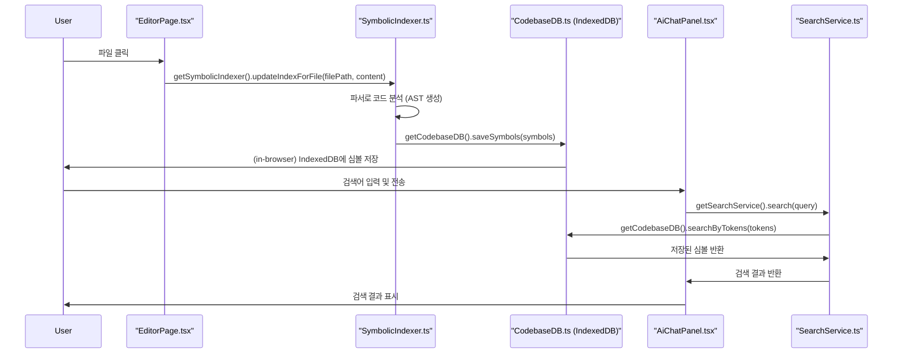
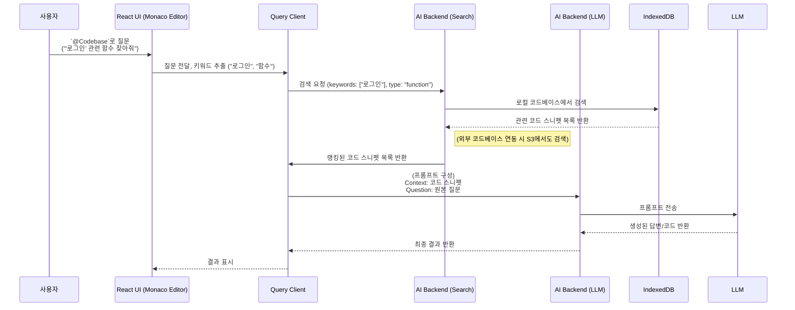
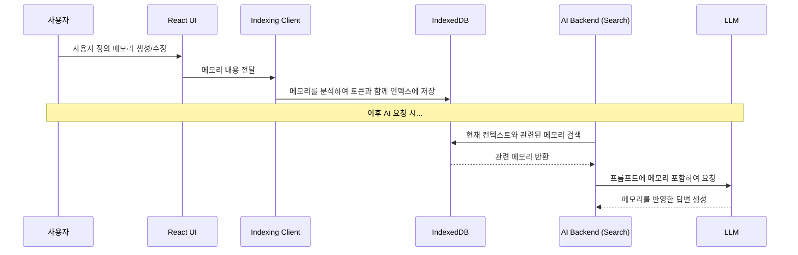

WindSurf 클론 프로젝트의 개발 설계서를 요청하신 내용을 기반으로 대폭 수정하고, 후반부까지 완성했습니다. 특히 커서(Cursor) IDE의 핵심적인 AI 에이전트 기능, 실시간 협업, 웹 기반 코드 실행에 초점을 맞추었으며, 마케팅 전략 또한 MAU 10,000 조기 달성을 목표로 개발자 커뮤니티 특성을 살려 상세하게 작성했습니다.

-----

# 00. WindSurf Clone 프로덕트-디자인 헌법

  - 전체 프로젝트의 뼈대 및 맥락 제공 이 문서는 WindSurf IDE의 핵심 기능을 웹 기반으로 구현한 클론 프로젝트의 목표, 기능, 기술 스택 등 모든 것을 정의합니다.
  - 모든 개발설계코드 작성의 기준점 새로운 기능을 추가하거나 기존 코드를 수정할 때, 이 문서를 최우선으로 참고해야 합니다.
  - LLM 및 개발자가 반드시 준수해야 할 규칙 명시 아래 규칙들은 프로젝트의 일관성과 품질을 유지하기 위한 핵심 약속입니다.
       명시적인 의도(주석) 모든 주요 함수모듈 상단에는 ` [의도] ...`와 ` [책임] ...` 형식으로 주석을 작성하여 의도와 책임을 명확히 해야 합니다.
       헌법 준수 새로운 기능 개발 시 본 헌법의 설계와 원칙을 반드시 준수해야 합니다.
       불확실성 명시 불확실하거나 논의가 필요한 부분은 ` [불확실한 부분] ...` 또는 ` TODO`, ` FIXME` 등으로 명시하고 피드백을 요청해야 합니다.
       설계 철학 준수 Claude, ChatGPT 등 LLM은 이 문서의 설계 철학(UIUX 가이드라인, 기술 스택 등)에서 벗어나는 코드를 생성해서는 안 됩니다.
  - 보안 원칙
       API 키 및 민감정보는 반드시 서버사이드에서 관리, 클라이언트 노출 금지
       사용자 코드 및 프로젝트 정보는 암호화하여 저장
       웹 기반 코드 실행 시 샌드박스 환경 구축 필수
  - 기술 제약사항
       웹 기반 IDE 브라우저에서 완전히 동작하는 IDE 구현
       실시간 협업 WebSocket을 통한 실시간 코드 공유 및 편집
       클라우드 우선 모든 프로젝트 데이터는 클라우드에 저장되며, 로컬 캐싱 지원
  - 문서 동기화 모든 기능 및 설계 변경 사항은 이 문서에 즉시 반영되어야 합니다.
      개발환경,설정,핵심코드 등 추가나 변경된 세부사항은 develop-guide.md 에 시간순으로 빠짐없이 기록합니다

-----

# 🎯 1. 프로젝트 목표

## 1.1 비즈니스 목표

  - 주요 목표 WindSurf Editor의 핵심 기능(AI 에이전트 기반 IDE)을 웹 기반으로 구현하여 접근성 향상
  - 부가 목표 오픈소스 기반 커뮤니티 구축 및 개발자 생태계 확장
  - 수익 목표 1년 내 월 10,000 MAU 달성 및 프리미엄 구독 모델 도입

## 1.2 기술적 목표

  - 성능 초기 로딩 시간 3초 이내, 코드 자동완성 응답 시간 500ms 이내
  - 확장성 동시 사용자 1,000명 처리 가능
  - AI 통합 Cascade, Supercomplete, Memories 기능 웹 기반 구현

## 1.3 사용자 목표

  - 타겟 사용자 웹 기반 IDE를 선호하는 개발자, 크로스 플랫폼 개발 환경을 원하는 개발자
  - 핵심 가치 접근성, AI 기반 생산성, 실시간 협업
  - 사용자 경험 데스크톱 IDE 수준의 기능을 브라우저에서 제공

-----

# 🏗️ 2. 시스템 개요

## 2.1 시스템 비전

WindSurf Clone은 웹 기반 AI-네이티브 IDE로, 개발자들이 플로우 상태를 유지하며 효율적으로 코딩할 수 있도록 지원하는 차세대 개발 환경입니다.

## 2.2 핵심 기능

  - Cascade AI 자율적으로 메모리를 생성하여 대화 간 중요한 맥락을 기억하는 AI 에이전트
  - Supercomplete 향상된 AI 기반 코드 자동완성
  - Memories System 사용자 정의 규칙과 자동 생성 메모리를 통한 지속적인 컨텍스트 유지
  - 웹 기반 코드 실행 브라우저에서 직접 코드 실행 및 디버깅 (샌드박스 환경)
  - 실시간 협업 다중 사용자 동시 편집 지원
  - Git 통합 버전 관리 시스템 연동

## 2.3 시스템 특징

  - 웹 기반 아키텍처 브라우저에서 완전히 동작하는 IDE
  - AI 우선 설계 모든 기능이 AI와 통합되어 동작
  - 마이크로서비스 아키텍처 각 기능은 독립적인 서비스로 구성
  - 실시간 동기화 WebSocket을 통한 실시간 상태 동기화

## 2.4 핵심 기술 스택

  - 프론트엔드 Next.js 14, React 18, TypeScript, Monaco Editor, Tailwind CSS, shadcnui
  - 백엔드 Node.js, Express, Socket.io, Redis
  - AI 서비스 OpenAI API, Anthropic Claude API (API Gateway를 통해 관리)
  - 데이터베이스 PostgreSQL (주 데이터), Redis (캐싱, 세션 관리, 실시간 데이터), AWS S3 (파일 저장)
  - 인증 NextAuth.js (GitHub, Google OAuth)
  - 배포 Docker, Kubernetes (EKSGKE), AWSGCP

-----

# 🏛️ 3. 시스템 구조

## 3.1 전체 시스템 구조 (Code-Chunking & Symbolic Search 기반)

기존 벡터 DB 중심 아키텍처에서 벗어나, **코드의 구조적 특징을 최대한 활용**하는 심볼릭 검색 기반 아키텍처로 전환합니다. 이는 코드 검색의 정확성과 효율성을 극대화합니다.

```mermaid
graph TD
    subgraph "Client (Browser)"
        UI[UI Layer - Monaco Editor, File Explorer]
        FIO[File I/O & Watcher]
        IDX_CLIENT[Indexing Client w/ Tree-sitter]
        QUERY_CLIENT[Query Client]
    end

    subgraph "Indexing Storage"
        LOCAL_DB[(IndexedDB<br>For Local Codebase)]
        REMOTE_DB[(S3 Object Storage<br>For External Codebase Index)]
    end
    
    subgraph "AI Backend Service"
        API_GW[API Gateway]
        SEARCH_SVC[Search Service]
        LLM_GW[LLM Gateway]
        LLM[Code Generation LLM<br>(GPT-4, Claude, etc.)]
    end

    %% Client-side Flow
    UI -- "File changes" --> FIO
    FIO -- "File Content" --> IDX_CLIENT
    IDX_CLIENT -- "Extracted Symbols & Chunks" --> LOCAL_DB
    
    UI -- "User Query (@Codebase)" --> QUERY_CLIENT
    QUERY_CLIENT -- "Search Keywords" --> API_GW

    %% RAG Flow
    API_GW --> SEARCH_SVC
    SEARCH_SVC -- "Search in Local" --> LOCAL_DB
    SEARCH_SVC -- "Search in External" --> REMOTE_DB
    SEARCH_SVC -- "Ranked Snippets" --> LLM_GW
    
    LLM_GW -- "Constructed Prompt" --> LLM
    LLM -- "Generated Code / Answer" --> LLM_GW
    LLM_GW --> API_GW
    API_GW --> QUERY_CLIENT
    QUERY_CLIENT --> UI
```

## 3.2 컴포넌트 아키텍처

- **`src/components/editor`**: 파일 탐색기, Monaco Editor, 웹 미리보기 등 IDE의 핵심 UI 컴포넌트가 위치합니다.
- **`src/lib/ai`**: AI 관련 로직을 처리하는 모듈이 위치합니다.
  - **`indexing/SymbolicIndexer.ts`**: `web-tree-sitter`를 사용하여 소스 코드를 파싱하고 심볼(함수, 클래스 등)을 추출하여 인덱싱하는 역할을 담당합니다.
  - **`db/CodebaseDB.ts`**: 추출된 코드 심볼을 브라우저의 IndexedDB에 저장하고 검색하는 로직을 관리합니다.
  - **`SearchService.ts`**: 사용자의 검색 쿼리를 받아 `CodebaseDB`를 통해 인덱싱된 데이터를 검색하는 서비스를 제공합니다.
- **`src/app/editor/page.tsx`**: IDE의 메인 페이지로, 각 컴포넌트를 조합하고 사용자 상호작용을 처리합니다.

#### 아키텍처 다이어그램 (클라이언트)



## 3.3 보안 구조

  - 인증인가 NextAuth.js를 통한 안전한 OAuth 2.0 (GitHub, Google) 인증. JWT (JSON Web Token) 기반의 세션 관리 및 역할 기반 접근 제어 (RBAC)를 구현하여 프로젝트 및 기능에 대한 사용자 권한을 세분화.
  - API 보안 API Gateway에서 Rate limiting, CORS (Cross-Origin Resource Sharing) 설정, 입력 유효성 검사를 통해 API 남용 및 취약점 공격 방지. 모든 백엔드 API 요청은 JWT 토큰 검증을 통해 인증된 사용자만 접근 가능하도록 합니다.
  - 코드 실행 보안 (샌드박스)
       Docker 컨테이너 기반 사용자 코드는 격리된 Docker 컨테이너 내에서 실행됩니다. 각 실행 요청마다 새로운 컨테이너를 생성하고, 실행 완료 후 즉시 파기하여 잔류 파일 및 프로세스에 의한 보안 위협을 차단합니다.
       자원 제한 컨테이너의 CPU, 메모리, 네트워크 접근 권한을 제한하여 악의적인 코드 실행으로 인한 시스템 리소스 고갈 및 외부망 공격을 방지합니다.
       권한 최소화 컨테이너는 코드 실행에 필요한 최소한의 권한만 가집니다.
  - 데이터 보안
       전송 중 암호화 (In-transit Encryption) 모든 클라이언트-서버 통신은 HTTPS (TLSSSL)를 통해 암호화됩니다. WebSocket 통신 또한 WSS (WebSocket Secure)를 사용하여 암호화된 채널을 사용합니다.
       저장 중 암호화 (At-rest Encryption) PostgreSQL 데이터베이스에 저장되는 사용자 코드 및 민감한 프로젝트 정보는 데이터베이스 수준에서 암호화되거나, 애플리케이션 계층에서 암호화되어 저장됩니다. AWS S3에 저장되는 파일도 서버 측 암호화(SSE-S3)를 적용합니다.

## 3.4 주요 개발 항목

```
┌─ Phase 1 기본 인프라 구축 (MVP)
│  ├─ ✅ 프로젝트 초기화 (Next.js 14 + TypeScript)
│  ├─ ✅ UI 컴포넌트 구축 (Monaco Editor + Tailwind CSS + shadcnui)
│  ├─ ✅ 사용자 인증 시스템 (NextAuth.js, GitHub OAuth)
│  ├─ 🚧 프로젝트 관리 시스템 (CRUD, PostgreSQL 연동)
│  ├─ 🚧 파일 시스템 구축 (Monaco Editor 연동, S3 업로드다운로드)
│  └─ 📋 기본 UI 구축 (레이아웃, 파일 탐색기, 상태 바)
│
├─ Phase 2 AI 기능 구현
│  ├─ 🔴 [High] AI 서비스 통합 (OpenAIClaude API 연동, API Gateway 경유)
│  ├─ 🔴 [High] Cascade AI 구현 (대화형 AI 에이전트, 프롬프트 구성)
│  ├─ 🟡 [Medium] Supercomplete 구현 (AI 기반 코드 자동완성, 언어 서버 프로토콜 활용)
│  ├─ 🟡 [Medium] Memories System 구현 (컨텍스트 저장검색, 벡터 임베딩)
│  ├─ 🟢 [Low] AI 기반 코드 리팩토링디버깅 제안
│  └─ 🟢 [Low] AI 기반 테스트 코드 생성
│
├─ Phase 3 고급 기능 구현
│  ├─ 🔴 [High] 웹 기반 코드 실행 (Docker 샌드박스 환경 구축 및 통합)
│  ├─ 🔴 [High] 실시간 협업 (WebSocket 기반 OT 알고리즘 구현, 다중 사용자 커서)
│  ├─ 🟡 [Medium] Git 통합 (기본적인 Git 명령어 UI, 커밋푸시풀)
│  ├─ 🟡 [Medium] 터미널 통합 (웹 기반 터미널 구현)
│  ├─ 🟢 [Low] 플러그인 시스템 (사용자 정의 플러그인 로드 및 실행)
│  └─ 🟢 [Low] 모바일 반응형 지원 (뷰어 모드)
│
└─ Phase 4 상용화 및 확장
   ├─ 🟡 [Medium] 성능 최적화 (로딩 속도, AI 응답, 코드 실행 속도)
   ├─ 🟡 [Medium] 구독 결제 시스템 (Stripe 통합, 프리미엄 기능 활성화)
   ├─ 🟢 [Low] 팀 관리 기능 (워크스페이스, 멤버 초대, 권한 관리)
   ├─ 🟢 [Low] 고급 분석 및 모니터링 (사용량 통계, 오류 보고)
   ├─ 🟢 [Low] 커뮤니티 마켓플레이스 (플러그인, 템플릿 공유)
   └─ 🟢 [Low] 다국어 지원
```

-----

# 📊 4. 데이터 모델 & 흐름

## 4.1 핵심 데이터 모델

PostgreSQL을 주 데이터베이스로 사용하며, Redis는 캐싱, 세션 관리, 실시간 데이터(예 협업 중 변경사항 임시 저장)에 활용됩니다. AWS S3는 실제 코드 파일 저장을 담당합니다.

```typescript
 사용자 테이블 (PostgreSQL)
interface User {
  id string;            NextAuth.js에서 제공하는 사용자 ID
  email string;
  name string;
  avatarUrl string;
  provider 'github'  'google';
  tier 'free'  'pro'  'enterprise';  구독 등급
  createdAt Date;
  updatedAt Date;
}

 프로젝트 테이블 (PostgreSQL)
interface Project {
  id string;            UUID
  name string;
  description string;
  ownerId string;       User.id 외래키
  visibility 'private'  'public'  'team';  공개 여부
  language string;      메인 언어 (e.g., 'typescript', 'python')
  framework string;    프레임워크 (e.g., 'nextjs', 'react', 'django')
  createdAt Date;
  updatedAt Date;
   S3 버킷폴더 경로 또는 고유 식별자 (실제 파일은 S3에 저장)
  s3Path string; 
}

 파일 테이블 (PostgreSQL - 메타데이터만, 실제 내용은 S3)
interface File {
  id string;            UUID
  projectId string;     Project.id 외래키
  path string;          프로젝트 내 상대 경로 (e.g., 'srccomponentsbutton.tsx')
  name string;
  type 'file'  'directory';  파일 또는 디렉토리
  language string;     파일별 언어 (e.g., 'typescript', 'json')
  size number;         파일 크기 (바이트)
  lastModifiedAt Date;  최종 수정 시간
   실제 파일 내용의 S3 URL (미리 서명된 URL 사용)
  s3FileUrl string; 
  createdAt Date;
  updatedAt Date;
}

 Cascade 대화 테이블 (PostgreSQL)
interface CascadeConversation {
  id string;            UUID
  projectId string;     Project.id 외래키
  userId string;        User.id 외래키
  title string;         대화 요약 제목 (AI 생성 또는 사용자 지정)
  contextSnapshot string;  대화 시작 시점의 주요 컨텍스트 요약
  createdAt Date;
  updatedAt Date;
}

 Cascade 메시지 테이블 (PostgreSQL)
interface CascadeMessage {
  id string;
  conversationId string;  CascadeConversation.id 외래키
  role 'user'  'assistant';
  content string;
   AI 응답의 도구 호출, 코드 블록 등 메타데이터
  metadata Recordstring, any; 
  createdAt Date;
}

 메모리 테이블 (PostgreSQL - 벡터 임베딩은 별도 벡터DB 또는 PgVector)
interface Memory {
  id string;            UUID
  projectId string;     Project.id 외래키 (선택 사항 - 전역 메모리)
  userId string;        User.id 외래키
  type 'user_rule'  'auto_generated'  'snippet';  메모리 유형
  title string;         메모리 제목
  content string;       실제 메모리 내용 (코드 스니펫, 지침 등)
  tokens string[];       검색을 위한 키워드 토큰
  tags string[];       검색을 위한 태그
  isActive boolean;     사용 여부
  createdAt Date;
  updatedAt Date;
}

 협업 세션 테이블 (PostgreSQL)
interface CollaborationSession {
  id string;            UUID
  projectId string;     Project.id 외래키
  creatorId string;     세션 생성자 ID
  participants string[];  참여 사용자 ID 배열
  isActive boolean;     현재 활성 세션 여부
  createdAt Date;
  endedAt Date;
}

 (Redis) 실시간 협업을 위한 `projectIdfileId`별 Operation Log, 사용자 커서 위치 등 휘발성 데이터
 (Redis) AI 캐시, 세션 데이터
```

## 4.2 Cascade AI 작동 흐름 (Symbolic Search 기반)



## 4.3 실시간 협업 흐름

```mermaid
sequenceDiagram
    participant UserA as 사용자 A
    participant UserB as 사용자 B
    participant UserC as 사용자 C
    participant UI as Monaco Editor UI
    participant ClientSocket as Socket.io Client
    participant CollabSvc as Collaboration Service (Node.js, Socket.io Server)
    participant OT as Operational Transform Module
    participant Redis as Redis
    participant ProjectSvc as Project Service

    UserA-UI 코드 편집 (입력, 삭제 등)
    UI-ClientSocket Operation 전송 (예 {type 'insert', pos 10, text 'a'})
    ClientSocket-CollabSvc Operation 수신
    CollabSvc-Redis 현재 파일 상태 로드 (캐시)
    CollabSvc-OT Operation 변환충돌 해결
    OT--CollabSvc 변환된 Operation
    CollabSvc-Redis 업데이트된 파일 상태 저장 (캐시)
    CollabSvc-CollabSvc 연결된 모든 클라이언트 (UserB, UserC)에게 브로드캐스트
    CollabSvc--ClientSocket 업데이트된 Operation 전송
    ClientSocket-UI UI 업데이트 (코드 반영)
    
    Note over UserA, UserB 동시 편집 시
    UserB-UI 동시 코드 편집
    UI-ClientSocket Operation 전송
    ClientSocket-CollabSvc Operation 수신
    CollabSvc-OT 충돌 감지 및 해결 (UserA의 변경과 UserB의 변경 통합)
    OT--CollabSvc 충돌 해결된 Operation
    CollabSvc-Redis 파일 상태 업데이트
    CollabSvc-CollabSvc 모든 클라이언트에 브로드캐스트
```

## 4.4 메모리 시스템 흐름 (Symbolic Search 기반)



-----

# 🔧 5. 핵심 구현 명세

## 5.1 Cascade AI 시스템

  - 대화형 AI 에이전트 Monaco Editor의 특정 영역(사이드바, 하단 패널)에 채팅 UI를 통합하여, 사용자가 자연어 명령으로 코드 생성, 디버깅, 리팩토링 등을 요청할 수 있도록 합니다. 백엔드 `AI Service`는 프로젝트 파일 구조, 열린 파일 내용, 선택된 코드 블록, Git 변경사항 등을 자동으로 수집하여 `Cascade`의 프롬프트에 포함시킵니다.
  - 자동 메모리 생성 `AI Service` 내의 `Cascade` 모듈은 사용자-AI 상호작용, 코드 변경, 터미널 출력 등에서 중요한 정보(새로운 함수 정의, 복잡한 버그 해결 방식, 특정 API 사용 패턴)를 자동으로 감지하여 `Memory System`에 저장 요청합니다. 이는 LLM 호출 시 컨텍스트 윈도우 한계를 극복하고 일관된 답변을 제공하는 데 기여합니다.
  - 프로젝트 인식 `AI Service`는 `Project Service`와 연동하여 현재 열려있는 프로젝트의 파일 목록, `package.json` 또는 `requirements.txt`와 같은 의존성 파일, `.git` 설정 등을 파싱하여 AI의 컨텍스트에 추가합니다. 이를 통해 AI는 프로젝트의 전반적인 구조와 기술 스택을 이해하고 보다 정확한 제안을 할 수 있습니다.

## 5.2 메모리 시스템 구현

  - 사용자 정의 규칙 사용자가 특정 코딩 스타일, 회사 내부 라이브러리 사용법, 개인적인 개발 철학 등을 `Memory`로 저장하고 활성화비활성화할 수 있는 UI (`memory-panel.tsx`)를 제공합니다. 이 메모리들은 AI가 코드 생성리팩토링 시 우선적으로 참조됩니다.
  - 자동 생성 메모리 `Cascade AI`와의 상호작용 과정에서 자동으로 생성되는 메모리들입니다. 예를 들어, AI가 특정 버그를 해결하는 방법을 제안하고 사용자가 이를 적용했다면, 해당 해결 방식과 관련 코드 스니펫이 자동으로 메모리로 저장됩니다.
  - 벡터 검색 `Memories Service`는 `OpenAI Embeddings API` 등을 사용하여 메모리 내용을 벡터 임베딩으로 변환하고, 이를 `PgVector` 또는 별도의 벡터 데이터베이스(예 Pinecone)에 저장합니다. AI 요청 시, 현재 컨텍스트를 임베딩으로 변환하여 벡터 데이터베이스에서 가장 유사한 메모리들을 검색하여 AI의 프롬프트에 추가합니다.

## 5.3 웹 기반 코드 실행

  - Docker 컨테이너 `Code Execution Service`는 사용자의 코드 실행 요청을 받으면, 요청된 언어(Python, Node.js, Go 등)에 맞는 격리된 Docker 컨테이너를 동적으로 생성합니다. 이 컨테이너는 요청된 프로젝트 파일을 S3에서 다운로드하여 실행하고, 결과를 스트리밍합니다.
  - 다중 언어 지원 각 언어별 Docker 이미지를 미리 준비하여, 사용자가 프로젝트 생성 시 선택한 언어에 따라 적절한 컨테이너를 스핀업합니다.
  - 실시간 출력 코드 실행 결과(표준 출력, 에러)는 WebSocket을 통해 클라이언트의 `terminal.tsx` 컴포넌트로 실시간으로 스트리밍되어 표시됩니다.

## 5.4 실시간 협업 시스템

  - Operational Transform (OT) `Collaboration Service`는 `Socket.io`를 통해 실시간으로 클라이언트의 코드 편집 변경사항(Operation)을 수신합니다. 수신된 Operation은 OT 알고리즘(예 ShareDB, Yjs)을 통해 다른 사용자들의 동시 변경사항과 충돌을 해결하고, 통합된 변경사항을 모든 참여자에게 브로드캐스트합니다.
  - 사용자 인식 `Socket.io`를 통해 각 사용자의 실시간 커서 위치, 텍스트 선택 영역을 공유하고, `user-cursors.tsx` 컴포넌트에서 이를 시각적으로 표시합니다.
  - 권한 관리 `Collaboration Session` 생성 시 프로젝트 소유자는 참여자에게 읽기 전용, 편집 권한 등을 설정할 수 있습니다. `Collaboration Service`는 모든 들어오는 Operation에 대해 사용자 권한을 검증합니다.

## 5.5 성능 최적화

  - 코드 분할 (Code Splitting) Next.js의 동적 임포트를 활용하여 초기 로딩 시 불필요한 번들 크기를 줄이고, 특정 기능(예 코드 실행, AI 패널)은 필요할 때만 로드되도록 합니다.
  - 가상화 (Virtualization) Monaco Editor는 대용량 파일 처리 시 자체적으로 가상 스크롤링을 지원하지만, 파일 탐색기나 로그 패널 등에서도 `react-window`와 같은 라이브러리를 사용하여 UI 성능을 최적화합니다.
  - 캐싱 Redis를 활용하여 AI 응답, 자주 요청되는 파일 내용, 사용자 세션 데이터 등을 캐싱하여 백엔드 부하를 줄이고 응답 시간을 단축합니다.
  - CDN (Content Delivery Network) AWS S3에 저장된 정적 자산(프로젝트 파일, 이미지 등)은 CloudFront와 같은 CDN을 통해 사용자에게 더 빠르게 전송되도록 설정합니다.

-----

# 🧪 6. 테스트 전략

## 6.1 테스트 레벨별 전략

  - Unit Tests `Jest`와 `React Testing Library`를 사용하여 개별 React 컴포넌트 (`monaco-editor.tsx`, `ai-assistant.tsx`), 커스텀 훅 (`use-cascade.ts`), 유틸리티 함수 (`operational-transform.ts`) 등의 로직을 독립적으로 테스트합니다.
  - Integration Tests `Cypress`를 사용하여 프론트엔드와 백엔드 API 간의 연동을 테스트합니다. (예 사용자 로그인 후 프로젝트 생성, 파일 업로드, AI에게 코드 생성 요청).
  - E2E (End-to-End) Tests `Playwright`를 사용하여 실제 사용자 시나리오를 모방한 테스트를 자동화합니다. (예 브라우저 열기 - 로그인 - 프로젝트 열기 - 코드 편집 - AI와 대화 - 코드 실행 - 결과 확인 - 프로젝트 공유).
  - Performance Tests
       Lighthouse CI CICD 파이프라인에 통합하여 웹 애플리케이션의 성능(로딩 속도, TTI 등)을 지속적으로 측정하고 기준 미달 시 빌드를 실패시킵니다.
       Artillery 백엔드 API 및 WebSocket 서버에 부하를 주어 동시 사용자 수 증가에 따른 응답 시간 및 처리량을 측정합니다.
  - Security Tests
       SASTDAST 정적동적 분석 도구를 사용하여 코드 및 실행 환경의 잠재적 보안 취약점을 스캔합니다.
       Penetration Testing 전문 보안 업체를 통해 모의 해킹을 수행하여 시스템의 취약점을 점검합니다.
       Sandbox Isolation Test 코드 실행 샌드박스가 완벽하게 격리되는지, 외부 시스템에 접근하거나 악의적인 행위를 할 수 없는지 테스트합니다.

## 6.2 AI 기능 테스트

  - AI 응답 품질 테스트
       골든셋 (Golden Set) 테스트 특정 프롬프트와 컨텍스트(코드 스니펫, 메모리)에 대해 기대되는 AI 응답을 미리 정의하고, AI가 생성한 응답이 해당 기대치에 얼마나 부합하는지 정량적으로 평가합니다.
       휴먼 평가 (Human Evaluation) 일정 비율의 AI 응답에 대해 개발자 또는 QA 엔지니어가 직접 검토하고 피드백을 제공하여 품질을 개선합니다.
       코드 생성 정확도 AI가 생성한 코드가 문법적으로 올바르고, 의도한 기능을 정확히 수행하는지 테스트합니다.
  - 메모리 시스템 테스트
       컨텍스트 유지 테스트 여러 번의 대화나 코드 변경 이후에도 AI가 이전의 중요한 컨텍스트(메모리)를 올바르게 기억하고 활용하는지 확인합니다.
       검색 정확도 특정 키워드나 컨텍스트로 메모리를 검색했을 때, 관련성 높은 메모리들이 정확히 검색되는지 테스트합니다. (벡터 검색 정확도)
       메모리 생성 로직 특정 이벤트(예 버그 수정, 새로운 기능 구현 완료) 발생 시 자동으로 의미 있는 메모리가 생성되는지 검증합니다.
  - 지연 시간 테스트 AI 응답 시간, 특히 `Supercomplete`의 자동완성 응답 시간이 사용성을 해치지 않는 수준(500ms 이내)인지 지속적으로 모니터링합니다.

## 6.3 실시간 협업 테스트

  - 동시 편집 테스트 여러 사용자가 동시에 동일한 코드 파일을 편집했을 때, 모든 사용자의 에디터가 올바르게 동기화되고 충돌 없이 변경사항이 반영되는지 테스트합니다. (수십 명의 동시 사용자 시뮬레이션)
  - 충돌 해결 테스트 OT 알고리즘이 복잡한 동시 편집 상황(예 같은 라인 동시 수정, 삽입삭제 동시 발생)에서 올바르게 충돌을 해결하고 일관된 상태를 유지하는지 시나리오 기반으로 테스트합니다.
  - 네트워크 지연 테스트 의도적으로 네트워크 지연(Latency)을 발생시켜도 실시간 협업이 원활하게 이루어지는지, 지연 발생 시 사용자 경험이 크게 저해되지 않는지 테스트합니다.
  - 대용량 파일 협업 수천 라인 이상의 대용량 코드 파일에서도 실시간 협업 성능이 유지되는지 테스트합니다.

-----

# 🚀 7. 프로덕트 구축 로드맵

## 7.1 구축 항목 및 현황

새로운 **Code Chunking & Symbolic Search 기반 RAG 아키텍처**에 따라 로드맵을 재정의합니다.
세부 내용은 `docs/code_chunking_rag_구축가이드.md` 문서를 따릅니다.

| 단계 | 기능 (Epic) | 세부 작업 (User Story) | 우선순위 | 상태 |
| :--- | :--- | :--- | :--- | :--- |
| **Phase 1: 기반 구축** |
| 1-1 | **문서화** | `code_chunking_rag_architecture.md` 작성 | 최우선 | **완료** |
| 1-2 | **문서화** | `code_chunking_rag_구축가이드.md` 작성 | 최우선 | **완료** |
| 1-3 | **샘플 데이터** | 테스트용 샘플 프로젝트 2개 정의 및 생성 | 높음 | 대기 |
| **Phase 2: 로컬 코드베이스 인덱싱** |
| 2-1 | **DB 구축** | 로컬 코드베이스 저장을 위한 IndexedDB 스키마 설계 및 래퍼(`CodebaseDB`) 구현 | 높음 | 대기 |
| 2-2 | **파서 연동** | Tree-sitter WASM 모듈 로드 및 초기 파서 설정 | 높음 | 대기 |
| 2-3 | **인덱싱 로직** | 파일 변경 감지 시 AST를 생성하고 심볼/청크를 추출하는 `SymbolicIndexer` 구현 | 높음 | 대기 |
| 2-4 | **UI 연동** | Monaco Editor의 파일 저장 이벤트와 `SymbolicIndexer` 연동 | 중간 | 대기 |
| **Phase 3: AI 검색 및 생성 (Cascade AI)** |
| 3-1 | **API 설계** | `@Codebase` 쿼리를 처리할 백엔드 API 엔드포인트 설계 (`/api/ai/search`) | 높음 | 대기 |
| 3-2 | **검색 구현** | IndexedDB에서 키워드 기반으로 코드 스니펫을 검색하고 랭킹을 매기는 `SearchService` 구현 | 높음 | 대기 |
| 3-3 | **프롬프트 구성** | 검색된 스니펫을 컨텍스트로 LLM에 전달할 프롬프트 생성 로직 구현 | 높음 | 대기 |
| 3-4 | **AI 연동** | Cascade AI 채팅 UI와 백엔드 API 연동 | 중간 | 대기 |
| **Phase 4: 외부 코드베이스 인덱싱 & 메모리 시스템** |
| 4-1 | **DB 구축** | 외부 코드베이스 인덱스 저장을 위한 S3 연동 로직 구현 (업로드/다운로드) | 중간 | 대기 |
| 4-2 | **인덱싱 로직** | `git clone` 후 전체 프로젝트를 인덱싱하는 배치 스크립트 작성 | 중간 | 대기 |
| 4-3 | **통합 검색** | `SearchService`가 로컬(IndexedDB)과 외부(S3) 인덱스를 모두 검색하도록 확장 | 낮음 | 대기 |
| 4-4 | **메모리 시스템** | Cascade AI 로직을 재활용하여 Memory System 구축 | 낮음 | 대기 |

## 7.2 개발 타임라인

  - Phase 1 (1-2개월) 기본 인프라 및 핵심 에디터 기능 구축. 사용자들이 로그인하여 프로젝트를 생성하고 파일을 편집할 수 있는 MVP(Minimum Viable Product)를 완성합니다.
  - Phase 2 (2-3개월) AI 핵심 기능 (Cascade, Supercomplete, Memories) 개발 및 통합. 사용자가 AI의 도움을 받아 코딩 생산성을 높일 수 있도록 합니다.
  - Phase 3 (2-3개월) 고급 기능 (웹 기반 코드 실행, 실시간 협업, Git터미널 통합) 구현. IDE로서의 완성도를 높이고 협업 기능을 제공합니다.
  - Phase 4 (1-2개월) 상용화 준비 및 확장 기능 개발. 성능 최적화, 결제 시스템 도입, 팀 관리 및 커뮤니티 기능으로 서비스를 확장합니다.

-----

# 📈 8. 그로스해킹 마케팅 전략

## 8.1 AARRR 프레임워크

### 8.1.1 Acquisition (사용자 획득)

  - 개발자 커뮤니티 타겟팅
       GitHub, Dev.to, Reddit (rprogramming, rwebdev, ropensource) 등 개발자 중심 커뮤니티에서 오픈소스 프로젝트로 홍보 및 적극적인 참여.
       Stack Overflow, CodeProject 등 Q&A 플랫폼에서 WindSurf Clone 활용 사례 공유.
       개발자 컨퍼런스, 해커톤 참가 및 스폰서십을 통한 직접적인 홍보 및 데모 시연.
  - 기술 블로그 및 유튜브 채널
       WindSurf Clone의 AI 기능 (Cascade, Supercomplete) 활용법, 실시간 협업 데모, 생산성 향상 팁 등 유용한 정보성 콘텐츠 제작 및 배포.
       경쟁사(VS Code Web, Codesandbox, Gitpod)와 비교 분석을 통해 WindSurf Clone의 차별점 강조.
  - SEO 최적화
       핵심 키워드 웹 기반 IDE, AI 코드 에디터, 실시간 협업 IDE, 클라우드 개발 환경 등을 타겟팅하여 웹사이트 콘텐츠 및 메타데이터 최적화.
       기술 튜토리얼, 사용 가이드, 문제 해결 솔루션 등 검색 엔진에 노출될 수 있는 고품질 콘텐츠 지속적으로 생성.
  - 인플루언서 마케팅
       유명 개발자, 기술 유튜버, 블로거와 협력하여 WindSurf Clone 리뷰 및 홍보 콘텐츠 제작.
       얼리 액세스 프로그램 운영을 통해 영향력 있는 개발자들에게 우선적으로 제품을 경험하게 하고 피드백 및 홍보 유도.

### 8.1.2 Activation (활성화)

  - 온보딩 최적화
       첫 방문 시 5분 이내에 첫 프로젝트 생성 및 AI 기능(Cascade)을 체험할 수 있도록 간소화된 온보딩 플로우 제공.
       인터랙티브 튜토리얼 또는 퀵스타트 가이드를 제공하여 주요 기능 사용법을 쉽게 익힐 수 있도록 지원.
       다양한 언어 및 프레임워크별 샘플 프로젝트 템플릿을 제공하여 사용자가 바로 코딩을 시작할 수 있도록 유도.
  - 퍼스트 임프레션 (First Impression)
       빠른 초기 로딩 속도 ( 3초)와 부드러운 UIUX를 제공하여 데스크톱 IDE에 필적하는 사용감을 선사.
       직관적인 UI 디자인과 최소화된 학습 곡선으로 사용자가 쉽게 적응하도록 지원.

### 8.1.3 Retention (유지)

  - AI 기능 고도화 Cascade, Supercomplete, Memories System의 지속적인 개선을 통해 개발 생산성 향상이라는 핵심 가치를 지속적으로 제공.
  - 실시간 협업 활성화 프로젝트 공유 및 협업 기능을 쉽게 접근할 수 있도록 UIUX를 개선하고, 협업 세션 관련 알림 및 히스토리 제공.
  - 정기적인 업데이트 및 피드백 반영 새로운 기능 추가, 버그 수정, 성능 개선을 정기적으로 수행하고, 사용자 피드백을 적극적으로 반영하여 사용자 만족도 제고.
  - 개인화된 작업 환경 사용자 설정(테마, 키 바인딩, 확장 프로그램)을 클라우드에 저장하여 어떤 환경에서든 동일한 개발 환경을 제공.
  - 커뮤니티 이벤트 온라인 코딩 챌린지, 워크샵, AMA(무엇이든 물어보세요) 세션 등을 개최하여 사용자 참여 유도.

### 8.1.4 Referral (추천)

  - 공유 기능 최적화
       현재 편집 중인 프로젝트, 코드 스니펫, AI와의 대화 기록 등을 소셜 미디어, 이메일, 링크를 통해 쉽게 공유할 수 있는 기능 제공.
       특히 실시간 협업 초대 링크를 쉽게 생성하고 공유할 수 있도록 UIUX를 개선하여 바이럴 확산 유도.
  - 인센티브 프로그램
       친구 초대 시 초대자와 피초대자 모두에게 프리미엄 기능 무료 체험 기간 제공 등 인센티브 도입 (MAU 10,000 달성 후 고려).
  - 'Made with WindSurf Clone' 배지 사용자가 자신의 프로젝트에 앱에서 제공하는 배지를 추가하여 홍보 효과.

### 8.1.5 Revenue (수익)

  - 프리미엄 구독 모델
       Tiered Pricing 무료(Free), 프로(Pro), 엔터프라이즈(Enterprise) 등 다단계 요금제.
       Pro 기능
           무제한 AI 토큰 사용 (Cascade, Supercomplete).
           개인 메모리 저장 용량 확장.
           무제한 협업 세션 및 참여자 수.
           고급 코드 실행 환경 (더 빠른 CPU메모리, GPU 옵션).
           비공개 프로젝트 수 무제한.
           우선 기술 지원.
       Enterprise 기능 팀 관리, SLA 보장, 전용 인스턴스, 온프레미스 배포 옵션.
  - 플러그인템플릿 마켓플레이스 (향후) 개발자들이 직접 제작한 플러그인, 코드 템플릿, AI 메모리 등을 판매하고 플랫폼이 수수료를 받는 모델.

## 8.2 성장 실험 계획

  - AB 테스트 항목
       랜딩 페이지 디자인 및 카피 (Call-to-Action 버튼, 핵심 기능 강조 방식).
       온보딩 플로우의 단계 수 및 인터랙티브 요소.
       Cascade AI 채팅창의 초기 프롬프트 및 추천 질문.
       Supercomplete의 자동완성 제안 방식 (팝업 vs 인라인).
       프로젝트 생성 템플릿 종류 및 추천 알고리즘.
       프리미엄 구독 모델의 가격 정책 및 기능 번들 구성.
  - 바이럴 계수(Viral Coefficient) 최적화 공유 기능 사용률 및 해당 기능으로 인한 신규 사용자 전환율을 측정하여 개선합니다. 공유 기능의 사용자 인지도를 높이기 위한 UIUX 개선에 집중합니다.
  - AI 기능 사용성 지표 Cascade AI의 질문-응답 완료율, Supercomplete의 채택률, Memories 시스템의 조회-활용률 등을 측정하여 AI 기능의 실제 생산성 기여도를 분석하고 개선합니다.
  - 사용자 이탈 분석 사용자들이 특정 기능에서 이탈하는 패턴을 분석하고, 해당 지점의 UIUX 개선 또는 가이드 제공을 통해 이탈률을 낮춥니다.

## 8.3 성과 측정 지표 (KPIs)

  - 핵심 지표
       MAU (월간 활성 사용자 수) 1년 내 10,000명 달성 목표.
       DAUMAU 비율 앱의 일일 활성도를 나타내는 지표 (높을수록 좋음).
       평균 세션 시간 사용자가 IDE에서 활동하는 평균 시간.
       프로젝트 생성 수 신규 프로젝트 생성 빈도.
       코드 파일 편집 수 사용자의 핵심 활동 지표.
       Cascade AI 요청 수 AI 기능 활용 빈도.
       실시간 협업 세션 수 및 참여자 수 협업 기능 활성도.
  - 비즈니스 지표
       CAC (고객 획득 비용) 신규 사용자 한 명을 획득하는 데 드는 비용.
       LTV (고객 생애 가치) 한 명의 사용자가 서비스에 기여하는 총 수익.
       ARPU (사용자당 평균 수익) 사용자 한 명당 발생시키는 평균 수익.
       이탈률 (Churn Rate) 일정 기간 내 서비스를 떠나는 사용자 비율.
       프리미엄 구독 전환율 무료 사용자가 유료 구독자로 전환되는 비율.

-----

# 🎯 9. 성공 지표 및 모니터링

## 9.1 단계별 성공 지표

  - Phase 1 (MVP - 3개월 내)
       MAU 월간 사용자 500명 달성.
       코어 기능 안정성 로그인, 프로젝트 생성편집, 파일 저장로드에서 99.9% 이상의 가용성.
       평균 체류 시간 일일 평균 15분 이상.
       피드백 사용자 피드백을 통해 주요 버그 및 불편 사항 80% 이상 해결.
  - Phase 2 (AI 기능 확장 - 6개월 내)
       MAU 월간 사용자 3,000명 달성.
       AI 활용률 Cascade AI 요청 수 월 10,000회 이상, Supercomplete 채택률 20% 이상.
       생산성 지표 사용자 설문에서 코딩 생산성 향상 만족도 70% 이상.
       검색 노출 AI 코드 에디터, 웹 IDE 등 주요 키워드로 구글 검색 1페이지 노출 시작.
  - Phase 3 (고급 기능 확장 - 9개월 내)
       MAU 월간 사용자 7,000명 달성.
       협업 활성도 주간 협업 세션 500개 이상, 평균 2인 이상 참여.
       코드 실행 웹 기반 코드 실행 기능 활용률 40% 이상.
       성능 목표 달성 초기 로딩 3초 이내, AI 응답 500ms 이내 달성.
  - Phase 4 (상용화 및 확장 - 12개월 내)
       MAU 월간 사용자 10,000명 달성.
       수익 발생 월 500만원 이상 수익 발생 (프리미엄 구독).
       브랜드 인지도 개발자 커뮤니티에서 AI 기반 웹 IDE의 주요 선택지로 인식.
       사용자 만족도 NPS(Net Promoter Score) 40점 이상.

## 9.2 모니터링 도구

  - Google Analytics  Firebase Analytics 사용자 행동 분석 (페이지뷰, 이벤트, 사용자 흐름), 트래픽 소스 분석, 코호트 분석, 퍼널 분석.
  - Sentry  New Relic  Datadog 프론트엔드 및 백엔드 애플리케이션 오류 모니터링, 성능 모니터링 (APM), 로그 관리.
  - Prometheus  Grafana Kubernetes 클러스터 및 마이크로서비스 자원 사용량, API 응답 시간, 컨테이너 상태 등 시스템 지표 모니터링 및 시각화.
  - AWS CloudWatch  GCP Stackdriver 클라우드 인프라 (EC2, S3, RDS, Lambda 등)의 리소스 사용량, 로그, 경고 모니터링.
  - Redis Insight Redis 캐시 사용량, 메모리, QPS(Query Per Second) 등 성능 모니터링.
  - Lighthouse CI 정기적인 웹 성능, 접근성, SEO, 모범 사례 감사 및 리포트 자동화.
  - AB 테스트 도구 (예 Optimizely, 자체 구현) AB 테스트 지표 수집 및 분석.

-----

# 🔮 10. 향후 발전 계획

## 10.1 기술 로드맵

  - 성능 최적화
       WebAssembly (WASM) 기반 실행 환경 고성능 연산 및 특정 언어 런타임을 WASM으로 구현하여 브라우저에서 더욱 빠르게 실행.
       엣지 컴퓨팅 Cloudflare Workers, AWS Lambda@Edge 등을 활용하여 사용자에게 더 가까운 곳에서 AI 추론 또는 경량 코드 실행.
       최적화된 캐싱 전략 Redis를 넘어 분산 캐싱 시스템을 도입하여 AI 응답, 파일 내용 등을 효율적으로 캐싱.
  - AI 고도화
       개인화된 AI 에이전트 사용자 코딩 스타일, 선호하는 라이브러리프레임워크, 과거 AI 상호작용 데이터를 기반으로 AI를 개인화.
       AI 기반 테스트 생성 및 실행 AI가 자동으로 테스트 케이스를 생성하고, 이를 샌드박스에서 실행하여 코드 품질 검증.
       시각적 디버깅 지원 AI가 에러 메시지를 분석하여 시각적으로 디버깅 가이드 제공.
       AI 기반 보안 취약점 분석 코드 작성 중 잠재적 보안 취약점 식별 및 해결 제안.
  - 실시간 협업 확장
       음성영상 채팅 통합 협업 세션 내에서 음성영상 통화 기능 제공.
       화면 공유 특정 IDE 패널 또는 전체 화면 공유 기능.
       협업 히스토리 시각화 누가 언제 어떤 코드를 수정했는지 시각적으로 보여주는 기능.
  - 개발자 생산성 도구 확장
       데이터베이스 클라이언트 통합 IDE 내에서 직접 데이터베이스에 연결하고 쿼리 실행.
       클라우드 서비스 연동 AWS, GCP, Azure 등의 클라우드 리소스 관리 및 배포 통합.
       CICD 파이프라인 통합 Git push 시 자동 빌드, 테스트, 배포 설정 및 모니터링.

## 10.2 비즈니스 확장

  - B2B 서비스
       커스터마이징 가능한 IDE 기업 고객을 위한 맞춤형 테마, 플러그인, 내부 시스템 연동.
       보안 강화 기업 보안 표준에 맞는 온프레미스 또는 프라이빗 클라우드 배포 옵션.
       교육 플랫폼 연동 코딩 교육 플랫폼에 WindSurf Clone IDE를 임베딩하여 실습 환경 제공.
  - 커뮤니티 활성화
       오픈소스 프로젝트 지원 WindSurf Clone 기반의 오픈소스 프로젝트를 호스팅하고 개발자들에게 리소스 제공.
       코드 챌린지해커톤 플랫폼 정기적인 코딩 챌린지 및 온라인 해커톤 개최.
       전문가 멘토링 프로그램 특정 기술 스택 전문가와 연결하여 멘토링 세션 제공.
  - 마켓플레이스 확장
       유료 플러그인템플릿 개발자들이 개발한 유료 플러그인 및 프로젝트 템플릿 판매.
       AI 모델 스토어 특정 도메인에 특화된 AI 모델 또는 AI 메모리셋 판매.

-----

# 🚀 11. 배포 및 운영 전략

## 11.1 배포 전략

  - CICD 파이프라인 GitHub Actions 또는 GitLab CICD를 사용하여 코드 변경 시 자동으로 테스트, 빌드, 배포가 이루어지는 파이프라인 구축.
  - 다중 환경 배포 개발(Development), 스테이징(Staging), 프로덕션(Production) 환경을 분리하여 안전한 개발 및 테스트 프로세스 확보.
  - 클라우드 네이티브 아키텍처
       프론트엔드 Vercel (Next.js 최적화 배포) 또는 AWS AmplifyGCP Firebase Hosting.
       백엔드 마이크로서비스 AWS EKS (Elastic Kubernetes Service) 또는 GCP GKE (Google Kubernetes Engine)를 사용하여 컨테이너화된 마이크로서비스를 배포 및 관리.
       데이터베이스 AWS RDS (PostgreSQL), AWS ElastiCache (Redis).
       파일 스토리지 AWS S3.
       코드 실행 샌드박스 AWS Fargate (Serverless Containers) 또는 EC2 인스턴스 클러스터에서 Docker 컨테이너 실행.
  - 롤링 업데이트 서비스 중단 없이 새로운 버전을 배포하는 롤링 업데이트 전략을 사용하여 사용자 경험에 미치는 영향을 최소화합니다.

## 11.2 운영 전략

  - 247 모니터링 핵심 지표(MAU, CPU메모리 사용률, API 응답 시간, 오류율)에 대한 실시간 모니터링 시스템을 구축하고, 이상 징후 발생 시 자동 알림 시스템을 통해 신속하게 대응합니다.
  - 장애 대응 프로세스 심각도별 장애 대응 절차를 수립하고, 온콜(On-Call) 로테이션을 통해 24시간 대응 체계를 갖춥니다. 주요 장애 발생 시 원인 분석 및 재발 방지 대책 수립.
  - 사용자 지원
       인앱 채팅피드백 IDE 내에서 사용자 피드백을 쉽게 제출하고 기술 지원을 요청할 수 있는 채널 마련.
       문서화 상세한 사용자 가이드, API 문서, FAQ 섹션을 제공하여 사용자가 스스로 문제를 해결할 수 있도록 지원.
       커뮤니티 포럼 사용자들이 서로 질문하고 답변하며 지식을 공유할 수 있는 온라인 포럼 운영.
  - 정기 백업 및 복구 데이터베이스 및 S3에 저장된 모든 프로젝트 데이터에 대해 정기적인 백업을 수행하고, 재해 복구(DR) 계획을 수립하여 데이터 손실을 방지합니다.
  - 보안 패치 및 업데이트 사용 중인 모든 라이브러리, 프레임워크, 운영체제에 대한 보안 취약점을 주기적으로 점검하고 최신 보안 패치를 적용합니다.

# 결론

WindSurf Clone은 웹 기반 AI-네이티브 IDE로서, 개발자들이 언제 어디서든 최고의 생산성을 발휘할 수 있도록 지원하는 것을 목표로 합니다. AI 에이전트(`Cascade`, `Supercomplete`, `Memories`), 실시간 협업, 안전한 웹 기반 코드 실행이라는 핵심 기능을 통해 기존 IDE의 한계를 뛰어넘는 새로운 개발 경험을 제공할 것입니다.

## 핵심 성공 요인

  - 혁신적인 AI 기능 AI를 단순히 보조 도구가 아닌, 개발 프로세스 전반에 깊숙이 통합된 자율적인 에이전트로 활용.
  - Seamless 웹 경험 데스크톱 IDE에 버금가는 성능과 UX를 웹에서 제공하여 접근성을 극대화.
  - 강력한 협업 도구 실시간 동시 편집 및 효과적인 소통 기능을 통해 팀 프로젝트의 생산성 향상.
  - 활발한 개발자 커뮤니티 오픈소스 기여 및 사용자 간 지식 공유를 통해 지속적인 성장 동력 확보.
  - 견고한 기술 스택과 아키텍처 확장성, 안정성, 보안을 최우선으로 고려한 시스템 설계 및 구현.

이 문서는 WindSurf Clone 프로젝트의 나침반이 될 것이며, 모든 팀원과 LLM은 이 설계서의 원칙을 철저히 준수하여 목표를 달성할 것입니다.