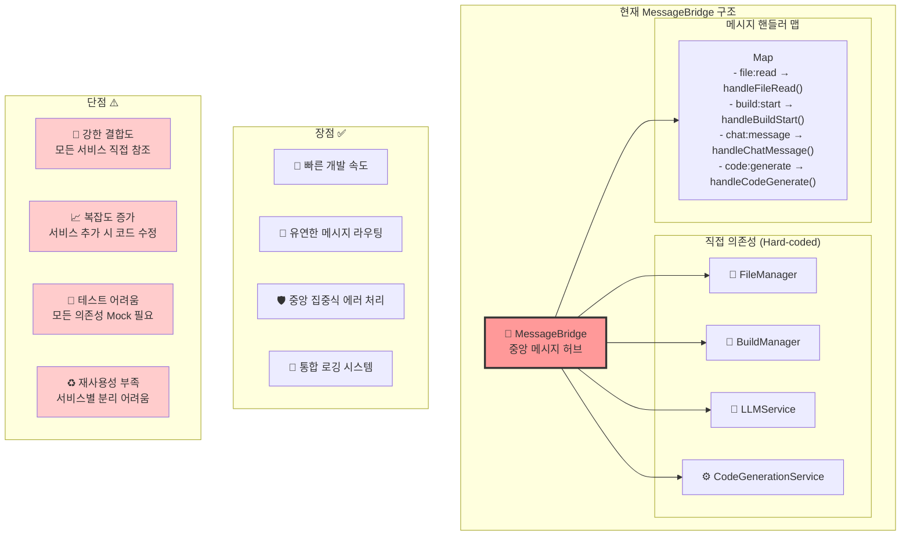
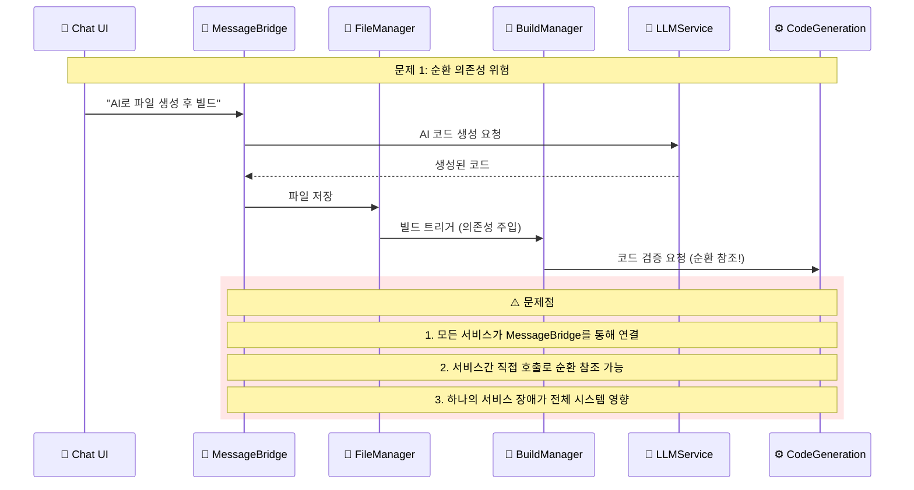
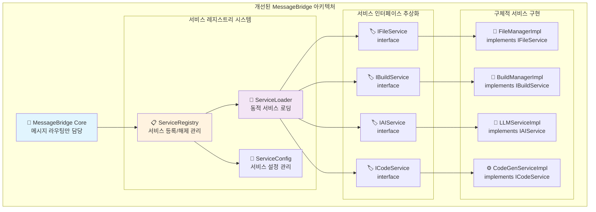
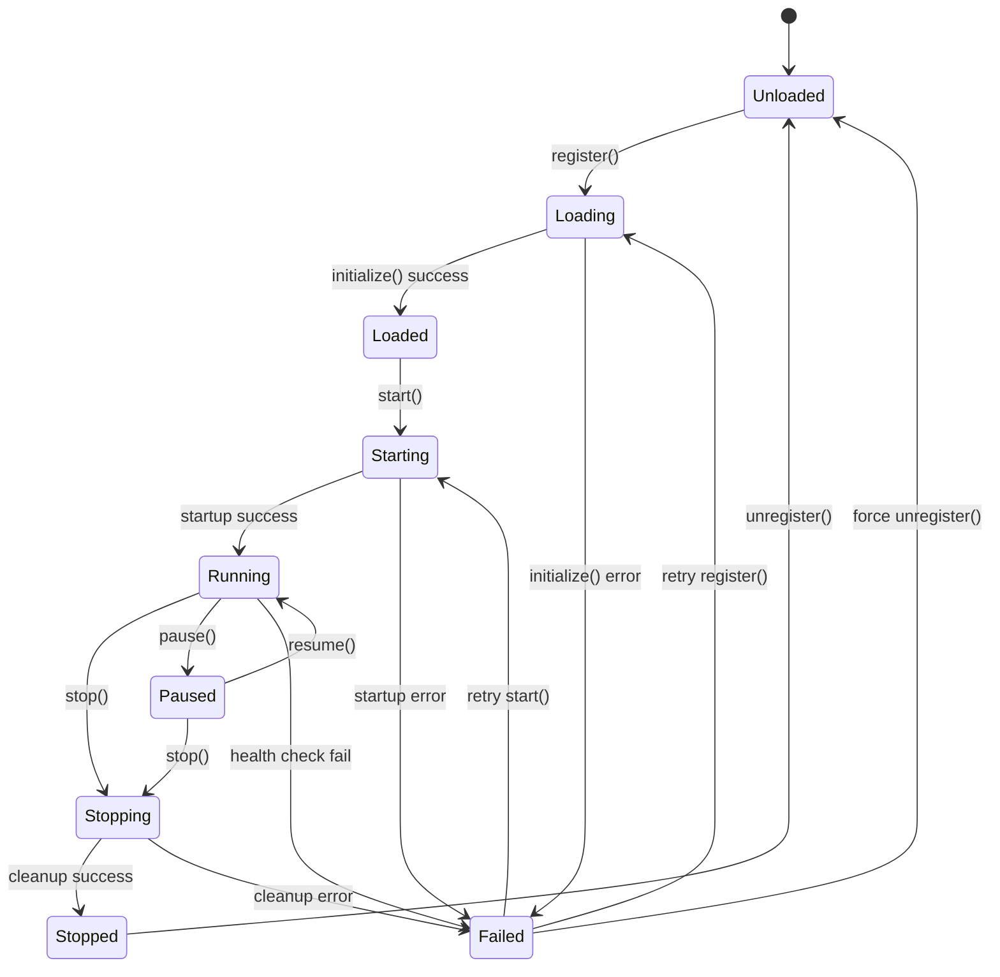
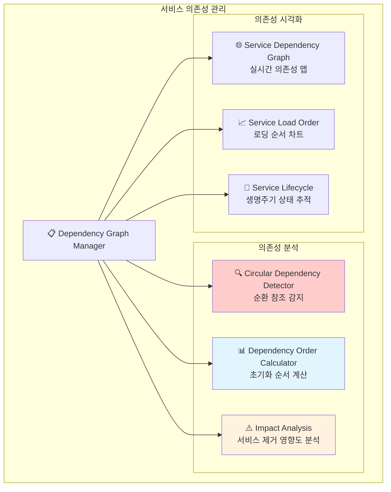
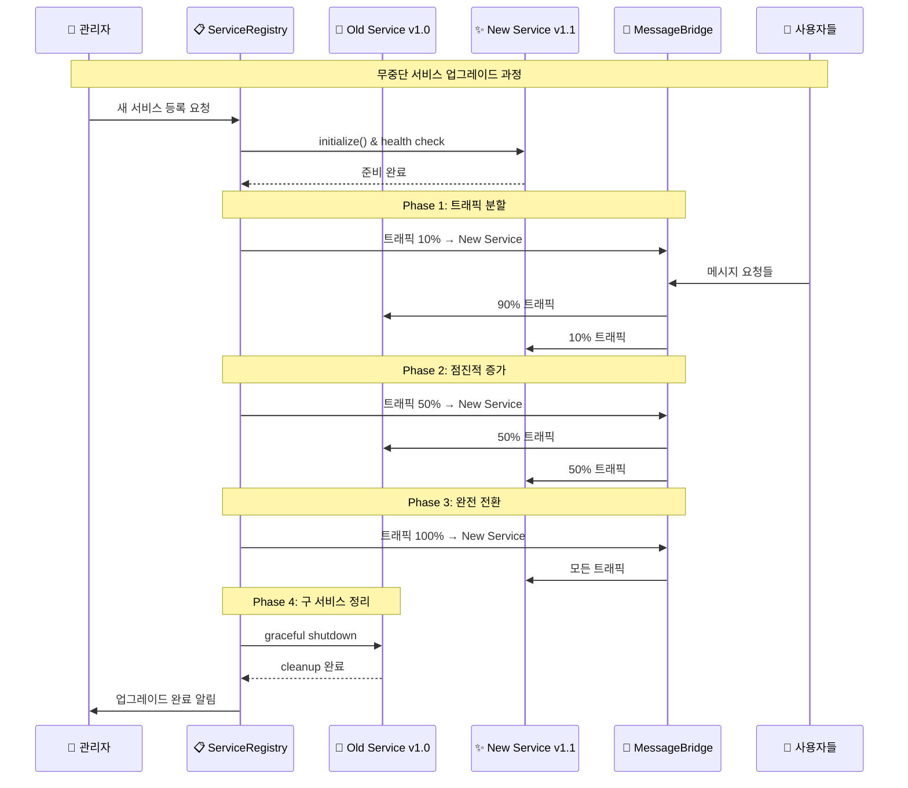
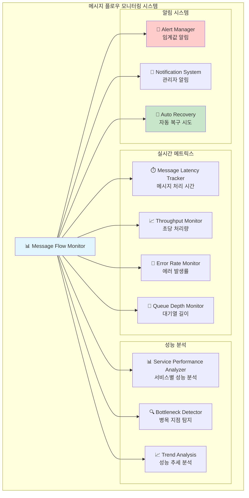
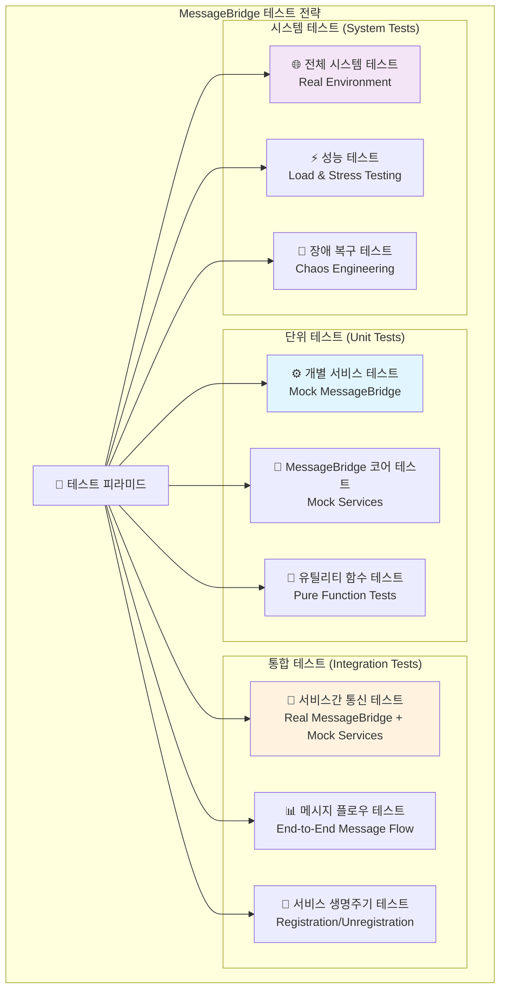
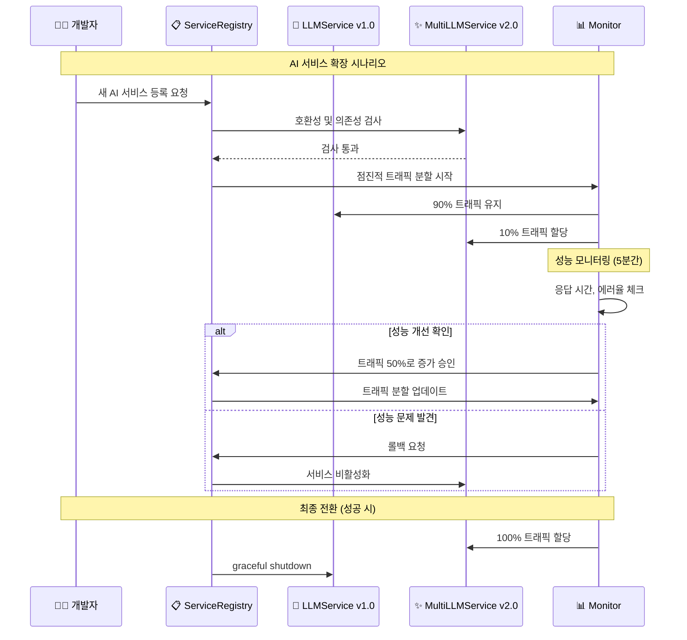
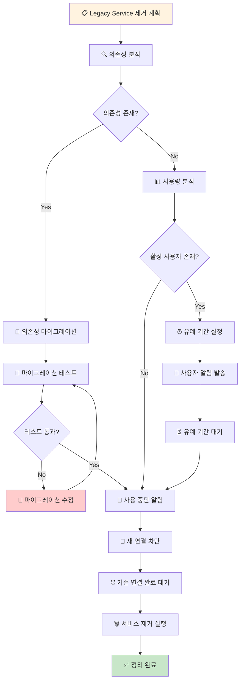

# 99. (참조) 메세지브릿지 아키텍쳐 지속적 관리 방안

## 🎯 핵심 관리 과제

MessageBridge 중심의 아키텍처는 **높은 확장성과 자유도**를 제공하지만, 동시에 **중앙 집중식 제어의 복잡성**도 가져옵니다. 서비스가 늘어나고 줄어들면서 발생할 수 있는 관리 이슈들을 체계적으로 분석하고 해결책을 제시합니다.

**핵심 질문들:**
- 🔄 서비스 추가/제거 시 MessageBridge 영향도 최소화 방법?
- 🧩 모듈간 의존성 관리 및 순환 참조 방지책?
- 📊 메시지 플로우 모니터링 및 디버깅 전략?
- ⚡ 성능 저하 없는 확장 방안?

---

## 🏗️ 현재 MessageBridge 아키텍처 분석

### 1. 현재 구조의 장단점 분석


### 2. 현재 구현의 잠재적 문제점


---

## 🔧 개선된 MessageBridge 아키텍처 설계

### 1. 서비스 레지스트리 패턴 도입


### 2. 메시지 타입 기반 동적 라우팅
```typescript
// 개선된 MessageBridge 설계
interface ServiceDefinition {
    name: string;
    version: string;
    messageTypes: string[];
    dependencies?: string[];
    config?: Record<string, any>;
    enabled: boolean;
}

interface IMessageService {
    getName(): string;
    getMessageTypes(): string[];
    handleMessage(message: WindWalkerMessage): Promise<any>;
    initialize(config?: Record<string, any>): Promise<void>;
    destroy(): Promise<void>;
    isHealthy(): boolean;
}

class EnhancedMessageBridge {
    private serviceRegistry: Map<string, IMessageService> = new Map();
    private messageRoutes: Map<string, string> = new Map(); // messageType -> serviceName
    private serviceConfigs: Map<string, ServiceDefinition> = new Map();
    private healthChecker: ServiceHealthChecker;
    
    // 서비스 동적 등록
    async registerService(
        serviceName: string, 
        service: IMessageService, 
        config: ServiceDefinition
    ): Promise<void> {
        // 1. 의존성 검사
        await this.validateDependencies(config.dependencies || []);
        
        // 2. 서비스 초기화
        await service.initialize(config.config);
        
        // 3. 메시지 라우팅 등록
        for (const messageType of config.messageTypes) {
            if (this.messageRoutes.has(messageType)) {
                throw new Error(`Message type ${messageType} already registered`);
            }
            this.messageRoutes.set(messageType, serviceName);
        }
        
        // 4. 서비스 등록
        this.serviceRegistry.set(serviceName, service);
        this.serviceConfigs.set(serviceName, config);
        
        console.log(`✅ Service registered: ${serviceName}`);
    }
    
    // 서비스 동적 해제
    async unregisterService(serviceName: string): Promise<void> {
        const service = this.serviceRegistry.get(serviceName);
        const config = this.serviceConfigs.get(serviceName);
        
        if (!service || !config) {
            throw new Error(`Service not found: ${serviceName}`);
        }
        
        // 1. 의존성 체크 (다른 서비스가 이 서비스에 의존하는지)
        await this.checkDependents(serviceName);
        
        // 2. 메시지 라우팅 해제
        for (const messageType of config.messageTypes) {
            this.messageRoutes.delete(messageType);
        }
        
        // 3. 서비스 정리
        await service.destroy();
        
        // 4. 레지스트리에서 제거
        this.serviceRegistry.delete(serviceName);
        this.serviceConfigs.delete(serviceName);
        
        console.log(`🗑️ Service unregistered: ${serviceName}`);
    }
    
    // 개선된 메시지 처리
    async processMessage(message: WindWalkerMessage, webview: vscode.Webview): Promise<void> {
        const serviceName = this.messageRoutes.get(message.type);
        
        if (!serviceName) {
            throw new Error(`No service registered for message type: ${message.type}`);
        }
        
        const service = this.serviceRegistry.get(serviceName);
        if (!service) {
            throw new Error(`Service not available: ${serviceName}`);
        }
        
        // 서비스 상태 확인
        if (!service.isHealthy()) {
            throw new Error(`Service unhealthy: ${serviceName}`);
        }
        
        try {
            const result = await service.handleMessage(message);
            
            await webview.postMessage({
                type: `${message.type}:response`,
                data: result,
                requestId: message.requestId,
                timestamp: Date.now()
            });
        } catch (error) {
            // 서비스별 에러 처리
            await this.handleServiceError(serviceName, error, webview, message);
        }
    }
}
```

---

## 📊 서비스 생명주기 관리 시스템

### 1. 서비스 상태 머신


### 2. 서비스 의존성 그래프 관리


### 3. 실제 의존성 관리 코드 예시
```typescript
class ServiceDependencyManager {
    private dependencyGraph: Map<string, string[]> = new Map();
    private loadOrder: string[] = [];
    
    // 순환 참조 검사
    detectCircularDependency(serviceName: string, visited: Set<string> = new Set()): boolean {
        if (visited.has(serviceName)) {
            return true; // 순환 참조 발견
        }
        
        visited.add(serviceName);
        const dependencies = this.dependencyGraph.get(serviceName) || [];
        
        for (const dep of dependencies) {
            if (this.detectCircularDependency(dep, new Set(visited))) {
                return true;
            }
        }
        
        return false;
    }
    
    // 토폴로지 정렬로 로딩 순서 계산
    calculateLoadOrder(): string[] {
        const inDegree = new Map<string, number>();
        const queue: string[] = [];
        const result: string[] = [];
        
        // 진입 차수 계산
        for (const [service, deps] of this.dependencyGraph) {
            inDegree.set(service, 0);
        }
        
        for (const [service, deps] of this.dependencyGraph) {
            for (const dep of deps) {
                inDegree.set(dep, (inDegree.get(dep) || 0) + 1);
            }
        }
        
        // 진입 차수가 0인 노드를 큐에 추가
        for (const [service, degree] of inDegree) {
            if (degree === 0) {
                queue.push(service);
            }
        }
        
        // 토폴로지 정렬
        while (queue.length > 0) {
            const current = queue.shift()!;
            result.push(current);
            
            const dependencies = this.dependencyGraph.get(current) || [];
            for (const dep of dependencies) {
                const newDegree = inDegree.get(dep)! - 1;
                inDegree.set(dep, newDegree);
                
                if (newDegree === 0) {
                    queue.push(dep);
                }
            }
        }
        
        return result;
    }
    
    // 서비스 제거 영향도 분석
    analyzeRemovalImpact(serviceName: string): {
        affectedServices: string[];
        criticalPath: boolean;
        alternatives: string[];
    } {
        const affectedServices: string[] = [];
        
        // 이 서비스에 의존하는 서비스들 찾기
        for (const [service, deps] of this.dependencyGraph) {
            if (deps.includes(serviceName)) {
                affectedServices.push(service);
            }
        }
        
        return {
            affectedServices,
            criticalPath: affectedServices.length > 0,
            alternatives: this.findAlternativeServices(serviceName)
        };
    }
}
```

---

## 🔄 서비스 핫 스왑 및 버전 관리

### 1. 무중단 서비스 교체 메커니즘


### 2. 서비스 버전 호환성 관리
```typescript
interface ServiceVersion {
    major: number;
    minor: number;
    patch: number;
    apiVersion: string;
    compatibleWith: string[];
}

class ServiceVersionManager {
    private versionRegistry: Map<string, ServiceVersion[]> = new Map();
    
    // 호환성 검사
    checkCompatibility(
        serviceName: string, 
        requiredVersion: string, 
        availableVersion: string
    ): boolean {
        const available = this.parseVersion(availableVersion);
        const required = this.parseVersion(requiredVersion);
        
        // 주 버전이 다르면 호환되지 않음
        if (available.major !== required.major) {
            return false;
        }
        
        // 마이너 버전은 하위 호환성 유지
        if (available.minor < required.minor) {
            return false;
        }
        
        return true;
    }
    
    // 서비스 업그레이드 경로 계산
    calculateUpgradePath(
        serviceName: string, 
        currentVersion: string, 
        targetVersion: string
    ): string[] {
        const current = this.parseVersion(currentVersion);
        const target = this.parseVersion(targetVersion);
        const path: string[] = [];
        
        // 단계적 업그레이드 경로 계산
        let tempVersion = current;
        while (this.compareVersions(tempVersion, target) < 0) {
            const nextVersion = this.findNextSafeVersion(serviceName, tempVersion, target);
            path.push(this.versionToString(nextVersion));
            tempVersion = nextVersion;
        }
        
        return path;
    }
}
```

---

## 📈 성능 및 모니터링 시스템

### 1. 메시지 플로우 모니터링


### 2. 실시간 성능 모니터링 구현
```typescript
class MessageBridgeMonitor {
    private metrics: Map<string, MetricData> = new Map();
    private alertThresholds: Map<string, number> = new Map();
    
    // 메시지 처리 성능 추적
    async trackMessageProcessing<T>(
        messageType: string,
        serviceName: string,
        processor: () => Promise<T>
    ): Promise<T> {
        const startTime = Date.now();
        const metricKey = `${serviceName}:${messageType}`;
        
        try {
            const result = await processor();
            
            // 성공 메트릭 기록
            this.recordMetric(metricKey, {
                duration: Date.now() - startTime,
                status: 'success',
                timestamp: new Date()
            });
            
            return result;
        } catch (error) {
            // 실패 메트릭 기록
            this.recordMetric(metricKey, {
                duration: Date.now() - startTime,
                status: 'error',
                error: error.message,
                timestamp: new Date()
            });
            
            throw error;
        }
    }
    
    // 서비스 건강도 체크
    async performHealthCheck(): Promise<HealthReport> {
        const report: HealthReport = {
            overall: 'healthy',
            services: new Map(),
            alerts: [],
            timestamp: new Date()
        };
        
        for (const [serviceName, service] of this.serviceRegistry) {
            const health = await this.checkServiceHealth(serviceName, service);
            report.services.set(serviceName, health);
            
            if (health.status !== 'healthy') {
                report.overall = 'unhealthy';
                report.alerts.push({
                    service: serviceName,
                    severity: health.status === 'critical' ? 'high' : 'medium',
                    message: health.message
                });
            }
        }
        
        return report;
    }
    
    // 자동 복구 시스템
    async attemptAutoRecovery(serviceName: string, error: ServiceError): Promise<boolean> {
        const recoveryStrategies = [
            () => this.restartService(serviceName),
            () => this.switchToBackupService(serviceName),
            () => this.rollbackService(serviceName),
            () => this.scaleUpService(serviceName)
        ];
        
        for (const strategy of recoveryStrategies) {
            try {
                await strategy();
                
                // 복구 후 건강도 체크
                if (await this.verifyServiceHealth(serviceName)) {
                    console.log(`✅ Auto recovery successful for ${serviceName}`);
                    return true;
                }
            } catch (recoveryError) {
                console.warn(`Recovery strategy failed for ${serviceName}:`, recoveryError);
            }
        }
        
        console.error(`❌ All recovery strategies failed for ${serviceName}`);
        return false;
    }
}
```

---

## 🧪 테스트 전략 및 품질 보증

### 1. 다계층 테스트 전략


### 2. 서비스 Mock 및 테스트 더블 전략
```typescript
// 테스트용 서비스 Mock 팩토리
class ServiceMockFactory {
    static createFileServiceMock(): IFileService {
        return {
            getName: () => 'MockFileService',
            getMessageTypes: () => ['file:read', 'file:write', 'file:create', 'file:delete'],
            
            async handleMessage(message: WindWalkerMessage): Promise<any> {
                switch (message.type) {
                    case 'file:read':
                        return { content: 'mock file content', encoding: 'utf8' };
                    case 'file:write':
                        return { success: true, path: message.data.path };
                    default:
                        throw new Error(`Mock doesn't handle ${message.type}`);
                }
            },
            
            async initialize(): Promise<void> {
                // Mock initialization
            },
            
            async destroy(): Promise<void> {
                // Mock cleanup
            },
            
            isHealthy(): boolean {
                return true;
            }
        };
    }
    
    // 장애 상황을 시뮬레이션하는 Mock
    static createFailingServiceMock(failureRate: number = 0.5): IFileService {
        return {
            getName: () => 'FailingMockService',
            getMessageTypes: () => ['file:read'],
            
            async handleMessage(message: WindWalkerMessage): Promise<any> {
                if (Math.random() < failureRate) {
                    throw new Error('Mock service failure');
                }
                return { success: true };
            },
            
            async initialize(): Promise<void> {},
            async destroy(): Promise<void> {},
            isHealthy(): boolean { return Math.random() > failureRate; }
        };
    }
}

// 통합 테스트 예시
describe('MessageBridge Integration Tests', () => {
    let messageBridge: EnhancedMessageBridge;
    let mockWebview: vscode.Webview;
    
    beforeEach(async () => {
        messageBridge = new EnhancedMessageBridge();
        
        // Mock 서비스들 등록
        await messageBridge.registerService(
            'fileService',
            ServiceMockFactory.createFileServiceMock(),
            {
                name: 'fileService',
                version: '1.0.0',
                messageTypes: ['file:read', 'file:write'],
                enabled: true
            }
        );
    });
    
    test('should route messages to correct services', async () => {
        const message: WindWalkerMessage = {
            type: 'file:read',
            data: { path: 'test.txt' },
            requestId: 'test-123'
        };
        
        await messageBridge.processMessage(message, mockWebview);
        
        // webview.postMessage가 올바른 응답과 함께 호출되었는지 확인
        expect(mockWebview.postMessage).toHaveBeenCalledWith(
            expect.objectContaining({
                type: 'file:read:response',
                requestId: 'test-123'
            })
        );
    });
    
    test('should handle service failures gracefully', async () => {
        // 실패하는 서비스 등록
        await messageBridge.registerService(
            'failingService',
            ServiceMockFactory.createFailingServiceMock(1.0), // 항상 실패
            {
                name: 'failingService',
                version: '1.0.0',
                messageTypes: ['test:fail'],
                enabled: true
            }
        );
        
        const message: WindWalkerMessage = {
            type: 'test:fail',
            data: {},
            requestId: 'fail-test'
        };
        
        await messageBridge.processMessage(message, mockWebview);
        
        // 에러 응답이 전송되었는지 확인
        expect(mockWebview.postMessage).toHaveBeenCalledWith(
            expect.objectContaining({
                type: 'error',
                data: expect.objectContaining({
                    originalType: 'test:fail'
                })
            })
        );
    });
});
```

---

## 🚀 실제 적용 가능한 관리 시나리오

### 1. AI 서비스 확장 시나리오


### 2. 레거시 서비스 제거 시나리오


---

## 💡 현재 구현 범위에서 예측 가능한 이슈들

### 1. 현재 MessageBridge의 잠재적 문제점
```mermaid
flowchart TD
    subgraph "현재 구현 이슈들"
        A[⚠️ 잠재적 문제점들]
        
        subgraph "확장성 이슈"
            B[📈 핸들러 맵 크기 증가<br/>69개 → 200개+ 예상]
            C[🧠 메모리 사용량 증가<br/>모든 서비스 상시 로드]
            D[⏱️ 메시지 라우팅 지연<br/>Linear Search O(n)]
        end
        
        subgraph "유지보수 이슈"
            E[🔧 코드 수정 필요<br/>새 서비스마다 코드 변경]
            F[🧪 테스트 복잡도<br/>모든 의존성 Mock 필요]
            G[🔄 순환 참조 위험<br/>서비스간 직접 호출]
        end
        
        subgraph "운영 이슈"
            H[🚨 장애 전파<br/>하나의 서비스 실패 → 전체 영향]
            I[📊 모니터링 부족<br/>서비스별 성능 추적 어려움]
            J[🔄 핫 스왑 불가<br/>재시작 없는 업데이트 불가능]
        end
    end
    
    A --> B
    A --> C
    A --> D
    A --> E
    A --> F
    A --> G
    A --> H
    A --> I
    A --> J
    
    style B fill:#ffcccc
    style E fill:#ffcccc
    style H fill:#ffcccc
```

### 2. AI 서비스 확장 시 예상 문제점
```typescript
// 현재 구조에서 AI 서비스 확장 시 문제점

class MessageBridge {
    // 문제 1: Hard-coded dependencies 증가
    private llmService: LLMService;
    private codeGenerationService: CodeGenerationService;
    // 추가될 서비스들...
    private templateService: TemplateService;           // AI 워크플로우용
    private customizationService: CustomizationService; // 맞춤화용
    private deploymentService: DeploymentService;       // 배포용
    private analyticsService: AnalyticsService;         // 분석용
    // ... 계속 증가
    
    private initializeHandlers() {
        // 문제 2: Handler 등록 코드 폭발적 증가
        // 현재 69개 → 예상 200개+
        this.messageHandlers.set('ai:template:search', this.handleTemplateSearch.bind(this));
        this.messageHandlers.set('ai:template:apply', this.handleTemplateApply.bind(this));
        this.messageHandlers.set('ai:customize:analyze', this.handleCustomizeAnalyze.bind(this));
        this.messageHandlers.set('ai:customize:generate', this.handleCustomizeGenerate.bind(this));
        // ... 끝없는 handler 등록
        
        // 문제 3: 메시지 타입 네이밍 충돌 위험
        this.messageHandlers.set('ai:generate', this.handleAIGenerate.bind(this));        // 어떤 AI?
        this.messageHandlers.set('template:generate', this.handleTemplateGenerate.bind(this)); // 혼란
    }
    
    // 문제 4: Constructor 복잡도 폭발
    constructor(context: vscode.ExtensionContext) {
        // 모든 서비스 초기화 → 메모리 사용량 증가
        this.llmService = new LLMService(apiKey);
        this.codeGenerationService = new CodeGenerationService(apiKey);
        this.templateService = new TemplateService(apiKey);
        this.customizationService = new CustomizationService(apiKey);
        // ... 모든 서비스가 항상 로드됨 (사용하지 않아도)
    }
    
    // 문제 5: 에러 처리 복잡성
    async processMessage(message: WindWalkerMessage, webview: vscode.Webview): Promise<void> {
        try {
            const handler = this.messageHandlers.get(message.type);
            if (handler) {
                const result = await handler(message);
                // 어떤 서비스에서 에러가 났는지 구분하기 어려움
                // 서비스별 맞춤 에러 처리 불가능
            }
        } catch (error) {
            // 모든 에러를 동일하게 처리 → 세밀한 에러 전략 불가능
        }
    }
}

// 실제 발생 가능한 시나리오
/*
1. 템플릿 서비스와 커스터마이징 서비스 간 순환 참조
   template:generate → customization:apply → template:validate → 무한 루프

2. AI 서비스 장애 시 전체 시스템 마비
   LLMService 실패 → MessageBridge 전체 응답 불가

3. 메모리 사용량 급증
   모든 AI 모델이 메모리에 상시 로드 → VS Code 성능 저하

4. 메시지 타입 충돌
   'generate' 메시지가 어떤 서비스로 라우팅될지 불명확

5. 테스트 복잡도 폭발
   새 서비스 추가 시 기존 모든 테스트에 Mock 추가 필요
*/
```

---

## 🎯 권장 마이그레이션 로드맵

### Phase 1: 서비스 레지스트리 도입 (2-3주)
- 기존 MessageBridge 기능 유지
- ServiceRegistry 및 인터페이스 추상화 추가
- 점진적 서비스 등록 시스템 구축

### Phase 2: 메시지 라우팅 개선 (2-3주)  
- 동적 메시지 라우팅 구현
- 서비스별 네임스페이스 도입
- 성능 모니터링 시스템 구축

### Phase 3: 의존성 관리 시스템 (3-4주)
- 순환 참조 감지 및 방지
- 서비스 로딩 순서 자동 계산
- 의존성 시각화 도구 구축

### Phase 4: 고급 기능 구현 (4-5주)
- 핫 스왑 및 무중단 업데이트
- 자동 복구 시스템
- 종합 테스트 및 문서화

---

**문서 작성자**: Claude Code Assistant  
**작성일**: 2025-08-05  
**버전**: 1.0 (MessageBridge 아키텍처 지속적 관리 방안)  
**기반**: 현재 구현 코드 분석 및 확장성 시나리오 연구