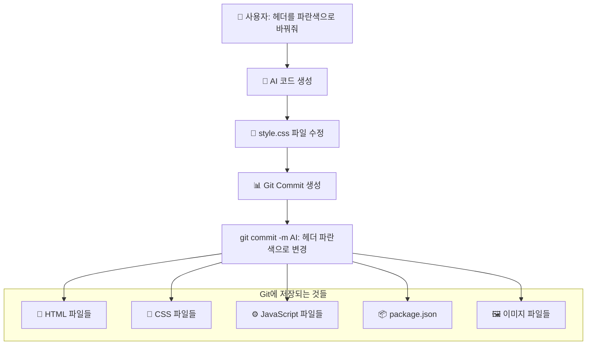
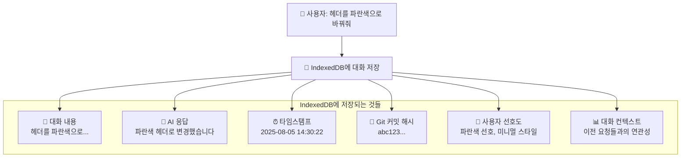
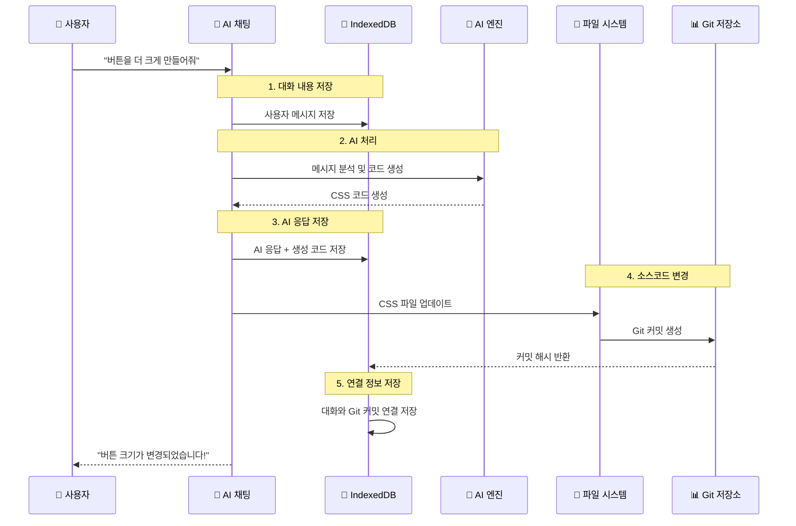
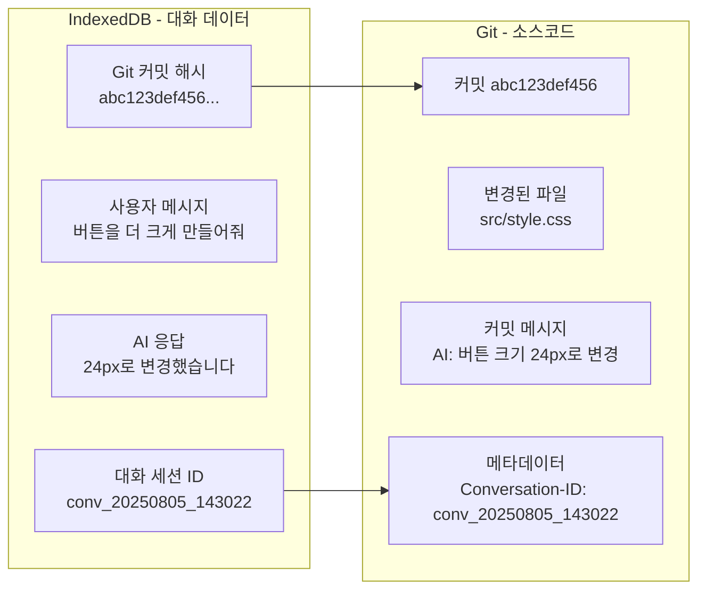

# 99. (참조) 소스변경관리용 Git와 대화용 IndexedDB 통합방안

## 🎯 핵심 구분 개념

WindWalker AI 대화식 웹사이트 빌더에서는 **두 가지 다른 종류의 데이터**를 **다른 저장소**에 저장합니다:

- **📁 Git**: 소스코드 변경사항 (결과물)
- **💾 IndexedDB**: 대화 내용 및 메타데이터 (과정)

---

## 🔍 Git vs IndexedDB 역할 구분

### 📁 Git 저장소 - 소스코드 버전 관리



**Git에 저장되는 항목들:**
- ✅ **소스코드 파일**: HTML, CSS, JavaScript, React 컴포넌트
- ✅ **설정 파일**: package.json, tsconfig.json, tailwind.config.js
- ✅ **정적 자산**: 이미지, 폰트, 아이콘 파일들
- ✅ **빌드 산출물**: 컴파일된 파일들 (선택적)

### 💾 IndexedDB - 대화 내용 및 메타데이터 저장



**IndexedDB에 저장되는 항목들:**
- ✅ **대화 내용**: 사용자 질문, AI 응답, 명령어
- ✅ **세션 정보**: 대화 ID, 프로젝트 정보, 진행 상태
- ✅ **사용자 데이터**: 선호도, 사용 패턴, 개인화 정보
- ✅ **연결 정보**: 대화와 Git 커밋간의 매핑
- ✅ **메타데이터**: 생성 시간, 신뢰도, 성능 지표

---

## 🔄 두 시스템의 연결 관계

### 전체 워크플로우


### 데이터 연결 구조


---

## 💾 IndexedDB 데이터 스키마 설계

### 1. 대화 세션 테이블 (Conversations)
```typescript
interface ConversationSession {
  // 기본 식별 정보
  conversationId: string          // 'conv_20250805_143022'
  userId: string                  // 사용자 ID (익명 또는 로그인)
  projectId: string               // 프로젝트 식별자
  
  // 세션 메타데이터
  createdAt: Date                 // 대화 시작 시간
  updatedAt: Date                 // 마지막 업데이트 시간
  status: 'active' | 'completed' | 'abandoned'
  
  // 프로젝트 정보
  projectType: string             // 'e-commerce', 'portfolio', 'blog'
  templateUsed?: string           // 사용된 템플릿 ID
  
  // 진행 상황
  totalMessages: number           // 총 메시지 수
  totalGitCommits: number         // 생성된 커밋 수
  completionRate: number          // 완성도 (0-100%)
  
  // 성능 메트릭
  averageResponseTime: number     // 평균 AI 응답 시간 (ms)
  userSatisfactionScore?: number  // 사용자 만족도 (1-5)
}
```

### 2. 메시지 테이블 (Messages)
```typescript
interface ChatMessage {
  // 기본 식별 정보
  messageId: string               // 'msg_001', 'msg_002'
  conversationId: string          // 상위 대화 세션 ID
  
  // 메시지 내용
  sender: 'user' | 'ai' | 'system'
  content: string                 // 실제 메시지 텍스트
  timestamp: Date                 // 메시지 생성 시간
  
  // AI 관련 정보 (AI 메시지인 경우)
  aiMetadata?: {
    model: string                 // 'gpt-4', 'claude-3.5-sonnet'
    confidence: number            // AI 신뢰도 (0-1)
    processingTime: number        // 처리 시간 (ms)
    tokenCount: number            // 사용된 토큰 수
  }
  
  // 코드 생성 정보 (코드 생성 메시지인 경우)
  codeGeneration?: {
    generatedCode: string         // 생성된 코드
    language: string              // 'html', 'css', 'javascript'
    fileName: string              // 대상 파일명
    gitCommitHash?: string        // 연결된 Git 커밋
  }
  
  // 사용자 피드백
  userFeedback?: {
    helpful: boolean              // 도움이 되었는지
    rating: number                // 1-5 점수
    comment?: string              // 추가 코멘트
  }
}
```

### 3. 사용자 프로필 테이블 (UserProfiles)
```typescript
interface UserProfile {
  userId: string                  // 사용자 ID
  
  // 설계 선호도
  designPreferences: {
    colors: string[]              // 선호하는 색상들
    styles: string[]              // 'modern', 'minimalist', 'colorful'
    layouts: string[]             // 'grid', 'flex', 'traditional'
  }
  
  // 기술적 선호도
  technicalPreferences: {
    frameworks: string[]          // 'react', 'vue', 'vanilla'
    cssApproach: string           // 'tailwind', 'styled-components', 'css'
    complexity: 'simple' | 'intermediate' | 'advanced'
  }
  
  // 사용 패턴
  usagePatterns: {
    preferredSessionLength: number      // 평균 세션 길이 (분)
    frequentRequests: string[]          // 자주 하는 요청 유형들
    peakUsageHours: number[]            // 주로 사용하는 시간대
  }
  
  // 학습된 정보
  learnedBehaviors: {
    commonMistakes: string[]            // 자주 하는 실수들
    successfulPatterns: string[]        // 성공적인 패턴들
    improvementAreas: string[]          // 개선이 필요한 영역들
  }
}
```

### 4. 프로젝트-Git 연결 테이블 (ProjectGitMapping)
```typescript
interface ProjectGitMapping {
  mappingId: string               // 매핑 ID
  conversationId: string          // 대화 세션 ID
  messageId: string               // 메시지 ID
  
  // Git 정보
  gitCommitHash: string           // Git 커밋 해시
  gitBranch: string               // Git 브랜치명
  
  // 변경 정보
  filesChanged: string[]          // 변경된 파일 목록
  linesAdded: number              // 추가된 라인 수
  linesRemoved: number            // 삭제된 라인 수
  
  // 메타데이터
  createdAt: Date                 // 생성 시간
  changeDescription: string       // 변경 내용 설명
  changeType: string              // 'feature', 'fix', 'style', 'refactor'
}
```

---

## 📊 Git 커밋 메시지 표준화

### Git 커밋 메시지 형식
```bash
# 기본 형식
[AI-Chat-{conversationId}] {changeType}: {description}

# 실제 예시들
[AI-Chat-conv_20250805_143022] feat: 헤더 배경색을 파란색으로 변경
[AI-Chat-conv_20250805_143022] style: 버튼 크기를 24px로 증대
[AI-Chat-conv_20250805_143022] fix: 모바일 레이아웃 반응형 이슈 해결

# 상세 정보 (Git trailer)
Conversation-ID: conv_20250805_143022
Generated-By: AI-Workflow-Engine
User-Request: "헤더를 파란색으로 바꿔줘"
AI-Model: claude-3.5-sonnet
Confidence: 0.95
Files-Modified: src/style.css
Lines-Changed: +3, -1
```

### Git 태그 시스템
```bash
# 대화별 태그
git tag -a chat-conv_20250805_143022-final -m "대화 완료: 쇼핑몰 헤더 커스터마이징"

# 기능별 태그  
git tag -a ai-feature-header-customization -m "AI 헤더 커스터마이징 기능 완성"

# 버전별 태그
git tag -a v1.0.0-ai-generated -m "AI로 생성된 첫 번째 완성 버전"
```

---

## 🔄 실제 구현 코드

### 1. IndexedDB 관리 클래스
```typescript
class ConversationDatabase {
  private db: IDBDatabase | null = null
  private readonly dbName = 'WindWalkerConversations'
  private readonly version = 1
  
  async initialize(): Promise<void> {
    return new Promise((resolve, reject) => {
      const request = indexedDB.open(this.dbName, this.version)
      
      request.onerror = () => reject(request.error)
      request.onsuccess = () => {
        this.db = request.result
        resolve()
      }
      
      request.onupgradeneeded = (event) => {
        const db = (event.target as IDBOpenDBRequest).result
        
        // 대화 세션 스토어
        const conversationStore = db.createObjectStore('conversations', {
          keyPath: 'conversationId'
        })
        conversationStore.createIndex('userId', 'userId')
        conversationStore.createIndex('projectId', 'projectId')
        conversationStore.createIndex('createdAt', 'createdAt')
        
        // 메시지 스토어
        const messageStore = db.createObjectStore('messages', {
          keyPath: 'messageId'
        })
        messageStore.createIndex('conversationId', 'conversationId')
        messageStore.createIndex('timestamp', 'timestamp')
        messageStore.createIndex('sender', 'sender')
        
        // 사용자 프로필 스토어
        const profileStore = db.createObjectStore('userProfiles', {
          keyPath: 'userId'
        })
        
        // Git 매핑 스토어
        const gitMappingStore = db.createObjectStore('gitMappings', {
          keyPath: 'mappingId'
        })
        gitMappingStore.createIndex('conversationId', 'conversationId')
        gitMappingStore.createIndex('gitCommitHash', 'gitCommitHash')
      }
    })
  }
  
  // 새 대화 세션 생성
  async createConversation(
    userId: string, 
    projectId: string, 
    projectType: string
  ): Promise<string> {
    const conversationId = `conv_${Date.now()}_${Math.random().toString(36).substr(2, 9)}`
    
    const conversation: ConversationSession = {
      conversationId,
      userId,
      projectId,
      createdAt: new Date(),
      updatedAt: new Date(),
      status: 'active',
      projectType,
      totalMessages: 0,
      totalGitCommits: 0,
      completionRate: 0,
      averageResponseTime: 0
    }
    
    const transaction = this.db!.transaction(['conversations'], 'readwrite')
    const store = transaction.objectStore('conversations')
    await store.add(conversation)
    
    return conversationId
  }
  
  // 메시지 저장
  async saveMessage(
    conversationId: string,
    sender: 'user' | 'ai' | 'system',
    content: string,
    metadata?: Partial<ChatMessage>
  ): Promise<string> {
    const messageId = `msg_${Date.now()}_${Math.random().toString(36).substr(2, 9)}`
    
    const message: ChatMessage = {
      messageId,
      conversationId,
      sender,
      content,
      timestamp: new Date(),
      ...metadata
    }
    
    const transaction = this.db!.transaction(['messages', 'conversations'], 'readwrite')
    
    // 메시지 저장
    const messageStore = transaction.objectStore('messages')
    await messageStore.add(message)
    
    // 대화 세션 업데이트
    const conversationStore = transaction.objectStore('conversations')
    const conversation = await conversationStore.get(conversationId) as ConversationSession
    conversation.totalMessages += 1
    conversation.updatedAt = new Date()
    await conversationStore.put(conversation)
    
    return messageId
  }
  
  // Git 커밋과 대화 연결
  async linkGitCommit(
    conversationId: string,
    messageId: string,
    gitCommitHash: string,
    filesChanged: string[],
    changeDescription: string
  ): Promise<void> {
    const mappingId = `map_${Date.now()}_${Math.random().toString(36).substr(2, 9)}`
    
    const mapping: ProjectGitMapping = {
      mappingId,
      conversationId,
      messageId,
      gitCommitHash,
      gitBranch: 'main', // 현재 브랜치 감지 로직 필요
      filesChanged,
      linesAdded: 0,     // Git diff로 계산 필요
      linesRemoved: 0,   // Git diff로 계산 필요
      createdAt: new Date(),
      changeDescription,
      changeType: 'feature' // AI가 분석해서 결정
    }
    
    const transaction = this.db!.transaction(['gitMappings'], 'readwrite')
    const store = transaction.objectStore('gitMappings')
    await store.add(mapping)
  }
  
  // 대화 히스토리 검색
  async searchConversations(
    userId: string,
    searchTerm: string,
    limit: number = 50
  ): Promise<ConversationSession[]> {
    const transaction = this.db!.transaction(['conversations'], 'readonly')
    const store = transaction.objectStore('conversations')
    const index = store.index('userId')
    
    const conversations: ConversationSession[] = []
    const request = index.openCursor(IDBKeyRange.only(userId))
    
    return new Promise((resolve) => {
      request.onsuccess = (event) => {
        const cursor = (event.target as IDBRequest).result
        if (cursor && conversations.length < limit) {
          const conversation = cursor.value as ConversationSession
          // 검색어 매칭 로직
          if (this.matchesSearchTerm(conversation, searchTerm)) {
            conversations.push(conversation)
          }
          cursor.continue()
        } else {
          resolve(conversations)
        }
      }
    })
  }
  
  private matchesSearchTerm(conversation: ConversationSession, searchTerm: string): boolean {
    const searchLower = searchTerm.toLowerCase()
    return conversation.projectType.toLowerCase().includes(searchLower) ||
           (conversation.templateUsed?.toLowerCase().includes(searchLower) ?? false)
  }
}
```

### 2. Git 통합 관리 클래스
```typescript
class GitIntegrationManager {
  private git: SimpleGit
  private conversationDB: ConversationDatabase
  
  constructor(workspacePath: string, conversationDB: ConversationDatabase) {
    this.git = simpleGit(workspacePath)
    this.conversationDB = conversationDB
  }
  
  // AI 대화 기반 커밋 생성
  async createAICommit(
    conversationId: string,
    messageId: string,
    description: string,
    files: string[],
    userRequest: string,
    aiModel: string,
    confidence: number
  ): Promise<string> {
    // 변경된 파일들 스테이징
    await this.git.add(files)
    
    // 커밋 메시지 생성
    const commitMessage = `[AI-Chat-${conversationId}] feat: ${description}`
    
    // 커밋 생성 (상세 메타데이터 포함)
    const commit = await this.git.commit(commitMessage, files, {
      '--author': 'WindWalker AI <ai@windwalker.dev>',
      '--trailer': `Conversation-ID: ${conversationId}`,
      '--trailer': `Message-ID: ${messageId}`,
      '--trailer': `Generated-By: AI-Workflow-Engine`,
      '--trailer': `User-Request: "${userRequest}"`,
      '--trailer': `AI-Model: ${aiModel}`,
      '--trailer': `Confidence: ${confidence}`,
      '--trailer': `Files-Modified: ${files.join(', ')}`
    })
    
    // IndexedDB에 Git 매핑 정보 저장
    await this.conversationDB.linkGitCommit(
      conversationId,
      messageId,
      commit.commit,
      files,
      description
    )
    
    console.log(`✅ AI 커밋 생성 완료: ${commit.commit.substring(0, 8)} - ${description}`)
    return commit.commit
  }
  
  // 특정 대화의 모든 커밋 조회
  async getConversationCommits(conversationId: string): Promise<GitLogSummary> {
    const logs = await this.git.log({
      '--grep': `Conversation-ID: ${conversationId}`,
      '--oneline': true
    })
    return logs
  }
  
  // 특정 대화 상태로 되돌리기
  async revertToConversation(conversationId: string, messageId?: string): Promise<void> {
    let targetCommit: string
    
    if (messageId) {
      // 특정 메시지까지만 되돌리기
      const logs = await this.git.log({
        '--grep': `Message-ID: ${messageId}`,
        '--max-count': 1
      })
      targetCommit = logs.latest?.hash || ''
    } else {
      // 대화의 마지막 커밋으로 되돌리기
      const logs = await this.getConversationCommits(conversationId)
      targetCommit = logs.latest?.hash || ''
    }
    
    if (targetCommit) {
      await this.git.reset(['--hard', targetCommit])
      console.log(`✅ 되돌리기 완료: ${conversationId} ${messageId ? `(${messageId})` : ''}`)
    } else {
      throw new Error(`해당하는 커밋을 찾을 수 없습니다: ${conversationId}`)
    }
  }
  
  // 대화 패턴 분석을 위한 커밋 데이터 추출
  async extractConversationPatterns(): Promise<ConversationPattern[]> {
    const logs = await this.git.log({
      '--grep': 'AI-Chat-',
      '--pretty': 'format:%H|%s|%b|%an|%ad'
    })
    
    return logs.all.map(log => {
      const [hash, subject, body, author, date] = log.hash.split('|')
      const conversationId = this.extractConversationId(subject)
      const userRequest = this.extractUserRequest(body)
      const confidence = this.extractConfidence(body)
      
      return {
        commitHash: hash,
        conversationId,
        subject: subject.replace(/\[AI-Chat-[^\]]+\]\s*/, ''),
        userRequest,
        confidence,
        timestamp: new Date(date),
        author
      }
    })
  }
  
  private extractConversationId(subject: string): string {
    const match = subject.match(/\[AI-Chat-([^\]]+)\]/)
    return match ? match[1] : ''
  }
  
  private extractUserRequest(body: string): string {
    const match = body.match(/User-Request: "([^"]*)"/)
    return match ? match[1] : ''
  }
  
  private extractConfidence(body: string): number {
    const match = body.match(/Confidence: ([\d.]+)/)
    return match ? parseFloat(match[1]) : 0
  }
}
```

---

## 🚀 실제 사용 시나리오

### 시나리오 1: 대화 기반 웹사이트 생성
```typescript
// 1. 새 대화 세션 시작
const conversationId = await conversationDB.createConversation(
  'user123', 
  'project_ecommerce_001', 
  'e-commerce'
)

// 2. 사용자 메시지 저장
const userMessageId = await conversationDB.saveMessage(
  conversationId,
  'user',
  '온라인 쇼핑몰 사이트 만들어줘. 미니멀한 디자인으로'
)

// 3. AI 코드 생성 및 응답 저장
const aiMessageId = await conversationDB.saveMessage(
  conversationId,
  'ai',
  '미니멀 디자인의 쇼핑몰 사이트를 생성했습니다!',
  {
    aiMetadata: {
      model: 'claude-3.5-sonnet',
      confidence: 0.92,
      processingTime: 2500,
      tokenCount: 1250
    },
    codeGeneration: {
      generatedCode: '/* CSS code here */',
      language: 'css',
      fileName: 'src/style.css'
    }
  }
)

// 4. Git 커밋 생성
const commitHash = await gitManager.createAICommit(
  conversationId,
  aiMessageId,
  '미니멀 쇼핑몰 사이트 초기 생성',
  ['src/index.html', 'src/style.css', 'src/script.js'],
  '온라인 쇼핑몰 사이트 만들어줘. 미니멀한 디자인으로',
  'claude-3.5-sonnet',
  0.92
)
```

### 시나리오 2: 이전 상태로 되돌리기
```typescript
// 사용자가 "3번 전 상태로 되돌려줘"라고 요청
async function revertToPreviousState(conversationId: string, stepsBack: number) {
  // 1. IndexedDB에서 대화 히스토리 조회
  const messages = await conversationDB.getConversationMessages(conversationId)
  const aiMessages = messages.filter(msg => msg.sender === 'ai' && msg.codeGeneration)
  
  if (aiMessages.length < stepsBack) {
    throw new Error('되돌릴 수 있는 상태가 부족합니다')
  }
  
  // 2. N번 전 메시지의 Git 커밋으로 되돌리기
  const targetMessage = aiMessages[aiMessages.length - stepsBack]
  const gitCommitHash = targetMessage.codeGeneration?.gitCommitHash
  
  if (gitCommitHash) {
    await gitManager.revertToCommit(gitCommitHash)
    
    // 3. 되돌리기 완료 메시지 저장
    await conversationDB.saveMessage(
      conversationId,
      'system',
      `✅ ${stepsBack}단계 전 상태로 되돌렸습니다. (커밋: ${gitCommitHash.substring(0, 8)})`
    )
  }
}
```

### 시나리오 3: 개인화 추천 시스템
```typescript
// 사용자 패턴 분석 및 추천
async function generatePersonalizedRecommendations(userId: string): Promise<string[]> {
  // 1. 사용자의 이전 대화들 분석
  const conversations = await conversationDB.searchConversations(userId, '', 100)
  const userProfile = await conversationDB.getUserProfile(userId)
  
  // 2. 사용 패턴 추출
  const patterns = {
    preferredStyles: extractStylePreferences(conversations),
    commonRequests: extractCommonRequests(conversations),
    successfulApproaches: extractSuccessfulApproaches(conversations)
  }
  
  // 3. Git 히스토리 기반 성공 패턴 분석
  const gitPatterns = await gitManager.extractConversationPatterns()
  const successfulCommits = gitPatterns.filter(p => p.confidence > 0.8)
  
  // 4. 개인화 추천 생성
  const recommendations = [
    `${userProfile.designPreferences.styles[0]} 스타일로 새 프로젝트 시작하기`,
    `최근에 성공적으로 만든 ${patterns.commonRequests[0]} 다시 만들기`,
    `${patterns.preferredStyles[0]} 색상으로 기존 프로젝트 업데이트`
  ]
  
  return recommendations
}
```

---

## 📊 성능 최적화 전략

### 1. IndexedDB 최적화
```typescript
// 배치 처리로 성능 향상
class BatchMessageProcessor {
  private messageBatch: ChatMessage[] = []
  private batchSize = 10
  private flushTimeout = 5000 // 5초
  
  async addMessage(message: ChatMessage): Promise<void> {
    this.messageBatch.push(message)
    
    if (this.messageBatch.length >= this.batchSize) {
      await this.flushBatch()
    } else {
      // 타이머 설정
      setTimeout(() => this.flushBatch(), this.flushTimeout)
    }
  }
  
  private async flushBatch(): Promise<void> {
    if (this.messageBatch.length === 0) return
    
    const transaction = this.db.transaction(['messages'], 'readwrite')
    const store = transaction.objectStore('messages')
    
    // 배치로 한 번에 저장
    for (const message of this.messageBatch) {
      store.add(message)
    }
    
    await transaction.complete
    this.messageBatch = []
  }
}
```

### 2. Git 성능 최적화
```typescript
// Git 커밋 최적화
class OptimizedGitManager {
  private commitQueue: CommitRequest[] = []
  private isProcessing = false
  
  async queueCommit(request: CommitRequest): Promise<string> {
    return new Promise((resolve, reject) => {
      this.commitQueue.push({ ...request, resolve, reject })
      this.processQueue()
    })
  }
  
  private async processQueue(): Promise<void> {
    if (this.isProcessing || this.commitQueue.length === 0) return
    
    this.isProcessing = true
    
    while (this.commitQueue.length > 0) {
      const request = this.commitQueue.shift()!
      
      try {
        // 비슷한 변경사항들 그룹핑
        const similarRequests = this.findSimilarRequests(request)
        const combinedCommit = await this.createCombinedCommit([request, ...similarRequests])
        
        request.resolve(combinedCommit.hash)
        similarRequests.forEach(req => req.resolve(combinedCommit.hash))
        
      } catch (error) {
        request.reject(error)
      }
    }
    
    this.isProcessing = false
  }
}
```

---

## 🎯 핵심 이점 요약

### ✅ **Git 통합의 이점**
1. **완전한 복구**: 언제든지 이전 대화 상태로 되돌리기 가능
2. **협업 지원**: 팀원들과 AI 생성 코드 공유
3. **품질 관리**: 코드 변경 이력 추적으로 품질 보증
4. **배포 연동**: CI/CD 파이프라인과 자연스럽게 통합

### ✅ **IndexedDB 통합의 이점**
1. **빠른 개인화**: 사용자 패턴 기반 즉시 추천
2. **오프라인 지원**: 인터넷 없어도 이전 대화 확인
3. **컨텍스트 유지**: 대화의 맥락과 연관성 추적
4. **성능 분석**: AI 모델별 성능 및 사용자 만족도 측정

### ✅ **통합 시너지 효과**
1. **완벽한 추적성**: 대화 → 코드 → 커밋 → 배포까지 전체 추적
2. **지능적 추천**: Git 히스토리 + 대화 패턴으로 정확한 추천
3. **자동 문서화**: 대화와 코드 변경이 자동으로 문서화됨
4. **학습 향상**: 실제 사용 데이터로 AI 모델 개선

---

**문서 작성자**: Claude Code Assistant  
**작성일**: 2025-08-05  
**버전**: 1.0 (Git와 IndexedDB 통합 방안)  
**기반**: WindWalker AI 대화식 웹사이트 빌더 아키텍처