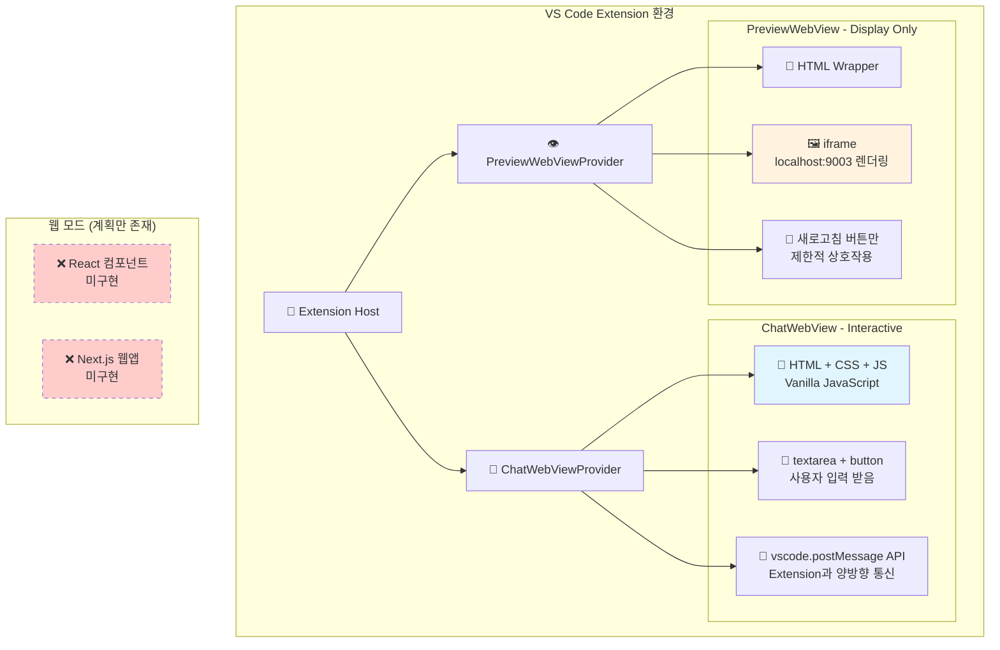
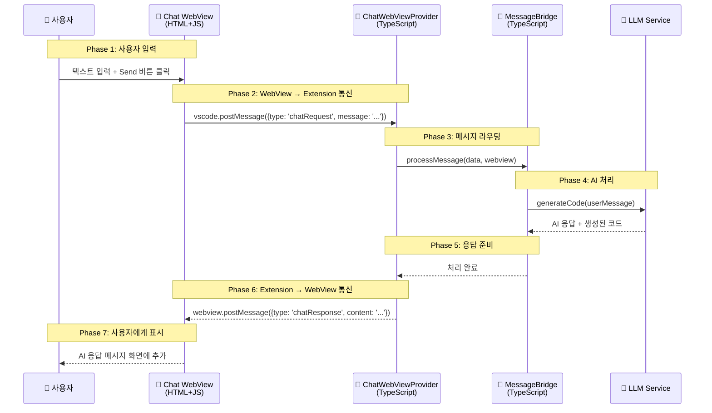
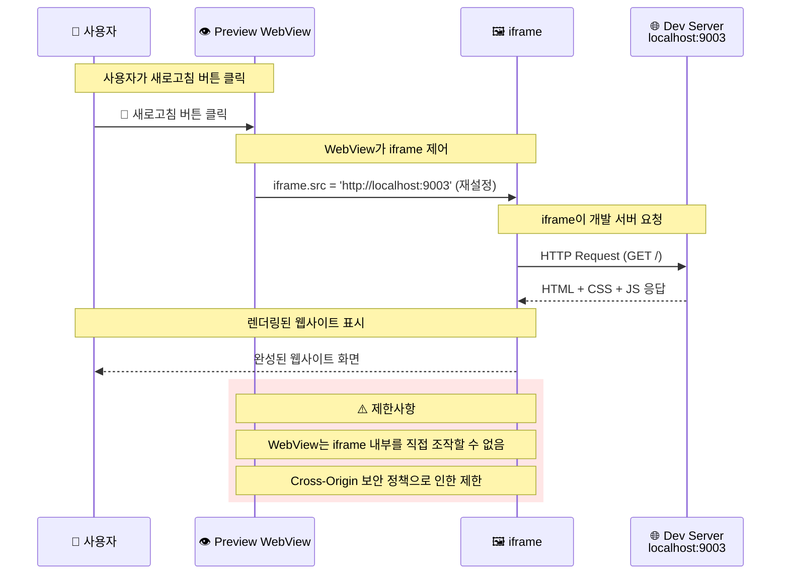
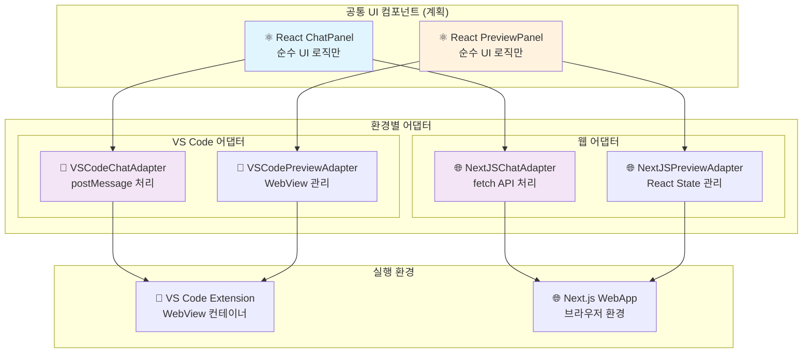
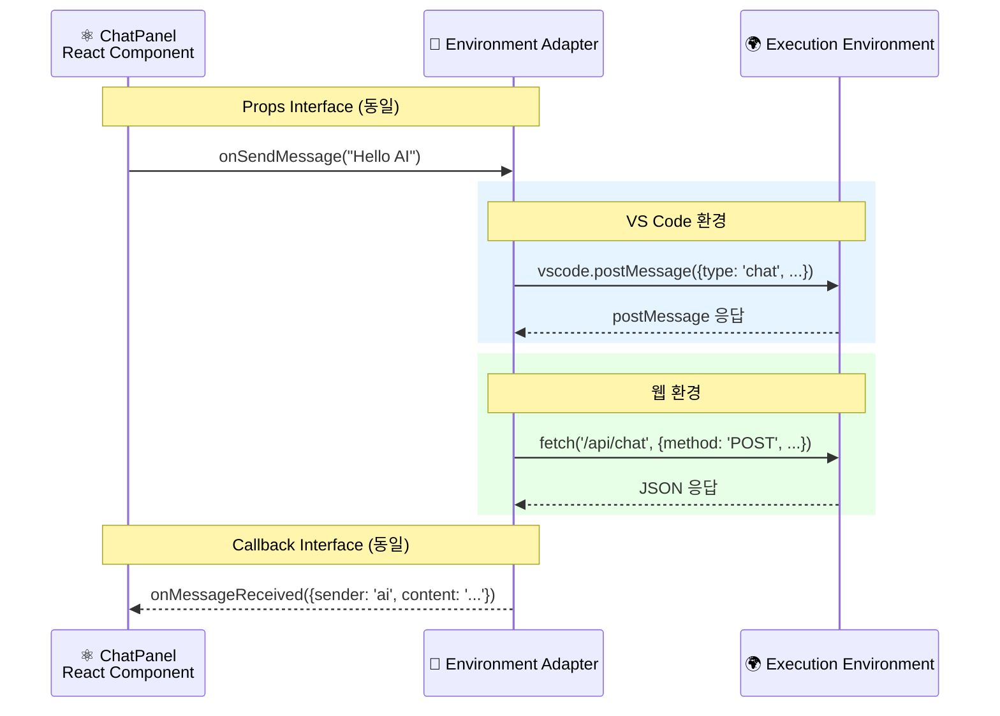
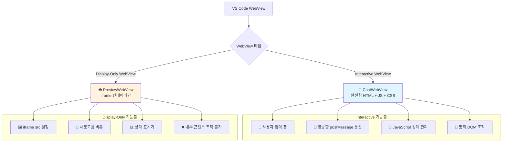
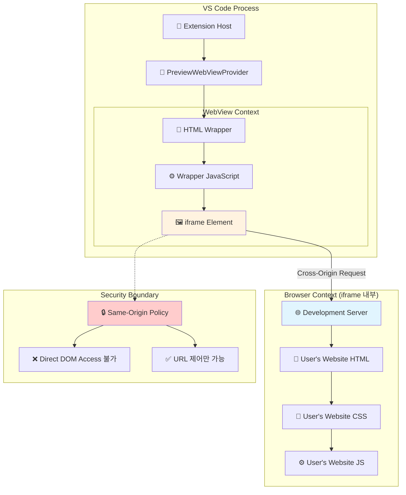
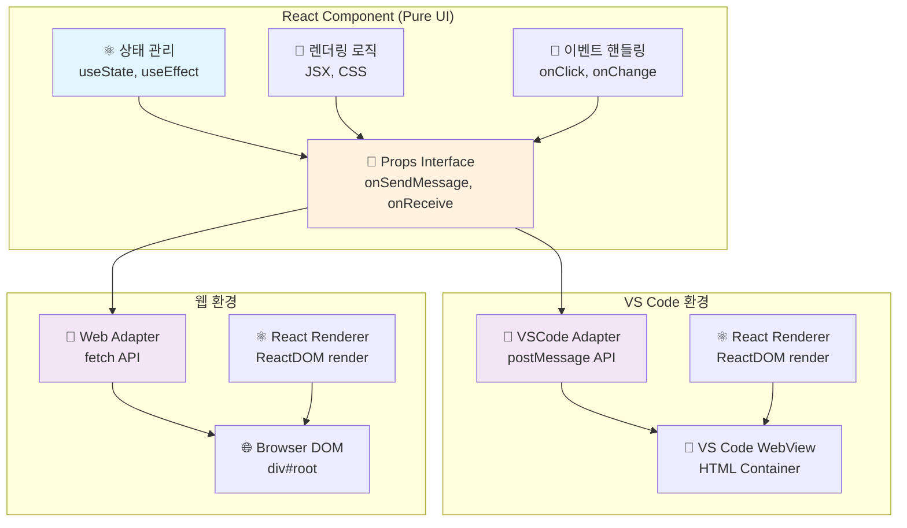

# 99. (참조) 웹뷰 패널의 비밀 - 기술 아키텍처 상세 분석

## 🎯 핵심 질문들

1. **AI 채팅 패널**: 사용자 입력을 받는 interactive WebView인가?
2. **프리뷰 패널**: 단순히 iframe으로 웹사이트만 보여주는가?
3. **React 컴포넌트**: 같은 소스가 VS Code와 웹에서 모두 작동하는 원리?

---

## 🏗️ 현재 구현 상황 vs 계획된 아키텍처

### 1. 현재 실제 구현 (Phase 1-5)


**현실:**
- ✅ **VS Code WebView**: HTML + Vanilla JS로 구현됨
- ❌ **React 컴포넌트**: 아직 존재하지 않음
- ❌ **공통 UI 라이브러리**: 계획만 있고 미구현

---

## 💬 AI 채팅 패널의 기술적 원리

### 1. Interactive WebView 구조


### 2. 실제 구현 코드 구조
```javascript
// extensions/windwalker/src/webview/chat/script.js (예상 구조)
(function() {
    const vscode = acquireVsCodeApi();  // VS Code API 획득
    
    // DOM 요소
    const chatInput = document.getElementById('chat-input');
    const sendButton = document.getElementById('send-button');
    const messagesDiv = document.getElementById('messages');
    
    // 사용자 입력 처리
    sendButton.addEventListener('click', () => {
        const message = chatInput.value.trim();
        if (message) {
            // 1. 사용자 메시지 화면에 표시
            addMessage('user', message);
            
            // 2. Extension에 메시지 전송
            vscode.postMessage({
                type: 'chatRequest',
                message: message,
                timestamp: Date.now()
            });
            
            chatInput.value = '';
        }
    });
    
    // Extension으로부터 응답 수신
    window.addEventListener('message', event => {
        const data = event.data;
        if (data.type === 'chatResponse') {
            // AI 응답을 화면에 표시
            addMessage('ai', data.content);
        }
    });
    
    function addMessage(sender, content) {
        const messageEl = document.createElement('div');
        messageEl.className = `message ${sender}`;
        messageEl.textContent = content;
        messagesDiv.appendChild(messageEl);
    }
})();
```

**핵심 포인트:**
- 📝 **완전한 상호작용**: textarea, button, 메시지 표시 등 모든 UI 요소 포함
- 🔗 **양방향 통신**: `postMessage` → Extension → `postMessage` 순환
- 💾 **상태 관리**: WebView 내부에서 대화 히스토리 관리

---

## 👁️ 프리뷰 패널의 기술적 원리

### 1. iframe 기반 렌더링 구조
```mermaid
flowchart TD
    subgraph "VS Code WebView Container"
        A[📄 PreviewWebView HTML Wrapper]
        
        subgraph "HTML 구조"
            B[🔧 Toolbar<br/>URL 입력 + 새로고침 버튼]
            C[🖼️ iframe Element<br/>id='preview-frame']
        end
        
        A --> B
        A --> C
    end
    
    subgraph "iframe 내부 (별도 컨텍스트)"
        D[🌐 Development Server<br/>localhost:9003]
        
        subgraph "사용자 웹사이트"
            E[📄 index.html]
            F[🎨 style.css] 
            G[⚙️ script.js]
        end
        
        D --> E
        D --> F
        D --> G
    end
    
    C -->|src="http://localhost:9003"| D
    
    subgraph "제한적 상호작용"
        H[🔄 새로고침 버튼<br/>iframe.src 재설정]
        I[📝 URL 변경<br/>iframe.src 업데이트]
        J[❌ iframe 내부 직접 조작 불가<br/>보안상 Cross-Origin 제한]
    end
    
    B --> H
    B --> I
    C -.->|Cross-Origin Restriction| J
    
    style C fill:#fff3e0
    style D fill:#e1f5fe
    style J fill:#ffcccc
```

### 2. iframe과 WebView의 관계


**핵심 포인트:**
- 🖼️ **단순 렌더링**: iframe은 완성된 웹사이트만 표시
- 🔒 **보안 제한**: Cross-Origin으로 인해 iframe 내부 조작 불가
- 🔄 **제한적 제어**: URL 변경, 새로고침만 가능

---

## 🤔 React 컴포넌트 공통화 계획의 원리

### 1. 어댑터 패턴을 통한 환경 추상화


### 2. 같은 React 컴포넌트가 다른 환경에서 작동하는 원리


### 3. 구체적 구현 예시
```typescript
// 공통 React 컴포넌트 (동일한 소스)
interface ChatPanelProps {
    messages: ChatMessage[];
    onSendMessage: (message: string) => Promise<void>;
    isLoading: boolean;
}

export function ChatPanel({ messages, onSendMessage, isLoading }: ChatPanelProps) {
    const [input, setInput] = useState('');
    
    const handleSend = async () => {
        if (input.trim()) {
            await onSendMessage(input.trim());  // 어댑터가 처리
            setInput('');
        }
    };
    
    return (
        <div className="chat-panel">
            <div className="messages">
                {messages.map(msg => 
                    <div key={msg.id} className={`message ${msg.sender}`}>
                        {msg.content}
                    </div>
                )}
            </div>
            <div className="input-area">
                <textarea 
                    value={input} 
                    onChange={(e) => setInput(e.target.value)}
                    placeholder="Type your message..."
                />
                <button onClick={handleSend} disabled={isLoading}>
                    {isLoading ? 'Sending...' : 'Send'}
                </button>
            </div>
        </div>
    );
}

// VS Code 환경에서 사용
function VSCodeChatContainer() {
    const adapter = new VSCodeChatAdapter();
    
    return <ChatPanel 
        messages={messages}
        onSendMessage={adapter.sendMessage}  // postMessage 사용
        isLoading={loading}
    />;
}

// 웹 환경에서 사용  
function WebChatContainer() {
    const adapter = new NextJSChatAdapter();
    
    return <ChatPanel
        messages={messages}
        onSendMessage={adapter.sendMessage}  // fetch API 사용
        isLoading={loading}
    />;
}
```

**핵심 원리:**
- 🎯 **관심사 분리**: UI 로직과 통신 로직 완전 분리
- 🔌 **어댑터 패턴**: 환경별 차이를 어댑터가 추상화
- ⚛️ **React 재사용**: 같은 컴포넌트가 다른 어댑터와 조합

---

## 🔍 기술적 세부사항 Q&A

### Q1: AI 채팅 WebView가 Interactive한 이유?


**답:** ChatWebView는 완전한 HTML 애플리케이션으로, 사용자 입력 처리, 상태 관리, DOM 조작이 모두 가능합니다.

### Q2: iframe 내부와 WebView는 어떻게 분리되어 있나?


**답:** iframe은 완전히 분리된 브라우저 컨텍스트로, WebView는 iframe의 URL만 제어할 수 있고 내부 DOM에는 접근할 수 없습니다.

### Q3: 왜 React 컴포넌트가 VS Code와 웹 모두에서 작동하나?


**답:** React 컴포넌트는 순수한 UI 로직만 담당하고, 환경별 차이는 어댑터가 처리하기 때문에 같은 컴포넌트가 다른 환경에서 작동할 수 있습니다.

---

## 🎯 핵심 학습 포인트

### 1. WebView의 두 얼굴
- **💬 Interactive WebView (채팅)**: 완전한 웹 애플리케이션, 양방향 통신
- **👁️ Display WebView (프리뷰)**: iframe 컨테이너, 단방향 렌더링

### 2. 보안과 격리
- **🔒 Cross-Origin 제한**: iframe 내부는 직접 조작 불가
- **🔗 postMessage 통신**: WebView ↔ Extension 간 안전한 메시지 교환

### 3. 아키텍처 진화 방향
- **현재**: HTML + Vanilla JS (VS Code만)
- **계획**: React + 어댑터 패턴 (VS Code + 웹 공통)

---

**문서 작성자**: Claude Code Assistant  
**작성일**: 2025-08-05  
**버전**: 1.0 (WebView 패널 기술 원리 상세 분석)  
**기반**: 실제 구현 코드 분석 및 기술 아키텍처 연구