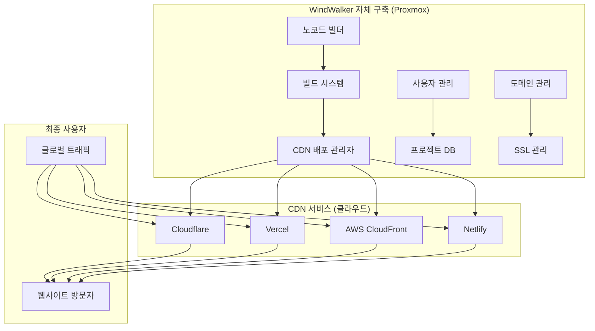

# CDN 통합 아키텍처 및 구현 가이드

## 🏗️ 전체 시스템 아키텍처

### **하이브리드 서비스 구조**


## 🛠️ 핵심 컴포넌트 구현

### **A. CDN 배포 관리자 (CDNDeploymentManager)**

#### **기본 클래스 구조**
```typescript
interface CDNProvider {
  name: string;
  deploy(project: Project, files: StaticFiles): Promise<DeploymentResult>;
  updateDomain(project: Project, domain: string): Promise<boolean>;
  getMetrics(project: Project): Promise<CDNMetrics>;
  getMonthlyBill(project: Project): Promise<BillingInfo>;
}

class CDNDeploymentManager {
  private providers: Map<string, CDNProvider> = new Map();
  private costOptimizer: CostOptimizer;
  private performanceMonitor: PerformanceMonitor;
  
  constructor() {
    this.registerProviders();
    this.costOptimizer = new CostOptimizer();
    this.performanceMonitor = new PerformanceMonitor();
  }
  
  async deployProject(project: Project): Promise<DeploymentResult> {
    // 1. 최적 CDN 선택
    const optimalCDN = await this.selectOptimalCDN(project);
    
    // 2. 정적 파일 준비
    const staticFiles = await this.prepareStaticFiles(project);
    
    // 3. 배포 실행
    const result = await optimalCDN.deploy(project, staticFiles);
    
    // 4. 후처리 (도메인, SSL, 모니터링)
    await this.postDeploymentSetup(project, result);
    
    return result;
  }
}
```

### **B. Cloudflare 프로바이더 구현**

#### **Cloudflare API 통합**
```typescript
class CloudflareProvider implements CDNProvider {
  name = 'cloudflare';
  private apiToken: string;
  private accountId: string;
  
  constructor(config: CloudflareConfig) {
    this.apiToken = config.apiToken;
    this.accountId = config.accountId;
  }
  
  async deploy(project: Project, files: StaticFiles): Promise<DeploymentResult> {
    try {
      // 1. Pages 프로젝트 생성/업데이트
      const pagesProject = await this.ensurePagesProject(project);
      
      // 2. 파일 업로드
      const uploadResult = await this.uploadFiles(pagesProject.id, files);
      
      // 3. 배포 트리거
      const deployment = await this.triggerDeployment(pagesProject.id, uploadResult.manifest);
      
      // 4. 배포 완료 대기
      await this.waitForDeployment(deployment.id);
      
      return {
        success: true,
        url: `https://${pagesProject.subdomain}.pages.dev`,
        deploymentId: deployment.id,
        provider: 'cloudflare'
      };
    } catch (error) {
      throw new Error(`Cloudflare deployment failed: ${error.message}`);
    }
  }
  
  private async uploadFiles(projectId: string, files: StaticFiles): Promise<UploadResult> {
    const formData = new FormData();
    
    // 파일들을 ZIP으로 압축
    const zipBuffer = await this.createZipArchive(files);
    formData.append('file', zipBuffer, 'deployment.zip');
    
    const response = await fetch(
      `https://api.cloudflare.com/client/v4/accounts/${this.accountId}/pages/projects/${projectId}/deployments`,
      {
        method: 'POST',
        headers: {
          'Authorization': `Bearer ${this.apiToken}`,
        },
        body: formData
      }
    );
    
    return await response.json();
  }
  
  async updateDomain(project: Project, domain: string): Promise<boolean> {
    // 커스텀 도메인 설정
    const response = await fetch(
      `https://api.cloudflare.com/client/v4/accounts/${this.accountId}/pages/projects/${project.id}/domains`,
      {
        method: 'POST',
        headers: {
          'Authorization': `Bearer ${this.apiToken}`,
          'Content-Type': 'application/json'
        },
        body: JSON.stringify({ name: domain })
      }
    );
    
    return response.ok;
  }
}
```

### **C. Vercel 프로바이더 구현**

#### **Vercel API 통합**
```typescript
class VercelProvider implements CDNProvider {
  name = 'vercel';
  private token: string;
  private teamId?: string;
  
  async deploy(project: Project, files: StaticFiles): Promise<DeploymentResult> {
    // 1. 배포 생성
    const deployment = await this.createDeployment(project, files);
    
    // 2. 파일 업로드
    await this.uploadDeploymentFiles(deployment.id, files);
    
    // 3. 배포 완료 대기
    await this.waitForDeploymentReady(deployment.id);
    
    return {
      success: true,
      url: deployment.url,
      deploymentId: deployment.id,
      provider: 'vercel'
    };
  }
  
  private async createDeployment(project: Project, files: StaticFiles): Promise<VercelDeployment> {
    const response = await fetch('https://api.vercel.com/v13/deployments', {
      method: 'POST',
      headers: {
        'Authorization': `Bearer ${this.token}`,
        'Content-Type': 'application/json'
      },
      body: JSON.stringify({
        name: project.slug,
        files: this.prepareFileManifest(files),
        projectSettings: {
          framework: 'nextjs',
          buildCommand: 'npm run build',
          outputDirectory: 'out'
        }
      })
    });
    
    return await response.json();
  }
}
```

### **D. AWS CloudFront 프로바이더 구현**

#### **S3 + CloudFront 배포**
```typescript
class AWSCloudFrontProvider implements CDNProvider {
  name = 'aws-cloudfront';
  private s3Client: S3Client;
  private cloudFrontClient: CloudFrontClient;
  
  async deploy(project: Project, files: StaticFiles): Promise<DeploymentResult> {
    // 1. S3 버킷에 업로드
    const s3Result = await this.uploadToS3(project, files);
    
    // 2. CloudFront 배포 업데이트
    const distributionId = await this.getOrCreateDistribution(project);
    await this.invalidateCache(distributionId, ['/*']);
    
    return {
      success: true,
      url: `https://${distributionId}.cloudfront.net`,
      deploymentId: s3Result.ETag,
      provider: 'aws-cloudfront'
    };
  }
  
  private async uploadToS3(project: Project, files: StaticFiles): Promise<S3UploadResult> {
    const promises = files.map(async (file) => {
      const params = {
        Bucket: `windwalker-sites-${project.id}`,
        Key: file.path,
        Body: file.content,
        ContentType: this.getMimeType(file.path),
        CacheControl: this.getCacheControl(file.path)
      };
      
      return await this.s3Client.send(new PutObjectCommand(params));
    });
    
    await Promise.all(promises);
    return { success: true };
  }
}
```

## 🧠 지능형 CDN 선택 알고리즘

### **비용 최적화 엔진**
```typescript
class CostOptimizer {
  async selectOptimalCDN(project: Project): Promise<CDNProvider> {
    const factors = await this.analyzeProject(project);
    
    // 1. 트래픽 기반 분석
    if (factors.monthlyTraffic < 100_000) {
      return this.providers.get('cloudflare'); // 무료 티어
    }
    
    // 2. 지역 기반 분석
    if (factors.primaryRegion === 'asia' && factors.monthlyTraffic < 1_000_000) {
      return this.providers.get('cloudflare'); // 아시아 최적화
    }
    
    // 3. 기능 요구사항 분석
    if (factors.requiresServerlessFunction) {
      return this.providers.get('vercel'); // 서버리스 기능
    }
    
    // 4. 비용 효율성 분석
    const costComparison = await this.compareCosts(factors);
    return costComparison.mostEconomical;
  }
  
  private async compareCosts(factors: ProjectFactors): Promise<CostComparison> {
    const providers = ['cloudflare', 'vercel', 'aws-cloudfront'];
    const costs = await Promise.all(
      providers.map(provider => this.calculateMonthlyCost(provider, factors))
    );
    
    return {
      mostEconomical: providers[costs.indexOf(Math.min(...costs))],
      costs: Object.fromEntries(providers.map((p, i) => [p, costs[i]]))
    };
  }
}
```

### **성능 모니터링 시스템**
```typescript
class PerformanceMonitor {
  async monitorCDNPerformance(project: Project): Promise<PerformanceMetrics> {
    const providers = project.cdnProviders;
    const metrics = await Promise.all(
      providers.map(provider => this.measurePerformance(provider, project))
    );
    
    return this.aggregateMetrics(metrics);
  }
  
  private async measurePerformance(provider: CDNProvider, project: Project): Promise<CDNMetrics> {
    // 글로벌 성능 테스트
    const testResults = await this.runGlobalSpeedTest(project.url);
    
    return {
      provider: provider.name,
      avgResponseTime: testResults.avgResponseTime,
      globalLatency: testResults.globalLatency,
      availabilityScore: testResults.availabilityScore,
      cacheHitRatio: await provider.getMetrics(project).then(m => m.cacheHitRatio)
    };
  }
}
```

## 🚀 자동 배포 파이프라인

### **빌드 및 배포 워크플로우**
```typescript
class BuildAndDeployPipeline {
  async processProject(project: Project): Promise<void> {
    // 1. 노코드 빌더에서 정적 파일 생성
    const buildResult = await this.buildStaticSite(project);
    
    // 2. 파일 최적화
    const optimizedFiles = await this.optimizeFiles(buildResult.files);
    
    // 3. CDN 배포
    const deploymentResult = await this.deployToCDN(project, optimizedFiles);
    
    // 4. 후처리
    await this.postProcessDeployment(project, deploymentResult);
  }
  
  private async buildStaticSite(project: Project): Promise<BuildResult> {
    // 노코드 빌더 데이터를 HTML/CSS/JS로 변환
    const generator = new StaticSiteGenerator();
    return await generator.build(project.designData);
  }
  
  private async optimizeFiles(files: StaticFiles): Promise<StaticFiles> {
    return Promise.all(files.map(async (file) => {
      if (file.type === 'image') {
        return await this.optimizeImage(file);
      } else if (file.type === 'css') {
        return await this.minifyCSS(file);
      } else if (file.type === 'js') {
        return await this.minifyJS(file);
      }
      return file;
    }));
  }
}
```

### **실시간 배포 상태 모니터링**
```typescript
class DeploymentStatusTracker {
  private deployments: Map<string, DeploymentStatus> = new Map();
  
  async trackDeployment(deploymentId: string): Promise<void> {
    const status = {
      id: deploymentId,
      status: 'in_progress',
      startTime: Date.now(),
      logs: []
    };
    
    this.deployments.set(deploymentId, status);
    
    // WebSocket으로 실시간 상태 전송
    this.notifyClients(deploymentId, status);
    
    // 배포 완료 대기
    await this.waitForCompletion(deploymentId);
  }
  
  private async waitForCompletion(deploymentId: string): Promise<void> {
    const maxWaitTime = 10 * 60 * 1000; // 10분
    const startTime = Date.now();
    
    while (Date.now() - startTime < maxWaitTime) {
      const status = await this.checkDeploymentStatus(deploymentId);
      
      if (status === 'completed') {
        this.updateDeploymentStatus(deploymentId, 'completed');
        break;
      } else if (status === 'failed') {
        this.updateDeploymentStatus(deploymentId, 'failed');
        throw new Error('Deployment failed');
      }
      
      await new Promise(resolve => setTimeout(resolve, 5000)); // 5초 대기
    }
  }
}
```

## 🔒 보안 및 도메인 관리

### **SSL 인증서 자동 관리**
```typescript
class SSLManager {
  async setupSSL(project: Project, domain: string): Promise<SSLCertificate> {
    // 1. Let's Encrypt 또는 CDN 제공 SSL 사용
    if (project.cdnProvider === 'cloudflare') {
      return await this.setupCloudflareSSL(project, domain);
    } else if (project.cdnProvider === 'vercel') {
      return await this.setupVercelSSL(project, domain);
    }
    
    // 2. 커스텀 SSL 인증서 관리
    return await this.setupCustomSSL(project, domain);
  }
  
  private async setupCloudflareSSL(project: Project, domain: string): Promise<SSLCertificate> {
    // Cloudflare는 자동으로 SSL 제공
    const response = await fetch(
      `https://api.cloudflare.com/client/v4/zones/${project.zoneId}/ssl/certificate_packs`,
      {
        headers: { 'Authorization': `Bearer ${this.cloudflareToken}` }
      }
    );
    
    const certificates = await response.json();
    return certificates.result[0]; // 첫 번째 인증서 사용
  }
}
```

### **도메인 검증 및 설정**
```typescript
class DomainManager {
  async setupCustomDomain(project: Project, domain: string): Promise<DomainSetupResult> {
    // 1. 도메인 소유권 검증
    const verificationResult = await this.verifyDomainOwnership(domain);
    if (!verificationResult.verified) {
      throw new Error('Domain ownership verification failed');
    }
    
    // 2. DNS 설정 안내
    const dnsRecords = await this.generateDNSRecords(project, domain);
    
    // 3. CDN에 도메인 추가
    const cdnResult = await project.cdnProvider.updateDomain(project, domain);
    
    // 4. SSL 인증서 설정
    const sslResult = await this.sslManager.setupSSL(project, domain);
    
    return {
      domain,
      dnsRecords,
      sslCertificate: sslResult,
      status: 'pending_dns_propagation'
    };
  }
  
  private async generateDNSRecords(project: Project, domain: string): Promise<DNSRecord[]> {
    const cdnEndpoint = await project.cdnProvider.getEndpoint(project);
    
    return [
      {
        type: 'CNAME',
        name: '@',
        value: cdnEndpoint,
        ttl: 300
      },
      {
        type: 'CNAME',
        name: 'www',
        value: cdnEndpoint,
        ttl: 300
      }
    ];
  }
}
```

## 📊 비용 추적 및 최적화

### **실시간 비용 모니터링**
```typescript
class CostTracker {
  async trackMonthlyCost(project: Project): Promise<CostBreakdown> {
    const cdnCosts = await Promise.all([
      this.getCloudflareUsage(project),
      this.getVercelUsage(project),
      this.getAWSUsage(project)
    ]);
    
    return {
      totalCost: cdnCosts.reduce((sum, cost) => sum + cost.amount, 0),
      breakdown: cdnCosts,
      recommendations: await this.generateCostOptimizationRecommendations(cdnCosts)
    };
  }
  
  private async generateCostOptimizationRecommendations(costs: CDNCost[]): Promise<string[]> {
    const recommendations = [];
    
    // 트래픽 패턴 분석
    const highTrafficProvider = costs.find(c => c.trafficGB > 1000);
    if (highTrafficProvider && highTrafficProvider.provider !== 'cloudflare') {
      recommendations.push('Consider migrating to Cloudflare for better bandwidth pricing');
    }
    
    // 사용량 최적화
    const underutilizedProviders = costs.filter(c => c.utilizationRate < 0.3);
    if (underutilizedProviders.length > 0) {
      recommendations.push('Consider consolidating deployments to reduce fixed costs');
    }
    
    return recommendations;
  }
}
```

### **자동 비용 최적화**
```typescript
class AutoCostOptimizer {
  async optimizeProjectCosts(): Promise<void> {
    const projects = await this.getAllProjects();
    
    for (const project of projects) {
      const costAnalysis = await this.analyzeCosts(project);
      
      if (costAnalysis.canOptimize) {
        await this.executeOptimization(project, costAnalysis.recommendation);
      }
    }
  }
  
  private async executeOptimization(project: Project, recommendation: OptimizationRecommendation): Promise<void> {
    switch (recommendation.type) {
      case 'migrate_cdn':
        await this.migrateCDN(project, recommendation.targetProvider);
        break;
      case 'optimize_caching':
        await this.optimizeCaching(project, recommendation.cacheSettings);
        break;
      case 'compress_assets':
        await this.compressAssets(project, recommendation.compressionSettings);
        break;
    }
  }
}
```

## 🎯 구현 우선순위 및 일정

### **Phase 1: 기본 CDN 통합 (4주)**
```yaml
Week 1-2: 코어 아키텍처
  - CDNDeploymentManager 기본 구조
  - CloudflareProvider 기본 구현
  - 간단한 배포 파이프라인

Week 3-4: 기본 기능 완성
  - 파일 업로드 및 배포
  - 도메인 연결
  - 기본 모니터링
```

### **Phase 2: 고급 기능 및 최적화 (6주)**
```yaml
Week 5-7: 다중 CDN 지원
  - VercelProvider 구현
  - AWSCloudFrontProvider 구현
  - 지능형 CDN 선택

Week 8-10: 비용 최적화
  - CostOptimizer 구현
  - 실시간 비용 추적
  - 자동 최적화 알고리즘
```

### **Phase 3: 엔터프라이즈 기능 (4주)**
```yaml
Week 11-12: 고급 보안 및 관리
  - SSL 자동 관리
  - 고급 도메인 설정
  - 백업 및 복구

Week 13-14: 성능 및 분석
  - 글로벌 성능 모니터링
  - 상세 분석 대시보드
  - API 및 웹훅 지원
```

## 💡 최종 권장사항

### **기술적 우선순위**
1. **Cloudflare 우선 구현**: 가장 경제적이고 안정적
2. **점진적 확장**: 다른 CDN 추가는 수요에 따라
3. **자동화 중심**: 사용자 개입 최소화

### **비즈니스 전략**
1. **무료 티어 활용**: 초기 사용자 확보
2. **투명한 비용 구조**: 사용량 기반 요금제
3. **성능 중심 마케팅**: 글로벌 속도 개선 강조

**CDN 통합 아키텍처를 통해 WindWalker는 글로벌 성능과 비용 효율성을 동시에 확보할 수 있습니다!** 🌐