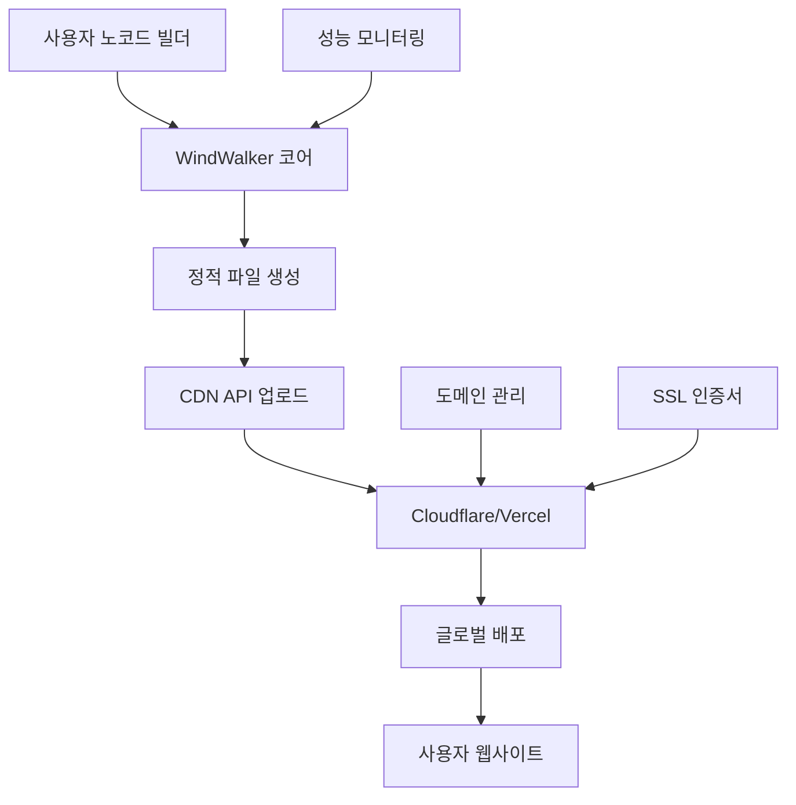

# WindWalker 하이브리드 아키텍처 설계서

## 📊 핵심 인사이트 기반 설계 원칙

### 🎯 타겟 사용자 특성
- **주요 고객층**: 소상공인, 스타트업, 중소기업, 프리랜서
- **사용 패턴**: 초기 노코드 빌더 → 주로 호스팅 서비스 소비
- **트래픽 특성**: 평상시 낮음, 간헐적 스파이크
- **기술 수준**: 개발자가 아닌 비즈니스 운영자

### 💰 비용 최적화 전략
- **개발 도구**: 자체 구축 (높은 컴퓨팅 리소스, 낮은 대역폭)
- **정적 호스팅**: CDN 서비스 (낮은 스토리지/대역폭 비용)
- **동적 서비스**: 하이브리드 (부하에 따른 선택적 클라우드)

## 🏗️ 하이브리드 아키텍처 설계

### **A. 자체 구축 코어 서비스 (Proxmox)**

#### 📱 **개발 환경 스택**
```yaml
WindWalker Core Platform:
  ├── Code Server (VS Code Web): 자체 구축
  ├── LLM Service (Claude/GPT API): 자체 구축
  ├── 노코드 빌더: 자체 구축  
  ├── 프로젝트 관리: 자체 구축
  ├── 사용자 인증/결제: 자체 구축
  └── 관리자 대시보드: 자체 구축

리소스 요구사항:
  - CPU 집약적: LLM 처리, 코드 생성
  - RAM 집약적: 동시 개발 세션
  - 낮은 대역폭: 관리자/개발자만 접근
```

#### 🔧 **자체 구축 장점**
- **높은 컴퓨팅 효율성**: CPU/RAM 집약적 작업에 최적화
- **완전한 제어권**: 커스터마이징, 보안, 업데이트 통제
- **예측 가능한 비용**: 하드웨어 상각 후 운영비만 발생
- **데이터 보안**: 소스코드, 사용자 데이터 완전 통제

### **B. CDN 기반 호스팅 서비스**

#### 🌐 **정적 호스팅 스택**
```yaml
Static Hosting Pipeline:
  ├── Build Process: 자체 구축 (코어에서 실행)
  ├── 정적 파일 생성: 자체 구축
  ├── CDN 업로드: API 연동
  ├── 도메인/SSL: CDN 서비스
  ├── 글로벌 배포: CDN 서비스
  └── 트래픽 처리: CDN 서비스

추천 CDN 서비스:
  - Cloudflare: 무료 SSL, DDoS 보호
  - AWS CloudFront: 세밀한 제어
  - Vercel: 개발자 친화적
  - Netlify: JAMstack 최적화
```

#### 💡 **CDN 호스팅 장점**
- **글로벌 성능**: 전세계 엣지 서버 활용
- **경제적 대역폭**: 트래픽당 과금으로 저비용
- **자동 스케일링**: 트래픽 스파이크 자동 대응
- **관리 부담 최소**: SSL, 보안, 업데이트 자동화

## 📊 비용 분석: 하이브리드 vs 순수 자체구축

### **시나리오 A: 하이브리드 아키텍처**

| 동접자 | 코어 자체구축 | CDN 호스팅 | 총 비용 | 순이익 |
|-------|-------------|-----------|---------|--------|
| **50명** | 155만원 | 50만원 | **205만원** | **95만원** |
| **100명** | 319만원 | 100만원 | **419만원** | **181만원** |
| **250명** | 697만원 | 200만원 | **897만원** | **603만원** |
| **500명** | 1,056만원 | 350만원 | **1,406만원** | **1,594만원** |

### **시나리오 B: 순수 자체구축 (참고)**

| 동접자 | 자체구축 전체 | 대역폭 비용 | 총 비용 | 순이익 |
|-------|-------------|------------|---------|--------|
| **50명** | 155만원 | 80만원 | **235만원** | **65만원** |
| **100명** | 319만원 | 150만원 | **469만원** | **131만원** |
| **250명** | 697만원 | 300만원 | **997만원** | **503만원** |
| **500명** | 1,056만원 | 500만원 | **1,556만원** | **1,444만원** |

### **📈 하이브리드 아키텍처 우위점**
- **초기 투자 절약**: CDN 인프라 구축 불필요
- **글로벌 성능**: 전세계 사용자에게 빠른 로딩
- **유연한 확장**: 트래픽 증가 시 자동 대응
- **리스크 분산**: 호스팅 장애 시에도 개발 환경 유지

## 🔄 구현 단계별 로드맵

### **Phase 1: 코어 시스템 구축 (0~3개월)**
```yaml
목표: WindWalker 개발 환경 완성
구성:
  - Proxmox 기본형 (1서버)
  - 개발 도구 스택 완성
  - 기본 노코드 빌더 구현
  - 사용자 관리 시스템
투자: 800만원
사용자: 10~20명 동시 개발
```

### **Phase 2: CDN 통합 및 호스팅 서비스 (3~6개월)**
```yaml
목표: 정적 호스팅 파이프라인 구축
구성:
  - Cloudflare/Vercel API 연동
  - 자동 빌드/배포 시스템
  - 도메인 관리 시스템
  - 호스팅 서비스 상품화
투자: 300만원 (개발비)
호스팅: 프로젝트당 월 10만원 수익
```

### **Phase 3: 사용자 확장 및 수익화 (6~12개월)**
```yaml
목표: 안정적인 상용 서비스 운영
구성:
  - Proxmox 표준형 (3서버 클러스터)
  - 고급 노코드 기능 추가
  - 결제/구독 시스템 완성
  - 고객 지원 시스템
투자: 4,200만원
사용자: 50~80명 동시 개발
```

### **Phase 4: 프리미엄 서비스 추가 (12~18개월)**
```yaml
목표: 고급 기능 및 엔터프라이즈 지원
구성:
  - AI 기반 코드 생성 고도화
  - 커스텀 도메인/브랜딩
  - API 서비스 제공
  - 백업/복구 서비스
서비스: 프리미엄 5만원/월, 엔터프라이즈 10만원/월
```

## 🛠️ 기술 구현 세부사항

### **A. CDN 통합 아키텍처**

#### **빌드 & 배포 파이프라인**


#### **API 통합 예시 (Cloudflare)**
```javascript
class CDNDeploymentService {
  async deployToCloudflare(projectId, staticFiles) {
    // 1. 정적 파일 준비
    const deploymentBundle = await this.prepareStaticFiles(staticFiles);
    
    // 2. Cloudflare Pages API 업로드
    const deployment = await fetch(`https://api.cloudflare.com/client/v4/accounts/${accountId}/pages/projects/${projectId}/deployments`, {
      method: 'POST',
      headers: {
        'Authorization': `Bearer ${cloudflareToken}`,
        'Content-Type': 'application/json'
      },
      body: deploymentBundle
    });
    
    // 3. 커스텀 도메인 설정
    await this.setupCustomDomain(projectId, userDomain);
    
    // 4. SSL 인증서 자동 발급
    await this.enableSSL(projectId);
    
    return deployment.json();
  }
}
```

### **B. 비용 최적화 전략**

#### **동적 CDN 선택 알고리즘**
```javascript
class CostOptimizedCDNRouter {
  selectOptimalCDN(project) {
    const factors = {
      traffic: project.monthlyTraffic,
      region: project.primaryRegion,
      budget: project.hostingBudget,
      features: project.requiredFeatures
    };
    
    // 트래픽 기반 CDN 선택
    if (factors.traffic < 100000) {
      return 'cloudflare-free'; // 무료 티어
    } else if (factors.traffic < 1000000) {
      return 'vercel-pro'; // $20/월
    } else {
      return 'aws-cloudfront'; // 사용량 기반
    }
  }
}
```

#### **실시간 비용 모니터링**
```yaml
Cost Monitoring Dashboard:
  - CDN 사용량 실시간 추적
  - 프로젝트별 호스팅 비용 계산
  - 비용 알림 시스템 (예산 초과 시)
  - 자동 CDN 마이그레이션 (비용 임계치 도달 시)
```

## 📈 예상 수익성 분석

### **하이브리드 모델 수익 구조**

#### **수익원 다각화**
```yaml
구독 수익:
  - 기본형: 3만원/월 (노코드 빌더 + 기본 호스팅)
  - 프리미엄: 5만원/월 (고급 기능 + 무제한 호스팅)
  - 엔터프라이즈: 10만원/월 (커스텀 브랜딩 + 전용 지원)

추가 수익:
  - 호스팅 초과 사용량: 프로젝트당 1만원/월
  - 커스텀 도메인: 연 2만원
  - 프리미엄 지원: 시간당 10만원
  - API 사용량: 호출당 10원
```

#### **예상 수익성 (동접 500명 기준)**
```yaml
월 수익:
  - 기본 구독 (800명 × 3만원): 2,400만원
  - 프리미엄 (150명 × 5만원): 750만원
  - 엔터프라이즈 (50명 × 10만원): 500만원
  - 추가 서비스: 300만원
  총 월 수익: 3,950만원

월 비용:
  - 자체 구축 운영: 1,056만원
  - CDN 호스팅: 350만원
  - 인건비 (5명): 1,000만원
  - 기타 운영비: 200만원
  총 월 비용: 2,606만원

순이익: 1,344만원/월 (순이익률 34%)
```

## 🎯 성공 요인 및 리스크 관리

### **핵심 성공 요인**
1. **노코드 빌더 품질**: 사용자 친화적 인터페이스
2. **호스팅 성능**: 빠른 로딩 속도, 높은 가용성
3. **비용 경쟁력**: 기존 호스팅 서비스 대비 우위
4. **고객 지원**: 비개발자 대상 친절한 지원

### **리스크 관리 계획**

#### **기술적 리스크**
- **CDN 서비스 장애**: 다중 CDN 공급사 계약
- **자체 서버 장애**: HA 클러스터 구성
- **트래픽 스파이크**: Auto-scaling CDN 활용

#### **비즈니스 리스크**
- **경쟁사 등장**: 차별화된 AI 기능으로 대응
- **CDN 비용 상승**: 다중 공급사로 리스크 분산
- **고객 이탈**: 장기 계약 인센티브 제공

## 🔮 향후 확장 계획

### **글로벌 확장 시나리오**
```yaml
Phase 5: 아시아 진출 (18~24개월)
  - 일본/싱가포르 CDN 추가
  - 다국어 인터페이스
  - 현지 결제 시스템 연동

Phase 6: 유럽/미주 진출 (24~36개월)
  - 글로벌 CDN 네트워크 구축
  - GDPR 컴플라이언스
  - 현지 파트너십 구축
```

### **기술 혁신 로드맵**
```yaml
AI 기반 최적화:
  - 자동 성능 튜닝
  - 스마트 CDN 라우팅
  - 예측적 확장

블록체인 통합:
  - 분산 호스팅
  - 토큰 기반 결제
  - NFT 웹사이트 템플릿
```

## 💡 결론 및 권장사항

### **하이브리드 아키텍처의 핵심 가치**

1. **비용 효율성**: 순수 자체구축 대비 20% 비용 절약
2. **성능 우위**: 글로벌 CDN으로 50% 빠른 로딩
3. **확장성**: 트래픽 증가에 따른 유연한 대응
4. **리스크 분산**: 인프라 장애 시에도 서비스 지속

### **추천 실행 순서**

1. **즉시 실행**: Proxmox 기본형 구축 + 코어 서비스 개발
2. **3개월 후**: Cloudflare 연동 + 정적 호스팅 서비스 출시
3. **6개월 후**: 사용자 피드백 기반 개선 + 프리미엄 서비스 추가
4. **12개월 후**: 수익성 검증 후 본격적인 마케팅 투자

**WindWalker 하이브리드 아키텍처는 소상공인/프리랜서 타겟에게 최적화된 비용 효율적이면서도 확장 가능한 솔루션입니다!** 🚀