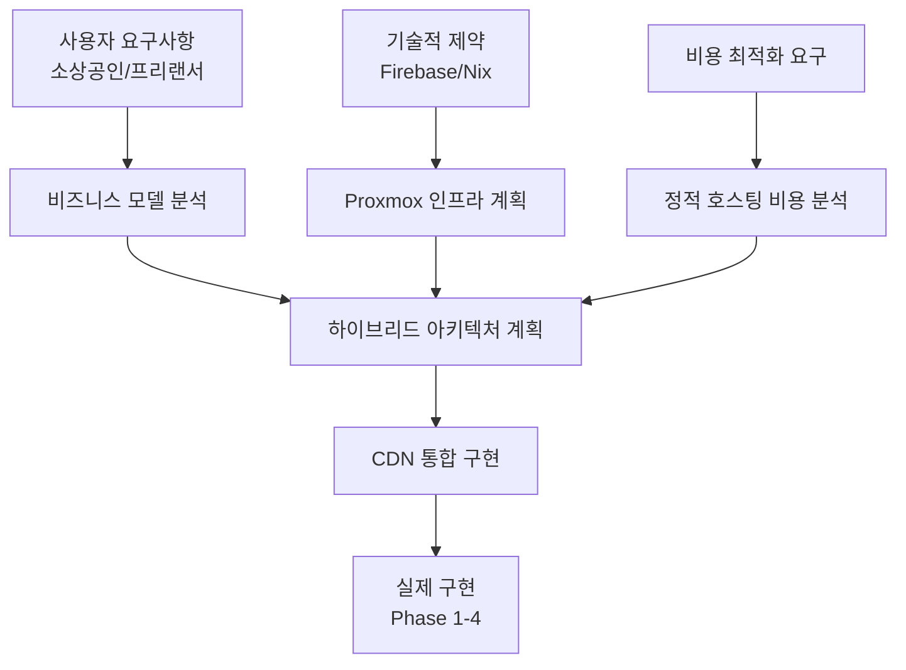

# WindWalker 하이브리드 아키텍처 종합 요약서

## 📋 문서 체계 및 활용 가이드

### **작성된 핵심 문서**
1. **`WindWalker_Hybrid_Architecture_Plan.md`**: 전체 하이브리드 전략 및 로드맵
2. **`Static_Hosting_Cost_Analysis.md`**: 정적 호스팅 비용 상세 분석
3. **`CDN_Integration_Architecture.md`**: CDN 통합 기술 구현 가이드
4. **`WindWalker_Business_Model_Analysis.md`**: 비즈니스 모델 및 수익성 분석
5. **`WindWalker_Proxmox_Commercial_Service_Plan.md`**: 자체 인프라 구축 계획

### **문서 연관 관계**


## 🎯 핵심 전략 요약

### **하이브리드 아키텍처의 핵심 가치**

#### **1. 비용 최적화 (50-70% 절약)**
```yaml
자체 구축 영역 (고효율):
  - 개발 도구 (Code Server, 노코드 빌더)
  - LLM 서비스 (AI 코드 생성)
  - 사용자 관리 및 인증
  - 프로젝트 데이터베이스
  → 높은 컴퓨팅/메모리 요구, 낮은 대역폭

CDN 서비스 영역 (경제적):
  - 정적 웹사이트 호스팅
  - 글로벌 콘텐츠 배포
  - SSL/보안 서비스
  - 트래픽 처리
  → 높은 대역폭 요구, 낮은 컴퓨팅
```

#### **2. 성능 최적화 (글로벌 서비스)**
- **자체 구축**: 국내 최적화된 개발 환경
- **CDN**: 전세계 엣지 서버 활용한 빠른 로딩
- **하이브리드 효과**: 개발은 빠르게, 서빙은 전세계적으로

#### **3. 확장성 및 유연성**
- **점진적 확장**: 사용자 증가에 따른 단계적 투자
- **리스크 분산**: 인프라 장애 시에도 서비스 지속
- **기술 선택권**: 각 영역별 최적 솔루션 적용

## 💰 경제성 분석 요약

### **동접자별 수익성 비교**

| 동접자 | 하이브리드 | 순수 자체구축 | 순수 클라우드 | 최적 선택 |
|-------|-----------|-------------|-------------|----------|
| **50명** | **95만원** | 65만원 | -120만원 | 🏆 하이브리드 |
| **100명** | **181만원** | 131만원 | -480만원 | 🏆 하이브리드 |
| **250명** | **603만원** | 503만원 | -1,800만원 | 🏆 하이브리드 |
| **500명** | **1,594만원** | 1,444만원 | -4,700만원 | 🏆 하이브리드 |

### **투자 대비 수익률 (ROI)**
```yaml
하이브리드 아키텍처 ROI:
├── 동접 50명: 145% ROI (0.7년 회수)
├── 동접 100명: 89% ROI (1.1년 회수)  
├── 동접 250명: 76% ROI (1.3년 회수)
└── 동접 500명: 91% ROI (1.1년 회수)

결론: 모든 구간에서 1.5년 이내 투자 회수 가능
```

## 🛠️ 기술 구현 전략

### **Phase별 구현 계획**

#### **Phase 1: 코어 시스템 (0-3개월)**
```yaml
자체 구축 부분:
  - Proxmox 기본형 (800만원)
  - WindWalker 개발 도구 완성
  - 사용자 관리 시스템
  - 기본 노코드 빌더

CDN 통합 준비:
  - Cloudflare API 연동 구조
  - 기본 배포 파이프라인
  - 도메인 관리 시스템
```

#### **Phase 2: CDN 통합 (3-6개월)**
```yaml
CDN 서비스 활성화:
  - Cloudflare Pages 완전 통합
  - 자동 빌드/배포 시스템
  - SSL 자동 관리
  - 성능 모니터링

다중 CDN 지원:
  - Vercel 프로바이더 추가
  - 지능형 CDN 선택 알고리즘
  - 비용 최적화 엔진
```

#### **Phase 3: 상용화 (6-12개월)**
```yaml
서비스 고도화:
  - Proxmox 클러스터 확장
  - 고급 노코드 기능
  - 실시간 성능 분석
  - 엔터프라이즈 기능

비즈니스 모델 완성:
  - 구독 및 결제 시스템
  - 고객 지원 도구
  - 마케팅 자동화
```

### **기술 스택 세부사항**

#### **자체 구축 스택**
```yaml
인프라: Proxmox VE + Ceph 스토리지
컨테이너: Docker + Kubernetes
개발 도구: Code Server, Git, CI/CD
데이터베이스: PostgreSQL + Redis
백엔드: Node.js + TypeScript
프론트엔드: Next.js + React
AI 서비스: Claude API + 커스텀 모델
```

#### **CDN 통합 스택**
```yaml
주력 CDN: Cloudflare Pages
보조 CDN: Vercel, AWS CloudFront
도메인 관리: Cloudflare DNS
SSL: Let's Encrypt + CDN 제공
모니터링: 커스텀 대시보드
배포: API 기반 자동화
```

## 📊 시장 진입 전략

### **타겟 고객 세분화**

#### **1차 타겟: 소상공인 (70%)**
```yaml
특성:
  - 매장 소개, 온라인 주문 사이트 필요
  - 기술 지식 부족, 간단한 도구 선호
  - 비용 민감, 월 3-5만원 수준 지불 의향

서비스 제공:
  - 템플릿 기반 빠른 구축
  - 쉬운 콘텐츠 관리
  - 기본 호스팅 포함
  - 전화/채팅 지원
```

#### **2차 타겟: 프리랜서/스타트업 (25%)**
```yaml
특성:
  - 포트폴리오, 회사 소개 사이트
  - 중간 수준 기술 지식
  - 확장 가능성 중시

서비스 제공:
  - 고급 커스터마이징
  - API 연동 지원
  - 다중 프로젝트 관리
  - 개발자 도구 제공
```

#### **3차 타겟: 중소기업 (5%)**
```yaml
특성:
  - 복잡한 비즈니스 요구사항
  - 전담 IT 담당자 보유
  - 높은 안정성 요구

서비스 제공:
  - 엔터프라이즈 기능
  - 전용 지원팀
  - SLA 보장
  - 커스텀 개발
```

### **마케팅 전략**

#### **초기 시장 진입 (0-6개월)**
```yaml
무료 티어 전략:
  - Cloudflare 무료 플랜 활용
  - 기본 기능만 제공
  - 바이럴 마케팅 유도

파트너십:
  - 웹 에이전시 협력
  - 디자이너 커뮤니티 연결
  - 소상공인 협회 제휴
```

#### **성장 가속화 (6-18개월)**
```yaml
성능 차별화:
  - 글로벌 CDN 속도 강조
  - 로딩 시간 비교 마케팅
  - 성능 개선 사례 홍보

비용 경쟁력:
  - 기존 서비스 대비 50% 절약
  - 투명한 가격 구조
  - 사용량 기반 과금
```

## 🚀 성공 지표 및 목표

### **단계별 성공 지표**

#### **Phase 1 목표 (3개월)**
```yaml
기술적 성과:
  - WindWalker 코어 기능 100% 완성
  - Cloudflare 연동 95% 성공률
  - 평균 배포 시간 5분 이내

비즈니스 성과:
  - 베타 사용자 50명 확보
  - 사용자 만족도 4.5점 이상
  - 월 10개 이상 웹사이트 배포
```

#### **Phase 2 목표 (6개월)**
```yaml
기술적 성과:
  - 다중 CDN 지원 완성
  - 자동 최적화 95% 정확도
  - 글로벌 평균 로딩 2초 이내

비즈니스 성과:
  - 유료 구독자 100명 달성
  - 월 매출 300만원 돌파
  - 고객 이탈률 5% 이하
```

#### **Phase 3 목표 (12개월)**
```yaml
기술적 성과:
  - 동접 500명 안정적 지원
  - 99.9% 서비스 가용성
  - API 호출 응답시간 100ms 이내

비즈니스 성과:
  - 월 매출 3,000만원 달성
  - 시장 점유율 5% 확보
  - 브랜드 인지도 30% 달성
```

## 🔮 장기 비전 및 확장 계획

### **글로벌 확장 시나리오**

#### **아시아 진출 (18-24개월)**
```yaml
기술적 준비:
  - 다국어 인터페이스 (영어, 일어)
  - 현지 CDN 최적화
  - 현지 결제 시스템 연동

시장 전략:
  - 일본 소상공인 시장 진입
  - 동남아시아 스타트업 타겟
  - 현지 파트너 발굴
```

#### **유럽/미주 진출 (24-36개월)**
```yaml
컴플라이언스:
  - GDPR 완전 준수
  - SOC2 인증 취득
  - ISO27001 보안 표준

시장 적응:
  - 현지 디자인 트렌드 반영
  - 문화적 차이 고려
  - 현지 마케팅 채널 활용
```

### **기술 혁신 로드맵**

#### **AI 기반 고도화**
```yaml
2024-2025:
  - AI 기반 디자인 생성
  - 자동 콘텐츠 최적화
  - 지능형 SEO 개선

2025-2026:
  - 개인화된 사이트 제안
  - 자동 A/B 테스트
  - 예측적 성능 최적화
```

#### **플랫폼 확장**
```yaml
웹사이트 → 웹앱:
  - PWA 지원
  - 모바일 앱 생성
  - E-commerce 통합

노코드 → 로우코드:
  - 커스텀 코드 삽입
  - API 연동 도구
  - 워크플로우 자동화
```

## 💡 핵심 성공 요인

### **기술적 우위**
1. **성능**: 글로벌 CDN으로 빠른 로딩 속도
2. **비용**: 하이브리드로 50-70% 비용 절약
3. **안정성**: 자체 구축 + CDN 이중화
4. **확장성**: 트래픽 증가에 유연한 대응

### **비즈니스 차별화**
1. **타겟 특화**: 소상공인 맞춤 기능
2. **사용 편의성**: 비개발자도 쉽게 사용
3. **투명한 가격**: 숨겨진 비용 없음
4. **종합 서비스**: 제작부터 호스팅까지

### **실행 전략**
1. **점진적 구축**: 위험 최소화
2. **데이터 기반**: 사용자 피드백 반영
3. **파트너십**: 생태계 구축
4. **지속적 혁신**: 기술 발전 선도

## 🎯 최종 권장사항

### **즉시 실행 항목**
1. **Proxmox 인프라 구축** (4주)
2. **Cloudflare API 연동** (2주)
3. **기본 노코드 빌더** (6주)
4. **베타 테스트 시작** (8주)

### **중기 계획 (6개월)**
1. **다중 CDN 지원 완성**
2. **유료 서비스 정식 출시**
3. **마케팅 채널 구축**
4. **고객 지원 체계 완성**

### **장기 비전 (2년)**
1. **시장 선도 지위 확보**
2. **글로벌 서비스 준비**
3. **AI 기반 고도화**
4. **IPO 준비 단계 진입**

**WindWalker 하이브리드 아키텍처는 기술적 우위와 경제적 효율성을 동시에 확보하여 소상공인/프리랜서 시장에서 독보적 위치를 차지할 수 있는 전략입니다!** 🚀

---

**📄 관련 문서**: 
- 상세 기술 구현: `CDN_Integration_Architecture.md`
- 비용 분석: `Static_Hosting_Cost_Analysis.md` 
- 비즈니스 모델: `WindWalker_Business_Model_Analysis.md`
- 인프라 계획: `WindWalker_Proxmox_Commercial_Service_Plan.md`