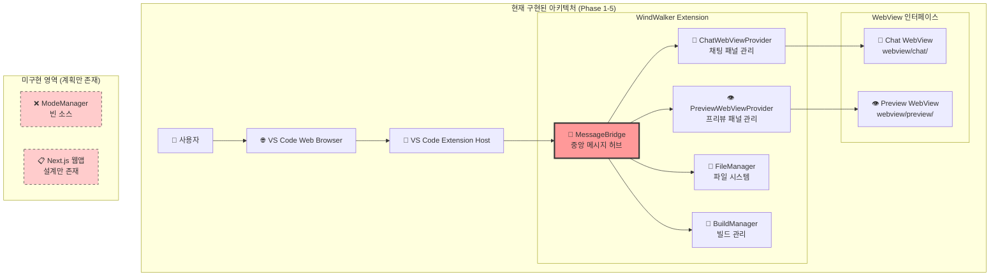
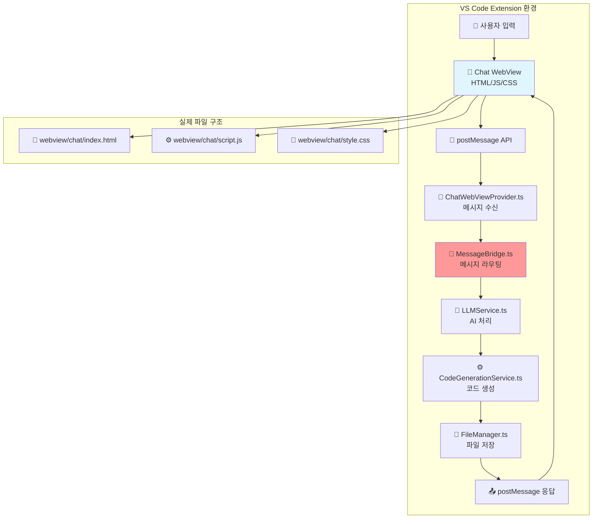
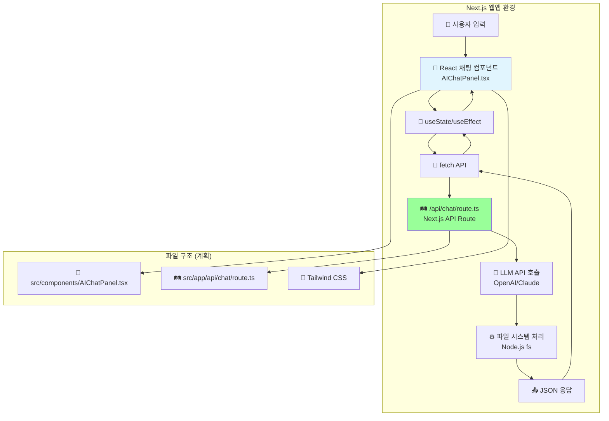
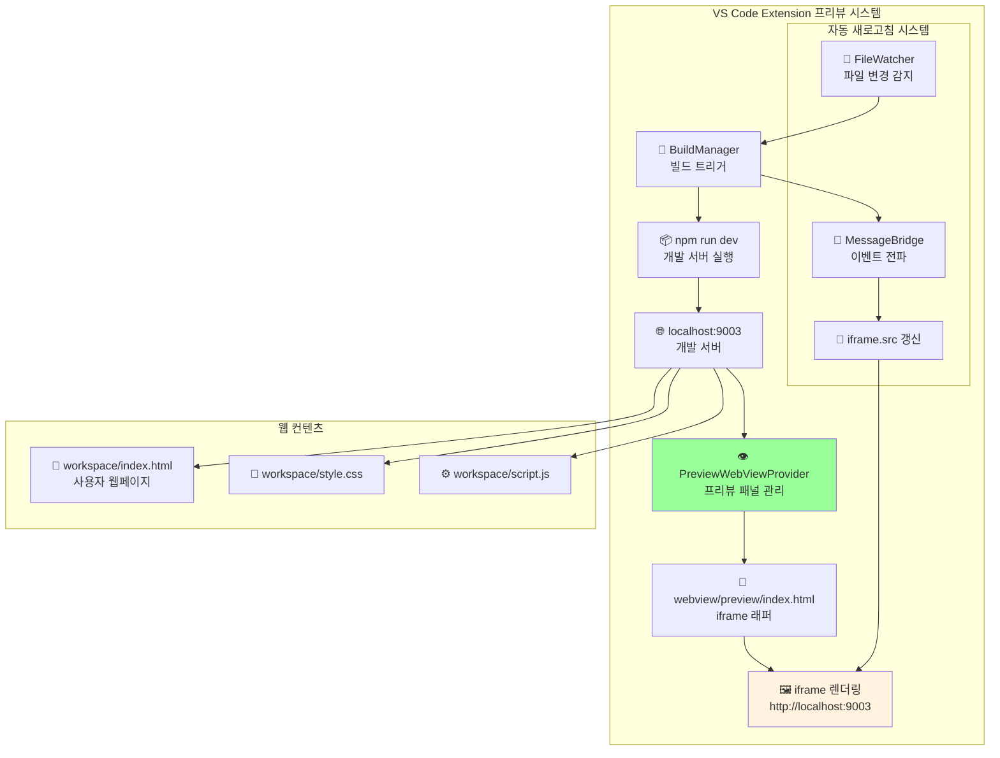
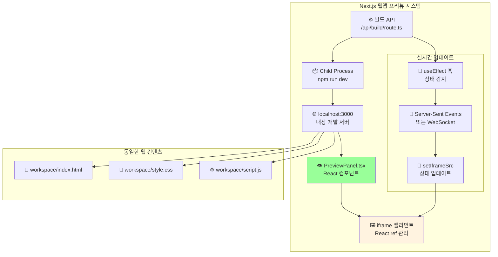
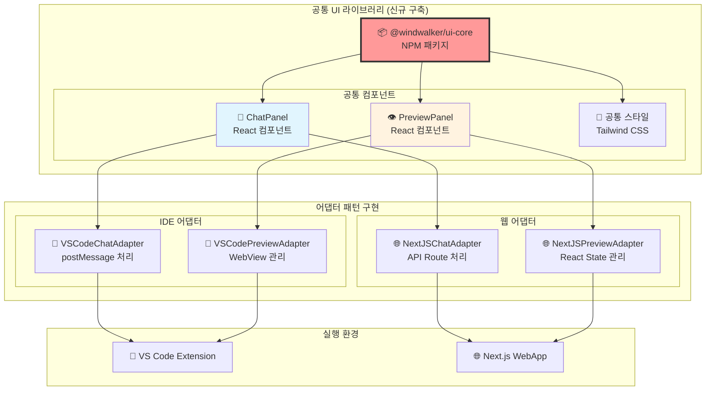

# 05-01. WindWalker 통합 아키텍처: 코드-프로토타이핑 모드 공통화

## 📋 개요

이 문서는 WindWalker IDE의 실제 구현된 아키텍처를 바탕으로, **IDE 모드(VS Code 확장)**와 **웹 프로토타이핑 모드** 간의 채팅 패널과 프리뷰 패널 동작 원리를 상세히 분석하고, 향후 공통화 방안을 제시합니다.

**핵심 질문 해결:**
- 채팅 패널이 IDE와 웹페이지에서 어떻게 다르게 동작하는가?
- 프리뷰 패널의 iframe 렌더링이 두 환경에서 어떻게 처리되는가?
- ModeManager 미사용 현황과 실제 구현 아키텍처의 차이점

---

## 🏗️ 실제 구현된 아키텍처 현황

### 현재 구현 상태 (2025년 기준)
- ✅ **Phase 1-5 완료**: MessageBridge 중심의 VS Code 확장 구현
- ❌ **ModeManager 미사용**: 빈 소스 파일로 실제 모드 전환 기능 없음
- ✅ **단일 모드 운영**: VS Code 확장 환경에서만 동작
- 📋 **웹 모드 계획**: Next.js 기반 프로토타이핑 모드 설계만 존재



---

## 💬 채팅 패널 동작 원리 상세 분석

### 1. IDE 모드에서의 채팅 패널 동작

#### 1.1 기술적 구현 방식


#### 1.2 구체적 데이터 흐름
```javascript
// 1. 사용자가 채팅창에 입력
// webview/chat/script.js
function sendMessage(message) {
    vscode.postMessage({
        type: 'chatRequest',
        message: message,
        timestamp: new Date().toISOString()
    });
}

// 2. VS Code 확장에서 수신 및 처리
// ChatWebViewProvider.ts
webviewView.webview.onDidReceiveMessage(async (data) => {
    await this.messageBridge.processMessage(data, webviewView.webview);
});

// 3. MessageBridge에서 라우팅
// MessageBridge.ts
async processMessage(message, webview) {
    switch(message.type) {
        case 'chatRequest':
            const aiResponse = await this.llmService.generateCode(message.message);
            await this.codeGenService.applyCode(aiResponse);
            webview.postMessage({
                type: 'chatResponse',
                content: '✅ 코드가 생성되었습니다!'
            });
            break;
    }
}
```

### 2. 웹 모드에서의 채팅 패널 동작 (계획)

#### 2.1 Next.js 기반 구현 방식


#### 2.2 웹 모드 데이터 흐름
```javascript
// 1. React 컴포넌트에서 상태 관리
// src/components/AIChatPanel.tsx
const [messages, setMessages] = useState([]);
const [isLoading, setIsLoading] = useState(false);

const handleSendMessage = async (message) => {
    setIsLoading(true);
    const response = await fetch('/api/chat', {
        method: 'POST',
        body: JSON.stringify({ message }),
        headers: { 'Content-Type': 'application/json' }
    });
    const result = await response.json();
    setMessages(prev => [...prev, { sender: 'ai', content: result.reply }]);
    setIsLoading(false);
};

// 2. Next.js API Route에서 처리
// src/app/api/chat/route.ts
export async function POST(request) {
    const { message } = await request.json();
    
    // LLM API 호출
    const aiResponse = await callLLMAPI(message);
    
    // 파일 시스템 조작
    await fs.writeFile(`workspace/${filename}`, aiResponse.code);
    
    return Response.json({ reply: '✅ 코드가 생성되었습니다!' });
}
```

### 3. 채팅 패널의 핵심 차이점

| 구분 | IDE 모드 (VS Code) | 웹 모드 (Next.js) |
|------|-------------------|-------------------|
| **UI 기술** | HTML + Vanilla JS | React + TypeScript |
| **통신 방식** | postMessage API | HTTP fetch API |
| **상태 관리** | 확장 백그라운드에서 관리 | React useState |
| **파일 접근** | VS Code File System API | Node.js fs 모듈 |
| **실시간성** | 양방향 실시간 통신 | 요청-응답 모델 |
| **보안 모델** | VS Code Extension 권한 | 웹 브라우저 제한 |

---

## 👁️ 프리뷰 패널 동작 원리 상세 분석

### 1. IDE 모드에서의 프리뷰 패널 동작

#### 1.1 iframe 기반 렌더링 시스템


#### 1.2 실제 구현 코드
```typescript
// PreviewWebViewProvider.ts - iframe 생성 및 관리
private _getHtmlForWebview(webview: vscode.Webview): string {
    return `
    <!DOCTYPE html>
    <html>
    <head>
        <meta charset="UTF-8">
        <meta name="viewport" content="width=device-width, initial-scale=1.0">
        <title>WindWalker Preview</title>
        <style>
            body, html { margin: 0; padding: 0; height: 100%; }
            iframe { width: 100%; height: 100vh; border: none; }
            .toolbar { background: #f0f0f0; padding: 8px; }
        </style>
    </head>
    <body>
        <div class="toolbar">
            <button onclick="reloadPreview()">🔄 새로고침</button>
            <span id="status">준비 중...</span>
        </div>
        <iframe id="preview-frame" src="about:blank"></iframe>
        
        <script>
            const vscode = acquireVsCodeApi();
            
            // 프리뷰 URL 로드
            function loadPreview(url) {
                const iframe = document.getElementById('preview-frame');
                iframe.src = url;
                document.getElementById('status').textContent = '로딩 중...';
            }
            
            // 수동 새로고침
            function reloadPreview() {
                vscode.postMessage({ type: 'preview:reload' });
            }
            
            // 확장으로부터 메시지 수신
            window.addEventListener('message', event => {
                const message = event.data;
                switch (message.command) {
                    case 'loadUrl':
                        loadPreview(message.url);
                        break;
                    case 'reload':
                        document.getElementById('preview-frame').src += '';
                        break;
                }
            });
            
            // 준비 완료 신호
            vscode.postMessage({ type: 'preview:ready' });
        </script>
    </body>
    </html>`;
}
```

### 2. 웹 모드에서의 프리뷰 패널 동작 (계획)

#### 2.1 React 기반 iframe 관리


#### 2.2 React 기반 구현 계획
```typescript
// src/components/PreviewPanel.tsx
import { useEffect, useRef, useState } from 'react';

export function PreviewPanel() {
    const iframeRef = useRef<HTMLIFrameElement>(null);
    const [previewUrl, setPreviewUrl] = useState('http://localhost:3000');
    const [isLoading, setIsLoading] = useState(true);

    // 빌드 완료 감지 및 자동 새로고침
    useEffect(() => {
        const eventSource = new EventSource('/api/build/status');
        
        eventSource.onmessage = (event) => {
            const data = JSON.parse(event.data);
            if (data.type === 'build:complete') {
                reloadPreview();
            }
        };

        return () => eventSource.close();
    }, []);

    const reloadPreview = () => {
        if (iframeRef.current) {
            setIsLoading(true);
            // iframe 강제 새로고침
            iframeRef.current.src = iframeRef.current.src;
        }
    };

    return (
        <div className="preview-panel">
            <div className="toolbar">
                <button onClick={reloadPreview}>🔄 새로고침</button>
                <span>{isLoading ? '로딩 중...' : '준비 완료'}</span>
            </div>
            <iframe
                ref={iframeRef}
                src={previewUrl}
                onLoad={() => setIsLoading(false)}
                className="w-full h-full border-none"
            />
        </div>
    );
}
```

### 3. 프리뷰 패널의 핵심 차이점

| 구분 | IDE 모드 (VS Code) | 웹 모드 (Next.js) |
|------|-------------------|-------------------|
| **iframe 관리** | Vanilla JS + DOM 조작 | React ref + useState |
| **새로고침 트리거** | postMessage → 확장 처리 | useEffect + API 폴링 |
| **빌드 상태 감지** | FileWatcher + MessageBridge | Server-Sent Events |
| **개발 서버** | 별도 포트 (9003) | 내장 서버 (3000) |
| **실시간 업데이트** | 확장 백그라운드 관리 | React 컴포넌트 상태 |

---

## 🔄 공통화 전략 및 해결 방안

### 1. 현재 문제점
- **중복 코드**: 채팅과 프리뷰 UI 로직이 두 환경에서 별도 구현 필요
- **일관성 부족**: 사용자 경험이 모드별로 다를 가능성
- **유지보수 복잡성**: 기능 추가 시 두 곳을 모두 수정해야 함

### 2. 제안하는 공통화 아키텍처



### 3. 구체적 구현 전략

#### 3.1 공통 UI 컴포넌트 설계
```typescript
// packages/ui-core/src/types.ts
export interface ChatMessage {
    id: string;
    sender: 'user' | 'ai' | 'system';
    content: string;
    timestamp: Date;
}

export interface ChatPanelProps {
    messages: ChatMessage[];
    onSendMessage: (message: string) => Promise<void>;
    isLoading: boolean;
    placeholder?: string;
}

export interface PreviewPanelProps {
    src: string;
    onReload: () => void;
    isLoading: boolean;
    toolbar?: boolean;
}
```

#### 3.2 어댑터 인터페이스 정의
```typescript
// packages/ui-core/src/adapters/types.ts
export interface ChatAdapter {
    sendMessage(message: string): Promise<ChatMessage>;
    onMessageReceived(callback: (message: ChatMessage) => void): void;
}

export interface PreviewAdapter {
    loadUrl(url: string): Promise<void>;
    reload(): Promise<void>;
    onBuildComplete(callback: () => void): void;
}
```

#### 3.3 VS Code 환경 어댑터
```typescript
// extensions/windwalker/src/adapters/VSCodeChatAdapter.ts
export class VSCodeChatAdapter implements ChatAdapter {
    constructor(private webview: vscode.Webview) {}
    
    async sendMessage(message: string): Promise<ChatMessage> {
        return new Promise((resolve) => {
            this.webview.postMessage({
                type: 'chatRequest',
                message: message
            });
            
            // 응답 대기 로직
            this.webview.onDidReceiveMessage((response) => {
                if (response.type === 'chatResponse') {
                    resolve({
                        id: uuid(),
                        sender: 'ai',
                        content: response.content,
                        timestamp: new Date()
                    });
                }
            });
        });
    }
}
```

#### 3.4 Next.js 환경 어댑터
```typescript
// src/adapters/NextJSChatAdapter.ts
export class NextJSChatAdapter implements ChatAdapter {
    async sendMessage(message: string): Promise<ChatMessage> {
        const response = await fetch('/api/chat', {
            method: 'POST',
            body: JSON.stringify({ message }),
            headers: { 'Content-Type': 'application/json' }
        });
        
        const result = await response.json();
        
        return {
            id: uuid(),
            sender: 'ai',
            content: result.reply,
            timestamp: new Date()
        };
    }
}
```

---

## 📋 실행 계획 및 마이그레이션 로드맵

### Phase 1: 공통 UI 라이브러리 구축 (2주)
- [ ] `packages/ui-core` NPM 패키지 생성
- [ ] React 기반 ChatPanel, PreviewPanel 컴포넌트 구현
- [ ] Storybook을 통한 컴포넌트 테스트 환경 구축

### Phase 2: 웹 모드 우선 구현 (3주)
- [ ] Next.js 앱에서 공통 컴포넌트 사용
- [ ] NextJSChatAdapter, NextJSPreviewAdapter 구현
- [ ] 기존 Phase 5 계획 실제 구현

### Phase 3: IDE 모드 마이그레이션 (4주)
- [ ] 기존 WebView HTML을 React 컴포넌트로 전환
- [ ] VSCodeChatAdapter, VSCodePreviewAdapter 구현
- [ ] 기존 기능 호환성 보장

### Phase 4: 기능 통합 및 최적화 (2주)
- [ ] 두 모드 간 기능 일관성 확보
- [ ] 성능 최적화 및 사용자 경험 개선
- [ ] 통합 테스트 및 문서화

---

## 🎯 핵심 학습 포인트

### 1. 채팅 패널 동작 원리
- **IDE**: postMessage를 통한 확장-WebView 통신, 백그라운드 상태 관리
- **웹**: React 상태 관리 + HTTP API, 브라우저내 완결형 처리

### 2. 프리뷰 패널 동작 원리
- **IDE**: VS Code WebView 내 iframe, 확장이 src 속성 제어
- **웹**: React 컴포넌트 내 iframe, useState로 src 속성 제어

### 3. 공통화 핵심 전략
- **UI 로직 분리**: 순수 React 컴포넌트로 UI만 담당
- **어댑터 패턴**: 환경별 통신 및 상태 관리 로직 캡슐화
- **점진적 마이그레이션**: 웹 모드 우선 구현 후 IDE 모드 전환

---

**문서 작성자**: Claude Code Assistant  
**작성일**: 2025-08-05  
**버전**: 1.0 (실제 구현 현황 반영)  
**기반 문서**: docs/05, docs/08, docs/09, 실제 소스코드 분석