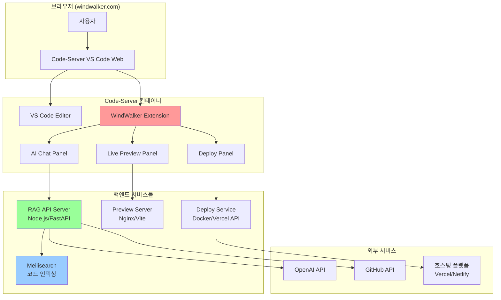

# 00. WindWalker 프로덕트-디자인 헌법

-   **전체 프로젝트의 뼈대 및 맥락 제공:** 이 문서는 WindWalker IDE의 핵심 기능을 웹 기반으로 구현한 클론 프로젝트의 목표, 기능, 기술 스택 등 모든 것을 정의합니다.
-   **모든 개발/설계/코드 작성의 기준점:** 새로운 기능을 추가하거나 기존 코드를 수정할 때, 이 문서를 최우선으로 참고해야 합니다.
-   **LLM 및 개발자가 반드시 준수해야 할 규칙 명시:** 아래 규칙들은 프로젝트의 일관성과 품질을 유지하기 위한 핵심 약속입니다.
    -   **명시적인 의도(주석):** 모든 주요 함수/모듈 상단에는 `[의도] ...`와 `[책임] ...` 형식으로 주석을 작성하여 의도와 책임을 명확히 해야 합니다.
    -   **헌법 준수:** 새로운 기능 개발 시 본 헌법의 설계와 원칙을 반드시 준수해야 합니다.
    -   **불확실성 명시:** 불확실하거나 논의가 필요한 부분은 `[불확실한 부분] ...` 또는 `TODO`, `FIXME` 등으로 명시하고 피드백을 요청해야 합니다.
    -   **설계 철학 준수:** Claude, ChatGPT 등 LLM은 이 문서의 설계 철학(UI/UX 가이드라인, 기술 스택 등)에서 벗어나는 코드를 생성해서는 안 됩니다.
    -   **문서 수정 원칙:** 문서 수정이나 통합 시에는 해당 항목을 업데이트하거나 새로운 항목을 추가하되, **기존 내용을 삭제해야 할 경우에는 반드시 사전에 상의 후 반영합니다.**
-   **보안 원칙:**
    -   API 키 및 민감정보는 반드시 서버사이드에서 관리, 클라이언트 노출 금지
    -   사용자 코드 및 프로젝트 정보는 암호화하여 저장
    -   웹 기반 코드 실행 시 샌드박스 환경 구축 필수
-   **문서 동기화: 살아있는 기록으로서의 두 문서**
    -   **`pdd-windwalker.md` (헌법 & 청사진):** 이 문서는 프로젝트의 '왜'와 '무엇'을 정의합니다. 시스템의 비전, 아키텍처, 핵심 원칙 등은 항상 이 문서를 기준으로 하며, 큰 방향성의 변경이 있을 때만 수정됩니다. 모든 참여자(기획, 개발, 디자인, AI)는 의사결정 시 이 문서를 최우선 기준으로 삼아야 합니다.
    -   **`develop-guide.md` (개발 일지 & 실행 기록):** 이 문서는 프로젝트의 '어떻게'를 시간순으로 기록합니다. 개발 환경 설정, 데이터베이스 스키마 변경, 특정 기능의 구체적인 구현 과정, 문제 해결 기록 등 모든 기술적 세부사항과 이력을 빠짐없이 기록합니다. 이는 프로젝트의 히스토리를 추적하고 신규 참여자가 빠르게 맥락을 파악하는 데 도움을 줍니다.
-   **현재 상태와 목표:** 현재 아키텍처는 단일 사용자를 위한 개발 및 프로토타이핑 환경(Phase 1)입니다. 최종 목표는 각 사용자가 격리된 Docker 컨테이너 환경을 할당받는 멀티테넌트(Multi-tenant) 클라우드 IDE입니다. 모든 설계와 개발은 이 최종 목표를 지향해야 합니다.

-----

목표 :  Replit/Lovable과 동일한 수준의 통합 개발 환경 구축
 

최종 사용자 경험
1. 브라우저에서 windwalker.com 접속
2. "새 프로젝트 만들기" → React/Next.js 템플릿 선택
3. VS Code 인터페이스에서 코딩
4. 우측 AI 채팅: "@Codebase 로그인 기능 추가해줘"
5. 우측 프리뷰: 실시간으로 앱 미리보기
6. "배포하기" 버튼 → 즉시 웹 호스팅

기술 스택 
Code-Server + VS Code Extensions + Docker +  RAG 시스템


# WindWalker 완전한 아키텍처 (Phase 1-3)

## 🏗️ 전체 시스템 구조 (기존)



## 📋 Phase별 상세 구현 가이드

### Phase 1: Code-Server 기본 환경 ✅
**목표**: Monaco Editor → VS Code Web 대체

- Docker Compose로 Code-Server 실행 (최종 목표)
- 현재: Firebase Studio의 Nix 환경에 직접 설치하여 프로토타이핑
- 기본 템플릿 (React, Next.js) 제공
- VS Code 네이티브 환경 구축


#### 1.1 Docker Compose 설정
# docker-compose.yml
version: '3.8'

services:
  # Code-Server (VS Code Web)
  code-server:
    image: codercom/code-server:latest
    container_name: windwalker-ide
    ports:
      - "8080:8080"
    volumes:
      # 워크스페이스 (사용자 프로젝트)
      - ./workspace:/home/coder/workspace
      # VS Code 확장 및 설정
      - ./extensions:/home/coder/.local/share/code-server/extensions
      - ./vscode-config:/home/coder/.local/share/code-server/User
      # Docker 소켓 (컨테이너 내에서 Docker 사용)
      - /var/run/docker.sock:/var/run/docker.sock
    environment:
      - PASSWORD=windwalker2024
      - DOCKER_USER=coder
    user: "1000:1000"
    restart: unless-stopped
    command: >
      --bind-addr 0.0.0.0:8080
      --user-data-dir /home/coder/.local/share/code-server
      --extensions-dir /home/coder/.local/share/code-server/extensions
      --disable-telemetry
      /home/coder/workspace

  # 개발용 프리뷰 서버 (나중에 사용)
  preview-server:
    image: nginx:alpine
    container_name: windwalker-preview  
    ports:
      - "3000:80"
    volumes:
      - ./workspace/dist:/usr/share/nginx/html
    restart: unless-stopped
    depends_on:
      - code-server

  # 향후 RAG API 서버 (Phase 3에서 활성화)
  # api-server:
  #   build: ./api-server
  #   container_name: windwalker-api
  #   ports:
  #     - "3001:3001"
  #   environment:
  #     - NODE_ENV=development
  #   restart: unless-stopped

volumes:
  workspace_data:
  extensions_data:


#### 1.2 설치 및 초기화 스크립트트
#!/bin/bash

# setup.sh - WindWalker Code-Server 환경 구축 스크립트

echo "🚀 WindWalker Code-Server 환경 구축 시작..."

# 1. 프로젝트 구조 생성
echo "📁 프로젝트 구조 생성..."
mkdir -p workspace/{templates,projects}
mkdir -p extensions
mkdir -p vscode-config
mkdir -p logs

# 2. 기본 템플릿 프로젝트 생성
echo "📋 기본 템플릿 생성..."

# React 템플릿
mkdir -p workspace/templates/react-app
cat > workspace/templates/react-app/package.json << 'EOF'
{
  "name": "react-template",
  "version": "1.0.0",
  "private": true,
  "scripts": {
    "dev": "vite",
    "build": "vite build",
    "preview": "vite preview"
  },
  "dependencies": {
    "react": "^18.2.0",
    "react-dom": "^18.2.0"
  },
  "devDependencies": {
    "@types/react": "^18.2.0",
    "@types/react-dom": "^18.2.0",
    "@vitejs/plugin-react": "^4.0.0",
    "vite": "^4.4.0"
  }
}
EOF

cat > workspace/templates/react-app/index.html << 'EOF'
<!DOCTYPE html>
<html lang="en">
<head>
  <meta charset="UTF-8" />
  <meta name="viewport" content="width=device-width, initial-scale=1.0" />
  <title>WindWalker App</title>
</head>
<body>
  <div id="root"></div>
  <script type="module" src="/src/main.jsx"></script>
</body>
</html>
EOF

mkdir -p workspace/templates/react-app/src
cat > workspace/templates/react-app/src/main.jsx << 'EOF'
import React from 'react'
import ReactDOM from 'react-dom/client'
import App from './App.jsx'
import './index.css'

ReactDOM.createRoot(document.getElementById('root')).render(
  <React.StrictMode>
    <App />
  </React.StrictMode>,
)
EOF

cat > workspace/templates/react-app/src/App.jsx << 'EOF'
import { useState } from 'react'
import './App.css'

function App() {
  const [count, setCount] = useState(0)

  return (
    <div className="App">
      <div>
        <h1>WindWalker</h1>
        <div className="card">
          <button onClick={() => setCount((count) => count + 1)}>
            count is {count}
          </button>
          <p>
            Edit <code>src/App.jsx</code> and save to test HMR
          </p>
        </div>
        <p className="read-the-docs">
          Click on the WindWalker logo to learn more
        </p>
      </div>
    </div>
  )
}

export default App
EOF

cat > workspace/templates/react-app/src/App.css << 'EOF'
.App {
  text-align: center;
  padding: 2em;
}

.card {
  padding: 2em;
}

button {
  border-radius: 8px;
  border: 1px solid transparent;
  padding: 0.6em 1.2em;
  font-size: 1em;
  font-weight: 500;
  font-family: inherit;
  background-color: #1a1a1a;
  color: white;
  cursor: pointer;
  transition: border-color 0.25s;
}

button:hover {
  border-color: #646cff;
}
EOF

cat > workspace/templates/react-app/src/index.css << 'EOF'
body {
  margin: 0;
  font-family: -apple-system, BlinkMacSystemFont, 'Segoe UI', 'Roboto', 'Oxygen',
    'Ubuntu', 'Cantarell', 'Fira Sans', 'Droid Sans', 'Helvetica Neue',
    sans-serif;
  -webkit-font-smoothing: antialiased;
  -moz-osx-font-smoothing: grayscale;
}
EOF

cat > workspace/templates/react-app/vite.config.js << 'EOF'
import { defineConfig } from 'vite'
import react from '@vitejs/plugin-react'

export default defineConfig({
  plugins: [react()],
  server: {
    host: '0.0.0.0',
    port: 3000
  }
})
EOF

# Next.js 템플릿
mkdir -p workspace/templates/nextjs-app
cat > workspace/templates/nextjs-app/package.json << 'EOF'
{
  "name": "nextjs-template",
  "version": "0.1.0",
  "private": true,
  "scripts": {
    "dev": "next dev",
    "build": "next build",
    "start": "next start",
    "lint": "next lint"
  },
  "dependencies": {
    "next": "14.0.0",
    "react": "^18.2.0",
    "react-dom": "^18.2.0"
  },
  "devDependencies": {
    "@types/node": "^20.0.0",
    "@types/react": "^18.2.0",
    "@types/react-dom": "^18.2.0",
    "eslint": "^8.0.0",
    "eslint-config-next": "14.0.0",
    "typescript": "^5.0.0"
  }
}
EOF

# 3. VS Code 기본 설정
echo "⚙️ VS Code 설정..."
cat > vscode-config/settings.json << 'EOF'
{
  "workbench.colorTheme": "Dark+ (default dark)",
  "editor.fontSize": 14,
  "editor.tabSize": 2,
  "editor.insertSpaces": true,
  "editor.formatOnSave": true,
  "files.autoSave": "afterDelay",
  "files.autoSaveDelay": 1000,
  "terminal.integrated.shell.linux": "/bin/bash",
  "extensions.autoUpdate": false,
  "workbench.startupEditor": "welcomePage"
}
EOF

# 4. 기본 확장 목록 생성
cat > extensions/install-extensions.sh << 'EOF'
#!/bin/bash
# VS Code 확장 자동 설치 스크립트

echo "📦 기본 확장 설치 중..."

# 필수 확장들
extensions=(
  "ms-vscode.vscode-typescript-next"
  "bradlc.vscode-tailwindcss" 
  "esbenp.prettier-vscode"
  "ms-vscode.vscode-json"
  "ritwickdey.liveserver"
  "formulahendry.auto-rename-tag"
  "christian-kohler.path-intellisense"
  "ms-vscode.vscode-css-peek"
)

for ext in "${extensions[@]}"; do
  echo "Installing $ext..."
  code-server --install-extension "$ext" --force
done

echo "✅ 확장 설치 완료!"
EOF

chmod +x extensions/install-extensions.sh


# 5. 헬퍼 스크립트들
cat > start.sh << 'EOF'
#!/bin/bash
echo "🚀 WindWalker 시작 중..."
docker-compose up -d
echo "✅ WindWalker가 시작되었습니다!"
echo "🌐 IDE 접속: http://localhost:8080 (패스워드: windwalker2024)"
echo "🔍 프리뷰: http://localhost:3000"
echo ""
echo "📋 유용한 명령어:"
echo "  docker-compose logs -f code-server  # 로그 확인"
echo "  docker-compose down                 # 서비스 종료"
echo "  ./stop.sh                           # 빠른 종료"
EOF

cat > stop.sh << 'EOF'
#!/bin/bash
echo "🛑 WindWalker 종료 중..."
docker-compose down
echo "✅ WindWalker가 종료되었습니다."
EOF

chmod +x start.sh stop.sh

# 6. 권한 설정
echo "🔒 권한 설정..."
sudo chown -R 1000:1000 workspace extensions vscode-config
chmod -R 755 workspace extensions vscode-config

echo ""
echo "🎉 WindWalker Code-Server 환경 구축 완료!"
echo ""
echo "다음 단계:"
echo "1. docker-compose up -d        # 서비스 시작"
echo "2. http://localhost:8080 접속  # IDE 사용 (패스워드: windwalker2024)"
echo "3. 또는 ./start.sh 실행        # 간편 시작"
echo ""
echo "📁 프로젝트 구조:"
echo "├── workspace/          # 사용자 프로젝트 공간"
echo "│   ├── templates/      # 프로젝트 템플릿"
echo "│   └── projects/       # 사용자 프로젝트"
echo "├── extensions/         # VS Code 확장"
echo "└── vscode-config/      # VS Code 설정"


#### 1.3 Phase 1 완료 후 프로젝트 구성

# WindWalker Phase 1: 프로젝트 구조

```
windwalker/
├── docker-compose.yml               # 🆕 메인 서비스 구성
├── setup.sh                        # 🆕 자동 설치 스크립트  
├── start.sh                        # 🆕 빠른 시작
├── stop.sh                         # 🆕 빠른 종료
│
├── workspace/                       # 🆕 사용자 작업 공간
│   ├── templates/                   # 프로젝트 템플릿
│   │   ├── react-app/
│   │   │   ├── package.json
│   │   │   ├── src/App.jsx
│   │   │   └── vite.config.js
│   │   └── nextjs-app/
│   │       ├── package.json
│   │       └── pages/
│   └── projects/                    # 사용자 프로젝트 저장소
│
├── extensions/                      # 🆕 VS Code 확장
│   └── install-extensions.sh
│
├── vscode-config/                   # 🆕 VS Code 설정
│   └── settings.json
│
└── logs/                           # 🆕 로그 파일
```

### Phase 2: WindWalker 통합 아키텍처: 코드/프로토타이핑 모드 공통화

#### 1. 개요

이 문서는 WindWalker IDE의 두 가지 핵심 모드인 **코드 모드(VS Code 확장)**와 **프로토타이PING 모드(웹)**에서 AI 채팅 패널과 프리뷰 패널의 UI를 어떻게 효율적으로 재사용할 것인지에 대한 아키텍처 설계를 정의합니다.

**핵심 목표:** UI 로직은 한 번만 작성하고, 각 모드의 특성에 맞는 데이터 및 로직(Controller)만 별도로 구현하여 코드 재사용성을 극대화하고 일관된 사용자 경험을 제공합니다.

---

#### 2. 통합 아키텍처 구조

두 모드는 **공통 UI 라이브러리**를 공유하며, 각 모드는 자신의 환경에 맞는 '어댑터(Adapter)'를 통해 UI와 상호작용합니다.

```mermaid
graph TD
    subgraph "사용자 인터페이스 (공통 UI 라이브러리 - React)"
        A[<b>AI 채팅 패널 UI</b><br/>(입력창, 메시지 목록 등)]
        B[<b>프리뷰 패널 UI</b><br/>(Iframe 래퍼, 디바이스 컨트롤 등)]
    end

    subgraph "모드별 실행 환경"
        subgraph "<b>코드 모드 (VS Code 확장)</b>"
            C1[VS Code 확장 어댑터] --> A
            C2[VS Code 확장 어댑터] --> B
            C1 -- VS Code API --> D[파일 시스템, 터미널, RAG API]
        end
        subgraph "<b>프로토타이핑 모드 (Next.js 웹앱)</b>"
            E1[Next.js 웹 어댑터] --> A
            E2[Next.js 웹 어댑터] --> B
            E1 -- Next.js API Routes --> D
        end
    end

    D -- 데이터 흐름 --> C1
    D -- 데이터 흐름 --> E1

    style A fill:#D6EAF8
    style B fill:#D6EAF8
```

-   **공통 UI 라이브러리:** 순수한 React 컴포넌트로 구성되며, 상태나 비즈니스 로직을 갖지 않고 오직 `props`를 통해 데이터를 받아 UI를 렌더링하고, 콜백 함수(`onSendMessage` 등)를 통해 사용자 이벤트를 상위로 전달하는 역할만 합니다.
-   **어댑터(Adapter):** 각 모드의 "두뇌"에 해당합니다.
    -   **VS Code 확장 어댑터:** VS Code의 API를 사용하여 파일 시스템에 접근하거나, 터미널 명령을 실행하고, 그 결과를 공통 UI 컴포넌트에 `props`로 전달합니다.
    -   **Next.js 웹 어댑터:** Next.js의 API 라우트를 호출하여 서버와 통신하고, `useState`, `useEffect` 같은 React 훅을 사용해 상태를 관리하며 UI 컴포넌트에 `props`를 전달합니다.

---

#### 3. 공통 UI 라이브러리 프로젝트 구조 (Monorepo)

프로젝트 루트에 `packages` 디렉토리를 생성하여 모노레포 구조로 전환하는 것을 제안합니다.

```
windwalker/
├── packages/
│   └── ui-core/                  # 🔵 공통 UI 라이브러리
│       ├── package.json
│       ├── src/
│       │   ├── components/
│       │   │   ├── AIChatPanel.tsx
│       │   │   └── PreviewPanel.tsx
│       │   └── index.ts          # 컴포넌트 export
│       └── tsconfig.json
│
├── src/                          # Next.js 앱 (프로토타이핑 모드)
│   ├── app/
│   └── components/
│       └── PrototypingView.tsx     # 웹 어댑터 역할
│
├── extensions/                   # VS Code 확장 (코드 모드)
│   ├── windwalker-ext/
│   │   ├── package.json
│   │   └── src/
│   │       └── AIChatViewProvider.ts # 확장 어댑터 역할
│   └── ...
│
└── package.json                  # 루트 package.json (workspaces 설정)
```

-   `packages/ui-core`: AI 채팅, 프리뷰 패널 등 재사용 가능한 모든 UI 컴포넌트가 위치합니다.
-   Next.js 앱과 VS Code 확장은 모두 `package.json`을 통해 `ui-core` 패키지를 의존성으로 추가합니다.

---

#### 4. 핵심 구현 코드 예시

##### 4.1. 공통 UI 컴포넌트 (`packages/ui-core/src/components/AIChatPanel.tsx`)

```tsx
// [의도] AI 채팅 UI를 렌더링하고 사용자 입력을 상위로 전달합니다.
// [책임] 상태 관리나 API 호출을 하지 않고, 순수하게 UI 표현에만 집중합니다.

import React from 'react';

// 메시지 타입 정의
export interface ChatMessage {
  sender: 'user' | 'ai' | 'system';
  content: string;
}

// 컴포넌트 Props 정의
export interface AIChatPanelProps {
  messages: ChatMessage[];
  onSendMessage: (message: string) => void;
  isLoading: boolean;
}

export const AIChatPanel: React.FC<AIChatPanelProps> = ({ messages, onSendMessage, isLoading }) => {
  const [inputValue, setInputValue] = React.useState('');

  const handleSend = () => {
    if (inputValue.trim()) {
      onSendMessage(inputValue);
      setInputValue('');
    }
  };

  return (
    <div>
      <div className="message-list">
        {messages.map((msg, index) => (
          <div key={index} className={`message ${msg.sender}`}>
            {msg.content}
          </div>
        ))}
        {isLoading && <div className="message system">AI가 생각 중...</div>}
      </div>
      <div className="input-area">
        <input
          type="text"
          value={inputValue}
          onChange={(e) => setInputValue(e.target.value)}
          onKeyDown={(e) => e.key === 'Enter' && handleSend()}
          disabled={isLoading}
        />
        <button onClick={handleSend} disabled={isLoading}>전송</button>
      </div>
    </div>
  );
};
```

##### 4.2. 프로토타이핑 모드 어댑터 (`src/components/PrototypingView.tsx`)

```tsx
// [의도] 웹 환경에서 AI 채팅 패널을 사용합니다.
// [책임] React의 상태(useState)와 API(fetch)를 사용하여 비즈니스 로직을 처리합니다.

import { AIChatPanel, ChatMessage } from 'ui-core/components/AIChatPanel';
import { useState, useEffect } from 'react';

export function PrototypingView() {
  const [messages, setMessages] = useState<ChatMessage[]>([]);
  const [isLoading, setIsLoading] = useState(false);

  const handleSendMessage = async (message: string) => {
    setIsLoading(true);
    const newMessages = [...messages, { sender: 'user', content: message }];
    setMessages(newMessages);

    // Next.js API Route 호출
    const response = await fetch('/api/chat', {
      method: 'POST',
      body: JSON.stringify({ message }),
    });
    const result = await response.json();

    setMessages([...newMessages, { sender: 'ai', content: result.reply }]);
    setIsLoading(false);
  };

  return (
    <AIChatPanel
      messages={messages}
      onSendMessage={handleSendMessage}
      isLoading={isLoading}
    />
  );
}
```

##### 4.3. 코드 모드 어댑터 (VS Code 확장 - `AIChatViewProvider.ts` 일부)

```typescript
// [의도] VS Code 확장 환경에서 AI 채팅 패널을 사용합니다.
// [책임] VS Code API와 통신하여 비즈니스 로직을 처리합니다.

import * as vscode from 'vscode';
// React 컴포넌트를 웹뷰 HTML로 변환하는 로직 필요 (예: esbuild)
import { renderToString } from 'react-dom/server';
import { AIChatPanel } from 'ui-core/components/AIChatPanel';

export class AIChatViewProvider implements vscode.WebviewViewProvider {
  resolveWebviewView(webviewView: vscode.WebviewView) {
    // ... 웹뷰 설정 ...

    // 메시지 핸들링
    webviewView.webview.onDidReceiveMessage(async (message) => {
      if (message.command === 'sendMessage') {
        // VS Code의 파일 시스템 접근 또는 RAG API 호출
        const reply = await this.callRagApi(message.text);

        // UI 업데이트 메시지 전송
        webviewView.webview.postMessage({ command: 'aiReply', text: reply });
      }
    });

    // 초기 UI 렌더링
    // 실제 구현에서는 상태를 관리하고 postMessage로 업데이트해야 함
    const reactComponentHtml = renderToString(
      <AIChatPanel messages={[]} onSendMessage={() => {}} isLoading={false} />
    );
    webviewView.webview.html = `... ${reactComponentHtml} ...`;
  }

  private async callRagApi(text: string): Promise<string> {
    // ...
    return "코드베이스를 분석한 AI의 답변입니다.";
  }
}
```

---

#### 5. UI 레이아웃 전환

-   **프로토타이핑 모드:** `src/app/page.tsx`가 메인 레이아웃을 담당합니다. 좌측에 AI 채팅 패널, 우측에 프리뷰 패널을 배치하는 그리드 시스템을 구현합니다.
-   **코드 모드:** VS Code의 "View Container"와 "WebviewView" API를 사용합니다. `package.json`의 `contributes` 섹션에 `views`를 정의하여, VS Code의 사이드바에 'WindWalker'라는 이름의 뷰 컨테이너를 만들고, 그 안에 AI 채팅과 프리뷰 웹뷰를 등록합니다.

---

#### 6. 구현 일정 (제안)

-   **Week 1: 아키텍처 설정**
    -   모노레포 구조 설정 (`packages/ui-core` 생성)
    -   `ui-core`에 `AIChatPanel` 기본 컴포넌트 구현
    -   Next.js 앱에서 `AIChatPanel`을 임시 데이터로 렌더링 (프로토타이핑 모드)
-   **Week 2-3: 프로토타이핑 모드 기능 구현**
    -   Next.js API 라우트 (`/api/chat`) 구현
    -   `PrototypingView.tsx`에서 상태 관리 및 API 연동 완료
    -   `PreviewPanel` 컴포넌트 및 `iframe` 연동 구현
-   **Week 4: 코드 모드 기능 구현**
    -   VS Code 확장 프로젝트(`windwalker-ext`) 설정
    -   `AIChatViewProvider` 구현 및 웹뷰에 `AIChatPanel` 렌더링
    -   `postMessage`를 통한 웹뷰와 확장 간의 통신 구현


### Phase 3: WebView 통신 아키텍처 완성 (현재 진행중)
**목표**: MessageBridge 기반 VS Code Extension과 WebView 간 완전한 통신 구조 구축
**상태**: ✅ Phase 1-2 완료, Phase 3-4 진행중

### Phase 4: 기본 AI 서비스 연동 (간소화)
**목표**: 직접 LLM API 연동을 통한 기본 AI 채팅 기능 구현
**상태**: 🔄 계획됨

### Phase 5: 프로토타이핑 모드 구현
**목표**: Next.js 웹앱에서 AI 채팅패널 + 프리뷰 구현
**상태**: 🔄 계획됨

### Phase 6: RAG 시스템 통합 (향후 구현 예정)
**목표**: Meilisearch + 완전한 코드베이스 이해 AI
**상태**: 📋 구현 예정 (인증 시스템 이후)

#### 3.1 Meilisearch 서버 구축
```yaml
# docker-compose.yml에 추가
services:
  meilisearch:
    image: getmeili/meilisearch:v1.5
    container_name: windwalker-search
    ports:
      - "7700:7700"
    environment:
      - MEILI_ENV=development
      - MEILI_MASTER_KEY=windwalker-search-key
    volumes:
      - search_data:/meili_data
    restart: unless-stopped

volumes:
  search_data:
```

#### 3.2 RAG API 서버 구현
```typescript
// api-server/src/app.ts
import express from 'express';
import { MeiliSearch } from 'meilisearch';
import OpenAI from 'openai';

const app = express();
const client = new MeiliSearch({
  host: 'http://meilisearch:7700',
  apiKey: 'windwalker-search-key'
});

// 코드 인덱싱 엔드포인트
app.post('/api/index-codebase', async (req, res) => {
  const { projectPath } = req.body;
  
  // 1. 프로젝트 파일 스캔
  const files = await scanProjectFiles(projectPath);
  
  // 2. AST 파싱 및 심볼 추출
  const symbols = await extractSymbols(files);
  
  // 3. Meilisearch에 인덱싱
  const index = client.index('codebase');
  await index.addDocuments(symbols);
  
  res.json({ indexed: symbols.length });
});

// RAG 검색 엔드포인트  
app.post('/api/search-codebase', async (req, res) => {
  const { query } = req.body;
  
  // 1. Meilisearch에서 관련 코드 검색
  const index = client.index('codebase');
  const searchResults = await index.search(query, {
    limit: 10,
    attributesToHighlight: ['content', 'symbol_name']
  });
  
  // 2. LLM에 컨텍스트 제공
  const context = searchResults.hits.map(hit => hit.content).join('\n\n');
  
  const completion = await openai.chat.completions.create({
    model: "gpt-4",
    messages: [
      {
        role: "system", 
        content: `You are an expert developer. Use this codebase context to answer questions:\n\n${context}`
      },
      { role: "user", content: query }
    ]
  });
  
  res.json({
    answer: completion.choices[0].message.content,
    sources: searchResults.hits
  });
});
```

#### 3.3 실시간 코드 인덱싱
```typescript
// api-server/src/services/CodeIndexer.ts
export class CodeIndexer {
  private watcher: chokidar.FSWatcher;
  
  startWatching(projectPath: string) {
    this.watcher = chokidar.watch(projectPath, {
      ignored: /node_modules|\.git/
    });
    
    this.watcher.on('change', async (filePath) => {
      await this.indexFile(filePath);
    });
  }
  
  private async indexFile(filePath: string) {
    // 1. 파일 내용 읽기
    const content = await fs.readFile(filePath, 'utf-8');
    
    // 2. AST 파싱 (tree-sitter 사용)
    const parser = new Parser();
    parser.setLanguage(getLanguage(filePath));
    const tree = parser.parse(content);
    
    // 3. 심볼 추출
    const symbols = extractSymbolsFromAST(tree, filePath, content);
    
    // 4. Meilisearch 업데이트
    const index = this.client.index('codebase');
    await index.addDocuments(symbols);
  }
}
```

## 🎯 최종 사용자 경험 구현

### 1. 프로젝트 생성 플로우
```typescript
// 확장에서 "새 프로젝트" 명령어
vscode.commands.registerCommand('windwalker.createProject', async () => {
  const template = await vscode.window.showQuickPick([
    'React + Vite',
    'Next.js',
    'Vue.js', 
    'Svelte'
  ]);
  
  // 템플릿 복사 및 초기 인덱싱
  await createProjectFromTemplate(template);
  await indexNewProject();
});
```

### 2. @Codebase 명령어 구현
```typescript
// AI 채팅에서 @Codebase 감지
private async handleChatMessage(text: string) {
  if (text.startsWith('@Codebase')) {
    const query = text.replace('@Codebase', '').trim();
    
    // RAG API 서버 호출
    const response = await fetch('http://localhost:3001/api/search-codebase', {
      method: 'POST',
      headers: { 'Content-Type': 'application/json' },
      body: JSON.stringify({ query })
    });
    
    const result = await response.json();
    
    // 소스 코드와 함께 답변 표시
    this.displayAnswer(result.answer, result.sources);
  }
}
```

### 3. 원클릭 배포
```typescript
// Deploy 패널에서 배포 버튼
vscode.commands.registerCommand('windwalker.deploy', async () => {
  // 1. 프로젝트 빌드
  await vscode.tasks.executeTask(buildTask);
  
  // 2. Vercel/Netlify API로 배포
  const deployUrl = await deployToVercel();
  
  // 3. 결과 표시
  vscode.window.showInformationMessage(`🚀 배포 완료: ${deployUrl}`);
});
```

## 📦 최종 docker-compose.yml
```yaml
version: '3.8'
services:
  code-server:
    image: codercom/code-server:latest
    # ... 기존 설정
    
  meilisearch:
    image: getmeili/meilisearch:v1.5
    ports: ["7700:7700"]
    
  rag-api:
    build: ./api-server
    ports: ["3001:3001"]
    depends_on: [meilisearch]
    
  preview-server:
    image: nginx:alpine
    ports: ["3000:80"]
```

이렇게 구축하면 Replit/Lovable과 동일한 수준의 통합 개발 환경이 완성됩니다!

---

## 📅 개발 로드맵

### Phase 1: 핵심 기능 구현 (완료)
- [x] Code-Server 기반 VS Code 웹 환경
- [x] WindWalker Extension 기본 아키텍처  
- [x] AI 채팅 및 프리뷰 패널 구현
- [x] MessageBridge 통신 시스템

### Phase 2: AI 통합 (진행중)
- [x] Gemini API 연동
- [x] 코드 생성 및 분석 서비스
- [ ] @Codebase 명령어 구현
- [ ] RAG 시스템 통합

### Phase 3: 고급 기능 (계획중)
- [ ] 멀티테넌트 Docker 컨테이너 환경
- [ ] 원클릭 배포 시스템 (Vercel/Netlify)
- [ ] 실시간 협업 기능
- [ ] 프로젝트 템플릿 마켓플레이스

### Phase 4: 확장성 개선 (미래)
- [ ] 플러그인 생태계 구축
- [ ] 다양한 언어/프레임워크 지원 확대
- [ ] 기업용 프라이빗 클라우드 버전
- [ ] 모바일 앱 지원

### 🧪 테스트 자동화 시스템 (중요도: 낮음)

WindWalker 시범 운영 후 검토 예정인 확장 기능:

#### 테스트 리페어 루프 모듈화
- **목적**: 현재 WindWalker용으로 개발된 테스트 자동화 시스템을 범용 모듈로 전환
- **특징**: Claude Code + Playwright + MCP 기반 지능형 테스트 자동화
- **핵심 기능**:
  - 3가지 실행 모드 (반자동/자동/대화형)
  - Diff 기반 수정 제안 시스템
  - 자동 문서화 및 GitHub 연동
  - 브라우저 기반 테스트 선택 UI

#### 예상 확장 범위
- React/Vue.js 프로젝트 지원
- Jest/Cypress 등 다양한 테스트 프레임워크 지원  
- NPM 패키지로 배포 (`@windwalker/test-repair-loop`)
- 프로젝트 템플릿 형태 제공

#### 개발 타임라인
- **시범 운영**: WindWalker 프로젝트에서 안정성 검증
- **모듈화 작업**: 프레임워크 독립적 설계로 리팩토링
- **베타 릴리즈**: 제한된 프로젝트에서 테스트
- **정식 릴리즈**: 오픈소스 커뮤니티 공개

*이 기능은 WindWalker 핵심 기능 완성 후 별도 프로젝트로 진행될 예정입니다.*
