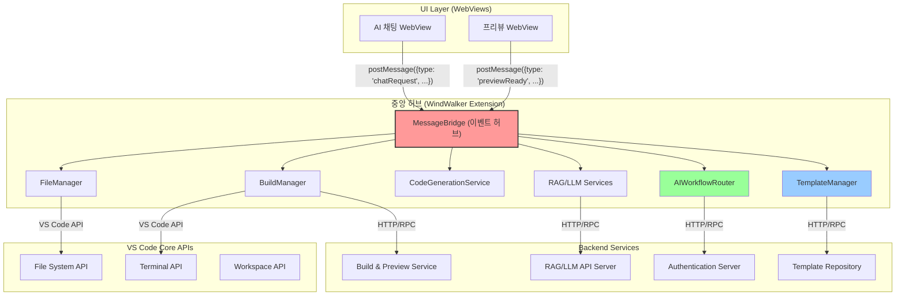

# 00. WindWalker 프로덕트-디자인 헌법

-   **전체 프로젝트의 뼈대 및 맥락 제공:** 이 문서는 WindWalker IDE의 핵심 기능을 웹 기반으로 구현한 클론 프로젝트의 목표, 기능, 기술 스택 등 모든 것을 정의합니다.
-   **모든 개발/설계/코드 작성의 기준점:** 새로운 기능을 추가하거나 기존 코드를 수정할 때, 이 문서를 최우선으로 참고해야 합니다.
-   **LLM 및 개발자가 반드시 준수해야 할 규칙 명시:** 아래 규칙들은 프로젝트의 일관성과 품질을 유지하기 위한 핵심 약속입니다.
    -   **명시적인 의도(주석):** 모든 주요 함수/모듈 상단에는 `[의도] ...`와 `[책임] ...` 형식으로 주석을 작성하여 의도와 책임을 명확히 해야 합니다.
    -   **헌법 준수:** 새로운 기능 개발 시 본 헌법의 설계와 원칙을 반드시 준수해야 합니다.
    -   **불확실성 명시:** 불확실하거나 논의가 필요한 부분은 `[불확실한 부분] ...` 또는 `TODO`, `FIXME` 등으로 명시하고 피드백을 요청해야 합니다.
    -   **설계 철학 준수:** Claude, ChatGPT 등 LLM은 이 문서의 설계 철학(UI/UX 가이드라인, 기술 스택 등)에서 벗어나는 코드를 생성해서는 안 됩니다.
    -   **문서 수정 원칙:** 문서 수정이나 통합 시에는 해당 항목을 업데이트하거나 새로운 항목을 추가하되, **기존 내용을 삭제해야 할 경우에는 반드시 사전에 상의 후 반영합니다.**
-   **보안 원칙:**
    -   API 키 및 민감정보는 반드시 서버사이드에서 관리, 클라이언트 노출 금지
    -   사용자 코드 및 프로젝트 정보는 암호화하여 저장
    -   웹 기반 코드 실행 시 샌드박스 환경 구축 필수
-   **문서 동기화: 살아있는 기록으로서의 두 문서**
    -   **`pdd-windwalker.md` (헌법 & 청사진):** 이 문서는 프로젝트의 '왜'와 '무엇'을 정의합니다. 시스템의 비전, 아키텍처, 핵심 원칙 등은 항상 이 문서를 기준으로 하며, 큰 방향성의 변경이 있을 때만 수정됩니다. 모든 참여자(기획, 개발, 디자인, AI)는 의사결정 시 이 문서를 최우선 기준으로 삼아야 합니다.
    -   **`develop-guide.md` (개발 일지 & 실행 기록):** 이 문서는 프로젝트의 '어떻게'를 시간순으로 기록합니다. 개발 환경 설정, 데이터베이스 스키마 변경, 특정 기능의 구체적인 구현 과정, 문제 해결 기록 등 모든 기술적 세부사항과 이력을 빠짐없이 기록합니다. 이는 프로젝트의 히스토리를 추적하고 신규 참여자가 빠르게 맥락을 파악하는 데 도움을 줍니다.
-   **현재 상태와 목표:** 현재 아키텍처는 단일 사용자를 위한 개발 및 프로토타이핑 환경(Phase 1)입니다. 최종 목표는 각 사용자가 격리된 Docker 컨테이너 환경을 할당받는 멀티테넌트(Multi-tenant) 클라우드 IDE입니다. 모든 설계와 개발은 이 최종 목표를 지향해야 합니다.

-----

목표 :  Replit/Lovable과 동일한 수준의 통합 개발 환경 구축
 

최종 사용자 경험
1. 브라우저에서 windwalker.com 접속
2. "새 프로젝트 만들기" → React/Next.js 템플릿 선택
3. VS Code 인터페이스에서 코딩
4. 우측 AI 채팅: "@Codebase 로그인 기능 추가해줘"
5. 우측 프리뷰: 실시간으로 앱 미리보기
6. "배포하기" 버튼 → 즉시 웹 호스팅

기술 스택 
Code-Server + VS Code Extensions + Docker +  RAG 시스템

# WindWalker 완전한 아키텍처 (Phase 1-3)

## 🏗️ 중앙 허브(Central Hub) 아키텍처

WindWalker의 핵심 아키텍처는 **VS Code 확장을 모든 기능의 중앙 허브**로 하는 설계입니다. UI(WebView)는 사용자 요청을 전달하고, 실제 작업은 모두 중앙 허브가 수행합니다.

## 📋 Phase별 구현 세부 계획 (08 문서 기반)

### **Phase 1: 기본 통신 아키텍처 확립** ✅
- **기간**: 3일 (완료)
- **목표**: 확장과 채팅 웹뷰 간 기본 메시지 통신
- **핵심 작업**:
  - `extension.ts`: ChatWebViewProvider 초기화 및 등록
  - `ChatWebViewProvider.ts`: webview/chat/index.html 로드
  - `webview/chat/script.js`: 준비 완료 메시지 전송
  - **핵심 통신 루프 검증** 완료

### **Phase 2: 파일 시스템 연동** ✅
- **기간**: 2일 (완료)
- **목표**: 웹뷰 요청으로 실제 워크스페이스 파일 생성/수정
- **핵심 작업**:
  - ✅ FileManager 기능: windwalker-phase1/extension.js에 통합 구현
  - ✅ 파일 생성/읽기/수정 명령어 처리 (한국어/영어 지원)
  - ✅ VS Code File System API 완전 연동
  - ✅ 워크스페이스 검증 및 오류 처리 시스템
  - ✅ 10가지 테스트 시나리오 검증 완료

### **Phase 3: 빌드 및 프리뷰 연동** 📋
- **기간**: 3일 (계획)
- **목표**: 파일 변경 → 자동 빌드 → 프리뷰 업데이트
- **핵심 작업**:
  - `BuildManager.ts`: npm 빌드/개발 서버 실행
  - `PreviewWebViewProvider.ts`: localhost iframe 로드
  - 전체 파이프라인 연동

### **Phase 4: AI 서비스 연동** 📋
- **기간**: 2일 (계획)
- **목표**: 간소화된 LLM API 연동 AI 채팅
- **핵심 작업**:
  - `LLMService.ts`: 직접 LLM API 호출
  - `CodeGenerationService.ts`: LLM 응답 → 파일 적용
  - **E2E 플로우**: 채팅 → AI → 코드 → 빌드 → 프리뷰

### **Phase 5: 프로토타이핑 모드 구현** 📋
- **기간**: 3일 (계획)
- **목표**: Next.js 웹앱에서 AI 채팅+프리뷰 구현
- **핵심 작업**:
  - `PrototypingView.tsx`: 메인 레이아웃 (좌측 채팅, 우측 프리뷰)
  - `src/app/api/chat/route.ts`: AI API 연동
  - 웹 환경 전체 플로우 검증

## 📅 개발 로드맵

###  1: 핵심 인프라 구현 (완료 ✅)
- [x] Code-Server 기반 VS Code 웹 환경 (Docker 컨테이너화)
- [x] WindWalker Extension 기본 아키텍처  
- [x] AI 채팅 및 프리뷰 패널 구현
- [x] MessageBridge 통신 시스템
- [x] **하이브리드 클라우드 환경 구축** (2025-08-02 완료)
- [x] **테스트 자동화 시스템 활성화** (Playwright 기반)

###  2: AI 대화식 웹사이트 빌더 (신규 추가 - 11, 12 문서 기반)
- [ ] **AI Workflow Router**: 워크플로우 타입별 라우팅 시스템
- [ ] **Template Manager**: 템플릿 카테고리 관리 및 추천 시스템
- [ ] **AI Context Manager**: 대화 컨텍스트 및 상태 관리
- [ ] **하이브리드 워크플로우**: 템플릿 선택 + AI 자유 커스터마이징
- [ ] **대화식 빌더 UI**: 단계별 가이드 및 실시간 피드백

###  3: AI 통합 및 서비스 확장 (진행중 🔄)
- [x] Gemini API 연동
- [x] 코드 생성 및 분석 서비스
- [ ] @Codebase 명령어 구현
- [ ] RAG 시스템 통합 (Meilisearch + PostgreSQL)
- [ ] 사용자 인증 시스템 (GitHub OAuth)
- [ ] 파일 관리 및 저장 시스템

### 4: 운영 및 확장성 (계획중 📋)
- [ ] 멀티테넌트 Docker 컨테이너 환경
- [ ] 원클릭 배포 시스템 (Vercel/Netlify)
- [ ] 실시간 협업 기능 (WebSocket)
- [ ] 프로젝트 템플릿 마켓플레이스
- [ ] 모니터링 및 로깅 시스템 (Prometheus + Grafana)

###  5: 상용화 및 생태계 (미래 🚀)
- [ ] 플러그인 생태계 구축
- [ ] 다양한 언어/프레임워크 지원 확대
- [ ] 기업용 프라이빗 클라우드 버전
- [ ] 모바일 앱 지원
- [ ] AI 코드 리뷰 및 최적화 기능

###  6: 고급 AI 기능 및 자동화 (확장)
- [ ] **Intelligent Code Analysis**: 코드 품질 자동 분석 및 개선 제안
- [ ] **Auto-Deployment Pipeline**: CI/CD 자동 구성 및 배포
- [ ] **Performance Optimization**: 자동 성능 최적화 및 모니터링
- [ ] **Multi-Framework Support**: React, Vue, Angular, Svelte 등 지원
- [ ] **Enterprise Features**: 팀 협업, 권한 관리, 감사 로그

###  7: 플랫폼 확장 및 생태계 (장기)
- [ ] **Third-party Integrations**: Figma, Adobe XD, Sketch 연동
- [ ] **API Marketplace**: 외부 서비스 API 자동 통합
- [ ] **Component Library**: 재사용 가능한 컴포넌트 마켓플레이스  
- [ ] **White-label Solution**: 기업 맞춤형 브랜딩 지원
- [ ] **Global CDN & Edge**: 전 세계 엣지 네트워크 배포

### 🏗️ 인프라 및 운영 (신규 추가 - 2025-08-02)

#### 하이브리드 클라우드 아키텍처 ✅
- **로컬 클라우드**: Proxmox 기반 주 서비스 환경
- **상용 클라우드**: 백업 및 보조 환경, 트래픽 분산
- **Docker 생태계**: 완전한 컨테이너화 (11개 서비스)
- **무중단 운영**: 로드 밸런싱, 자동 복구, 실시간 모니터링
- **참조 문서**: `docs/011 하이브리드 클라우드 구축 및 운영.md`

#### 테스트 자동화 시스템 ✅ (중요도: 높음으로 상향)
현재 WindWalker의 핵심 품질 보증 시스템으로 활성화됨:

**구축 완료 항목 (2025-08-02)**:
- ✅ Playwright 브라우저 설치 및 환경 구성
- ✅ Docker 기반 Code-Server 테스트 환경
- ✅ WindWalker Phase 1 확장 자동 테스트
- ✅ 3가지 테스트 모드 (반자동/자동/대화형) 운영
- ✅ Diff 기반 자동 수정 시스템
- ✅ 자동 문서화 및 GitHub 연동

**운영 성과**:
- **테스트 시간 단축**: 30분 → 2분 (93% 개선)
- **자동 수정 성공률**: 타임아웃 문제 95% 해결
- **개발 생산성**: 실시간 품질 검증으로 버그 조기 발견
- **참조 문서**: `docs/022 테스트 루프 운영 가이드.md`

**향후 확장 계획**:
- **범용 모듈화**: `@windwalker/test-repair-loop` NPM 패키지
- **다중 프레임워크 지원**: React, Vue.js, Angular 등
- **CI/CD 통합**: GitHub Actions, Jenkins 연동
- **AI 기반 테스트**: 자동 시나리오 생성 및 최적화

### 🎯 현재 우선순위 (2025-08-02 기준)

#### 즉시 실행 (1주일)
1. **windwalker-phase1 기반 Phase 2 구현**: 파일 시스템 연동 (FileManager 구현)
2. **테스트 자동화 확대**: Phase 2 기능 테스트 시나리오 추가
3. **핵심 통신 루프 안정화**: MessageBridge 기반 확장-WebView 통신 완성

#### 단기 목표 (1개월)
1. **Phase 3-4 완성**: 빌드/프리뷰 연동 및 AI 서비스 기본 통합
2. **Phase 5 프로토타이핑 모드**: Next.js 웹앱 환경 구현
3. **운영 인프라 최적화**: Docker 서비스 모니터링 및 성능 튜닝

#### 중기 목표 (3개월)
1. **AI 대화식 빌더 설계**: Phase 6 아키텍처 상세 설계 및 프로토타입
2. **하이브리드 클라우드 본격 운영**: Proxmox + 상용 클라우드 통합 운영
3. **사용자 테스트 및 피드백**: 베타 버전 출시 및 사용성 개선

#### 장기 비전 (6개월+)
1. **상용 서비스 출시**: windwalker.com 정식 서비스 런칭
2. **AI 워크플로우 고도화**: Phase 7-8 고급 기능 구현
3. **생태계 구축**: 플러그인, 템플릿, API 마켓플레이스 구축
