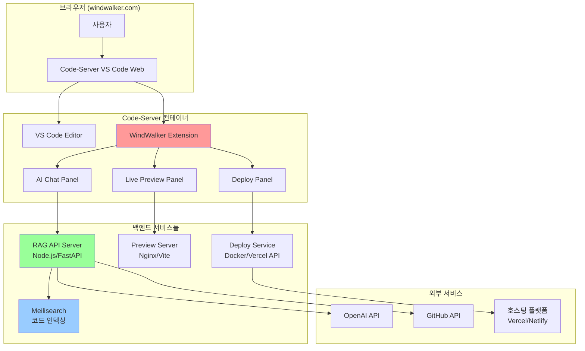

# 00. WindWalker 프로덕트-디자인 헌법

-   **전체 프로젝트의 뼈대 및 맥락 제공:** 이 문서는 WindWalker IDE의 핵심 기능을 웹 기반으로 구현한 클론 프로젝트의 목표, 기능, 기술 스택 등 모든 것을 정의합니다.
-   **모든 개발/설계/코드 작성의 기준점:** 새로운 기능을 추가하거나 기존 코드를 수정할 때, 이 문서를 최우선으로 참고해야 합니다.
-   **LLM 및 개발자가 반드시 준수해야 할 규칙 명시:** 아래 규칙들은 프로젝트의 일관성과 품질을 유지하기 위한 핵심 약속입니다.
    -   **명시적인 의도(주석):** 모든 주요 함수/모듈 상단에는 `[의도] ...`와 `[책임] ...` 형식으로 주석을 작성하여 의도와 책임을 명확히 해야 합니다.
    -   **헌법 준수:** 새로운 기능 개발 시 본 헌법의 설계와 원칙을 반드시 준수해야 합니다.
    -   **불확실성 명시:** 불확실하거나 논의가 필요한 부분은 `[불확실한 부분] ...` 또는 `TODO`, `FIXME` 등으로 명시하고 피드백을 요청해야 합니다.
    -   **설계 철학 준수:** Claude, ChatGPT 등 LLM은 이 문서의 설계 철학(UI/UX 가이드라인, 기술 스택 등)에서 벗어나는 코드를 생성해서는 안 됩니다.
    -   **문서 수정 원칙:** 문서 수정이나 통합 시에는 해당 항목을 업데이트하거나 새로운 항목을 추가하되, **기존 내용을 삭제해야 할 경우에는 반드시 사전에 상의 후 반영합니다.**
-   **보안 원칙:**
    -   API 키 및 민감정보는 반드시 서버사이드에서 관리, 클라이언트 노출 금지
    -   사용자 코드 및 프로젝트 정보는 암호화하여 저장
    -   웹 기반 코드 실행 시 샌드박스 환경 구축 필수
-   **문서 동기화: 살아있는 기록으로서의 두 문서**
    -   **`pdd-windwalker.md` (헌법 & 청사진):** 이 문서는 프로젝트의 '왜'와 '무엇'을 정의합니다. 시스템의 비전, 아키텍처, 핵심 원칙 등은 항상 이 문서를 기준으로 하며, 큰 방향성의 변경이 있을 때만 수정됩니다. 모든 참여자(기획, 개발, 디자인, AI)는 의사결정 시 이 문서를 최우선 기준으로 삼아야 합니다.
    -   **`develop-guide.md` (개발 일지 & 실행 기록):** 이 문서는 프로젝트의 '어떻게'를 시간순으로 기록합니다. 개발 환경 설정, 데이터베이스 스키마 변경, 특정 기능의 구체적인 구현 과정, 문제 해결 기록 등 모든 기술적 세부사항과 이력을 빠짐없이 기록합니다. 이는 프로젝트의 히스토리를 추적하고 신규 참여자가 빠르게 맥락을 파악하는 데 도움을 줍니다.
-   **현재 상태와 목표:** 현재 아키텍처는 단일 사용자를 위한 개발 및 프로토타이핑 환경(Phase 1)입니다. 최종 목표는 각 사용자가 격리된 Docker 컨테이너 환경을 할당받는 멀티테넌트(Multi-tenant) 클라우드 IDE입니다. 모든 설계와 개발은 이 최종 목표를 지향해야 합니다.

-----

목표 :  Replit/Lovable과 동일한 수준의 통합 개발 환경 구축
 

최종 사용자 경험
1. 브라우저에서 windwalker.com 접속
2. "새 프로젝트 만들기" → React/Next.js 템플릿 선택
3. VS Code 인터페이스에서 코딩
4. 우측 AI 채팅: "@Codebase 로그인 기능 추가해줘"
5. 우측 프리뷰: 실시간으로 앱 미리보기
6. "배포하기" 버튼 → 즉시 웹 호스팅

기술 스택 
Code-Server + VS Code Extensions + Docker +  RAG 시스템


# WindWalker 완전한 아키텍처 (Phase 1-3)

## 🏗️ 전체 시스템 구조 (기존)



## 📋 Phase별 상세 구현 가이드

### Phase 1: Code-Server 기본 환경 ✅
**목표**: Monaco Editor → VS Code Web 대체

- Docker Compose로 Code-Server 실행 (최종 목표)
- 현재: Firebase Studio의 Nix 환경에 직접 설치하여 프로토타이핑
- 기본 템플릿 (React, Next.js) 제공
- VS Code 네이티브 환경 구축


#### 1.1 Docker Compose 설정
# docker-compose.yml
version: '3.8'

services:
  # Code-Server (VS Code Web)
  code-server:
    image: codercom/code-server:latest
    container_name: windwalker-ide
    ports:
      - "8080:8080"
    volumes:
      # 워크스페이스 (사용자 프로젝트)
      - ./workspace:/home/coder/workspace
      # VS Code 확장 및 설정
      - ./extensions:/home/coder/.local/share/code-server/extensions
      - ./vscode-config:/home/coder/.local/share/code-server/User
      # Docker 소켓 (컨테이너 내에서 Docker 사용)
      - /var/run/docker.sock:/var/run/docker.sock
    environment:
      - PASSWORD=windwalker2024
      - DOCKER_USER=coder
    user: "1000:1000"
    restart: unless-stopped
    command: >
      --bind-addr 0.0.0.0:8080
      --user-data-dir /home/coder/.local/share/code-server
      --extensions-dir /home/coder/.local/share/code-server/extensions
      --disable-telemetry
      /home/coder/workspace

  # 개발용 프리뷰 서버 (나중에 사용)
  preview-server:
    image: nginx:alpine
    container_name: windwalker-preview  
    ports:
      - "3000:80"
    volumes:
      - ./workspace/dist:/usr/share/nginx/html
    restart: unless-stopped
    depends_on:
      - code-server

  # 향후 RAG API 서버 (Phase 3에서 활성화)
  # api-server:
  #   build: ./api-server
  #   container_name: windwalker-api
  #   ports:
  #     - "3001:3001"
  #   environment:
  #     - NODE_ENV=development
  #   restart: unless-stopped

volumes:
  workspace_data:
  extensions_data:


#### 1.2 설치 및 초기화 스크립트트
#!/bin/bash

# setup.sh - WindWalker Code-Server 환경 구축 스크립트

echo "🚀 WindWalker Code-Server 환경 구축 시작..."

# 1. 프로젝트 구조 생성
echo "📁 프로젝트 구조 생성..."
mkdir -p workspace/{templates,projects}
mkdir -p extensions
mkdir -p vscode-config
mkdir -p logs

# 2. 기본 템플릿 프로젝트 생성
echo "📋 기본 템플릿 생성..."

# React 템플릿
mkdir -p workspace/templates/react-app
cat > workspace/templates/react-app/package.json << 'EOF'
{
  "name": "react-template",
  "version": "1.0.0",
  "private": true,
  "scripts": {
    "dev": "vite",
    "build": "vite build",
    "preview": "vite preview"
  },
  "dependencies": {
    "react": "^18.2.0",
    "react-dom": "^18.2.0"
  },
  "devDependencies": {
    "@types/react": "^18.2.0",
    "@types/react-dom": "^18.2.0",
    "@vitejs/plugin-react": "^4.0.0",
    "vite": "^4.4.0"
  }
}
EOF

cat > workspace/templates/react-app/index.html << 'EOF'
<!DOCTYPE html>
<html lang="en">
<head>
  <meta charset="UTF-8" />
  <meta name="viewport" content="width=device-width, initial-scale=1.0" />
  <title>WindWalker App</title>
</head>
<body>
  <div id="root"></div>
  <script type="module" src="/src/main.jsx"></script>
</body>
</html>
EOF

mkdir -p workspace/templates/react-app/src
cat > workspace/templates/react-app/src/main.jsx << 'EOF'
import React from 'react'
import ReactDOM from 'react-dom/client'
import App from './App.jsx'
import './index.css'

ReactDOM.createRoot(document.getElementById('root')).render(
  <React.StrictMode>
    <App />
  </React.StrictMode>,
)
EOF

cat > workspace/templates/react-app/src/App.jsx << 'EOF'
import { useState } from 'react'
import './App.css'

function App() {
  const [count, setCount] = useState(0)

  return (
    <div className="App">
      <div>
        <h1>WindWalker</h1>
        <div className="card">
          <button onClick={() => setCount((count) => count + 1)}>
            count is {count}
          </button>
          <p>
            Edit <code>src/App.jsx</code> and save to test HMR
          </p>
        </div>
        <p className="read-the-docs">
          Click on the WindWalker logo to learn more
        </p>
      </div>
    </div>
  )
}

export default App
EOF

cat > workspace/templates/react-app/src/App.css << 'EOF'
.App {
  text-align: center;
  padding: 2em;
}

.card {
  padding: 2em;
}

button {
  border-radius: 8px;
  border: 1px solid transparent;
  padding: 0.6em 1.2em;
  font-size: 1em;
  font-weight: 500;
  font-family: inherit;
  background-color: #1a1a1a;
  color: white;
  cursor: pointer;
  transition: border-color 0.25s;
}

button:hover {
  border-color: #646cff;
}
EOF

cat > workspace/templates/react-app/src/index.css << 'EOF'
body {
  margin: 0;
  font-family: -apple-system, BlinkMacSystemFont, 'Segoe UI', 'Roboto', 'Oxygen',
    'Ubuntu', 'Cantarell', 'Fira Sans', 'Droid Sans', 'Helvetica Neue',
    sans-serif;
  -webkit-font-smoothing: antialiased;
  -moz-osx-font-smoothing: grayscale;
}
EOF

cat > workspace/templates/react-app/vite.config.js << 'EOF'
import { defineConfig } from 'vite'
import react from '@vitejs/plugin-react'

export default defineConfig({
  plugins: [react()],
  server: {
    host: '0.0.0.0',
    port: 3000
  }
})
EOF

# Next.js 템플릿
mkdir -p workspace/templates/nextjs-app
cat > workspace/templates/nextjs-app/package.json << 'EOF'
{
  "name": "nextjs-template",
  "version": "0.1.0",
  "private": true,
  "scripts": {
    "dev": "next dev",
    "build": "next build",
    "start": "next start",
    "lint": "next lint"
  },
  "dependencies": {
    "next": "14.0.0",
    "react": "^18.2.0",
    "react-dom": "^18.2.0"
  },
  "devDependencies": {
    "@types/node": "^20.0.0",
    "@types/react": "^18.2.0",
    "@types/react-dom": "^18.2.0",
    "eslint": "^8.0.0",
    "eslint-config-next": "14.0.0",
    "typescript": "^5.0.0"
  }
}
EOF

# 3. VS Code 기본 설정
echo "⚙️ VS Code 설정..."
cat > vscode-config/settings.json << 'EOF'
{
  "workbench.colorTheme": "Dark+ (default dark)",
  "editor.fontSize": 14,
  "editor.tabSize": 2,
  "editor.insertSpaces": true,
  "editor.formatOnSave": true,
  "files.autoSave": "afterDelay",
  "files.autoSaveDelay": 1000,
  "terminal.integrated.shell.linux": "/bin/bash",
  "extensions.autoUpdate": false,
  "workbench.startupEditor": "welcomePage"
}
EOF

# 4. 기본 확장 목록 생성
cat > extensions/install-extensions.sh << 'EOF'
#!/bin/bash
# VS Code 확장 자동 설치 스크립트

echo "📦 기본 확장 설치 중..."

# 필수 확장들
extensions=(
  "ms-vscode.vscode-typescript-next"
  "bradlc.vscode-tailwindcss" 
  "esbenp.prettier-vscode"
  "ms-vscode.vscode-json"
  "ritwickdey.liveserver"
  "formulahendry.auto-rename-tag"
  "christian-kohler.path-intellisense"
  "ms-vscode.vscode-css-peek"
)

for ext in "${extensions[@]}"; do
  echo "Installing $ext..."
  code-server --install-extension "$ext" --force
done

echo "✅ 확장 설치 완료!"
EOF

chmod +x extensions/install-extensions.sh


# 5. 헬퍼 스크립트들
cat > start.sh << 'EOF'
#!/bin/bash
echo "🚀 WindWalker 시작 중..."
docker-compose up -d
echo "✅ WindWalker가 시작되었습니다!"
echo "🌐 IDE 접속: http://localhost:8080 (패스워드: windwalker2024)"
echo "🔍 프리뷰: http://localhost:3000"
echo ""
echo "📋 유용한 명령어:"
echo "  docker-compose logs -f code-server  # 로그 확인"
echo "  docker-compose down                 # 서비스 종료"
echo "  ./stop.sh                           # 빠른 종료"
EOF

cat > stop.sh << 'EOF'
#!/bin/bash
echo "🛑 WindWalker 종료 중..."
docker-compose down
echo "✅ WindWalker가 종료되었습니다."
EOF

chmod +x start.sh stop.sh

# 6. 권한 설정
echo "🔒 권한 설정..."
sudo chown -R 1000:1000 workspace extensions vscode-config
chmod -R 755 workspace extensions vscode-config

echo ""
echo "🎉 WindWalker Code-Server 환경 구축 완료!"
echo ""
echo "다음 단계:"
echo "1. docker-compose up -d        # 서비스 시작"
echo "2. http://localhost:8080 접속  # IDE 사용 (패스워드: windwalker2024)"
echo "3. 또는 ./start.sh 실행        # 간편 시작"
echo ""
echo "📁 프로젝트 구조:"
echo "├── workspace/          # 사용자 프로젝트 공간"
echo "│   ├── templates/      # 프로젝트 템플릿"
echo "│   └── projects/       # 사용자 프로젝트"
echo "├── extensions/         # VS Code 확장"
echo "└── vscode-config/      # VS Code 설정"


#### 1.3 Phase 1 완료 후 프로젝트 구성

# WindWalker Phase 1: 프로젝트 구조

```
windwalker/
├── docker-compose.yml               # 🆕 메인 서비스 구성
├── setup.sh                        # 🆕 자동 설치 스크립트  
├── start.sh                        # 🆕 빠른 시작
├── stop.sh                         # 🆕 빠른 종료
│
├── workspace/                       # 🆕 사용자 작업 공간
│   ├── templates/                   # 프로젝트 템플릿
│   │   ├── react-app/
│   │   │   ├── package.json
│   │   │   ├── src/App.jsx
│   │   │   └── vite.config.js
│   │   └── nextjs-app/
│   │       ├── package.json
│   │       └── pages/
│   └── projects/                    # 사용자 프로젝트 저장소
│
├── extensions/                      # 🆕 VS Code 확장
│   └── install-extensions.sh
│
├── vscode-config/                   # 🆕 VS Code 설정
│   └── settings.json
│
└── logs/                           # 🆕 로그 파일
```

## Phase 1 주요 변경사항

### 2. Code-Server 도입
- Docker Compose 기반 VS Code Web 환경
- 브라우저에서 완전한 VS Code 경험 제공
- 현재 Monaco Editor 대신 네이티브 VS Code Editor 사용

### 3. 개발 환경 표준화
- React, Next.js 프로젝트 템플릿 제공
- 자동 확장 설치 및 설정
- 원클릭 시작/종료 스크립트

### 4. 미래 확장성 고려
- Phase 2에서 추가할 우측 패널을 위한 구조 준비
- Phase 3에서 RAG 시스템 통합을 위한 API 서버 슬롯 예약

## 다음 단계 준비사항

### Phase 2 예정 작업
- VS Code 확장 개발로 우측 AI 채팅 패널 추가
- Live Preview 패널 구현
- 기본 GPT API 연동

### Phase 3 예정 작업  
- 현재 Meilisearch RAG 시스템을 API 서버로 분리
- AI 채팅과 RAG 시스템 연동
- @Codebase 명령어 구현


### Phase 2: VS Code 확장 및 UI 재사용 아키텍처 도입
**목표**: AI 채팅/프리뷰 패널을 공통 UI 모듈로 구현하고, VS Code 확장을 중앙 허브로 사용하여 시스템 전체를 제어하는 아키텍처를 수립합니다.

#### 2.1 변경된 아키텍처 원칙

`docs/05`와 `docs/06` 문서를 통해 우리는 더 효율적이고 확장 가능한 아키텍처를 도입하기로 결정했습니다. 기존의 단순한 패널 추가 방식에서 벗어나, 다음과 같은 두 가지 핵심 원칙을 기반으로 시스템을 재설계합니다.

##### 1. VS Code 확장을 '중앙 허브'로 사용하는 이유

WindWalker 아키텍처에서 **VS Code 확장(WindWalker Extension)**은 단순한 추가 기능이 아니라, 시스템의 모든 개발 관련 작업을 조율하는 **중앙 허브(Central Hub) 또는 오케스트레이터(Orchestrator)** 역할을 수행합니다.

-   **전문적인 설명:** VS Code는 파일 시스템 접근, 터미널 명령어 실행, 소스 코드 분석(LSP), 디버깅 등 로컬 개발 환경과 상호작용할 수 있는 강력하고 안정적인 API 집합을 제공합니다. WindWalker 확장은 이 API들을 활용하여 **사용자 인터페이스(Webview 패널)와 실제 개발 작업(코드 수정, 빌드, 검색) 사이를 연결하는 '브리지(Bridge)'** 역할을 수행합니다. AI 채팅창에서 "파일 찾아줘"라는 요청이 오면, 확장은 VS Code의 파일 API를 호출합니다. "코드 실행해줘"라는 요청이 오면, 확장은 터미널 API를 사용합니다. 이러한 로직을 확장 프로그램에 중앙화함으로써, 우리는 각 기능(채팅, 프리뷰, 배포)이 개별적으로 파일 시스템이나 터미널을 제어할 필요 없이, 확장에게 **"작업을 위임"** 할 수 있습니다. 이는 **관심사의 분리(Separation of Concerns)** 원칙을 따르는 효율적인 설계입니다.

##### 2. AI 채팅/프리뷰 패널의 UI 재사용 전략

"프로토타이핑 모드"와 "코드 모드"에서 일관된 사용자 경험을 제공하고 개발 효율을 극대화하기 위해, 우리는 **UI 컴포넌트를 각 모드의 실행 로직과 분리하여 재사용**하는 전략을 채택합니다.

-   **전문적인 설명:** 이 아키텍처는 **"어댑터 패턴(Adapter Pattern)"**의 변형으로 볼 수 있습니다. **`ui-core`** 라이브러리는 모든 환경(웹, VS Code 웹뷰)에서 재사용 가능한 순수 UI 컴포넌트(View)의 집합입니다. 각 환경은 자신만의 **"어댑터(Adapter)"**를 가집니다. **프로토타이핑 모드**의 어댑터는 React의 `useState`, `useEffect` 훅과 `fetch` API를 사용하여 상태 관리와 서버 통신을 처리합니다. 반면, **코드 모드**의 어댑터(VS Code 확장)는 `postMessage`를 통해 웹뷰와 통신하고 VS Code API를 호출하여 동일한 비즈니스 로직을 수행합니다. 이처럼 View는 공유하되, 그 View를 제어하는 Controller(또는 ViewModel)는 각 환경에 맞게 별도로 구현함으로써, UI의 일관성과 개발 생산성을 모두 달성할 수 있습니다.

---

#### 2.2 변경된 전체 시스템 구조

이러한 새로운 원칙을 반영하면, 전체 시스템 구조는 다음과 같이 변경됩니다. 가장 큰 변화는 **WindWalker Extension이 모든 상호작용의 중심**이 되고, **UI(WebView)가 명확히 분리**되는 점입니다.

```mermaid
graph TD
    subgraph "사용자 인터페이스 (공통 UI 라이브러리)"
        A["AI 채팅 WebView<br/>(ui-core)"]
        B["프리뷰 WebView<br/>(ui-core)"]
    end

    subgraph "중앙 허브 (Code-Server 컨테이너)"
        C[VS Code Editor]
        D[<b>WindWalker Extension</b>]
    end

    subgraph "백엔드 서비스들"
        H[RAG API<br/>(코드 분석/검색)"]
        I[Build & Preview Service<br/>(Vite/Next.js HMR)"]
        J[Deploy Service]
    end
    
    subgraph "외부 서비스"
        K[LLM API]
        L[호스팅 플랫폼 API<br/>(Vercel/Netlify)]
    end

    A -- "postMessage(...)" --> D
    B -- "postMessage(...)" --> D

    D -- "VS Code API<br/>(File, Terminal, etc.)" --> C
    D -- "HTTP/RPC" --> H
    D -- "HTTP/RPC" --> I
    D -- "HTTP/RPC" --> J
    
    H -- "LLM Prompt" --> K
    J -- "Deploy" --> L

    style D fill:#ff9999
    style H fill:#99ccff

```

-   **변경점 (시각적 비교):**
    -   **중앙 집중화:** 기존 아키텍처에서는 AI 채팅 패널(E)이 RAG API(I)와 직접 통신하는 것처럼 보였지만, 변경된 구조에서는 모든 통신이 **WindWalker Extension(D)을 통해 중앙에서 관리**됩니다.
    -   **UI 분리:** AI 채팅 패널과 프리뷰 패널이 **WebView**라는 독립된 UI 계층으로 명확히 분리되었습니다. 이들은 더 이상 확장의 일부가 아니라, 확장에 의해 제어되는 웹 페이지입니다.
    -   **서비스 역할 명확화:** 백엔드 서비스들이 더 명확한 역할(RAG, 빌드/프리뷰, 배포)을 가지게 되었습니다.


### Phase 3: RAG 시스템 통합 (3-4주)
**목표**: Meilisearch + 완전한 코드베이스 이해 AI

#### 3.1 Meilisearch 서버 구축
```yaml
# docker-compose.yml에 추가
services:
  meilisearch:
    image: getmeili/meilisearch:v1.5
    container_name: windwalker-search
    ports:
      - "7700:7700"
    environment:
      - MEILI_ENV=development
      - MEILI_MASTER_KEY=windwalker-search-key
    volumes:
      - search_data:/meili_data
    restart: unless-stopped

volumes:
  search_data:
```

#### 3.2 RAG API 서버 구현
```typescript
// api-server/src/app.ts
import express from 'express';
import { MeiliSearch } from 'meilisearch';
import OpenAI from 'openai';

const app = express();
const client = new MeiliSearch({
  host: 'http://meilisearch:7700',
  apiKey: 'windwalker-search-key'
});

// 코드 인덱싱 엔드포인트
app.post('/api/index-codebase', async (req, res) => {
  const { projectPath } = req.body;
  
  // 1. 프로젝트 파일 스캔
  const files = await scanProjectFiles(projectPath);
  
  // 2. AST 파싱 및 심볼 추출
  const symbols = await extractSymbols(files);
  
  // 3. Meilisearch에 인덱싱
  const index = client.index('codebase');
  await index.addDocuments(symbols);
  
  res.json({ indexed: symbols.length });
});

// RAG 검색 엔드포인트  
app.post('/api/search-codebase', async (req, res) => {
  const { query } = req.body;
  
  // 1. Meilisearch에서 관련 코드 검색
  const index = client.index('codebase');
  const searchResults = await index.search(query, {
    limit: 10,
    attributesToHighlight: ['content', 'symbol_name']
  });
  
  // 2. LLM에 컨텍스트 제공
  const context = searchResults.hits.map(hit => hit.content).join('\n\n');
  
  const completion = await openai.chat.completions.create({
    model: "gpt-4",
    messages: [
      {
        role: "system", 
        content: `You are an expert developer. Use this codebase context to answer questions:\n\n${context}`
      },
      { role: "user", content: query }
    ]
  });
  
  res.json({
    answer: completion.choices[0].message.content,
    sources: searchResults.hits
  });
});
```

#### 3.3 실시간 코드 인덱싱
```typescript
// api-server/src/services/CodeIndexer.ts
export class CodeIndexer {
  private watcher: chokidar.FSWatcher;
  
  startWatching(projectPath: string) {
    this.watcher = chokidar.watch(projectPath, {
      ignored: /node_modules|\.git/
    });
    
    this.watcher.on('change', async (filePath) => {
      await this.indexFile(filePath);
    });
  }
  
  private async indexFile(filePath: string) {
    // 1. 파일 내용 읽기
    const content = await fs.readFile(filePath, 'utf-8');
    
    // 2. AST 파싱 (tree-sitter 사용)
    const parser = new Parser();
    parser.setLanguage(getLanguage(filePath));
    const tree = parser.parse(content);
    
    // 3. 심볼 추출
    const symbols = extractSymbolsFromAST(tree, filePath, content);
    
    // 4. Meilisearch 업데이트
    const index = this.client.index('codebase');
    await index.addDocuments(symbols);
  }
}
```

## 🎯 최종 사용자 경험 구현

### 1. 프로젝트 생성 플로우
```typescript
// 확장에서 "새 프로젝트" 명령어
vscode.commands.registerCommand('windwalker.createProject', async () => {
  const template = await vscode.window.showQuickPick([
    'React + Vite',
    'Next.js',
    'Vue.js', 
    'Svelte'
  ]);
  
  // 템플릿 복사 및 초기 인덱싱
  await createProjectFromTemplate(template);
  await indexNewProject();
});
```

### 2. @Codebase 명령어 구현
```typescript
// AI 채팅에서 @Codebase 감지
private async handleChatMessage(text: string) {
  if (text.startsWith('@Codebase')) {
    const query = text.replace('@Codebase', '').trim();
    
    // RAG API 서버 호출
    const response = await fetch('http://localhost:3001/api/search-codebase', {
      method: 'POST',
      headers: { 'Content-Type': 'application/json' },
      body: JSON.stringify({ query })
    });
    
    const result = await response.json();
    
    // 소스 코드와 함께 답변 표시
    this.displayAnswer(result.answer, result.sources);
  }
}
```

### 3. 원클릭 배포
```typescript
// Deploy 패널에서 배포 버튼
vscode.commands.registerCommand('windwalker.deploy', async () => {
  // 1. 프로젝트 빌드
  await vscode.tasks.executeTask(buildTask);
  
  // 2. Vercel/Netlify API로 배포
  const deployUrl = await deployToVercel();
  
  // 3. 결과 표시
  vscode.window.showInformationMessage(`🚀 배포 완료: ${deployUrl}`);
});
```

## 📦 최종 docker-compose.yml
```yaml
version: '3.8'
services:
  code-server:
    image: codercom/code-server:latest
    # ... 기존 설정
    
  meilisearch:
    image: getmeili/meilisearch:v1.5
    ports: ["7700:7700"]
    
  rag-api:
    build: ./api-server
    ports: ["3001:3001"]
    depends_on: [meilisearch]
    
  preview-server:
    image: nginx:alpine
    ports: ["3000:80"]
```

이렇게 구축하면 Replit/Lovable과 동일한 수준의 통합 개발 환경이 완성됩니다!
