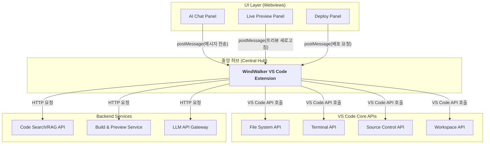

# 00. WindWalker 프로덕트-디자인 헌법

-   **전체 프로젝트의 뼈대 및 맥락 제공:** 이 문서는 WindWalker IDE의 핵심 기능을 웹 기반으로 구현한 클론 프로젝트의 목표, 기능, 기술 스택 등 모든 것을 정의합니다.
-   **모든 개발/설계/코드 작성의 기준점:** 새로운 기능을 추가하거나 기존 코드를 수정할 때, 이 문서를 최우선으로 참고해야 합니다.
-   **LLM 및 개발자가 반드시 준수해야 할 규칙 명시:** 아래 규칙들은 프로젝트의 일관성과 품질을 유지하기 위한 핵심 약속입니다.
    -   **명시적인 의도(주석):** 모든 주요 함수/모듈 상단에는 `[의도] ...`와 `[책임] ...` 형식으로 주석을 작성하여 의도와 책임을 명확히 해야 합니다.
    -   **헌법 준수:** 새로운 기능 개발 시 본 헌법의 설계와 원칙을 반드시 준수해야 합니다.
    -   **불확실성 명시:** 불확실하거나 논의가 필요한 부분은 `[불확실한 부분] ...` 또는 `TODO`, `FIXME` 등으로 명시하고 피드백을 요청해야 합니다.
    -   **설계 철학 준수:** Claude, ChatGPT 등 LLM은 이 문서의 설계 철학(UI/UX 가이드라인, 기술 스택 등)에서 벗어나는 코드를 생성해서는 안 됩니다.
    -   **문서 수정 원칙:** 문서 수정이나 통합 시에는 해당 항목을 업데이트하거나 새로운 항목을 추가하되, **기존 내용을 삭제해야 할 경우에는 반드시 사전에 상의 후 반영합니다.**
-   **보안 원칙:**
    -   API 키 및 민감정보는 반드시 서버사이드에서 관리, 클라이언트 노출 금지
    -   사용자 코드 및 프로젝트 정보는 암호화하여 저장
    -   웹 기반 코드 실행 시 샌드박스 환경 구축 필수
-   **문서 동기화: 살아있는 기록으로서의 두 문서**
    -   **`pdd-windwalker.md` (헌법 & 청사진):** 이 문서는 프로젝트의 '왜'와 '무엇'을 정의합니다. 시스템의 비전, 아키텍처, 핵심 원칙 등은 항상 이 문서를 기준으로 하며, 큰 방향성의 변경이 있을 때만 수정됩니다. 모든 참여자(기획, 개발, 디자인, AI)는 의사결정 시 이 문서를 최우선 기준으로 삼아야 합니다.
    -   **`develop-guide.md` (개발 일지 & 실행 기록):** 이 문서는 프로젝트의 '어떻게'를 시간순으로 기록합니다. 개발 환경 설정, 데이터베이스 스키마 변경, 특정 기능의 구체적인 구현 과정, 문제 해결 기록 등 모든 기술적 세부사항과 이력을 빠짐없이 기록합니다. 이는 프로젝트의 히스토리를 추적하고 신규 참여자가 빠르게 맥락을 파악하는 데 도움을 줍니다.

-----

# 🎯 1. 프로젝트 목표

## 1.1 비즈니스 목표

-   **주요 목표:** 코딩 경험이 없는 비개발자(기획자, 디자이너, 마케터 등)가 아이디어를 빠르게 웹 애플리케이션으로 구현할 수 있는 대화형 AI 기반 프로토타이핑 툴 제공.
-   **부가 목표:** 오픈소스 커뮤니티를 통해 개발자 생태계를 확장하고, '프로토타이핑 모드'와 '코드 모드'를 연결하여 아이디어 구체화부터 전문 개발까지의 과정을 매끄럽게 지원.
-   **수익 목표:** 1년 내 월 10,000 MAU 달성을 목표로, 개인 및 팀을 위한 프리미엄 구독 모델 도입.

## 1.2 기술적 목표

-   **사용성:** AI 채팅과 실시간 프리뷰만으로 앱의 핵심 기능 구현이 가능하도록 직관적인 UX 제공.
-   **성능:** AI 응답 시간 1~3초 이내, 코드 변경 후 프리뷰 업데이트 2초 이내.
-   **확장성:** 동시 사용자 1,000명의 개별적인 개발 환경(Docker 컨테이너)을 안정적으로 처리.

## 1.3 사용자 목표

-   **타겟 사용자:**
    -   **Primary:** 자신의 아이디어를 빠르게 눈으로 확인하고 싶은 비개발자 (기획자, 디자이너, 스타트업 창업가).
    -   **Secondary:** 프로토타입을 기반으로 실제 제품 개발을 진행할 개발자.
-   **핵심 가치:** "Just chat, and see it live." (대화만으로 실시간 결과물을 확인하는 경험)
-   **사용자 경험:** 복잡한 코딩 과정 없이, 자연어 대화를 통해 웹사이트의 구조를 만들고, 기능을 추가하며, 디자인을 수정하는 직관적인 경험 제공.

-----

# 🏗️ 2. 시스템 개요

## 2.1 시스템 비전

WindWalker는 아이디어 구상과 실제 작동하는 결과물 사이의 장벽을 허무는 '대화형 앱 빌더(Conversational App Builder)'입니다. 사용자는 마치 전문가에게 설명하듯 AI와 대화하며, 그 결과가 실시간으로 웹 프리뷰에 반영되는 것을 보며 아이디어를 구체화하고 발전시킬 수 있습니다.

## 2.2 핵심 기능

-   **프로토타이핑 모드 (주요 기능):**
    -   **AI 채팅 패널:** 사용자가 자연어로 요구사항(예: "헤더에 로고랑 내비게이션 바 추가해줘")을 입력하는 메인 인터페이스.
    -   **실시간 프리뷰 패널:** AI가 생성/수정한 코드의 결과물이 즉시 렌더링되는 화면.
-   **코드 모드 (보조 기능):**
    -   **웹 기반 VS Code IDE:** '프로토타이핑 모드'에서 생성된 코드를 확인하고, 개발자가 직접 수정할 수 있는 전문가용 환경.
    -   AI 채팅 및 프리뷰 패널이 동일하게 통합되어 있어 두 모드 간의 경험이 단절되지 않음.
-   **AI 기반 코드 생성 및 수정:** RAG(Retrieval-Augmented Generation) 기술을 통해 프로젝트의 전체 맥락을 이해하고, 사용자의 요구에 맞는 코드를 정확하게 생성 및 수정.
-   **원클릭 배포:** 완성된 프로토타입이나 앱을 클릭 한 번으로 Vercel, Netlify 등 외부 호스팅 플랫폼에 배포.

## 2.3 시스템 특징

-   **대화 우선(Conversation-First) 인터페이스:** 사용자는 코드가 아닌 자연어 대화를 통해 결과물을 만들어냄.
-   **UI/UX 재사용 아키텍처:** '프로토타이핑 모드'와 '코드 모드'는 동일한 UI 컴포넌트(AI 채팅, 프리뷰)를 공유하여 일관된 경험과 개발 효율성 제공.
-   **격리된 개발 환경:** 각 사용자는 독립된 Docker 컨테이너 환경을 할당받아 안정적이고 안전한 개발 경험 보장.
-   **실시간 동기화:** WebSocket을 통해 AI의 코드 수정 사항이 프리뷰에 즉각적으로 반영.

## 2.4 핵심 기술 스택

-   **프론트엔드 (UI Shell & 프로토타이핑 모드):** Next.js 14, React 18, TypeScript, Tailwind CSS, shadcn/ui.
-   **코드 모드 IDE:** Code-Server (VS Code Web).
-   **백엔드 (RAG API, Deploy Service 등):** Node.js, Express, Socket.io, Genkit.
-   **AI 서비스:** OpenAI API (GPT-4), Anthropic Claude API.
-   **코드 인덱싱 및 검색:** Meilisearch 또는 유사 경량 검색 엔진.
-   **인증:** NextAuth.js (GitHub, Google OAuth).
-   **인프라 및 배포:** Docker, Kubernetes (EKS/GKE), Vercel.

-----

# 🏛️ 3. 시스템 구조

## 3.1 전체 시스템 구조: VS Code 확장을 '허브'로 사용하는 이유

WindWalker의 아키텍처에서 **VS Code 확장(WindWalker Extension)**은 단순한 추가 기능이 아닌, 시스템의 모든 개발 관련 작업을 조율하는 **중앙 허브(Central Hub) 또는 오케스트레이터(Orchestrator)** 역할을 수행합니다.

-   **전문적인 설명:** VS Code는 파일 시스템 접근, 터미널 명령어 실행, 소스 코드 분석(LSP), 디버깅 등 로컬 개발 환경과 상호작용할 수 있는 강력하고 안정적인 API 집합을 제공합니다. WindWalker 확장은 이 API들을 활용하여 **사용자 인터페이스(Webview 패널)와 실제 개발 작업(코드 수정, 빌드, 검색) 사이를 연결하는 '브리지(Bridge)'** 역할을 수행합니다. AI 채팅창에서 "파일 찾아줘"라는 요청이 오면, 확장은 VS Code의 파일 API를 호출합니다. "코드 실행해줘"라는 요청이 오면, 확장은 터미널 API를 사용합니다. 이러한 로직을 확장 프로그램에 중앙화함으로써, 우리는 각 기능(채팅, 프리뷰, 배포)이 개별적으로 파일 시스템이나 터미널을 제어할 필요 없이, 확장에게 **"작업을 위임"** 할 수 있습니다. 이는 **관심사의 분리(Separation of Concerns)** 원칙을 따르는 효율적인 설계입니다.


*<center>그림 1: VS Code 확장의 중앙 허브 역할</center>*

## 3.2 컴포넌트 아키텍처: UI 재사용 전략

"프로토타이핑 모드"와 "코드 모드"에서 일관된 사용자 경험을 제공하고 개발 효율을 극대화하기 위해, 우리는 **UI 컴포넌트를 각 모드의 실행 로직과 분리하여 재사용**하는 전략을 채택합니다.

-   **전문적인 설명:** 이 아키텍처는 **"어댑터 패턴(Adapter Pattern)"** 의 변형으로 볼 수 있습니다. **`ui-core`** 라이브러리는 모든 환경(웹, VS Code 웹뷰)에서 재사용 가능한 순수 UI 컴포넌트(View)의 집합입니다. 각 환경은 자신만의 **"어댑터(Adapter)"**를 가집니다. **프로토타이핑 모드**의 어댑터는 React의 `useState`, `useEffect` 훅과 `fetch` API를 사용하여 상태 관리와 서버 통신을 처리합니다. 반면, **코드 모드**의 어댑터(VS Code 확장)는 `postMessage`를 통해 웹뷰와 통신하고 VS Code API를 호출하여 동일한 비즈니스 로직을 수행합니다. 이처럼 View는 공유하되, 그 View를 제어하는 Controller(또는 ViewModel)는 각 환경에 맞게 별도로 구현함으로써, UI의 일관성과 개발 생산성을 모두 달성할 수 있습니다.

```mermaid
graph TD
    subgraph "<b>공통 UI 라이브러리 (ui-core)</b>"
        A[AI Chat Panel UI<br/>(純 React Component)]
        B[Preview Panel UI<br/>(純 React Component)]
    end

    subgraph "<b>프로토타이핑 모드 (Next.js 웹)</b>"
        C["<b>웹 어댑터</b><br/>(useState, fetch API 사용)"] --> A
        C --> B
    end

    subgraph "<b>코드 모드 (VS Code 확장)</b>"
        D["<b>확장 어댑터</b><br/>(postMessage, VS Code API 사용)"] --> A
        D --> B
    end
    
    subgraph "Backend / 로직"
        E[API 서버, 파일 시스템 등]
    end
    
    C -- "HTTP/WebSocket" --> E
    D -- "VS Code API / HTTP" --> E

    style A fill:#D6EAF8
    style B fill:#D6EAF8
```
*<center>그림 2: 어댑터 패턴을 통한 UI 재사용 아키텍처</center>*


## 3.3 보안 구조

-   **인증/인가:** NextAuth.js를 통한 OAuth 2.0 기반 인증.
-   **API 보안:** API Gateway를 통한 Rate Limiting 및 입력 유효성 검사.
-   **코드 실행 보안 (샌드박스):** 모든 사용자 코드와 `code-server`는 격리된 Docker 컨테이너 내에서 실행. 컨테이너는 최소한의 권한만 가지며, 실행 완료 후 파기.
-   **데이터 보안:** 모든 통신은 HTTPS/WSS로 암호화되며, 데이터베이스에 저장되는 민감 정보는 암호화.

## 3.4 주요 개발 항목 (로드맵)

| 단계 | 기능 (Epic) | 세부 작업 (User Story) | 우선순위 |
| :--- | :--- | :--- | :--- |
| **Phase 1: 기반 구축 (MVP)** |
| 1-1 | **IDE 환경 구축** | Nix 환경에 `code-server` 설치 및 `iframe` 연동 | **완료** |
| 1-2 | **문서화** | `pdd-windwalker.md`, `develop-guide.md` 작성 | **완료** |
| 1-3 | **UI 재사용 아키텍처 설계** | `docs/unified-architecture.md` 작성 | **완료** |
| 1-4 | **프로토타이핑 모드 UI** | Next.js 앱에 AI 채팅/프리뷰 패널 기본 레이아웃 구현 | 높음 |
| **Phase 2: 핵심 AI/프리뷰 기능 구현** |
| 2-1 | **VS Code 확장 개발** | AI 채팅/프리뷰 패널을 렌더링하는 기본 확장 프로그램 개발 | 높음 |
| 2-2 | **WebView 통신 아키텍처** | `postMessage` 기반의 UI-확장 간 통신 구현 (`docs/06` 참조) | 높음 |
| 2-3 | **RAG API 서버 (초안)** | 기본적인 코드 검색 및 LLM 연동 API 서버 구축 | 높음 |
| 2-4 | **실시간 프리뷰 연동** | 코드 수정 시 빌드 서비스 호출 및 프리뷰 패널 업데이트 | 중간 |
| **Phase 3: 고급 기능 및 멀티테넌시** |
| 3-1 | **Docker 기반 환경** | 사용자별 격리된 `code-server` 컨테이너 동적 생성/관리 시스템 구축 | 높음 |
| 3-2 | **원클릭 배포** | Vercel/Netlify API 연동을 통한 배포 기능 구현 | 중간 |
| 3-3 | **인증 시스템** | NextAuth.js를 이용한 사용자 로그인 및 프로젝트 관리 | 중간 |
| **Phase 4: 상용화 및 확장** |
| 4-1 | **구독/결제 시스템** | Stripe 연동을 통한 프리미엄 요금제 도입 | 중간 |
| 4-2 | **팀 관리 기능** | 워크스페이스, 멤버 초대, 권한 관리 기능 | 낮음 |

-----

# 📈 8. 그로스해킹 마케팅 전략 (MRD)

## 8.1 시장 및 경쟁 분석

-   **주요 경쟁자:**
    -   **Replit:** 개발자 대상의 강력한 클라우드 IDE. 다수 사용자 협업 및 배포 기능이 강점.
    -   **Lovable / Gamma:** 비개발자 대상의 AI 기반 웹사이트/문서 생성 툴. 사용이 매우 쉽지만, 코드 수정 등 확장성이 제한적.
    -   **Vercel / Netlify:** 프론트엔드 개발자 대상의 배포/호스팅 플랫폼. 개발 환경보다는 배포에 집중.
-   **시장 기회:** 개발자와 비개발자 사이의 간극을 메워주는 서비스가 부족. "쉽게 시작해서(Lovable처럼), 깊게 파고들 수 있는(Replit처럼)" 서비스에 대한 수요 존재.
-   **WindWalker의 차별점:**
    -   **대화형 인터페이스:** 코드가 아닌 자연어 대화가 앱 빌딩의 중심. 비개발자의 진입장벽을 극적으로 낮춤.
    -   **프로토타이핑 → 코드 모드 전환:** 아이디어 구체화 단계부터 실제 개발까지 끊김 없는 경험을 제공. 비개발자의 아이디어를 개발자가 바로 이어받아 작업 가능.
    -   **실시간 시각적 피드백:** AI와의 대화 결과가 즉시 프리뷰에 반영되어, 사용자가 직관적으로 결과물을 확인하고 수정할 수 있음.

## 8.2 AARRR 프레임워크

-   **Acquisition (사용자 획득):**
    -   Product Hunt, BetaList 등 초기 제품 소개 플랫폼 론칭.
    -   디자이너/기획자 커뮤니티(Dribbble, Behance, 브런치 등)에 "코딩 없이 아이디어 구현하기" 콘텐츠 배포.
    -   "10분 만에 랜딩페이지 만들기" 등 튜토리얼 영상 콘텐츠 제작 (YouTube, TikTok).
-   **Activation (활성화):**
    -   첫 방문 시 3단계 이내에 AI와 첫 대화를 시작하고 프리뷰를 볼 수 있는 간결한 온보딩.
    -   "포트폴리오 사이트 만들기", "블로그 만들기" 등 다양한 목적의 템플릿 제공.
-   **Retention (유지):**
    -   개인화된 AI 제안 (사용자의 이전 대화 스타일, 선호하는 디자인 분석).
    -   정기적인 신규 기능 업데이트 (예: "이미지 업로드 기능 추가해줘", "결제 버튼 만들어줘").
-   **Referral (추천):**
    -   "내가 만든 앱 공유하기" 기능. 공유된 링크는 WindWalker 브랜딩 포함.
    -   친구 초대 시 프리미엄 기능(고급 AI 모델 사용 등) 크레딧 제공.
-   **Revenue (수익):**
    -   **Free Tier:** 월별 AI 사용량, 프로젝트 수 제한.
    -   **Pro Tier (개인):** 무제한 AI 사용, 비공개 프로젝트, 커스텀 도메인 연결.
    -   **Team Tier (팀):** 팀원 공동 작업, 공유 라이브러리, 관리자 기능.

-----

# 🔮 10. 향후 발전 계획

-   **AI 고도화:** 사용자의 디자인 선호도를 학습하여 일관된 스타일의 컴포넌트 제안. Figma 디자인을 AI가 인식하여 코드로 변환하는 기능.
-   **백엔드 기능 확장:** "사용자 로그인 기능 추가해줘", "데이터베이스 연결해줘" 등 간단한 백엔드 로직을 대화형으로 생성.
-   **플러그인 마켓플레이스:** 외부 개발자들이 WindWalker에서 사용할 수 있는 AI 프롬프트 템플릿이나 UI 킷을 공유/판매할 수 있는 생태계 구축.
