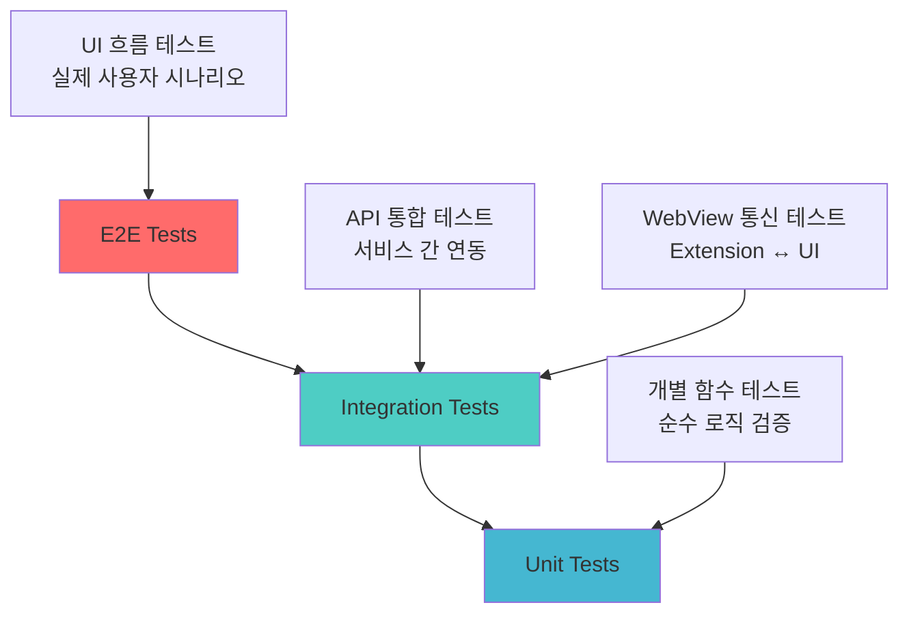
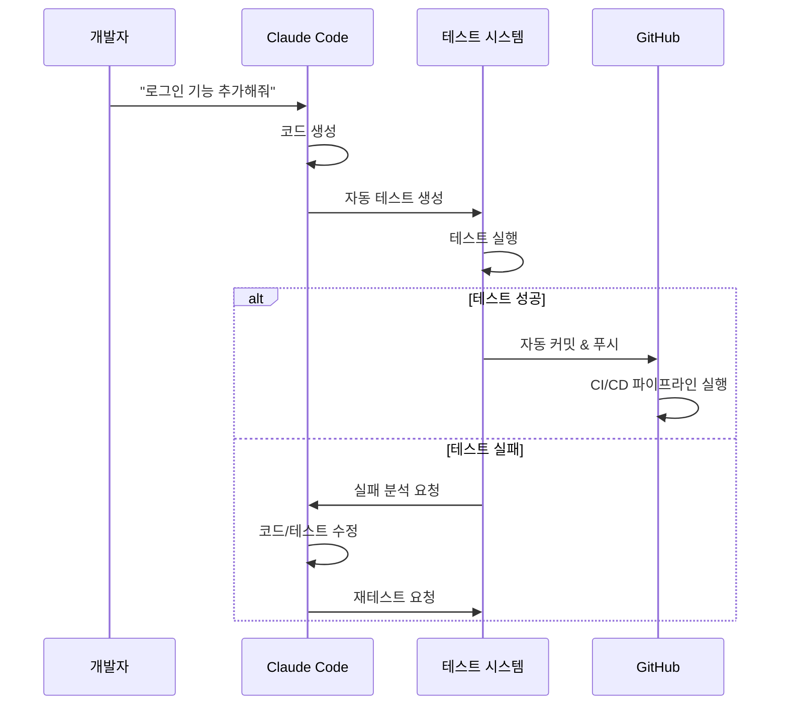

# 통합 테스트 전략 및 SaaS 수준 파이프라인 설계

## 🏗️ 통합 테스트 아키텍처

### 테스트 피라미드



### 테스트 레이어별 책임

#### 1. Unit Tests (70%)
```typescript
// 예시: MessageBridge 단위 테스트
describe('MessageBridge', () => {
  test('should route chat:ready message correctly', () => {
    const bridge = new MessageBridge(mockContext);
    const result = bridge.processMessage({
      type: 'chat:ready',
      timestamp: Date.now()
    });
    expect(result).resolves.toMatchObject({
      type: 'system:info'
    });
  });
});
```

#### 2. Integration Tests (20%)
```typescript
// 예시: Extension ↔ WebView 통합 테스트
describe('Extension WebView Integration', () => {
  test('should complete full chat flow', async () => {
    const extension = await loadExtension();
    const webview = extension.getChatWebView();
    
    // 1. WebView 로드 확인
    await webview.waitForReady();
    
    // 2. 메시지 전송
    await webview.sendMessage('hello');
    
    // 3. 응답 수신 확인
    const response = await webview.waitForResponse();
    expect(response).toContain('Hello! WindWalker');
  });
});
```

#### 3. E2E Tests (10%)
```typescript
// 예시: 전체 워크플로 테스트
describe('Complete User Journey', () => {
  test('should handle project creation to deployment', async () => {
    // 1. 프로젝트 생성
    await page.click('[data-testid="create-project"]');
    await page.selectOption('template', 'react');
    
    // 2. AI 채팅으로 기능 추가
    await page.fill('[data-testid="chat-input"]', 
      '@Codebase 로그인 기능 추가해줘');
    await page.click('[data-testid="send-button"]');
    
    // 3. 코드 생성 확인
    await expect(page.locator('.generated-code')).toBeVisible();
    
    // 4. 프리뷰 업데이트 확인
    await expect(page.frameLocator('#preview')
      .locator('.login-form')).toBeVisible();
  });
});
```

## 🔄 CI/CD 파이프라인 통합

### GitHub Actions 워크플로

```yaml
# .github/workflows/windwalker-ci.yml
name: WindWalker CI/CD Pipeline

on:
  push:
    branches: [main, develop]
  pull_request:
    branches: [main]

jobs:
  unit-tests:
    runs-on: ubuntu-latest
    steps:
      - uses: actions/checkout@v3
      - uses: actions/setup-node@v3
        with:
          node-version: '18'
      
      - name: Install dependencies
        run: npm ci
      
      - name: Run unit tests
        run: npm run test:unit
      
      - name: Upload coverage
        uses: codecov/codecov-action@v3

  integration-tests:
    needs: unit-tests
    runs-on: ubuntu-latest
    steps:
      - uses: actions/checkout@v3
      
      - name: Start test environment
        run: docker-compose -f docker-compose.test.yml up -d
      
      - name: Run integration tests
        run: npm run test:integration
      
      - name: Auto-repair failed tests
        if: failure()
        run: npm run test:auto-repair
      
      - name: Commit auto-fixes
        if: success()
        run: |
          git config --local user.email "action@github.com"
          git config --local user.name "GitHub Action"
          git add .
          git commit -m "🤖 Auto-fix test failures" || exit 0
          git push

  e2e-tests:
    needs: integration-tests
    runs-on: ubuntu-latest
    steps:
      - uses: actions/checkout@v3
      - uses: microsoft/playwright-github-action@v1
      
      - name: Run E2E tests with auto-repair
        run: |
          npm run test:e2e:auto-repair
      
      - name: Generate test report
        if: always()
        run: npm run test:report
      
      - name: Deploy to staging
        if: success() && github.ref == 'refs/heads/develop'
        run: npm run deploy:staging

  production-deploy:
    needs: e2e-tests
    if: github.ref == 'refs/heads/main'
    runs-on: ubuntu-latest
    steps:
      - name: Deploy to production
        run: npm run deploy:production
      
      - name: Run smoke tests
        run: npm run test:smoke:production
      
      - name: Notify team
        uses: 8398a7/action-slack@v3
        with:
          status: ${{ job.status }}
          text: "WindWalker deployed to production!"
```

## 🧪 테스트 커버리지 전략

### 커버리지 목표

| 테스트 유형 | 목표 커버리지 | 현재 상태 | 우선순위 |
|-----------|-------------|---------|---------|
| Unit Tests | 90% | 0% | High |
| Integration | 80% | 20% | High |
| E2E Tests | 70% | 60% | Medium |
| API Tests | 95% | 0% | High |

### 자동 테스트 생성

```typescript
// test-generator-advanced.js
class AdvancedTestGenerator {
  // 사용자 요구사항으로부터 테스트 자동 생성
  async generateFromRequirement(requirement: string): Promise<string> {
    const analysis = await this.analyzeRequirement(requirement);
    
    const testSuite = `
describe('${analysis.feature}', () => {
  ${analysis.scenarios.map(scenario => `
  test('${scenario.description}', async () => {
    ${scenario.steps.map(step => this.generateTestStep(step)).join('\n    ')}
  });
  `).join('\n')}
});`;
    
    return testSuite;
  }
  
  private async analyzeRequirement(requirement: string): Promise<TestAnalysis> {
    // Claude AI를 통한 요구사항 분석
    const prompt = `
    사용자 요구사항: "${requirement}"
    
    다음 형태로 테스트 시나리오를 추출해주세요:
    - 기능명
    - 테스트해야 할 시나리오들
    - 각 시나리오의 단계별 액션
    `;
    
    const response = await this.claudeAPI.generateContent(prompt);
    return JSON.parse(response.content);
  }
}
```

## 🔧 .mcp CLI 명령어 구성

### MCP 서버 설정

```json
// mcp-settings.json
{
  "mcpServers": {
    "windwalker-test": {
      "command": "node",
      "args": ["./mcp-server/test-server.js"],
      "env": {
        "WINDWALKER_ROOT": "/home/user/studio"
      }
    }
  }
}
```

### CLI 명령어 구조

```typescript
// mcp-server/test-server.js
export const tools = [
  {
    name: "windwalker_test_run",
    description: "Run WindWalker tests with auto-repair",
    inputSchema: {
      type: "object",
      properties: {
        mode: {
          type: "string",
          enum: ["unit", "integration", "e2e", "all"],
          description: "Test type to run"
        },
        autoRepair: {
          type: "boolean",
          description: "Enable automatic test repair"
        },
        coverage: {
          type: "boolean", 
          description: "Generate coverage report"
        }
      }
    }
  },
  
  {
    name: "windwalker_test_generate",
    description: "Generate tests from requirements",
    inputSchema: {
      type: "object",
      properties: {
        requirement: {
          type: "string",
          description: "User requirement in natural language"
        },
        testType: {
          type: "string",
          enum: ["unit", "integration", "e2e"],
          description: "Type of test to generate"
        }
      }
    }
  },
  
  {
    name: "windwalker_deploy",
    description: "Deploy WindWalker with full test validation",
    inputSchema: {
      type: "object", 
      properties: {
        environment: {
          type: "string",
          enum: ["staging", "production"],
          description: "Deployment target"
        },
        skipTests: {
          type: "boolean",
          description: "Skip test validation (not recommended)"
        }
      }
    }
  }
];

// 사용 예시:
// Claude Code CLI에서:
// > windwalker_test_run --mode=integration --autoRepair=true
// > windwalker_test_generate --requirement="사용자가 로그인할 수 있어야 함"
// > windwalker_deploy --environment=staging
```

## 🚀 이상적인 워크플로

### 1. 새 기능 구현 플로우



### 2. 명령어 체인

```bash
# 완전 자동화된 기능 개발
claude-code run windwalker_test_generate \
  --requirement="사용자 프로필 편집 기능" \
  --testType="e2e"

claude-code run windwalker_implement_feature \
  --specification="generated-tests/user-profile-edit.spec.ts"

claude-code run windwalker_test_run \
  --mode="all" \
  --autoRepair=true \
  --coverage=true

claude-code run windwalker_deploy \
  --environment="staging" \
  --waitForTests=true
```

## 📊 모니터링 및 메트릭

### 실시간 대시보드

```typescript
// monitoring/dashboard.ts
interface TestMetrics {
  totalTests: number;
  passRate: number;
  avgExecutionTime: number;
  autoRepairSuccessRate: number;
  coveragePercentage: number;
  flakiness: number;
}

class TestDashboard {
  async getMetrics(): Promise<TestMetrics> {
    return {
      totalTests: await this.countTotalTests(),
      passRate: await this.calculatePassRate(),
      avgExecutionTime: await this.getAvgExecutionTime(),
      autoRepairSuccessRate: await this.getRepairSuccessRate(),
      coveragePercentage: await this.getCoveragePercentage(),
      flakiness: await this.calculateFlakiness()
    };
  }
}
```

### 알림 시스템

```yaml
# alert-config.yml
alerts:
  - name: "Test Failure Rate High"
    condition: "pass_rate < 85%"
    action: "slack_notify"
    
  - name: "Auto Repair Failed"
    condition: "repair_success_rate < 70%"
    action: "create_github_issue"
    
  - name: "Coverage Drop"
    condition: "coverage_delta < -5%"
    action: "block_deployment"
```

이 통합 테스트 전략을 통해 WindWalker는 SaaS 수준의 안정성과 자동화를 달성할 수 있습니다! 🎯